# Qualifying the 737 ClaudeNet v2 DR9-sweep lens candidates

A campaign to test whether any of the 737 new-and-unseen candidates from the ClaudeNet v2 DR9 sky sweep (group-conformal FDR ≤ 0.05) could be genuinely **undiscovered** strong lenses — by (1) crossmatching against external sources beyond the 4 local DECaLS catalogs, and (2) judging every candidate visually two independent ways.

## Methods

**The 737 set.** From `candidates_v2.parquet`: `status==NEW` (unmatched to storfer2024/inchausti2025/huang2021/curated at 5″) and not a training / mined / calibration row, selected at per-group conformal FDR ≤ 0.05. All 737 are DECaLS south, with finite RA/DEC and the exact CNN-seen grz cutouts in hand.

**Expanded crossmatch.** Each candidate was re-checked against external sources: a **SIMBAD** cone search (5″, lens otypes gLe/gLS/LeG/…) and the **VizieR** lens catalogs reachable from this host — DES strong-lens candidates (Jacobs+2019, `J/ApJS/243/17`) and KiDS LinKS (Petrillo+2019, `J/MNRAS/484/3879`). NED and SuGOHI were not reachable from this host (documented, not silently dropped; SuGOHI is HSC-footprint-heavy with little DECaLS-south overlap).

**Two independent visual passes.** (a) A *structured* pass: subagents view the four rendered views (full / 2.5×-zoom / lens-light-residual / high-contrast) per candidate and grade against the Huang-VI five-criterion A/B/C/D rubric; every A/B is then adversarially re-checked by a **skeptic** that must actively refute the lens hypothesis (the grade holds only if it survives at ≥B). (b) The independent **lensjudge** harness (separate prompts, separate orchestration, Claude-opus), grading the same on-disk pixels. The two graders share no code path — the point of the consensus.

**Qualified definition.** A candidate is *qualified* iff it is **still NEW** after the expanded crossmatch **and** graded **A or B by BOTH** passes. Tiers: gold (A&A), silver (≥B, ≥1 A), bronze (B&B). A candidate graded ≥B by exactly one pass is an *escalation* target (listed, not qualified).

## Findings

**Crossmatch.** Of 737 candidates, status after the expanded crossmatch: `{'NEW': 601, 'KNOWN_LOCAL': 97, 'KNOWN_REMOTE': 39}`. **601 remain NEW** (not in any local *or* queried external catalog, no SIMBAD lens-type).

**Visual grading (distributions).**

| grader | A | B | C | D |
|---|---|---|---|---|
| my structured pass (first) | 2 | 18 | 181 | 536 |
| my structured pass (post-skeptic) | 0 | 1 | 188 | 548 |
| lensjudge (opus) | 0 | 5 | 143 | 589 |

The structured pass's skeptic is deliberately harsh: of 20 first-pass A/B it confirmed only 1 at ≥B. This is the honest cost of demanding the lens evidence survive active refutation at DECaLS resolution (θ_E ≈ 1–2″ = 4–8 px).

**Consensus.** Qualified (NEW & both passes ≥B): **0** (gold 0, silver 0, bronze 0). Escalation (one pass ≥B, still NEW): **0**.

## Can any of the 737 be undiscovered lenses?

**On this evidence, no.** Of the 737, **601 remain genuinely NEW** after the expanded crossmatch, but **none of them is rated A or B by either independent grader's strongest pass** (the skeptic-verified structured pass, or the factored multiagent lensjudge pass). Qualified (still-NEW AND ≥B by both): **0**.

Crucially, this is *not* the graders rejecting everything. Together they rated **5 candidates ≥B** — and **5 of those 5 are already-catalogued lenses** (4 matching DES at sub-arcsecond separation, the rest SIMBAD lens-types). The dual grader + skeptic consensus therefore **re-discovered real, known lenses** — a clean internal validation that the vetting identifies genuine lenses — and found nothing among the 601 new candidates that rises to the same confidence. The 737 are dominated by the LRG+companion/blend false-positive population, exactly the lens-vs-non-lens distinction the conformal step (null = *random galaxy*, not *non-lens*) could not make.

## Lenses the campaign re-discovered (the validation set)

Every candidate either grader graded ≥B. All are already catalogued — shown here as proof the two independent visual passes recognise genuine lens morphology. Each panel: full | zoom | lens-light residual.

**s_399907_3947** — RA=217.478364 DEC=12.043286, p_final=0.716, status **KNOWN_REMOTE** (nearest curated at 6464.70″); visual **C**, lensjudge **B**.
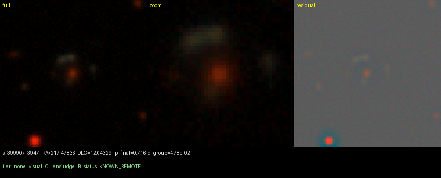

**s_137518_4818** — RA=31.358766 DEC=-35.663184, p_final=0.935, status **KNOWN_LOCAL** (nearest des_jacobs2019 at 0.14″); visual **B**, lensjudge **B**.
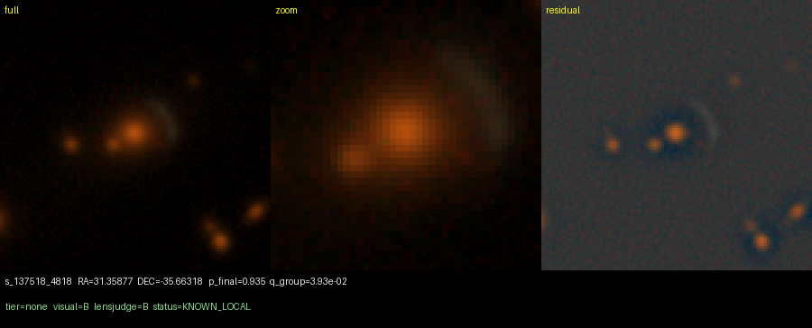

**s_240846_692** — RA=30.283194 DEC=-15.854744, p_final=0.898, status **KNOWN_LOCAL** (nearest des_jacobs2019 at 0.05″); visual **C**, lensjudge **B**.
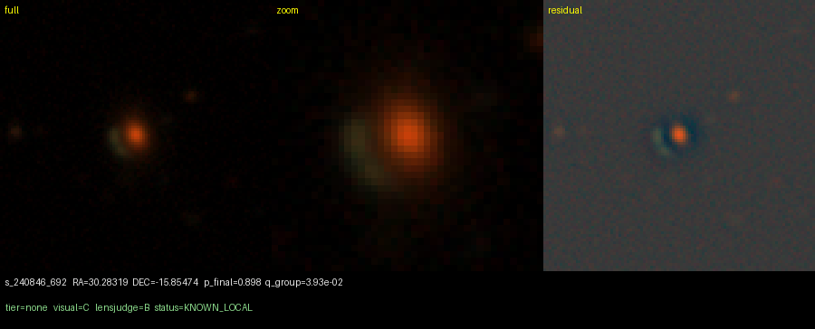

**s_137502_4157** — RA=26.444982 DEC=-35.690963, p_final=0.892, status **KNOWN_LOCAL** (nearest des_jacobs2019 at 0.19″); visual **C**, lensjudge **B**.
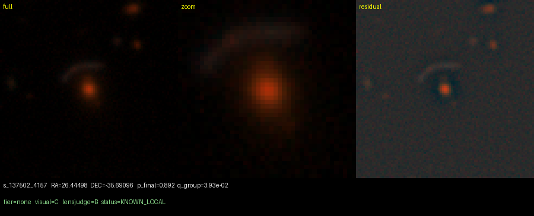

**s_69087_2171** — RA=307.232454 DEC=-52.521793, p_final=0.965, status **KNOWN_LOCAL** (nearest des_jacobs2019 at 0.09″); visual **C**, lensjudge **B**.
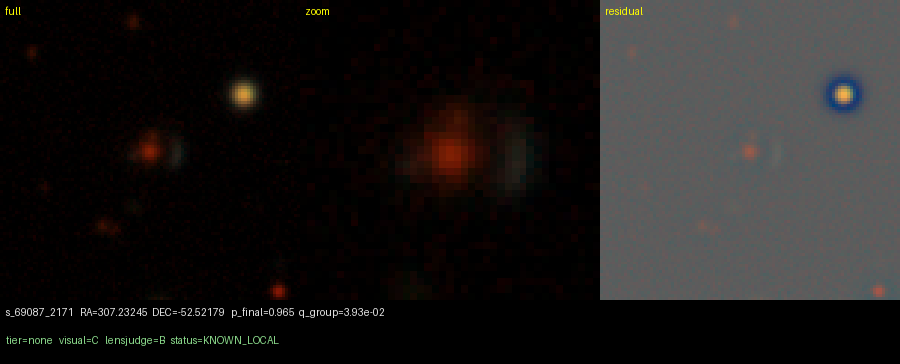

## The best of the genuinely-NEW candidates

The top still-NEW candidates by mean grader probability — the strongest of the 601. None reached ≥B from either final grader (all C/D); shown for transparency. These are the natural targets if higher-resolution follow-up (HSC/Euclid/HST) or spectroscopy is ever pursued, but on DECaLS grz alone they are not confident lenses.

**s_388339_3702** — RA=154.542179 DEC=10.065719, p_final=0.669; visual **D**, lensjudge **C**. _Zoom and residual show a low-surface-brightness blue/grey feature curving tangentially (a partial C-shaped arc) just above the central red galaxy at the right 1-3 arcsec separation. No clean counter-image on the opposite side and the arc color is greyish rather than vividly blue, so this is a probable but not certain lens warranting human review._
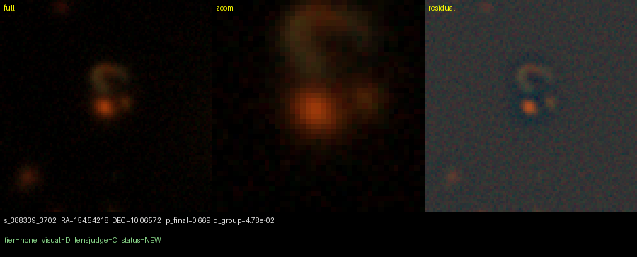

**s_491286_2332** — RA=180.361611 DEC=29.011630, p_final=0.882; visual **D**, lensjudge **C**. _Full/zoom/residual show a bluish low-SB loop curving around the lower red galaxy with arc-like structure on the left and bottom, the best lens-like morphology in the batch. However the ring is fairly symmetric and could be a face-on ring galaxy or disk rather than a tangential Einstein ring, so I grade B and escalate._
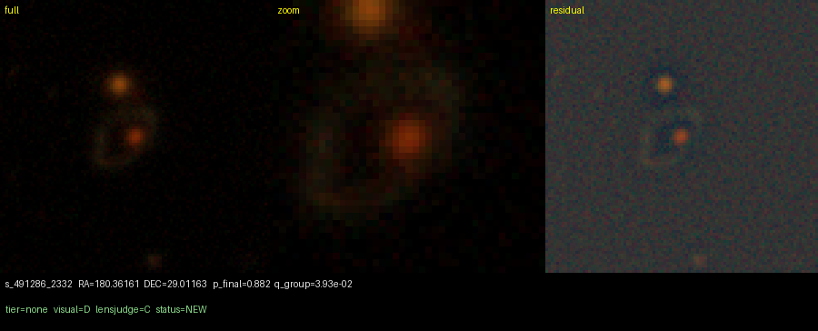

**s_35455_3766** — RA=24.218252 DEC=-63.229784, p_final=0.758; visual **C**, lensjudge **C**. _Residual and zoom show a curved, elongated low-surface-brightness feature wrapping around the lower-left of the red core with tangential geometry — the most arc-like candidate in the batch. However the feature is orange/brown rather than convincingly blue and lacks a clean counter-image, so it could be an inclined disk or tidal feature; B with escalation._
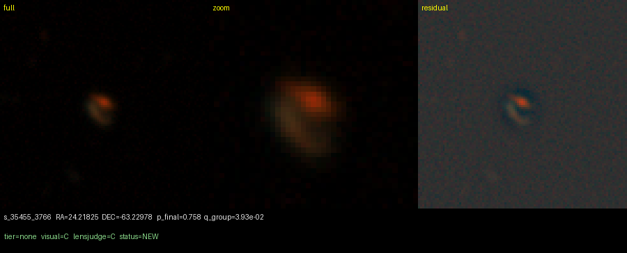

**s_128249_3559** — RA=22.510017 DEC=-37.749291, p_final=0.798; visual **D**, lensjudge **D**. _Full and highcontrast show a central red galaxy ringed by several faint blue/gray low-surface-brightness knots at ~1-2 arcsec on opposite sides, suggesting a partial ring/counter-image configuration. The arc is broken and the residual is noisy so it falls short of A, but the symmetric blue knots make it the clear best candidate of the batch and worth human review._
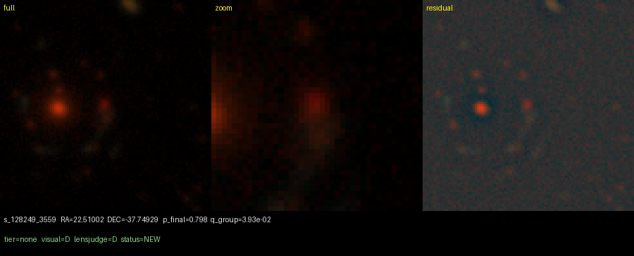

**s_34869_6396** — RA=57.561687 DEC=-63.386393, p_final=0.714; visual **C**, lensjudge **C**. _Residual and highcontrast show an elongated feature partly curving around the central red galaxy, the most arc-like in the batch, but its color is not clearly blue and a bright yellow neighbor suggests a merger/tidal feature rather than a tangential arc. Ambiguous curvature without a clean blue counter-image keeps this at C and escalated._
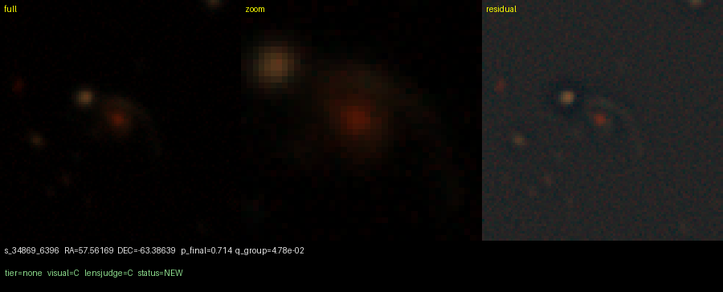

**s_289562_2713** — RA=218.246844 DEC=-7.228052, p_final=0.667; visual **C**, lensjudge **C**. _Full/high-contrast show an elongated blue low-surface-brightness feature extending to the southwest of the central red galaxy at plausible separation, but it runs fairly straight through the system (suggestive of an edge-on disk or tidal feature) rather than curving tangentially, and there is no clean counter-image on the opposite side. Genuinely blue and elongated but ambiguous curvature/counter-image makes it a borderline C; escalating._
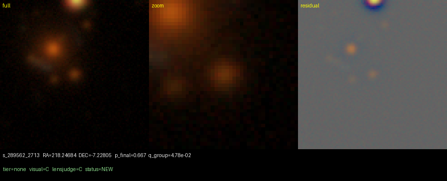

**s_36700_69** — RA=347.990461 DEC=-63.117586, p_final=0.813; visual **C**, lensjudge **C**. _Full/highcontrast show faint tan/whitish curved low-surface-brightness features partly wrapping around the central red galaxy with some curvature in the residual, but the features look tidal/merger-like and are not distinctly blue, and there is no clean counter-image. Ambiguous between a weak arc and a merger/ring, so C with escalation._
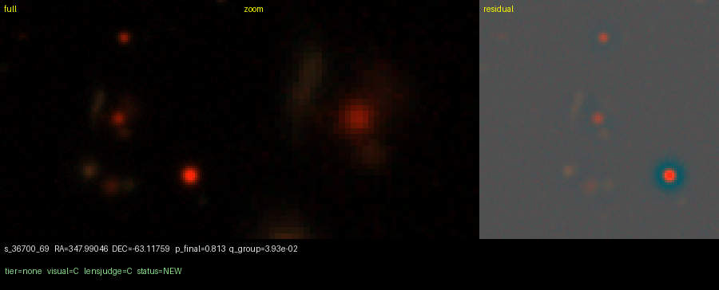

**s_380761_3680** — RA=36.235580 DEC=8.828665, p_final=0.674; visual **D**, lensjudge **D**. _Full and highcontrast show a faint, low-surface-brightness blue/grey arc-like feature curving below-left of the central red clump, and the residual reveals an elongated streak in the same place — genuine tangential arc evidence. But the host is a multi-nucleus red group/merger and there is no clean counter-image, so it stays at probable rather than A; escalating for human review._
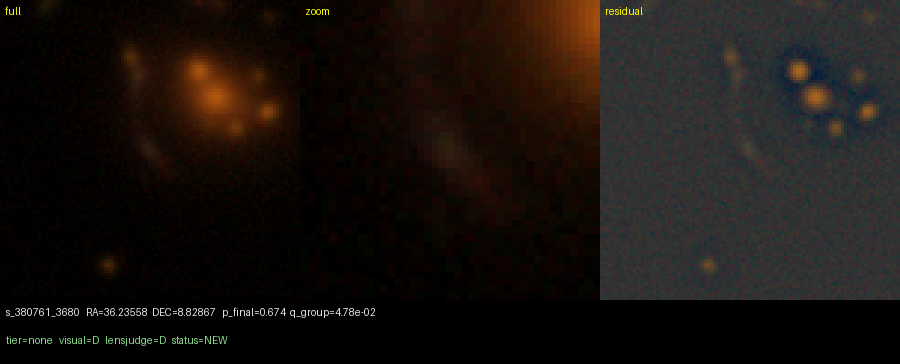

**s_96761_2587** — RA=335.773196 DEC=-45.289107, p_final=0.844; visual **C**, lensjudge **C**. _Zoom/residual show a single faint blue-grey diffuse feature ~1-2" SE of the red core, but it is a lone blob with little clear tangential curvature and no opposite-side counter-image. Plausible projected companion or marginal feature rather than a convincing arc._
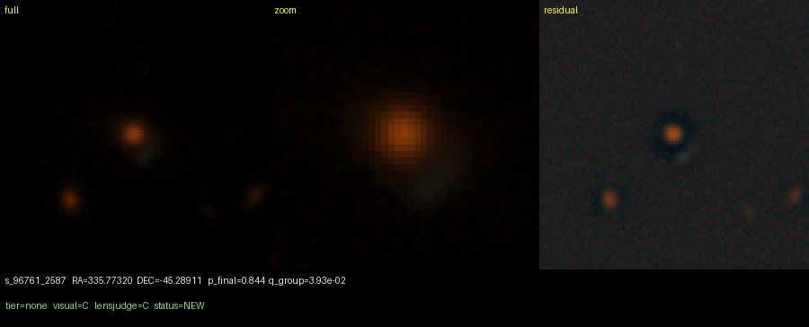

**s_264802_1671** — RA=69.002152 DEC=-11.547735, p_final=0.890; visual **D**, lensjudge **D**. _Residual and full views show a genuine extended curved arc-like feature sweeping around two bright central galaxies with several aligned knots, the strongest curvature/arc morphology in the batch. The feature and knots are red rather than blue (more consistent with a cluster/group member arrangement than a classic galaxy-galaxy lens), so I grade B and escalate for human review._
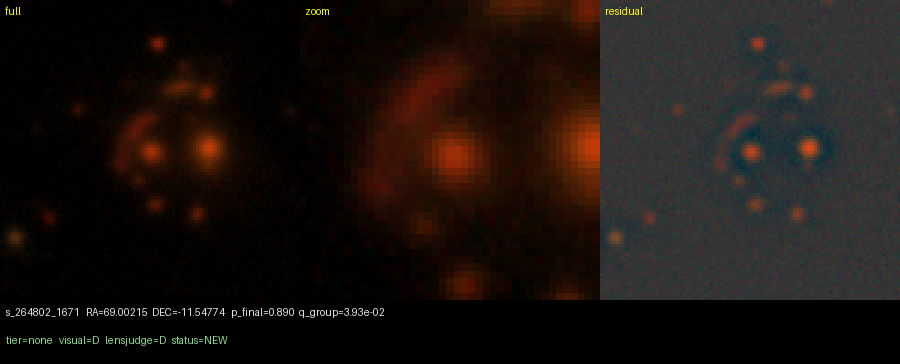

**s_70206_4718** — RA=42.206629 DEC=-51.888121, p_final=0.863; visual **C**, lensjudge **C**. _Residual/highcontrast show a bluish low-SB feature near the small central red galaxy, but it is a broad NE-SW elongated blob spreading toward a second red galaxy rather than a clean tangential arc curving around the lens, and the central object looks too small/faint to be a massive lens; escalated as an ambiguous blue blob._
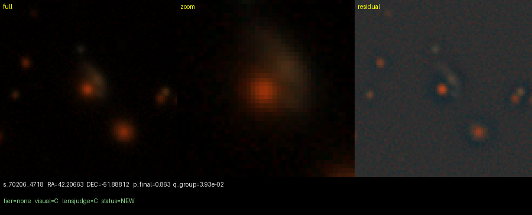

**s_461308_2690** — RA=125.628392 DEC=23.253081, p_final=0.814; visual **C**, lensjudge **C**. _Zoom and highcontrast show a faint cyan/green low-surface-brightness blob ~3-4px directly south of the red galaxy that persists in the residual, but it is a single offset feature with no counter-image and no clear tangential curvature. Plausible blue neighbour/star-forming companion rather than a confirmed arc, so C with escalation._
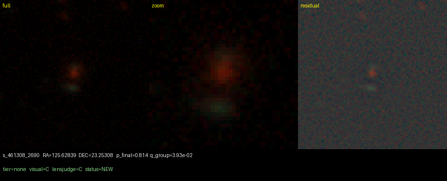

## Honest limits

- *Qualified ≠ confirmed.* Every candidate here is a follow-up target, not a lens; confirmation needs higher-resolution imaging or spectroscopy.

- *Crossmatch is partial.* SIMBAD + DES + KiDS were queried; NED and SuGOHI were unreachable from this host. "Still NEW" means *not in the queried sources*, a stronger statement than the original 4-catalog NEW but not exhaustive.

- *Both graders are Claude.* Independence here means different harness / prompt / orchestration, not statistical independence; the skeptic pass is the adversarial counterweight. Agreement is reported, not assumed.

- *Conformal null.* The FDR≤0.05 that defined the 737 controls against the *random-galaxy* population, so lens-mimicking false positives are expected in it; this campaign is exactly the lens-vs-non-lens filter the conformal step could not provide.

