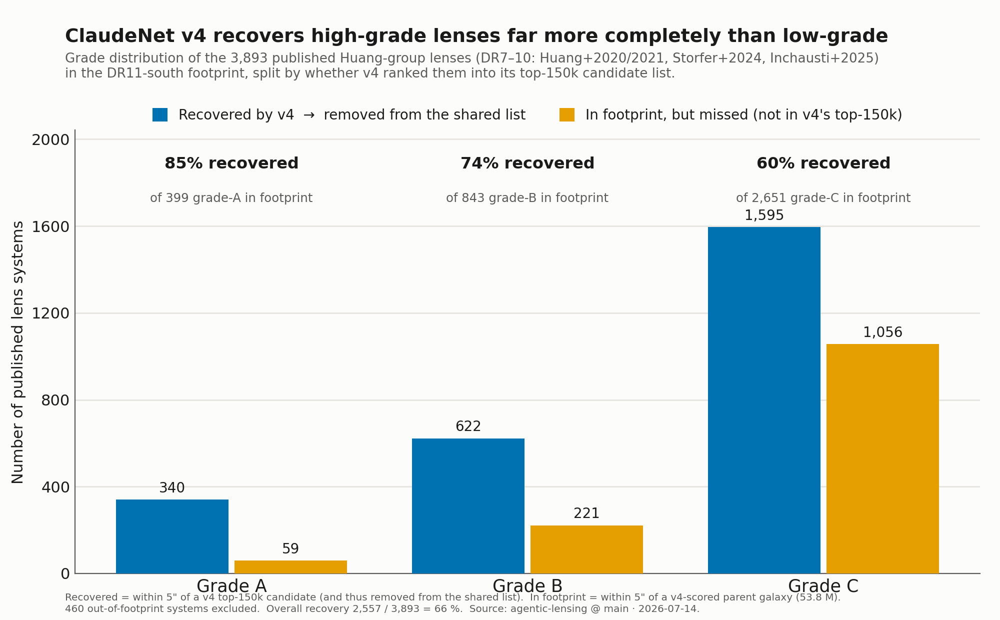

# ClaudeNet v4 Work

The DR11-south release of the [ClaudeNet](../current/claudenet/index.md) ML lens
finder, and the work of turning its full-sky re-sweep into a **shareable candidate
list** — published lenses subtracted, provenance verified, completeness measured.

ClaudeNet v4 re-scored all **53.8 million** DESI Legacy Survey DR11-south galaxies
with a five-model ensemble and kept the top 150,000 by score. This page covers what
happened next: removing every already-published lens to leave a clean inspection
queue, and asking how completely v4 actually recovers the lenses we already know.

[:material-download: Download the candidate list](https://raw.githubusercontent.com/usfcs-edu/agentic-lensing/main/reproductions/claudenet/data/v3/dr11s_v4_candidates_150k_noknown.csv){ .md-button .md-button--primary }
[:material-file-document-outline: Full provenance note](https://github.com/usfcs-edu/agentic-lensing/blob/main/reports/dr11s-v4-known-lens-subtraction/KNOWN_LENS_SUBTRACTION.md){ .md-button }

!!! abstract "The result in one line"
    **145,297 DESI DR11-south sources** — the full ClaudeNet v4 top-150k with every
    published lens in our catalogs removed. It is a **ranked inspection queue, not a
    lens sample**: the score is not a calibrated probability and nothing here has been
    vetted, so the large majority are not strong lenses. See [Reading the list](#reading-the-list-important).

---

## The candidate list

The list is built in three steps, each by a numbered, committed script.

| Step | Script | Result |
|---|---|---|
| **1. Ensemble re-sweep** | `395_combine_resweep.py` (Perlmutter) | Score all 53.8 M DR11-south galaxies with the 5-model v4 ensemble; keep the **top 150,000** by `mean5` (the plain mean of the members). |
| **2. Export** | `396_export_v4_new_candidates.py --full` | Emit the 150,000 with an `is_new` flag: 134,078 are new relative to our previous sweep, 15,922 were also surfaced then. The flag is **metadata, not a filter** — the whole top-150k is kept. |
| **3. Subtract known lenses** | `397_remove_known_lenses.py` | Drop every candidate within **5″** of a published lens. **150,000 − 4,703 = 145,297.** |

The five ensemble members are two anchors carried from the original stage-1 ensemble
(`effnet_B`, `zoobot_N`) plus three DR11-native fine-tuned members
(`effnet_S2`, `effnet_B3`, `resnet46_C`). `mean5` is their arithmetic mean — the
score the top-150k was cut by.

!!! note "Why keep the 15,922 previously-surfaced candidates?"
    An earlier cut kept only the 134,078 "new vs the previous sweep" rows, which
    silently discarded **14,293 real candidates — including v4's #1-ranked source**,
    because the previous, lower-recall selector overlapped v4 most heavily at the very
    top of the ranking. "134,078 net-new" is a sound *novelty* statistic; it was the
    wrong cut for a candidate list. The full ranking is shipped and `is_new` carried as
    a column, so the old view is exactly `is_new == 1`.

### The ranking carries real signal

Known lenses were deliberately left in the parent sample, so they should rank high —
and they do. Of v4's **top 100** ranked candidates, **86 are already-published
lenses**, against a 3.1 % rate across the full top-150k: a **27× enrichment** of the
very top over the selected pool. (This is measured on the full ranking *before*
subtraction; after subtraction those 86 are removed, and 0 of the shipped list's
top 100 are known lenses.)

---

## Removing the known lenses

"Known" is the **union of every known-lens catalog this repo holds** — 16,573
entries across six catalogs, covering the group's four DESI searches (DR7–DR10) plus
the compiled KLC and a few external systems:

| Catalog | Entries | In KLC (5″) | Removed (nearest-attributed) |
|---|---:|---:|---:|
| KLC (`klc_clean250629ymh`) | 12,210 | — | 3,004 |
| Storfer + 2024 (DR9) | 1,895 | 1,895 (100 %) | 613 |
| Huang + 2021 (DR8) | 1,312 | 1,312 (100 %) | 475 |
| **Inchausti + 2025 (DR10)** | 811 | **0 (0 %)** | **559** |
| Huang + 2020 (DR7) | 342 | 335 (98 %) | 49 |
| external | 3 | — | 3 |

Matching uses astropy `match_to_catalog_sky` (true great-circle separation) at the 5″
radius used elsewhere in the pipeline. Removal is the *forward* nearest neighbour and
is exact: if a candidate's nearest catalog entry is beyond 5″, none is within 5″.
Matches are tight — median separation **0.11″**, and 4,076 of 4,703 under 1″ — a
genuine positional association, not chance alignment.

!!! warning "One catalog was missing — and it mattered"
    The KLC (compiled 2025-06-29) turned out **not to contain the group's DR10 search
    (Inchausti + 2025) at all** — 0 of its 811 entries; the nearest KLC entry to any
    Inchausti lens is 160″ away. So **559 published Inchausti lenses had survived** in
    an earlier version of this list, 5 of them in v4's top 100. Staging all four group
    searches directly (rather than trusting the KLC to contain them) removes those 559.
    Huang + 2021 and Storfer + 2024 add **0** net removals — they are fully in the KLC —
    but are staged anyway so the guarantee no longer depends on the KLC's contents.

!!! note "Attribution ≠ contribution"
    The per-catalog "removed" column above is which catalog is a row's *nearest* match,
    not which catalog is *responsible*. Storfer (613) and Huang + 2021 (475) were already
    removed via the KLC and only re-attribute to the nearer group catalog. The only
    **net-new** removals over the previous version are the 559 Inchausti rows.

The **full KLC does real work beyond the group's own searches**: of the 4,703
removals, 1,855 are near KLC systems the four search papers never listed
(Stein + 2021, Jacobs + 2019b, SuGOHI, Petrillo + 2019, Diehl + 2017, …). The count is
~4,700 and not ~12,000 because removal is bounded by the **candidate list**, not the
catalog: of the 12,210 KLC systems, only 3,734 landed in v4's top-150k — the rest are
in-footprint but below the score cut, so there is nothing to remove.

---

## How completely does v4 recover known lenses?

The four group searches carry visual grades (A/B/C), so we can ask a sharper question:
of the published lenses **v4 actually scored** (in the DR11-south parent), how many did
it rank into its top-150k — split by grade?

<figure markdown="span">
  { width="100%" }
  <figcaption>
    3,893 published Huang-group lenses (DR7–DR10) in the DR11-south footprint, split by
    whether v4 ranked them into its top-150k. "In footprint" is the rigorous <code>in_parent</code>
    flag — within 5″ of one of the 53.8 M v4-scored galaxies — which excludes 460 out-of-footprint
    systems a naïve declination cut would miscount.
  </figcaption>
</figure>

The result is a clean, monotonic completeness trend — v4 is most complete on the
confident lenses and misses more of the marginal ones:

| Grade | Recovered → removed | In footprint, missed | Total in footprint | Recovery |
|---|---:|---:|---:|---:|
| **A** | 340 | 59 | 399 | **85 %** |
| **B** | 622 | 221 | 843 | **74 %** |
| **C** | 1,595 | 1,056 | 2,651 | **60 %** |
| **All** | 2,557 | 1,336 | 3,893 | **66 %** |

The 66 % overall is the completeness at a **fixed top-150k budget**, not a ceiling — a
deeper cut would recover more. The grade-A **85 %** is the meaningful completeness
number; the systems v4 misses are disproportionately grade C, which are themselves the
least certain lenses.

!!! note "Recall figures for model quality"
    This is *selection-depth* completeness on an all-sky catalog, not the matched-FPR
    recall used to judge the model. For that, cite the paper's training-held-out figures:
    Inchausti grade-A **0.87**, Storfer **0.825** (vs 0.54 / 0.32 for the previous sweep).

---

## Reading the list (important)

!!! warning "This is an inspection queue, not a lens sample"
    - **`mean5` is a ranking score, not P(lens).** It ordered 53.8 M galaxies and cut the
      top 150k; it is not calibrated to the survey base rate. Graded `p_lens` comes only
      from the LensJudge vetting stage, which **has not been run** on this set.
    - **The large majority of the 145,297 are not strong lenses.** Removing known lenses
      makes the list *unpublished*, not *pure* — it does nothing to the non-lens
      contaminants that dominate any deep candidate cut.
    - **"Known" means every catalog we hold**, not every catalog that exists. A lens
      published elsewhere, or after these catalogs were compiled, can still be present.
    - **These are sources, not systems.** Deblending means one lens can appear as several
      rows, so the distinct-object count is somewhat lower.

---

## Data & reproducibility

Everything is committed and regenerates from a bare invocation of the script (the
repo's own catalogs are auto-unioned by default), verified byte-for-byte.

| File | Rows | What it is |
|---|---:|---|
| [`dr11s_v4_candidates_150k_noknown.csv`](https://github.com/usfcs-edu/agentic-lensing/blob/main/reproductions/claudenet/data/v3/dr11s_v4_candidates_150k_noknown.csv) | 145,297 | **The shared list** (md5 `5bf6dace…`) |
| [`dr11s_v4_candidates_150k_known_removed.csv`](https://github.com/usfcs-edu/agentic-lensing/blob/main/reproductions/claudenet/data/v3/dr11s_v4_candidates_150k_known_removed.csv) | 4,703 | Audit trail — every removed row with its separation + matched catalog entry |
| [`397_remove_known_lenses.py`](https://github.com/usfcs-edu/agentic-lensing/blob/main/reproductions/claudenet/397_remove_known_lenses.py) | — | The subtraction script |
| [`KNOWN_LENS_SUBTRACTION.md`](https://github.com/usfcs-edu/agentic-lensing/blob/main/reports/dr11s-v4-known-lens-subtraction/KNOWN_LENS_SUBTRACTION.md) | — | Full provenance note + qualifications |

Columns: `rank`, `rank_within_new`, `rank_clean`, `is_new`, `row_id`, `RA`, `DEC`,
`mean5`, `footprint`, `brick`. Verification on every regeneration: exact row partition,
no survivor within 5″ of any catalog entry (asserted at runtime), separations
cross-checked against an independent `sklearn` BallTree/haversine matcher (agreement to
1.8 × 10⁻¹⁰ arcsec), and all four group searches confirmed to have **0** survivors in the
shipped list.

For the model behind the scores — the calibrated-mean combiner and the DR11-native
fine-tune that lifted held-out recall to its best-ever level — see the full
[ClaudeNet report](../current/claudenet/index.md).
