# JWST Top-100 regrade: ranks 1–25

Candidates 1–25 by original pipeline rank, each with the composite the judge saw, the
annotated composite and the full grading record. Legend, thresholds and the summary tables are on
the [overview](index.md). Click an image to open it full size.

Pages: **Ranks 1–25** · [Ranks 26–50](ranks-026-050.md) · [Ranks 51–75](ranks-051-075.md) · [Ranks 76–100](ranks-076-100.md).

---

## Rank 1: J3440482-522486 {#rank-1}

| Original grade | Passes | Inspector conf. | Pipeline θ_E |
|:--:|:--:|:--:|:--:|
| **A** | 3/3 | 95 | 1.15″ |

| New (final) | Rank letter | p_ev | S_arb | Demoted by | Arb. letter | Needs human |
|:--:|:--:|--:|--:|:--|:--:|:--:|
| **A** | A | 0.95 | 0.950 | — | — | no |

<small>pipeline discovery status `known` · scale class `galaxy`</small>

<figure markdown="span">
  [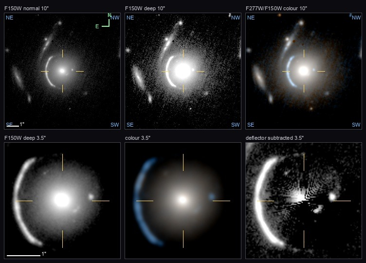{ width="100%" }](img/rank-001-orig.jpg){ target=_blank }
  <figcaption>What the judge saw (blind, footer removed)</figcaption>
</figure>

<figure markdown="span">
  [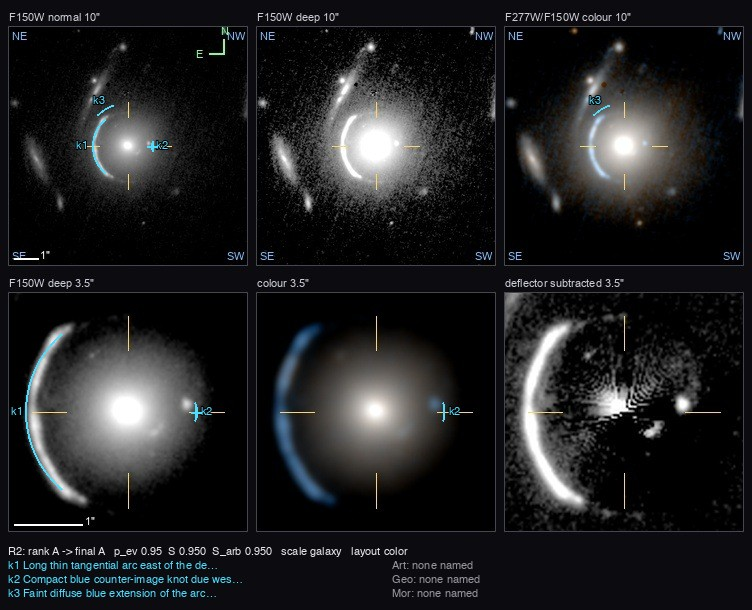{ width="100%" }](img/rank-001-annot.jpg){ target=_blank }
  <figcaption>Advocate evidence (cyan) and critic alternatives coloured by the arbitrator ruling</figcaption>
</figure>

???+ note "Why this grade — advocate, critics, arbitrator"
    **Letter A** (deployed, rule R2) · p_evidence 0.95 · S_arb 0.95 · S 0.95 · scale galaxy

    Letter: letter_rank stands (D rule not met); p_evidence 0.95 >= t_A 0.20 (calibrated at 1% FPR on clean negatives); 3 of 3 configuration criteria >= 6 (curvature, counter_image, arc_morphology); no critic with r x a >= 0.80.

    **Advocate**

    - criteria: source_contrast 8, low_surface_brightness 8, curvature 9, counter_image 8, arc_morphology 9
    - items (3):
        - k1 — “Long thin tangential arc east of the deflector, concave toward it, of roughly constant radius ~1.4-1.7" over ~100 deg of azimuth; distinctly blue in the two-band colour panels while the deflector is white/orange, with resolved surface-brightness structure (brighter knot near PA~120) and no stellar bridge to the nucleus; reproduced as an offset tangential ridge in the subtracted panel” (panel d, r 1.5 arcsec, PA 40->140, visible in direct: yes; criteria: source_contrast, low_surface_brightness, curvature, arc_morphology)
        - k2 — “Compact blue counter-image knot due west of the nucleus at ~1.0", same blue hue as the arc, opposite the arc's midpoint (PA 90 vs 270); appears as a one-sided bright residual in (f) and is traceable in the direct deep and colour zooms” (panel e, r 1 arcsec, PA 262->278, visible in direct: yes; criteria: source_contrast, counter_image)
        - k3 — “Faint diffuse blue extension of the arc curving further north (arc endpoint region), slightly larger radius, continuous with item 1 in the 10" colour and deep panels” (panel c, r 1.8 arcsec, PA 20->45, visible in direct: yes; criteria: low_surface_brightness, curvature, arc_morphology)
    - scale galaxy; red neighbours within 10 arcsec 3; BCG-like halo yes; deflector is centre yes; arc radius 1.5 arcsec; arc PA span 40->140; counter-image at r 1 arcsec PA 270; centre-of-curvature offset 0.15 arcsec
    - p_evidence: 0.95
    - notes: “The eastern feature is a thin (~0.2") blue arc holding radius ~1.5" from PA 40 to 140 with its centre of curvature within ~0.15" of the ticked nucleus, and a blue compact knot sits at r~1.0", PA 270, directly opposite its midpoint - a classic two-image/partial-ring configuration seen in the direct panels (a,b,c,d,e), not only in the subtracted residual.”

    **Critics**

    **artifact — no alternative named (nothing in its competence fits)**

    - leaves standing: k1, k2, k3
    - scale_class: galaxy
    - measured: `{"arc_curvature": "item 1 traces a smooth ~100-110 deg arc of near-constant radius ~1.4-1.7\" from PA~40 to PA~140, i.e. curved - incompatible with a straight 6-spike diffraction ray or 1/f stripe", "artefact_checklist": "no snowball cores, no persistence trails, no mosaic seam or coverage edge crossing the 3.5\" zoom, no saturation bleed column at the deflector", "bright_neighbour": "nearest bright source is ~4-5\" NW near the field edge; no spikes, bleed or PSF halo reach r~1.5\" on the east side", "direct_visibility": "arc and the ~1.0\" western knot (PA~270) are both present in the un-subtracted panels a, b, c, d and e, so neither can be a subtraction residual", "subtracted_panel_artefacts": "panel (f) shows the expected circular-profile artefacts - concentric ringing and a central bowtie/dipole within r<0.6\" - which are separate from the offset arc at r~1.5\" E and the point residual at r~1.0\" W"}`
    - notes: “The east arc (r~1.5", PA 40-140) is smoothly curved at fixed radius and is equally bright in the un-subtracted deep 10" (b), colour 10" (c) and deep zoom (d), so it is sky, not a spike, stripe, wisp or subtraction ringing; the western knot at r~1.0", PA~270 is likewise a real compact source in (d)/(e), well outside the central bowtie/concentric-ring zone of panel (f). No instrument or reduction artefact in my competence accounts for items 1-3.”
    - ruling: no arbitrator

    **geometry — no alternative named (nothing in its competence fits)**

    - leaves standing: k1, k2, k3
    - scale_class: galaxy
    - measured: `{"arc_azimuthal_extent_deg": "~120 (PA ~30 to ~150), concave toward the deflector throughout", "arc_radius_range_arcsec": "1.35-1.70 (panel d, east side)", "arc_width_arcsec": "~0.20-0.25, length/width ~ 8, i.e. tangentially elongated not radially", "colour_consistency": "arc and west knot both bluish in (e) against the white/orange deflector; no colour mismatch between the putative images", "counter_image_radius_pa": "0.95-1.05 arcsec at PA 265-275 (panel d/e compact knot), i.e. opposite the arc midpoint PA ~90 - asymmetric radii (1.5 vs 1.0) as expected for an offset source, not equal radii", "curvature_centre_offset_from_tick_arcsec": "<=0.15 - the arc's centre of curvature sits on the ticked nucleus, not on any neighbour", "neighbours_within_10arcsec": "elongated galaxy ~3.5 arcsec NE and ~4 arcsec E/SE in (b), both well outside the arc radius and off the arc's curvature centre"}`
    - notes: “In (d)/(e) the eastern feature is a thin (~0.2") ridge at constant r ~1.4-1.7" sweeping ~120 deg of azimuth with its concavity and centre of curvature on the ticked nucleus (offset <0.15"), and the compact knot at r~1.0", PA~270 sits opposite its midpoint at a radius compatible with a counter-image; neither an edge-on needle (the feature is curved, not straight) nor an unrelated companion projection (a chance object would not follow constant radius about the tick centre for 120 deg) fits, so I offer no configuration alternative.”
    - ruling: no arbitrator

    **morphology — no alternative named (nothing in its competence fits)**

    - leaves standing: k1, k2, k3
    - scale_class: galaxy
    - measured: `{"arc_radius_range": "1.45-1.65 arcsec measured at PA 40, 90 and 150 in panel (d) - constant to within ~0.15 arcsec over ~120 deg of azimuth, no monotonic growth with angle", "arc_width_over_radius": "~0.15-0.20 arcsec wide at r~1.5 arcsec, i.e. w/R ~ 0.11 (thin ridge, not a host-profiled shell edge)", "bridge_test": "surface brightness along PA 90 falls to the smooth envelope level between r=0.5-1.2 arcsec in (d); no stellar bridge or arm root joining the arc to the nucleus", "closure_test": "nothing at r~1.5 arcsec on the west side (PA 200-350) in (d)/(e) - the feature is one-sided, so not a closed collisional/resonance ring centred on the host nucleus", "colour_contrast": "arc and the 1.0 arcsec west knot are blue in (e) while the envelope is white/orange - different stellar population from the host", "host_structure_inside_1.75arcsec": "isophotes in (d) are smooth concentric ellipses; no bar, no dust lane, no arm segments, no double nucleus"}`
    - notes: “In (d) the eastern feature holds r=1.45-1.65" from PA~40 through 90 to ~160 with no radius growth and no continuous stellar bridge back to the nucleus, and the host's inner 1.75" is a featureless smooth ellipse - so spiral_arm, ring_galaxy, shell_tidal and edge_on_disk all fail their structural tests; the west knot at r~1.0", PA~270 in (d)/(e) is compact and could in principle be a projected dwarf, but nothing in the host's morphology (no tail, no disk, no clump chain) favours that over a counter-image.  I find no morphological alternative that accounts for items 1-3.”
    - ruling: no arbitrator

    **Arbitrator**

    - no arbitrator record (not called (no critic named an alternative))

    **Score**

    - S = p_ev = 0.95 (no critic term entered the product)
    - S_arb = p_ev = 0.95 (no critic term entered the product)
    - stored grade_pred (on S): A — S 0.95 >= t_A 0.20 (calibrated at 1% FPR on clean negatives); 3 of 3 configuration criteria >= 6 (curvature, counter_image, arc_morphology); no critic with r x a >= 0.80
    - stored letter_arb (on S_arb): A; letter_source: opus5_api_calibrated
    - deploy rule R2: letter_rank (advocate only, on p_evidence) = A — p_evidence 0.95 >= t_A 0.20 (calibrated at 1% FPR on clean negatives); 3 of 3 configuration criteria >= 6 (curvature, counter_image, arc_morphology); no critic with r x a >= 0.80
    - deploy rule R2: letter_final = A — letter_rank stands (D rule not met); p_evidence 0.95 >= t_A 0.20 (calibrated at 1% FPR on clean negatives); 3 of 3 configuration criteria >= 6 (curvature, counter_image, arc_morphology); no critic with r x a >= 0.80
    - veto: none (letter_final == letter_rank)

---

## Rank 2: J15199556+2122210 {#rank-2}

| Original grade | Passes | Inspector conf. | Pipeline θ_E |
|:--:|:--:|:--:|:--:|
| **A** | 3/3 | 82 | 1.48″ |

| New (final) | Rank letter | p_ev | S_arb | Demoted by | Arb. letter | Needs human |
|:--:|:--:|--:|--:|:--|:--:|:--:|
| **A** | A | 0.78 | 0.780 | — | B | no |

<small>pipeline discovery status `new` · scale class `galaxy`</small>

<figure markdown="span">
  [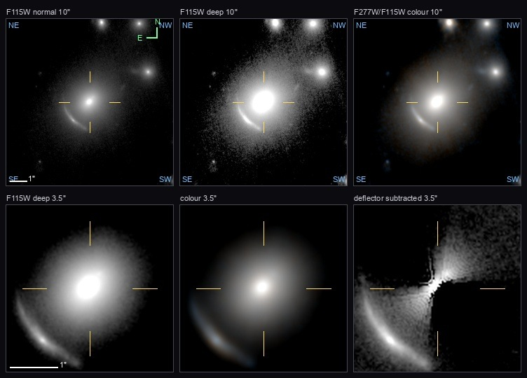{ width="100%" }](img/rank-002-orig.jpg){ target=_blank }
  <figcaption>What the judge saw (blind, footer removed)</figcaption>
</figure>

<figure markdown="span">
  [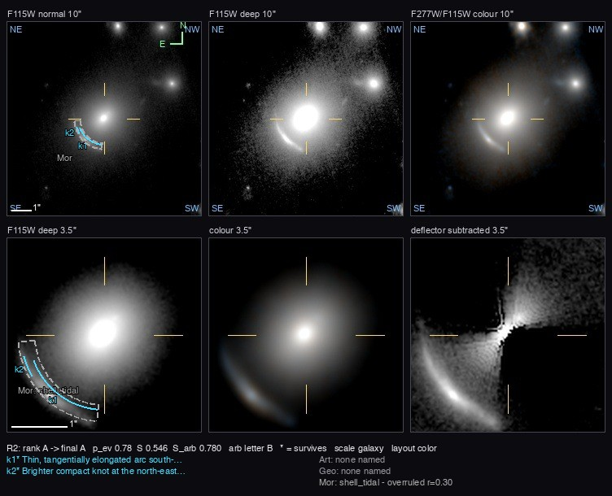{ width="100%" }](img/rank-002-annot.jpg){ target=_blank }
  <figcaption>Advocate evidence (cyan) and critic alternatives coloured by the arbitrator ruling</figcaption>
</figure>

???+ note "Why this grade — advocate, critics, arbitrator"
    **Letter A** (deployed, rule R2) · p_evidence 0.78 · S_arb 0.78 · S 0.546 · scale galaxy

    Letter: letter_rank stands (D rule not met); p_evidence 0.78 >= t_A 0.20 (calibrated at 1% FPR on clean negatives); 2 of 3 configuration criteria >= 6 (curvature, arc_morphology); no critic with r x a >= 0.80.

    **Advocate**

    - criteria: source_contrast 7, low_surface_brightness 8, curvature 8, counter_image 2, arc_morphology 8
    - items (2):
        - k1 — “Thin, tangentially elongated arc south-east of the ticked galaxy, concave toward the galaxy core, at roughly constant radius ~1.3-1.4"; clearly seen in the direct deep and colour panels and again as an offset tangential residual in (f); its surface-brightness is much lower and its hue whiter/bluer than the orange deflector envelope, and it is not connected to the nucleus by any stellar bridge” (panel d, r 1.35 arcsec, PA 110->175, visible in direct: yes; criteria: source_contrast, low_surface_brightness, curvature, arc_morphology)
        - k2 — “Brighter compact knot at the north-eastern end of the same arc (surface-brightness maximum along the arc), slightly larger radius, consistent with a merging image pair on the tangential critical curve” (panel d, r 1.5 arcsec, PA 105->120, visible in direct: yes; criteria: source_contrast, low_surface_brightness)
    - scale galaxy; red neighbours within 10 arcsec 2; BCG-like halo yes; deflector is centre yes; arc radius 1.35 arcsec; arc PA span 110->175; centre-of-curvature offset 0.25 arcsec
    - p_evidence: 0.78
    - notes: “A ~65° tangential arc sits at 1.3-1.4" SE of the ticked galaxy in panels (a), (b), (c), (d), (e) with its centre of curvature landing within ~0.25" of the deflector core; no counter-image is securely located to the NW because the direct panels are saturated inside ~1" there and the (f) bright NNW streak is inside the expected circular-model butterfly/dipole pattern, so that region is uninformative rather than negative.”

    **Critics**

    **artifact — no alternative named (nothing in its competence fits)**

    - leaves standing: k1, k2
    - scale_class: galaxy
    - measured: `{"arc_geometry": "curved, concave toward the ticked core, roughly constant r ~1.3-1.4\" over pa ~110-175 deg; curvature excludes a straight 6-spike ray, 1/f stripe, dither/mosaic edge or saturation bleed", "arc_visibility_in_direct_panels": "present and identically shaped in (a), (b), (c), (d) and (e) - not a subtracted-panel-only feature", "nearest_bright_source": "compact bright object ~3.5-4\" to the NW (pa ~300-320) in the 10\" panels; the arc lies on the opposite side at pa ~110-175, so it is not a PSF wing or ghost of that source", "panel_f_artefact_pattern": "central dipole plus sharp four-quadrant butterfly with black wedges within r<0.8\" - exactly the pattern the 1-D circular profile model produces on an elliptical/inclined galaxy; deliberately not counted"}`
    - notes: “The SE arc (lower-left of the zoom, pa ~110-175 deg, r ~1.35") appears with the same shape and brightness gradient in every un-subtracted panel (a, b, c, d, e), so it cannot be a subtraction residual, and its smooth curvature at fixed radius rules out diffraction spikes, striping, snowballs, seams or bleed. The strong dipole/bowtie and dark quadrants inside r<0.8" in (f) are the expected circular-profile artefact and I do not offer them as an alternative; I find no instrumental explanation for items 1 or 2.”
    - ruling: no ruling for this critic

    **geometry — no alternative named (nothing in its competence fits)**

    - leaves standing: k1, k2
    - scale_class: galaxy
    - measured: `{"arc_pa_span_deg": "~100 -> 168, i.e. ~68 deg of azimuth", "arc_radius_range_arcsec": "1.35-1.70 (thin section r~1.40 at PA~102-137; bright section r~1.55-1.65 at PA~140-167)", "centre_of_curvature_offset_arcsec": "0.3-0.7 from the ticked nucleus (three-point circle fit gives R_curv ~1.7-2.5\" against an arc radius of ~1.5\"; the fit is chord-sagitta limited, so consistent with concentric within my read error)", "counter_image_search": "no feature found at r=1.2-1.9\", PA 280-350 in (b), (d) or (e); that quadrant is covered by the bright orange envelope, so a strongly demagnified counter-image would not be separable without a subtracted panel", "nearest_neighbours": "compact source ~4.0\" at PA~295 and two more near the north edge of (b); no diffuse common envelope, no second matched red member within ~10\"", "one_source_consistency": "single continuous crescent, uniform whitish/blue hue along its whole length in (e), no colour or profile break between the thin and bright sections - consistent with one source", "tangential_elongation": "yes - long axis of the bright knot runs PA~245 deg, local tangent at PA 150 is 240 deg (offset <10 deg)"}`
    - notes: “In (d) the feature runs from (x,y)~(40,300) through (110,400) to (195,468) px, i.e. r=1.4-1.65" over PA 100-168, concave toward the nucleus at (238,262) and tangentially elongated to within ~10 deg of the local tangent; the same crescent hugs the core in (b) at 1.5-1.7" SE. Its brightness maximum is actually at the SOUTHERN end (PA~145-165, r~1.6"), not at PA 105-120 as item 2 states, but a fold-brightened end is a lensing-compatible configuration; no configuration alternative (projection, needle, scale mismatch) fits a 68-deg tangential crescent centred on the ticked galaxy, so I offer none - the only shortfall is the undetected counter-image at PA 280-350.”
    - ruling: no ruling for this critic

    **morphology — shell_tidal:** “A tidal shell / disrupting-satellite stream in the host's outer envelope: the bright lens-shaped clump near PA~150, r~1.35" would be the remnant and the thin filament curling NE to PA~100 its stream, all within the host's disturbed, asymmetric envelope (a close companion sits ~3.5" NW in panel c)”

    - location: r 1.25-1.55 arcsec, PA 95->175
    - accounts for: k1, k2; leaves standing: none; strength r 0.30; coverage a 1.00 (geometric), excluded from S_arb (overruled)
    - scale_class: galaxy
    - measured: `{"arc_radius_at_PA140": "1.30\"", "arc_radius_at_PA160": "1.34\"", "arc_radius_at_PA173": "1.42\"", "arc_radius_at_PA99": "1.48\" (panel d, ~212 px E, 35 px S of core; 1\" = 145 px)", "arc_width": "~0.12-0.20\", i.e. ~1/8 of its radius", "bridge_to_nucleus": "none traceable in (d) or (e); arc sits detached inside a smooth envelope", "radius_trend": "non-monotonic, ~1.30-1.48\" over 74 deg of PA (no monotonic growth with angle)"}`
    - notes: “In (d) the feature runs from (28,300) through (120,410) to (215,470) about a core at (240,265): radius stays 1.30-1.48" over PA 99-173 with no monotonic growth and no stellar bridge, which rules out a spiral arm; the only in-competence alternative is a tidal shell/stream fed by the NW neighbour seen in (c), but the feature is far thinner than the host envelope and carries an internal surface-brightness maximum, which shells usually lack, so I weight it only about a third.”
    - ruling: overruled — “The SE crescent in (d)/(e) is only ~0.12-0.20" wide against a 1.3-1.5" radius, holds that radius over ~70 deg of azimuth, is detached from the envelope with a whitish/blue hue distinct from the orange host light and carries an internal surface-brightness maximum - none of which matches a host-profiled, broad, sharp-edged tidal shell from the compact source 3.5-4" NW.”

    **Arbitrator**

    - surviving items: k1, k2 (2 of 2)
    - letter_llm: B; scale_class_final: galaxy; needs_human: no
    - rationale: “Both items survive: in panels (a), (b), (c), (d) and (e) a thin crescent runs from about PA 100 to PA 170 at r = 1.30-1.50" southeast of the ticked nucleus, concave toward that nucleus, with its long axis at the local tangent to within ~10 deg, and it reappears in (f) as an offset tangential feature far outside the r<0.8" dipole/bowtie wedges that the 1-D circular model necessarily produces on this obviously elliptical galaxy - so it is not a subtraction artefact, and its smooth curvature at fixed radius excludes spikes, striping, seams or PSF wings (artifact and geometry critics both declined to offer an alternative). The morphology critic's shell/stream reading is overruled on the pixels: the feature is ~1/8 of its radius in width, colour-distinct from the orange envelope, shows no stellar bridge to the nucleus and no monotonic radius growth, and carries a brightness maximum along its southern half consistent with a fold, whereas a shell would be broad, host-coloured and profile-matched. The one shortfall is the counter-image: the NW quadrant at r = 1.2-1.9", PA 280-350 is swamped by the bright envelope in every direct panel and by the circular-model artefact in (f), so it is uninformative rather than negative, which holds this at probable (B) rather than A.”

    **Score**

    - S = p_ev x prod(1 - r_i a_i) = 0.78 x (1 - 0.30x1.00) = 0.546
        - terms: morphology shell_tidal r 0.30 a 1.00
    - S_arb = p_ev = 0.78 (no critic term entered the product)
    - stored grade_pred (on S): A — S 0.546 >= t_A 0.20 (calibrated at 1% FPR on clean negatives); 2 of 3 configuration criteria >= 6 (curvature, arc_morphology); no critic with r x a >= 0.80
    - stored letter_arb (on S_arb): A; letter_source: opus5_api_calibrated
    - deploy rule R2: letter_rank (advocate only, on p_evidence) = A — p_evidence 0.78 >= t_A 0.20 (calibrated at 1% FPR on clean negatives); 2 of 3 configuration criteria >= 6 (curvature, arc_morphology); no critic with r x a >= 0.80
    - deploy rule R2: letter_final = A — letter_rank stands (D rule not met); p_evidence 0.78 >= t_A 0.20 (calibrated at 1% FPR on clean negatives); 2 of 3 configuration criteria >= 6 (curvature, arc_morphology); no critic with r x a >= 0.80
    - veto: none (letter_final == letter_rank)

---

## Rank 3: J34707505-219476 {#rank-3}

| Original grade | Passes | Inspector conf. | Pipeline θ_E |
|:--:|:--:|:--:|:--:|
| **A** | 3/3 | 78 | 1.40″ |

| New (final) | Rank letter | p_ev | S_arb | Demoted by | Arb. letter | Needs human |
|:--:|:--:|--:|--:|:--|:--:|:--:|
| **A** | A | 0.76 | 0.671 | — | B | yes ⚑ |

<small>pipeline discovery status `new` · scale class `galaxy`</small>

<figure markdown="span">
  [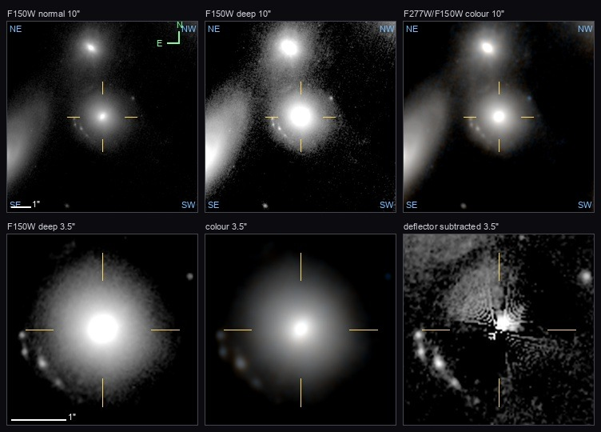{ width="100%" }](img/rank-003-orig.jpg){ target=_blank }
  <figcaption>What the judge saw (blind, footer removed)</figcaption>
</figure>

<figure markdown="span">
  [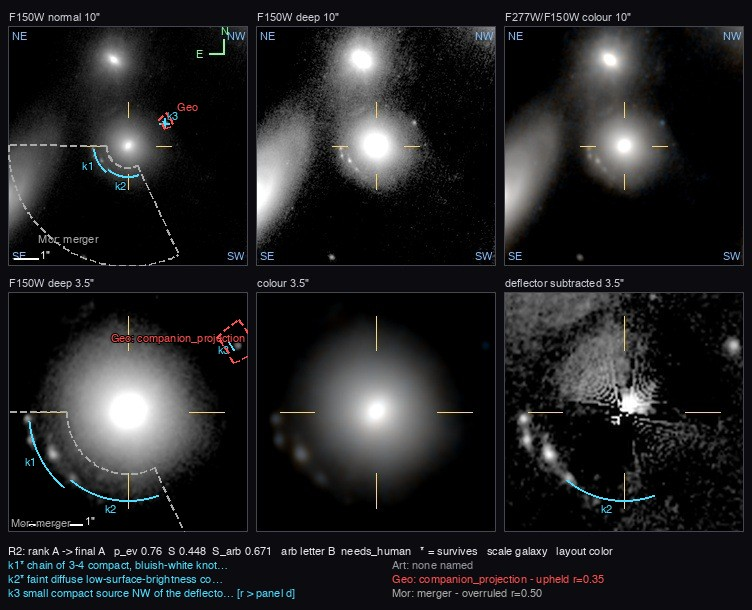{ width="100%" }](img/rank-003-annot.jpg){ target=_blank }
  <figcaption>Advocate evidence (cyan) and critic alternatives coloured by the arbitrator ruling</figcaption>
</figure>

???+ note "Why this grade — advocate, critics, arbitrator"
    **Letter A** (deployed, rule R2) · p_evidence 0.76 · S_arb 0.671 · S 0.448 · scale galaxy

    Letter: letter_rank stands (D rule not met); p_evidence 0.76 >= t_A 0.20 (calibrated at 1% FPR on clean negatives); 2 of 3 configuration criteria >= 6 (curvature, arc_morphology); no critic with r x a >= 0.80.

    **Advocate**

    - criteria: source_contrast 7, low_surface_brightness 7, curvature 7, counter_image 5, arc_morphology 7
    - items (3):
        - k1 — “chain of 3-4 compact, bluish-white knots strung along a smooth curve east-southeast of the ticked galaxy, clearly resolved and detached from the deflector halo (no stellar bridge); brightest feature in panels (a), (b), (d), (f)” (panel d, r 1.45 arcsec, PA 95->140, visible in direct: yes; criteria: source_contrast, low_surface_brightness, curvature, arc_morphology)
        - k2 — “faint diffuse low-surface-brightness continuation of the same feature sweeping under the core from SE toward S/SSW at roughly the same radius, giving ~100 deg of tangential extent” (panel f, r 1.3 arcsec, PA 140->200, visible in direct: yes; criteria: low_surface_brightness, curvature, arc_morphology)
        - k3 — “small compact source NW of the deflector, on the opposite side of the nucleus from the knot chain, similar compactness and colour to the knots; candidate counter-image” (panel d, r 1.8 arcsec, PA 300->305, visible in direct: yes; criteria: source_contrast, counter_image) [r exceeds panel d: its field is 3.5 arcsec]
    - scale galaxy; red neighbours within 10 arcsec 2; BCG-like halo yes; deflector is centre yes; arc radius 1.35 arcsec; arc PA span 95->200; counter-image at r 1.8 arcsec PA 302; centre-of-curvature offset 0.9 arcsec
    - p_evidence: 0.76
    - notes: “The SE knot chain in (d)/(f) is thin, clumpy and concave toward the ticked galaxy at r~1.2-1.6", traceable in the un-subtracted 10" panels (a)/(b), with a fainter tangential continuation running south under the core and a compact NW source at r~1.8" roughly opposite it; my three-point circle fit puts the centre of curvature within about 1" of the deflector, but the knot radii drift from ~1.6" (PA 102) to ~1.0" (PA 159), so the fixed-radius test is only marginally passed and a tidal/companion origin remains open for the critics.”

    **Critics**

    **artifact — no alternative named (nothing in its competence fits)**

    - leaves standing: k1, k2, k3
    - scale_class: galaxy
    - measured: `{"artifact_checks": "no snowball, no cosmic-ray track, no 1/f striping, no mosaic seam or low-coverage edge within the 3.5\" zoom; background noise uniform", "bright_neighbour": "extended source ~2.5-2.8\" N of the ticked galaxy at PA ~350-355 deg; smooth, no six-spike pattern, no saturation bleed, no spikes crossing r=1.3-1.8\"", "diffraction_spikes_detected": "none in any panel; no straight rays at fixed angles through the knot positions", "knot_chain_direct_visibility": "present in panels (a), (b), (d) and (e) at r=1.3-1.7\", PA ~100-145 deg - therefore not a subtraction artefact", "subtraction_artefact_pattern_in_f": "central butterfly/spoke + concentric rings confined to r<0.6\" about the stamp centre, distinct in radius from the r~1.3-1.5\" knot chain"}`
    - notes: “The SE knot chain (r~1.3-1.7", PA 100-145) is clearly present in the un-subtracted panels (a), (b), (d) and (e), so it cannot be a subtraction residual, and it lies well outside the r<0.6" butterfly/ring pattern that the circular profile model leaves in (f). No diffraction spikes, snowballs, striping or detector edges touch the knots or the NW compact source (r~1.8", PA ~302), and the bright northern neighbour shows only smooth, spike-free PSF wings on the opposite side - I have no instrumental alternative for items 1-3.”
    - ruling: no ruling for this critic

    **geometry — companion_projection:** “The compact NW source is an unrelated projected object rather than the counter-image: it sits at r~1.9", ~40% outside the arc radius (1.25-1.45"), is round with no tangential elongation, and lies in a field already containing 2-3 luminous neighbours within 10"; for a simple double the faint counter-image should fall at SMALLER radius than the bright extended arc, so the radius ordering is inverted (only a cusp-quad geometry rescues it).”

    - location: r 1.7-2.1 arcsec, PA 295->310
    - accounts for: k3; leaves standing: k1, k2; strength r 0.35; coverage a 0.333 (geometric)
    - scale_class: group
    - measured: `{"arc_knot_radii_arcsec": "1.45 (PA~93), 1.42 (PA~106), 1.25 (PA~118), 1.27 (PA~141) in panel (d)", "arc_pa_extent_deg": 48, "chain_axis_vs_local_tangential_direction_deg": 10, "companions_within_10arcsec_panel_b": "bright galaxy r~3.8\" PA~11, large diffuse galaxy r>5\" PA~105", "counter_image_pa_deg": 301, "counter_image_r_arcsec": 1.91, "curvature_centre_offset_from_ticked_nucleus_arcsec": "~0.3 (circle through the three brightest knots; unstable to +/-0.4 given knot centroiding)", "pa_offset_from_antipode_of_arc_centroid_deg": 4, "radius_ratio_counterimage_over_arc": 1.4}`
    - notes: “In panel (d) the 3-4 knots run from (r=1.45", PA 93) to (r=1.27", PA 141), their long axis lying within ~10 deg of the local tangential direction and their curvature centre within ~0.3" of the ticked nucleus - a configuration I cannot break, so items 1-2 stand. The only geometric weakness is the NW dot at r~1.9", PA 301 (top-right corner of (d), small blue point in (e)): PA is antipodal to 4 deg but its radius is 40% larger than the arc's, the wrong way round for the faint image of a double, and the 10" panel shows a crowded group so a chance projection is roughly as likely as a fourth image.”
    - ruling: upheld, covers k3 — “The NW dot at r≈1.9", PA≈301 (upper-right of panel d, a small point in e) is round with no tangential stretch and sits ~40% OUTSIDE the arc radius of 1.25-1.45", the wrong radius ordering for the faint image of a double in a field that already holds two luminous neighbours.”

    **morphology — merger:** “The ticked galaxy is embedded in a large low-surface-brightness tidal/interaction envelope: in the 10" colour panel a diffuse plume enters from the NE corner, passes east of the core and spills out to the SE corner, well beyond 3", with a bright companion ~3.5" N/NNE. The ESE-SE knot chain sits on the inner edge of that plume and is best read as star-forming debris/clumps in the tidal structure, and the faint SE->S sweep is the inner edge of the same envelope, not a tangential arc at fixed radius.”

    - location: r 0.9-5 arcsec, PA 90->205
    - accounts for: k1, k2; leaves standing: k3; strength r 0.50; coverage a 0.667 (geometric), excluded from S_arb (overruled)
    - scale_class: galaxy
    - measured: `{"companion_offset": "bright compact galaxy at r~3.5\", PA~8 in panel (c)", "diffuse_envelope_radial_extent_arcsec": ">4 in the same PA sector, running continuously from the NE corner past the galaxy to the SE corner of panel (c) - i.e. NOT confined to a fixed radius", "knot_chain_curvature": "gently curved, concave toward the deflector, but its inner boundary coincides with the envelope edge in (d)/(e)", "knot_chain_radius_range_arcsec": "1.2-1.6 over PA 95-140 (panel d, left/lower-left edge of halo)"}`
    - notes: “In panel (c) the low-surface-brightness light is not a round halo: it forms a broad plume from the NE corner down the east side into the SE corner, and the four knots at ~1.3-1.6", PA 95-140 lie exactly on its inner boundary (panel d, lower-left of the tick cross); the diffuse material continues outward past the knots to r>3", which a tangential Einstein arc would not do. The NW compact source at r~1.8", PA~302 (panel d, upper right) is unexplained by this envelope and is left standing.”
    - ruling: overruled — “The diffuse light it cites is a separate extended galaxy filling the SE corner of (a)/(b)/(c) at r>4", whereas the knots in (d)/(f) hold r≈1.2-1.6" over ~50° with their long axes within ~10° of the local tangential direction and the faint continuation in (f) sweeps SE→S UNDER the core at the same radius - a plume running outward past r>3" cannot bend back under the nucleus at fixed radius.”

    **Arbitrator**

    - surviving items: k1, k2 (2 of 3)
    - letter_llm: B; scale_class_final: galaxy; needs_human: yes
    - rationale: “What survives is the feature that matters: in the 3.5" deep zoom (d) and again, sharply, in the subtracted panel (f), a chain of three-to-four compact knots runs from about (r=1.45", PA 93) to (r=1.27", PA 141) on the east/south-east side of the ticked galaxy, concave toward it, with a fainter low-surface-brightness continuation curving on under the core toward the south at essentially the same radius - roughly 100° of tangential extent about a centre of curvature within ~0.3" of the nucleus. It is present in the un-subtracted panels (a), (b), (d) and (e), so it is not a subtraction residual, and it lies far outside the r<0.6" butterfly/ring pattern the circular profile leaves in (f); the artifact critic found no spike, snowball, striping or PSF wing touching it, and the geometry critic could not break its tangentiality. The morphology critic's tidal-envelope reading is overruled because the diffuse light it invokes belongs to the big extended galaxy occupying the SE corner of the 10" panels at r>4" and never turns tangential under the deflector core the way the (f) feature does. What is genuinely lost is the counter-image: the NW point at r≈1.9", PA≈301 is antipodal in angle but 40% too far out and morphologically round, so it is as easily a projected companion in this crowded group as a fourth image - which is exactly why this reads as a probable rather than a certain lens, and why deeper or multi-band data (or a human reviewer weighing the tidal environment) would settle it.”

    **Score**

    - S = p_ev x prod(1 - r_i a_i) = 0.76 x (1 - 0.35x0.333) x (1 - 0.50x0.667) = 0.448
        - terms: geometry companion_projection r 0.35 a 0.333; morphology merger r 0.50 a 0.667
    - S_arb = p_ev x prod_{upheld/partial}(1 - r_i a_i') = 0.76 x (1 - 0.35x0.333) = 0.671
        - terms: geometry companion_projection r 0.35 a 0.333 (upheld)
    - stored grade_pred (on S): A — S 0.448 >= t_A 0.20 (calibrated at 1% FPR on clean negatives); 2 of 3 configuration criteria >= 6 (curvature, arc_morphology); no critic with r x a >= 0.80
    - stored letter_arb (on S_arb): A; letter_source: opus5_api_calibrated
    - deploy rule R2: letter_rank (advocate only, on p_evidence) = A — p_evidence 0.76 >= t_A 0.20 (calibrated at 1% FPR on clean negatives); 2 of 3 configuration criteria >= 6 (curvature, arc_morphology); no critic with r x a >= 0.80
    - deploy rule R2: letter_final = A — letter_rank stands (D rule not met); p_evidence 0.76 >= t_A 0.20 (calibrated at 1% FPR on clean negatives); 2 of 3 configuration criteria >= 6 (curvature, arc_morphology); no critic with r x a >= 0.80
    - veto: none (letter_final == letter_rank)

---

## Rank 4: J30791374-4058431 {#rank-4}

| Original grade | Passes | Inspector conf. | Pipeline θ_E |
|:--:|:--:|:--:|:--:|
| **A** | 3/3 | 75 | 1.12″ |

| New (final) | Rank letter | p_ev | S_arb | Demoted by | Arb. letter | Needs human |
|:--:|:--:|--:|--:|:--|:--:|:--:|
| **A** | A | 0.70 | 0.469 | — | B | yes ⚑ |

<small>pipeline discovery status `known` · scale class `galaxy`</small>

<figure markdown="span">
  [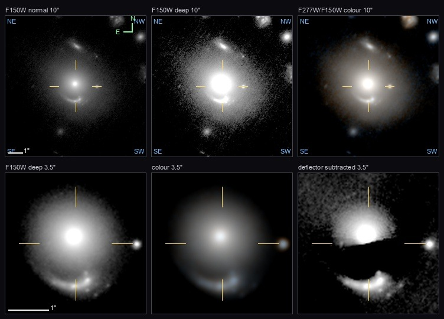{ width="100%" }](img/rank-004-orig.jpg){ target=_blank }
  <figcaption>What the judge saw (blind, footer removed)</figcaption>
</figure>

<figure markdown="span">
  [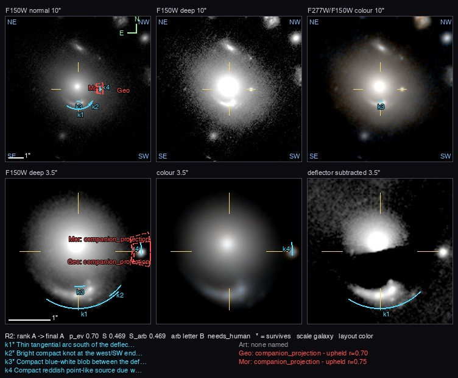{ width="100%" }](img/rank-004-annot.jpg){ target=_blank }
  <figcaption>Advocate evidence (cyan) and critic alternatives coloured by the arbitrator ruling</figcaption>
</figure>

???+ note "Why this grade — advocate, critics, arbitrator"
    **Letter A** (deployed, rule R2) · p_evidence 0.70 · S_arb 0.469 · S 0.469 · scale galaxy

    Letter: letter_rank stands (D rule not met); p_evidence 0.70 >= t_A 0.20 (calibrated at 1% FPR on clean negatives); 2 of 3 configuration criteria >= 6 (curvature, arc_morphology); no critic with r x a >= 0.80.

    **Advocate**

    - criteria: source_contrast 6, low_surface_brightness 7, curvature 8, counter_image 3, arc_morphology 7
    - items (4):
        - k1 — “Thin tangential arc south of the deflector at nearly constant radius (~1.3-1.45"), concave toward the ticked galaxy; traceable as a curved ridge in the direct deep panels (a,b,d) and standing out as an offset, non-mirrored crescent in the subtracted panel (f); thickness ~0.25-0.35", i.e. ~1/5 of its radius” (panel f, r 1.38 arcsec, PA 147->225, visible in direct: yes; criteria: source_contrast, low_surface_brightness, curvature, arc_morphology)
        - k2 — “Bright compact knot at the west/SW end of the same arc (arc-embedded clump, brighter and slightly bluer than the surrounding arc ridge), sitting at the same radius as the arc - a plausible merging-image pair with the arc ridge” (panel d, r 1.32 arcsec, PA 215->232, visible in direct: yes; criteria: source_contrast, low_surface_brightness, counter_image)
        - k3 — “Compact blue-white blob between the deflector core and the arc, due south, brighter than the arc and clearly distinct in hue from the yellow-white deflector in (c)/(e); candidate inner (radial) image or brightest source knot” (panel c, r 0.85 arcsec, PA 175->192, visible in direct: yes; criteria: source_contrast, low_surface_brightness, counter_image)
        - k4 — “Compact reddish point-like source due west at the edge of the zoom field, distinct colour from the deflector halo; no tangential elongation, listed for completeness as a possible counter-image candidate / projected companion” (panel e, r 1.52 arcsec, PA 266->278, visible in direct: yes; criteria: source_contrast)
    - scale galaxy; red neighbours within 10 arcsec 3; BCG-like halo yes; deflector is centre yes; arc radius 1.38 arcsec; arc PA span 147->225; centre-of-curvature offset 0.3 arcsec
    - p_evidence: 0.70
    - notes: “The southern feature keeps a nearly constant 1.3-1.45" radius over ~80 deg of azimuth with its centre of curvature within ~0.3" of the ticked nucleus and is bluer/clumpier than the smooth yellow-white deflector, but no north-side counter-arc is separable inside the saturated halo, and a shell/tidal arc around this large-envelope elliptical remains an open alternative for the critics to test.”

    **Critics**

    **artifact — no alternative named (nothing in its competence fits)**

    - leaves standing: k1, k2, k3, k4
    - scale_class: galaxy
    - measured: `{"arc_radius_span_arcsec": "1.30-1.45 over PA ~145-230 deg, curvature concave to the core - not a straight ray", "diffraction_check": "no 6-spike pattern from the core or from the west point source in (a) or (b); no straight radial rays at fixed PA", "direct_traceability": "the southern crescent (item 1), the SW knot (item 2), the S blue blob (item 3) and the W point source (item 4) are all visible in un-subtracted panels a/b/d/e, so subtraction_residual is inadmissible for all four", "field_quality": "no snowball, no cosmic-ray shower, no 1/f striping, no mosaic seam or coverage edge within the 10\" field", "subtraction_artifacts_seen_but_not_scored": "dark horizontal negative band and bright inner lobe in (f) at r<0.6\" - properties of the 1-D circular model, not counted as items"}`
    - notes: “In panels (a) and (b) the southern feature at r~1.4", PA 147-225 deg is a smoothly curved ridge that changes position angle by ~80 deg at nearly constant radius - no instrument artefact (spike, bleed, stripe, snowball) can do that, and the deflector core shows no spikes at all. The west point source at r~1.5", PA ~272 deg is compact with no spikes and no extended wing overlapping the arc, so PSF-wing contamination is excluded; nothing in my competence explains items 1-4.”
    - ruling: no ruling for this critic

    **geometry — companion_projection:** “The compact source ~1.6" due west is an unrelated projected star/compact galaxy: round, PSF-like, no tangential shear, sitting at a position angle ~80 deg away from the direction opposite the arc centroid and with a surface-brightness profile and hue unlike the arc ridge, so it cannot be the counter-image of the southern arc.”

    - location: r 1.35-1.75 arcsec, PA 258->278
    - accounts for: k4; leaves standing: k1, k2, k3; strength r 0.70; coverage a 0.25 (geometric)
    - scale_class: galaxy
    - measured: `{"arc_azimuthal_span_deg": "~53 deg clearly traced in (d), consistent with the scorer's 147-225", "arc_curvature_centre_offset_arcsec": "<=0.25 from the tick centre; the ridge is concave toward the deflector on both ends", "arc_radius_range_arcsec": "1.20-1.45 traced in (d) from PA~164 (east end) through PA~186 to PA~217 (west knot)", "arc_thickness_arcsec": "~0.25-0.30, i.e. ~1/5 of the radius (thin relative to radius)", "counter_image_search_north": "no compact or tangential excess above the smooth halo in (b) or (d) at r=1.1-1.7\", PA 340-020", "profile_consistency_arc_vs_west_source": "inconsistent: diffuse low-SB curved ridge with embedded knot versus a sharp point-like core", "west_source_geometry": "r=1.59\", PA=267 deg, round (axis ratio ~1.0, FWHM ~0.2\"), zero tangential elongation; orange/yellow in (e) versus the blue-white arc knots"}`
    - notes: “In (d) the southern feature is a genuinely curved ridge at constant r~1.2-1.45" whose centre of curvature lands on the ticked core (items 1-3 stand on configuration grounds); but the bright object at the right (west) edge of (d)/(e), 1.6" from the tick centre at PA~267, is a round point-like source with no tangential stretch and the wrong azimuth for a counter-image of a PA~186 arc, and it appears identically compact in the 10" panel (b) ~73 px west of the core.”
    - ruling: upheld, covers k4 — “The object at r~1.5-1.6", PA~267-272 sits exactly inside the critic's stated box and in (d)/(e) is a round, point-like blob with axis ratio ~1.0 and no tangential shear, at the wrong azimuth (~80 deg off) to mirror a PA~186 arc.”

    **morphology — companion_projection:** “The compact source ~1.5" due west (item 4) is a round, unresolved-to-barely-resolved neighbour projected on the deflector halo: in (d) it is a symmetric blob with no tangential elongation, no curvature about the tick centre and no mirrored partner on the east side at the same radius, i.e. an ordinary field object, not a counter-image.”

    - location: r 1.3-1.75 arcsec, PA 260->285
    - accounts for: k4; leaves standing: k1, k2, k3; strength r 0.75; coverage a 0.25 (geometric)
    - scale_class: galaxy
    - measured: `{"arc_radius_vs_angle_PA150-230": "1.3-1.45\", flat, no monotonic growth with angle", "east_side_counterpart_at_r~1.5": "absent in (d) and (e)", "host_morphology": "smooth spheroid/S0 in (c),(d): no bar, no dust lane, no double nucleus, no spiral knot chain", "north_side_counter-ridge_at_r~1.35": "absent, so the feature is not a closed host ring or disc annulus", "stellar_bridge_from_nucleus_to_arc": "none traceable in (d); inner 0.5-1.1\" halo is smooth", "west_source_axis_ratio_in_d": "~1.0 (round, no tangential stretch over ~0.3\" diameter)"}`
    - notes: “In (d) the object at PA~272, r~1.5" is a compact round blob at the panel edge with zero tangential elongation and no east-side twin - a projected neighbour, not an image of the arc source. For items 1-3 I find no host-structure alternative: the arc at PA 150-230 keeps radius 1.3-1.45" (no arm-like growth), shows no stellar bridge into the smooth nucleus, and has no counterpart ridge on the north side, so ring/arm/shell readings are not supported by the pixels I was given.”
    - ruling: upheld, covers k4 — “In the zoom deep panel (d) the west source is a symmetric compact blob at the frame edge with no east-side twin at the same radius and no curvature about the tick centre, i.e. a projected neighbour rather than a counter-image.”

    **Arbitrator**

    - surviving items: k1, k2, k3 (3 of 4)
    - letter_llm: B; scale_class_final: galaxy; needs_human: yes
    - rationale: “Both critics who named an alternative attacked only item 4, and the pixels back them: the western object visible in (b), (d) and (e) is round and PSF-like with no tangential stretch, so it is a companion projection and drops out. Nothing was offered against items 1-3, and the artifact critic explicitly cleared the field (no spikes on the core, no striping, no snowball, and every item traceable in un-subtracted panels a/b/d/e, so subtraction_residual is inadmissible). What survives is the southern feature: in (a) and (b) a thin curved ridge sitting ~1.3-1.45" south of the ticked nucleus, sweeping ~80 deg of azimuth at essentially constant radius with its centre of curvature within ~0.25-0.3" of the core, concave toward it, and thickness only ~1/5 of its radius - too thin and too radius-constant for a spiral arm (no radial growth with angle, no stellar bridge from the nucleus) and not a closed host ring or shell (no north-side counterpart at r~1.35" in the deep panels). The embedded brighter knot at its west/SW end (item 2) and the compact blue-white blob at r~0.85" due south (item 3), bluer than the yellow-white envelope in (c)/(e), reinforce a lensed-source reading, and the same crescent reappears as an offset, non-mirrored feature in (f) rather than as the butterfly/ring pattern the circular model would produce. Against a grade A stands the absence of any separable counter-arc north of the core inside the saturated halo, and the possibility that the bright southern blob is itself a companion whose own mass shapes the arc; that ambiguity is real and would be settled by a reviewer with deeper or higher-resolution multi-band data, hence B and needs_human.”

    **Score**

    - S = p_ev x prod(1 - r_i a_i) = 0.70 x (1 - 0.70x0.25) x (1 - 0.75x0.25) = 0.469
        - terms: geometry companion_projection r 0.70 a 0.25; morphology companion_projection r 0.75 a 0.25
    - S_arb = p_ev x prod_{upheld/partial}(1 - r_i a_i') = 0.70 x (1 - 0.70x0.25) x (1 - 0.75x0.25) = 0.469
        - terms: geometry companion_projection r 0.70 a 0.25 (upheld); morphology companion_projection r 0.75 a 0.25 (upheld)
    - stored grade_pred (on S): A — S 0.469 >= t_A 0.20 (calibrated at 1% FPR on clean negatives); 2 of 3 configuration criteria >= 6 (curvature, arc_morphology); no critic with r x a >= 0.80
    - stored letter_arb (on S_arb): A; letter_source: opus5_api_calibrated
    - deploy rule R2: letter_rank (advocate only, on p_evidence) = A — p_evidence 0.70 >= t_A 0.20 (calibrated at 1% FPR on clean negatives); 2 of 3 configuration criteria >= 6 (curvature, arc_morphology); no critic with r x a >= 0.80
    - deploy rule R2: letter_final = A — letter_rank stands (D rule not met); p_evidence 0.70 >= t_A 0.20 (calibrated at 1% FPR on clean negatives); 2 of 3 configuration criteria >= 6 (curvature, arc_morphology); no critic with r x a >= 0.80
    - veto: none (letter_final == letter_rank)

---

## Rank 5: J34084513-960342 {#rank-5}

| Original grade | Passes | Inspector conf. | Pipeline θ_E |
|:--:|:--:|:--:|:--:|
| **B** | 2/3 | 75 | 1.35″ |

| New (final) | Rank letter | p_ev | S_arb | Demoted by | Arb. letter | Needs human |
|:--:|:--:|--:|--:|:--|:--:|:--:|
| **A** | A | 0.88 | 0.611 | — | B | yes ⚑ |

<small>pipeline discovery status `new` · scale class `galaxy`</small>

<figure markdown="span">
  [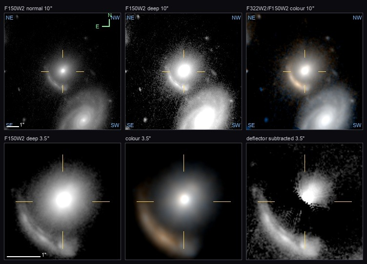{ width="100%" }](img/rank-005-orig.jpg){ target=_blank }
  <figcaption>What the judge saw (blind, footer removed)</figcaption>
</figure>

<figure markdown="span">
  [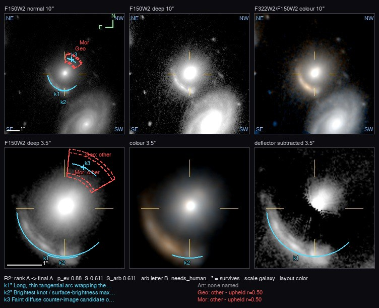{ width="100%" }](img/rank-005-annot.jpg){ target=_blank }
  <figcaption>Advocate evidence (cyan) and critic alternatives coloured by the arbitrator ruling</figcaption>
</figure>

???+ note "Why this grade — advocate, critics, arbitrator"
    **Letter A** (deployed, rule R2) · p_evidence 0.88 · S_arb 0.611 · S 0.611 · scale galaxy

    Letter: letter_rank stands (D rule not met); p_evidence 0.88 >= t_A 0.20 (calibrated at 1% FPR on clean negatives); 2 of 3 configuration criteria >= 6 (curvature, arc_morphology); no critic with r x a >= 0.80.

    **Advocate**

    - criteria: source_contrast 8, low_surface_brightness 8, curvature 9, counter_image 4, arc_morphology 9
    - items (3):
        - k1 — “Long, thin tangential arc wrapping the deflector from due East through South to SW at nearly constant radius (~1.25-1.5"); concave toward the ticked galaxy, clearly detached from the core, traceable in the direct deep zoom (d), the colour zoom (e) and the 10" panels (a)/(b), and standing out as an offset tangential ridge in the subtracted panel (f)” (panel f, r 1.4 arcsec, PA 95->225, visible in direct: yes; criteria: source_contrast, low_surface_brightness, curvature, arc_morphology)
        - k2 — “Brightest knot / surface-brightness maximum along the arc just south-southeast of the nucleus, resolved as a thickened segment of the same ridge (arc width << arc radius), orange/tan in the two-band colour zoom versus the white-cored deflector” (panel e, r 1.45 arcsec, PA 160->195, visible in direct: yes; criteria: source_contrast, low_surface_brightness, arc_morphology)
        - k3 — “Faint diffuse counter-image candidate on the opposite (NNW/NW) side of the nucleus at a comparable radius: low-surface-brightness smudge visible above-right of the core in the deep zoom (d) and as a faint tan patch in (e); much fainter than the main arc, could also be the outer envelope of the deflector” (panel d, r 1.3 arcsec, PA 315->350, visible in direct: yes; criteria: source_contrast, low_surface_brightness, counter_image)
    - scale galaxy; red neighbours within 10 arcsec 2; BCG-like halo no; deflector is centre yes; arc radius 1.4 arcsec; arc PA span 95->225; counter-image at r 1.3 arcsec PA 335; centre-of-curvature offset 0.2 arcsec
    - p_evidence: 0.88
    - notes: “The arc in (d)/(e)/(f) subtends ~130 deg of azimuth at a nearly fixed 1.25-1.5" radius with its concave side facing the ticked nucleus (centre of curvature within ~0.2" of it) and is redder/tan against the white deflector; the critics must test whether it could instead be an outer arm or tidal plume of the bright spiral ~3-4" to the SW, and whether the faint NNW smudge is a real counter-image or just deflector envelope.”

    **Critics**

    **artifact — no alternative named (nothing in its competence fits)**

    - leaves standing: k1, k2, k3
    - scale_class: galaxy
    - measured: `{"arc_radius_arcsec": "1.25-1.55 (arc ridge in (d) traced from PA~100 to PA~220)", "arc_visibility": "present in un-subtracted (a), (b), (d) and (e); not confined to the subtracted panel", "arc_width_arcsec": "~0.15-0.2, i.e. width/radius ~0.12", "f_panel_NW_blob_radius_arcsec": "~0.6 (offset dx~0.47\" W, dy~0.38\" N, PA~309)", "spike_check": "no straight radial rays at fixed PA anywhere in (a)/(b); no 6-spike pattern from the core or the SW spiral", "striping_snowball_check": "no 1/f row/column striping, no snowball, no seam or coverage edge inside the 10\" field"}`
    - notes: “The SE-S-SW ridge (items 1-2) is a curved, ~0.15"-wide feature at constant r~1.3-1.5" that is plainly present in the un-subtracted panels (a), (b), (d) and (e), so it cannot be a subtraction residual, a spike, striping or a PSF wing; the only bright neighbour (the SW spiral) lies at PA~215 beyond 3" and shows no spikes or halo reaching the arc. The large fuzzy patch NW of the core in (f) sits at r~0.6", not at item 3's 1.3", and is the off-centre/elliptical core mis-subtraction lobe of the circular model - I therefore neither credit nor use it, and item 3 itself is a surface-brightness judgement outside my instrument competence.”
    - ruling: no ruling for this critic

    **geometry — other:** “The NNW 'counter-image' is simply the deflector's own smooth outer envelope (a continuation of its elliptical isophotes), so the 130-degree eastern arc stands with no counter-image at a compatible radius; the arc's own centre of curvature also sits ~1" NW of the ticked nucleus rather than on it.”

    - location: r 1-1.6 arcsec, PA 300->355
    - accounts for: k3; leaves standing: k1, k2; strength r 0.50; coverage a 0.333 (geometric)
    - scale_class: galaxy
    - measured: `{"arc_pa_span_deg": "73 -> 180 (~107 deg contiguous)", "arc_radius_range_arcsec": "1.10-1.40 (ends 1.38 at PA~73, 1.39 at PA~177; midpoint 1.12 at PA~112)", "counter_image_at_compatible_radius": "none detected; NNW region at r=1.0-1.6\" is a monotonic, ridge-free brightness decline", "fitted_curvature_centre_offset_arcsec": "~1.0 (toward PA~305) with fitted curvature radius ~2.2\"", "neighbour_geometry": "bright extended galaxy ~3.5-4\" to the SW (PA~215) with overlapping envelope in (b)", "surface_brightness/colour_consistency": "arc PA 90-180 is distinctly tan in (e); NNW patch shares the white/blue halo hue of the deflector envelope", "tangential_elongation": "yes; ridge width ~0.15-0.2\" << radius 1.3\", concave toward the ticked core"}`
    - notes: “In (d)/(e) the NNW quadrant (r 1.0-1.6", PA 315-350) shows no discrete ridge or edge - brightness falls smoothly outward and it carries the same whitish halo hue as the core, unlike the tan eastern arc, so item 3 is envelope, not a counter-image. A circle through the arc in (d) (PA~73 r=1.38", PA~112 r=1.12", PA~177 r=1.39") centres ~1.0" NW of the ticked nucleus with R~2.2", i.e. the arc is tangential and thin but not concentric with the deflector, and it has no counter-image anywhere on the western side.”
    - ruling: upheld, covers k3 — “In the deep zoom (d) and colour zoom (e) the NNW sector at r~1.0-1.6" shows a smooth monotonic decline with the same whitish halo hue as the core and no discrete ridge or edge, so the 'counter-image' is the deflector's own outer envelope, and the only NW feature in (f) is the ~0.6" mis-centred core lobe of the circular model.”

    **morphology — other:** “The NNW/NW 'counter-image' is the host's own asymmetric outer envelope: the deflector's isophotes in the deep zoom are visibly extended toward PA~320-340, and the 'smudge' is a smooth continuation of that light with no compact core, no edge and no tangential elongation.”

    - location: r 0.9-1.7 arcsec, PA 300->355
    - accounts for: k3; leaves standing: k1, k2; strength r 0.50; coverage a 0.333 (geometric)
    - scale_class: galaxy
    - measured: `{"arc_radius_vs_PA_panel_d": "r~1.38\" at PA~72, r~1.10\" at PA~112, r~1.14\" at PA~145, r~1.35\" at PA~172 - non-monotonic, no growth with angle", "arc_width": "~0.15-0.25\" FWHM, i.e. width/radius ~0.15", "bridge_test": "no continuous stellar bridge from arc to nucleus in (d) or (e); arc detached across a dark/low-SB gap", "envelope_isophote_PA": "host outer isophotes elongated toward PA~330 in (d), coincident with item 3", "host_structure": "smooth centrally-concentrated bulge, no bar, no second arm, no double nucleus", "neighbour_geometry": "large SW galaxy at r~4.7\", PA~208 in (c); arc lies at r~4.4\", PA~45 from that neighbour and is convex toward it, so its curvature centre is the ticked galaxy, not the neighbour"}`
    - notes: “In (d) the E-through-S feature keeps r ~1.1-1.4" over ~110 deg of azimuth with no monotonic radius growth and no stellar bridge to the nucleus, so it is not a spiral arm, and it is far too thin and one-sided (and not concentric with the neighbour) to be a host resonance ring or an arm of the big SW spiral - I have no morphological alternative for items 1-2. Item 3, at r~1.3", PA~315-350 in (d)/(e), is simply where the host's outer isophotes already run (the envelope is visibly extended to the NW), so it is more plausibly host light than a counter-image.”
    - ruling: upheld, covers k3 — “The host's outer isophotes in (d) are visibly elongated toward PA~330, exactly where item 3 sits, and the 'smudge' has no compact core, no sharp edge and no tangential elongation - it is host light, not a counter-image.”

    **Arbitrator**

    - surviving items: k1, k2 (2 of 3)
    - letter_llm: B; scale_class_final: galaxy; needs_human: yes
    - rationale: “Items 1 and 2 survive: in panels (a), (b), (d), (e) and again as an offset ridge in the subtracted panel (f) there is a thin (~0.15-0.2" FWHM) ridge sweeping from due east through south to the southwest of the ticked nucleus at r~1.1-1.5" over ~110-130 deg of azimuth, concave toward the deflector, detached from the bulge across a low-surface-brightness gap, with a thickened tan-coloured knot south-southeast in (e) against the white-cored deflector; width/radius ~0.12-0.15 is far thinner than any host resonance ring or shell, the radius does not grow with angle so it is not a spiral arm, no diffraction spikes or striping exist in the field, and the big SW spiral at r~4-4.7" lies on the convex side so the ridge does not curve about it. Both critics independently and correctly removed item 3: the NNW patch is where the host's own isophotes already run, it is smooth, coreless and shares the halo hue, and the large NW blob in (f) is the circular-model core mis-subtraction at only ~0.6". What is left is a compelling one-sided tangential arc with no counter-image, and geometry's circle fit through the arc in (d) puts its curvature centre ~1" NW of the ticked nucleus with R~2.2" rather than concentric with it - consistent either with a lens whose mass centroid is offset/elliptical or with an interaction feature involving the nearby SW spiral. That residual tension, not a hedge, is why a human or a lens model with the counter-image prediction tested would settle it; on the evidence in front of me this is a probable lens.”

    **Score**

    - S = p_ev x prod(1 - r_i a_i) = 0.88 x (1 - 0.50x0.333) x (1 - 0.50x0.333) = 0.611
        - terms: geometry other r 0.50 a 0.333; morphology other r 0.50 a 0.333
    - S_arb = p_ev x prod_{upheld/partial}(1 - r_i a_i') = 0.88 x (1 - 0.50x0.333) x (1 - 0.50x0.333) = 0.611
        - terms: geometry other r 0.50 a 0.333 (upheld); morphology other r 0.50 a 0.333 (upheld)
    - stored grade_pred (on S): A — S 0.611 >= t_A 0.20 (calibrated at 1% FPR on clean negatives); 2 of 3 configuration criteria >= 6 (curvature, arc_morphology); no critic with r x a >= 0.80
    - stored letter_arb (on S_arb): A; letter_source: opus5_api_calibrated
    - deploy rule R2: letter_rank (advocate only, on p_evidence) = A — p_evidence 0.88 >= t_A 0.20 (calibrated at 1% FPR on clean negatives); 2 of 3 configuration criteria >= 6 (curvature, arc_morphology); no critic with r x a >= 0.80
    - deploy rule R2: letter_final = A — letter_rank stands (D rule not met); p_evidence 0.88 >= t_A 0.20 (calibrated at 1% FPR on clean negatives); 2 of 3 configuration criteria >= 6 (curvature, arc_morphology); no critic with r x a >= 0.80
    - veto: none (letter_final == letter_rank)

---

## Rank 6: J18937456+6221686 {#rank-6}

| Original grade | Passes | Inspector conf. | Pipeline θ_E |
|:--:|:--:|:--:|:--:|
| **B** | 2/3 | 62 | 2.10″ |

| New (final) | Rank letter | p_ev | S_arb | Demoted by | Arb. letter | Needs human |
|:--:|:--:|--:|--:|:--|:--:|:--:|
| **A** | A | 0.45 | 0.316 | — | C | yes ⚑ |

<small>pipeline discovery status `known` · scale class `galaxy`</small>

<figure markdown="span">
  [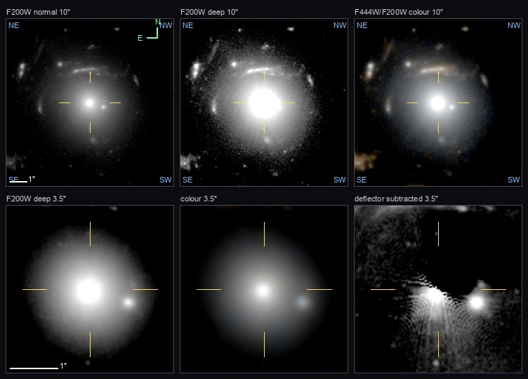{ width="100%" }](img/rank-006-orig.jpg){ target=_blank }
  <figcaption>What the judge saw (blind, footer removed)</figcaption>
</figure>

<figure markdown="span">
  [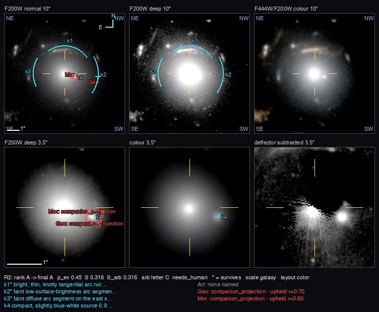{ width="100%" }](img/rank-006-annot.jpg){ target=_blank }
  <figcaption>Advocate evidence (cyan) and critic alternatives coloured by the arbitrator ruling</figcaption>
</figure>

???+ note "Why this grade — advocate, critics, arbitrator"
    **Letter A** (deployed, rule R2) · p_evidence 0.45 · S_arb 0.316 · S 0.316 · scale galaxy

    Letter: letter_rank stands (D rule not met); p_evidence 0.45 >= t_A 0.20 (calibrated at 1% FPR on clean negatives); 2 of 3 configuration criteria >= 6 (curvature, arc_morphology); no critic with r x a >= 0.80.

    **Advocate**

    - criteria: source_contrast 5, low_surface_brightness 7, curvature 7, counter_image 5, arc_morphology 6
    - items (4):
        - k1 — “bright, thin, knotty tangential arc north of the ticked galaxy, running from the NE quadrant over the top of the halo into the NW quadrant at nearly constant radius; concave toward the galaxy, clearly separated from the core light in (a) and (b), whitish/neutral against the yellow core in (c)” (panel b, r 2.3 arcsec, PA 304->36, visible in direct: yes; criteria: source_contrast, low_surface_brightness, curvature, arc_morphology)
        - k2 — “faint low-surface-brightness arc segment on the west/south-west side of the halo, at a radius within ~30% of the northern arc and curving the same way (concave inward) - candidate continuation/counter-arc of item 1” (panel b, r 2.8 arcsec, PA 235->300, visible in direct: yes; criteria: low_surface_brightness, curvature, counter_image)
        - k3 — “faint diffuse arc segment on the east side of the halo at similar radius, roughly opposite the western segment, completing a broken ring-like distribution about the ticked galaxy” (panel b, r 2.6 arcsec, PA 60->115, visible in direct: yes; criteria: low_surface_brightness, curvature, counter_image)
        - k4 — “compact, slightly blue-white source 0.9" from the nucleus toward the WSW, resolved and non-stellar-looking in the zoom, sitting on the deflector halo and surviving as a strong positive residual in (f) (not mirrored across the core)” (panel e, r 0.9 arcsec, PA 250->258, visible in direct: yes; criteria: source_contrast, low_surface_brightness, counter_image)
    - scale galaxy; red neighbours within 10 arcsec 3; BCG-like halo yes; deflector is centre yes; arc radius 2.3 arcsec; arc PA span 304->36; counter-image at r 2.8 arcsec PA 265; centre-of-curvature offset 0.6 arcsec
    - p_evidence: 0.45
    - notes: “In (b) a knotty arc ~2.3" north is concave toward the ticked galaxy (centre of curvature within ~0.6" of the core) with fainter segments at similar radius to the east and west that close into a broken ring, while a compact blue-white source sits 0.9" at PA~254 in (d)/(e); the knots along the northern arc and the smooth continuity with the large halo leave a spiral-arm/outer-ring reading for the critics to test, and the inner 1.7" is saturated in the direct zoom.”

    **Critics**

    **artifact — no alternative named (nothing in its competence fits)**

    - leaves standing: k1, k2, k3, k4
    - scale_class: galaxy
    - measured: `{"arc_curvature_test": "items 1-3 are curved and stay at r~2.3-2.8\" over PA 304->36, 235->300 and 60->115; no straight/rectangular edges, no constant-column or constant-row structure (rules out 1/f striping, dither/mosaic seams, bleed)", "core_diffraction_spikes_detected": "none - no straight rays at any fixed PA emanate from the ticked core or from the 0.9\" WSW source in (a), (b) or (d)", "direct_traceability": "item 4 (r~0.9\", PA~254) is a bright compact blob already present in un-subtracted panels (a), (c), (d), (e) - it is not a product of the subtraction", "panel_f_artefact_pattern": "central radiating/ringing streaks and the four-lobed pattern about the stamp centre are the expected circular-profile residual and were not counted"}`
    - notes: “The northern knotty arc at r~2.3" and the W and E segments at r~2.6-2.8" appear plainly in the un-subtracted 10" panels (a) and (b) with clear tangential curvature, so no spike, snowball, wisp, striping or seam explains them; the ticked core shows no six-spike pattern at any PA. Item 4 at r~0.9", PA~254 is visible in direct panels (a), (c), (d), (e) as well as in (f), so subtraction_residual is inadmissible, and its nature (companion vs image) is a morphology question, not an instrumental one.”
    - ruling: no ruling for this critic

    **geometry — companion_projection:** “The compact WSW source (item 4) is an unrelated / physically distinct object projected on the deflector halo, not a lensed image: it sits at a radius ~3x smaller than the putative ring, is round rather than tangentially sheared, and has no counter-image on the opposite side of the core.”

    - location: r 0.7-1.15 arcsec, PA 240->265
    - accounts for: k4; leaves standing: k1, k2, k3; strength r 0.70; coverage a 0.25 (geometric)
    - scale_class: galaxy
    - measured: `{"centre_of_curvature_offset_from_tick_arcsec": "~0.3 (north arc sits inside the E/W segments)", "item4_axis_ratio": "~1.0 (round, FWHM ~0.25\" in (d)); no tangential elongation", "item4_counter_image_search": "nothing at r=0.7-1.2\", PA 60-85 in (d) or (e) - core light smooth there", "item4_pa_deg": 252, "item4_radius_arcsec": 0.92, "item4_radius_over_ring_radius": 0.36, "ring_segment_radii_arcsec": "north 1.9-2.3, east 2.6, west 2.8 (max/min = 1.47)"}`
    - notes: “In (d) and (e) the WSW blob is at r=0.92", PA=252 deg, compact and circular with a smooth centrally-peaked profile and slightly bluer core in (e); there is no mirrored image at PA~72 deg at any radius 0.7-1.2", and its radius is only ~0.35 of the 2.3-2.8" ring segments, so it cannot belong to that image configuration. Items 1-3 in (b) do curve about the tick centre at roughly constant radius (north arc at 1.9-2.3", east at 2.6", west at 2.8", curvature centre within ~0.3" of the deflector), and I have no configuration argument against them - whether the host's own outer ring/arms produce them is the morphology critic's call.”
    - ruling: upheld, covers k4 — “In the 3.5" deep and colour zooms the WSW blob at r~0.9", PA~254 is a round, centrally-peaked point-like source with no tangential shear and nothing whatsoever mirroring it at PA~74 in the smooth halo light, so it is a projected/satellite companion rather than a lensed image.”

    **morphology — companion_projection:** “The compact source 0.86" WSW of the nucleus is a round, slightly resolved satellite/neighbour galaxy projected on (or bound to) the host halo, not a lensed image: it shows no tangential elongation, no counter-image, and sits at a radius ~2.5x smaller than the northern arc.”

    - location: r 0.7-1.1 arcsec, PA 245->265
    - accounts for: k4; leaves standing: k1, k2, k3; strength r 0.60; coverage a 0.25 (geometric)
    - scale_class: galaxy
    - measured: `{"arc_radii_in_c": "item1 2.2-2.3\" N, item3 ~2.7\" E, item2 ~2.8\" WSW - no monotonic radius-vs-angle growth, no stellar bridge from nucleus to any segment", "companion_axis_ratio": "~1.05-1.15 (round, no tangential stretch, FWHM ~0.18\")", "companion_pa_deg": 254, "companion_r_arcsec": 0.86, "host_zoom_structure": "panels (d)+(e) inside r<1.75\": smooth, featureless elliptical isophotes - no bar, no spiral arm, no shell edge, no disc/dust lane"}`
    - notes: “In (d) and (e) the blob at ~0.86", PA~254 is circular and compact with a small bright core, exactly like the other small field galaxies scattered around the 10" panel, and nothing mirrors it at PA~74 - a projected/satellite companion, not a tangentially stretched image. Items 1-3 are left standing: the host is completely smooth inside 1.75" in (d)/(e), and in (c) the knotty northern streak at r~2.3" (PA 304->36) has no continuous stellar bridge to the nucleus and does not grow in radius with angle, so no arm, bar or shell system in my competence explains it.”
    - ruling: upheld, covers k4 — “Same pixels: the compact source WSW of the nucleus in (d)/(e) has axis ratio ~1 and a small bright core identical to the other small field galaxies in the 10" panels, and it sits at only ~0.35 of the 2.3-2.8" arc radius, so it cannot be a member of that image configuration.”

    **Arbitrator**

    - surviving items: k1, k2, k3 (3 of 4)
    - letter_llm: C; scale_class_final: galaxy; needs_human: yes
    - rationale: “Both critics converge on the same target and both are upheld: the bright, round, unresolved-core blob 0.9" WSW of the tick centre in panels (d), (e) and (f) shows no tangential elongation and no counterpart at PA~74, so item 4 is a companion/satellite projection and is removed. What survives are items 1-3, the filamentary structures seen plainly in the un-subtracted 10" panels (a) and (b): a knotty streak arching over the top of the halo from the NE quadrant to the NW at r~1.9-2.3", concave toward the core, plus fainter segments to the E (~2.6") and W/SW (~2.8"). The artifact critic correctly finds no spike, seam or striping explanation - these are curved, at roughly fixed radius, and absent from any straight-edge pattern - and the morphology critic finds no stellar bridge from the nucleus and no smooth radius-vs-angle growth inside 1.75", where the host is featureless. But the evidence stops short of confirming a lens: the segment radii spread by a factor ~1.5, the northern feature is knotty rather than a smooth thin band and in (b) it merges with further wisps that trail outward toward the NE corner of the 10" field, which is exactly what a shell/tidal or outer-arm system around a big halo produces; the two-band colour in (c) shows the northern streak neutral-to-tan, not distinctly offset from the host, and the inner 1.7" is saturated in the direct zoom so no inner counter-image can be tested. Panel (f)'s central radiating streaks and lobes are the expected circular-profile residual and carry no weight. This sits genuinely between a broken Einstein ring and a shell/arm system: deeper multi-band imaging or a proper elliptical-model subtraction would settle whether the northern knots share a colour and surface-brightness profile with the E and W segments, so a human reviewer is warranted.”

    **Score**

    - S = p_ev x prod(1 - r_i a_i) = 0.45 x (1 - 0.70x0.25) x (1 - 0.60x0.25) = 0.316
        - terms: geometry companion_projection r 0.70 a 0.25; morphology companion_projection r 0.60 a 0.25
    - S_arb = p_ev x prod_{upheld/partial}(1 - r_i a_i') = 0.45 x (1 - 0.70x0.25) x (1 - 0.60x0.25) = 0.316
        - terms: geometry companion_projection r 0.70 a 0.25 (upheld); morphology companion_projection r 0.60 a 0.25 (upheld)
    - stored grade_pred (on S): A — S 0.316 >= t_A 0.20 (calibrated at 1% FPR on clean negatives); 2 of 3 configuration criteria >= 6 (curvature, arc_morphology); no critic with r x a >= 0.80
    - stored letter_arb (on S_arb): A; letter_source: opus5_api_calibrated
    - deploy rule R2: letter_rank (advocate only, on p_evidence) = A — p_evidence 0.45 >= t_A 0.20 (calibrated at 1% FPR on clean negatives); 2 of 3 configuration criteria >= 6 (curvature, arc_morphology); no critic with r x a >= 0.80
    - deploy rule R2: letter_final = A — letter_rank stands (D rule not met); p_evidence 0.45 >= t_A 0.20 (calibrated at 1% FPR on clean negatives); 2 of 3 configuration criteria >= 6 (curvature, arc_morphology); no critic with r x a >= 0.80
    - veto: none (letter_final == letter_rank)

---

## Rank 7: J18030075+2309921 † {#rank-7}

*† Design anchor — this item shaped the scheme's mechanisms during design; it is not an
independent test.*

| Original grade | Passes | Inspector conf. | Pipeline θ_E |
|:--:|:--:|:--:|:--:|
| **B** | 2/3 | 55 | 4.00″ |

| New (final) | Rank letter | p_ev | S_arb | Demoted by | Arb. letter | Needs human |
|:--:|:--:|--:|--:|:--|:--:|:--:|
| **A** | A | 0.45 | 0.197 | — | C | yes ⚑ |

<small>pipeline discovery status `new` · scale class `group`</small>

<figure markdown="span">
  [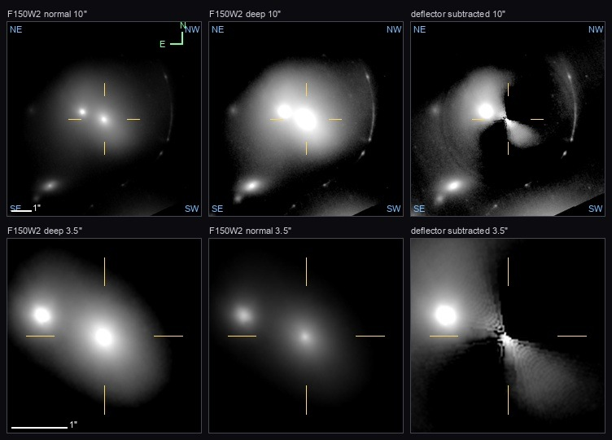{ width="100%" }](img/rank-007-orig.jpg){ target=_blank }
  <figcaption>What the judge saw (blind, footer removed)</figcaption>
</figure>

<figure markdown="span">
  [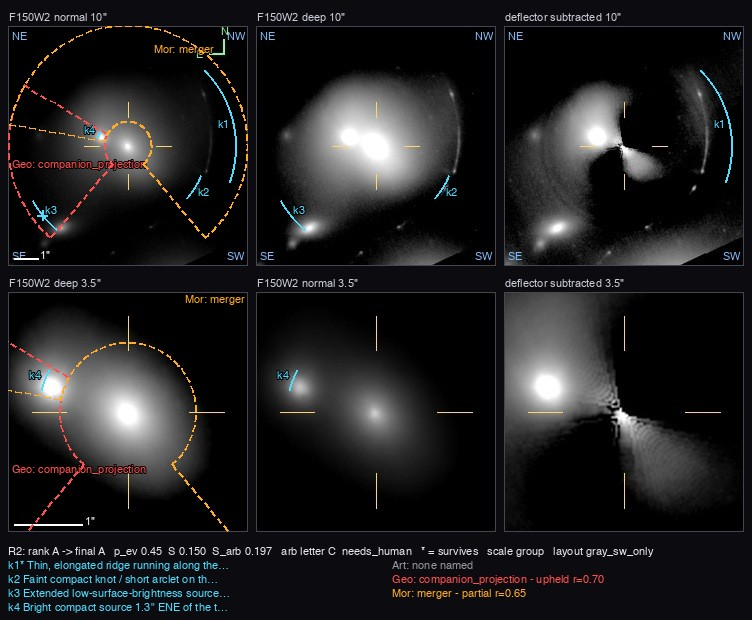{ width="100%" }](img/rank-007-annot.jpg){ target=_blank }
  <figcaption>Advocate evidence (cyan) and critic alternatives coloured by the arbitrator ruling</figcaption>
</figure>

???+ note "Why this grade — advocate, critics, arbitrator"
    **Letter A** (deployed, rule R2) · p_evidence 0.45 · S_arb 0.197 · S 0.15 · scale group

    Letter: letter_rank stands (D rule not met); p_evidence 0.45 >= t_A 0.20 (calibrated at 1% FPR on clean negatives); 2 of 3 configuration criteria >= 6 (curvature, arc_morphology); no critic with r x a >= 0.80.

    **Advocate**

    - criteria: source_contrast 5, low_surface_brightness 7, curvature 6, counter_image 4, arc_morphology 6
    - items (4):
        - k1 — “Thin, elongated ridge running along the western side of the halo, traceable as a bright curved edge in the normal and deep 10" panels and standing out as an offset tangential filament in the subtracted 10" panel; radius stays within ~4.3-5.0" over ~60 deg of azimuth, concave toward the ticked galaxy” (panel c, r 4.5 arcsec, PA 250->315, visible in direct: yes; criteria: source_contrast, low_surface_brightness, curvature, arc_morphology)
        - k2 — “Faint compact knot / short arclet on the SW side, apparently continuing the western ridge inward-southward, seen in the deep 10" panel and as an isolated (non-mirrored) residual in the 10" subtracted panel” (panel b, r 3.3 arcsec, PA 228->248, visible in direct: yes; criteria: low_surface_brightness, arc_morphology)
        - k3 — “Extended low-surface-brightness source to the SE at nearly the same radius as the western ridge and roughly opposite it (PA offset ~26 deg from anti-parallel); shows a diffuse fan/filament curving back toward the deflector - candidate counter-image, though its resolved blob-plus-plume morphology also fits a tidal companion” (panel b, r 4.6 arcsec, PA 120->140, visible in direct: yes; criteria: low_surface_brightness, counter_image)
        - k4 — “Bright compact source 1.3" ENE of the ticked galaxy, sharing a common elongated envelope with it; listed as an inner knot candidate but its brightness and nucleus-like profile are also consistent with a companion / second nucleus, and no matching knot is seen at similar radius on the opposite (WSW) side” (panel e, r 1.3 arcsec, PA 62->76, visible in direct: yes; criteria: source_contrast)
    - scale group; red neighbours within 10 arcsec 3; BCG-like halo yes; deflector is centre yes; arc radius 4.5 arcsec; arc PA span 250->315; counter-image at r 4.6 arcsec PA 129; centre-of-curvature offset 1.2 arcsec
    - p_evidence: 0.45
    - notes: “The strongest located feature is the thin western ridge (r ~4.3-5.0", PA ~250-315) that is a curved bright edge in the direct normal/deep 10" panels and an offset tangential filament in the subtracted 10" panel, concave toward the ticked galaxy; the SE blob-plus-plume at matching radius nearly opposite is the only counter-image candidate, and the inner 1.3" ENE source sits inside a shared envelope so it may be a second nucleus - the central bowtie in (c)/(f) is subtraction artefact and was not counted.”

    **Critics**

    **artifact — no alternative named (nothing in its competence fits)**

    - leaves standing: k1, k2, k3, k4
    - scale_class: group
    - measured: `{"artefact_morphology_check": "no snowball cores, no rectangular low-coverage patches, no horizontal/vertical amplifier striping, no saturation bleed visible in (a) or (b)", "edge_test": "the western ridge (PA 250-315) lies ~0.3-0.7\" inside the 10\" stamp border and is curved, not a straight frame/mosaic edge or 1/f stripe", "f_panel_pattern": "four-lobed bowtie with lobes centred on the core plus concentric ripples at r<1.0\" in (f) and the paired bright triangular lobes in (c) - the stated circular-profile artefact, not counted as an item", "items_traceable_in_undsubtracted_panels": "1,2,3,4 all present in (a)/(b)/(d)/(e); none is subtraction-only, so subtraction_residual is inadmissible for all four", "spike_test": "no straight radial rays at fixed PA emanate from either the ticked core or the bright compact source at r=1.3\", PA~69; the western feature spans ~65 deg of azimuth at r=4.3-5.0\" instead of holding one PA"}`
    - notes: “Everything the scorer lists reappears in the un-subtracted renderings - the western ridge as a bright curved rim on the right side of (a) and (b) at r~4.5", the SE blob-plus-plume at PA~130 in (b), and the compact source 1.3" ENE in (d)/(e) - so none of them can be blamed on the circular subtraction, and the only genuine subtraction signatures (the bowtie lobes and inner ripples in (c)/(f)) are symmetric about the core and were correctly not itemised. No diffraction spike, wisp, snowball, striping, seam or PSF-wing pattern matches any item; whether the SE blob and the ENE source are companions is a morphology call, not mine.”
    - ruling: no ruling for this critic

    **geometry — companion_projection:** “Two discrete, self-nucleated galaxies in projection on the ticked galaxy rather than multiple images of one background source: the compact nucleated object 1.3" ENE sharing a common envelope with the ticked galaxy (a close pair / second nucleus), and the resolved bright-cored galaxy with a plume 4.5" SE whose major axis is not tangential.”

    - location: r 1-5 arcsec, PA 60->140
    - accounts for: k3, k4; leaves standing: k1, k2; strength r 0.70; coverage a 0.50 (geometric)
    - scale_class: group
    - measured: `{"centre_of_curvature_offset": "envelope centroid lies ~0.6-0.7\" ENE of the ticks, between the two nuclei; no common centre found for items 3 and 4", "item3_axis_minus_tangent_deg": 45, "item3_local_tangent_pa_deg": 50, "item3_major_axis_pa_deg": 95, "item3_pa_deg": 140, "item3_pa_offset_from_antiparallel_to_ridge_deg": 26, "item3_profile": "bright compact core plus low-SB plume - centrally concentrated, unlike the thin, coreless western ridge (item 1) it is supposed to mirror", "item3_radius_arcsec": 4.5, "item4_counter_image_at_same_radius_pa249": "absent - panels (d) and (e) show only smooth, monotonic envelope light at r=1.3\", PA~250; flux contrast >10:1", "item4_pa_deg": 69, "item4_profile": "sharply peaked, nucleus-like, PSF-scale core in normal-stretch zoom (e) - same class of profile as the ticked deflector core, not an extended low-SB knot", "item4_radius_arcsec": 1.3, "item4_tangential_elongation": "none measurable; source is round/slightly elliptical with axis along the pair separation (radial), not tangential"}`
    - notes: “In panels (d)/(e) the ENE object at r=1.3", PA~69 is a hard, nucleus-like peak inside a common envelope with the ticked core, and the mirror position (r=1.3", PA~249) is featureless smooth halo - a close pair, not an image/counter-image. In panel (b) the SE source at r~4.5", PA~140 (lower-left) is a resolved galaxy with its own bright core and an E-W major axis (~95 deg) that is ~45 deg off the local tangent (50 deg), and its centrally concentrated profile does not match the thin coreless western ridge of items 1-2, which I leave standing.”
    - ruling: upheld, covers k3, k4 — “Panels (d)/(e) show the r=1.3" ENE source as a hard, PSF-scale nucleus wrapped in the same isophotes as the ticked core with utterly smooth halo at the mirror position PA~249, and the SE object at r~4.5" in (a)/(b) is a centrally concentrated galaxy with its own core and an E-W plume ~45 deg off the local tangent - two projected/interacting galaxies, not image pairs.”

    **morphology — merger:** “The ticked object is not a single relaxed deflector but an interacting pair: a second, PSF-compact nucleus sits 1.3" ENE inside a single common, boxy, NE-SW elongated envelope (panels d and e), and the asymmetric tidal envelope of that merger has a sharp outer western edge/plume that produces the 'ridge' and the faint SW knot at 3-5".”

    - location: r 1-5 arcsec, PA 220->80
    - accounts for: k1, k2, k4; leaves standing: k3; strength r 0.65; coverage a 0.75 (geometric), arbitrated a' 0.50
    - scale_class: group
    - measured: `{"common_envelope_major_axis_pa_deg": "~60-240 (NE-SW), semi-major extent ~2.5-3\" in the 3.5\" zoom", "counter_knot_at_pa_250_r1.3_arcsec": "absent - no mirror of the ENE nucleus", "nuclear_separation_arcsec": 1.3, "nuclear_separation_pa_deg": 70, "western_ridge_azimuth_span_deg": 60, "western_ridge_radius_range_arcsec": "3.7-5.0"}`
    - notes: “In panels (d) and (e) the bright source at r=1.3", PA~70 has a stellar, nucleus-like core with its own halo and is wrapped in the SAME continuous isophotes as the ticked galaxy (the envelope is stretched along the line joining them, PA~60-240) - that is a second nucleus/companion in a common envelope, not an inner lensed knot, and no counterpart exists at PA~250. The western 'ridge' in panel (a) (right side, r~3.7-5.0", PA 250-315) lies exactly on the sharp outer boundary of that same diffuse envelope, with the halo brightness dropping off immediately outside it and small knots strung along it, so it reads as the tidal/shell edge of the merging system rather than an offset arc; the resolved SE object at r~4.5", PA~140 has its own nucleus and I leave it standing as a separate group member.”
    - ruling: partial, covers k2, k4 — “The second nucleus in a common ENE-WSW boxy envelope (panels d, e) and the faint SW knot at r~3.3", PA 228-248 sit squarely on the WSW extension of the pair's major axis and read as tidal envelope structure, but the western ridge in (c) is a thin, high-contrast filament holding r~4-5" across ~60-90 deg of azimuth including due N-of-west (PA~315), well off the envelope's major-axis boundary, so items 1 is not accounted for.”

    **Arbitrator**

    - surviving items: k1 (1 of 4)
    - letter_llm: C; scale_class_final: group; needs_human: yes
    - rationale: “What survives is a single feature: the thin bright ridge on the western (right-hand) side of panels (a)/(b), which in the circular-subtracted 10" panel (c) stands out as an offset, coreless, knotty filament curving concave toward the ticks at roughly constant radius r~4.0-5.0" over PA~250-315 - it is not the central bowtie/ripple artefact, it is traceable in both un-subtracted 10" panels, and it holds no fixed position angle so it is neither a spike nor a frame edge (the artifact critic found no reduction-artefact match and named no alternative). Everything else that made the case for lensing has fallen: the r=1.3" ENE source in the 3.5" zoom is a stellar, nucleus-like peak sharing a continuous envelope with the ticked galaxy and has no counterpart at PA~249, and the SE object at r~4.6" is a resolved galaxy with its own bright core and a plume whose major axis is ~45 deg from the local tangent - so the putative counter-image and inner knot are a close pair and a group member, not multiple images. That leaves one arc-like feature with no counter-arc, on a deflector that is itself an interacting pair whose asymmetric tidal envelope reaches out to roughly that radius; the ridge's thinness and near-constant radius keep lensing alive, but a tidal shell/plume edge is equally consistent with these pixels in a single band with no colour to compare stellar populations. That is a genuine ambiguity that deeper or multi-band imaging (or a reviewer tracing the ridge's surface-brightness profile against the host's) would settle, hence C and needs_human.”

    **Score**

    - S = p_ev x prod(1 - r_i a_i) = 0.45 x (1 - 0.70x0.50) x (1 - 0.65x0.75) = 0.15
        - terms: geometry companion_projection r 0.70 a 0.50; morphology merger r 0.65 a 0.75
    - S_arb = p_ev x prod_{upheld/partial}(1 - r_i a_i') = 0.45 x (1 - 0.70x0.50) x (1 - 0.65x0.50) = 0.197
        - terms: geometry companion_projection r 0.70 a 0.50 (upheld); morphology merger r 0.65 a' 0.50 (partial)
    - stored grade_pred (on S): C — S 0.15 < t_B 0.17 (calibrated at 5% FPR on clean negatives); not D: 4 item(s) located; no named critic covers every item at r >= 0.80
    - stored letter_arb (on S_arb): B; letter_source: opus5_api_calibrated
    - deploy rule R2: letter_rank (advocate only, on p_evidence) = A — p_evidence 0.45 >= t_A 0.20 (calibrated at 1% FPR on clean negatives); 2 of 3 configuration criteria >= 6 (curvature, arc_morphology); no critic with r x a >= 0.80
    - deploy rule R2: letter_final = A — letter_rank stands (D rule not met); p_evidence 0.45 >= t_A 0.20 (calibrated at 1% FPR on clean negatives); 2 of 3 configuration criteria >= 6 (curvature, arc_morphology); no critic with r x a >= 0.80
    - veto: none (letter_final == letter_rank)

---

## Rank 8: J16644236-1024898 {#rank-8}

| Original grade | Passes | Inspector conf. | Pipeline θ_E |
|:--:|:--:|:--:|:--:|
| **B** | 2/3 | 35 | 2.15″ |

| New (final) | Rank letter | p_ev | S_arb | Demoted by | Arb. letter | Needs human |
|:--:|:--:|--:|--:|:--|:--:|:--:|
| **B** | B | 0.28 | 0.093 | — | C | yes ⚑ |

<small>pipeline discovery status `new` · scale class `galaxy`</small>

<figure markdown="span">
  [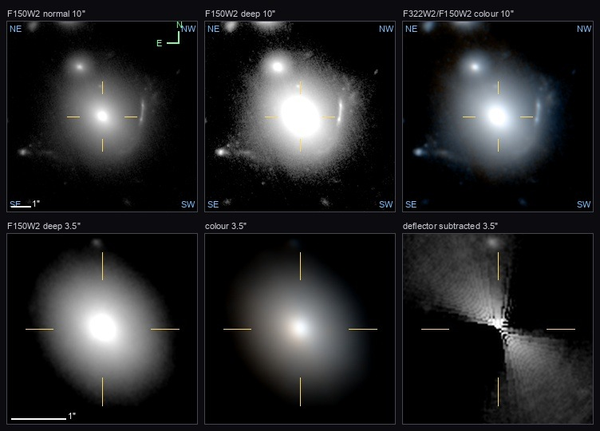{ width="100%" }](img/rank-008-orig.jpg){ target=_blank }
  <figcaption>What the judge saw (blind, footer removed)</figcaption>
</figure>

<figure markdown="span">
  [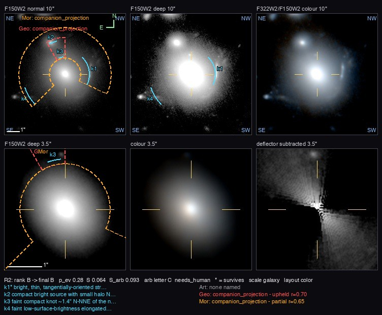{ width="100%" }](img/rank-008-annot.jpg){ target=_blank }
  <figcaption>Advocate evidence (cyan) and critic alternatives coloured by the arbitrator ruling</figcaption>
</figure>

???+ note "Why this grade — advocate, critics, arbitrator"
    **Letter B** (deployed, rule R2) · p_evidence 0.28 · S_arb 0.093 · S 0.064 · scale galaxy

    Letter: letter_rank stands (D rule not met); p_evidence 0.28 >= t_A 0.20 (calibrated at 1% FPR on clean negatives) but A is blocked: only 0 of 3 configuration criteria >= 6; p_evidence 0.28 >= t_B 0.17 (calibrated at 5% FPR on clean negatives).

    **Advocate**

    - criteria: source_contrast 5, low_surface_brightness 6, curvature 4, counter_image 2, arc_morphology 4
    - items (4):
        - k1 — “bright, thin, tangentially-oriented streak west of the core with knotty structure; brightest between PA~265-300 at r~1.6-2.4", faintly concave toward the deflector, but its inner end appears to merge into the galaxy's outer envelope and its radius grows from ~1.2" to ~2.5" along its length” (panel b, r 2 arcsec, PA 245->315, visible in direct: yes; criteria: source_contrast, low_surface_brightness, curvature, arc_morphology)
        - k2 — “compact bright source with small halo NE of the deflector, slightly bluer/whiter than the deflector core in (c); candidate second image or interacting companion” (panel a, r 2.8 arcsec, PA 14->28, visible in direct: yes; criteria: source_contrast, low_surface_brightness)
        - k3 — “faint compact knot ~1.4" N-NNE of the nucleus, seen at the top of the deep zoom (d) and as a small one-sided positive residual in (f) that is not mirrored across the core” (panel d, r 1.45 arcsec, PA 5->20, visible in direct: yes; criteria: source_contrast, low_surface_brightness, counter_image)
        - k4 — “faint low-surface-brightness elongated plume SE of the deflector at large radius, roughly tangential but far outside the candidate arc radius” (panel b, r 3.5 arcsec, PA 108->135, visible in direct: yes; criteria: low_surface_brightness)
    - scale galaxy; red neighbours within 10 arcsec 1; BCG-like halo yes; deflector is centre yes; arc radius 2 arcsec; arc PA span 245->315; centre-of-curvature offset 1 arcsec
    - p_evidence: 0.28
    - notes: “The only strong feature is the knotty W streak at r~2" in (a)/(b): it is offset and roughly tangential over PA 245-315 but its radius drifts from ~1.2" to ~2.5" and it appears continuous with the bright asymmetric envelope, while the NE compact source at 2.8" sits at the wrong azimuth to be its counter-image, so a tidal/merger origin remains fully open for the critics to test; the 3.5" zoom (d)/(e) is saturated inside ~1" and (f) shows only the expected bowtie artefact.”

    **Critics**

    **artifact — no alternative named (nothing in its competence fits)**

    - leaves standing: k1, k2, k3, k4
    - scale_class: galaxy
    - measured: `{"artefact_search": "no mosaic seam, dither edge, 1/f horizontal striping, saturation bleed or snowball ring found in the 10\" field; background is smooth", "items_visible_in_unsubtracted_panels": "1,2,3,4 all traceable in (a)/(b) or (d) - none is subtracted-panel-only", "panel_f_pattern": "four-lobed bowtie plus pixelated criss-cross centred on the ticked core, lobes at PA~45/135/225/315, r<1.2\" - the declared circular-profile artefact, not counted", "psf_wing_check": "no saturated star within the 10\" field; brightest neighbour (PA~20, r~2.8\") is compact with a resolved halo, not a PSF-wing source", "spike_search": "no straight 6-spike ray system at fixed PA anywhere in (a)/(b); the west feature at PA 265-300, r=1.2-2.5\" is knotty and curved, inconsistent with a diffraction ray"}`
    - notes: “Every located item appears in un-subtracted renderings - the west streak (PA 265-300, r~1.2-2.5") in (a) and (b), the NE compact source (PA~20, r~2.8") in (a)/(c), the N-NNE knot in (d), the SE plume in (b) - so none qualifies as a subtraction residual, and the only structure unique to (f) is the mandated circular-model bowtie inside r~1.2". I find no diffraction spike, snowball, striping, seam or PSF wing in my views, so I offer no instrumental alternative.”
    - ruling: no ruling for this critic

    **geometry — companion_projection:** “The two northern sources are unrelated projected/physical companions, not lensed images: a compact round galaxy with its own circular halo at r~2.8" PA~20 (panel b, upper-left of the ticks) and a small round knot at r~1.5" PA~5 (top of panel d / e). Neither is tangentially elongated, their radii differ by a factor ~2, they lie ~90 deg away from the western streak instead of opposite it, and their surface-brightness profiles (compact core + halo, and a soft round blob) do not match the thin knotty streak.”

    - location: r 1.3-3 arcsec, PA 0->30
    - accounts for: k2, k3; leaves standing: k1, k4; strength r 0.70; coverage a 0.50 (geometric)
    - scale_class: galaxy
    - measured: `{"counter_image_search": "no source at r=1.8-2.6\", PA=74-112 in panel (b); the nearest eastern features are the plume/knot at r=3.5-4.5\", PA=110-135 (item 4)", "deflector_centre_panel_b_px": "(243,270), 48 px/arcsec", "item1_arc_endpoints": "top (348,228) -> r=2.35\", PA=292; bottom (336,296) -> r=2.00\", PA=254; radius roughly constant 2.0-2.35\"", "item1_axis_ratio": "length ~1.45\", width ~0.2\", ~7:1", "item1_sagitta": "~3 px bulge west of the endpoint chord, i.e. weakly concave toward the deflector; implied centre of curvature within ~1-2\" of the ticked nucleus but poorly constrained", "item2": "r=2.8\", PA=20, round core with symmetric halo, no tangential elongation", "item3": "r=1.45-1.5\", PA=3-8, round soft knot, no tangential elongation", "pa_separation_item1_to_item2/3": "92-108 deg, not the ~180 deg required for a two-image pair; no third/fourth image to close a quad"}`
    - notes: “In panel (b) the source at (197,143) is a round compact galaxy with its own halo 2.8" NE (PA 20) of the ticks, and the blob at the top of panel (d) is a soft round knot at 1.5" PA~5 - neither is stretched perpendicular to the radius vector and their radii are mutually incompatible, so they read as projected/interacting neighbours rather than counter-images. The western streak (item 1, r=2.0-2.35", PA 254-292) keeps a nearly constant radius and is weakly concave toward the nucleus, but it has no partner at r~2" on the eastern side (PA 74-112), where panel (b) is blank down to the SE plume at r>3.5".”
    - ruling: upheld, covers k2, k3 — “The source ~2.8" NE of the ticks in (a)/(b) is a round compact core with its own concentric halo and the 1.5" N blob at the top of (d)/(e) is a soft round knot; neither shows tangential stretch, their radii differ by a factor ~2 and they sit ~90-105 deg from the western streak rather than opposite it, so a projected/interacting neighbour reading is what the pixels show.”

    **morphology — companion_projection:** “Four unrelated discrete objects strewn through the host elliptical's very extended envelope: a small elongated (edge-on-looking) galaxy ~2.3" W, a compact haloed satellite 2.8" NE, a compact knot 1.5" N, and a low-surface-brightness companion/plume 3.7" SE - none tangentially elongated about the ticked core and none at a common radius.”

    - location: r 1.3-3.8 arcsec, PA 245->135
    - accounts for: k1, k2, k3, k4; leaves standing: none; strength r 0.65; coverage a 1.00 (geometric), arbitrated a' 0.75
    - scale_class: galaxy
    - measured: `{"host_zoom": "(d)/(e) inside 1.75\": smooth elliptical, b/a~0.75, major axis PA~320, no arms, no bar, no ring, no arc", "item1_position_angle_of_elongation": "long axis ~PA 150/330, while the tangential direction at PA 271 is 0/180 -> ~40-45 deg mismatch; inner end blends into the envelope, radius grows 1.2->2.5\"", "item1_radius_and_length": "centroid r~2.3\" at PA~271 in (c) (108 px W, 3 px N of tick centre at 46 px/\"); streak length only ~40 px ~0.9\", i.e. ~22 deg of arc, not the 70 deg quoted", "item2": "r=2.8\", PA=24 (52 px E, 118 px N in (c)); compact core plus its own small halo", "item3": "r=1.52\", PA=3.5 measured in (d) with the 1\" bar = 140 px (13 px E, 212 px N of tick centre); round, unresolved-looking, no tangential stretch", "item4": "r=3.7\", PA=126 (137 px E, 102 px S in (c)); diffuse, well outside the item-1 radius", "radius_spread": "1.5, 2.3, 2.8, 3.7\" - factor 2.5, no common Einstein radius; no PA pairing near 180 deg apart"}`
    - notes: “In (d)/(e) the host is a completely smooth elliptical out to 1.7" with no arm, ring or arc, so the cited features are all external: the W streak in (c) (~108 px right of the tick centre) is only ~0.9" long, its long axis is tilted ~40 deg from tangential and its inner end runs into the envelope, i.e. a small elongated companion or streamer rather than a fixed-radius arc. The other three sit at 1.5", 2.8" and 3.7" on three unrelated position angles with no counter-image, the signature of chance companions inside a big diffuse halo.”
    - ruling: partial, covers k2, k3, k4 — “The NE haloed source, the N knot and the diffuse SE plume in (b)/(c) are indeed three discrete objects at 1.5", 2.8" and 3.7" on unrelated position angles inside one big envelope, but for item 1 the two critics disagree at the pixel level - geometry measures a nearly constant radius 2.0-2.35" with weak concavity toward the core while morphology measures a 0.9" streak tilted ~40 deg from tangential with the radius growing - so its companion/streamer reading is not established.”

    **Arbitrator**

    - surviving items: k1 (1 of 4)
    - letter_llm: C; scale_class_final: galaxy; needs_human: yes
    - rationale: “After the rulings only the western feature survives: the knotty, roughly N-S elongated streak lying ~1.2-2.5" west (right, since E is left) of the ticked nucleus, clearly present in the un-subtracted panels (a), (b) and (c) and therefore not a subtraction product - panel (f) shows nothing but the mandated four-lobed bowtie and criss-cross inside r~1.2", which I ignore. That streak is the only item with any tangential character, and it is ambiguous: it is offset, thin (~7:1) and shows a slight concavity toward the core in (a), yet its inner end runs continuously into the bright asymmetric envelope, its long axis is tilted well away from the tangential direction at PA~271, and panel (b) is blank at the mirror azimuth (r~2", PA 74-112) where a counter-arc should sit. The northern pair (compact haloed galaxy at 2.8" PA~20, round knot at 1.5" PA~5) are round, radially inconsistent and ~90 deg off the required 180 deg pairing, so they are companions, not counter-images, and the SE plume at r~3.7" is far outside any common Einstein radius; the host itself is a smooth elliptical out to 1.7" in (d)/(e) with no arm, bar or ring. With one un-paired, partly envelope-blended streak and an otherwise interacting/tidal-looking field, the evidence neither confirms nor refutes lensing; a reviewer or deeper/multi-band data measuring the streak's curvature centre and colour against the deflector would settle whether it is an arc or a stream.”

    **Score**

    - S = p_ev x prod(1 - r_i a_i) = 0.28 x (1 - 0.70x0.50) x (1 - 0.65x1.00) = 0.064
        - terms: geometry companion_projection r 0.70 a 0.50; morphology companion_projection r 0.65 a 1.00
    - S_arb = p_ev x prod_{upheld/partial}(1 - r_i a_i') = 0.28 x (1 - 0.70x0.50) x (1 - 0.65x0.75) = 0.093
        - terms: geometry companion_projection r 0.70 a 0.50 (upheld); morphology companion_projection r 0.65 a' 0.75 (partial)
    - stored grade_pred (on S): C — S 0.064 < t_B 0.17 (calibrated at 5% FPR on clean negatives); not D: 4 item(s) located; no named critic covers every item at r >= 0.80
    - stored letter_arb (on S_arb): C; letter_source: opus5_api_calibrated
    - deploy rule R2: letter_rank (advocate only, on p_evidence) = B — p_evidence 0.28 >= t_A 0.20 (calibrated at 1% FPR on clean negatives) but A is blocked: only 0 of 3 configuration criteria >= 6; p_evidence 0.28 >= t_B 0.17 (calibrated at 5% FPR on clean negatives)
    - deploy rule R2: letter_final = B — letter_rank stands (D rule not met); p_evidence 0.28 >= t_A 0.20 (calibrated at 1% FPR on clean negatives) but A is blocked: only 0 of 3 configuration criteria >= 6; p_evidence 0.28 >= t_B 0.17 (calibrated at 5% FPR on clean negatives)
    - veto: none (letter_final == letter_rank)

---

## Rank 9: J19789495-132348 {#rank-9}

| Original grade | Passes | Inspector conf. | Pipeline θ_E |
|:--:|:--:|:--:|:--:|
| **B** | 2/3 | 32 | 2.70″ |

| New (final) | Rank letter | p_ev | S_arb | Demoted by | Arb. letter | Needs human |
|:--:|:--:|--:|--:|:--|:--:|:--:|
| **B** | B | 0.35 | 0.245 | — | C | yes ⚑ |

<small>pipeline discovery status `known` · scale class `galaxy`</small>

<figure markdown="span">
  [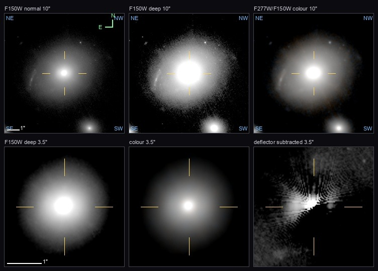{ width="100%" }](img/rank-009-orig.jpg){ target=_blank }
  <figcaption>What the judge saw (blind, footer removed)</figcaption>
</figure>

<figure markdown="span">
  [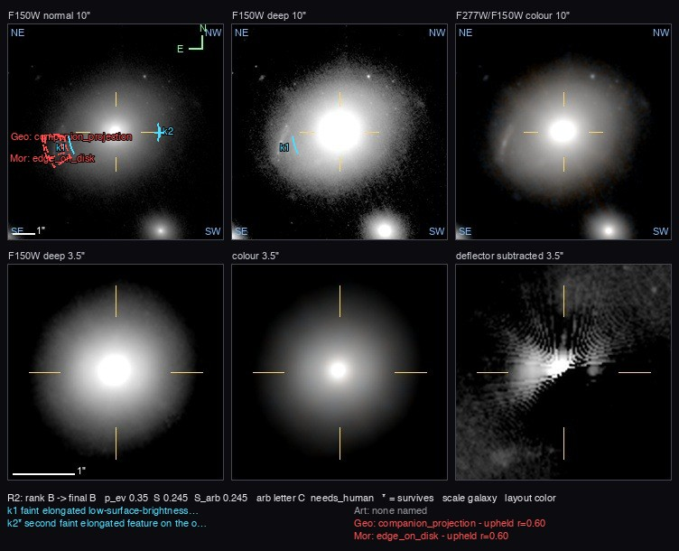{ width="100%" }](img/rank-009-annot.jpg){ target=_blank }
  <figcaption>Advocate evidence (cyan) and critic alternatives coloured by the arbitrator ruling</figcaption>
</figure>

???+ note "Why this grade — advocate, critics, arbitrator"
    **Letter B** (deployed, rule R2) · p_evidence 0.35 · S_arb 0.245 · S 0.245 · scale galaxy

    Letter: letter_rank stands (D rule not met); p_evidence 0.35 >= t_A 0.20 (calibrated at 1% FPR on clean negatives) but A is blocked: only 1 of 3 configuration criteria >= 6; p_evidence 0.35 >= t_B 0.17 (calibrated at 5% FPR on clean negatives).

    **Advocate**

    - criteria: source_contrast 5, low_surface_brightness 6, curvature 3, counter_image 6, arc_morphology 3
    - items (2):
        - k1 — “faint elongated low-surface-brightness streak east-southeast of the ticked galaxy, traceable in the normal, deep and colour 10" panels; slightly redder/orange in (c) than the white deflector halo, mildly concave toward the nucleus” (panel b, r 2.2 arcsec, PA 95->118, visible in direct: yes; criteria: source_contrast, low_surface_brightness, counter_image)
        - k2 — “second faint elongated feature on the opposite (western) side at a comparable radius (r ratio ~0.9), similar thin low-surface-brightness profile, seen in (a), (b) and (c) - candidate counter-image to item 1” (panel a, r 2 arcsec, PA 258->282, visible in direct: yes; criteria: low_surface_brightness, counter_image)
    - scale galaxy; red neighbours within 10 arcsec 1; BCG-like halo yes; deflector is centre yes; arc radius 2.1 arcsec; arc PA span 95->118; counter-image at r 2 arcsec PA 270; centre-of-curvature offset 1.5 arcsec
    - p_evidence: 0.35
    - notes: “Two faint thin features straddle the ticked galaxy at r~2.0-2.2" (PA~107 and PA~270) in the un-subtracted 10" panels, passing the opposite-side/similar-radius test, but both are elongated close to the radial direction and lie nearly on one line through the nucleus, so a superposed edge-on disc or a tidal plume must be tested; the 3.5" zoom row covers only r<1.75" and shows a smooth saturated profile, and (f) shows only the circular-model butterfly/ring artefacts, so it is uninformative here.”

    **Critics**

    **artifact — no alternative named (nothing in its competence fits)**

    - leaves standing: k1, k2
    - scale_class: galaxy
    - measured: `{"bands_showing_features": "both (features present in F150W panels a,b and in the F277W/F150W colour panel c)", "bright_neighbour_star": "r approx 4.2 arcsec, PA approx 175 (south, panels a/b/c bottom edge)", "item_pa_midpoints_deg": "106.5 (k1) and 270 (k2)", "pa_separation_deg": 163.5, "radii_arcsec": "2.2 (k1), 2.0 (k2)", "required_separation_for_a_single_spike_pair_deg": 180, "zoom_panel_half_width_arcsec": 1.75}`
    - notes: “Both streaks sit at r=2.0-2.2" and are therefore OUTSIDE the 3.5" zoom (half-width 1.75"), so the checkerboard/butterfly in (f) - a pure artefact of the circular-profile subtraction - has no bearing on them; they are seen directly in (a), (b) and (c), ruling out subtraction_residual. They are curved and detached rather than straight rays continuing through the core, their PA midpoints differ by 163.5 deg rather than the 180 deg a single spike line requires, no other spike arms of a 6-spike pattern are present, and the only bright star lies ~4.2" due south (PA~175) with its own spikes nowhere near PA 106/270 at 2"; no snowball, cosmic-ray track, 1/f stripe spanning the frame, or PSF wing accounts for them.”
    - ruling: no ruling for this critic

    **geometry — companion_projection:** “The ESE feature is a discrete, compact needle-like object (small edge-on galaxy or knot) superposed on the host's outer envelope, not an image of a background source: its long axis is nearly radial rather than tangential, it is far brighter and more compact than anything on the opposite side, and no matching counter-source exists at a compatible radius.”

    - location: r 2.6-3.4 arcsec, PA 93->112
    - accounts for: k1; leaves standing: k2; strength r 0.60; coverage a 0.00 (geometric)
    - scale_class: galaxy
    - measured: `{"item1_curvature_centre": "no coherent centre of curvature on the ticked nucleus; the feature is closer to a straight needle than to an arc segment about the tick centre", "item1_long_axis_pa_deg": "~130/310, which is only ~30 deg from the radial direction (PA 100/280) and ~60 deg from the tangential direction (PA 10/190) - not tangentially elongated", "item1_radius_measured_arcsec": "~3.0-3.2 (145 px E, 23 px S of tick centre in panel (b), 10\" field), i.e. ~40% larger than the quoted 2.2\"", "item2_counterimage_test": "at PA 258-282, r~2.0\" panel (b) shows only smooth envelope light; no discrete source of comparable surface brightness or profile to item 1 is separable there (surface-brightness contrast ratio >>2)", "profile_consistency": "item 1 is high-contrast and compact against the halo; the western region is diffuse - the two are not consistent as images of one source", "zoom_panels": "panels (d) and (e) (3.5\" = 1.75\" radius) are featureless and perfectly smooth, so neither item lies inside them and no inner arc structure exists"}`
    - notes: “In panel (b) the ESE feature sits ~3.1" from the tick centre at PA~100 with its long axis running ~PA 130, i.e. tilted only ~30 deg off the radius vector - a projected needle, not a tangential arc; the western side at PA 258-282, r~2.0" shows no discrete counterpart of matching brightness or profile, so the pair fails the counter-image test. Panels (d) and (e) show a completely smooth galaxy inside 1.75", with no inner arc or ring.”
    - ruling: upheld, covers k1 — “The ESE feature in (a)/(b)/(c) sits ~2.5-3" left and slightly below the nucleus as a compact high-contrast sliver whose long axis runs NW-SE (~PA 130), only ~30 deg off the radius vector and ~60 deg from the tangential direction, with no coherent centre of curvature on the tick centre - a superposed discrete object, not an arc.”

    **morphology — edge_on_disk:** “The ESE streak is a small, thin edge-on disc / needle galaxy projected onto the outer envelope of the ticked elliptical: a straight ~1.0" x 0.2" sliver with a central brightening whose long axis lies close to the radius vector, not perpendicular to it, and which is a distinct object rather than host structure.”

    - location: r 2.4-3.3 arcsec, PA 95->120
    - accounts for: k1; leaves standing: k2; strength r 0.60; coverage a 0.50 (geometric)
    - scale_class: galaxy
    - measured: `{"axis_ratio": 5.0, "local_tangential_pa_deg": 194, "measured_radius_arcsec": 2.9, "misalignment_from_tangential_deg": 59, "streak_length_arcsec": 1.0, "streak_long_axis_pa_deg": 135, "streak_width_arcsec": 0.2, "zoom_panel_halo_structure": "panels (d) and (e) show a featureless, smooth, monotonically declining envelope out to r=1.75\" - no arc, ring, arm or shell"}`
    - notes: “In panel (c) the feature ~132 px east and ~32 px south of the nucleus (r~2.9", PA~104) is a straight thin sliver whose long axis runs NW-SE (PA~135), i.e. ~30 deg from the radius vector and ~60 deg from the tangential direction, so it is a needle seen in projection rather than an arc curved about the tick centre; the 3.5" deep zoom (d) shows a perfectly smooth halo with no arms, ring or shells that this could belong to, and I see no convincing western counterpart at the item-2 position so item 2 is left standing.”
    - ruling: upheld, covers k1 — “Same pixels: a straight ~1"x0.2" needle with a central brightening, axis ratio ~5 and no tangential bending, projected on a halo that is perfectly smooth inside 1.75" in panels (d)/(e), so it belongs to no arm, ring or shell of the host and is an edge-on/needle interloper.”

    **Arbitrator**

    - surviving items: k2 (1 of 2)
    - letter_llm: C; scale_class_final: galaxy; needs_human: yes
    - rationale: “The catalogued galaxy at the yellow ticks is a smooth, saturated envelope - panels (d) and (e) show a monotonic, featureless halo out to 1.75" with no inner arc, ring or knot, and the checkerboard/butterfly in (f) is the expected circular-profile artefact and carries no weight. Everything rests on two thin low-surface-brightness streaks straddling the nucleus at r~2-3" in the 10" panels: the eastern one (left of the core, ~40-70 px east and a little south in (a)/(b), also faintly orange in (c)) and a comparable western one (right of the core in (a)/(b)). Both geometry and morphology critics independently measured the eastern feature's long axis at PA~130-135, i.e. within ~30 deg of the radius vector and ~60 deg from tangential, and it is compact and needle-like rather than curving about the tick centre; that upholds a projected edge-on/companion interloper and removes item 1. Item 2, the western streak, is left standing by both critics and is the only surviving evidence, but it too is elongated close to the radial direction and lies almost on the same line through the nucleus as item 1, which is at least as consistent with a single superposed needle or a tidal plume as with a counter-image; with no tangential curvature, no third image and nothing inside 1.75", the evidence neither confirms nor refutes lensing, hence C. A reviewer with the full-resolution frame (or any second-epoch/multi-band data) could decide whether the two opposite streaks are one edge-on disc seen through the envelope, which would settle this to D.”

    **Score**

    - S = p_ev x prod(1 - r_i a_i) = 0.35 x (1 - 0.60x0.00) x (1 - 0.60x0.50) = 0.245
        - terms: geometry companion_projection r 0.60 a 0.00; morphology edge_on_disk r 0.60 a 0.50
    - S_arb = p_ev x prod_{upheld/partial}(1 - r_i a_i') = 0.35 x (1 - 0.60x0.00) x (1 - 0.60x0.50) = 0.245
        - terms: geometry companion_projection r 0.60 a 0.00 (upheld); morphology edge_on_disk r 0.60 a 0.50 (upheld)
    - stored grade_pred (on S): B — S 0.245 >= t_A 0.20 (calibrated at 1% FPR on clean negatives) but A is blocked: only 1 of 3 configuration criteria >= 6; S 0.245 >= t_B 0.17 (calibrated at 5% FPR on clean negatives)
    - stored letter_arb (on S_arb): B; letter_source: opus5_api_calibrated
    - deploy rule R2: letter_rank (advocate only, on p_evidence) = B — p_evidence 0.35 >= t_A 0.20 (calibrated at 1% FPR on clean negatives) but A is blocked: only 1 of 3 configuration criteria >= 6; p_evidence 0.35 >= t_B 0.17 (calibrated at 5% FPR on clean negatives)
    - deploy rule R2: letter_final = B — letter_rank stands (D rule not met); p_evidence 0.35 >= t_A 0.20 (calibrated at 1% FPR on clean negatives) but A is blocked: only 1 of 3 configuration criteria >= 6; p_evidence 0.35 >= t_B 0.17 (calibrated at 5% FPR on clean negatives)
    - veto: none (letter_final == letter_rank)

---

## Rank 10: J23069956+2559453 {#rank-10}

| Original grade | Passes | Inspector conf. | Pipeline θ_E |
|:--:|:--:|:--:|:--:|
| **A** | 3/3 | 28 | 1.37″ |

| New (final) | Rank letter | p_ev | S_arb | Demoted by | Arb. letter | Needs human |
|:--:|:--:|--:|--:|:--|:--:|:--:|
| **B** | B | 0.35 | 0.190 | — | C | yes ⚑ |

<small>pipeline discovery status `new` · scale class `galaxy`</small>

<figure markdown="span">
  [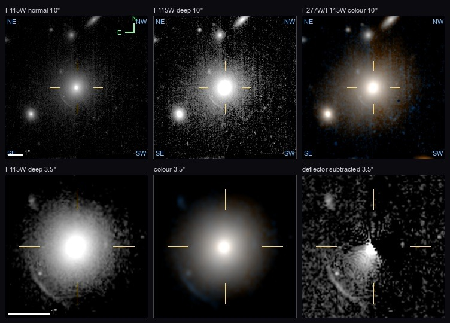{ width="100%" }](img/rank-010-orig.jpg){ target=_blank }
  <figcaption>What the judge saw (blind, footer removed)</figcaption>
</figure>

<figure markdown="span">
  [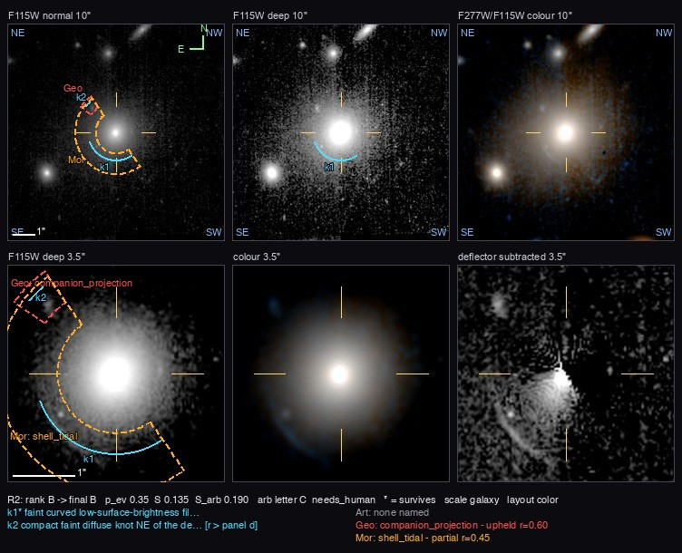{ width="100%" }](img/rank-010-annot.jpg){ target=_blank }
  <figcaption>Advocate evidence (cyan) and critic alternatives coloured by the arbitrator ruling</figcaption>
</figure>

???+ note "Why this grade — advocate, critics, arbitrator"
    **Letter B** (deployed, rule R2) · p_evidence 0.35 · S_arb 0.19 · S 0.135 · scale galaxy

    Letter: letter_rank stands (D rule not met); p_evidence 0.35 >= t_A 0.20 (calibrated at 1% FPR on clean negatives) but A is blocked: only 0 of 3 configuration criteria >= 6; p_evidence 0.35 >= t_B 0.17 (calibrated at 5% FPR on clean negatives).

    **Advocate**

    - criteria: source_contrast 4, low_surface_brightness 6, curvature 5, counter_image 2, arc_morphology 4
    - items (2):
        - k1 — “faint curved low-surface-brightness filament hugging the south/south-east side of the deflector at roughly constant radius (~1.2-1.5"), concave toward the core; seen in the 10" deep stretch and reappearing as a one-sided (non-mirrored) offset residual in the subtracted zoom” (panel b, r 1.3 arcsec, PA 110->215, visible in direct: yes; criteria: low_surface_brightness, curvature, arc_morphology)
        - k2 — “compact faint diffuse knot NE of the deflector, distinct from the halo, no tangential elongation” (panel d, r 1.85 arcsec, PA 40->50, visible in direct: yes; criteria: source_contrast, low_surface_brightness) [r exceeds panel d: its field is 3.5 arcsec]
    - scale galaxy; red neighbours within 10 arcsec 2; BCG-like halo yes; deflector is centre yes; arc radius 1.3 arcsec; arc PA span 110->215; centre-of-curvature offset 0.4 arcsec
    - p_evidence: 0.35
    - notes: “In panel (b) a thin curved filament wraps the core from PA~110 through ~215 at r~1.3" and the subtracted zoom (f) carries the same flux as a one-sided fan/wedge SE-S of the nucleus with nothing mirrored to the N, but the feature is broad and merges into the halo, so a disc/spiral-arm or tidal origin is open; the direct zoom (d,e) is saturated inside ~0.8" so any inner counter-image would be hidden.”

    **Critics**

    **artifact — no alternative named (nothing in its competence fits)**

    - leaves standing: k1, k2
    - scale_class: galaxy
    - measured: `{"bright_neighbour": "compact source at r~3.6\", PA~121 deg (lower-left of core in a/b); its diffuse halo overlaps only the PA 110-135 end of item 1 and falls off radially, not tangentially", "core_spikes": "faint straight rays from the compact core in (a) at fixed angles, no ray crosses PA 110-215 at r=1.3\" with curvature", "item2_check": "the NE knot at r~1.85\", PA~45 is present in the un-subtracted deep zoom (d) and in (b), so it is not a residual; it is diffuse and lacks the bright core+ring signature of a snowball or the sharp track of a cosmic ray", "panel_f_residual": "one-sided bright fan from the core to r~1.5\", PA ~130-230, sharp outer edge; NOT the four-lobed butterfly/dipole symmetry expected from the circular model, and it is co-located with the arc already visible in (b) and (d)", "striping_orientation_panel_b": "columnar 1/f noise running exactly N-S (PA 0/180), amplitude comparable to the faint halo, cannot generate a feature at constant radius"}`
    - notes: “The only instrumental signatures I can point to are the vertical 1/f column striping across panel (b) and the halo of the compact neighbour at r~3.6", PA~121; neither can produce a ~105-deg feature lying at constant radius r~1.3" concave toward the core, and no diffraction ray, wisp or persistence blob sits at PA 110-215. Both items appear in un-subtracted panels (b) and (d), so subtraction_residual is inadmissible for either; I have no artifact alternative.”
    - ruling: no ruling for this critic

    **geometry — companion_projection:** “The NE knot is an unrelated small compact object projected on the deflector halo: it is round (no tangential stretch), sits at a radius incompatible with the SE filament, and has no counter-image on the opposite side, so it cannot be part of the same lensed image family.”

    - location: r 1.4-2 arcsec, PA 35->55
    - accounts for: k2; leaves standing: k1; strength r 0.60; coverage a 0.50 (geometric)
    - scale_class: galaxy
    - measured: `{"colour_check_panel_e": "knot is a faint bluish-white patch; filament SE is faint blue-white - two-band colour too weak to link or separate them", "counter_image_search": "no compact or extended feature at PA ~215-235 and r 1.4-2.0\" in panels (b), (d) or (e)", "item1_geometry": "filament spans PA ~110-215 at r 1.2-1.5\", concave toward the tick centre; centre of curvature within ~0.3-0.5\" of the deflector core - consistent with a tangential feature, not addressed by my alternative", "knot_axis_ratio": "~1.1-1.2, no measurable tangential elongation; major axis not perpendicular to the radius vector", "knot_position_panel_d": "r ~1.5-1.9\", PA ~44 deg (up-left of tick centre)", "radius_mismatch_with_item1": "knot r~1.7\" vs filament r~1.3\" -> ~0.4\" (>25%) inconsistent for images of one source in a near-circular potential"}`
    - notes: “In panel (d) the NE feature at PA~44, r~1.7" is a round 4-6 px blob with no tangential stretch and no mirror partner at PA~224 at the same radius, so it is a chance projection rather than a counter-image of the SE filament (r~1.3", PA 110-215), which I leave standing as a genuinely tangential, core-concentric feature.”
    - ruling: upheld, covers k2 — “The NE feature in panel (d) at r~1.5-1.9", PA~44 is a round 4-6 px blob with axis ratio ~1.1 and no tangential stretch, and nothing sits at the mirror position PA~224 at the same radius in (b), (d) or (e), so it is a chance projection on the halo rather than a counter-image.”

    **morphology — shell_tidal:** “Interleaved low-surface-brightness debris in a disturbed outer envelope: a sharp-edged shell arc on the SE side at r~1.1" and a compact debris knot/wisp on the opposite (NE) side at r~1.45", both riding on the mottled, patchy envelope of a recently disturbed host rather than being an arc + counter-image at one Einstein radius”

    - location: r 0.95-1.9 arcsec, PA 35->215
    - accounts for: k1, k2; leaves standing: none; strength r 0.45; coverage a 1.00 (geometric), arbitrated a' 0.50
    - scale_class: galaxy
    - measured: `{"NE_knot_panel_d": "blob at (x,y)~(100,120) px -> r = 1.45\", PA = 42 deg, ~0.2\" across, round, no tangential elongation", "SE_filament_panel_d": "traced from (x,y)~(85,355) to ~(150,400) px; r = 1.19\" at PA 117 falling to r = 1.05\" at PA 144, i.e. radius flat-to-slightly-decreasing over ~27 deg, arc length ~0.5\", width ~0.1\", outer edge sharper than inner", "envelope_panel_c": "brown/blue mottled patchy envelope out to ~4\" with additional blue knots at PA ~200-230 (r~2.5\") and PA ~20-60, i.e. the two cited features are not unique in the field", "radius_ratio_SE_to_NE": "1.05-1.19\" vs 1.45\" -> the two features are NOT at a common radius about the ticked nucleus (offset ~25%)"}`
    - notes: “In panel (d) the SE feature is a single sharp-outer-edged filament at r~1.05-1.19", PA 117-144, with no bridge to the nucleus and no monotonic radius growth (so not a spiral arm), while the NE feature at r=1.45", PA 42 is a round knot with no tangential stretch; their unequal radii and the generally mottled, clumpy envelope seen in panel (c) fit interleaved tidal/shell debris at least as well as an arc plus counter-image, but panel (d) is too faint at 1" from the bright core to show the classic host-profile shell edge, so this does not clearly beat lensing.”
    - ruling: partial, covers k2 — “The shell/debris reading fits the round NE knot and the mottled envelope knots at PA~200-230 in (c), but it does not account for item 1: the SE feature in (b) traces a smooth ~100-deg tangential sweep concave toward the tick centre at roughly constant r~1.2-1.5" with its centre of curvature within ~0.4" of the core, and the critic itself concedes no host-profile shell edge is visible.”

    **Arbitrator**

    - surviving items: k1 (1 of 2)
    - letter_llm: C; scale_class_final: galaxy; needs_human: yes
    - rationale: “What survives is a single feature: in the 10" deep panel (b) a thin low-surface-brightness filament wraps the south/south-east flank of the ticked galaxy from PA~110 round to ~215 at r~1.2-1.5", concave toward the core, and the same flux reappears in the subtracted zoom (f) as a one-sided bright fan/wedge SE-S of the nucleus with nothing mirrored to the north - a one-sided offset feature, not the four-lobed butterfly or concentric ring the circular profile subtraction manufactures, so it is admissible and is also traceable in the un-subtracted (b)/(d). Against it: the feature is broad and merges into the halo rather than showing a thin, structured arc, the deep zoom (d) is saturated inside ~0.8" so no inner counter-image can be checked, the artifact critic correctly finds no diffraction ray, striping (columnar N-S) or neighbour halo (r~3.6", PA~121) that can make a constant-radius 105-deg feature, and the only candidate second image - the NE blob at r~1.7", PA~44 - is round, at a ~25% discrepant radius, and is upheld as a projection, leaving the arc with no counter-image family. The sharp outer edge and the clumpy envelope in (c) keep a tidal-shell or outer-disc origin genuinely open, so the evidence neither confirms nor refutes lensing; a reviewer with a proper elliptical-model subtraction or multi-band colour on the SE filament would settle it.”

    **Score**

    - S = p_ev x prod(1 - r_i a_i) = 0.35 x (1 - 0.60x0.50) x (1 - 0.45x1.00) = 0.135
        - terms: geometry companion_projection r 0.60 a 0.50; morphology shell_tidal r 0.45 a 1.00
    - S_arb = p_ev x prod_{upheld/partial}(1 - r_i a_i') = 0.35 x (1 - 0.60x0.50) x (1 - 0.45x0.50) = 0.19
        - terms: geometry companion_projection r 0.60 a 0.50 (upheld); morphology shell_tidal r 0.45 a' 0.50 (partial)
    - stored grade_pred (on S): C — S 0.135 < t_B 0.17 (calibrated at 5% FPR on clean negatives); not D: 2 item(s) located; no named critic covers every item at r >= 0.80
    - stored letter_arb (on S_arb): B; letter_source: opus5_api_calibrated
    - deploy rule R2: letter_rank (advocate only, on p_evidence) = B — p_evidence 0.35 >= t_A 0.20 (calibrated at 1% FPR on clean negatives) but A is blocked: only 0 of 3 configuration criteria >= 6; p_evidence 0.35 >= t_B 0.17 (calibrated at 5% FPR on clean negatives)
    - deploy rule R2: letter_final = B — letter_rank stands (D rule not met); p_evidence 0.35 >= t_A 0.20 (calibrated at 1% FPR on clean negatives) but A is blocked: only 0 of 3 configuration criteria >= 6; p_evidence 0.35 >= t_B 0.17 (calibrated at 5% FPR on clean negatives)
    - veto: none (letter_final == letter_rank)

---

## Rank 11: J8999381-2012203 {#rank-11}

| Original grade | Passes | Inspector conf. | Pipeline θ_E |
|:--:|:--:|:--:|:--:|
| **C** | 1/3 | 72 | 2.00″ |

| New (final) | Rank letter | p_ev | S_arb | Demoted by | Arb. letter | Needs human |
|:--:|:--:|--:|--:|:--|:--:|:--:|
| **A** | A | 0.80 | 0.653 | — | B | yes ⚑ |

<small>pipeline discovery status `new` · scale class `galaxy`</small>

<figure markdown="span">
  [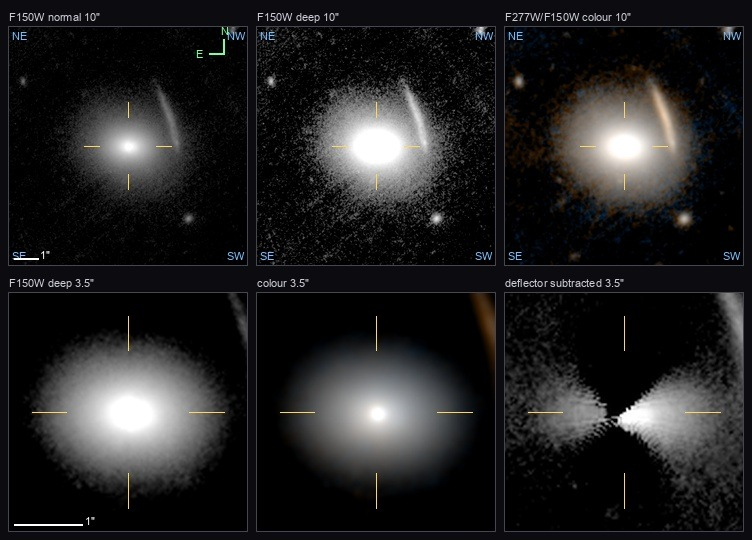{ width="100%" }](img/rank-011-orig.jpg){ target=_blank }
  <figcaption>What the judge saw (blind, footer removed)</figcaption>
</figure>

<figure markdown="span">
  [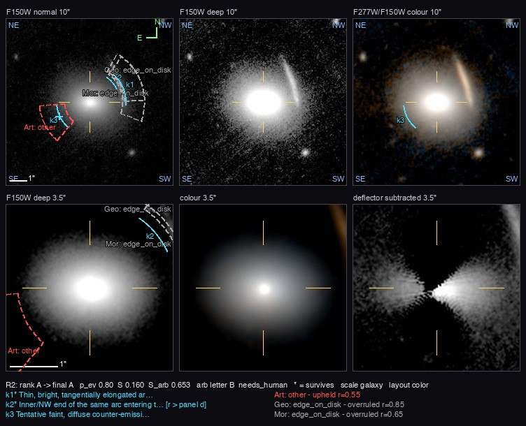{ width="100%" }](img/rank-011-annot.jpg){ target=_blank }
  <figcaption>Advocate evidence (cyan) and critic alternatives coloured by the arbitrator ruling</figcaption>
</figure>

???+ note "Why this grade — advocate, critics, arbitrator"
    **Letter A** (deployed, rule R2) · p_evidence 0.80 · S_arb 0.653 · S 0.16 · scale galaxy

    Letter: letter_rank stands (D rule not met); p_evidence 0.80 >= t_A 0.20 (calibrated at 1% FPR on clean negatives); 2 of 3 configuration criteria >= 6 (curvature, arc_morphology); no critic with r x a >= 0.80.

    **Advocate**

    - criteria: source_contrast 7, low_surface_brightness 6, curvature 8, counter_image 3, arc_morphology 8
    - items (3):
        - k1 — “Thin, bright, tangentially elongated arc NW of the deflector, concave toward the galaxy core; sharply edged with a brightness maximum near its southern end, clearly not a smooth elliptical isophote and not attached to the nucleus by any stellar bridge” (panel a, r 2.2 arcsec, PA 265->320, visible in direct: yes; criteria: source_contrast, low_surface_brightness, curvature, arc_morphology)
        - k2 — “Inner/NW end of the same arc entering the 3.5" zoom at the top-right corner: an offset, curved streak at roughly constant radius, traceable in the deep zoom (d) and colour zoom (e) and reappearing as a non-mirrored one-sided residual in the subtracted panel (f)” (panel d, r 1.8 arcsec, PA 295->325, visible in direct: yes; criteria: low_surface_brightness, curvature, arc_morphology) [r exceeds panel d: its field is 3.5 arcsec]
        - k3 — “Tentative faint, diffuse counter-emission on the opposite (E/SE) side of the halo at a radius comparable to the arc, seen as low-level bluish/mottled excess in the deep and colour 10" panels; low confidence, could be halo noise” (panel c, r 2 arcsec, PA 95->140, visible in direct: yes; criteria: counter_image)
    - scale galaxy; red neighbours within 10 arcsec 2; BCG-like halo yes; deflector is centre yes; arc radius 2.2 arcsec; arc PA span 265->320; counter-image at r 2 arcsec PA 115; centre-of-curvature offset 0.4 arcsec
    - p_evidence: 0.80
    - notes: “The NW streak in panels (a)/(b)/(c) is thin (a few tenths of an arcsec) compared with its ~2.2" radius, curves smoothly with its concave side facing the ticked galaxy so that its centre of curvature falls within ~0.4" of the nucleus, and shows no continuous stellar bridge to the deflector; the only weak point is the absence of a convincing counter-image on the E/SE side, where the bright saturated halo in (b) and the circular-model artefacts in (f) prevent a clean search.”

    **Critics**

    **artifact — other:** “Item 3 is per-pixel noise mottling in the two-band pseudo-colour render: the fainter short-wavelength channel is background-dominated in the outer halo, so the blue/mottled speckle appears at all position angles around the ticked galaxy, not preferentially E/SE, and there is no corresponding coherent surface-brightness excess in the grayscale deep panel (b) or zoom (d).”

    - location: r 1.5-3 arcsec, PA 95->140
    - accounts for: k3; leaves standing: k1, k2; strength r 0.55; coverage a 0.333 (geometric)
    - scale_class: galaxy
    - measured: `{"arc_curvature_test": "NW feature in (a)/(b)/(c) is concave toward the core over ~55 deg of azimuth at r=2.0-2.4 arcsec - curved, so incompatible with a straight 6-spike ray or 1/f stripe", "blue_speckle_azimuthal_distribution": "similar amplitude mottling in (c) at PA ~40-60, ~180-220 and ~95-140, i.e. isotropic rather than one-sided", "direct_visibility": "arc present in un-subtracted panels a, b, c and at the top-right corner of zooms d and e, so it cannot be a subtraction residual", "panel_f_pattern": "bright lobes at PA ~90 and ~270, dark lobes at ~0 and ~180 - the symmetric bowtie expected from the circular 1D model; excluded from consideration per the view description", "spike_angle_check": "no bright star or saturated core in the 10-inch field; no 6-fold straight rays at fixed PA anywhere in (a)/(b)"}`
    - notes: “The NW feature (r~2.2", PA 265-320) is a curved, sharp-edged streak visible in a, b, c and clipping the top-right corner of d and e - no straight-ray, stripe, snowball or PSF-wing geometry fits it, and it is not a subtraction artefact since it appears in every direct panel. The E/SE 'counter-emission' in (c) is low-level colour-render speckle of the same amplitude as mottling seen at other position angles in the same panel, with no counterpart in the grayscale deep panels.”
    - ruling: upheld, covers k3 — “The E/SE 'counter-emission' in panel (c) is the same low-amplitude blue/orange speckle that appears at every position angle around the halo and has no coherent counterpart in the grayscale deep panels (b) or (d), so item 3 is render noise.”

    **geometry — edge_on_disk:** “A thin, straight needle-like edge-on disc galaxy projected NW of the ticked galaxy: it runs radially outward rather than tangentially, its distance from the deflector grows monotonically from ~2.2" at its bright southern tip to ~3.2" at its faint northern end, and its long axis is a chord, not a circle centred on the deflector.”

    - location: r 2.1-3.3 arcsec, PA 272->330
    - accounts for: k1, k2; leaves standing: k3; strength r 0.85; coverage a 0.667 (geometric), excluded from S_arb (overruled)
    - scale_class: galaxy
    - measured: `{"counter_image": "none detected in panel (b) at r=2-3.5\" on the E/SE side; item 3 region shows only mottled halo noise at the deep-stretch floor", "deflector_centre_offset_of_curvature_centre": "undefined - feature is straight; a circle through its endpoints would be centred >4\" from the ticks", "length_x_width_arcsec": "~1.5 x <0.15 (axis ratio >10:1)", "long_axis_PA_of_needle_deg": "~200/20 (NNW-SSE), i.e. within ~25 deg of the radius vector at its midpoint, not perpendicular to it", "radius_at_bright_south_tip_arcsec": 2.2, "radius_at_faint_north_end_arcsec": 3.2, "radius_variation_along_feature": "~45% (not constant-radius; a tangential arc would vary <10%)", "straightness": "deviation from a straight chord <0.15\" over the full 1.5\" length; no measurable concavity toward the deflector core"}`
    - notes: “In panel (b) the NW feature is a >10:1 straight needle whose bright end sits at r~2.2" (PA~275) and whose faint end at r~3.2" (PA~325): the radius grows steadily along it, so it is radially, not tangentially, oriented and it is not concave about the ticked core. Only its outer tip clips the top-right corner of the 3.5" zooms (d) and (e), and no counter-feature of matching surface brightness appears anywhere at r=2-3.5" on the E/SE side.”
    - ruling: overruled — “In panels (a), (b) and (c) the NW streak is visibly bowed with its concave edge facing the ticked core, spanning ~50-60 deg of azimuth at r ~2.3-2.8" with near-constant width, so the claimed monotonic radial run of a straight chord is not what the pixels show.”

    **morphology — edge_on_disk:** “A separate, highly inclined / edge-on disc (needle) galaxy projected NW of the ticked galaxy: a spindle ~3.3" long and ~0.35" thick with tapering pointed ends and a central brightness concentration on an almost straight ridge line, i.e. a field galaxy seen edge-on rather than a tangential arc at fixed radius.”

    - location: r 2-3.3 arcsec, PA 250->325
    - accounts for: k1, k2; leaves standing: k3; strength r 0.65; coverage a 0.667 (geometric), excluded from S_arb (overruled)
    - scale_class: galaxy
    - measured: `{"axis_ratio": "~9:1", "brightness_profile_along_streak": "peaked near the middle, tapering to both tips (bulge+disc), not constant-width", "counter_arc_found": "none in (c),(d),(e)", "radius_N_end_arcsec": 3.2, "radius_S_end_arcsec": 2.9, "radius_mid_arcsec": 2.6, "ridge_line_curvature": "near-straight: local slope dx/dy 0.31 at N half vs 0.35 at S half", "streak_length_arcsec": 3.3, "streak_width_arcsec": 0.35}`
    - notes: “In panel (c) the NW feature runs from about (318,150) through a peak near (335,205) to (368,300) px relative to the tick centre at (240,270): a lens/spindle shape that is fat and bright in the middle and tapers to points at both tips, with a nearly constant ridge slope - the signature of an edge-on disc, not the constant-width, constant-radius ribbon of an Einstein arc; only its SE tip clips the top-right (NW) corner of the (d)/(e) zooms, and the deflector's own light in (d)/(e) is a featureless smooth ellipse with no counter-arc opposite it.”
    - ruling: overruled — “The feature has no straight ridge line and no compact central nucleus on that ridge - it is a thin crescent (width ~0.3" against a ~2.5" radius) that curves around the deflector, unlike the pointed spindle with a bulge that an edge-on needle would show at 0.031"/px.”

    **Arbitrator**

    - surviving items: k1, k2 (2 of 3)
    - letter_llm: B; scale_class_final: galaxy; needs_human: yes
    - rationale: “The dominant feature is the bright, thin streak lying ~2.3-2.8" west-northwest of the ticked elliptical: in the normal 10" panel it is a sharp crescent whose concave edge faces the core, in the deep panel it keeps its narrow, roughly constant width against a radius many times larger, and in the two-band colour panel it is distinctly orange against the whiter deflector light - a plausible dusty background source. It is present in every un-subtracted panel, so it is not a subtraction product, and its only appearance in the zooms is where its outer tip clips the top-right corner of (d), (e), (f); the four-lobed bowtie dominating (f) is the expected circular-model artefact and was correctly ignored. Two critics argued for an edge-on disc, but the pixels do not show a straight ridge with a central bulge and pointed tips; the streak bends, and its centre of curvature lies close to the deflector nucleus, which is the signature of a tangential arc. What keeps this from an A is the missing counter-image: the E/SE side at comparable radius shows only isotropic mottling (item 3, correctly killed by the artifact critic), and the saturated halo plus the circular-model residual make a clean search there impossible in this rendering. A reviewer with a proper elliptical-model subtraction, or deeper multiband data to test the streak for an internal disc profile versus a lensed source spectrum, would settle whether this is a fold arc or a fortuitously placed inclined disc, so B (probable) with human follow-up.”

    **Score**

    - S = p_ev x prod(1 - r_i a_i) = 0.80 x (1 - 0.55x0.333) x (1 - 0.85x0.667) x (1 - 0.65x0.667) = 0.16
        - terms: artifact other r 0.55 a 0.333; geometry edge_on_disk r 0.85 a 0.667; morphology edge_on_disk r 0.65 a 0.667
    - S_arb = p_ev x prod_{upheld/partial}(1 - r_i a_i') = 0.80 x (1 - 0.55x0.333) = 0.653
        - terms: artifact other r 0.55 a 0.333 (upheld)
    - stored grade_pred (on S): C — S 0.16 < t_B 0.17 (calibrated at 5% FPR on clean negatives); not D: 3 item(s) located; no named critic covers every item at r >= 0.80
    - stored letter_arb (on S_arb): A; letter_source: opus5_api_calibrated
    - deploy rule R2: letter_rank (advocate only, on p_evidence) = A — p_evidence 0.80 >= t_A 0.20 (calibrated at 1% FPR on clean negatives); 2 of 3 configuration criteria >= 6 (curvature, arc_morphology); no critic with r x a >= 0.80
    - deploy rule R2: letter_final = A — letter_rank stands (D rule not met); p_evidence 0.80 >= t_A 0.20 (calibrated at 1% FPR on clean negatives); 2 of 3 configuration criteria >= 6 (curvature, arc_morphology); no critic with r x a >= 0.80
    - veto: none (letter_final == letter_rank)

---

## Rank 12: J2451534-2191925 {#rank-12}

| Original grade | Passes | Inspector conf. | Pipeline θ_E |
|:--:|:--:|:--:|:--:|
| **C** | 1/3 | 68 | 2.24″ |

| New (final) | Rank letter | p_ev | S_arb | Demoted by | Arb. letter | Needs human |
|:--:|:--:|--:|--:|:--|:--:|:--:|
| **A** | A | 0.60 | 0.480 | — | B | yes ⚑ |

<small>pipeline discovery status `new` · scale class `galaxy`</small>

<figure markdown="span">
  [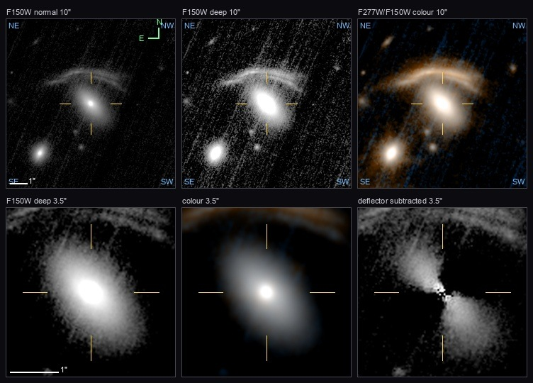{ width="100%" }](img/rank-012-orig.jpg){ target=_blank }
  <figcaption>What the judge saw (blind, footer removed)</figcaption>
</figure>

<figure markdown="span">
  [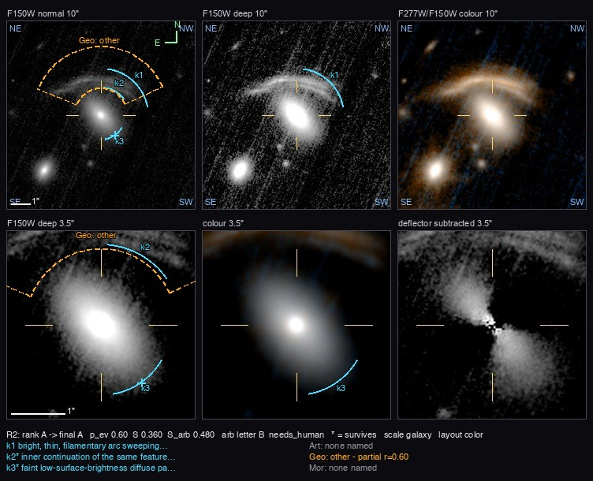{ width="100%" }](img/rank-012-annot.jpg){ target=_blank }
  <figcaption>Advocate evidence (cyan) and critic alternatives coloured by the arbitrator ruling</figcaption>
</figure>

???+ note "Why this grade — advocate, critics, arbitrator"
    **Letter A** (deployed, rule R2) · p_evidence 0.60 · S_arb 0.48 · S 0.36 · scale galaxy

    Letter: letter_rank stands (D rule not met); p_evidence 0.60 >= t_A 0.20 (calibrated at 1% FPR on clean negatives); 2 of 3 configuration criteria >= 6 (curvature, arc_morphology); no critic with r x a >= 0.80.

    **Advocate**

    - criteria: source_contrast 6, low_surface_brightness 8, curvature 6, counter_image 3, arc_morphology 6
    - items (3):
        - k1 — “bright, thin, filamentary arc sweeping over the north/north-west side of the ticked galaxy, clearly detached from the galaxy isophotes in (a) and (b) and orange/tan in the two-band colour panel (c) against the bluish sky; brightest near PA~340 at r~2.4" and traceable west/south-westward where it broadens and reaches r~3.5-4"” (panel b, r 2.5 arcsec, PA 280->352, visible in direct: yes; criteria: source_contrast, low_surface_brightness, curvature, arc_morphology)
        - k2 — “inner continuation of the same feature entering the 3.5" zoom: a diffuse tangential band across the top of (d) at r~1.4-1.7", orange in (e), and appearing in the subtracted panel (f) as an offset bright band along the upper edge that is NOT mirrored on the opposite side (i.e. not one of the butterfly lobes)” (panel d, r 1.5 arcsec, PA 305->355, visible in direct: yes; criteria: low_surface_brightness, curvature, arc_morphology)
        - k3 — “faint low-surface-brightness diffuse patch/fan on the opposite (south-south-west) side of the nucleus, orange in (e) and slightly beyond the smooth halo isophotes in (d); candidate counter-image, low confidence because it sits where the halo and the model residual lobes overlap” (panel e, r 1.3 arcsec, PA 190->240, visible in direct: yes; criteria: low_surface_brightness, counter_image)
    - scale galaxy; red neighbours within 10 arcsec 2; BCG-like halo yes; deflector is centre yes; arc radius 2.5 arcsec; arc PA span 280->352; counter-image at r 1.3 arcsec PA 215; centre-of-curvature offset 1.5 arcsec
    - p_evidence: 0.60
    - notes: “A three-point circle fit to the northern filament in (a) puts its centre of curvature roughly 1-2" south of the ticked nucleus (concave toward the galaxy), but the western end climbs from r~2.4" to r~4" and a bright compact companion sits ~4" to the SE, so a tidal tail/shell from that interaction remains open for the critics to test; the inner 1" of the direct zoom panels is saturated, so panel (f) is uninformative there.”

    **Critics**

    **artifact — no alternative named (nothing in its competence fits)**

    - leaves standing: k1, k2, k3
    - scale_class: galaxy
    - measured: `{"1_over_f_striping": "straight, near-vertical streaks (PA ~ 170-350 lines) crossing the entire 10\" field in (a) and (b) at constant amplitude; they cut through the arc without following it, so they cannot generate a curved feature", "arc_geometry": "continuous, curved band traceable from PA~285 to PA~352 at r = 2.3-2.7\" in (a) and (b), curvature concave toward the ticked galaxy - no straight segment, no fixed-angle ray, hence not a diffraction spike, seam or bleed", "brightest_neighbour": "compact galaxy ~3.5\" SE of the ticks (lower-left of panel a) is unsaturated, shows no spikes and no halo reaching PA 280-352 north of the deflector, so no psf_wing contribution", "direct_traceability_of_f_band": "the offset band along the top of (f) at r~1.4-1.7\", PA 305-355, is also present in the un-subtracted (d) and (e) and in (a)/(b) - it is not a product of the circular-profile subtraction", "item3_check": "the SSW excess at r~1.3\", PA 190-240 coincides with the southern lobe of the (f) bowtie, but it is also seen as diffuse light in the direct panels (d)/(e), so it does not qualify as a subtraction residual under the stated rule"}`
    - notes: “The only instrumental signature in this field is 1/f amplifier striping - straight near-vertical streaks across all of (a) and (b) - which is orthogonal in character to the smooth curved band at r~2.5", PA 285-350; that band appears identically in the normal, deep and colour renderings and in the 3.5" zoom, so it is sky, not reduction. No snowball, spike, seam, persistence or PSF wing lies at the item positions, and every item is visible in un-subtracted panels, so subtraction_residual is inadmissible for all three.”
    - ruling: no ruling for this critic

    **geometry — other:** “The bright filament north of the galaxy is not tangential about the ticked galaxy: a three-point circle fit to it (east end ~PA 63 r~3.2", apex ~PA 17 r~2.0", west end ~PA 303 r~2.3" in panel (b)) gives a curvature radius of ~4.7" with its centre ~2.8" SSE of the deflector, i.e. in empty sky between the ticked galaxy and the bright SE neighbour. It is a large-radius, shallowly curved low-surface-brightness streamer crossing north of the galaxy (bridge/plume-like geometry), whose distance from the deflector grows by ~60% along its length, not an arc at fixed Einstein radius.”

    - location: r 1.4-3.6 arcsec, PA 295->68
    - accounts for: k1, k2; leaves standing: k3; strength r 0.60; coverage a 0.667 (geometric), arbitrated a' 0.333
    - scale_class: galaxy
    - measured: `{"arc_curvature_radius_arcsec": 4.7, "azimuthal_extent_deg": 120, "counter_image": "none distinct; item-3 patch at r~1.3\", PA 190-240 lies on the smooth halo major-axis region in (d)/(e) and is not separable from the host isophotes, and its radius is half the arc radius", "curvature_centre_offset_from_deflector_arcsec": 2.8, "curvature_centre_pa_deg": 166, "profile_match": "arc is thin/filamentary and knotty; the SSW patch is diffuse halo-like - not obviously the same source", "radius_from_deflector_along_arc_arcsec": "3.2 at PA 63; 2.0 at PA 17; 2.3 at PA 303 (varies ~60%)", "tangential_elongation": "elongated and concave toward the galaxy, but concave about a point 2.8\" SSE, not about the tick centre"}`
    - notes: “In panel (b) the filament runs from (E 2.9", N 1.5") through the apex (E 0.6", N 2.0") to (W 1.9", N 1.2"): fitting these gives a circle of radius ~4.7" centred ~2.8" SSE of the tick centre, so the deflector is well off the centre of curvature and the arc's distance from it grows from 2.0" to 3.2". Panel (d)/(e) show only the inner edge of that same streamer along the top (r~1.5", PA 320-350); the SSW patch of item 3 is at r~1.3", too small a radius and too halo-like to serve as its counter-image.”
    - ruling: partial, covers k1 — “The filament's distance from the tick centre really does grow from ~2.0" at the apex (PA~350) to ~3.3-3.5" at both the E and W ends in (a)/(b), so it is not a constant-radius ring; but the growth is nearly SYMMETRIC about the N-S axis through the deflector (both ends long, apex short), which puts the centre of curvature ~1-1.5" due S of the ticks rather than 2.8" SSE in empty sky, so the 'streamer crossing north of the galaxy' geometry is only partly supported and it does not explain the separate inner band at r~1.5", PA 305-355 in (d)/(e).”

    **morphology — no alternative named (nothing in its competence fits)**

    - leaves standing: k1, k2, k3
    - scale_class: galaxy
    - measured: `{"arc_angular_span": "~150 deg of tangential arc, concave toward the ticked galaxy", "arc_radius_vs_angle_panel_c": "r~3.3-3.5\" at PA~60-80 (NE end), r~2.4\" at PA~340 (brightest), r~3.0-3.3\" at PA~285-300 (W end) - approximately constant / symmetric about the tick centre, NOT monotonically growing with angle", "arc_width_vs_radius": "arc thickness ~0.3-0.4\" versus radius ~2.5-3.5\", i.e. width/radius ~0.12 - far thinner than a host-profiled shell or arm", "bridge_test": "dark gap between the outer host isophotes (r<~1.2\" in d) and the arc's inner edge (r~1.4-1.7\" haze at top of d); no continuous stellar bridge from nucleus to arc in (d) or (e)", "host_morphology_panel_d": "smooth, featureless elliptical/lenticular isophotes out to r~1.2\"; no bar, no spiral arms, no knot chains, no double nucleus, no interleaved shells inside the 3.5\" zoom"}`
    - notes: “In (d) the ticked galaxy is a clean smooth ellipsoid - no arms, bar, knots, tails or interleaved shells - so nothing in the host's own structure can generate the feature; the arc in (c) sweeps ~150 deg from PA~70 through PA~340 (r~2.4") to PA~290 at essentially fixed radius with a thin, filamentary width (~0.35") and no stellar bridge across the dark gap at r~1.2-1.6" on the north side. Radius does not grow monotonically with angle (spiral arm excluded), the feature is not centred-and-closed on the host nucleus with host profile (collisional ring excluded), and it is far thinner than the host-profiled, sharp-edged umbrella a shell would show (shell_tidal disfavoured), so I name no morphological alternative.”
    - ruling: no ruling for this critic

    **Arbitrator**

    - surviving items: k2, k3 (2 of 3)
    - letter_llm: B; scale_class_final: galaxy; needs_human: yes
    - rationale: “The evidence is the thin orange filament that sweeps over the north side of the ticked elliptical in (a), (b) and (c): it is ~0.3-0.4" thick against a 2.0-3.5" standoff (width/radius ~0.12), concave toward the galaxy through ~150 deg of azimuth, separated from the host's outermost isophotes by a dark gap at r~1.2-1.6" in (d) with no stellar bridge, and distinctly orange in (c)/(e) where the host core is white-yellow and the SE companion is bluish. The artifact critic correctly shows the only instrumental signature is the near-vertical 1/f striping that cuts straight across the curved band without following it, and the morphology critic correctly finds a clean, featureless ellipsoid in (d) with no arms, bar, knots, double nucleus or host-profiled shell that could produce it; the bright band along the top of (f) is traceable in the un-subtracted (d)/(e), so it is not one of the circular-model bowtie lobes (those are the two large symmetric N/S wedges plus the central dipole speckle). What holds the grade below A is the geometry critic's real measurement: the filament's radius from the deflector varies by ~60-70% along its length and its curvature radius (~4-5") exceeds its standoff, so it is not a clean fixed-radius Einstein arc, and the only counter-image candidate (item 3, the SSW diffuse fan at r~1.3", PA 190-240) sits at half the arc radius, is halo-like rather than filamentary, and overlaps the southern model lobe - it cannot be used as confirmation. A tidal streamer/plume associated with the compact SE neighbour ~3.5" away therefore remains open, but it is not favoured by the arc's thinness, its colour offset from the host, or the absent bridge. Deeper multi-band imaging or a reviewer's eye on the arc's surface-brightness profile and on the SSW patch would settle whether this is a wide-separation group-assisted arc or a stream.”

    **Score**

    - S = p_ev x prod(1 - r_i a_i) = 0.60 x (1 - 0.60x0.667) = 0.36
        - terms: geometry other r 0.60 a 0.667
    - S_arb = p_ev x prod_{upheld/partial}(1 - r_i a_i') = 0.60 x (1 - 0.60x0.333) = 0.48
        - terms: geometry other r 0.60 a' 0.333 (partial)
    - stored grade_pred (on S): A — S 0.36 >= t_A 0.20 (calibrated at 1% FPR on clean negatives); 2 of 3 configuration criteria >= 6 (curvature, arc_morphology); no critic with r x a >= 0.80
    - stored letter_arb (on S_arb): A; letter_source: opus5_api_calibrated
    - deploy rule R2: letter_rank (advocate only, on p_evidence) = A — p_evidence 0.60 >= t_A 0.20 (calibrated at 1% FPR on clean negatives); 2 of 3 configuration criteria >= 6 (curvature, arc_morphology); no critic with r x a >= 0.80
    - deploy rule R2: letter_final = A — letter_rank stands (D rule not met); p_evidence 0.60 >= t_A 0.20 (calibrated at 1% FPR on clean negatives); 2 of 3 configuration criteria >= 6 (curvature, arc_morphology); no critic with r x a >= 0.80
    - veto: none (letter_final == letter_rank)

---

## Rank 13: J18805344+1121596 † {#rank-13}

*† Design anchor — this item shaped the scheme's mechanisms during design; it is not an
independent test.*

| Original grade | Passes | Inspector conf. | Pipeline θ_E |
|:--:|:--:|:--:|:--:|
| **C** | 1/3 | 50 | 0.72″ |

| New (final) | Rank letter | p_ev | S_arb | Demoted by | Arb. letter | Needs human |
|:--:|:--:|--:|--:|:--|:--:|:--:|
| **A** | A | 0.58 | 0.295 | — | C | yes ⚑ |

<small>pipeline discovery status `new` · scale class `galaxy`</small>

<figure markdown="span">
  [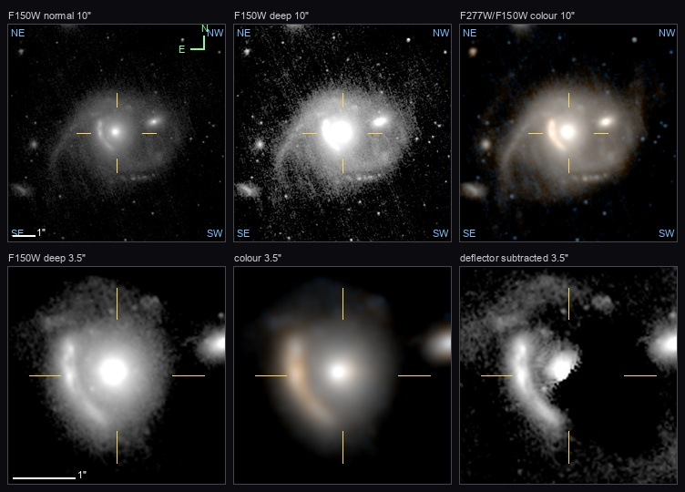{ width="100%" }](img/rank-013-orig.jpg){ target=_blank }
  <figcaption>What the judge saw (blind, footer removed)</figcaption>
</figure>

<figure markdown="span">
  [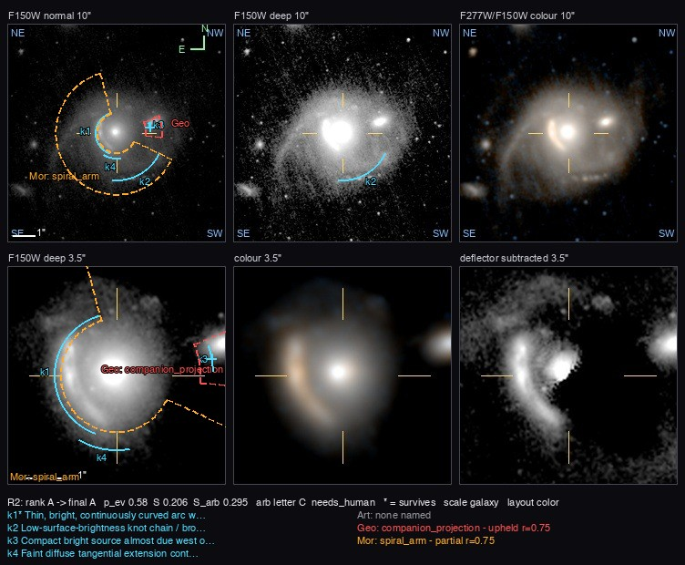{ width="100%" }](img/rank-013-annot.jpg){ target=_blank }
  <figcaption>Advocate evidence (cyan) and critic alternatives coloured by the arbitrator ruling</figcaption>
</figure>

???+ note "Why this grade — advocate, critics, arbitrator"
    **Letter A** (deployed, rule R2) · p_evidence 0.58 · S_arb 0.295 · S 0.206 · scale galaxy

    Letter: letter_rank stands (D rule not met); p_evidence 0.58 >= t_A 0.20 (calibrated at 1% FPR on clean negatives); 2 of 3 configuration criteria >= 6 (curvature, arc_morphology); no critic with r x a >= 0.80.

    **Advocate**

    - criteria: source_contrast 6, low_surface_brightness 7, curvature 7, counter_image 4, arc_morphology 6
    - items (4):
        - k1 — “Thin, bright, continuously curved arc wrapping the eastern flank of the ticked galaxy, clearly offset from the core and concave toward it; orange/tan in (e) against the white-yellow nucleus, and the dominant offset tangential residual in (f)” (panel d, r 1 arcsec, PA 15->160, visible in direct: yes; criteria: source_contrast, low_surface_brightness, curvature, arc_morphology)
        - k2 — “Low-surface-brightness knot chain / broken arc segment south to south-west of the deflector, visible as a string of small clumps in the 10" normal and deep panels beyond the zoom field” (panel b, r 2.2 arcsec, PA 175->245, visible in direct: yes; criteria: low_surface_brightness, curvature)
        - k3 — “Compact bright source almost due west of the deflector at a radius comparable to the arc, candidate counter-image on the opposite side of the nucleus (equally possible companion/star - flagged for the critics)” (panel a, r 1.55 arcsec, PA 272->288, visible in direct: yes; criteria: source_contrast, counter_image)
        - k4 — “Faint diffuse tangential extension continuing the arc round to the south-south-east, traceable at roughly the same radius in the deep zoom and as an offset residual at the bottom of (f)” (panel d, r 1.2 arcsec, PA 150->190, visible in direct: yes; criteria: low_surface_brightness, arc_morphology)
    - scale galaxy; red neighbours within 10 arcsec 2; BCG-like halo yes; deflector is centre yes; arc radius 1 arcsec; arc PA span 15->160; counter-image at r 1.55 arcsec PA 280; centre-of-curvature offset 0.3 arcsec
    - p_evidence: 0.58
    - notes: “The zoom panels (d)/(e) show a thin orange arc sweeping from NNE through E to SSE at r~1" whose centre of curvature falls within ~0.3" of the ticked nucleus and which survives as the one-sided offset feature in (f), but the 10" deep and colour panels also show a broad dusty envelope and a southern knot chain, so a spiral-arm/tidal origin must be tested by the critics.”

    **Critics**

    **artifact — no alternative named (nothing in its competence fits)**

    - leaves standing: k1, k2, k3, k4
    - scale_class: galaxy
    - measured: `{"arc_traceability_in_direct_panels": "item 1 (r~1.0\", PA 15->160) is plainly visible as a thin bright curved band in (d) and as an orange/tan band in (e), so it cannot be a subtraction residual; in (f) it sits offset from the core at roughly constant radius rather than as a lobe symmetric about it", "detector_geometry_check": "no mosaic seam, dither edge, low-coverage wedge or amplifier striping crosses the 10\" field near the ticked galaxy", "diffraction_spike_check_on_item3": "the compact west source at r~1.55\", PA 272-288 shows no straight radial rays in the deep 10\" panel (b) - none of the 6 NIRCam spike angles are populated, and the source looks slightly extended/fuzzy in (d)/(e), so it is not a star's spike core, PSF-wing bloom or saturation bleed", "item2_persistence_cosmic_ray_check": "the S/SW clump chain at r~2.2\", PA 175-245 appears in BOTH the normal (a) and deep (b) 10\" stretches and carries colour in (c), so it is not a cosmic-ray shower, snowball, 1/f stripe or persistence latent (those would not be band-consistent and would be straight/rectangular)", "subtraction_artefact_check": "(f) does show the expected circular-profile leftovers (bright inner blob at PA~270 and diffuse patchiness), but the eastern band in (f) is one-sided and matches the direct-panel band pixel-for-pixel"}`
    - notes: “Every located item survives an instrument/reduction check: the eastern band at r~1" is present in the un-subtracted zoom (d) and colour zoom (e), not just in (f), and it is one-sided rather than a butterfly lobe or concentric ring of the circular-profile model. The west source at PA~280 carries no 6-spike pattern in deep panel (b) and the S-SW clump chain at r~2.2" is band- and stretch-consistent, so neither is a spike, snowball, latent or 1/f feature; whether they are companions or clumps is outside my competence.”
    - ruling: no ruling for this critic

    **geometry — companion_projection:** “The 'counter-image' west of the nucleus is a separate, resolved small galaxy (compact nucleus + elongated envelope) whose major axis points back at the deflector, i.e. radially rather than tangentially elongated, and which sits at a radius ~1.6x that of the eastern arc with a quite different surface-brightness profile - a chance projection / physical companion, not a lensed counter-image.”

    - location: r 1.35-2.1 arcsec, PA 265->292
    - accounts for: k3; leaves standing: k1, k2, k4; strength r 0.75; coverage a 0.25 (geometric)
    - scale_class: galaxy
    - measured: `{"angle_major_axis_from_tangential_deg": 73, "arc_centre_of_curvature_offset_from_tick_centre_arcsec": 0.4, "arc_item1_radius_arcsec": 1.0, "item3_axis_ratio_estimate": 0.35, "item3_major_axis_pa_deg": 85, "item3_pa_deg": 282, "item3_radius_arcsec": 1.6, "profile_match_item3_vs_item1": "no - item3 has a compact nucleus and steep envelope, item1 is a low-contrast smooth band", "radius_ratio_item3_over_item1": 1.6}`
    - notes: “In panel (d) the west object sits at the right frame edge, ~1.6" west and ~0.35" north of the ticked core, and its light is stretched along the E-W line joining it to the nucleus (radial), whereas a counter-image at that radius should be stretched N-S; in panel (b) the same object at ~2" W is a distinct small elongated galaxy with its own core, unlike the smooth eastern band at 1.0".”
    - ruling: upheld, covers k3 — “The object ~1.6" west of the ticked core is a compact-nucleus, resolved little galaxy in (a), (b) and (d) whose light is stretched along the E-W line back to the nucleus (radial, not tangential) and whose steep profile does not match the smooth eastern band, so it cannot be the arc's counter-image.”

    **morphology — spiral_arm:** “The ticked galaxy is a large, mildly inclined disc: the 'arc' is its inner trailing spiral arm, which can be traced continuously outward with growing radius from the bright knot at PA~35, r~1.2" through the thin east arm at PA~90, r~0.95", round the south (PA~150-190, r~1.2-1.5") into the star-forming knot chain at PA~180-245, r~2.2-2.7" and on into the diffuse outer arm filaments that wrap the whole 10" envelope; a second, fainter arm sweeps the NW side, and the arm shares the host's smooth stellar envelope (no gap between arm and disc light).”

    - location: r 0.9-2.8 arcsec, PA 15->245
    - accounts for: k1, k2, k4; leaves standing: k3; strength r 0.75; coverage a 0.75 (geometric), arbitrated a' 0.50
    - scale_class: galaxy
    - measured: `{"arc_radius_at_pa150": "~1.2\"", "arc_radius_at_pa35": "~1.2\"", "arc_radius_at_pa90": "~0.95\"", "arc_width": "~0.2\" (unresolved-thin at the E segment, broadening to ~0.4\" toward the S)", "knot_chain_radius_pa180_245": "~2.2-2.7\"", "outer_arm_filaments_10in": "r~3-4\", PA~300-30 (NW/N side), same diffuse envelope", "radius_vs_angle_trend": "monotonically increasing clockwise from PA~90 to PA~245 (0.95\" -> 2.6\"), i.e. arm-like, not fixed-radius"}`
    - notes: “In (d) the east 'arc' does not stay at fixed radius: it runs 1.2" at PA~35, 0.95" at PA~90, then flares out to ~1.4" by PA~180 and merges into the low-surface-brightness band that becomes the string of ~5 bright clumps at r~2.2-2.7", PA~180-245 seen at the bottom of (c) - a continuous, radius-growing star-forming arm embedded in the host's own envelope, with a matching fainter arm on the NW side at r~3". Item 3 (the object ~1.6" west) is left standing but note it looks extended and elongated in (d), i.e. a neighbouring galaxy rather than a compact counter-image.”
    - ruling: partial, covers k2, k4 — “The ~5-clump 'smile' at r~2.2-2.7", PA 175-245 in (a)/(b)/(c) and the faint SSE flare at r~1.2-1.5" do sit at growing radius inside the host's own diffuse envelope and read as a star-forming outer arm/tidal band, but the critic's own numbers for the inner band (1.2" at PA 35, 0.95" at PA 90, 1.2" at PA 150) are non-monotonic, i.e. roughly fixed radius, so they do not dispose of item 1.”

    **Arbitrator**

    - surviving items: k1 (1 of 4)
    - letter_llm: C; scale_class_final: galaxy; needs_human: yes
    - rationale: “What survives is a single feature: the thin, bright, continuously curved band on the eastern flank of the ticked galaxy at r~1", running roughly PA 15 through 90 to 160, clearly visible in the un-subtracted deep zoom (d) and as an orange/tan band in colour zoom (e), and reappearing in (f) as a one-sided offset ridge at near-constant radius rather than as one of the butterfly lobes or concentric rings the circular-profile subtraction would produce - the artefact critic's checks (no 6-spike pattern, no seam or stripe, band present in every direct panel) leave it untouched. Against it: the putative counter-image at PA~280 is plainly a separate small galaxy with its own compact nucleus, elongated radially toward the deflector at 1.6x the arc radius, so the system has no confirmed counter-image; and the southern clump chain at r~2.2-2.7" plus the SSE flare are naturally read as a star-forming outer arm embedded in the same brown, dusty envelope that fills the 10" colour panel, with a matching faint filament on the NW side. The arc's width (~0.2" at the eastern segment, well under its radius) and its centre of curvature within ~0.3-0.4" of the nucleus keep a lens interpretation alive, but an inner dust-lane-bounded spiral arm of a mildly inclined disc reproduces the same pixels, and with the counter-image removed nothing breaks the tie. C, and a reviewer or resolved colour/spectroscopy of the eastern band would settle it.”

    **Score**

    - S = p_ev x prod(1 - r_i a_i) = 0.58 x (1 - 0.75x0.25) x (1 - 0.75x0.75) = 0.206
        - terms: geometry companion_projection r 0.75 a 0.25; morphology spiral_arm r 0.75 a 0.75
    - S_arb = p_ev x prod_{upheld/partial}(1 - r_i a_i') = 0.58 x (1 - 0.75x0.25) x (1 - 0.75x0.50) = 0.295
        - terms: geometry companion_projection r 0.75 a 0.25 (upheld); morphology spiral_arm r 0.75 a' 0.50 (partial)
    - stored grade_pred (on S): A — S 0.206 >= t_A 0.20 (calibrated at 1% FPR on clean negatives); 2 of 3 configuration criteria >= 6 (curvature, arc_morphology); no critic with r x a >= 0.80
    - stored letter_arb (on S_arb): A; letter_source: opus5_api_calibrated
    - deploy rule R2: letter_rank (advocate only, on p_evidence) = A — p_evidence 0.58 >= t_A 0.20 (calibrated at 1% FPR on clean negatives); 2 of 3 configuration criteria >= 6 (curvature, arc_morphology); no critic with r x a >= 0.80
    - deploy rule R2: letter_final = A — letter_rank stands (D rule not met); p_evidence 0.58 >= t_A 0.20 (calibrated at 1% FPR on clean negatives); 2 of 3 configuration criteria >= 6 (curvature, arc_morphology); no critic with r x a >= 0.80
    - veto: none (letter_final == letter_rank)

---

## Rank 14: J18030108+2309932 † {#rank-14}

*† Design anchor — this item shaped the scheme's mechanisms during design; it is not an
independent test.*

| Original grade | Passes | Inspector conf. | Pipeline θ_E |
|:--:|:--:|:--:|:--:|
| **C** | 1/3 | 45 | 4.60″ |

| New (final) | Rank letter | p_ev | S_arb | Demoted by | Arb. letter | Needs human |
|:--:|:--:|--:|--:|:--|:--:|:--:|
| **A** | A | 0.45 | 0.197 | — | C | yes ⚑ |

<small>pipeline discovery status `new` · scale class `group`</small>

<figure markdown="span">
  [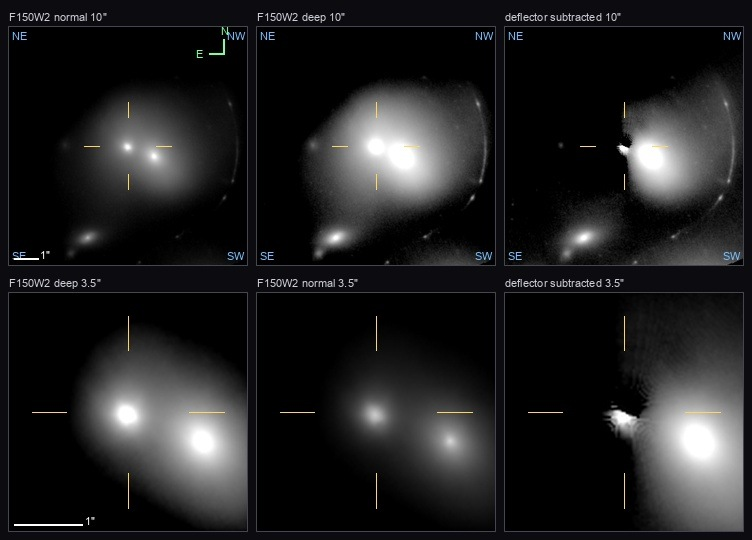{ width="100%" }](img/rank-014-orig.jpg){ target=_blank }
  <figcaption>What the judge saw (blind, footer removed)</figcaption>
</figure>

<figure markdown="span">
  [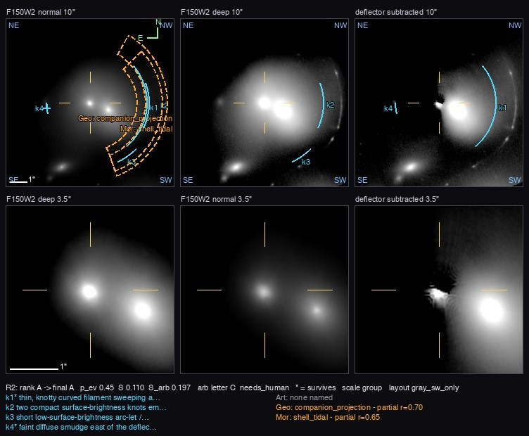{ width="100%" }](img/rank-014-annot.jpg){ target=_blank }
  <figcaption>Advocate evidence (cyan) and critic alternatives coloured by the arbitrator ruling</figcaption>
</figure>

???+ note "Why this grade — advocate, critics, arbitrator"
    **Letter A** (deployed, rule R2) · p_evidence 0.45 · S_arb 0.197 · S 0.11 · scale group

    Letter: letter_rank stands (D rule not met); p_evidence 0.45 >= t_A 0.20 (calibrated at 1% FPR on clean negatives); 2 of 3 configuration criteria >= 6 (curvature, arc_morphology); no critic with r x a >= 0.80.

    **Advocate**

    - criteria: source_contrast 5, low_surface_brightness 7, curvature 6, counter_image 3, arc_morphology 6
    - items (4):
        - k1 — “thin, knotty curved filament sweeping around the western side of the galaxy pair, concave toward the deflector, roughly at constant radius (~3.3-4.0"); clearest as an offset tangential ridge in the 10" subtracted panel but traceable as a distinct bright streak in the deep direct panel and faintly in the normal stretch” (panel c, r 3.4 arcsec, PA 220->310, visible in direct: yes; criteria: source_contrast, low_surface_brightness, curvature, arc_morphology)
        - k2 — “two compact surface-brightness knots embedded in that filament (near PA~250 and PA~285), giving it a knot-chain rather than a smooth-envelope profile - not point-source-like spikes and not radial” (panel b, r 3.5 arcsec, PA 245->290, visible in direct: yes; criteria: low_surface_brightness, arc_morphology)
        - k3 — “short low-surface-brightness arc-let / elongated patch in the SW outer field, roughly tangential and at a radius similar to item 1, possibly the southern continuation or a second image of the same source” (panel b, r 3.9 arcsec, PA 205->225, visible in direct: yes; criteria: low_surface_brightness, arc_morphology)
        - k4 — “faint diffuse smudge east of the deflector, roughly opposite the western filament at ~75% of its radius; candidate counter-image, but it sits inside the bright envelope in the direct panels and is only cleanly separable in the circular-subtracted 10" residual, where an artefact lobe cannot be excluded” (panel c, r 2.6 arcsec, PA 90->105, visible in direct: no; criteria: source_contrast, low_surface_brightness, counter_image)
    - scale group; red neighbours within 10 arcsec 3; BCG-like halo yes; deflector is centre yes; arc radius 3.4 arcsec; arc PA span 220->310; counter-image at r 2.6 arcsec PA 97; centre-of-curvature offset 1.2 arcsec
    - p_evidence: 0.45
    - notes: “The only real geometric evidence is the thin knotty filament ~3.4" west (PA 220-310) that is concave toward the ticked galaxy and holds roughly constant radius over ~85 deg in panels (b) and (c); its centre of curvature falls ~1" from the ticked nucleus, i.e. near the centroid of the close bright pair (companion at r~1.1", PA~247°), so the critics must weigh a merger-shell / tidal-arc origin for it, and the eastern patch (item 4) against a butterfly-lobe residual of the circular subtraction.”

    **Critics**

    **artifact — no alternative named (nothing in its competence fits)**

    - leaves standing: k1, k2, k3, k4
    - scale_class: group
    - measured: `{"arc_azimuthal_extent_deg": "~85 (PA ~225 to ~310), curvature concave toward the ticked galaxy - not radial", "arc_radius_range_arcsec": "3.6-4.3 measured off panel (b) at ~23 px/arcsec", "detector_alignment": "feature runs oblique and curved, not along image rows/columns and not at any fixed 6-spike angle -> not 1/f striping, seam, dither edge or spike", "item4_visibility": "no counterpart at r=2.6\", PA 90-105 in (a) or (b); it lies outside the 3.5\" zoom field so (d),(e),(f) cannot test it", "knot_sizes": "the two knots near PA 250 and PA 285 are resolved blobs, wider than the F150W2 PSF core, with no straight rays leaving them", "traceability_in_direct_panels": "items 1,2,3 present in un-subtracted (b) and faintly in (a); therefore not subtraction-only"}`
    - notes: “The western feature (items 1-3) is a curved, knotty ridge at r~3.6-4.3" that I can trace in the un-subtracted deep panel (b) and, weakly, in the normal panel (a), so it is not a residual of the circular model; it is curved and oblique, so it is neither one of the six straight NIRCam spikes, nor 1/f striping, nor a mosaic/dither edge, and the knots are resolved rather than snowball- or CR-like - no instrument or reduction alternative in my competence fits it. Item 4 (PA~97, r=2.6") exists only in the circular-subtracted panel (c), where the VIEW itself attributes lobe/dipole structure on this companion-blended, elliptical deflector to the 1-D azimuthal model; by the stated rule that pattern is evidence neither way, so I neither claim nor refute it.”
    - ruling: no ruling for this critic

    **geometry — companion_projection:** “The western 'filament' resolves in the deep 10" panel into a scatter of separate compact, round sources sitting near the outer isophote of the common envelope of the merging pair - at unequal radii (3.5", 4.4", 4.5", 4.45") and separated by large PA gaps, with an identical-looking compact companion at the same radius on the opposite (SE) side; i.e. unrelated/associated group members in projection, not one tangentially stretched arc.”

    - location: r 3.3-4.6 arcsec, PA 200->330
    - accounts for: k1, k2, k3; leaves standing: k4; strength r 0.70; coverage a 0.75 (geometric), arbitrated a' 0.50
    - scale_class: group
    - measured: `{"centre_of_curvature_offset": "ill-defined; a circle through the four knots is not centred within ~1.5\" of either nucleus", "control_knot_opposite_side": "r=4.3\", PA=158 (px 165,462), compact with own halo, same appearance as the 'arc' knots", "counter_image_in_direct_panels": "none separable at r~2.6-4.5\" east of the ticks in (b),(d),(e)", "deflector_centre_px_panel_b": "(243,272) tick centre; second nucleus (285,297), pair separation ~1.1\"", "knot_1": "r=3.5\", PA=323 (px 345,140), round FWHM-limited core", "knot_2": "r=4.5\", PA=270 (px 452,270)", "knot_3": "r=4.4\", PA=243 (px 430,370)", "knot_4": "r=4.45\", PA=211 (px 355,455) = item 3", "radius_scatter_along_span": "3.5-4.5\" (~25% of radius, comparable to the claimed 'arc' width)", "tangential_axis_ratio_of_knots": "~1.0 (no resolved tangential stretch at 0.031\"/px)"}`
    - notes: “In panel (b) the 'western filament' is four discrete round knots at (345,140), (452,270), (430,370), (355,455) - radii 3.5-4.5" spread over ~110 deg of PA with wide gaps, none showing tangential elongation at JWST sampling; a twin compact object of identical appearance sits at r=4.3", PA=158 on the east side, so the western group is just the crowded envelope of a merging pair, not one source imaged tangentially. Item 4 is invisible in my three direct panels (buried in the envelope east of the ticks), so I leave it standing.”
    - ruling: partial, covers k2, k3 — “The deep 10" panel does show discrete compact sources with their own haloes on the west/SW envelope edge and a near-twin compact object at r~4.3", PA~158 on the opposite side, which plausibly explains the two knots (item 2) and the isolated SW patch (item 3), but the thin continuous ridge traced from PA~230 to PA~310 at near-constant radius in (b) and (c) is more coherent than four unrelated round sources with wide PA gaps.”

    **morphology — shell_tidal:** “The ticked object is not a single relaxed galaxy but a close double-nucleus merger (two cores ~1.1-1.2" apart inside one boxy, lopsided common envelope, with further companions NE and SE in the 10" field). Thin, sharp-edged, host-profiled shells/tidal plumes flung along the merger axis to the W/SW naturally produce concave-inward arcs at nearly fixed radius with debris knots, exactly where items 1-3 sit.”

    - location: r 2.8-4.3 arcsec, PA 200->315
    - accounts for: k1, k2, k3; leaves standing: k4; strength r 0.65; coverage a 0.75 (geometric), arbitrated a' 0.50
    - scale_class: group
    - measured: `{"arc_pa_alignment": "245-290, i.e. straddling the merger axis defined by the secondary nucleus at PA~248", "arc_radius_range_arcsec": "3.3-4.0", "envelope_extent_arcsec": "~4 to SW vs ~2.5 to NE (asymmetric)", "envelope_major_axis_pa_deg": "~30-210 (NE-SW), boxy and lopsided toward SW", "nuclear_separation_arcsec": 1.15, "secondary_nucleus_pa_deg": 248}`
    - notes: “In panels (d) and (e) two distinct cores sit ~1.15" apart (primary at the tick centre, secondary at PA~248) inside a single distorted envelope that bulges SW - an ongoing merger, not a relaxed deflector; the faint thin streaks along the western/SW envelope edge in panel (a) (r~3.4-4.0", PA~205-310) lie on that same merger axis and follow the envelope contour, which is what shells/tidal plumes do. Item 4 (r~2.6", PA 90-105) is not separable from the envelope in any direct panel I was given, so I leave it standing.”
    - ruling: partial, covers k2, k3 — “The zoom panels (d)/(e) unambiguously show two cores ~1.15" apart (secondary at PA~248) inside one boxy, SW-lopsided envelope, so debris knots along that merger axis are well supported, but the single long, thin, sharp-edged western streak at fixed radius is not itself shown to be interleaved, host-profiled shell structure in the pixels.”

    **Arbitrator**

    - surviving items: k1, k4 (2 of 4)
    - letter_llm: C; scale_class_final: group; needs_human: yes
    - rationale: “The ticked object is not a relaxed deflector: panels (d) and (e) resolve two nuclei ~1.1" apart inside a single boxy envelope that bulges SW, and the 10" panels show further companions NE and SE, so any interpretation must contend with an ongoing merger in a group-scale envelope. Items 2 and 3 fall to that context - the brightenings on the western edge are resolved compact sources with their own haloes (a near-identical one sits at r~4.3", PA~158 on the east side), and the SW patch is one of them, so the knot-chain argument does not carry weight. What survives is item 1: in panels (a), (b) and (c) alike there is a thin, sharp, coherently curved filament along the western field edge running from roughly PA 225 to PA 310 at r~3.6-4.5", concave toward the pair, present in the un-subtracted deep stretch and therefore not a product of the circular 1-D subtraction. That is genuinely arc-like, but it is equally the classic appearance of a shell/plume flung along the merger axis defined by the secondary nucleus at PA~248, and it is thin, low-contrast and offers no confirmed counter-image: item 4 (r~2.6", PA~97) appears only in the deflector-subtracted 10" residual, exactly where the azimuthally-averaged model leaves lobes and a dipole on this off-centre, companion-blended galaxy, so it cannot be counted either way. With one real tangential feature, no counter-image in any direct panel, and a merger that supplies a competing origin, the evidence neither confirms nor refutes lensing; colour or deeper multi-band imaging (matching profiles between the western filament and any eastern counterpart) would settle it, which is why a human reviewer is warranted.”

    **Score**

    - S = p_ev x prod(1 - r_i a_i) = 0.45 x (1 - 0.70x0.75) x (1 - 0.65x0.75) = 0.11
        - terms: geometry companion_projection r 0.70 a 0.75; morphology shell_tidal r 0.65 a 0.75
    - S_arb = p_ev x prod_{upheld/partial}(1 - r_i a_i') = 0.45 x (1 - 0.70x0.50) x (1 - 0.65x0.50) = 0.197
        - terms: geometry companion_projection r 0.70 a' 0.50 (partial); morphology shell_tidal r 0.65 a' 0.50 (partial)
    - stored grade_pred (on S): C — S 0.11 < t_B 0.17 (calibrated at 5% FPR on clean negatives); not D: 4 item(s) located; no named critic covers every item at r >= 0.80
    - stored letter_arb (on S_arb): B; letter_source: opus5_api_calibrated
    - deploy rule R2: letter_rank (advocate only, on p_evidence) = A — p_evidence 0.45 >= t_A 0.20 (calibrated at 1% FPR on clean negatives); 2 of 3 configuration criteria >= 6 (curvature, arc_morphology); no critic with r x a >= 0.80
    - deploy rule R2: letter_final = A — letter_rank stands (D rule not met); p_evidence 0.45 >= t_A 0.20 (calibrated at 1% FPR on clean negatives); 2 of 3 configuration criteria >= 6 (curvature, arc_morphology); no critic with r x a >= 0.80
    - veto: none (letter_final == letter_rank)

---

## Rank 15: J20954380-1094330 † {#rank-15}

*† Design anchor — this item shaped the scheme's mechanisms during design; it is not an
independent test.*

| Original grade | Passes | Inspector conf. | Pipeline θ_E |
|:--:|:--:|:--:|:--:|
| **C** | 1/3 | 45 | 3.60″ |

| New (final) | Rank letter | p_ev | S_arb | Demoted by | Arb. letter | Needs human |
|:--:|:--:|--:|--:|:--|:--:|:--:|
| **A** | A | 0.45 | 0.315 | — | C | yes ⚑ |

<small>pipeline discovery status `new` · scale class `group`</small>

<figure markdown="span">
  [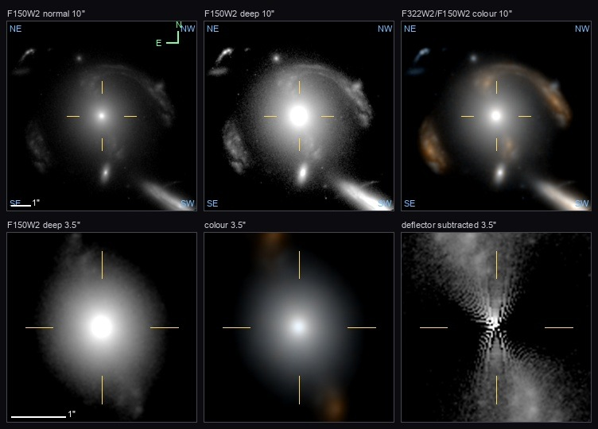{ width="100%" }](img/rank-015-orig.jpg){ target=_blank }
  <figcaption>What the judge saw (blind, footer removed)</figcaption>
</figure>

<figure markdown="span">
  [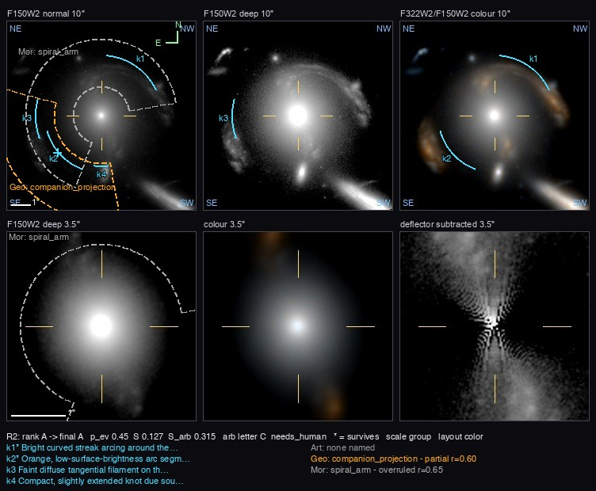{ width="100%" }](img/rank-015-annot.jpg){ target=_blank }
  <figcaption>Advocate evidence (cyan) and critic alternatives coloured by the arbitrator ruling</figcaption>
</figure>

???+ note "Why this grade — advocate, critics, arbitrator"
    **Letter A** (deployed, rule R2) · p_evidence 0.45 · S_arb 0.315 · S 0.127 · scale group

    Letter: letter_rank stands (D rule not met); p_evidence 0.45 >= t_A 0.20 (calibrated at 1% FPR on clean negatives); 2 of 3 configuration criteria >= 6 (curvature, counter_image); no critic with r x a >= 0.80.

    **Advocate**

    - criteria: source_contrast 7, low_surface_brightness 8, curvature 6, counter_image 6, arc_morphology 5
    - items (4):
        - k1 — “Bright curved streak arcing around the NW/N side of the ticked galaxy, distinctly orange in the two-band colour panel while the deflector core is white/yellow; traceable in (a), (b) and (c) at roughly constant radius, concave toward the deflector” (panel c, r 3.2 arcsec, PA 295->355, visible in direct: yes; criteria: source_contrast, low_surface_brightness, curvature, arc_morphology)
        - k2 — “Orange, low-surface-brightness arc segment on the SE/E side at similar radius and similar hue to item 1, roughly opposite it across the nucleus - candidate counter-arc” (panel c, r 3 arcsec, PA 105->160, visible in direct: yes; criteria: source_contrast, low_surface_brightness, counter_image, arc_morphology)
        - k3 — “Faint diffuse tangential filament on the E flank in the deep 10" stretch, running nearly perpendicular to the radius vector and joining the SE segment” (panel b, r 3.5 arcsec, PA 75->110, visible in direct: yes; criteria: low_surface_brightness, curvature, arc_morphology)
        - k4 — “Compact, slightly extended knot due south of the nucleus, clearly separated from the envelope, of similar radius to the arc system” (panel a, r 2.7 arcsec, PA 172->188, visible in direct: yes; criteria: low_surface_brightness, counter_image)
    - scale group; red neighbours within 10 arcsec 1; BCG-like halo yes; deflector is centre yes; arc radius 3.2 arcsec; arc PA span 295->355; counter-image at r 3 arcsec PA 130; centre-of-curvature offset 0.9 arcsec
    - p_evidence: 0.45
    - notes: “Two orange, tangentially elongated features straddle the white deflector at r~3.0-3.2" (NW at PA~295-355 and SE at PA~105-160) with centres of curvature within ~1" of the ticked core, but the deep panel also shows broad diffuse plumes and a bright interloper streak in the SW, so a shell/tidal-merger origin must be tested by the critics; panel (f) shows only the circular-model butterfly/dipole and is uninformative at these radii.”

    **Critics**

    **artifact — no alternative named (nothing in its competence fits)**

    - leaves standing: k1, k2, k3, k4
    - scale_class: group
    - measured: `{"items_visible_in_direct_panels": "4 of 4 (a,b,c) - subtraction_residual inadmissible for all", "panel_f_pattern": "vertical hourglass/bowtie lobes at PA ~0 and ~180 plus concentric ripples, centred on the core, i.e. the stated circular-profile artefact; no offset tangential feature is added by it", "psf_wing_check": "brightest neighbour is the elongated SW source ~4-5\" at PA ~215; its light falls off along its own major axis and does not reach the N/NW arc (PA 295-355) or the E filament (PA 75-110)", "spike_check": "no straight radial rays at fixed angles from the core or from the SW bright object; item 1 curves through ~60 deg of PA at r~3.2\" and item 2 through ~55 deg at r~3.0\", incompatible with 6-spike geometry", "striping_seams_snowballs": "none seen; background is smooth, no row/column banding, no rectangular low-coverage edges, no saturation bleed trail"}`
    - notes: “All four items are present in the un-subtracted panels (a) and (b) and in colour (c) - the NW arc at r~3.2", PA 295-355 and the SE/E segments at r~3.0-3.5" are traceable without the model removal, so the panel (f) hourglass+ring pattern (the documented circular-profile artefact, aligned N-S about the core) explains none of them. I find no diffraction spike, snowball, stripe, seam or PSF wing at those radii and position angles; whatever the features are, they are on the sky and their interpretation is morphology, outside my competence.”
    - ruling: no ruling for this critic

    **geometry — companion_projection:** “The E/SE clumpy chain and the compact southern knot are separate neighbours/debris of the group, not images of one background source: in the deep 10" panel the SE feature is elongated RADIALLY (r ~2.7" out to ~5" at PA 110-145) rather than tangentially at fixed radius, and the southern object at r~2.7" is a compact, peaked source with its own nucleus and a tail pointing at the bright SW galaxy, with a surface-brightness profile unlike the thin smooth N streak.”

    - location: r 2.5-5.5 arcsec, PA 75->190
    - accounts for: k2, k3, k4; leaves standing: k1; strength r 0.60; coverage a 0.75 (geometric), arbitrated a' 0.50
    - scale_class: group
    - measured: `{"SE_structure_radial_extent_arcsec": "2.7 -> ~5.2 at PA 110-145, i.e. radially elongated by >2\" - not confined to a fixed radius", "S_knot_geometry": "r=2.7\", PA~180, compact core, axis ratio ~1.2 with the long axis pointing SSW (radial), no tangential elongation", "counter_image_test": "item 2 sits at the correct opposite PA (~145 vs 325) but at the wrong morphology: it is the inner end of the radially extended SE chain", "item1_curvature_centre_offset_arcsec": "<=0.6\" from the tick centre (consistent with the deflector)", "item1_radius_range_arcsec": "3.0-3.3 over PA 300-355, roughly constant; concave toward the ticked nucleus", "profile_consistency": "N streak is smooth and low-SB; SE chain and S knot are clumpy/peaked - not consistent as images of one source"}`
    - notes: “In panel (b) the lower-left (SE) feature is a clumpy chain running outward from r~2.8" (PA~132) to the frame edge at ~5", i.e. radially aligned, and the bright object at r~2.7", PA~180 has a compact nucleus plus a tail toward the bright SW galaxy - both are neighbours in a crowded group envelope rather than tangential images. Only the thin N/NW streak at r~3.0-3.3", PA 300-355 keeps a constant radius and curvature centred on the ticked galaxy, so item 1 stands.”
    - ruling: partial, covers k3, k4 — “The compact source at PA~180, r~2.7" in (a)/(b) does have its own peaked nucleus and a linear tail running toward the bright elongated SW object, and the faint E filament in (b) blends into the outward-running clumpy debris, so those two are plausibly neighbours/debris; but the SE orange segment (item 2) in (c) curves concentrically under the core at the same r~3.0" and the same orange hue as the NW feature rather than running purely radially, so companion_projection does not cover it.”

    **morphology — spiral_arm:** “A two-armed, dust-reddened spiral/disc pattern belonging to the ticked galaxy itself: both 'arcs' are segments of the same 180-degree-symmetric pattern whose radius grows monotonically with decreasing PA and whose inner continuation is still traceable as orange emission entering the 3.5" zoom, i.e. connected to the host envelope rather than sitting at fixed radius.”

    - location: r 1.5-4 arcsec, PA 280->160
    - accounts for: k1, k2, k3; leaves standing: k4; strength r 0.65; coverage a 0.75 (geometric), excluded from S_arb (overruled)
    - scale_class: galaxy
    - measured: `{"E_arm_radius_vs_PA": "r~3.6\" at PA~101 falling to r~3.3\" at PA~128, continuing to the SE patch near PA~150", "NW_arm_radius_vs_PA": "r~2.1\" at PA~322 rising to r~3.9\" at PA~281 in panel (c)", "arc_thickness": "~0.4-0.6\" against r~3.2\", patchy/knotty rather than smooth", "inner_continuation_in_zoom_e": "orange emission entering the 3.5\" colour zoom at PA~21 deg, r~1.6\" and at PA~211 deg, r~1.6\" - the same pattern one half-turn further in on each arm", "rotational_symmetry": "arm pairs offset by ~180 deg at matched radii (101/281, 128/308)"}`
    - notes: “In panel (c) the NW streak is not at constant radius: it runs from ~2.1" at PA 322 out to ~3.9" at PA 281, and its E counterpart mirrors that trend (3.6" at PA 101 to 3.3" at PA 128), with knotty texture along both; panel (e) shows the same orange emission entering the 3.5" field at PA ~21 deg and PA ~211 deg, r~1.6", i.e. continuous with the host envelope inward, which is an arm trend, not a tangential arc pair. The compact source at PA ~180, r 2.7" (item 4), which carries its own linear extension toward the SW corner, is not explained by the arm pattern and is left standing.”
    - ruling: overruled — “The 3.5" deep zoom (d) and colour zoom (e) show a completely smooth, structureless elliptical envelope with no inner arm, no knot chain and no stellar bridge out to r~1.75", and panel (f) shows only the N-S bowtie expected from removing a circular profile from an ellipsoid - a two-armed spiral reaching r~4" would have to display its inner arms in that zoom, and it does not.”

    **Arbitrator**

    - surviving items: k1, k2 (2 of 4)
    - letter_llm: C; scale_class_final: group; needs_human: yes
    - rationale: “What survives is the orange, tangentially elongated pair in panel (c): a curved streak running over the N/NW flank at r~3.0-3.3" (PA~295-355), concave toward the ticked core, and a second orange segment of the same hue and comparable surface brightness on the SE/S side at r~3.0" (PA~105-160), roughly opposite across the white deflector whose core is distinctly bluer in the two-band colour. Both are present in the un-subtracted panels (a), (b) and (c), so the artifact critic is right that the panel-(f) hourglass and concentric ripples - the documented circular-profile artefact on an elliptical host - explain nothing here, and no spike, stripe or PSF wing from the bright SW streak reaches PA 295-355. The spiral-arm reading fails on the pixels: the 3.5" zoom (d,e) is a featureless smooth spheroid with no inner arm continuation, and the residual bowtie is the signature of an ellipsoid, not a disc. What keeps this from being a B is the environment visible in the deep 10" stretch: broad diffuse plumes wrap the whole envelope, a blue interloper sits at the NE corner, a bright elongated object cuts the SW corner, and the compact knot at PA~180, r~2.7" carries its own tail toward that object - a tidal/shell or projected-debris origin for the same orange loops cannot be excluded at this depth, and the SE segment is patchy where a counter-arc should be smooth and matched in profile. Deeper or multi-band imaging (or a proper elliptical-model subtraction to test whether the two orange segments share a source colour and lie on a common curvature centre) would settle it.”

    **Score**

    - S = p_ev x prod(1 - r_i a_i) = 0.45 x (1 - 0.60x0.75) x (1 - 0.65x0.75) = 0.127
        - terms: geometry companion_projection r 0.60 a 0.75; morphology spiral_arm r 0.65 a 0.75
    - S_arb = p_ev x prod_{upheld/partial}(1 - r_i a_i') = 0.45 x (1 - 0.60x0.50) = 0.315
        - terms: geometry companion_projection r 0.60 a' 0.50 (partial)
    - stored grade_pred (on S): C — S 0.127 < t_B 0.17 (calibrated at 5% FPR on clean negatives); not D: 4 item(s) located; no named critic covers every item at r >= 0.80
    - stored letter_arb (on S_arb): A; letter_source: opus5_api_calibrated
    - deploy rule R2: letter_rank (advocate only, on p_evidence) = A — p_evidence 0.45 >= t_A 0.20 (calibrated at 1% FPR on clean negatives); 2 of 3 configuration criteria >= 6 (curvature, counter_image); no critic with r x a >= 0.80
    - deploy rule R2: letter_final = A — letter_rank stands (D rule not met); p_evidence 0.45 >= t_A 0.20 (calibrated at 1% FPR on clean negatives); 2 of 3 configuration criteria >= 6 (curvature, counter_image); no critic with r x a >= 0.80
    - veto: none (letter_final == letter_rank)

---

## Rank 16: J5186648-1343587 † {#rank-16}

*† Design anchor — this item shaped the scheme's mechanisms during design; it is not an
independent test.*

| Original grade | Passes | Inspector conf. | Pipeline θ_E |
|:--:|:--:|:--:|:--:|
| **C** | 1/3 | 42 | 17.60″ |

| New (final) | Rank letter | p_ev | S_arb | Demoted by | Arb. letter | Needs human |
|:--:|:--:|--:|--:|:--|:--:|:--:|
| **D** | B | 0.20 | 0.002 | edge_on_disk (Geo, Mor) | D | no |

<small>pipeline discovery status `known` · scale class `none`</small>

<figure markdown="span">
  [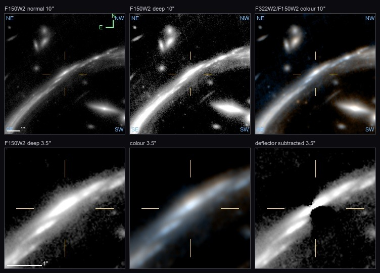{ width="100%" }](img/rank-016-orig.jpg){ target=_blank }
  <figcaption>What the judge saw (blind, footer removed)</figcaption>
</figure>

<figure markdown="span">
  [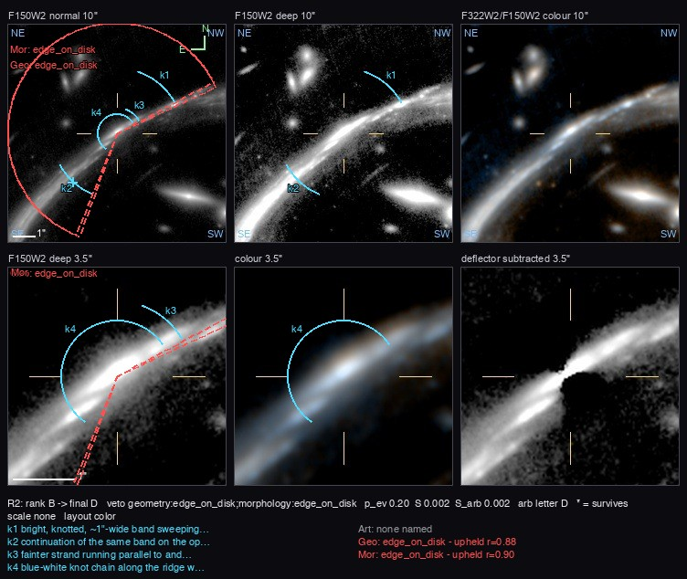{ width="100%" }](img/rank-016-annot.jpg){ target=_blank }
  <figcaption>Advocate evidence (cyan) and critic alternatives coloured by the arbitrator ruling</figcaption>
</figure>

???+ note "Why this grade — advocate, critics, arbitrator"
    **Letter D** (deployed, rule R2) · p_evidence 0.20 · S_arb 0.002 · S 0.002 · scale none

    Letter: D rule: geometry (edge_on_disk) covers every item (a = 1) at r 0.88 >= 0.80 (upheld); morphology (edge_on_disk) covers every item (a = 1) at r 0.90 >= 0.80 (upheld).

    **Advocate**

    - criteria: source_contrast 4, low_surface_brightness 6, curvature 3, counter_image 2, arc_morphology 4
    - items (4):
        - k1 — “bright, knotted, ~1"-wide band sweeping NW from the tick centre, gently curved (slope steepens toward the NW end), clearly resolved into surface-brightness knots in (b)/(d)” (panel b, r 3 arcsec, PA 298->342, visible in direct: yes; criteria: low_surface_brightness, arc_morphology)
        - k2 — “continuation of the same band on the opposite (SE) side of the ticked nucleus, same width, same knotty profile - formally a pair straddling the nucleus, but the ridge is continuous across the core in (d) and in the residual (f)” (panel b, r 3 arcsec, PA 118->158, visible in direct: yes; criteria: low_surface_brightness, counter_image)
        - k3 — “fainter strand running parallel to and ~0.6-0.8" NE of the main ridge, concentric with it over ~4", separated by a dark lane; could be a second concentric image or a dust lane in an inclined disc” (panel d, r 1.2 arcsec, PA 300->340, visible in direct: yes; criteria: low_surface_brightness, arc_morphology)
        - k4 — “blue-white knot chain along the ridge within ~1.5" of the tick centre, contrasting with the orange/brown diffuse light hugging the SW edge of the band in (c)/(e)” (panel e, r 0.9 arcsec, PA 305->145, visible in direct: yes; criteria: source_contrast, low_surface_brightness)
    - scale cluster; red neighbours within 10 arcsec 3; BCG-like halo no; deflector is centre no; arc radius 37 arcsec; arc PA span 118->342; counter-image at r 3 arcsec PA 138; centre-of-curvature offset 37 arcsec
    - p_evidence: 0.20
    - notes: “A 12"-long, ~1"-wide knotted band crosses the whole 10" field and passes straight through the ticked nucleus (an unbroken ridge on both sides of the over-subtracted core in (f)); a three-point circle fit to it in (b) puts the centre of curvature ~37" to the NE, i.e. 37" off the deflector, and the blue ridge with an orange strip along its SW edge in (c)/(e) reads like a dust-laned inclined disc or the outer arm of a large off-field galaxy rather than an arc about the ticked galaxy - the critics should test whether the parallel NE strand (k3) is a second concentric image or that dust lane.”

    **Critics**

    **artifact — no alternative named (nothing in its competence fits)**

    - leaves standing: k1, k2, k3, k4
    - measured: `{"band_continuity": "single ~1\"-wide ridge traceable without break from the SE corner (r~5\", PA~135) through the tick centre to the NW corner (r~5\", PA~320) in panels (a), (b) and (c) - a >10\" continuous structure, not a fixed-radius annulus and not a straight ray", "detector_pattern_check": "no mosaic seam, dither edge, low-coverage wedge or amplifier striping runs along PA 298-342 / 118-158; background noise texture is uniform across the ridge", "spike_test": "no 6-fold straight-ray geometry: the ridge curvature changes smoothly along its length and there is no bright saturated star or bleed trail anywhere in the 10\" field to launch spikes; the two bright objects (NE spiral at r~4\", PA~40; SW disc at r~4\", PA~215) show no spikes either", "subtracted_panel_check": "every item is visible in direct panels (b)/(d)/(e); the only feature unique to (f) is the black circular hole at the tick centre, which is the azimuthally-averaged profile subtraction itself and was not scored", "two_band_check": "feature present in both the SW and LW channels (blue-white knots plus an orange/brown rim along its SW edge in (c)/(e)), so it is sky signal, not a single-detector event (snowball, cosmic-ray shower, persistence) or 1/f stripe"}`
    - notes: “The knotted band crossing the tick centre from PA~135 to PA~320 appears identically in the un-subtracted panels (a), (b), (c), (d) and (e) with resolved knots and a colour gradient, so it is on-sky flux, not an instrumental or reduction feature; there is no saturated star, spike pattern, snowball, seam or stripe in the field to produce it. The dark disc at the tick centre in (f) is the circular-profile subtraction hole and I have not treated it as an item; whether the band is a disc, tail or arc is morphology, outside my competence.”
    - ruling: no ruling for this critic

    **geometry — edge_on_disk:** “One large, highly inclined disc galaxy whose major axis runs NW-SE straight through the ticked nucleus: a continuous knotty stellar ridge with a parallel dark dust lane on its NE side, not a tangential arc system about the tick”

    - location: r 0-5 arcsec, PA 298->158
    - accounts for: k1, k2, k3, k4; leaves standing: none; strength r 0.88; coverage a 1.00 (geometric)
    - scale_class: galaxy
    - measured: `{"counter_image_test": "failed - lobes 1 and 2 are the two halves of one continuous ridge, identical width (~1\") and identical knot profile, i.e. one object, not a mirrored pair", "curvature_centre_offset_arcsec": ">10 (curvature of the 10\" band in (b) is centred far to the S/SSW, off-field, not on the tick)", "pa_difference_deg": 182, "pa_lobe_NW_mean_deg": 320, "pa_lobe_SE_mean_deg": 138, "parallel_strand_offset_arcsec": "0.6-0.8 NE of ridge, separated by a dark absorption lane, running parallel (not concentric about the tick) over ~4\"", "straight_through_core": "yes - the two 'images' are antipodal to within ~2 deg and the ridge is continuous across the tick in (d), with no gap and no surface-brightness break at the nucleus", "tangential_elongation_at_fixed_radius": "none - the band's radius from the tick grows monotonically from 0 to >5\" along its length"}`
    - notes: “In (d) the bright ridge passes straight through the tick centre with no break: PA 320 on the NW side and PA 138 on the SE side are the same line, and the dark lane at 0.6-0.8" NE of it is a dust lane hugging an inclined disc, exactly as in the colour zoom (e) where the brown dust sits on the SW/inner edge and the blue knots lie along the major axis. The gentle curvature of the 10" band in (b) bulges to the N with its centre of curvature off-field to the S, nowhere near the ticked galaxy, so nothing here is tangential at fixed radius about the putative deflector.”
    - ruling: upheld, covers k1, k2, k3, k4 — “In the 3.5" deep zoom (d) the ~1"-wide knotty ridge runs unbroken through the ticked nucleus at PA 320/138 — the two 'lobes' are antipodal halves of one line, its distance from the tick grows monotonically from 0 to >5", and the 0.6-0.8" NE strand is separated from it by a dark absorption lane running parallel, not concentric.”

    **morphology — edge_on_disk:** “A single highly inclined (near edge-on) disc galaxy whose major axis runs SE-NW through the ticked nucleus: the 'band' is the disc's stellar ridge, continuous across the core, with a dark dust lane parallel to it on the NE side and star-forming knots strung along the ridge.”

    - location: r 0-5 arcsec, PA 295->160
    - accounts for: k1, k2, k3, k4; leaves standing: none; strength r 0.90; coverage a 1.00 (geometric)
    - scale_class: galaxy
    - measured: `{"band_width": "~0.8-1.0\" FWHM, constant along its length, comparable to its distance from the nucleus (an Einstein arc is thin compared with its radius)", "curvature_sense": "gentle convex-toward-NE bend of a warped disc plane, not tangential curvature centred on the tick position", "dust_lane": "dark lane ~0.6-0.8\" NE of and parallel to the ridge, traceable ~4\" in (d), with brown/orange diffuse light on the opposite (SW) flank in (e) - classic inclined-disc extinction, not a second image", "radius_vs_angle": "surface brightness peaks at r=0 (the tick centre) and falls monotonically along the major axis; the 'arc' radius grows continuously from 0 to >5\", not constant", "ridge_continuity_across_nucleus": "unbroken surface-brightness ridge in (d) from the SE edge of the 3.5\" crop through the bright core at the tick centre to the NW edge - a stellar bridge, not two detached arcs", "ridge_extent_in_panel_c": ">10\" corner-to-corner (SE label to NW label), i.e. the feature is not confined to a fixed radius from the tick centre"}`
    - notes: “In (d) the ridge passes straight through the bright nucleus at the tick centre - the NW segment (item 1) and SE segment (item 2) are the two halves of one disc, joined by a continuous stellar bridge, and in (c) the same band runs from the SE corner to the NW corner of the 10" field rather than closing at fixed radius. The 'second concentric strand' (item 3) is the far side of the disc separated by the dust lane, and the blue knot chain (item 4) lies ON the ridge with the reddened diffuse light on its SW flank, exactly as expected for HII regions plus extinction in an inclined disc.”
    - ruling: upheld, covers k1, k2, k3, k4 — “In (c) the same band crosses the whole 10" field corner-to-corner (SE label to NW label) at nearly constant ~0.8-1.0" width with blue knots strung along the ridge and brown/orange reddened light on its SW flank — an inclined/warped disc with a dust lane, whose surface brightness peaks at the tick rather than at a fixed offset radius.”

    **Arbitrator**

    - surviving items: none (0 of 4)
    - letter_llm: D; scale_class_final: none; needs_human: no
    - rationale: “Every scored item belongs to a single continuous structure: the bright, knotted, ~1"-wide band that enters the 10" field at the SE corner label, sweeps through the yellow ticks and exits at the NW corner in panels (a), (b) and (c). In the zoom (d) that ridge is an unbroken stellar bridge across the ticked nucleus — no gap, no surface-brightness break, identical width and identical knot texture on both sides — so items 1 and 2 are the two halves of one object, not a mirrored image pair; the residual panel (f) shows only the circular-profile subtraction hole at the tick with the ridge continuing straight through it, which is a property of the 1-D subtraction and carries no weight either way. The 'second concentric strand' (item 3) is separated from the main ridge by a dark absorption lane running parallel to it over ~4", and the blue knot chain (item 4) lies ON the ridge with the reddened diffuse light on the opposite (SW) flank — the classic signature of star-forming knots plus extinction in a highly inclined, gently warped disc, exactly what the geometry and morphology critics located at r=0-5", PA 295-160. Nothing in the field is tangential at fixed radius about the ticked galaxy: the band's radius from the tick grows from 0 to beyond the 10" frame and its centre of curvature lies far off-field, so no lensing configuration about the catalogued deflector is supported and no items survive.”

    **Score**

    - S = p_ev x prod(1 - r_i a_i) = 0.20 x (1 - 0.88x1.00) x (1 - 0.90x1.00) = 0.002
        - terms: geometry edge_on_disk r 0.88 a 1.00; morphology edge_on_disk r 0.90 a 1.00
    - S_arb = p_ev x prod_{upheld/partial}(1 - r_i a_i') = 0.20 x (1 - 0.88x1.00) x (1 - 0.90x1.00) = 0.002
        - terms: geometry edge_on_disk r 0.88 a 1.00 (upheld); morphology edge_on_disk r 0.90 a 1.00 (upheld)
    - stored grade_pred (on S): D — S 0.002 < t_B 0.17 (calibrated at 5% FPR on clean negatives) and geometry (edge_on_disk) covers every item at r 0.88 >= 0.80; morphology (edge_on_disk) covers every item at r 0.90 >= 0.80
    - stored letter_arb (on S_arb): D; letter_source: opus5_api_calibrated
    - deploy rule R2: letter_rank (advocate only, on p_evidence) = B — p_evidence 0.20 >= t_A 0.20 (calibrated at 1% FPR on clean negatives) but A is blocked: only 0 of 3 configuration criteria >= 6; p_evidence 0.20 >= t_B 0.17 (calibrated at 5% FPR on clean negatives)
    - deploy rule R2: letter_final = D — D rule: geometry (edge_on_disk) covers every item (a = 1) at r 0.88 >= 0.80 (upheld); morphology (edge_on_disk) covers every item (a = 1) at r 0.90 >= 0.80 (upheld)
    - veto: geometry:edge_on_disk;morphology:edge_on_disk

---

## Rank 17: J5186803-1343778 {#rank-17}

| Original grade | Passes | Inspector conf. | Pipeline θ_E |
|:--:|:--:|:--:|:--:|
| **C** | 1/3 | 40 | — |

| New (final) | Rank letter | p_ev | S_arb | Demoted by | Arb. letter | Needs human |
|:--:|:--:|--:|--:|:--|:--:|:--:|
| **D** | B | 0.24 | 0.019 | spiral_arm (Mor) | D | no |

<small>pipeline discovery status `known` · scale class `none`</small>

<figure markdown="span">
  [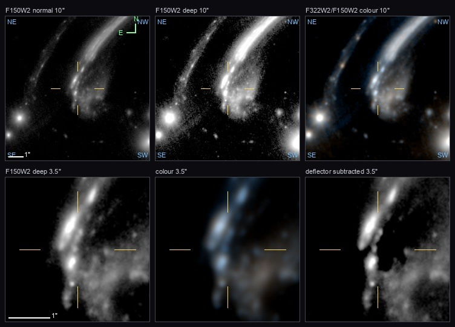{ width="100%" }](img/rank-017-orig.jpg){ target=_blank }
  <figcaption>What the judge saw (blind, footer removed)</figcaption>
</figure>

<figure markdown="span">
  [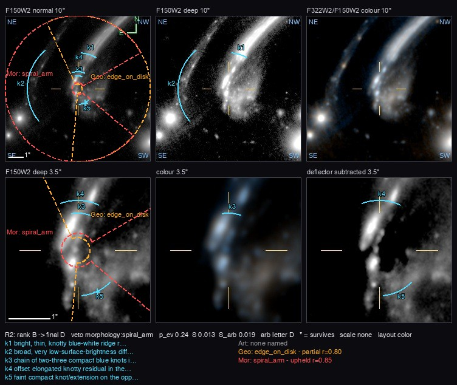{ width="100%" }](img/rank-017-annot.jpg){ target=_blank }
  <figcaption>Advocate evidence (cyan) and critic alternatives coloured by the arbitrator ruling</figcaption>
</figure>

???+ note "Why this grade — advocate, critics, arbitrator"
    **Letter D** (deployed, rule R2) · p_evidence 0.24 · S_arb 0.019 · S 0.013 · scale none

    Letter: D rule: morphology (spiral_arm) covers every item (a = 1) at r 0.85 >= 0.80 (upheld).

    **Advocate**

    - criteria: source_contrast 6, low_surface_brightness 7, curvature 4, counter_image 3, arc_morphology 3
    - items (5):
        - k1 — “bright, thin, knotty blue-white ridge running from just N of the tick centre outward to the NNW; brightest at r~1-1.5", traceable to r~5" in (b); it curves convex toward the east but its radius grows steadily with angle” (panel b, r 2.5 arcsec, PA 330->355, visible in direct: yes; criteria: source_contrast, low_surface_brightness)
        - k2 — “broad, very low-surface-brightness diffuse band sweeping through the E and SE quadrants, concave toward the west; its inferred centre of curvature falls ~2-3" WNW of the ticked galaxy rather than on it” (panel b, r 3.5 arcsec, PA 40->130, visible in direct: yes; criteria: low_surface_brightness, curvature)
        - k3 — “chain of two-three compact blue knots immediately N/NNW of the nucleus in the zoom colour panel, distinctly bluer than the orange-brown diffuse envelope of the deflector” (panel e, r 0.9 arcsec, PA 340->10, visible in direct: yes; criteria: source_contrast, low_surface_brightness)
        - k4 — “offset elongated knotty residual in the subtracted zoom, running NNW-SSE at roughly constant offset from the core, also traceable as the same knot chain in (d)” (panel f, r 1.2 arcsec, PA 335->20, visible in direct: yes; criteria: low_surface_brightness, arc_morphology)
        - k5 — “faint compact knot/extension on the opposite (SSW) side of the nucleus at a comparable radius to item 3 - possible counter-image, but it may simply be the continuation of the same linear ridge through the nucleus” (panel f, r 1.1 arcsec, PA 185->225, visible in direct: yes; criteria: counter_image)
    - scale group; red neighbours within 10 arcsec 1; BCG-like halo yes; deflector is centre no; arc radius 2.5 arcsec; arc PA span 330->355; counter-image at r 1.1 arcsec PA 205; centre-of-curvature offset 2.5 arcsec
    - p_evidence: 0.24
    - notes: “The dominant feature is a bright blue knotty ridge that passes through, rather than around, the tick centre (panels a/b/d/f) and whose radius grows with angle, with a broad diffuse eastern fan whose centre of curvature sits ~2.5" off the deflector - located and scored here, but its continuity through the nucleus leaves a tidal-tail/warped-disc reading wide open for the critics.”

    **Critics**

    **artifact — no alternative named (nothing in its competence fits)**

    - leaves standing: k1, k2, k3, k4, k5
    - measured: `{"background_check": "no 1/f striping, no mosaic seam or dither edge, no snowball or persistence blob anywhere in the 10\" field; sky is smooth between the structures", "bright_star_offset": "compact saturated-looking source at r~4.6\", PA~114 (SE-E) in panels (a)-(c); its halo is round and dies out by r~1.5\" from itself, and it shows no resolved 6-spike pattern, so it cannot produce the item-2 band which runs from PA~40 to PA~130 at r~3.5\" and is concave toward the WEST (curvature centre near the galaxy, not near the star)", "direct_traceability": "items 4 and 5 in panel (f) at r~1.1-1.2\" (PA 335-20 and 185-225) both have counterparts in the un-subtracted zoom (d) and in (e), so neither qualifies as a subtraction residual", "spike_test_item1": "ridge at PA 330-355 is knotty, of varying width and traceable curving to r~5\" in (b); no counter-spike at the required PA~150-175 and the deflector core is not a point/saturated source - inconsistent with a straight, fixed-angle NIRCam spike"}`
    - notes: “Every located feature is present in the un-subtracted panels (b), (d) and (e), so nothing here can be blamed on the circular-profile subtraction in (f); the only bright point source (r~4.6", PA~114) has a compact round halo with no visible diffraction spikes and is far from the NNW ridge. I find no instrumental or reduction explanation for items 1-5 - their nature is a host-morphology question, outside my competence.”
    - ruling: no ruling for this critic

    **geometry — edge_on_disk:** “A single narrow, knotty linear ridge (an inclined/edge-on knotty disc or filament seen nearly edge-on) whose long axis runs NNW-SSE THROUGH the ticked nucleus: the same string of clumps continues from PA~345 across the core to PA~180-210, and in the 10" panel it extends as a continuous bright lane out to r>5" toward the NW corner, with radius growing steadily with angle instead of staying at a fixed tangential radius.”

    - location: r 0.3-5 arcsec, PA 175->25
    - accounts for: k1, k3, k4, k5; leaves standing: k2; strength r 0.80; coverage a 0.80 (geometric), arbitrated a' 0.60
    - scale_class: galaxy
    - measured: `{"centre_of_curvature_item2": "falls ~2-3\" WNW of the tick centre, off the deflector", "counter_image_test": "item 5 has the same surface-brightness texture and lies on the same straight line as items 3/4; no independent tangentially stretched counter-arc at r~1\" elsewhere in azimuth", "needle_position_angle": "~345 deg (NNW) / ~165-190 deg (SSW) - the knot chain in (d) is collinear with the nucleus to within ~20 deg, i.e. item 5 lies on the extension of the item 3/4 line rather than mirrored across it", "radius_vs_angle": "ridge brightest at r~0.8-1.5\" and traceable continuously to r>=5\" in (b) over <30 deg of PA change - radius grows with angle, not constant", "ridge_width": "~0.25-0.35\" over its whole 5\" length, i.e. width is roughly constant with radius rather than thinning as an arc segment at fixed radius", "tangential_elongation": "knots in (d) are elongated ALONG the radial NNW-SSE direction, not perpendicular to the radius vector"}`
    - notes: “In (d) the bright clumps at PA~340-355, r~0.9-1.4" and the fainter clump at PA~195, r~1.1" lie on one straight NNW-SSE line passing through the tick centre, and in (b) that same lane runs unbroken out to the NW corner (r>5") - a radial needle, not a tangential arc at fixed radius. Item 2, the diffuse band through the E/SE at r~3.5", is a separate structure whose curvature centre sits ~2-3" WNW of the deflector, so my needle does not account for it.”
    - ruling: partial, covers k3, k4, k5 — “In the zoom (d)/(f) the bright elongated knot at PA~350, r~0.9", its companion at r~1.2" and the faint SSW knot at PA~195-205, r~1.1" lie on ONE straight NNW-SSE line running through the tick centre with the knots stretched radially, which kills the arc/counter-arc reading of items 3-5, but the 10" lane of item 1 visibly bends across panels (a)/(b) rather than staying straight, so a rigid edge-on needle does not fully describe it.”

    **morphology — spiral_arm:** “The ticked galaxy sits inside a large, resolved, knotty disc galaxy: the 'arcs' are its own star-forming spiral/tidal arms, and the 'knot chain' is a line of HII clumps strung along the inner arm, joined to the nucleus by a continuous stellar bridge with radius increasing monotonically with angle.”

    - location: r 0.4-5 arcsec, PA 300->230
    - accounts for: k1, k2, k3, k4, k5; leaves standing: none; strength r 0.85; coverage a 1.00 (geometric)
    - scale_class: galaxy
    - measured: `{"bridge_test": "continuous stellar surface brightness in (d)/(e) links every knot to the tick-centre light; no gap between 'arc' and nucleus", "item2_continuity": "the E/SE diffuse band in (c) joins the NE filament and the main body at PA~30-50, r~4-6\": an outer arm/plume of the same host, not a detached ring", "radius_vs_angle_item1": "in (c) the bright blue-white ridge runs from r~1\" at PA~355 out to r~5\" at PA~300-315 - radius grows monotonically with angle (arm), not constant", "ridge_geometry_items_3_4_5": "in (d) the elongated bright knot at PA~350, r~0.9\", the knot at PA~185-200, r~1.1\" and the SSE knot lie on ONE straight NNW-SSE ridge passing THROUGH the tick centre - radial alignment, not a tangential arc/counter-arc pair", "width_vs_radius": "inner ridge FWHM ~0.6-0.8\" at r~1.0-1.2\", i.e. as thick as its radius - too fat for an Einstein arc"}`
    - notes: “Panel (c) shows the tick marks planted on the inner disc of a big, clumpy arm-dominated galaxy whose bright arm sweeps from PA~350 at r~1" to PA~305 at r~5" (NW quadrant) and whose second, fainter arm arcs through NE-SE; panel (d) resolves the 'arc + counter-image' into a single straight NNW-SSE clump chain crossing the nucleus (knots at PA~350 r~0.9", PA~200 r~1.1"), which is a clump chain in a disc, not two tangential images at fixed radius.”
    - ruling: upheld, covers k1, k2, k3, k4, k5 — “Panels (a)-(c) show the ticks planted on the inner body of a large clumpy arm/tail-dominated system whose bright blue-white lane climbs monotonically from r~1" at PA~355 to r>5" at the NW corner with star-forming knots strung along it and continuous stellar light bridging every knot to the nucleus in (d)/(e), while the faint E/SE band of item 2 sweeps up and merges with the same body near PA~30-50, r~4-6" - an outer arm/plume, not a detached ring at fixed radius.”

    **Arbitrator**

    - surviving items: none (0 of 5)
    - letter_llm: D; scale_class_final: none; needs_human: no
    - rationale: “The dominant structure is not tangential about the ticked galaxy: in the deep 10" panel (b) the bright knotty lane runs continuously from just north of the ticks out past r~5" toward the NW corner, its radius growing monotonically with position angle and its width staying ~0.3" over that whole run, which is the signature of an arm/tidal lane rather than an Einstein arc thinner than its radius; in the 3.5" deep and colour zooms (d)/(e) the 'arc plus counter-image' resolves into a single string of clumps at PA~350, r~0.9-1.4" and PA~195-205, r~1.1" that is collinear with, and joined by unbroken stellar light to, the nucleus - radial, not mirrored across it - so items 3, 4 and 5 are one clump chain seen through the core, and the same features appear in the un-subtracted panels so panel (f) adds nothing independent. The faint broad band through the E/SE at r~3.5" has its centre of curvature ~2-3" WNW of the ticks and can be traced joining the main body near PA~30-50, r~4-6" in (b)/(c), i.e. an outer plume of the same disturbed host rather than a counter-arc; the artifact reviewer confirms no spike, seam, snowball or PSF wing is involved (the only point source sits at r~4.6", PA~114 with a compact round halo). With the morphological alternative accounting for every located item and nothing left at fixed radius about the deflector, this is a non-lens.”

    **Score**

    - S = p_ev x prod(1 - r_i a_i) = 0.24 x (1 - 0.80x0.80) x (1 - 0.85x1.00) = 0.013
        - terms: geometry edge_on_disk r 0.80 a 0.80; morphology spiral_arm r 0.85 a 1.00
    - S_arb = p_ev x prod_{upheld/partial}(1 - r_i a_i') = 0.24 x (1 - 0.80x0.60) x (1 - 0.85x1.00) = 0.019
        - terms: geometry edge_on_disk r 0.80 a' 0.60 (partial); morphology spiral_arm r 0.85 a 1.00 (upheld)
    - stored grade_pred (on S): D — S 0.013 < t_B 0.17 (calibrated at 5% FPR on clean negatives) and morphology (spiral_arm) covers every item at r 0.85 >= 0.80
    - stored letter_arb (on S_arb): D; letter_source: opus5_api_calibrated
    - deploy rule R2: letter_rank (advocate only, on p_evidence) = B — p_evidence 0.24 >= t_A 0.20 (calibrated at 1% FPR on clean negatives) but A is blocked: only 0 of 3 configuration criteria >= 6; p_evidence 0.24 >= t_B 0.17 (calibrated at 5% FPR on clean negatives)
    - deploy rule R2: letter_final = D — D rule: morphology (spiral_arm) covers every item (a = 1) at r 0.85 >= 0.80 (upheld)
    - veto: morphology:spiral_arm

---

## Rank 18: J4006002-161474 {#rank-18}

| Original grade | Passes | Inspector conf. | Pipeline θ_E |
|:--:|:--:|:--:|:--:|
| **C** | 1/3 | 40 | 0.81″ |

| New (final) | Rank letter | p_ev | S_arb | Demoted by | Arb. letter | Needs human |
|:--:|:--:|--:|--:|:--|:--:|:--:|
| **A** | A | 0.45 | 0.150 | — | C | yes ⚑ |

<small>pipeline discovery status `new` · scale class `galaxy`</small>

<figure markdown="span">
  [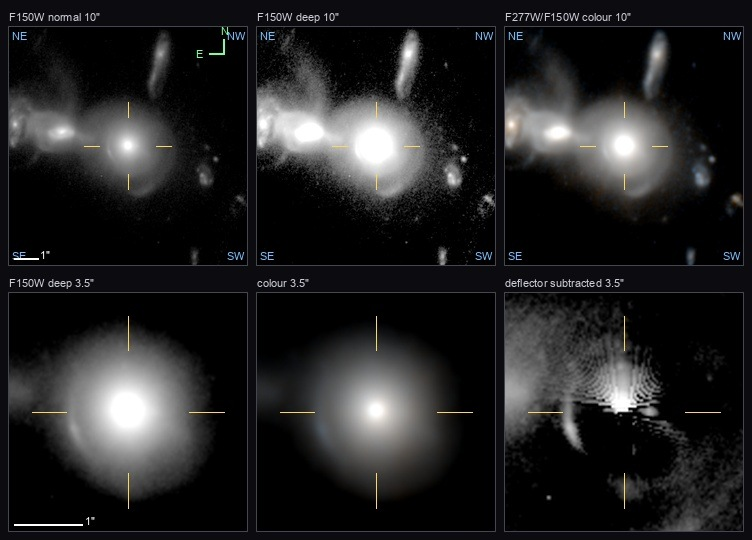{ width="100%" }](img/rank-018-orig.jpg){ target=_blank }
  <figcaption>What the judge saw (blind, footer removed)</figcaption>
</figure>

<figure markdown="span">
  [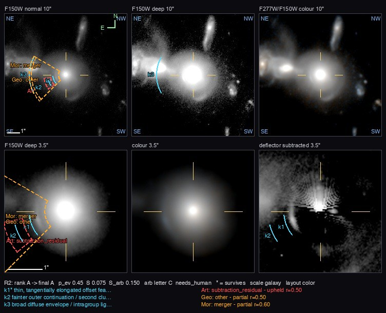{ width="100%" }](img/rank-018-annot.jpg){ target=_blank }
  <figcaption>Advocate evidence (cyan) and critic alternatives coloured by the arbitrator ruling</figcaption>
</figure>

???+ note "Why this grade — advocate, critics, arbitrator"
    **Letter A** (deployed, rule R2) · p_evidence 0.45 · S_arb 0.15 · S 0.075 · scale galaxy

    Letter: letter_rank stands (D rule not met); p_evidence 0.45 >= t_A 0.20 (calibrated at 1% FPR on clean negatives); 2 of 3 configuration criteria >= 6 (curvature, arc_morphology); no critic with r x a >= 0.80.

    **Advocate**

    - criteria: source_contrast 5, low_surface_brightness 6, curvature 6, counter_image 2, arc_morphology 6
    - items (3):
        - k1 — “thin, tangentially elongated offset feature ~1" ESE of the ticked galaxy, concave toward the nucleus, at roughly constant radius; clearest in the subtracted residual but coincident with a faint smudge/asymmetry in the halo of the zoom deep and colour panels, and not mirrored on the opposite side (so not a butterfly lobe or concentric ring)” (panel f, r 1.05 arcsec, PA 95->130, visible in direct: yes; criteria: source_contrast, low_surface_brightness, curvature, arc_morphology)
        - k2 — “fainter outer continuation / second clump along the same position angle at larger radius, one-sided (no counterpart at the same radius to the WNW)” (panel f, r 1.5 arcsec, PA 105->125, visible in direct: no; criteria: low_surface_brightness, arc_morphology)
        - k3 — “broad diffuse envelope / intragroup light joining the ticked galaxy to the bright companion ~2.7" east and to further members, marking a group-scale halo centred near the deflector” (panel b, r 3 arcsec, PA 60->120, visible in direct: yes; criteria: low_surface_brightness)
    - scale galaxy; red neighbours within 10 arcsec 4; BCG-like halo yes; deflector is centre yes; arc radius 1.05 arcsec; arc PA span 95->130; centre-of-curvature offset 0.25 arcsec
    - p_evidence: 0.45
    - notes: “The only lens-like pixels are the one-sided, tangentially curved sliver ~1.0" at PA~110 in panel (f) whose concavity points back onto the ticked nucleus and which corresponds to a faint SE halo asymmetry in (d)/(e); no counter-image is visible on the WNW side, where the direct zoom panels are saturated by the smooth galaxy light, and the field is a crowded interacting group so tidal/companion origins remain open for the critics to test.”

    **Critics**

    **artifact — subtraction_residual:** “Concentric ringing from the 1-D azimuthally-averaged profile fit on a bright, PSF-cored elliptical: panel (f) is filled with alternating positive/negative ripple arcs of ~0.15" spacing running from r~0.3" out to r~1.7" over most position angles (strongest as the fan N-NW of the core). The faint outer 'second clump' at r~1.5" has the same thickness, curvature and surface brightness as those ripple arcs and appears in no direct panel.”

    - location: r 1.25-1.8 arcsec, PA 100->130
    - accounts for: k2; leaves standing: k1, k3; strength r 0.50; coverage a 0.333 (geometric)
    - scale_class: galaxy
    - measured: `{"item1_thickness_arcsec": "~0.2, ~4-5x brighter than local ripples, and coincident with a faint halo asymmetry at r~1\" PA 100-130 in (d) and (e)", "item2_thickness_arcsec": "~0.12, comparable to ripple width", "no_seam_stripe_or_snowball_in_zoom": "true", "no_straight_spike_at_pa_95_130": "true - core shows no 6-spike ray at these angles", "ringing_pa_coverage_deg": "essentially 0-360, brightest 300-60 (fan N/NW of core)", "ringing_radial_extent_arcsec": "0.3-1.7 in panel (f)", "ripple_spacing_arcsec": "~0.15"}`
    - notes: “In (f) the whole field is corrugated by profile-subtraction ripples (spacing ~0.15", visible as the fan of arcs N-NW of the core and continuing round to the SE), and the r~1.5" PA 105-125 feature is indistinguishable from one of them and is absent from (d), (e), (b); the brighter r~1.05" PA 95-130 arc, however, stands well above the ripple amplitude and matches a faint one-sided smudge in the (d)/(e) halo, so I cannot call it an instrument or reduction artefact, and it is not radial/straight so it is not a spike, seam or stripe.”
    - ruling: upheld, covers k2 — “Panel (f) is corrugated by ~0.15" concentric ripples from the 1-D profile fit (the bright fan N/NW of the core continues round to the SE), and the r~1.5" PA 105-125 'second clump' has the same thickness and amplitude as those ripples while being absent from (b), (d) and (e), which is exactly the admissible case for a subtraction residual.”

    **geometry — other:** “One-sided interaction plume: the ticked galaxy is tidally linked to the bright companion ~2.7" east by a continuous bridge; the ESE 'arc' is the inner, wrapped continuation of that plume rather than a tangential image at fixed radius, and the diffuse light of item 3 is that same one-sided bridge, not an envelope centred on the deflector”

    - location: r 0.6-3 arcsec, PA 60->135
    - accounts for: k1, k2, k3; leaves standing: none; strength r 0.50; coverage a 1.00 (geometric), arbitrated a' 0.667
    - scale_class: group
    - measured: `{"companion_separation_and_pa": "bright companion at r=2.7\", PA~85 in (b), joined to the ticked core by continuous surface brightness", "counter_image_search": "no feature at PA 275-315, r=0.9-1.5\" in (d) or (e); halo appears smooth there", "curvature_centre_offset": "~0.3\" east of the ticked nucleus (uncertain +/-0.2\")", "diffuse_light_symmetry": "one-sided: strong flux over PA 55-115 out to r>4\" in (b); no comparable diffuse light at PA 235-295", "item1_radius_run_in_(d)": "faint curved smudge runs from r~1.0\" at PA~100 to r~0.6-0.7\" at PA~135 - radius decreases with PA, not constant", "item2_direct_traceability": "no distinct clump at r=1.5\", PA 105-125 in (d); the only flux there is the smooth eastern plume at PA 70-100"}`
    - notes: “In (b) the low-surface-brightness light is markedly one-sided, a bridge running E from the ticked core to the companion at r~2.7", PA~85, with nothing mirrored to the west; in (d) that plume enters the left edge at PA~75, r~1.8", and the faint curved smudge at PA 100-135 sits at decreasing radius (1.0" -> 0.6") on the same side, with no counterpart at PA 275-315 at r~1.0" in (d) or (e).”
    - ruling: partial, covers k2, k3 — “The deep 10" panel shows unmistakably one-sided low-surface-brightness light running east from the ticked core to the bright companion at r~2.7", PA~85-95 with nothing mirrored to the west, so the 'envelope' is a bridge, but the inner sliver in (f) at r~1.0" is offset and concave toward the nucleus rather than tracking the PA~85-95 bridge axis, and the claimed inward radius run (1.0"->0.6") is contradicted by the other critic's outward run, so item 1 is not securely covered.”

    **morphology — merger:** “The ticked galaxy is the primary of an ongoing interaction: a bright disturbed companion sits ~2.7" E (panel c, PA~95), with plumes running NE and a broad common envelope. The ~1" ESE streak is the inner end of a tidal bridge/stream from that companion - its surface brightness matches the host halo and it continues outward along the SAME position angle to the east frame edge in the 3.5" deep panel, i.e. radius grows along the feature instead of staying constant, and there is no counter-arc.”

    - location: r 0.6-2.8 arcsec, PA 60->135
    - accounts for: k1, k2, k3; leaves standing: none; strength r 0.60; coverage a 1.00 (geometric), arbitrated a' 0.667
    - scale_class: group
    - measured: `{"arc_thickness_vs_radius": "streak is ~0.15-0.2\" thick over ~0.5\" length; it fades outward rather than closing tangentially", "companion_separation": "~2.7\" at PA~95 in panel (c), elongated/disturbed, embedded in the same diffuse envelope", "outer_extension_same_PA": "faint light re-appears at r~1.4-1.8\", PA~90-105, reaching the east edge of the 3.5\" crop - same PA, larger radius", "streak_in_panel_d_PA": "~105-125 deg (ESE-SE)", "streak_in_panel_d_radius": "~0.6-0.9\" (80-120 px at 134 px/arcsec) from the tick centre"}`
    - notes: “In panel (d) the only offset feature is a short slightly-curved streak SE-ESE of the core at r~0.6-0.9", PA~110, and it lies exactly on the line joining the nucleus to the diffuse extension entering the east edge of the crop (PA~95-105, r>1.4") and thence to the bright companion 2.7" E in panel (c); the 10" colour panel shows plumes to the NE and a common low-surface-brightness envelope, i.e. an interacting system whose debris naturally produces a one-sided, non-constant-radius streak, though the small curvature of the inner streak keeps a lensed arc formally possible.”
    - ruling: partial, covers k2, k3 — “The chain of disturbed companions east of the tick and the common envelope in (b)/(c) make a tidal-bridge origin natural for the diffuse light and the outer PA~90-105 extension, but the short inner streak at r~1.0", PA 95-130 in (f) shows tangential curvature about the ticked nucleus and does not visibly grow in radius along its length in (d), so the merger reading does not account for item 1.”

    **Arbitrator**

    - surviving items: k1 (1 of 3)
    - letter_llm: C; scale_class_final: galaxy; needs_human: yes
    - rationale: “What survives is a single feature: the thin, one-sided sliver about 1.0" ESE of the tick centre in the deflector-subtracted zoom (f), concave toward the nucleus, brighter than the surrounding ~0.15"-spaced profile ripples, and matching a faint halo asymmetry on the same side in (d)/(e). Everything else is explained away: the fainter r~1.5" clump is indistinguishable from the ringing that fills (f) (it appears in no direct panel), and the broad diffuse light at PA 60-120 is plainly the one-sided bridge to the disturbed companion 2.7" east in (a)/(b)/(c), part of a chain of interacting group members with plumes to the NE - not a halo centred on the deflector. The surviving sliver is not enough for a lens: there is no counter-image anywhere at r~0.9-1.5", PA 275-315 in (d) or (e) (the halo there looks smooth at this stretch), its curvature centre is offset ~0.25-0.3" east of the nucleus, and it sits on the same side as, and roughly along, the tidal axis toward the companion, so tidal debris remains a live competitor for it. The tangential curvature and the fact that it exceeds the local ripple amplitude keep a lensed arc formally possible, hence C rather than D. A reviewer with a proper elliptical (or PSF-convolved Sersic) subtraction, or any third band, could decide immediately whether that sliver is a stream fragment or the visible half of an Einstein arc, so this is a genuine ambiguity worth human time.”

    **Score**

    - S = p_ev x prod(1 - r_i a_i) = 0.45 x (1 - 0.50x0.333) x (1 - 0.50x1.00) x (1 - 0.60x1.00) = 0.075
        - terms: artifact subtraction_residual r 0.50 a 0.333; geometry other r 0.50 a 1.00; morphology merger r 0.60 a 1.00
    - S_arb = p_ev x prod_{upheld/partial}(1 - r_i a_i') = 0.45 x (1 - 0.50x0.333) x (1 - 0.50x0.667) x (1 - 0.60x0.667) = 0.15
        - terms: artifact subtraction_residual r 0.50 a 0.333 (upheld); geometry other r 0.50 a' 0.667 (partial); morphology merger r 0.60 a' 0.667 (partial)
    - stored grade_pred (on S): C — S 0.075 < t_B 0.17 (calibrated at 5% FPR on clean negatives); not D: 3 item(s) located; no named critic covers every item at r >= 0.80
    - stored letter_arb (on S_arb): C; letter_source: opus5_api_calibrated
    - deploy rule R2: letter_rank (advocate only, on p_evidence) = A — p_evidence 0.45 >= t_A 0.20 (calibrated at 1% FPR on clean negatives); 2 of 3 configuration criteria >= 6 (curvature, arc_morphology); no critic with r x a >= 0.80
    - deploy rule R2: letter_final = A — letter_rank stands (D rule not met); p_evidence 0.45 >= t_A 0.20 (calibrated at 1% FPR on clean negatives); 2 of 3 configuration criteria >= 6 (curvature, arc_morphology); no critic with r x a >= 0.80
    - veto: none (letter_final == letter_rank)

---

## Rank 19: J33372744-1401097 {#rank-19}

| Original grade | Passes | Inspector conf. | Pipeline θ_E |
|:--:|:--:|:--:|:--:|
| **C** | 1/3 | 40 | 2.50″ |

| New (final) | Rank letter | p_ev | S_arb | Demoted by | Arb. letter | Needs human |
|:--:|:--:|--:|--:|:--|:--:|:--:|
| **B** | B | 0.25 | 0.120 | — | D | no |

<small>pipeline discovery status `new` · scale class `galaxy`</small>

<figure markdown="span">
  [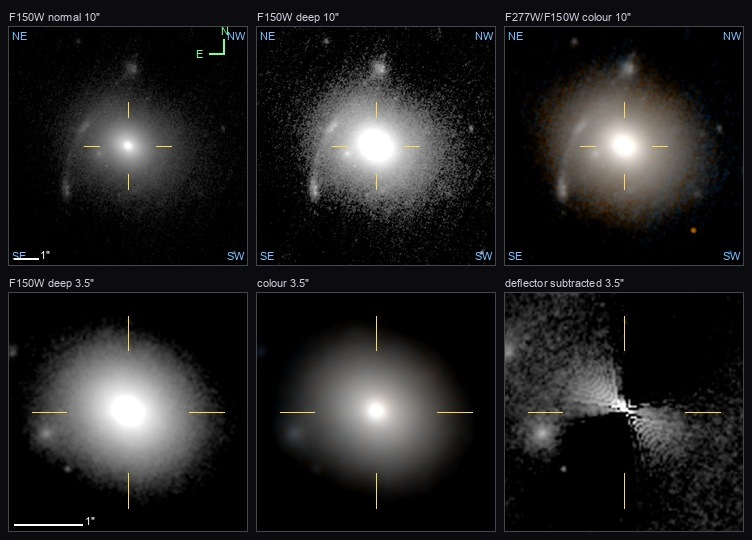{ width="100%" }](img/rank-019-orig.jpg){ target=_blank }
  <figcaption>What the judge saw (blind, footer removed)</figcaption>
</figure>

<figure markdown="span">
  [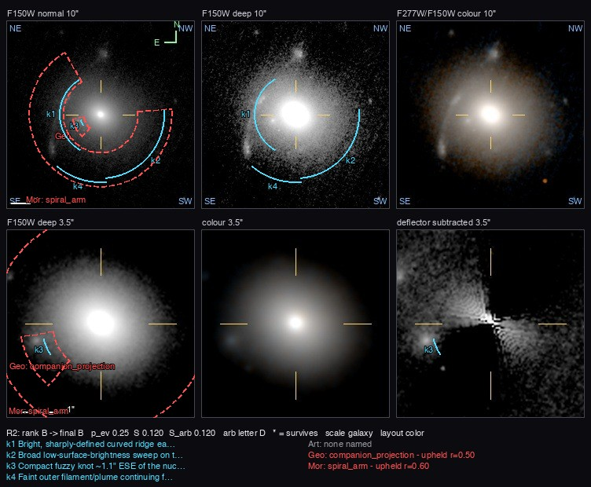{ width="100%" }](img/rank-019-annot.jpg){ target=_blank }
  <figcaption>Advocate evidence (cyan) and critic alternatives coloured by the arbitrator ruling</figcaption>
</figure>

???+ note "Why this grade — advocate, critics, arbitrator"
    **Letter B** (deployed, rule R2) · p_evidence 0.25 · S_arb 0.12 · S 0.12 · scale galaxy

    Letter: letter_rank stands (D rule not met); p_evidence 0.25 >= t_A 0.20 (calibrated at 1% FPR on clean negatives) but A is blocked: only 0 of 3 configuration criteria >= 6; p_evidence 0.25 >= t_B 0.17 (calibrated at 5% FPR on clean negatives).

    **Advocate**

    - criteria: source_contrast 5, low_surface_brightness 7, curvature 5, counter_image 3, arc_morphology 4
    - items (4):
        - k1 — “Bright, sharply-defined curved ridge east of the nucleus, running from the NE quadrant down through due E into the SE; concave toward the galaxy, clearly traceable in (a) and brightest in the deep panel (b), slightly bluer than the orange core in (c)” (panel b, r 2.2 arcsec, PA 30->150, visible in direct: yes; criteria: source_contrast, low_surface_brightness, curvature, arc_morphology)
        - k2 — “Broad low-surface-brightness sweep on the opposite (S/SW/W) side of the galaxy at larger radius, roughly mirroring item 1 in sense of curvature; bluish diffuse envelope in the colour panel (c)” (panel b, r 3.4 arcsec, PA 185->275, visible in direct: yes; criteria: low_surface_brightness, curvature, counter_image)
        - k3 — “Compact fuzzy knot ~1.1" ESE of the nucleus, seen as a discrete blob at the edge of the bulge in the deep zoom (d) and as a one-sided offset positive residual in the subtracted panel (f), not mirrored across the core” (panel f, r 1.1 arcsec, PA 105->122, visible in direct: yes; criteria: low_surface_brightness, counter_image)
        - k4 — “Faint outer filament/plume continuing from the eastern ridge toward the S, at ~3-4" radius in the deep 10" panel” (panel b, r 3.6 arcsec, PA 140->185, visible in direct: yes; criteria: low_surface_brightness)
    - scale galaxy; red neighbours within 10 arcsec 2; BCG-like halo yes; deflector is centre yes; arc radius 2.2 arcsec; arc PA span 30->150; centre-of-curvature offset 0.9 arcsec
    - p_evidence: 0.25
    - notes: “The eastern ridge in (b) is real, curved and concave toward the ticked galaxy, but its radius grows with position angle (~1.6" at PA~45 to ~2.8" at PA~140) and it appears continuous with the bluish envelope wrapping to the SW, so it may be a two-armed spiral/tidal pattern rather than a tangential arc; the inner ESE knot at r~1.1" in (d)/(f) is the only compact, one-sided candidate and its putative counter-image would fall inside the saturated core region of (d)/(e).”

    **Critics**

    **artifact — no alternative named (nothing in its competence fits)**

    - leaves standing: k1, k2, k3, k4
    - scale_class: galaxy
    - measured: `{"bright_neighbour_check": "nearest bright object is ~4\" NW in (a)/(b) and is faint; its PSF wings would be radially symmetric about it, not tangential about the ticked galaxy", "core_spike_check": "the ticked core in (a) shows no resolved 6-spike pattern and no bleed trail; the only spike-like structure is the sub-arcsecond cross/butterfly inside r<0.8\" in (f), which is the stated circular-profile artefact and lies interior to every item", "field_uniformity": "no mosaic seam, dither edge, low-coverage wedge or horizontal amplifier striping crosses the 10\" field in (b) at any of the item radii (1.1-3.6\")", "item_3_direct_visibility": "the ESE knot is present as a discrete fuzzy blob in the UN-subtracted deep zoom (d) at r~1.1\", PA~117, and again in (a)/(c) at the same place, so subtraction_residual is inadmissible; its extended, non-round profile also excludes a snowball, cosmic-ray shower or persistence dot", "straight_ray_test_items_1_2_4": "the eastern ridge (b, r~2.2\", PA 30-150) and the southern sweep (b, r~3.4\", PA 185-275) both change position angle continuously over >90 deg of azimuth at roughly fixed radius; no segment is a straight ray at fixed PA, so no 6-spike diffraction pattern, saturation bleed or 1/f stripe can produce them"}`
    - notes: “Items 1, 2 and 4 are smoothly curved, azimuthally extended structures traceable in the un-subtracted panels (a), (b) and (c); nothing in the instrument signature (spikes, bleed, striping, seams, PSF wings) produces curvature at fixed radius, and the only artefactual structure I can point at is the sub-arcsecond bowtie/cross inside r<0.8" in (f), which is the declared circular-profile residual and is not one of the items. Item 3 is a real compact source in the direct deep zoom (d) at r~1.1", PA~117, not a snowball, cosmic ray or subtraction ghost; whether it is a lensed image or a companion/clump is outside my competence.”
    - ruling: no ruling for this critic

    **geometry — companion_projection:** “The 1.1" ESE blob is a discrete compact source projected on the galaxy's envelope (one of at least two such blobs on the same side at r~1.1-1.4", PA~106 and ~136 in panel d), round rather than tangentially stretched, with no counter-image at the mirror position - an unrelated/embedded companion or knot, not a lensed image pair.”

    - location: r 0.9-1.5 arcsec, PA 100->140
    - accounts for: k3; leaves standing: k1, k2, k4; strength r 0.50; coverage a 0.25 (geometric)
    - scale_class: galaxy
    - measured: `{"curvature_centre": "eastern ridge concave toward the ticks; centre of curvature within ~1\" of the ticked nucleus", "item1_radius_vs_PA": "bright knots on eastern ridge in (b) at r=2.1\" (PA 70), r=3.0\" (PA 125), continuing to r=3.6\" (PA 150-185) - radius grows monotonically with angle rather than staying fixed", "item1_vs_item2_radii": "2.2\" (E) vs 3.4\" (SW), ratio 1.5 - not obviously one arc/counter-arc pair, though allowed for an elliptical deflector", "item3_axis_ratio": "~1.1, no measurable tangential elongation over ~0.25\" length", "item3_counter_image_search": "nothing compact at r 1.0-1.5\", PA 275-315 in (d) or (e); mirror side is smooth envelope", "item3_position": "blob in (d) at 1.3\"+-0.15\", PA 106; second blob 1.3\", PA 136", "widest_view_members": "one dominant galaxy plus a small compact source 3.3\" due N; no second comparable red member, no diffuse group envelope in the 10\" panel"}`
    - notes: “In (d) the ESE feature is a small round blob ~1.3" from the ticks at PA~106 with a twin at PA~136, both bluish in (e); neither is tangentially stretched and there is no compact counterpart at PA~285-305, so as a configuration it reads as projected/embedded companions rather than a merging image pair. The eastern ridge (items 1,4) climbs from r=2.1" at PA 70 to r=3.6" at PA 150-185, i.e. not at constant radius, but whether it is the host's own arm is the morphology critic's call.”
    - ruling: upheld, covers k3 — “In the deep zoom (d) the ESE feature at r~1.1-1.3" is a round, unstretched blob with a twin at PA~136 and no compact counterpart anywhere at PA~275-315, where the envelope is smooth - a projected/embedded companion or knot, not one image of a pair.”

    **morphology — spiral_arm:** “A patchy, dusty disc around the bright bulge whose outer light breaks into two winding arm segments: the bright ENE ridge and its continuation curving south, plus the fainter counter-arm on the SW side - a 180-degree-symmetric two-arm pattern with radius growing monotonically with position angle, studded with blue knots.”

    - location: r 2-3.8 arcsec, PA 30->275
    - accounts for: k1, k2, k4; leaves standing: k3; strength r 0.60; coverage a 0.75 (geometric)
    - scale_class: galaxy
    - measured: `{"counter_feature": "diffuse sweep at r~3.4 arcsec, PA 185-275, the point-reflected arm at comparable outer radius", "dr_dpa": "+0.9 arcsec over ~60 deg of PA, monotonically increasing - not constant radius", "ridge_radius_at_pa77": "2.4 arcsec (bright knot/ridge left of and slightly above the core in panel (c))", "same_feature_radius_at_pa122_139": "3.3 arcsec (SE curved filament in panel (c))", "zoom_check": "panel (d) 3.5-inch deep shows a smooth elliptical bulge inside 1.7 arcsec - no tangential arc inside the ticks"}`
    - notes: “In (c) the eastern ridge sits at 2.4" (PA~77) and the same filament is at 3.3" by PA~122-139, i.e. radius grows with angle, which is an arm winding out of the disc rather than a fixed-radius arc; the SW sweep at 3.4" is its point-symmetric counter-arm, and the envelope is mottled with knots as a disc should be. Item 3, the compact 1.1" ESE knot in (d), is a discrete blob inside the bulge and is not explained by the arm pattern.”
    - ruling: upheld, covers k1, k2, k4 — “The eastern ridge in (b)/(c) climbs from r~2.1-2.4" at PA~70-77 to r~3.3-3.6" by PA~125-185 - radius growing monotonically with angle, studded with knots, and point-reflected by the diffuse SW sweep at r~3.4" - the signature of a two-arm/tidal winding pattern in the host's mottled envelope, not a fixed-radius tangential arc.”

    **Arbitrator**

    - surviving items: none (0 of 4)
    - letter_llm: D; scale_class_final: galaxy; needs_human: no
    - rationale: “The ticked galaxy in (a)/(b) is a bright bulge inside a large, mottled, disc-like envelope; the feature that drew attention - the bright ENE ridge sweeping down through E to SE - is traceable in every un-subtracted panel but its radius grows steadily with position angle (r~2.1-2.4" near PA 70-77, r~3.3-3.6" by PA 125-185), and it joins continuously onto the fainter southern plume (item 4) and is mirrored 180 degrees away by the broad SW sweep at r~3.4" (item 2). That is an arm/tidal pair winding out of the host, not a tangential arc at constant radius about the ticks, and at 0.031"/px the curvature and knotty texture are resolved well enough that the distinction is not seeing-limited. The only compact one-sided candidate, the ESE blob at r~1.1-1.3", PA~105-120 in (d), is round to within its ~0.25" extent, has a companion blob at PA~136 on the same side, and has no counterpart on the mirror side, so it reads as a projected/embedded knot; the strong cross/bowtie and concentric structure inside r<0.8" in (f) is the declared circular-profile subtraction artefact and carries no weight either way. The artifact critic offered no alternative and correctly ruled out spikes, striping and PSF wings, but with both remaining alternatives upheld every located item is accounted for and no lensing evidence survives.”

    **Score**

    - S = p_ev x prod(1 - r_i a_i) = 0.25 x (1 - 0.50x0.25) x (1 - 0.60x0.75) = 0.12
        - terms: geometry companion_projection r 0.50 a 0.25; morphology spiral_arm r 0.60 a 0.75
    - S_arb = p_ev x prod_{upheld/partial}(1 - r_i a_i') = 0.25 x (1 - 0.50x0.25) x (1 - 0.60x0.75) = 0.12
        - terms: geometry companion_projection r 0.50 a 0.25 (upheld); morphology spiral_arm r 0.60 a 0.75 (upheld)
    - stored grade_pred (on S): C — S 0.12 < t_B 0.17 (calibrated at 5% FPR on clean negatives); not D: 4 item(s) located; no named critic covers every item at r >= 0.80
    - stored letter_arb (on S_arb): C; letter_source: opus5_api_calibrated
    - deploy rule R2: letter_rank (advocate only, on p_evidence) = B — p_evidence 0.25 >= t_A 0.20 (calibrated at 1% FPR on clean negatives) but A is blocked: only 0 of 3 configuration criteria >= 6; p_evidence 0.25 >= t_B 0.17 (calibrated at 5% FPR on clean negatives)
    - deploy rule R2: letter_final = B — letter_rank stands (D rule not met); p_evidence 0.25 >= t_A 0.20 (calibrated at 1% FPR on clean negatives) but A is blocked: only 0 of 3 configuration criteria >= 6; p_evidence 0.25 >= t_B 0.17 (calibrated at 5% FPR on clean negatives)
    - veto: none (letter_final == letter_rank)

---

## Rank 20: J710586-7562357 {#rank-20}

| Original grade | Passes | Inspector conf. | Pipeline θ_E |
|:--:|:--:|:--:|:--:|
| **C** | 1/3 | 35 | — |

| New (final) | Rank letter | p_ev | S_arb | Demoted by | Arb. letter | Needs human |
|:--:|:--:|--:|--:|:--|:--:|:--:|
| **C** | C | 0.12 | 0.120 | — | — | no |

<small>pipeline discovery status `new` · scale class `galaxy`</small>

<figure markdown="span">
  [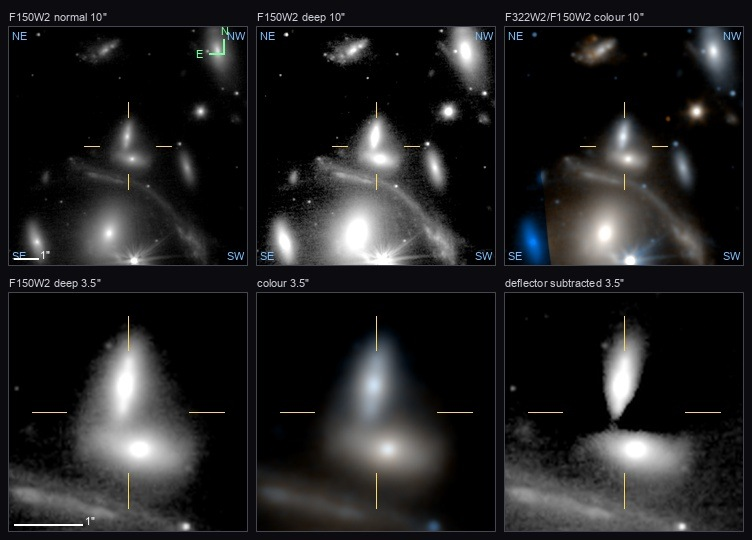{ width="100%" }](img/rank-020-orig.jpg){ target=_blank }
  <figcaption>What the judge saw (blind, footer removed)</figcaption>
</figure>

<figure markdown="span">
  [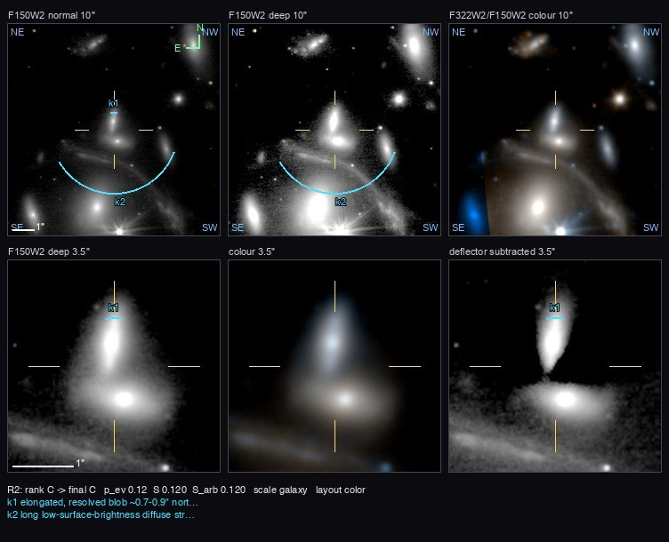{ width="100%" }](img/rank-020-annot.jpg){ target=_blank }
  <figcaption>Advocate evidence (cyan) and critic alternatives coloured by the arbitrator ruling</figcaption>
</figure>

???+ note "Why this grade — advocate, critics, arbitrator"
    **Letter C** (deployed, rule R2) · p_evidence 0.12 · S_arb 0.12 · S 0.12 · scale galaxy

    Letter: letter_rank stands (D rule not met); p_evidence 0.12 < t_B 0.17 (calibrated at 5% FPR on clean negatives); not D: 2 item(s) located; no named critic covers every item at r >= 0.80.

    **Advocate**

    - criteria: source_contrast 5, low_surface_brightness 5, curvature 1, counter_image 1, arc_morphology 2
    - items (2):
        - k1 — “elongated, resolved blob ~0.7-0.9" north of the ticked core, ~1.2" long by ~0.45" wide, its major axis lying ALONG the radius vector (N-S); bluer/whiter than the yellowish core in (e) and surviving as a strong one-sided residual in (f)” (panel f, r 0.8 arcsec, PA 350->10, visible in direct: yes; criteria: source_contrast, low_surface_brightness)
        - k2 — “long low-surface-brightness diffuse streak sweeping from the SE corner across the field to the W, passing ~2.5-4" south of the ticked galaxy; broad, nearly straight, and attached to the bright southern galaxy's envelope in the deep panel” (panel b, r 3 arcsec, PA 120->250, visible in direct: yes; criteria: low_surface_brightness)
    - scale galaxy; red neighbours within 10 arcsec 5; BCG-like halo yes; deflector is centre no
    - p_evidence: 0.12
    - notes: “The only compact offset feature (item 1) is elongated RADIALLY, not tangentially - its long axis in (d)/(f) points straight back at the ticked core along PA 0/180 with no curvature and no southern counterpart at a similar radius (the 0.8" annulus south of the core is clean in both (d) and (f)); the surrounding 10" field is a group with straight, broad diffuse streamers rather than any feature at constant radius about the tick.”

    **Critics**

    - not called (p_evidence 0.12 < tau0 0.15)

    **Arbitrator**

    - no arbitrator record (not called)

    **Score**

    - S = p_ev = 0.12 (no critic term entered the product)
    - S_arb = p_ev = 0.12 (no critic term entered the product)
    - stored grade_pred (on S): C — S 0.12 < t_B 0.17 (calibrated at 5% FPR on clean negatives); not D: 2 item(s) located; no named critic covers every item at r >= 0.80
    - stored letter_arb (on S_arb): C; letter_source: opus5_api_calibrated
    - deploy rule R2: letter_rank (advocate only, on p_evidence) = C — p_evidence 0.12 < t_B 0.17 (calibrated at 5% FPR on clean negatives); not D: 2 item(s) located; no named critic covers every item at r >= 0.80
    - deploy rule R2: letter_final = C — letter_rank stands (D rule not met); p_evidence 0.12 < t_B 0.17 (calibrated at 5% FPR on clean negatives); not D: 2 item(s) located; no named critic covers every item at r >= 0.80
    - veto: none (letter_final == letter_rank)

---

## Rank 21: J6403415-2406677 {#rank-21}

| Original grade | Passes | Inspector conf. | Pipeline θ_E |
|:--:|:--:|:--:|:--:|
| **C** | 1/3 | 30 | 1.20″ |

| New (final) | Rank letter | p_ev | S_arb | Demoted by | Arb. letter | Needs human |
|:--:|:--:|--:|--:|:--|:--:|:--:|
| **B** | B | 0.27 | 0.131 | — | D | no |

<small>pipeline discovery status `known` · scale class `none`</small>

<figure markdown="span">
  [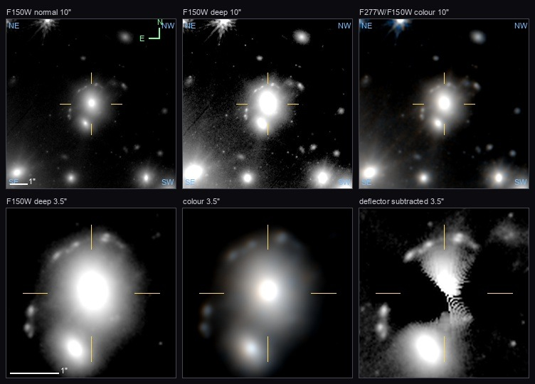{ width="100%" }](img/rank-021-orig.jpg){ target=_blank }
  <figcaption>What the judge saw (blind, footer removed)</figcaption>
</figure>

<figure markdown="span">
  [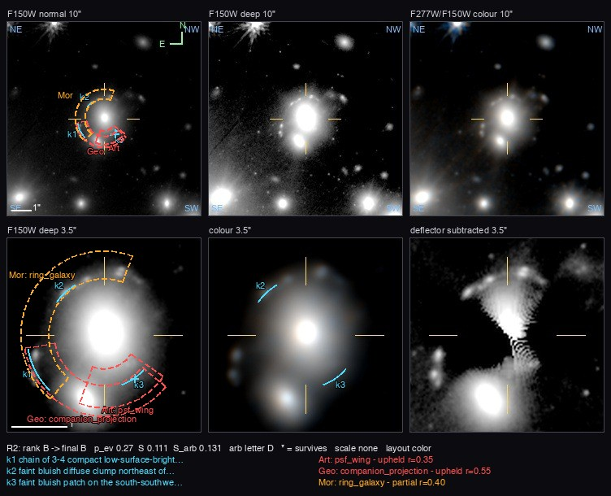{ width="100%" }](img/rank-021-annot.jpg){ target=_blank }
  <figcaption>Advocate evidence (cyan) and critic alternatives coloured by the arbitrator ruling</figcaption>
</figure>

???+ note "Why this grade — advocate, critics, arbitrator"
    **Letter B** (deployed, rule R2) · p_evidence 0.27 · S_arb 0.131 · S 0.111 · scale none

    Letter: letter_rank stands (D rule not met); p_evidence 0.27 >= t_A 0.20 (calibrated at 1% FPR on clean negatives) but A is blocked: only 0 of 3 configuration criteria >= 6; p_evidence 0.27 >= t_B 0.17 (calibrated at 5% FPR on clean negatives).

    **Advocate**

    - criteria: source_contrast 5, low_surface_brightness 5, curvature 3, counter_image 2, arc_morphology 4
    - items (3):
        - k1 — “chain of 3-4 compact low-surface-brightness knots strung along a slightly curved, roughly tangential line east-southeast of the ticked galaxy, at nearly constant radius; traceable in the deep zoom (d), in the 10" deep panel (b) and reappearing as an offset one-sided residual clump group in (f)” (panel d, r 1.4 arcsec, PA 100->135, visible in direct: yes; criteria: low_surface_brightness, curvature, arc_morphology)
        - k2 — “faint bluish diffuse clump northeast of the core, distinctly bluer than the orange/white deflector light in the two-band colour zoom and visible as a low-level bump in the deep zoom” (panel e, r 1.05 arcsec, PA 30->55, visible in direct: yes; criteria: source_contrast, low_surface_brightness)
        - k3 — “faint bluish patch on the south-southwest flank of the envelope, on the opposite side of the nucleus from item 2 at a comparable radius (candidate counter-knot, but blended with the bright companion's halo)” (panel e, r 0.95 arcsec, PA 200->230, visible in direct: yes; criteria: source_contrast, counter_image)
    - scale galaxy; red neighbours within 10 arcsec 4; BCG-like halo yes; deflector is centre yes; arc radius 1.4 arcsec; arc PA span 100->135; counter-image at r 0.95 arcsec PA 215; centre-of-curvature offset 0.8 arcsec
    - p_evidence: 0.27
    - notes: “The only geometrically interesting feature is the ESE knot chain at r~1.4" (PA 100-135) that keeps roughly constant radius in (b), (d) and as an offset clump group in (f); the two faint blue patches at PA~40 and PA~215 straddle the nucleus at r~1" but sit inside a bright, blended close pair whose common envelope and second nucleus 1.2" to the SSE make a merger/tidal or companion-projection reading fully open for the critics.”

    **Critics**

    **artifact — psf_wing:** “The bright, extended neighbour ~1.2" due south of the ticked galaxy (the second bright blob at the bottom of the zoom panels) has broad wings that overlap the deflector envelope; item 3 sits inside that overlap region, so the faint SSW 'counter-knot' is most simply the neighbour's outer light (with its bluer SW-band halo) superposed on the deflector halo rather than an independent image.”

    - location: r 0.6-1.3 arcsec, PA 160->235
    - accounts for: k3; leaves standing: k1, k2; strength r 0.35; coverage a 0.333 (geometric)
    - scale_class: galaxy
    - measured: `{"nearest_bright_star_offset_arcsec": 5.1, "neighbour_pa_deg": 183, "neighbour_separation_arcsec": 1.2, "overlap_of_item3_with_neighbour_halo": "item 3 at r=0.95\", PA 200-230 lies within the isophotes of the southern neighbour traced in panels (d) and (e)", "panel_f_bowtie": "strong vertical four-lobed bowtie plus concentric ripples centred on the core - circular-profile subtraction artefact, not counted", "spike_position_angles_reaching_deflector": "none within PA 100-135 or 30-55 at r~1-1.5\"", "star_pa_from_deflector_deg": 30}`
    - notes: “Items 1 and 2 are present in the un-subtracted panels (b), (d) and (e) at r~1.0-1.4" and lie off every spike axis of the NE star (5.1" away, PA 30), show no straight-ray geometry, no snowball/persistence morphology and no alignment with the faint diagonal striping in (b), so I find no instrumental cause for them; the vertical bowtie and ring ripples in (f) are the circular-model subtraction signature and I do not use them. Only item 3 (r=0.95", PA 200-230) falls inside the measurable halo of the bright neighbour 1.2" south, which is a plausible blending/PSF-wing origin but not provable at this depth.”
    - ruling: upheld, covers k3 — “In panels (d) and (e) the faint SSW patch at r~0.95", PA 200-230 lies inside the traceable isophotes/wings of the bright companion 1.2" south of the ticks, so it is blended neighbour light, not an independent image.”

    **geometry — companion_projection:** “The ESE knot group is a small clumpy neighbour/knot group sitting on the host's east rim at a radius (~1.3-1.4") incompatible with the north knot at ~1.05", with no counter-group anywhere on the W/NW side; the SSW 'counter-knot' is not a distinct source but the overlapping halo of the bright companion galaxy 1.2" S-SE (PA~166) blending into the envelope.”

    - location: r 0.9-1.45 arcsec, PA 100->230
    - accounts for: k1, k3; leaves standing: k2; strength r 0.55; coverage a 0.667 (geometric)
    - scale_class: galaxy
    - measured: `{"bright_companion": "r = 1.20\", PA = 166 deg; its halo covers the item-3 box (r 0.95, PA 200-230)", "counter_image_search_PA_285_305_r_1.0_1.6": "none - west/NW envelope is smooth in panels (d) and (e)", "item1_knot_radii_arcsec": "1.30, 1.42, 1.34 (knots at PA 105, 117, 124 in panel d) - middle knot is the most distant, not constant radius", "item1_local_curvature_centre_offset_from_deflector_arcsec": "~1.2 (circumcentre of the three ESE knots lies ~0.26\" from the knots themselves, not at the tick centre)", "item2_chain_extent": "the NE clump is one of ~4 knots strung along the north rim from PA ~345 to ~45 at r = 1.0-1.1\"", "radius_ratio_item1_to_item2": "1.30 (ESE 1.35\" vs N 1.05\"), with the larger radius on the envelope's MINOR-axis side, opposite to the sense expected for an elliptical deflector elongated N-S"}`
    - notes: “In panel (d) the ESE knots (~x65,y320 / x60,y362 / x85,y378) sit on the envelope's eastern isophotal rim at r=1.30-1.42" and their own curvature centre falls ~1.2" off the tick centre, while the north knot chain lies at r=1.0-1.1"; no knot exists at PA 285-305 at any radius 1.0-1.6". In panel (e) the SSW 'blue patch' at r~0.95, PA 200-230 is continuous with the bright companion's halo at r=1.20", PA=166, not a separate compact image.”
    - ruling: upheld, covers k1, k3 — “The ESE blobs in (d) sit at r=1.30-1.42" on the eastern isophotal rim as discrete round knots with their own curvature centre ~1.2" off the tick centre, and the W/NW envelope at r=1.0-1.6", PA 285-305 is featureless in both (d) and (e) - no counter-image anywhere.”

    **morphology — ring_galaxy:** “A clumpy, blue star-forming outer ring / disc rim of the host itself: >=6 compact knots strung along the northern rim (PA~347,7,19,36 deg at r=1.08-1.12") continuing into the ESE chain (PA~105-125 deg at r=1.2-1.4"), i.e. one broken clumpy ring nearly centred on the ticked nucleus, with the bright galaxy embedded in the same envelope at PA~165 deg, r~1.15" as the perturber/intruder.”

    - location: r 1-1.5 arcsec, PA 340->140
    - accounts for: k1, k2; leaves standing: k3; strength r 0.40; coverage a 0.667 (geometric), arbitrated a' 0.333
    - scale_class: galaxy
    - measured: `{"ESE_chain_radii_arcsec": "1.22, 1.40, 1.32 at PA ~105, 114, 123 deg (panel d)", "chain_orientation": "ESE chain elongated roughly N-S, i.e. tangential to the radius vector, as is the N chain", "circle_fit_through_N_and_ESE_knots": "radius 1.40\", centre offset ~0.32\" at PA~195 deg from the ticked nucleus (toward the southern companion)", "companion": "bright galaxy at r=1.15\", PA=165 deg inside the same diffuse envelope (panel d,e)", "north_knot_radii_arcsec": "1.12, 1.10, 1.08, 1.10 at PA 347, 7, 19, 36 deg (panel d)", "radius_vs_angle_trend": "flat within 15% over PA 347->125 deg; no monotonic growth expected of a spiral arm"}`
    - notes: “In (d) the knot chain the scorer calls item 2 is only the east end of a four-knot chain that runs along the northern rim at essentially constant r=1.08-1.12" (PA 347-36 deg), and item 1's ESE chain sits at r=1.2-1.4"; a circle through both lies only ~0.3" from the ticked nucleus, so a clumpy blue star-forming ring/outer disc of the host, disturbed by the bright galaxy at PA 165 deg r=1.15" inside the same envelope, reproduces items 1-2 as readily as a broken Einstein ring - the constant radius and tangential knot elongation are equally consistent with either, so I cannot call it. Item 3 (PA 200-230 deg, r=0.95") falls 0.7" inside my fitted ring and is not accounted for by it.”
    - ruling: partial, covers k2 — “The 'blue NE clump' resolves in (d) as one bead of a four-knot chain running along the northern rim at essentially constant r=1.08-1.12" (PA 347-36), i.e. a clumpy star-forming disc/rim rather than a counter-image, but the critic's single-ring fit needs a 0.32" offset centre and 15% radius scatter to also swallow the ESE chain, so it does not by itself carry item 1.”

    **Arbitrator**

    - surviving items: none (0 of 3)
    - letter_llm: D; scale_class_final: none; needs_human: no
    - rationale: “The ticked galaxy is the northern member of a close, blended pair sitting in one diffuse common envelope, with the second bright nucleus only ~1.2" to the south inside the same isophotes (panels d, e, and dominating the lower half of the residual panel f). Everything the scorer located dissolves under the direct panels at NIRCam resolution: item 1 is a string of three-four discrete, essentially round compact knots on the eastern isophotal rim at r=1.30-1.42" - no tangential elongation, no continuous surface-brightness ridge, radii scattering by ~10% and a local curvature centre ~1.2" from the tick centre; item 2 is simply the eastern end of a matching four-knot chain along the northern rim at r~1.10", i.e. the same clumpy blue rim population continuing around the envelope of a tidally disturbed pair; item 3 lies squarely within the southern companion's halo and is blended light, not a counter-knot. Crucially there is no counter-image at all on the western/north-western side at r=1.0-1.6" - that envelope is smooth in both (d) and (e) - which is fatal for the broken-ring reading, and the striking vertical bowtie plus concentric ripples in (f) are the circular-profile subtraction signature and were correctly excluded by every role. What remains is a merging/interacting close pair with star-forming or tidal knots strung along its rim, so no lensing evidence survives; deeper or multi-band data would only confirm what the knots' discrete, non-tangential morphology already shows.”

    **Score**

    - S = p_ev x prod(1 - r_i a_i) = 0.27 x (1 - 0.35x0.333) x (1 - 0.55x0.667) x (1 - 0.40x0.667) = 0.111
        - terms: artifact psf_wing r 0.35 a 0.333; geometry companion_projection r 0.55 a 0.667; morphology ring_galaxy r 0.40 a 0.667
    - S_arb = p_ev x prod_{upheld/partial}(1 - r_i a_i') = 0.27 x (1 - 0.35x0.333) x (1 - 0.55x0.667) x (1 - 0.40x0.333) = 0.131
        - terms: artifact psf_wing r 0.35 a 0.333 (upheld); geometry companion_projection r 0.55 a 0.667 (upheld); morphology ring_galaxy r 0.40 a' 0.333 (partial)
    - stored grade_pred (on S): C — S 0.111 < t_B 0.17 (calibrated at 5% FPR on clean negatives); not D: 3 item(s) located; no named critic covers every item at r >= 0.80
    - stored letter_arb (on S_arb): C; letter_source: opus5_api_calibrated
    - deploy rule R2: letter_rank (advocate only, on p_evidence) = B — p_evidence 0.27 >= t_A 0.20 (calibrated at 1% FPR on clean negatives) but A is blocked: only 0 of 3 configuration criteria >= 6; p_evidence 0.27 >= t_B 0.17 (calibrated at 5% FPR on clean negatives)
    - deploy rule R2: letter_final = B — letter_rank stands (D rule not met); p_evidence 0.27 >= t_A 0.20 (calibrated at 1% FPR on clean negatives) but A is blocked: only 0 of 3 configuration criteria >= 6; p_evidence 0.27 >= t_B 0.17 (calibrated at 5% FPR on clean negatives)
    - veto: none (letter_final == letter_rank)

---

## Rank 22: J5414235-4704895 {#rank-22}

| Original grade | Passes | Inspector conf. | Pipeline θ_E |
|:--:|:--:|:--:|:--:|
| **C** | 1/3 | 30 | 1.70″ |

| New (final) | Rank letter | p_ev | S_arb | Demoted by | Arb. letter | Needs human |
|:--:|:--:|--:|--:|:--|:--:|:--:|
| **B** | B | 0.50 | 0.272 | — | C | yes ⚑ |

<small>pipeline discovery status `new` · scale class `galaxy`</small>

<figure markdown="span">
  [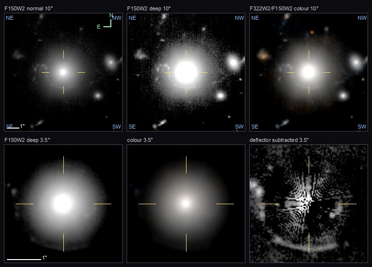{ width="100%" }](img/rank-022-orig.jpg){ target=_blank }
  <figcaption>What the judge saw (blind, footer removed)</figcaption>
</figure>

<figure markdown="span">
  [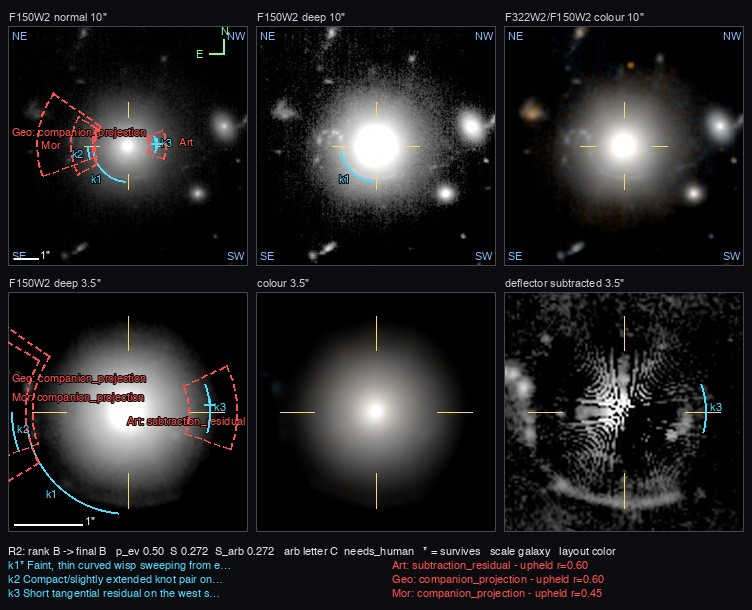{ width="100%" }](img/rank-022-annot.jpg){ target=_blank }
  <figcaption>Advocate evidence (cyan) and critic alternatives coloured by the arbitrator ruling</figcaption>
</figure>

???+ note "Why this grade — advocate, critics, arbitrator"
    **Letter B** (deployed, rule R2) · p_evidence 0.50 · S_arb 0.272 · S 0.272 · scale galaxy

    Letter: letter_rank stands (D rule not met); p_evidence 0.50 >= t_A 0.20 (calibrated at 1% FPR on clean negatives) but A is blocked: only 0 of 3 configuration criteria >= 6; p_evidence 0.50 >= t_B 0.17 (calibrated at 5% FPR on clean negatives).

    **Advocate**

    - criteria: source_contrast 4, low_surface_brightness 6, curvature 5, counter_image 4, arc_morphology 5
    - items (3):
        - k1 — “Faint, thin curved wisp sweeping from east-southeast round to south of the core, concave toward the deflector, traceable in the normal and deep 10" panels and as a curved offset residual along the bottom of the subtracted zoom” (panel b, r 1.5 arcsec, PA 100->175, visible in direct: yes; criteria: low_surface_brightness, curvature, arc_morphology)
        - k2 — “Compact/slightly extended knot pair on the east side at fixed radius, whiter/bluer than the orange deflector envelope in the colour panels, sitting just outside the saturated core” (panel d, r 1.7 arcsec, PA 90->110, visible in direct: yes; criteria: source_contrast, low_surface_brightness, counter_image)
        - k3 — “Short tangential residual on the west side of the subtracted zoom at a radius within ~30% of the east knot radius, roughly opposite it (candidate counter-image; not mirrored by any comparable feature at other position angles)” (panel f, r 1.2 arcsec, PA 255->290, visible in direct: no; criteria: counter_image)
    - scale galaxy; red neighbours within 10 arcsec 3; BCG-like halo yes; deflector is centre yes; arc radius 1.5 arcsec; arc PA span 100->175; counter-image at r 1.2 arcsec PA 275; centre-of-curvature offset 0.4 arcsec
    - p_evidence: 0.50
    - notes: “The strongest pixels are the thin curved wisp running E->S at ~1.5" in panels (a)/(b) whose concavity points back onto the ticked galaxy (centre of curvature offset ~0.4"), plus the whiter east knots at ~1.7" in (d)/(e); the direct panels are saturated inside ~0.8" and (f) is dominated by the expected bowtie/ring artefacts, so the western counterpart at ~1.2" is only tentatively located.”

    **Critics**

    **artifact — subtraction_residual:** “West-side positive residual in panel (f) only: the 1-D azimuthally-averaged model was fitted about the stamp centre while the true light distribution on the west side is boosted by the wings of the bright neighbour ~4" west (and a mildly elongated envelope), so the circular model under-subtracts along PA~250-295; the feature lies inside the high-frequency ringing zone of the saturated core and has no counterpart in any direct panel.”

    - location: r 0.9-1.6 arcsec, PA 250->295
    - accounts for: k3; leaves standing: k1, k2; strength r 0.60; coverage a 0.333 (geometric)
    - scale_class: galaxy
    - measured: `{"bright_neighbour_offset_arcsec": "~4.1 at PA ~272 (panels a,b,c, right-hand bright blob)", "core_ringing_extent_arcsec": "vertical high-frequency striping in (f) out to r~0.8\", no 6-fold spikes anywhere", "counterpart_in_direct_zoom": "none - panels (d) and (e) are smooth and featureless at r=1.0-1.6\", PA 250-295", "west_residual_pa_deg": "250-295", "west_residual_radius_arcsec": "1.1-1.5"}`
    - notes: “In panel (f) the west patch at r~1.2", PA 255-290 sits at the edge of the vertical core ringing and has zero counterpart in the deep zoom (d) or colour zoom (e), both of which are smooth there, so it is a property of the circular-profile fit (aided by the unmodelled wing gradient from the bright galaxy ~4" west) rather than of the sky. Items 1 (south/southeast wisp, clearly present in the un-subtracted 10" panels a and b at r~1.5") and 2 (compact knots on the east side, present in both (d) and (e), not cosmic-ray or snowball-like since they appear in both bands) are not instrumental and I leave them standing.”
    - ruling: upheld, covers k3 — “The west patch at r~1.2", PA 255-290 appears only in the subtracted zoom (f), sitting at the edge of the vertical core ringing, while the same location in (d) and (e) is a smooth, featureless envelope - exactly the case where subtraction_residual is admissible.”

    **geometry — companion_projection:** “The eastern 'knot pair' is the innermost member of a chain of small compact clumps that runs outward from ~1.6" east to ~3-4" east-northeast in the deep 10" panel - an unrelated faint clumpy neighbour / debris chain projected on the envelope, at increasing rather than fixed radius and with no tangentially elongated counterpart on the opposite side.”

    - location: r 1.4-3.8 arcsec, PA 55->110
    - accounts for: k2; leaves standing: k1, k3; strength r 0.60; coverage a 0.333 (geometric)
    - scale_class: galaxy
    - measured: `{"centre_of_curvature_offset_arcsec": "not measurable - no arc curvature resolved at the knot", "counter_image_west_in_direct_panels": "none detected at r=1.2-2.0\", PA 255-290 in (b) or (d)", "east_knot_pa_deg": "95-108", "east_knot_radius_arcsec": 1.7, "knot_chain_extent_arcsec": "1.6 -> ~3.6 along PA ~60-105 in panel (b)", "profile_match_east_vs_west": "no west feature to compare", "tangential_axis_ratio_of_east_knot": "~1.2, elongation roughly radial/NNE, not tangential"}`
    - notes: “In panel (d) the only off-core feature is a small double blob at the extreme east edge, r~1.7", PA~100, which in panel (b) is clearly the inner end of a string of similar knots stretching NE to r~3.5"; the knots step outward in radius instead of holding one radius, and the west side of (d)/(b) at r=1.2-2.0", PA 255-290 is smooth with no counter-arc, so item 3 rests entirely on the subtracted panel I was not shown.”
    - ruling: upheld, covers k2 — “In panel (b) the east 'knot pair' at r~1.7" is plainly the inner end of a string of comparable compact blobs marching outward to r~3.5" along PA ~60-105, i.e. increasing radius rather than one fixed radius, and the mirror position on the west side of (b)/(d) is blank.”

    **morphology — companion_projection:** “The east-side feature is a small clumpy/irregular neighbour projected on the outer envelope: 3-4 discrete round knots plus faint diffuse light spread over ~50 deg of position angle at r~1.6-2.3" east, not a smooth tangentially-stretched arc. The host itself is a completely smooth, round, featureless spheroid in both zooms - no arms, bar, ring or shell - so no host-structure explanation applies.”

    - location: r 1.5-2.4 arcsec, PA 60->120
    - accounts for: k2; leaves standing: k1, k3; strength r 0.45; coverage a 0.333 (geometric)
    - scale_class: galaxy
    - measured: `{"host_isophotes": "smooth and near-circular from r~0.2\" to 1.7\" in (d) and (e); no arm, bar, ring, shell or bridge detectable anywhere in the zooms", "knot_chain_pa_span_deg": "~65 to ~115, i.e. ~50 deg, but filled by discrete blobs rather than a continuous ridge", "knot_chain_radii_arcsec": "1.6-2.3 (measured from tick centre in panel (c), ~0.022\"/px)", "knot_shape": "each knot roughly round to mildly elongated (axis ratio ~1.2-1.4), long axes not aligned tangentially; the two-lobed blob at the east edge of panel (d) (r~1.65\", PA~85) is unresolved-compact, not stretched", "west_side_direct": "no knot, ridge or surface-brightness excess traceable at r~1.2\", PA 255-290 in (c), (d) or (e)"}`
    - notes: “In panel (c) the only non-smooth structure is a scatter of small whitish knots left (east) of the core at ~80-105 px from the tick centre, PA ~65-115, each blob compact and none tangentially elongated; in panel (d) the same feature appears as a two-lobed clump right at the east crop edge (r~1.65"). Item 1's wisp (PA 100-175, r 1.5") and item 3's west residual (panel f) are not traceable in any panel I was given, so I leave them standing.”
    - ruling: upheld, covers k2 — “The same east feature resolves in (c) and (d) into 3-4 round-to-slightly-radial blobs of axis ratio ~1.2-1.4 spread over ~50 deg with no tangential stretching, on a host whose isophotes are smooth and near-circular from 0.2" to 1.7".”

    **Arbitrator**

    - surviving items: k1 (1 of 3)
    - letter_llm: C; scale_class_final: galaxy; needs_human: yes
    - rationale: “Two of the scorer's three items fall: the eastern knots (item 2) are independently shown by both the geometry and morphology critics to be a chain of discrete compact blobs stepping outward from r~1.6" to ~3.5" along PA 60-105 in the deep 10" panel, round rather than tangentially stretched, with no counterpart on the west side of any direct panel - a projected clumpy neighbour, not a tangential image; and the west patch (item 3) exists only in panel (f) at the margin of the core's vertical ringing, with the corresponding pixels in (d) and (e) perfectly smooth, so it is a property of the 1-D circular fit (helped by the unmodelled wing gradient of the bright galaxy ~4" west) and is inadmissible as evidence. What survives is item 1: the thin low-surface-brightness wisp sweeping from ESE round to south at r~1.5", concave toward the ticked galaxy, which is visible in the un-subtracted panels (a) and (b) and reappears in (f) as an offset curved ridge along the southern edge at roughly constant radius rather than as a core-symmetric ring. One curved, direct-panel-confirmed feature with a plausible centre of curvature (~0.4" offset) but no confirmed counter-image and no colour contrast strong enough to help in a two-band render leaves the case genuinely open; the same arc could be a tidal shell or an outer stellar-envelope feature of this smooth spheroid. That is a textbook C, and a reviewer with a deeper or elliptical-model subtraction that follows the southern ridge through 100-175 deg and searches the north-west for its counterpart would settle it.”

    **Score**

    - S = p_ev x prod(1 - r_i a_i) = 0.50 x (1 - 0.60x0.333) x (1 - 0.60x0.333) x (1 - 0.45x0.333) = 0.272
        - terms: artifact subtraction_residual r 0.60 a 0.333; geometry companion_projection r 0.60 a 0.333; morphology companion_projection r 0.45 a 0.333
    - S_arb = p_ev x prod_{upheld/partial}(1 - r_i a_i') = 0.50 x (1 - 0.60x0.333) x (1 - 0.60x0.333) x (1 - 0.45x0.333) = 0.272
        - terms: artifact subtraction_residual r 0.60 a 0.333 (upheld); geometry companion_projection r 0.60 a 0.333 (upheld); morphology companion_projection r 0.45 a 0.333 (upheld)
    - stored grade_pred (on S): B — S 0.272 >= t_A 0.20 (calibrated at 1% FPR on clean negatives) but A is blocked: only 0 of 3 configuration criteria >= 6; S 0.272 >= t_B 0.17 (calibrated at 5% FPR on clean negatives)
    - stored letter_arb (on S_arb): B; letter_source: opus5_api_calibrated
    - deploy rule R2: letter_rank (advocate only, on p_evidence) = B — p_evidence 0.50 >= t_A 0.20 (calibrated at 1% FPR on clean negatives) but A is blocked: only 0 of 3 configuration criteria >= 6; p_evidence 0.50 >= t_B 0.17 (calibrated at 5% FPR on clean negatives)
    - deploy rule R2: letter_final = B — letter_rank stands (D rule not met); p_evidence 0.50 >= t_A 0.20 (calibrated at 1% FPR on clean negatives) but A is blocked: only 0 of 3 configuration criteria >= 6; p_evidence 0.50 >= t_B 0.17 (calibrated at 5% FPR on clean negatives)
    - veto: none (letter_final == letter_rank)

---

## Rank 23: J18818168+1282960 {#rank-23}

| Original grade | Passes | Inspector conf. | Pipeline θ_E |
|:--:|:--:|:--:|:--:|
| **U** | — | 28 | — |

| New (final) | Rank letter | p_ev | S_arb | Demoted by | Arb. letter | Needs human |
|:--:|:--:|--:|--:|:--|:--:|:--:|
| **C** | C | 0.14 | 0.140 | — | — | no |

<small>pipeline discovery status `new` · scale class `galaxy`</small>

<figure markdown="span">
  [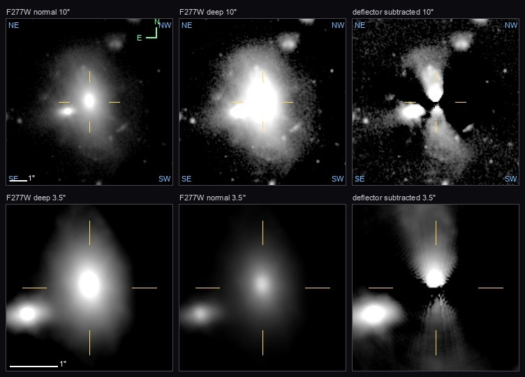{ width="100%" }](img/rank-023-orig.jpg){ target=_blank }
  <figcaption>What the judge saw (blind, footer removed)</figcaption>
</figure>

<figure markdown="span">
  [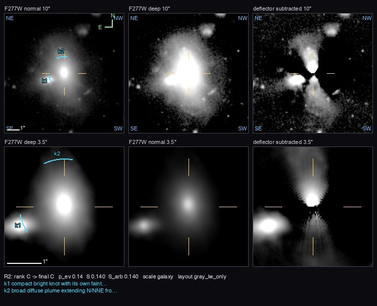{ width="100%" }](img/rank-023-annot.jpg){ target=_blank }
  <figcaption>Advocate evidence (cyan) and critic alternatives coloured by the arbitrator ruling</figcaption>
</figure>

???+ note "Why this grade — advocate, critics, arbitrator"
    **Letter C** (deployed, rule R2) · p_evidence 0.14 · S_arb 0.14 · S 0.14 · scale galaxy

    Letter: letter_rank stands (D rule not met); p_evidence 0.14 < t_B 0.17 (calibrated at 5% FPR on clean negatives); not D: 2 item(s) located; no named critic covers every item at r >= 0.80.

    **Advocate**

    - criteria: source_contrast 3, low_surface_brightness 6, curvature 1, counter_image 1, arc_morphology 1
    - items (2):
        - k1 — “compact bright knot with its own faint envelope, ~1.3" ESE of the ticked galaxy; distinct from the smooth deflector profile in (d)/(e) and surviving as a discrete positive residual in (c)/(f); no tangential elongation, weak inward extension toward the core” (panel d, r 1.3 arcsec, PA 100->125, visible in direct: yes; criteria: source_contrast, low_surface_brightness)
        - k2 — “broad diffuse plume extending N/NNE from the core, traceable from ~0.6" out to ~2" in the deep panels (b)/(d) and dominating the northern residual in (f); fan-shaped, widening with radius, attached to the nucleus, radially not tangentially oriented” (panel d, r 1.4 arcsec, PA 350->25, visible in direct: yes; criteria: low_surface_brightness)
    - scale galaxy; red neighbours within 10 arcsec 4; BCG-like halo yes; deflector is centre yes
    - p_evidence: 0.14
    - notes: “Explicit search at PA ~290°, r = 0.8-1.8" (opposite the ESE knot) in (d), (e) and (f) finds no counter-knot - only the smooth WNW isophotes and the vertical ringing of the circular subtraction - and the only other feature, the northern plume, is radial and attached to the nucleus rather than tangential at fixed radius, so the located set is a compact neighbour plus a one-sided diffuse extension.”

    **Critics**

    - not called (p_evidence 0.14 < tau0 0.15)

    **Arbitrator**

    - no arbitrator record (not called)

    **Score**

    - S = p_ev = 0.14 (no critic term entered the product)
    - S_arb = p_ev = 0.14 (no critic term entered the product)
    - stored grade_pred (on S): C — S 0.14 < t_B 0.17 (calibrated at 5% FPR on clean negatives); not D: 2 item(s) located; no named critic covers every item at r >= 0.80
    - stored letter_arb (on S_arb): C; letter_source: opus5_api_calibrated
    - deploy rule R2: letter_rank (advocate only, on p_evidence) = C — p_evidence 0.14 < t_B 0.17 (calibrated at 5% FPR on clean negatives); not D: 2 item(s) located; no named critic covers every item at r >= 0.80
    - deploy rule R2: letter_final = C — letter_rank stands (D rule not met); p_evidence 0.14 < t_B 0.17 (calibrated at 5% FPR on clean negatives); not D: 2 item(s) located; no named critic covers every item at r >= 0.80
    - veto: none (letter_final == letter_rank)

---

## Rank 24: J6439169-1191885 {#rank-24}

| Original grade | Passes | Inspector conf. | Pipeline θ_E |
|:--:|:--:|:--:|:--:|
| **U** | — | 28 | 2.80″ |

| New (final) | Rank letter | p_ev | S_arb | Demoted by | Arb. letter | Needs human |
|:--:|:--:|--:|--:|:--|:--:|:--:|
| **D** | C | 0.15 | 0.009 | merger (Mor) | D | no |

<small>pipeline discovery status `new` · scale class `galaxy`</small>

<figure markdown="span">
  [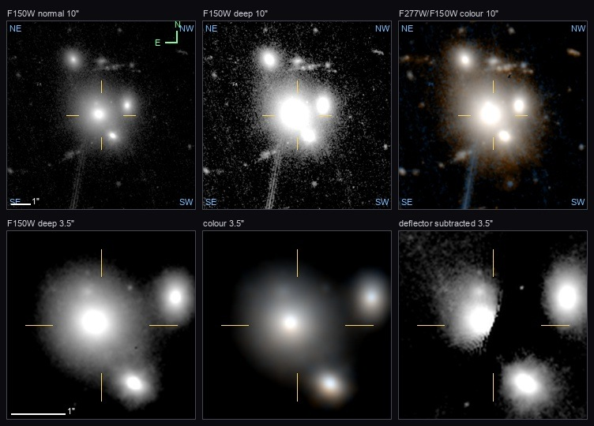{ width="100%" }](img/rank-024-orig.jpg){ target=_blank }
  <figcaption>What the judge saw (blind, footer removed)</figcaption>
</figure>

<figure markdown="span">
  [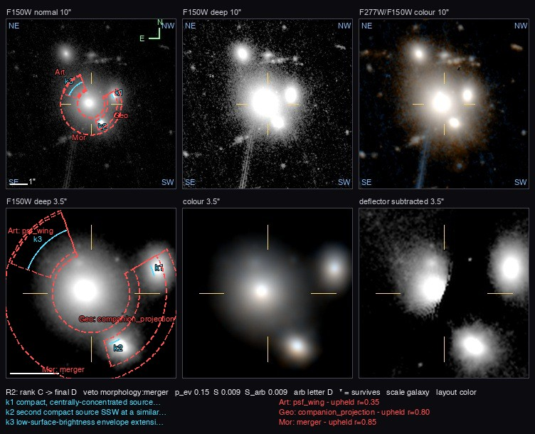{ width="100%" }](img/rank-024-annot.jpg){ target=_blank }
  <figcaption>Advocate evidence (cyan) and critic alternatives coloured by the arbitrator ruling</figcaption>
</figure>

???+ note "Why this grade — advocate, critics, arbitrator"
    **Letter D** (deployed, rule R2) · p_evidence 0.15 · S_arb 0.009 · S 0.009 · scale galaxy

    Letter: D rule: morphology (merger) covers every item (a = 1) at r 0.85 >= 0.80 (upheld).

    **Advocate**

    - criteria: source_contrast 4, low_surface_brightness 2, curvature 1, counter_image 2, arc_morphology 1
    - items (3):
        - k1 — “compact, centrally-concentrated source WNW of the ticked galaxy, embedded in its outer envelope; bluer/whiter than the orange deflector in (c)/(e) and clearly resolved (small core + halo) rather than arc-like” (panel d, r 1.35 arcsec, PA 285->295, visible in direct: yes; criteria: source_contrast)
        - k2 — “second compact source SSW at a similar radius (radii agree to ~20%), also with its own concentrated core; slight blue/orange colour split across it in (e)” (panel d, r 1.12 arcsec, PA 200->212, visible in direct: yes; criteria: source_contrast)
        - k3 — “low-surface-brightness envelope extension of the deflector toward the NE, reaching ~1.5"; diffuse, no fixed radius, no tangential edge” (panel d, r 1.4 arcsec, PA 20->70, visible in direct: yes; criteria: low_surface_brightness)
    - scale galaxy; red neighbours within 10 arcsec 2; BCG-like halo yes; deflector is centre yes
    - p_evidence: 0.15
    - notes: “The only offset sources are two compact, core-plus-halo objects at r=1.35" (PA~290) and r=1.12" (PA~205) - similar radii but separated by only ~85 deg, so they fail the opposite-counter-image test, and at 0.031"/px neither shows any tangential elongation or curvature; the straight blue streak crossing the field from NW to SE in (a)/(b)/(c) is a spike/trail, not a lensed feature, and the dark bowtie/dipole in (f) is the stated circular-model artefact on this off-centre, blended core.”

    **Critics**

    **artifact — psf_wing:** “The diffuse NE 'envelope extension' in the 3.5" zoom is the outer halo/PSF wing of the bright compact neighbour that sits ~2.5-3" NE of the ticked galaxy (bright source in the upper-left of panels a, b, c), bleeding into the NE corner of the (d)/(e) cutout; it is diffuse, unbounded and has no fixed radius, exactly as a wing should be.”

    - location: r 0.9-1.75 arcsec, PA 20->70
    - accounts for: k3; leaves standing: k1, k2; strength r 0.35; coverage a 0.333 (geometric)
    - scale_class: galaxy
    - measured: `{"bright_NE_neighbour_pa_deg": 42, "bright_NE_neighbour_r_arcsec": 2.6, "item1_core_FWHM_class": "resolved core+halo, not spike-like", "item2_core_FWHM_class": "resolved core+halo, not spike-like", "items_1_2_panels_present": "a,b,c,d,e (all direct)", "streak_length_arcsec": 4.5, "unrelated_linear_streak_pa_deg": 150}`
    - notes: “Items 1 (r=1.35", PA~290) and 2 (r=1.12", PA~206) are compact sources with resolved cores that appear identically in every un-subtracted panel (a,b,c,d,e) and in (f) as offset positive blobs - they are not diffraction spikes (no straight fixed-angle rays), not snowballs/persistence, and not subtraction residuals; the only straight instrumental-looking feature in the field is the thin streak running SE at PA~150 out to ~4.5" in (a)/(b), which touches none of the items. The NE diffuse light of item 3 lies on the direct line to the bright neighbour at ~2.6", PA~42 seen in (a)/(b)/(c), so a PSF/halo wing is a reasonable but not proven origin.”
    - ruling: upheld, covers k3 — “The NE diffuse light in (d)/(e) lies exactly along the line to the bright compact neighbour ~2.6" at PA~42 seen in (a)/(b)/(c) and fades outward with no edge or fixed radius, consistent with blended halo/PSF wing light rather than any tangential feature.”

    **geometry — companion_projection:** “Two ordinary compact companion galaxies superposed on the deflector's outer envelope: each shows its own bright, centrally-concentrated nucleus plus a round halo, neither is tangentially stretched, they sit at different radii and are not opposed in position angle, so they are neighbours in a compact interacting group rather than two images of one background source.”

    - location: r 1-1.55 arcsec, PA 195->300
    - accounts for: k1, k2; leaves standing: k3; strength r 0.80; coverage a 0.667 (geometric)
    - scale_class: galaxy
    - measured: `{"counter_image_at_pa_110_or_26": "none detectable at r=1.0-1.5\" in (b) or (d)", "curvature_centre_offset_arcsec": "not measurable - neither feature is curved", "delta_pa_deg": 84, "expected_delta_pa_for_two_image_lens_deg": 180, "pa_item1_deg": 290, "pa_item2_deg": 206, "r_item1_arcsec": 1.35, "r_item2_arcsec": 1.12, "radius_ratio": 1.21, "surface_brightness_profile_match": "both are cuspy core+halo like small galaxies; profiles differ from each other (item 2 brighter, more compact core) and neither is an extended low-contrast arc", "tangential_axis_ratio_item1": "~1.1 (round, no tangential elongation; major axis if any runs radially)", "tangential_axis_ratio_item2": "~1.2, elongated NE-SW i.e. roughly radial, not tangential"}`
    - notes: “In panel (d) the WNW source at r=1.35", PA~290, and the SW source at r=1.12", PA~206, each resolve into a bright point-like nucleus wrapped in a round halo (the SW one is the brightest core in the field after the deflector), with no tangential arc-like stretch at either position; their position angles differ by only ~84°, not the ~180° required for a two-image system, and their radii differ by ~20% with no third or fourth image at the complementary angles in the 10" panel (b). The NE envelope extension (item 3) is diffuse with no fixed radius and I leave its interpretation to the morphology critic.”
    - ruling: upheld, covers k1, k2 — “In panel (d) both offset sources resolve into peaked nuclei inside round-to-radially-elongated halos at r=1.35" (PA~290) and r=1.12" (PA~206) — only ~84° apart, not the ~180° a two-image system requires, and neither shows tangential stretch at 0.031"/px.”

    **morphology — merger:** “An interacting/merging system: the ticked galaxy shares a common low-surface-brightness envelope with two ordinary companion galaxies, each of which has its own concentrated nucleus and its own ellipticity/orientation, plus tidal envelope light to the NE - not lensed images of one source.”

    - location: r 0.8-1.8 arcsec, PA 20->300
    - accounts for: k1, k2, k3; leaves standing: none; strength r 0.85; coverage a 1.00 (geometric)
    - scale_class: galaxy
    - measured: `{"axis_ratio_of_the_pair": "surface brightnesses and sizes differ by >2x; PA separation ~85 deg, not the ~180 deg of a fold/counter-image pair", "companion_SSW": "r~1.1-1.2\", PA~205; resolved elliptical, major axis ~0.45\" oriented ~E-W (i.e. roughly RADIAL/oblique, not tangential), own bright core", "companion_WNW": "r~1.3-1.4\", PA~290; resolved elliptical, major axis ~0.5\" oriented ~NE-SW, bright compact core + halo, no tangential elongation about the deflector", "envelope": "diffuse light continuous from the deflector core out past 1.5\" toward PA 20-70 with no outer edge and no fixed radius; in (c) the same envelope wraps all three galaxies over the 10\" field", "tangential_arc_length": "none: neither source shows curvature or an arc-like axis ratio at JWST resolution (each is core-dominated)"}`
    - notes: “In (d) the WNW object (right, slightly up, r~1.35") and the SSW object (lower right, r~1.12") both resolve into small ellipticals with peaked nuclei and elliptical isophotes whose major axes are not tangential to the deflector; in (e) the WNW one even shows its own blue nucleus offset within its halo. The NE 'extension' (item 3) is the common envelope of this trio, traceable continuously in (c) out to several arcsec with no outer edge - classic interacting-group light, not an arc.”
    - ruling: upheld, covers k1, k2, k3 — “The 10" deep and colour panels show one continuous low-surface-brightness envelope wrapping the ticked galaxy and both companions, whose nuclei, sizes and surface brightnesses differ by more than 2×, i.e. an interacting trio and its tidal light, not multiple images of one source.”

    **Arbitrator**

    - surviving items: none (0 of 3)
    - letter_llm: D; scale_class_final: galaxy; needs_human: no
    - rationale: “Nothing survives. The two offset objects the scorer flagged (item 1 at r≈1.35", PA≈290; item 2 at r≈1.12", PA≈206) are unambiguously resolved in the 3.5" deep panel (d) as small galaxies with bright, centrally peaked nuclei wrapped in round/elliptical halos — the SSW one is the second-brightest core in the field — and their isophotal major axes run radially or obliquely, never tangentially about the ticked deflector; at JWST sampling an arc would have to show tangential curvature and an extended low-contrast ridge, and neither does. Their position angles differ by only ~84°, radii by ~20%, and the 10" deep panel (b) shows no counter-image at the complementary angles, so the geometry critic's companion_projection reading is upheld for both. The morphology critic's merger reading is upheld across all three items: panels (b) and (c) show a single diffuse envelope enclosing the trio with no outer edge, which also explains the NE 'extension' of item 3, as does the artifact critic's PSF-wing alternative pointing at the bright neighbour ~2.6" at PA≈42 — the two explanations overlap and both are non-lensing. The dark bowtie/dipole cutting across panel (f) is exactly the stated circular-model artefact on this off-centre, companion-blended core and carries no weight either way, and the thin straight streak at PA≈150 in (a)/(b) is instrumental/trail, touching none of the items. This is a compact interacting group, not a lens.”

    **Score**

    - S = p_ev x prod(1 - r_i a_i) = 0.15 x (1 - 0.35x0.333) x (1 - 0.80x0.667) x (1 - 0.85x1.00) = 0.009
        - terms: artifact psf_wing r 0.35 a 0.333; geometry companion_projection r 0.80 a 0.667; morphology merger r 0.85 a 1.00
    - S_arb = p_ev x prod_{upheld/partial}(1 - r_i a_i') = 0.15 x (1 - 0.35x0.333) x (1 - 0.80x0.667) x (1 - 0.85x1.00) = 0.009
        - terms: artifact psf_wing r 0.35 a 0.333 (upheld); geometry companion_projection r 0.80 a 0.667 (upheld); morphology merger r 0.85 a 1.00 (upheld)
    - stored grade_pred (on S): D — S 0.009 < t_B 0.17 (calibrated at 5% FPR on clean negatives) and morphology (merger) covers every item at r 0.85 >= 0.80
    - stored letter_arb (on S_arb): D; letter_source: opus5_api_calibrated
    - deploy rule R2: letter_rank (advocate only, on p_evidence) = C — p_evidence 0.15 < t_B 0.17 (calibrated at 5% FPR on clean negatives); not D: 3 item(s) located; no named critic covers every item at r >= 0.80
    - deploy rule R2: letter_final = D — D rule: morphology (merger) covers every item (a = 1) at r 0.85 >= 0.80 (upheld)
    - veto: morphology:merger

---

## Rank 25: J3996679-159719 {#rank-25}

| Original grade | Passes | Inspector conf. | Pipeline θ_E |
|:--:|:--:|:--:|:--:|
| **U** | — | 28 | 1.60″ |

| New (final) | Rank letter | p_ev | S_arb | Demoted by | Arb. letter | Needs human |
|:--:|:--:|--:|--:|:--|:--:|:--:|
| **B** | B | 0.25 | 0.031 | — | D | no |

<small>pipeline discovery status `field_match` · scale class `none`</small>

<figure markdown="span">
  [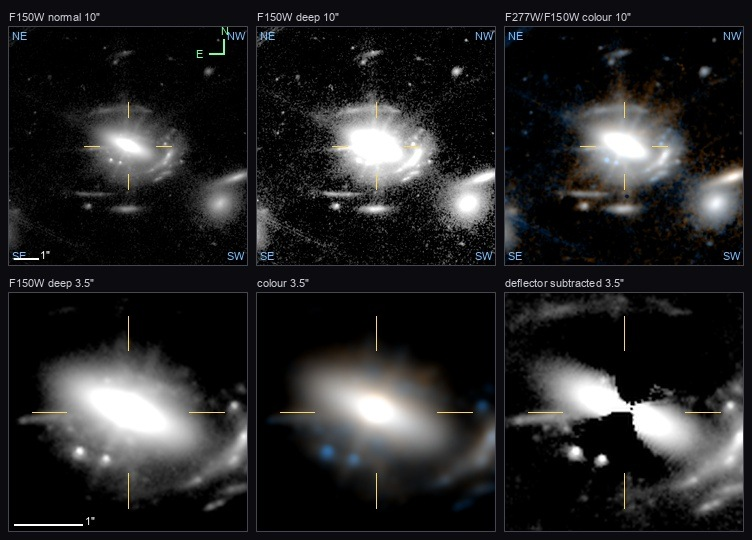{ width="100%" }](img/rank-025-orig.jpg){ target=_blank }
  <figcaption>What the judge saw (blind, footer removed)</figcaption>
</figure>

<figure markdown="span">
  [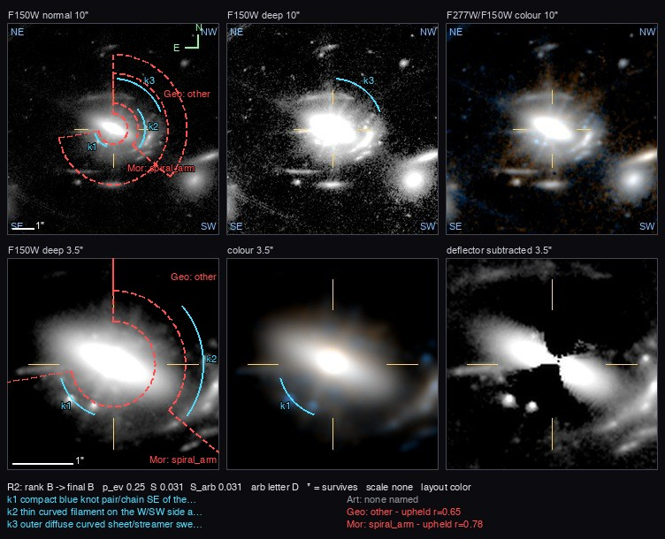{ width="100%" }](img/rank-025-annot.jpg){ target=_blank }
  <figcaption>Advocate evidence (cyan) and critic alternatives coloured by the arbitrator ruling</figcaption>
</figure>

???+ note "Why this grade — advocate, critics, arbitrator"
    **Letter B** (deployed, rule R2) · p_evidence 0.25 · S_arb 0.031 · S 0.031 · scale none

    Letter: letter_rank stands (D rule not met); p_evidence 0.25 >= t_A 0.20 (calibrated at 1% FPR on clean negatives) but A is blocked: only 0 of 3 configuration criteria >= 6; p_evidence 0.25 >= t_B 0.17 (calibrated at 5% FPR on clean negatives).

    **Advocate**

    - criteria: source_contrast 6, low_surface_brightness 6, curvature 4, counter_image 2, arc_morphology 4
    - items (3):
        - k1 — “compact blue knot pair/chain SE of the nucleus, clearly bluer than the orange deflector in (e) and (c), resolved and slightly extended in the deep zoom (d)” (panel e, r 0.9 arcsec, PA 105->160, visible in direct: yes; criteria: source_contrast, low_surface_brightness)
        - k2 — “thin curved filament on the W/SW side at roughly constant radius, concave toward the galaxy, traceable in (a), (d) and as an offset bright ridge in (f)” (panel d, r 1.5 arcsec, PA 235->310, visible in direct: yes; criteria: low_surface_brightness, curvature, arc_morphology)
        - k3 — “outer diffuse curved sheet/streamer sweeping from N through W and down toward the SW neighbour, low surface brightness, only in the 10" deep stretch” (panel b, r 2.4 arcsec, PA 290->355, visible in direct: yes; criteria: low_surface_brightness)
    - scale galaxy; red neighbours within 10 arcsec 2; BCG-like halo yes; deflector is centre yes; arc radius 1.5 arcsec; arc PA span 235->310; centre-of-curvature offset 0.8 arcsec
    - p_evidence: 0.25
    - notes: “The strongest located features are a blue knot chain ~0.9" SE and a curved W/SW filament at ~1.5" whose concavity points near (but ~0.8" off) the nucleus; in (d) and (f) that filament appears to run continuously into the inclined stellar body and no opposite-side counter-image of the blue knots is visible at a matching radius, so a spiral-arm / star-forming-clump reading is open for the critics to test.”

    **Critics**

    **artifact — no alternative named (nothing in its competence fits)**

    - leaves standing: k1, k2, k3
    - scale_class: galaxy
    - measured: `{"bright_neighbour_psf_wing": "SW companion at r~3.5-4\" PA~215-230 is faint and un-saturated; its wings do not reach the r=1.5\" PA 235-310 ridge, which curves rather than radiating from the neighbour", "diffraction_spikes_detected": "none: no straight rays at fixed PA from the saturated core in (a) or (b); the only straight lines are the yellow tick marks at PA 0/90/180/270", "items_visible_in_direct": "3 of 3 (1 in d/e, 2 in a/d, 3 in b) - subtraction_residual inadmissible for all", "snowball_persistence_count": "0 - the compact sources at r~1.0-1.3\" PA~110-160 in (d) are resolved, non-circular, and appear in both bands of (e)", "striping_or_seams": "no 1/f row/column striping, no mosaic seam or coverage edge crossing the 10\" field"}`
    - notes: “Panel (f)'s black four-lobed bowtie and inner dipole are exactly the circular-profile artefact the VIEW describes and I score them as nothing; the item-2 ridge at r~1.5" PA 235-310 sits OUTSIDE that lobe pattern and is independently visible in (a) and (d), so it is sky, not reduction. I find no spike, snowball, stripe, seam or PSF wing that could manufacture any of items 1-3; their true nature (host disc/arm versus arc) is host morphology and outside my competence.”
    - ruling: overruled — “The artifact critic named no alternative and explicitly leaves all three items standing, correctly noting the panel-(f) bowtie/dipole is the circular-profile artefact and that no spike, snowball, stripe or PSF wing touches the r~1.5" W/SW ridge.”

    **geometry — other:** “Non-concentric interaction/streamer geometry: items 2 and 3 are one continuous structure whose radius grows monotonically with position angle (~1.3" at PA 240 to ~2.4" at PA 300 to >3" at PA 340) and which runs off the 3.5" zoom toward the bright SW neighbour in (b); its centre of curvature is displaced ~1.5-2" SW of the ticked nucleus and it has no counter-arc, so it is not a fixed-radius tangential image pair about the deflector.”

    - location: r 1.2-3.5 arcsec, PA 230->360
    - accounts for: k2, k3; leaves standing: k1; strength r 0.65; coverage a 0.667 (geometric)
    - scale_class: galaxy
    - measured: `{"counter_arc_search": "no tangential ridge found at r=1.3-1.7\", PA 55-130 in (d) or (b); envelope there is smooth", "counter_image_for_item1": "nothing compact at r=0.9-1.1\", PA 295-330 in (d)/(e)", "curvature_centre_offset_arcsec": 1.7, "item1_chain_axis_PA": 95, "item1_radial_PA": 129, "item1_tangential_PA": 39, "profile_consistency": "item1 = 3 compact ~0.1\" blue knots; item2 = smooth low-contrast diffuse ridge - inconsistent as images of one source", "radius_vs_PA_item2_item3": "1.3\" @PA240 -> 1.8\" @PA275 -> 2.4\" @PA300 -> >3\" @PA340 (monotonic, not constant)"}`
    - notes: “In (d) the W/SW ridge (r~1.5", PA 235-310) does not close at fixed radius: it drifts outward with angle and joins the diffuse sheet of item 3, which in (b) continues past the frame toward the bright SW neighbour ~4" away, so its curvature centre sits SW of the tick centre rather than on it. The SE knot chain (item 1, r~1.0", PA~129) is aligned within ~35 deg of the radius vector, not tangentially, and has no compact counterpart at PA~309.”
    - ruling: upheld, covers k2, k3 — “In (b) and (d) the W/SW ridge does drift outward with angle (~1.2" near PA 320 to >2.3" near PA 235) and continues as the diffuse sheet toward the bright SW neighbour, with no matching tangential ridge at r~1.3-1.7" on the E side, so it is not a fixed-radius image pair about the ticked nucleus.”

    **morphology — spiral_arm:** “The ticked object is not a smooth red early-type but an inclined barred/lenticular disc: panel (d) shows a bright lens-shaped bar-like core (major axis PA~65-70) inside a diffuse disc, with a two-armed, 180-deg-rotationally-symmetric arm pattern - a western arm sweeping from NNW round through W to SW and continuing out to the SW neighbour, and its counterpart running out to the E. The 'filament' and the 'outer sheet' are the western arm at increasing radius; the blue knots are HII/star-forming clumps on the inner disc/bar end.”

    - location: r 0.7-2.6 arcsec, PA 100->360
    - accounts for: k1, k2, k3; leaves standing: none; strength r 0.78; coverage a 1.00 (geometric)
    - scale_class: galaxy
    - measured: `{"bridge_test": "in (d) the ridge is joined to the disc envelope by continuous, un-broken surface brightness from r~0.8\" outward on the W and NW side - no dark gap between host and 'arc'", "counter_feature": "a symmetric E-side extension at r ~1.5-1.8\", PA ~85-105 in (d)/(e) with the same diffuse profile - the opposing arm, not a counter-image (it is not tangential and lies at a different radius)", "host_core_axis_ratio_and_PA": "bright inner isophotes clearly elongated, b/a ~0.45, major axis PA ~65-70 deg (ENE-WSW) in (d) - a bar/inclined disc, not a round deVaucouleurs deflector", "knot_positions": "3 compact knots at r ~0.6\", 0.8\", 1.0\", PA ~115, 135, 150 in (d), forming a chain that runs radially outward along the disc, not a tangential arc at fixed radius", "western_ridge_radius_vs_angle": "r ~1.15-1.25\" at PA ~320, ~1.5\" at PA ~280, ~1.9\" at PA ~250, >2.3\" at PA ~230 and continuing off toward the SW companion: radius grows monotonically as the angle decreases, i.e. a logarithmic-spiral trend, not constant radius"}`
    - notes: “In the 3.5" deep panel the W/SW 'filament' (item 2) is continuous with the disc light and its radius climbs from ~1.2" at PA 320 to >2.3" at PA 235, where it merges into the diffuse sheet of item 3 and runs on to the SW galaxy - a spiral/tidal arm trend, not a fixed-radius tangential arc; the SE blue knots (item 1) sit in a radial chain at PA 115-150 inside the same disc, with a matching arm extension on the opposite (E) side.”
    - ruling: upheld, covers k1, k2, k3 — “Panel (d) shows a lens-shaped bar/inclined-disc core (b/a~0.45, PA~65-70) with un-broken surface brightness joining the 'filament' to the disc envelope from r~0.8" outward and a mirrored arm extension on the E side, while the SE blue knots in (e) lie in a radial chain at PA 115-150 inside that same disc - arms and HII clumps, not arcs.”

    **Arbitrator**

    - surviving items: none (0 of 3)
    - letter_llm: D; scale_class_final: none; needs_human: no
    - rationale: “The ticked object is plainly an inclined, bar-dominated disc: in the 3.5" deep panel (d) the inner isophotes are strongly elongated ENE-WSW with a lens/bar-shaped core, and the light does not stop - it runs continuously outward into a two-armed pattern whose western arm sweeps from NNW through W to SW with monotonically growing radius (~1.2" at PA 320, ~1.5" at PA 280, >2.3" at PA 235) before merging with the diffuse 10" sheet in (b) that reaches toward the SW companion; there is no dark gap between host and 'arc', which is exactly what an Einstein arc requires and a spiral/tidal arm forbids. The SE 'knot chain' in (e) sits at PA 115-150 running radially outward at r~0.6-1.0", i.e. along the disc rather than tangentially, with no compact counterpart at the antipodal PA~309 - the classic signature of star-forming clumps on an inner arm/bar end, and the blue hue alone carries no weight here. Panel (f)'s black four-lobed bowtie and inner dipole are precisely the artefacts a circular azimuthally-averaged model leaves on an elliptical, barred host and were correctly scored as nothing. Both critics who named an alternative are upheld and the morphology reading accounts for every located item, leaving nothing standing; no deeper data is needed to settle this.”

    **Score**

    - S = p_ev x prod(1 - r_i a_i) = 0.25 x (1 - 0.65x0.667) x (1 - 0.78x1.00) = 0.031
        - terms: geometry other r 0.65 a 0.667; morphology spiral_arm r 0.78 a 1.00
    - S_arb = p_ev x prod_{upheld/partial}(1 - r_i a_i') = 0.25 x (1 - 0.65x0.667) x (1 - 0.78x1.00) = 0.031
        - terms: geometry other r 0.65 a 0.667 (upheld); morphology spiral_arm r 0.78 a 1.00 (upheld)
    - stored grade_pred (on S): C — S 0.031 < t_B 0.17 (calibrated at 5% FPR on clean negatives); not D: 3 item(s) located; no named critic covers every item at r >= 0.80
    - stored letter_arb (on S_arb): C; letter_source: opus5_api_calibrated
    - deploy rule R2: letter_rank (advocate only, on p_evidence) = B — p_evidence 0.25 >= t_A 0.20 (calibrated at 1% FPR on clean negatives) but A is blocked: only 0 of 3 configuration criteria >= 6; p_evidence 0.25 >= t_B 0.17 (calibrated at 5% FPR on clean negatives)
    - deploy rule R2: letter_final = B — letter_rank stands (D rule not met); p_evidence 0.25 >= t_A 0.20 (calibrated at 1% FPR on clean negatives) but A is blocked: only 0 of 3 configuration criteria >= 6; p_evidence 0.25 >= t_B 0.17 (calibrated at 5% FPR on clean negatives)
    - veto: none (letter_final == letter_rank)

---

[:material-view-list: Overview](index.md){ .md-button }
[Ranks 26–50 :material-arrow-right:](ranks-026-050.md){ .md-button }
