# JWST Top-100 regrade: ranks 26–50

Candidates 26–50 by original pipeline rank, each with the composite the judge saw, the
annotated composite and the full grading record. Legend, thresholds and the summary tables are on
the [overview](index.md). Click an image to open it full size.

Pages: [Ranks 1–25](ranks-001-025.md) · **Ranks 26–50** · [Ranks 51–75](ranks-051-075.md) · [Ranks 76–100](ranks-076-100.md).

---

## Rank 26: J357850-3044809 {#rank-26}

| Original grade | Passes | Inspector conf. | Pipeline θ_E |
|:--:|:--:|:--:|:--:|
| **U** | — | 28 | 2.45″ |

| New (final) | Rank letter | p_ev | S_arb | Demoted by | Arb. letter | Needs human |
|:--:|:--:|--:|--:|:--|:--:|:--:|
| **B** | B | 0.27 | 0.059 | — | D | no |

<small>pipeline discovery status `new` · scale class `none`</small>

<figure markdown="span">
  [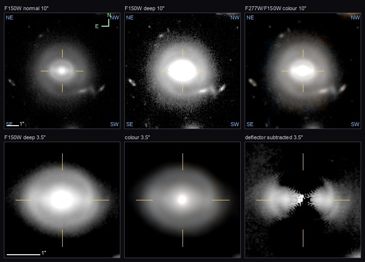{ width="100%" }](img/rank-026-orig.jpg){ target=_blank }
  <figcaption>What the judge saw (blind, footer removed)</figcaption>
</figure>

<figure markdown="span">
  [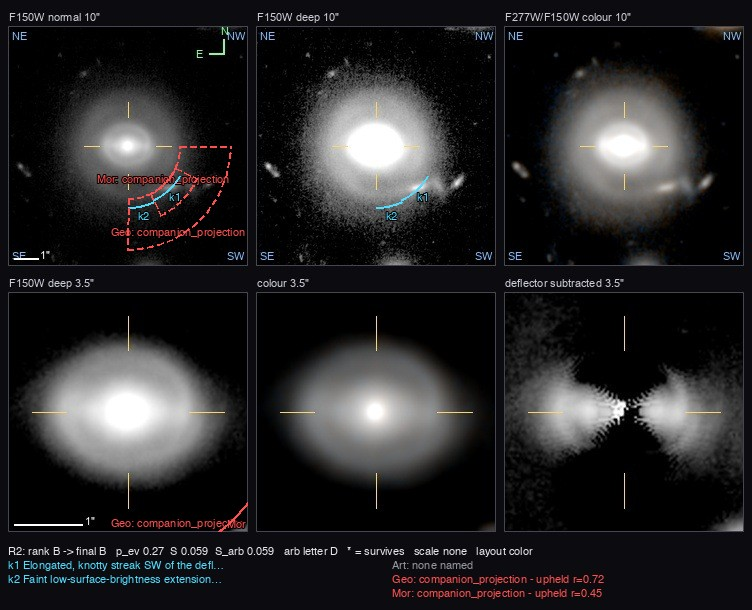{ width="100%" }](img/rank-026-annot.jpg){ target=_blank }
  <figcaption>Advocate evidence (cyan) and critic alternatives coloured by the arbitrator ruling</figcaption>
</figure>

???+ note "Why this grade — advocate, critics, arbitrator"
    **Letter B** (deployed, rule R2) · p_evidence 0.27 · S_arb 0.059 · S 0.059 · scale none

    Letter: letter_rank stands (D rule not met); p_evidence 0.27 >= t_A 0.20 (calibrated at 1% FPR on clean negatives) but A is blocked: only 0 of 3 configuration criteria >= 6; p_evidence 0.27 >= t_B 0.17 (calibrated at 5% FPR on clean negatives).

    **Advocate**

    - criteria: source_contrast 5, low_surface_brightness 5, curvature 3, counter_image 1, arc_morphology 4
    - items (2):
        - k1 — “Elongated, knotty streak SW of the deflector at fixed radius ~2.5", oriented roughly perpendicular to its radius vector (tangential); brighter/bluer and much thinner in profile than the smooth deflector halo it sits on; traceable in the normal, deep and colour 10" panels” (panel b, r 2.5 arcsec, PA 205->240, visible in direct: yes; criteria: source_contrast, low_surface_brightness, arc_morphology)
        - k2 — “Faint low-surface-brightness extension continuing east from the streak beneath the galaxy at a similar radius (~2.4-2.8"), visible only in the deep stretch as a slight brightening of the envelope” (panel b, r 2.6 arcsec, PA 180->205, visible in direct: yes; criteria: low_surface_brightness)
    - scale group; red neighbours within 10 arcsec 1; BCG-like halo yes; deflector is centre yes; arc radius 2.5 arcsec; arc PA span 205->240; centre-of-curvature offset 1.8 arcsec
    - p_evidence: 0.27
    - notes: “Only one real candidate: the bright knotty streak ~2.5" SW (PA~222) in (a)/(b)/(c), tangentially oriented but thick and edge-on-disc-like with only weak concavity (centre of curvature ~1.8" off the ticked nucleus); no counter-feature is seen at the mirrored position PA~42, r~2.0-3.5" in the deep panel, the NE galaxy at ~4.3" is too far out in radius to serve as one, and (f) shows only the E-W butterfly/bowtie expected from a circular model on this obviously E-W elongated galaxy, so it is uninformative inside ~1.75".”

    **Critics**

    **artifact — no alternative named (nothing in its competence fits)**

    - leaves standing: k1, k2
    - measured: `{"bright_star_search": "no saturated star or bleed trail within the 10\" field; brightest source is the ticked galaxy core, which shows no spike pattern in (a)/(b)", "straightness_test": "feature is knotty and gently curved, not a straight ray of fixed position angle emanating from the core; no counterpart spikes at the other 5 canonical NIRCam spike angles", "streak_position_in_direct_panels": "present at r~2.4-2.7\", PA~205-245 in (a) normal, (b) deep and (c) colour - not confined to the subtracted panel", "striping/seam_check": "no row/column striping, no rectangular coverage edge or mosaic seam crossing the SW quadrant", "subtracted_panel_pattern": "(f) shows only the E-W four-lobed bowtie plus central pixelated dipole about the stamp centre, i.e. the circular-profile artefact; nothing at PA 205-245 is uniquely from (f)"}`
    - notes: “The SW feature (r~2.5", PA~205-245, bottom-right of the ticks) reproduces identically in the un-subtracted panels (a), (b) and (c) with the same knotty two-band appearance, so it is sky, not persistence, snowball, striping or a seam; it is curved and off-radial, ruling out a diffraction spike, and there is no bright neighbour whose PSF wing could reach it. The E-W lobes in (f) are the circular-model bowtie and I do not count them either way.”
    - ruling: no ruling for this critic

    **geometry — companion_projection:** “A small, elongated (near edge-on) neighbouring galaxy projected ~2.5-2.8" SW of the elliptical, with a second compact companion of similar brightness ~4" further west along nearly the same line - an unrelated pair in a busy field, not a tangential image pair about the deflector”

    - location: r 2.2-4.3 arcsec, PA 180->270
    - accounts for: k1, k2; leaves standing: none; strength r 0.72; coverage a 1.00 (geometric)
    - scale_class: galaxy
    - measured: `{"centre_of_curvature_offset_arcsec": "undefined (no curvature)", "counter_image_at_compatible_radius": "absent - the NE quadrant of panel (b) at r=2.3-3.0\", PA 30-70 shows only smooth, featureless halo", "curvature_about_deflector": "none detectable; the streak is straight over its ~1.2\" length in panel (b)", "feature_pa_deg": 228, "feature_radius_arcsec": 2.7, "major_axis_pa_of_streak_deg": "~95/275 (near E-W), i.e. ~45 deg away from the tangential direction PA 138/318 at that position", "second_object": "compact source at r~4.0\", PA~262 of comparable surface brightness, i.e. two sources at different radii on the SAME side rather than opposite sides"}`
    - notes: “In panel (b) the SW feature sits at ~2.7", PA~228 as a straight, knotty needle whose long axis runs roughly E-W, ~45 deg off the tangential direction there, and a second similar compact object lies at ~4.0", PA~262 on the same side; the mirror position (r~2.5", PA~48, NE quadrant) is a smooth halo with no counter-arc, so the pair reads as unrelated projected neighbours rather than images of one source. Item 2's faint eastward brightening at PA 180-205 is contiguous with the SW object's low-surface-brightness outskirts on the host envelope and shows no independent arc structure.”
    - ruling: upheld, covers k1, k2 — “In panels (a)/(b)/(c) the SW feature at r~2.5-2.7", PA~225 is a straight, knotty needle whose long axis runs nearly E-W (~40 deg off the local tangent PA~140/320), a second comparable sliver sits farther out at r~4", PA~255 on the SAME side, and the mirror position (r~2.5", PA~45, NE) in the deep panel is smooth featureless halo; item 2's faint eastward brightening is contiguous with the needle's low-surface-brightness outskirts, not an independent arc.”

    **morphology — companion_projection:** “A small, compact, knotty companion/edge-on dwarf superposed on the SW outer envelope of the host: a distinct ~1.0" x 0.3" object of the same brightness class as the other small field galaxies at the panel edges, whose long axis lies well off the tangential direction and which has no counter-feature on the opposite side of the nucleus”

    - location: r 2.2-3.2 arcsec, PA 205->245
    - accounts for: k1; leaves standing: k2; strength r 0.45; coverage a 0.50 (geometric)
    - scale_class: group
    - measured: `{"counter_image_check_PA_25_65_r_2.5-3.0": "no comparable knot or arc seen in panel (c)", "host_inner_structure_r<1.75arcsec": "panels (d) and (e) show a completely smooth, featureless almond-shaped envelope - no arms, knots, bar spurs or shells that could feed a stellar bridge out to 2.7\"", "streak_length_arcsec": "~1.0", "streak_long_axis_PA": "~75-100 deg (roughly E-W), i.e. ~30-45 deg away from the local tangential direction (142/322 deg)", "streak_radius_arcsec": "~2.7 (measured from tick centre in panel (c), 10\" field)", "streak_width_arcsec": "~0.3"}`
    - notes: “In panel (c) the SW feature at r~2.7", PA~232 is a compact knotty sliver whose long axis runs roughly E-W, tilted ~35 deg from the tangent at that position, and it lies just outside a much larger curved sliver at r~4" (PA~250-265) that is clearly a separate field object; the deep 3.5" zoom (d) shows the host to be perfectly smooth out to 1.75", so there is no arm, ring or shell continuing outward to it, and no counter-knot appears at PA~50 at the same radius.”
    - ruling: upheld, covers k1 — “The zoomed deep and colour panels (d)/(e) show a perfectly smooth almond envelope inside 1.75" with no arm, shell or bridge, and the SW object is a compact ~1.0"x0.3" knotty sliver of the same brightness class as the other small field galaxies at the frame edges, tilted ~35 deg from the tangent with no counter-knot at PA~50.”

    **Arbitrator**

    - surviving items: none (0 of 2)
    - letter_llm: D; scale_class_final: none; needs_human: no
    - rationale: “The only candidate features are the elongated sliver ~2.5" SW of the ticked nucleus (bottom-right of the ticks in panels a/b/c) and the faint eastward continuation of its envelope. Both critics who offered an alternative converge on companion_projection and the pixels back them: the sliver is straight over its ~1.2" length with its long axis running roughly E-W, i.e. some 35-45 deg away from the tangential direction at that azimuth, it is knotty and thick rather than a thin constant-radius band, and a second, larger curved sliver of comparable surface brightness lies farther out at r~4", PA~250-265 on the same side of the galaxy - two unrelated field objects at different radii, not a mirrored image pair. The mirror position (r~2.3-3.0", PA~30-70, NE quadrant of the deep 10" panel) shows only smooth halo, so no counter-image supports a lensing interpretation, and the 3.5" deep and colour zooms show the host to be a featureless E-W elongated envelope with no inner arc or ring. Panel (f) contributes nothing: its E-W four-lobed bowtie and central pixelated dipole are exactly the artefacts a circular azimuthally-averaged model leaves on an obviously elliptical galaxy, and the artifact critic confirmed the SW feature is present in every un-subtracted panel and shows no spike, stripe or seam signature. With both located items absorbed by an upheld projection alternative and nothing tangential surviving, this is graded D; no deeper data is needed to settle it.”

    **Score**

    - S = p_ev x prod(1 - r_i a_i) = 0.27 x (1 - 0.72x1.00) x (1 - 0.45x0.50) = 0.059
        - terms: geometry companion_projection r 0.72 a 1.00; morphology companion_projection r 0.45 a 0.50
    - S_arb = p_ev x prod_{upheld/partial}(1 - r_i a_i') = 0.27 x (1 - 0.72x1.00) x (1 - 0.45x0.50) = 0.059
        - terms: geometry companion_projection r 0.72 a 1.00 (upheld); morphology companion_projection r 0.45 a 0.50 (upheld)
    - stored grade_pred (on S): C — S 0.059 < t_B 0.17 (calibrated at 5% FPR on clean negatives); not D: 2 item(s) located; no named critic covers every item at r >= 0.80
    - stored letter_arb (on S_arb): C; letter_source: opus5_api_calibrated
    - deploy rule R2: letter_rank (advocate only, on p_evidence) = B — p_evidence 0.27 >= t_A 0.20 (calibrated at 1% FPR on clean negatives) but A is blocked: only 0 of 3 configuration criteria >= 6; p_evidence 0.27 >= t_B 0.17 (calibrated at 5% FPR on clean negatives)
    - deploy rule R2: letter_final = B — letter_rank stands (D rule not met); p_evidence 0.27 >= t_A 0.20 (calibrated at 1% FPR on clean negatives) but A is blocked: only 0 of 3 configuration criteria >= 6; p_evidence 0.27 >= t_B 0.17 (calibrated at 5% FPR on clean negatives)
    - veto: none (letter_final == letter_rank)

---

## Rank 27: J15032484+248405 {#rank-27}

| Original grade | Passes | Inspector conf. | Pipeline θ_E |
|:--:|:--:|:--:|:--:|
| **U** | — | 28 | 0.83″ |

| New (final) | Rank letter | p_ev | S_arb | Demoted by | Arb. letter | Needs human |
|:--:|:--:|--:|--:|:--|:--:|:--:|
| **B** | B | 0.20 | 0.011 | — | D | no |

<small>pipeline discovery status `new` · scale class `none`</small>

<figure markdown="span">
  [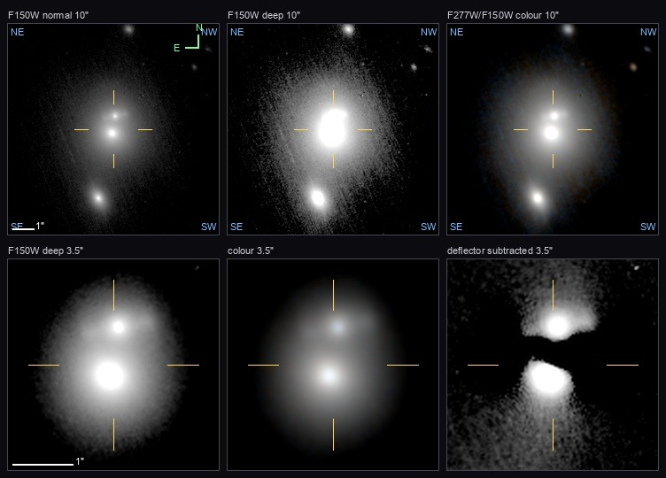{ width="100%" }](img/rank-027-orig.jpg){ target=_blank }
  <figcaption>What the judge saw (blind, footer removed)</figcaption>
</figure>

<figure markdown="span">
  [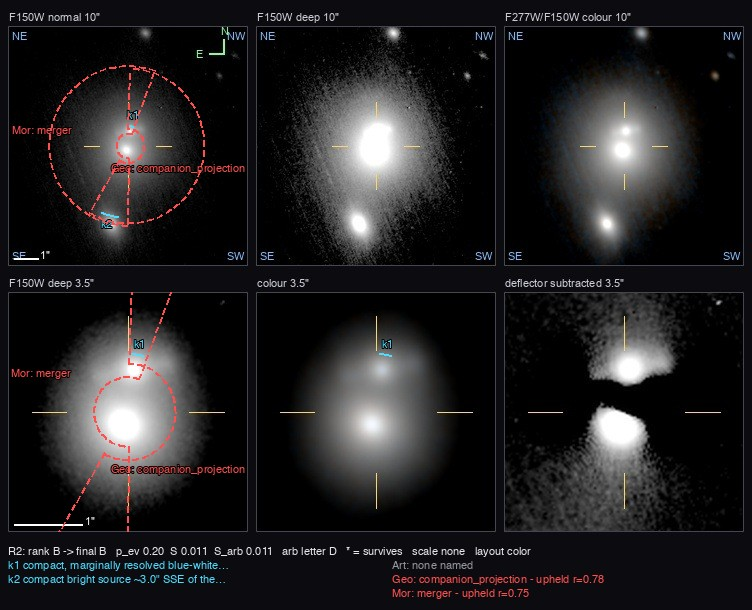{ width="100%" }](img/rank-027-annot.jpg){ target=_blank }
  <figcaption>Advocate evidence (cyan) and critic alternatives coloured by the arbitrator ruling</figcaption>
</figure>

???+ note "Why this grade — advocate, critics, arbitrator"
    **Letter B** (deployed, rule R2) · p_evidence 0.20 · S_arb 0.011 · S 0.011 · scale none

    Letter: letter_rank stands (D rule not met); p_evidence 0.20 >= t_A 0.20 (calibrated at 1% FPR on clean negatives) but A is blocked: only 0 of 3 configuration criteria >= 6; p_evidence 0.20 >= t_B 0.17 (calibrated at 5% FPR on clean negatives).

    **Advocate**

    - criteria: source_contrast 5, low_surface_brightness 3, curvature 0, counter_image 2, arc_morphology 0
    - items (2):
        - k1 — “compact, marginally resolved blue-white knot embedded in the deflector halo ~0.85" north (slightly west) of the ticked core; distinctly bluer than the yellow-white halo in (c)/(e) and left as a strong one-sided positive residual in (f) that is NOT mirrored across the nucleus” (panel e, r 0.85 arcsec, PA 344->356, visible in direct: yes; criteria: source_contrast, low_surface_brightness)
        - k2 — “compact bright source ~3.0" SSE of the deflector, roughly diametrically opposite item 1 in position angle and of similar bluish-white hue; shares the same extended N-S diffuse envelope seen in (b); radius mismatch with item 1 is a factor ~3.5, so it FAILS the 40% counter-image radius test” (panel a, r 3 arcsec, PA 158->172, visible in direct: yes; criteria: source_contrast, counter_image)
    - scale galaxy; red neighbours within 10 arcsec 2; BCG-like halo yes; deflector is centre yes
    - p_evidence: 0.20
    - notes: “The only inner feature is a single compact bluish knot 0.85" N of the ticked core (panels d/e, one-sided positive blob at the top of panel f with no mirrored partner at PA~170, r~0.85"); no tangential elongation, no curvature, and the only opposite-side source lies at 3.0" - too far out by a factor ~3.5 to pair with it - while panel (b) shows all three objects sharing one N-S diffuse envelope.”

    **Critics**

    **artifact — no alternative named (nothing in its competence fits)**

    - leaves standing: k1, k2
    - scale_class: galaxy
    - measured: `{"diffraction_spikes_counted": "0 - no straight rays at fixed angles from either the ticked core or the two knots in (a) or (b); no 6-spike pattern anywhere in the 10\" field", "item1_direct_detections": "compact knot at r~0.85\", PA~350 is present in (a), (b), (c), (d) and (e), not only in (f) - so it cannot be a subtraction residual", "item2_direct_detections": "bright compact source at r~3.0\", PA~165 present in (a), (b) and (c) with the same two-band flux ratio as other real sources", "panel_f_positive_lobes": "two lobes at PA~350 (r~0.85\") and PA~165 (inner, r~0.9-1.1\" in the zoom) that coincide with sources already seen in (d)/(e); the central bright lobe is the imperfectly removed off-centre core, an artefact of the 1-D circular model and not counted", "striping_seams_snowballs": "none - background in (b) is smooth apart from mild noise; no rectangular edges, no low-coverage wedge, no ring-and-core snowball morphology"}`
    - notes: “Both located knots are traceable in the un-subtracted panels ((d)/(e) for item 1 at PA~350, r~0.85"; (a)/(b)/(c) for item 2 at PA~165, r~3.0"), so neither can be a subtraction residual, and neither sits on a straight ray, a seam, a stripe or the wing of a saturated star - the field shows no spikes, snowballs or 1/f striping at all. Within the instrument/reduction competence I have no artefact explanation for either item; the strong central lobe in (f) is just the off-centre core left by the azimuthally-averaged model and I do not count it.”
    - ruling: no ruling for this critic

    **geometry — companion_projection:** “Two unrelated compact, round sources projected on the deflector's halo: a small PSF-like knot 0.85" N-NW of the core and a separate bright compact galaxy/star 3.0" SSE; neither is tangentially elongated and they sit at radii differing by a factor 3.5, so they cannot be images of one source.”

    - location: r 0.7-3.2 arcsec, PA 150->358
    - accounts for: k1, k2; leaves standing: none; strength r 0.78; coverage a 1.00 (geometric)
    - scale_class: galaxy
    - measured: `{"curvature_centre_offset_arcsec": "undefined - no curved feature exists in (b) or (d) to fit a centre to", "item1_counter_image_search": "no compact or extended feature at 0.6-1.1\" on the opposite side (PA 150-200) in (d); halo there is smooth", "item1_radius_arcsec": 0.85, "item1_shape": "circular, FWHM ~0.15-0.2\", axis ratio ~1.0, no tangential stretch in (d) or (e)", "item2_radius_arcsec": 3.0, "item2_shape": "round compact source with faint own halo in (b), axis ratio ~1.0, no arc curvature", "pa_separation_deg": 185, "radius_ratio_item2_over_item1": 3.5}`
    - notes: “In (d) the northern knot at r=0.85", PA~350 is a clean round PSF-like blob with no tangential elongation and no counterpart anywhere on the southern side of the nucleus at a comparable radius; the SSE source in (b) at r=3.0", PA~165 is a separate round galaxy with its own halo, 3.5x further out, so the pair is a chance projection rather than an image/counter-image pair.”
    - ruling: upheld, covers k1, k2 — “In (d)/(e) the 0.85" northern knot is a round, PSF-like blob with axis ratio ~1 and no tangential stretch, and the 3.0" SSE object in (a)/(b) is a separate round galaxy with its own halo 3.5x further out, so the two cannot be images of one source and are unrelated projections on the halo.”

    **morphology — merger:** “A multi-component system: the ticked galaxy's smooth N-S elongated envelope contains two additional compact stellar nuclei/companions strung along the same major axis - one at 0.85" N-NW and one at 3.0" SSE - i.e. an ongoing merger / common-envelope pair-plus-companion, not lensed images.”

    - location: r 0.5-3.3 arcsec, PA 340->180
    - accounts for: k1, k2; leaves standing: none; strength r 0.75; coverage a 1.00 (geometric)
    - scale_class: galaxy
    - measured: `{"alignment_test": "nucleus, knot 1 and source 2 lie within ~15 deg of the envelope major axis", "host_envelope_major_axis_pa_deg": "~5-10 (N-S), axis ratio ~0.75", "knot_1_apparent_diameter_arcsec": "~0.30 (round, axis ratio ~1.0 in panel d)", "knot_1_offset_arcsec": 0.85, "knot_1_pa_deg": 350, "knot_1_tangential_elongation": "none - no arc curvature, no azimuthal stretch at fixed radius", "source_2_morphology": "compact core plus small symmetric halo, i.e. a small galaxy, not an arc", "source_2_offset_arcsec": 3.0, "source_2_pa_deg": 165}`
    - notes: “In panel (d) the 0.85" companion at PA~350 is a round, PSF-like knot with a faint plume trailing E/NE into the host light - it shows no tangential elongation whatsoever, and the 3.0" SSE object in (c) is a resolved compact galaxy with its own halo, both embedded in the same N-S elongated diffuse envelope that runs from ~2" N to ~4" S. Three compact nuclei along the envelope's major axis is a merging/common-envelope system; neither feature is an arc at fixed radius, and there is no counter-image of either.”
    - ruling: upheld, covers k1, k2 — “Panel (b) shows a single N-S diffuse envelope running ~2" N to ~4" S that contains the ticked nucleus, the 0.85" PA~350 knot and the 3.0" PA~165 compact galaxy all within ~15 deg of the envelope's major axis - a common-envelope multi-nucleus system, not arcs at fixed radius.”

    **Arbitrator**

    - surviving items: none (0 of 2)
    - letter_llm: D; scale_class_final: none; needs_human: no
    - rationale: “The only two features located are compact and round, not tangential. In the 3.5" deep panel (d) the northern object at r~0.85", PA~350 is a clean, circular PSF-like knot with a faint plume bleeding E/NE into the host light; there is no azimuthal stretch, no curvature and the halo at the mirrored position (PA~170, r~0.85") is entirely smooth, so no counter-image exists. The bright source 3.0" SSE in (a)/(b)/(c) is a resolved compact galaxy with its own symmetric halo; its radius exceeds the northern knot's by a factor 3.5, far outside any plausible image/counter-image radius match, so the near-antipodal position angles are coincidental. Panel (b) further shows all three components sharing one N-S elongated diffuse envelope, consistent with a merging or common-envelope system rather than a deflector plus lensed images. The strong central and paired lobes in (f) are the imperfectly removed off-centre core of the 1-D circular model plus the two real sources already present in (d)/(e), and carry no independent weight. The artifact critic found no spikes, seams, snowballs or striping and offered no alternative, which leaves both items real but unlensed. With both located items accounted for by upheld companion-projection/merger explanations and no arc, curvature or matched counter-image anywhere in the field, this is not a lens; no reviewer input is needed to settle it.”

    **Score**

    - S = p_ev x prod(1 - r_i a_i) = 0.20 x (1 - 0.78x1.00) x (1 - 0.75x1.00) = 0.011
        - terms: geometry companion_projection r 0.78 a 1.00; morphology merger r 0.75 a 1.00
    - S_arb = p_ev x prod_{upheld/partial}(1 - r_i a_i') = 0.20 x (1 - 0.78x1.00) x (1 - 0.75x1.00) = 0.011
        - terms: geometry companion_projection r 0.78 a 1.00 (upheld); morphology merger r 0.75 a 1.00 (upheld)
    - stored grade_pred (on S): C — S 0.011 < t_B 0.17 (calibrated at 5% FPR on clean negatives); not D: 2 item(s) located; no named critic covers every item at r >= 0.80
    - stored letter_arb (on S_arb): C; letter_source: opus5_api_calibrated
    - deploy rule R2: letter_rank (advocate only, on p_evidence) = B — p_evidence 0.20 >= t_A 0.20 (calibrated at 1% FPR on clean negatives) but A is blocked: only 0 of 3 configuration criteria >= 6; p_evidence 0.20 >= t_B 0.17 (calibrated at 5% FPR on clean negatives)
    - deploy rule R2: letter_final = B — letter_rank stands (D rule not met); p_evidence 0.20 >= t_A 0.20 (calibrated at 1% FPR on clean negatives) but A is blocked: only 0 of 3 configuration criteria >= 6; p_evidence 0.20 >= t_B 0.17 (calibrated at 5% FPR on clean negatives)
    - veto: none (letter_final == letter_rank)

---

## Rank 28: J26831233+6515810 {#rank-28}

| Original grade | Passes | Inspector conf. | Pipeline θ_E |
|:--:|:--:|:--:|:--:|
| **U** | — | 28 | 1.18″ |

| New (final) | Rank letter | p_ev | S_arb | Demoted by | Arb. letter | Needs human |
|:--:|:--:|--:|--:|:--|:--:|:--:|
| **D** | B | 0.18 | 0.009 | companion_projection (Geo) | D | no |

<small>pipeline discovery status `new` · scale class `galaxy`</small>

<figure markdown="span">
  [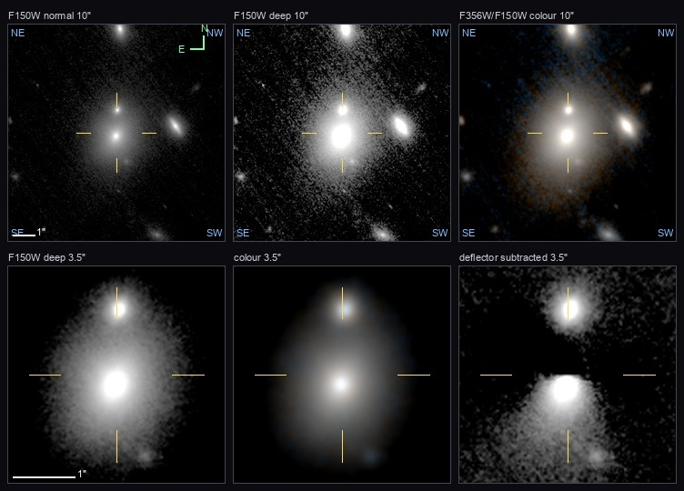{ width="100%" }](img/rank-028-orig.jpg){ target=_blank }
  <figcaption>What the judge saw (blind, footer removed)</figcaption>
</figure>

<figure markdown="span">
  [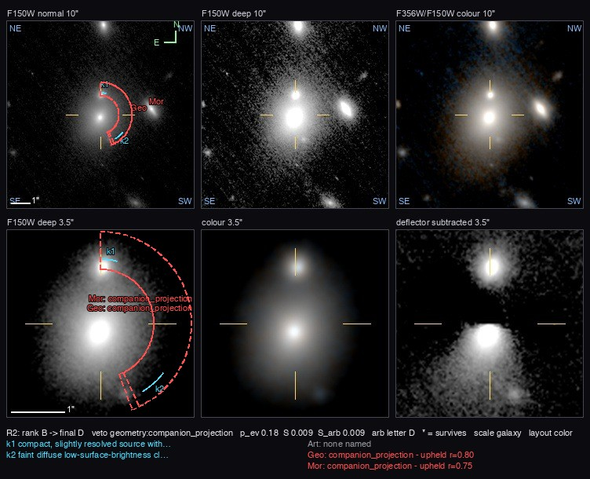{ width="100%" }](img/rank-028-annot.jpg){ target=_blank }
  <figcaption>Advocate evidence (cyan) and critic alternatives coloured by the arbitrator ruling</figcaption>
</figure>

???+ note "Why this grade — advocate, critics, arbitrator"
    **Letter D** (deployed, rule R2) · p_evidence 0.18 · S_arb 0.009 · S 0.009 · scale galaxy

    Letter: D rule: geometry (companion_projection) covers every item (a = 1) at r 0.80 >= 0.80 (upheld).

    **Advocate**

    - criteria: source_contrast 4, low_surface_brightness 3, curvature 1, counter_image 2, arc_morphology 1
    - items (2):
        - k1 — “compact, slightly resolved source with a fuzzy envelope sitting 1.2" due north of the ticked nucleus; brighter and whiter than the surrounding orange envelope in (c)/(e), survives as a distinct offset blob in the subtracted panel (f) rather than as a symmetric lobe” (panel d, r 1.2 arcsec, PA 345->358, visible in direct: yes; criteria: source_contrast, low_surface_brightness)
        - k2 — “faint diffuse low-surface-brightness clump SW of the nucleus in the zoom deep panel, at roughly 1.5", not mirrored to the NE; no tangential elongation measurable” (panel d, r 1.5 arcsec, PA 212->232, visible in direct: yes; criteria: low_surface_brightness)
    - scale galaxy; red neighbours within 10 arcsec 3; BCG-like halo yes; deflector is centre yes
    - p_evidence: 0.18
    - notes: “The only offset compact source is the knot 1.2" north (visible in a, b, d, e and as a separate blob in f); it has no tangential elongation, no counter-image at PA~170-180 within 40% of its radius (the southern brightening in (f) coincides with the N-S major-axis lobes the circular model must leave on this elongated galaxy), and the bright elongated neighbour 2.6" west plus the broad orange envelope in (c) look like a group/merger environment rather than a lensed configuration.”

    **Critics**

    **artifact — no alternative named (nothing in its competence fits)**

    - leaves standing: k1, k2
    - scale_class: galaxy
    - measured: `{"diffraction_spikes_present": "none - no straight rays at fixed PA from the ticked core or from the bright object ~2\" W in (a)/(b); nothing crosses PA 345-358 or PA 212-232", "item1_in_subtracted_panel": "offset positive blob in (f) at PA~350, r~1.2\", traceable in (d)/(e) - fails the subtraction-residual test", "item1_multiband_check": "the r=1.2\" N blob appears in (a) normal, (b) deep, (c)/(e) colour (whitish, i.e. flux in BOTH SW and LW) and (d); not a single-band snowball, cosmic ray or persistence hit", "item2_in_direct": "faint SW envelope extension at r~1.5\", PA~220 is present in (d) deep zoom and in the 10\" deep (b), so the corresponding (f) lobe is not purely a bowtie artefact", "striping_seams": "no 1/f banding, mosaic seam or coverage edge within the 3.5\" zoom; background noise is uniform"}`
    - notes: “Neither located feature is instrumental: the northern blob (r~1.2", PA 345-358) is compact but multi-band and appears in every un-subtracted panel, with no straight spike, bleed or PSF wing pointing at it, and the SW clump (r~1.5", PA 212-232) is already visible in the direct deep panels (b) and (d), so it cannot be charged to the circular-profile subtraction. Whether the north blob is a companion or a lensed image is a morphology question outside my competence.”
    - ruling: no ruling for this critic

    **geometry — companion_projection:** “Two unrelated neighbours projected on the halo of the ticked elliptical: a compact, high-surface-brightness companion/knot 1.2" N (PA~350) with its own small envelope, and a separate faint diffuse low-surface-brightness blob 1.5" SW (PA~222). They lie at incompatible radii and position angles for a lensed pair and have grossly different surface-brightness profiles.”

    - location: r 1-1.7 arcsec, PA 200->360
    - accounts for: k1, k2; leaves standing: none; strength r 0.80; coverage a 1.00 (geometric)
    - scale_class: galaxy
    - measured: `{"centre_of_curvature_offset_arcsec": "undefined - neither feature is curved about the nucleus", "counter_image_at_compatible_radius": "none: the 1.0-1.4\" annulus due S (PA 150-190) is smooth in (b) and (d)", "expected_counter_image_pa_for_item1": 170, "item1_morphology": "compact, ~0.25\" FWHM core with faint round envelope; elongation is radial/N-S, no tangential (E-W) stretch measurable at PA 350", "item1_pa_deg": 350, "item1_radius_arcsec": 1.2, "item2_pa_deg": 222, "item2_radius_arcsec": 1.5, "pa_mismatch_from_antipode_deg": 52, "radius_ratio_item2_over_item1": 1.25, "surface_brightness_contrast": "item1 is the brightest thing after the nucleus in (d); item2 is a barely-detected diffuse smudge - inconsistent as two images of one source"}`
    - notes: “In (d) the N feature at 1.2", PA~350 is a compact source with a round envelope whose long axis runs radially (N-S), not tangentially, and the matching annulus due S (PA 150-190) at 1.0-1.4" is featureless in both (b) and (d); the SW blob at 1.5", PA~222 is far from the required counter-image angle, at a different radius, and is diffuse rather than compact, so the two cannot be images of one source.”
    - ruling: upheld, covers k1, k2 — “In (d) and (e) the r=1.2" northern knot is a compact core with a round fuzzy envelope whose long axis runs radially N-S, and the 1.0-1.4" annulus due south (PA 150-190) is smooth in both (b) and (d), so no counter-image exists; the SW smudge at 1.5", PA~222 sits at a 25% larger radius and ~130 deg away, incompatible with a lensed pair.”

    **morphology — companion_projection:** “Two independent faint neighbours seen through the outer halo of the massive host: a compact, essentially round companion with its own small envelope 1.2" N, and an unrelated faint diffuse blob ~1.5" SW. Neither is tangentially stretched about the host nucleus, neither has a counter-image, and they lie at different radii and non-opposed position angles.”

    - location: r 1-1.7 arcsec, PA 205->360
    - accounts for: k1, k2; leaves standing: none; strength r 0.75; coverage a 1.00 (geometric)
    - scale_class: galaxy
    - measured: `{"counter_image_search": "no source at r=1.1-1.3\", PA 155-200 in (d) or (e); host envelope there is smooth", "host_structure": "smooth egg-shaped envelope, no spiral arm, bar, shell edge or tidal tail joining either clump to the nucleus", "north_source_apparent_axis_ratio": "~1.0-1.2, round core plus a faint symmetric envelope; no tangential arc-like elongation, azimuthal extent <~0.4\" i.e. <20 deg at r=1.2\"", "north_source_radius_arcsec": 1.2, "pa_separation_between_items_deg": "~130-140 (not 180), radii differ by ~25%", "sw_clump_radius_arcsec": 1.5, "sw_clump_shape": "round diffuse patch, no measurable tangential elongation"}`
    - notes: “In (d) the N source at 1.2", PA~350 is a compact round knot with its own fuzzy halo - a companion, not an arc: it shows no curvature about the nucleus and nothing appears at the mirror position PA~170 at the same radius. The SW patch at 1.5", PA~220 in (d)/(e) is an isolated round low-surface-brightness blob at a different radius and a non-opposed angle, with no stellar bridge or shell edge connecting it to the host.”
    - ruling: upheld, covers k1, k2 — “Both features are round in the direct zoom panels - azimuthal extent of the N knot is <0.4" (<20 deg at r=1.2"), thinner in angle than in radius, i.e. a companion rather than a tangential arc, and the SW patch is an isolated diffuse blob with no bridge, shell edge or matching counter-arc.”

    **Arbitrator**

    - surviving items: none (0 of 2)
    - letter_llm: D; scale_class_final: galaxy; needs_human: no
    - rationale: “The artifact critic filed no alternative and correctly showed neither feature is instrumental: the northern blob at r~1.2", PA~350 appears in (a), (b), (c), (d), (e) and as an offset positive blob in (f), with no straight spike or PSF wing pointing at it, and the SW extension at r~1.5", PA~220 is already present in the direct deep panels, so neither can be charged to the circular-profile subtraction - but non-instrumental is not the same as lensed. Geometry and morphology independently and consistently reduce both items to chance projection on the halo of the ticked elliptical, and the pixels back them: in the 3.5" deep panel (d) the northern source is a compact ~0.25" core wrapped in its own small round envelope, elongated radially rather than tangentially, and the mirror annulus at PA 155-200, r=1.0-1.4" is featureless in both (b) and (d); the SW clump is a diffuse low-surface-brightness patch at a different radius and a non-opposed angle, with a grossly different surface-brightness profile from the northern knot, so the two cannot be images of one source. The extra structure in (f) - the bright southern lobe and the N-S ridge - is exactly the bowtie/ring pattern a one-dimensional circular model must leave on this obviously egg-shaped, N-S elongated deflector, and carries no weight either way. Nothing curved at fixed radius survives; the bright elongated neighbour ~2.6" west and the broad envelope in (c) read as a group/merger environment, not a lens configuration. Both alternatives are upheld for every located item, no items stand, and the case is clear enough at this resolution that no further review is warranted.”

    **Score**

    - S = p_ev x prod(1 - r_i a_i) = 0.18 x (1 - 0.80x1.00) x (1 - 0.75x1.00) = 0.009
        - terms: geometry companion_projection r 0.80 a 1.00; morphology companion_projection r 0.75 a 1.00
    - S_arb = p_ev x prod_{upheld/partial}(1 - r_i a_i') = 0.18 x (1 - 0.80x1.00) x (1 - 0.75x1.00) = 0.009
        - terms: geometry companion_projection r 0.80 a 1.00 (upheld); morphology companion_projection r 0.75 a 1.00 (upheld)
    - stored grade_pred (on S): D — S 0.009 < t_B 0.17 (calibrated at 5% FPR on clean negatives) and geometry (companion_projection) covers every item at r 0.80 >= 0.80
    - stored letter_arb (on S_arb): D; letter_source: opus5_api_calibrated
    - deploy rule R2: letter_rank (advocate only, on p_evidence) = B — p_evidence 0.18 >= t_B 0.17 (calibrated at 5% FPR on clean negatives); p_evidence 0.18 < t_A 0.20 (calibrated at 1% FPR on clean negatives)
    - deploy rule R2: letter_final = D — D rule: geometry (companion_projection) covers every item (a = 1) at r 0.80 >= 0.80 (upheld)
    - veto: geometry:companion_projection

---

## Rank 29: J20148636+4809579 {#rank-29}

| Original grade | Passes | Inspector conf. | Pipeline θ_E |
|:--:|:--:|:--:|:--:|
| **U** | — | 28 | 2.70″ |

| New (final) | Rank letter | p_ev | S_arb | Demoted by | Arb. letter | Needs human |
|:--:|:--:|--:|--:|:--|:--:|:--:|
| **C** | C | 0.15 | 0.025 | — | D | no |

<small>pipeline discovery status `new` · scale class `none`</small>

<figure markdown="span">
  [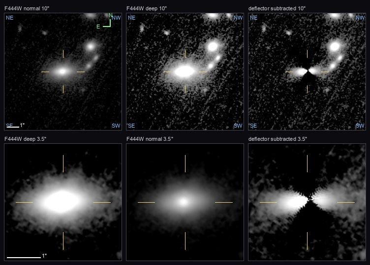{ width="100%" }](img/rank-029-orig.jpg){ target=_blank }
  <figcaption>What the judge saw (blind, footer removed)</figcaption>
</figure>

<figure markdown="span">
  [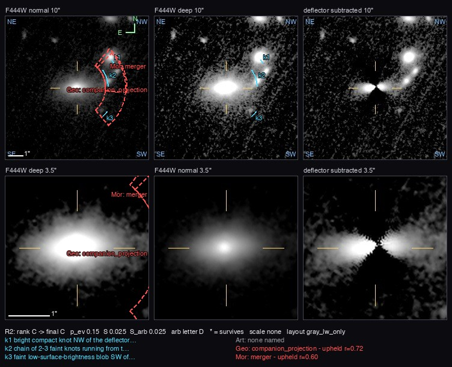{ width="100%" }](img/rank-029-annot.jpg){ target=_blank }
  <figcaption>Advocate evidence (cyan) and critic alternatives coloured by the arbitrator ruling</figcaption>
</figure>

???+ note "Why this grade — advocate, critics, arbitrator"
    **Letter C** (deployed, rule R2) · p_evidence 0.15 · S_arb 0.025 · S 0.025 · scale none

    Letter: letter_rank stands (D rule not met); p_evidence 0.15 < t_B 0.17 (calibrated at 5% FPR on clean negatives); not D: 3 item(s) located; no named critic covers every item at r >= 0.80.

    **Advocate**

    - criteria: source_contrast 4, low_surface_brightness 5, curvature 3, counter_image 1, arc_morphology 2
    - items (3):
        - k1 — “bright compact knot NW of the deflector, clearly separated from the galaxy envelope in (a),(b) and surviving the circular subtraction in (c)” (panel b, r 3.1 arcsec, PA 304->309, visible in direct: yes; criteria: source_contrast, low_surface_brightness)
        - k2 — “chain of 2-3 faint knots running from the west edge of the deflector envelope out toward the NW knot, mildly bowed with the concave side facing the galaxy” (panel b, r 2.2 arcsec, PA 272->305, visible in direct: yes; criteria: low_surface_brightness, curvature, arc_morphology)
        - k3 — “faint low-surface-brightness blob SW of the deflector, same compact-knot profile as the chain members, at a radius within ~30% of the chain radius” (panel b, r 2.7 arcsec, PA 222->232, visible in direct: yes; criteria: source_contrast, low_surface_brightness)
    - scale group; red neighbours within 10 arcsec 3; BCG-like halo yes; deflector is centre no; arc radius 2.6 arcsec; arc PA span 222->309; centre-of-curvature offset 2 arcsec
    - p_evidence: 0.15
    - notes: “All offset structure lies in one one-sided knot chain running west-to-northwest from the deflector's envelope out to the bright r~3.1" NW knot, with radius growing along the chain and the entire eastern half of the 10" field blank in (a), (b) and (c); the zoom panels show a strongly E-W elongated, disc-like deflector whose bowtie in (f) is the expected circular-subtraction artefact and is not counted.”

    **Critics**

    **artifact — no alternative named (nothing in its competence fits)**

    - leaves standing: k1, k2, k3
    - measured: `{"chain_geometry": "PA 272-305 deg at r~2.0-2.5\": 2-3 discrete peaks with gaps between them, mildly curved - a spike or amplifier stripe would be a continuous straight ray at a fixed detector angle", "direct_visibility": "items 1,2,3 are all present in the un-subtracted panels (a) and (b), so subtraction_residual is inadmissible for every one of them", "nw_knot": "r~3.1\", PA~306 deg; compact but RESOLVED with its own faint halo in (b) and (c), width grows with radius unlike a spike, and it is not radial-linear toward any bright star", "six_spike_pattern": "absent - no straight rays at fixed angles from the deflector core or from the NW compact source in (a),(b),(c); the brightest core is unsaturated in (e) and shows no bleed", "striping_snowballs_seams": "none seen; background in (a),(b) is uniform noise with no 1/f rows, no dither edge, no snowball ring"}`
    - notes: “Panels (a),(b) show the NW knot (r~3.1", PA~306) and the knot chain (PA 272-305, r~2.2) as discrete resolved sources with gaps, not continuous straight rays; there is no six-spike pattern, no saturation bleed and no striping anywhere in the 10" field, and the black butterfly in (c)/(f) is the stated circular-subtraction artefact on this clearly elongated galaxy. All three items survive in un-subtracted panels, so nothing in my instrument/reduction competence explains them.”
    - ruling: no ruling for this critic

    **geometry — companion_projection:** “The NW features are a neighbouring galaxy (bright compact core with its own resolved halo at r~3.2", PA~310) plus a second small compact source at r~2.3", PA~287 and diffuse material strung radially between them and the deflector's western envelope; the SW blob is an unrelated faint neighbour at a PA incompatible with any counter-image. A chance grouping of separate objects, not images of one source.”

    - location: r 2-3.4 arcsec, PA 220->315
    - accounts for: k1, k2, k3; leaves standing: none; strength r 0.72; coverage a 1.00 (geometric)
    - scale_class: group
    - measured: `{"PA_offset_item1_vs_item3": "84\u00b0 from the anti-radial direction - not a compatible image pair", "centre_of_curvature_offset": ">4\" from the ticked galaxy for the item1+item2 chain (chain points radially outward along the deflector's E-W major-axis extension)", "expected_counter_image_PA": "126-132 for item 1 and 92-125 for the item-2 chain; panel (b) shows nothing above background over PA 90-200 at r 2-3.5\"", "item1_r_pa": "3.2\" at PA 312 (my centroid), bright compact core WITH resolved envelope, i.e. galaxy-like profile, not a knot", "item2_knot_r_pa": "2.3\" at PA 287; chain radius grows with PA (\u0394r ~ +0.9\" over \u0394PA ~ 25\u00b0 toward item 1) - radially divergent, not constant-radius", "item3_r_pa": "2.5-2.7\" at PA 228, round, no tangential elongation (axis ratio ~1)", "tangential_elongation": "none measurable in items 1 or 3; both compact/round at 0.031\"/px"}`
    - notes: “In panel (b) the deflector at the ticks, the small knot at r~2.3" PA~287 and the bright haloed object at r~3.2" PA~312 lie on a single radially outgoing line along the western extension of the deflector's major axis, with radius increasing with PA - the opposite of a fixed-radius tangential arc; the SW blob at r~2.5" PA~228 sits 84° away from the counter-image position (PA~130), where panel (b) is blank.”
    - ruling: upheld, covers k1, k2, k3 — “In (a)/(b)/(c) the ticked galaxy, the small knot at r~2.3" PA~287 and the bright haloed source at r~3.2" PA~312 lie on one radially outgoing line whose radius grows with position angle, while the SW blob at r~2.6" PA~228 is round with no tangential elongation and the counter-image sector (PA~90-200, r 2-3.5") is blank.”

    **morphology — merger:** “The ticked object is a highly inclined lens-shaped disc (axis ratio ~0.45, major axis PA ~90/270 in panels d,e) whose western major-axis end runs out into a knotty plume/bridge that ends on the bright compact neighbour 3.3" to the NW - an interacting pair with a tidal bridge of star-forming knots, not a tangential arc.”

    - location: r 2-3.5 arcsec, PA 265->320
    - accounts for: k1, k2; leaves standing: k3; strength r 0.60; coverage a 0.667 (geometric)
    - scale_class: group
    - measured: `{"NW_knot_position_panel_a": "offset ~2.4\" W, ~2.2\" N of tick centre => r=3.3\", PA=312", "SW_blob_position_panel_a": "offset ~1.9\" W, ~1.8\" S => r=2.6\", PA=227", "chain_radius_vs_angle": "r grows monotonically 2.2\" at PA~272 -> 2.9\" at PA~287 -> 3.3\" at PA~312, i.e. NOT constant radius", "host_major_axis_PA_deg": "~90/270 (E-W), axis ratio ~0.45 in panel (d)", "zoom_coverage": "panels (d),(e) span only +/-1.75\", so all three items lie outside them; judged from (a) alone"}`
    - notes: “In panel (a) the disc's western envelope is not truncated: diffuse light plus 2-3 knots run continuously off the major-axis end (PA~272, r~2.2") and climb outward in radius to the bright compact neighbour at r~3.3", PA~312 - a bridge/plume whose radius grows with angle, the opposite of a fixed-radius tangential arc. The SW blob at r~2.6", PA~227 is detached from that structure and is left standing.”
    - ruling: upheld, covers k1, k2 — “The western major-axis end of the lens-shaped disc in (d)/(a) is not truncated: diffuse light plus 2-3 knots run continuously off it at PA~272 and climb from r~2.2" to r~3.3" onto the bright NW neighbour, a bridge/plume rather than a fixed-radius tangential arc.”

    **Arbitrator**

    - surviving items: none (0 of 3)
    - letter_llm: D; scale_class_final: none; needs_human: no
    - rationale: “The catalogued galaxy at the ticks is a strongly E-W elongated, inclined disc (axis ratio ~0.45 in panels d and e), and every offset feature the scorer listed sits on its western side. Tracing the knots in the deep 10" panel (b) and the subtracted panel (c), the chain begins at the untruncated western envelope (PA~272, r~2.2"), passes through a second knot near PA~287 at r~2.3-2.9", and terminates on a bright, resolved, halo-bearing neighbour at r~3.2-3.3", PA~310: the radius increases monotonically with angle, which is the signature of a tidal bridge/plume onto an interacting companion, not of a tangential image at fixed radius. The whole eastern half of the field, including the PA~90-200 sector where counter-images of these features would fall, is blank at the same depth in (a), (b) and (c). The SW blob (r~2.7", PA~228) is compact and round with no measurable tangential elongation and lies ~84 deg from the anti-radial direction of item 1, so it cannot pair with anything; it reads as an unrelated faint neighbour in a modestly busy field. The black bowtie in (c)/(f) is the stated circular-subtraction artefact on an elliptical host and was correctly not counted. With the geometry critic's companion_projection upheld for all three items and the morphology critic's merger upheld for the two chain items, nothing survives.”

    **Score**

    - S = p_ev x prod(1 - r_i a_i) = 0.15 x (1 - 0.72x1.00) x (1 - 0.60x0.667) = 0.025
        - terms: geometry companion_projection r 0.72 a 1.00; morphology merger r 0.60 a 0.667
    - S_arb = p_ev x prod_{upheld/partial}(1 - r_i a_i') = 0.15 x (1 - 0.72x1.00) x (1 - 0.60x0.667) = 0.025
        - terms: geometry companion_projection r 0.72 a 1.00 (upheld); morphology merger r 0.60 a 0.667 (upheld)
    - stored grade_pred (on S): C — S 0.025 < t_B 0.17 (calibrated at 5% FPR on clean negatives); not D: 3 item(s) located; no named critic covers every item at r >= 0.80
    - stored letter_arb (on S_arb): C; letter_source: opus5_api_calibrated
    - deploy rule R2: letter_rank (advocate only, on p_evidence) = C — p_evidence 0.15 < t_B 0.17 (calibrated at 5% FPR on clean negatives); not D: 3 item(s) located; no named critic covers every item at r >= 0.80
    - deploy rule R2: letter_final = C — letter_rank stands (D rule not met); p_evidence 0.15 < t_B 0.17 (calibrated at 5% FPR on clean negatives); not D: 3 item(s) located; no named critic covers every item at r >= 0.80
    - veto: none (letter_final == letter_rank)

---

## Rank 30: J9006236-2015944 {#rank-30}

| Original grade | Passes | Inspector conf. | Pipeline θ_E |
|:--:|:--:|:--:|:--:|
| **U** | — | 28 | 2.50″ |

| New (final) | Rank letter | p_ev | S_arb | Demoted by | Arb. letter | Needs human |
|:--:|:--:|--:|--:|:--|:--:|:--:|
| **C** | C | 0.15 | 0.068 | — | D | no |

<small>pipeline discovery status `new` · scale class `none`</small>

<figure markdown="span">
  [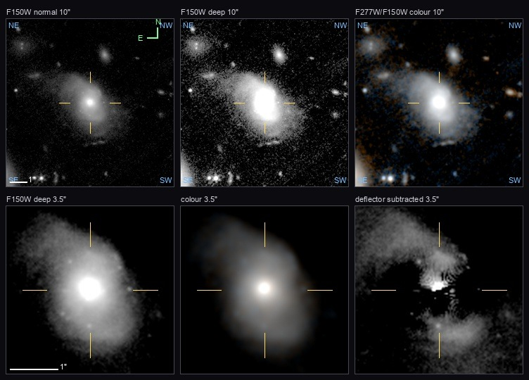{ width="100%" }](img/rank-030-orig.jpg){ target=_blank }
  <figcaption>What the judge saw (blind, footer removed)</figcaption>
</figure>

<figure markdown="span">
  [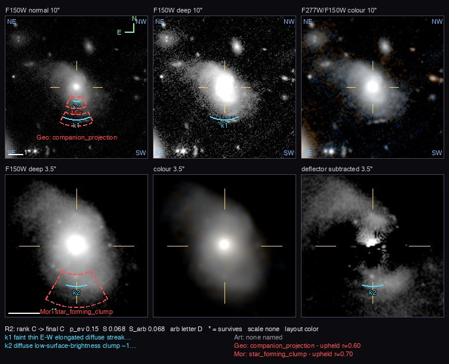{ width="100%" }](img/rank-030-annot.jpg){ target=_blank }
  <figcaption>Advocate evidence (cyan) and critic alternatives coloured by the arbitrator ruling</figcaption>
</figure>

???+ note "Why this grade — advocate, critics, arbitrator"
    **Letter C** (deployed, rule R2) · p_evidence 0.15 · S_arb 0.068 · S 0.068 · scale none

    Letter: letter_rank stands (D rule not met); p_evidence 0.15 < t_B 0.17 (calibrated at 5% FPR on clean negatives); not D: 2 item(s) located; no named critic covers every item at r >= 0.80.

    **Advocate**

    - criteria: source_contrast 4, low_surface_brightness 6, curvature 2, counter_image 1, arc_morphology 3
    - items (2):
        - k1 — “faint thin E-W elongated diffuse streak ~2.3" due south of the ticked nucleus, well outside the bright envelope; traceable in the normal and deep 10" panels as a horizontal LSB smudge ~1.2" long, oriented roughly perpendicular to the radius vector (i.e. tangential), no stellar bridge to the nucleus visible” (panel b, r 2.3 arcsec, PA 155->205, visible in direct: yes; criteria: low_surface_brightness, arc_morphology)
        - k2 — “diffuse low-surface-brightness clump ~1.0" south of the core seen as an offset residual in the subtracted zoom and matched by a faint brightening on the south side of the envelope in the deep zoom (d); compact, not tangentially elongated, listed as a knot rather than an arc” (panel f, r 1 arcsec, PA 165->195, visible in direct: yes; criteria: low_surface_brightness)
    - scale galaxy; red neighbours within 10 arcsec 2; BCG-like halo yes; deflector is centre no; arc radius 2.3 arcsec; arc PA span 155->205
    - p_evidence: 0.15
    - notes: “The ticked object is a bright-cored, inclined/asymmetric galaxy with a large irregular LSB envelope (deep 10" panel), and the only offset features are a straight ~1.2" E-W smudge 2.3" south and a diffuse south-side clump at ~1"; the wispy north-side and south-side lobes in (f) are the symmetric two-lobed pattern the circular profile subtraction leaves on an elliptical/inclined galaxy and are not counted, and no feature shows measurable concavity toward the nucleus or an opposite-side counter-image.”

    **Critics**

    **artifact — no alternative named (nothing in its competence fits)**

    - leaves standing: k1, k2
    - scale_class: galaxy
    - measured: `{"item1_spike_test": "not radial from the ticked core nor from any bright source in the 10\" field; no companion 6-spike pattern anywhere in row 1, so diffraction_spike excluded", "item1_streak_panels": "present in (a) normal, (b) deep AND (c) two-band colour at r~2.2-2.5\", PA~170-195, length ~1.2-2\" - an on-sky feature, not confined to one band/panel", "item1_stripe_test": "feature is a localised smudge with internal clumping, ~40-60 px long, not a full-width constant-amplitude row; no other row-aligned banding in the 10\" panels, so 1/f striping / detector seam not supported", "item2_subtraction_test": "the (f) lobes at PA~0 and PA~180, r~0.8-1.5\", are the expected N-S bowtie of a 1-D circular profile removed from a NNW-SSE elongated galaxy, but the scorer flags a matching brightening in the un-subtracted zoom (d), so 'subtraction_residual' is inadmissible by rule and I take no position on what the direct excess is"}`
    - notes: “The southern streak (item 1) survives in all three un-subtracted 10" panels including the two-band colour render, is not radial from any source and shows no row-wide banding, so no instrumental origin (spike, stripe, snowball, wisp, PSF wing, seam) fits it. The (f) north/south lobes around item 2 are exactly the circular-profile bowtie on this elongated core, which is evidence neither way, and the item is flagged visible in (d), so I raise no artefact alternative; both items are left standing for the geometry and morphology critics.”
    - ruling: no ruling for this critic

    **geometry — companion_projection:** “The southern streak is a small, separate field object (a faint edge-on/elongated smudge) projected onto the outer halo of the ticked disc galaxy, not an image of a background source: it is straight over its whole ~1.2" length, its long axis happens to lie E-W (which at due south is trivially 'tangential'), and there is no counterpart anywhere on the opposite side at a compatible radius.”

    - location: r 1.9-2.7 arcsec, PA 155->205
    - accounts for: k1; leaves standing: k2; strength r 0.60; coverage a 0.50 (geometric)
    - scale_class: galaxy
    - measured: `{"annulus_test": "no pair of images of one source at a common radius found at either r=1.0\" or r=2.3\"", "item1_counter_image": "none: the 1.9-2.7\" annulus at PA 340-020 in (b) shows only smooth envelope; the nearest discrete objects are at ~3.5-4\" NW and ~4\" NE, wrong radius and wrong PA", "item1_curvature": "no measurable bending over 1.2\"; a true arc at r=2.3\" spanning 30 deg would sag ~0.08\" (~4 px at the 10\" panel scale) and none is seen - centre of curvature indeterminate / not on the deflector", "item1_length_width": "~1.2\" long, ~0.25-0.35\" thick; axis ratio ~4:1", "item1_radius": "2.2-2.4\" from the tick centre in panel (b), PA ~175-185", "item2_radius": "~1.0\" S, inside the 3.5\" zoom; in (d) it appears as a compact brightening of the disc, no tangential extension (axis ratio ~1), no counterpart at 1.0\" N"}`
    - notes: “In panel (b) the feature ~2.3" due south (PA~180) is a straight, thin E-W smudge with no bend toward a centre of curvature at the ticked nucleus and no counter-arc in the matching annulus to the north, i.e. an unrelated projected neighbour rather than half of a tangential image pair. Item 2 (the ~1.0" S knot, seen in (d) inside the tick square) is compact and radially unremarkable; I leave it standing since naming it a host disc clump is the morphology critic's call.”
    - ruling: upheld, covers k1 — “In panels (a), (b) and (c) the feature ~2.3" due south of the ticks is a straight, thin, E-W smudge ~1.2" long with visible internal clumping and no measurable sag toward the ticked nucleus (a 30 deg arc at that radius would bend ~4 px), and the matching 1.9-2.7" annulus to the north shows only smooth envelope, so a projected faint edge-on field object fits it.”

    **morphology — star_forming_clump:** “The host is an inclined, clumpy disc (major axis PA ~135/315, b/a ~0.75, envelope out to ~1.6"), and the deep zoom (d) shows a family of compact knots of similar brightness sprinkled around its disc at r~0.8-1.5" (PA ~25, ~130, ~215, ~300); the 'south knot' at r=1.0" is one more of these disc clumps, not a lensed image.”

    - location: r 0.7-1.5 arcsec, PA 150->210
    - accounts for: k2; leaves standing: k1; strength r 0.70; coverage a 0.50 (geometric)
    - scale_class: galaxy
    - measured: `{"envelope_radius_arcsec": 1.6, "host_axis_ratio": 0.75, "host_major_axis_pa_deg": 135, "item2_elongation": "round/compact, no tangential stretch measurable at 0.031\"/px", "similar_disc_knots_count": 4, "similar_knot_radii_arcsec": "0.8-1.5"}`
    - notes: “In (d) the galaxy is a resolved inclined disc with several point-like clumps embedded in the envelope (e.g. ~1.2" at PA~30, ~1.0" at PA~215, ~1.3" at PA~300); the item-2 brightening at 1.0" S sits inside that same envelope, is round rather than tangentially stretched, and has no counter-knot of matching profile. Item 1 (the thin E-W smudge at 2.3" S in the 10" colour panel) lies outside the disc envelope, has no continuous stellar bridge and no monotonic radius-angle trend, so I do not claim a host-structure explanation for it.”
    - ruling: upheld, covers k2 — “The deep zoom (d) resolves the ticked object as an inclined, clumpy disc (major axis ~135/315 deg, envelope to ~1.6") with several comparable compact knots at r~0.8-1.5", and the 1.0" S brightening is round rather than tangentially stretched and lies inside that same envelope.”

    **Arbitrator**

    - surviving items: none (0 of 2)
    - letter_llm: D; scale_class_final: none; needs_human: no
    - rationale: “The ticked galaxy is a bright-cored, inclined and visibly asymmetric disc whose deep-stretch envelope (panels b and d) is lopsided to the south-west, and the two items the scorer located both dissolve under the direct panels. Item 1, the E-W streak ~2.3" south, is present in (a), (b) and (c) - so the artefact critic correctly declined an instrumental origin - but at 0.031"/px it is straight over its full ~1.2" length, ~4:1 in axis ratio, with no concavity toward the ticked core and no counter-feature in the northern annulus at the same radius; that is a projected neighbour or a detached low-surface-brightness plume, not a tangential image. Item 2, the ~1.0" southern brightening, is one of a family of similar compact knots in the disc envelope in (d) and is round rather than tangentially elongated; the strong N-S lobes around it in (f) are exactly the two-lobed bowtie a 1-D circular profile leaves on this NNW-SSE elongated core and carry no weight either way. With no curvature at fixed radius, no counter-image, and no arc-like surface-brightness structure anywhere in the 10" field, nothing survives and no lensing scale can be assigned.”

    **Score**

    - S = p_ev x prod(1 - r_i a_i) = 0.15 x (1 - 0.60x0.50) x (1 - 0.70x0.50) = 0.068
        - terms: geometry companion_projection r 0.60 a 0.50; morphology star_forming_clump r 0.70 a 0.50
    - S_arb = p_ev x prod_{upheld/partial}(1 - r_i a_i') = 0.15 x (1 - 0.60x0.50) x (1 - 0.70x0.50) = 0.068
        - terms: geometry companion_projection r 0.60 a 0.50 (upheld); morphology star_forming_clump r 0.70 a 0.50 (upheld)
    - stored grade_pred (on S): C — S 0.068 < t_B 0.17 (calibrated at 5% FPR on clean negatives); not D: 2 item(s) located; no named critic covers every item at r >= 0.80
    - stored letter_arb (on S_arb): C; letter_source: opus5_api_calibrated
    - deploy rule R2: letter_rank (advocate only, on p_evidence) = C — p_evidence 0.15 < t_B 0.17 (calibrated at 5% FPR on clean negatives); not D: 2 item(s) located; no named critic covers every item at r >= 0.80
    - deploy rule R2: letter_final = C — letter_rank stands (D rule not met); p_evidence 0.15 < t_B 0.17 (calibrated at 5% FPR on clean negatives); not D: 2 item(s) located; no named critic covers every item at r >= 0.80
    - veto: none (letter_final == letter_rank)

---

## Rank 31: J26876212+6510625 {#rank-31}

| Original grade | Passes | Inspector conf. | Pipeline θ_E |
|:--:|:--:|:--:|:--:|
| **U** | — | 28 | 0.60″ |

| New (final) | Rank letter | p_ev | S_arb | Demoted by | Arb. letter | Needs human |
|:--:|:--:|--:|--:|:--|:--:|:--:|
| **C** | C | 0.16 | 0.050 | — | D | no |

<small>pipeline discovery status `new` · scale class `galaxy`</small>

<figure markdown="span">
  [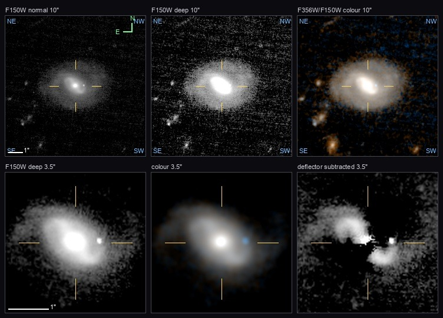{ width="100%" }](img/rank-031-orig.jpg){ target=_blank }
  <figcaption>What the judge saw (blind, footer removed)</figcaption>
</figure>

<figure markdown="span">
  [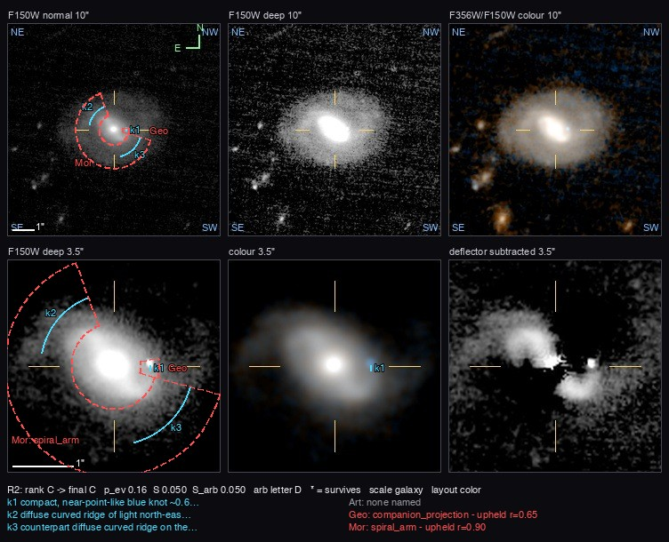{ width="100%" }](img/rank-031-annot.jpg){ target=_blank }
  <figcaption>Advocate evidence (cyan) and critic alternatives coloured by the arbitrator ruling</figcaption>
</figure>

???+ note "Why this grade — advocate, critics, arbitrator"
    **Letter C** (deployed, rule R2) · p_evidence 0.16 · S_arb 0.05 · S 0.05 · scale galaxy

    Letter: letter_rank stands (D rule not met); p_evidence 0.16 < t_B 0.17 (calibrated at 5% FPR on clean negatives); not D: 3 item(s) located; no named critic covers every item at r >= 0.80.

    **Advocate**

    - criteria: source_contrast 6, low_surface_brightness 4, curvature 3, counter_image 1, arc_morphology 2
    - items (3):
        - k1 — “compact, near-point-like blue knot ~0.6" due west of the nucleus: clearly blue against the orange deflector light in the colour zoom (e), a distinct unresolved bump on the isophotes in the deep zoom (d), and the strongest one-sided (non-mirrored) positive residual in the subtracted panel (f)” (panel e, r 0.6 arcsec, PA 262->272, visible in direct: yes; criteria: source_contrast, low_surface_brightness)
        - k2 — “diffuse curved ridge of light north-east of the core, traceable through ~60 deg of azimuth at roughly 1.0-1.4" in the deep zoom and in the 10" deep panel; its concave side faces the nucleus but its radius grows with angle and it is continuously attached to the bright inner bar (spiral-arm-like)” (panel d, r 1.2 arcsec, PA 20->80, visible in direct: yes; criteria: low_surface_brightness, curvature)
        - k3 — “counterpart diffuse curved ridge on the south-west side at similar radius, again attached to the inner bar by continuous light, giving the object a two-armed / two-lobed appearance in (a), (b) and (d)” (panel d, r 1.3 arcsec, PA 195->255, visible in direct: yes; criteria: low_surface_brightness, curvature)
    - scale galaxy; red neighbours within 10 arcsec 3; BCG-like halo no; deflector is centre yes; arc radius 0.6 arcsec; centre-of-curvature offset 0.5 arcsec
    - p_evidence: 0.16
    - notes: “The only compact, colour-contrasted feature is the blue knot 0.6" west of the nucleus (bright in (e) and as a one-sided residual in (f)) with no matching knot at a similar radius on the east side, while the two curved ridges at ~1.2" are attached to the bright inner bar and increase in radius with angle, i.e. they read as arms of a barred disc rather than tangential arcs at fixed radius.”

    **Critics**

    **artifact — no alternative named (nothing in its competence fits)**

    - leaves standing: k1, k2, k3
    - scale_class: galaxy
    - measured: `{"detector_geometry": "no mosaic seam, dither edge, low-coverage wedge or bleed column within the 3.5\" zoom", "diffraction_spikes": "no straight rays at fixed angles from the nucleus or from any field source in (a) or (b); the only bright object in the 10\" field is the target itself, no saturated star to project PSF wings or spikes", "knot_k1_appearance": "smooth PSF-like core ~3-4 px FWHM, no snowball ring, no dark/bright cosmic-ray trail, no persistence ghost pairing", "knot_k1_visibility": "present as a distinct compact bump in un-subtracted panels (a), (d) and (e) at r~0.6\", PA~267 - not confined to the subtracted panel, so not a subtraction residual", "striping": "faint horizontal 1/f amplifier striping visible across the 10\" deep panel (b), position angle 90/270; ridges k2 (PA 20-80) and k3 (PA 195-255) run diagonally and are curved, so they are not aligned with the stripe direction"}`
    - notes: “All three items are traceable in the un-subtracted renderings - the west knot is an isophote bump in (d)/(e) at r~0.6", PA~267, and the NE/SW ridges appear in (a), (b) and (d) - so none can be attributed to the circular-profile subtraction, whose butterfly/dipole in (f) I ignore by mandate. No diffraction spikes, snowball, persistence, seam or PSF wing is present in the field, and the only instrumental defect I can measure (horizontal 1/f striping in (b)) is orthogonal to and much fainter than the diagonal ridges; I offer no instrumental alternative.”
    - ruling: no ruling for this critic

    **geometry — companion_projection:** “the blue source 0.6" west of the nucleus is a single unresolved compact object projected on (or embedded in) the bar/disc - it has no tangential elongation and no counter-image at a compatible radius, so it is not part of a lensed image configuration”

    - location: r 0.45-0.75 arcsec, PA 255->280
    - accounts for: k1; leaves standing: k2, k3; strength r 0.65; coverage a 0.333 (geometric)
    - scale_class: galaxy
    - measured: `{"centre_of_curvature_offset_arcsec": "undefined - a point source defines no curvature; the two ridges (items 2,3) curve about the nucleus but their radius grows with azimuth (1.0->1.4\" NE, 1.1->1.4\" SW)", "counter_image_search": "no compact source at r = 0.5-0.8\", PA 60-120 in (d) or (e); the eastern bar light there is smooth and shows no bump comparable to the western knot", "knot_pa_deg": 267, "knot_radius_arcsec": 0.6, "knot_shape": "round, essentially unresolved (~0.1-0.15\" across in panel d); axis ratio ~1, tangential-to-radial extent ratio ~1.0", "one_source_consistency": "the blue point-like knot and the diffuse orange-white ridges have incompatible surface-brightness profiles and colours, so they cannot be images of a single source"}`
    - notes: “In (d)/(e) the western feature is a round unresolved dot at r=0.6", PA~267, sitting at the end of the bright inner bar with no tangential stretch and no matching bump anywhere along r=0.5-0.8" on the eastern side - a projected/embedded compact source, not one image of a pair. Whether the NE and SW ridges (items 2,3) are the host's own arms is the morphology critic's call; I leave them standing, noting only that their radius grows with azimuth so they are not a fixed-radius pair about the nucleus.”
    - ruling: upheld, covers k1 — “In the colour zoom (e) the western feature is a single round blue dot ~0.1-0.15" across at r~0.6", PA~267 with no tangential stretch and no matching bump anywhere along r=0.5-0.8" east of the nucleus in (d) or (e), consistent with a projected/embedded compact source rather than one image of a lensed pair.”

    **morphology — spiral_arm:** “The ticked object is a barred spiral: a bright elongated inner bar (PA ~45/225, half-length ~0.8") from whose two ends a pair of diffuse, host-coloured arms peel off and wrap tangentially, their radius growing monotonically with azimuth; items 2 and 3 are simply the NE and SW arms seen in the deep zoom (d) and in the 10" colour panel (c).”

    - location: r 0.7-1.8 arcsec, PA 20->255
    - accounts for: k2, k3; leaves standing: k1; strength r 0.90; coverage a 0.667 (geometric)
    - scale_class: galaxy
    - measured: `{"NE_arm_radius_vs_angle": "~0.9\" at PA 25 rising to ~1.5\" at PA 80 in (d) - monotonic growth, not fixed radius", "SW_arm_radius_vs_angle": "~1.0\" at PA 200 rising to ~1.6\" at PA 250, 180-deg counterpart of the NE arm", "arm_width_over_radius": "~0.5-0.7, far thicker than an Einstein arc", "bar_half_length_arcsec": "~0.8", "bar_position_angle_deg": "~45/225 (bright elongated core in (d) and (e))", "bridge_test": "both ridges join the bar ends with unbroken surface brightness in (d); no gap between arm and nucleus", "colour_of_arms_vs_host": "same warm/whitish tone as the disc light in (c) and (e)"}`
    - notes: “In panel (d) the two ridges at 20-80 deg and 195-255 deg are continuously attached to the bright NE-SW bar - you can walk from the nucleus out along unbroken light into each ridge - and their radius climbs from ~0.9" to ~1.5" across the traced azimuth, the signature of trailing spiral arms rather than a constant-radius arc; the compact blue knot at 0.6", PA ~268 in (d)/(e) is a separate feature that this alternative does not explain (it is point-like with no tangential extension, plausibly a disc clump, but I leave it standing).”
    - ruling: upheld, covers k2, k3 — “In panel (d) both ridges join the bright NE-SW inner bar with unbroken surface brightness and their radius climbs monotonically (~0.9"->1.5" NE, ~1.0"->1.6" SW) with the same warm host colour in (c)/(e) - trailing spiral arms of a barred disc, not fixed-radius tangential arcs.”

    **Arbitrator**

    - surviving items: none (0 of 3)
    - letter_llm: D; scale_class_final: galaxy; needs_human: no
    - rationale: “The ticked galaxy is unambiguously a barred/inclined disc at JWST resolution: panels (a), (b) and especially the deep zoom (d) show an elongated bright bar at PA~45/225 from whose ends two diffuse, host-coloured ridges peel off with continuous light bridging them to the nucleus, their radius growing from ~0.9" to ~1.5-1.6" across the traced azimuth - the classic spiral-arm signature, far too thick (width/radius ~0.5-0.7) and radius-varying to be an Einstein arc, so items 2 and 3 fall to the morphology critic's upheld spiral_arm alternative. The only compact, colour-contrasted feature, the blue dot at r~0.6", PA~267 in (e) and as an isophote bump in (d), is round and unresolved with no tangential elongation and no counter-bump at comparable radius on the eastern side; it reads as a disc clump or projected compact companion, and the geometry critic's companion_projection stands. The artifact critic named no instrumental alternative (the 1/f striping in (b) is horizontal and orthogonal to the diagonal ridges), which does not resurrect any item. The strong one-sided positive lobe and butterfly pattern in (f) are exactly what the circular-profile subtraction produces on a barred, off-centre-cored disc and carry no weight either way. With every located item accounted for by an upheld non-lens alternative, nothing lensing-specific survives.”

    **Score**

    - S = p_ev x prod(1 - r_i a_i) = 0.16 x (1 - 0.65x0.333) x (1 - 0.90x0.667) = 0.05
        - terms: geometry companion_projection r 0.65 a 0.333; morphology spiral_arm r 0.90 a 0.667
    - S_arb = p_ev x prod_{upheld/partial}(1 - r_i a_i') = 0.16 x (1 - 0.65x0.333) x (1 - 0.90x0.667) = 0.05
        - terms: geometry companion_projection r 0.65 a 0.333 (upheld); morphology spiral_arm r 0.90 a 0.667 (upheld)
    - stored grade_pred (on S): C — S 0.05 < t_B 0.17 (calibrated at 5% FPR on clean negatives); not D: 3 item(s) located; no named critic covers every item at r >= 0.80
    - stored letter_arb (on S_arb): C; letter_source: opus5_api_calibrated
    - deploy rule R2: letter_rank (advocate only, on p_evidence) = C — p_evidence 0.16 < t_B 0.17 (calibrated at 5% FPR on clean negatives); not D: 3 item(s) located; no named critic covers every item at r >= 0.80
    - deploy rule R2: letter_final = C — letter_rank stands (D rule not met); p_evidence 0.16 < t_B 0.17 (calibrated at 5% FPR on clean negatives); not D: 3 item(s) located; no named critic covers every item at r >= 0.80
    - veto: none (letter_final == letter_rank)

---

## Rank 32: J804181+1819597 {#rank-32}

| Original grade | Passes | Inspector conf. | Pipeline θ_E |
|:--:|:--:|:--:|:--:|
| **U** | — | 28 | — |

| New (final) | Rank letter | p_ev | S_arb | Demoted by | Arb. letter | Needs human |
|:--:|:--:|--:|--:|:--|:--:|:--:|
| **B** | B | 0.25 | 0.094 | — | D | no |

<small>pipeline discovery status `new` · scale class `none`</small>

<figure markdown="span">
  [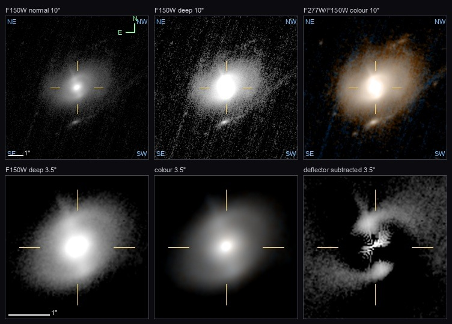{ width="100%" }](img/rank-032-orig.jpg){ target=_blank }
  <figcaption>What the judge saw (blind, footer removed)</figcaption>
</figure>

<figure markdown="span">
  [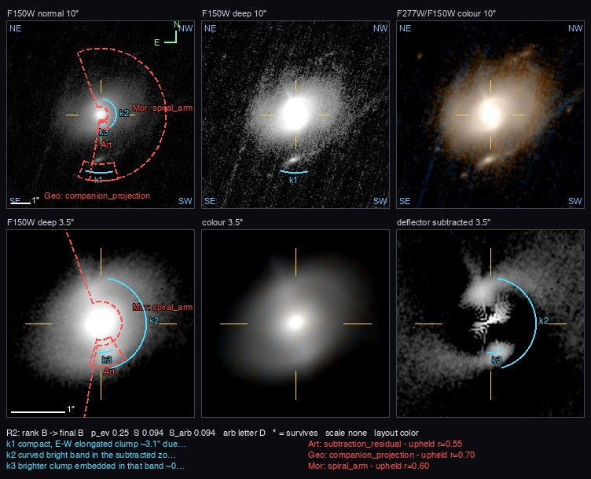{ width="100%" }](img/rank-032-annot.jpg){ target=_blank }
  <figcaption>Advocate evidence (cyan) and critic alternatives coloured by the arbitrator ruling</figcaption>
</figure>

???+ note "Why this grade — advocate, critics, arbitrator"
    **Letter B** (deployed, rule R2) · p_evidence 0.25 · S_arb 0.094 · S 0.094 · scale none

    Letter: letter_rank stands (D rule not met); p_evidence 0.25 >= t_A 0.20 (calibrated at 1% FPR on clean negatives) but A is blocked: only 0 of 3 configuration criteria >= 6; p_evidence 0.25 >= t_B 0.17 (calibrated at 5% FPR on clean negatives).

    **Advocate**

    - criteria: source_contrast 4, low_surface_brightness 5, curvature 3, counter_image 2, arc_morphology 4
    - items (3):
        - k1 — “compact, E-W elongated clump ~3.1" due south of the nucleus, ~1.3" long and thin, oriented tangentially to the deflector radius vector; whiter/less orange than the tan galaxy envelope in (c) and with a knottier profile than the smooth halo” (panel b, r 3.1 arcsec, PA 165->192, visible in direct: yes; criteria: source_contrast, low_surface_brightness, arc_morphology)
        - k2 — “curved bright band in the subtracted zoom running from S through W to N at roughly constant radius ~0.85", concave toward the core; matches a low-contrast brightening of the SW/W envelope in the deep zoom (d)” (panel f, r 0.85 arcsec, PA 195->350, visible in direct: yes; criteria: low_surface_brightness, curvature, arc_morphology)
        - k3 — “brighter clump embedded in that band ~0.55" S-SSW of the core, seen as a distinct knot in (f) and as a slight excess on the south flank of the envelope in (d)” (panel f, r 0.55 arcsec, PA 175->205, visible in direct: no; criteria: low_surface_brightness, counter_image)
    - scale galaxy; red neighbours within 10 arcsec 1; BCG-like halo yes; deflector is centre yes; arc radius 0.85 arcsec; arc PA span 195->350; centre-of-curvature offset 0.3 arcsec
    - p_evidence: 0.25
    - notes: “The ticked object is a large, asymmetric disc-like galaxy whose orange, same-hue envelope in (c) and S-shaped bright band in (f) read most naturally as bar/arm structure; the cleanest offset feature is the whitish, tangentially elongated clump 3.1" S in (a)/(b), for which no counter-image is visible at ~3" to the N.”

    **Critics**

    **artifact — subtraction_residual:** “The 0.55" S-SSW 'knot' lies inside the high-frequency positive/negative ripple field that the 1-D circular profile leaves around this compact, off-centre, elliptical core: in (f) the inner 0.2-0.7" is a checkerboard of alternating pixel-scale ridges running N-S through the core, and the S-SSW knot is the brightest cell of that ripple train, not an offset tangential source.”

    - location: r 0.3-0.8 arcsec, PA 165->215
    - accounts for: k3; leaves standing: k1, k2; strength r 0.55; coverage a 0.333 (geometric)
    - scale_class: galaxy
    - measured: `{"direct_check": "in (d) and (e) the south flank of the envelope at 0.5-0.6\" is a smooth monotonic gradient with no discrete knot at the (f) position; scorer also marks visible_in_direct false", "field_striping_pa_deg": "faint diagonal 1/f-type streaks across panel (b) at ~30-40 deg from vertical, not aligned with any item", "knot_pa_deg": "~190", "knot_radius_arcsec": 0.55, "ripple_zone_radius_arcsec": "0.15-0.7 in panel (f), pixel-scale alternating bright/dark cells, strongest along a N-S column through the core"}`
    - notes: “Item 3 sits inside the pixel-scale ringing/checkerboard that the circular-profile subtraction leaves within r<0.7" of the compact core in (f), and no corresponding discrete knot appears on the smooth south flank of the envelope in (d) or (e). Item 1 (3.1" S) is a discrete source present in (a), (b) and (c) with two-band flux, so it is no cosmic ray, snowball or stripe (field striping in (b) runs diagonally, not E-W), and item 2 is traceable in the direct zoom, so neither is an instrument or reduction artefact.”
    - ruling: upheld, covers k3 — “Panel (f) shows a pixel-scale positive/negative checkerboard filling r≈0.15-0.7" around the compact core, and the 0.55" S-SSW 'knot' is the brightest cell of that ringing with no matching discrete excess on the smooth south flank of the envelope in (d) or (e), so the admissibility test (absent from every un-subtracted panel) is met.”

    **geometry — companion_projection:** “A small, separate elongated galaxy (needle-like, with its own compact central condensation) projected ~3" south of the deflector; it is a distinct object, not an image of a background source lensed by the ticked galaxy”

    - location: r 2.6-3.5 arcsec, PA 160->195
    - accounts for: k1; leaves standing: k2, k3; strength r 0.70; coverage a 0.333 (geometric)
    - scale_class: galaxy
    - measured: `{"centre_of_curvature_offset_arcsec": "undefined for item 1 (feature is straight); no curvature centre can be placed on the tick centre", "counter_image_search": "panel (b), annulus r=2.6-3.5\", PA 340->30: no comparable clump or arc down to the deep-stretch noise; also nothing at E or W at that radius", "item1_major_axis_pa_deg": "~80-95 (roughly perpendicular to the radius vector, but the feature is straight over its full ~1.3\" length; no measurable curvature about the tick centre)", "item1_pa_measured_deg": 173, "item1_radius_measured_arcsec": 2.8, "surface_brightness_profile": "item 1 is knotty with a central condensation and sharp ends, unlike the smooth low-SB halo; items 2-3 lie at r=0.55-0.85\", i.e. a factor ~4 smaller radius, so they cannot be images of the same source configuration as item 1"}`
    - notes: “In panel (b) the only off-nucleus feature is a small, straight, ~1.3" needle with a bright knot at r~2.8", PA~173, with completely blank sky in the mirror annulus to the north - a single unpaired straight object, i.e. a projected neighbour rather than a tangential arc. Items 2-3 sit at r=0.55-0.85" inside the bright envelope of (d)/(e) where I can see only a smooth, boxy isophotal twist and nothing I can resolve as an arc; I leave them standing.”
    - ruling: upheld, covers k1 — “In (a), (b) and (c) the object at r≈2.8-3.1", PA≈173 is a straight ~1.3" needle with its own compact condensation and sharp ends, with completely blank sky in the mirror annulus at PA≈0, i.e. an unpaired projected neighbour rather than a tangential arc.”

    **morphology — spiral_arm:** “The ticked galaxy is an inclined, dusty disc: panel (c) shows a knotty tan/orange arm-and-dust pattern wrapping the white bulge from r~1.5-3.5", and panel (e) shows the inner envelope twisted into a shallow S with extensions to NE and SW. The 'band' at r~0.85" running S->W->N and the knot inside it are the inner arm / dust-lane structure of that same disc, continuous with the nucleus, not an offset arc.”

    - location: r 0.4-3.5 arcsec, PA 170->20
    - accounts for: k2, k3; leaves standing: k1; strength r 0.60; coverage a 0.667 (geometric)
    - scale_class: galaxy
    - measured: `{"arm_dust_pattern_radius_range_arcsec": "1.5-3.5", "band_offset_from_nucleus_arcsec": "<0.15 (concentric with host core, no offset centre seen in (d)/(e))", "host_axis_ratio_approx": 0.7, "host_envelope_semi_major_arcsec": 2.8, "host_major_axis_pa_deg": 45, "inner_band_radius_arcsec": 0.85}`
    - notes: “In (c) the orange/tan light between r~1.5-3.5" is knotty and arm-like (bright patches near PA~320 and PA~45, and a dusty lane running SE), i.e. an inclined disc rather than a smooth red envelope; in (d)/(e) the only inner structure at r~0.85" on the S-W-N side is a low-contrast twist of that same disc light, centred on and continuous with the nucleus, so items 2-3 are naturally inner arm/dust structure. Item 1, the thin 1.3" E-W object at r~3.1", PA~180, sits outside the arm pattern with its own compact core and no counter-feature at PA~0 - I leave it standing as a separate object.”
    - ruling: upheld, covers k2, k3 — “Panel (c) shows knotty tan/orange arm-and-dust structure wrapping the white bulge from r≈1.5-3.5" and (d)/(e) show the inner light twisted into a shallow S continuous with the nucleus, so the S->W->N 'band' at r≈0.85" in (f) is the circular-profile subtraction's rendering of that inner bar/arm, concentric with (not offset from) the core.”

    **Arbitrator**

    - surviving items: none (0 of 3)
    - letter_llm: D; scale_class_final: none; needs_human: no
    - rationale: “Every located item is accounted for by an upheld alternative. Item 1, the only convincing off-nucleus source, is the small straight needle ~3" due south in panels (a)/(b)/(c): it has its own bright condensation, sharp ends and a straight major axis over its full 1.3" length, no curvature about the tick centre and nothing whatsoever in the mirror annulus to the north at the deep stretch - a projected companion, not one image of a lensed pair. Items 2 and 3 live at r≈0.55-0.85" inside the bright envelope, a factor ~4 smaller in radius than item 1 and therefore not part of the same source configuration; in (d)/(e) that region is only a low-contrast, boxy isophotal twist continuous with the nucleus, matching the knotty tan/orange arm-and-dust pattern visible from r≈1.5-3.5" in (c), while the S-shaped band and its knot in (f) are exactly what a 1-D azimuthally averaged model leaves on an inclined, barred/armed disc, complete with the pixel-scale checkerboard ringing around the compact core. No offset tangential feature at fixed radius survives in any direct panel, and no counter-image exists anywhere; the object reads as an inclined dusty disc galaxy with an unrelated southern neighbour.”

    **Score**

    - S = p_ev x prod(1 - r_i a_i) = 0.25 x (1 - 0.55x0.333) x (1 - 0.70x0.333) x (1 - 0.60x0.667) = 0.094
        - terms: artifact subtraction_residual r 0.55 a 0.333; geometry companion_projection r 0.70 a 0.333; morphology spiral_arm r 0.60 a 0.667
    - S_arb = p_ev x prod_{upheld/partial}(1 - r_i a_i') = 0.25 x (1 - 0.55x0.333) x (1 - 0.70x0.333) x (1 - 0.60x0.667) = 0.094
        - terms: artifact subtraction_residual r 0.55 a 0.333 (upheld); geometry companion_projection r 0.70 a 0.333 (upheld); morphology spiral_arm r 0.60 a 0.667 (upheld)
    - stored grade_pred (on S): C — S 0.094 < t_B 0.17 (calibrated at 5% FPR on clean negatives); not D: 3 item(s) located; no named critic covers every item at r >= 0.80
    - stored letter_arb (on S_arb): C; letter_source: opus5_api_calibrated
    - deploy rule R2: letter_rank (advocate only, on p_evidence) = B — p_evidence 0.25 >= t_A 0.20 (calibrated at 1% FPR on clean negatives) but A is blocked: only 0 of 3 configuration criteria >= 6; p_evidence 0.25 >= t_B 0.17 (calibrated at 5% FPR on clean negatives)
    - deploy rule R2: letter_final = B — letter_rank stands (D rule not met); p_evidence 0.25 >= t_A 0.20 (calibrated at 1% FPR on clean negatives) but A is blocked: only 0 of 3 configuration criteria >= 6; p_evidence 0.25 >= t_B 0.17 (calibrated at 5% FPR on clean negatives)
    - veto: none (letter_final == letter_rank)

---

## Rank 33: J32232919-763201 {#rank-33}

| Original grade | Passes | Inspector conf. | Pipeline θ_E |
|:--:|:--:|:--:|:--:|
| **U** | — | 28 | — |

| New (final) | Rank letter | p_ev | S_arb | Demoted by | Arb. letter | Needs human |
|:--:|:--:|--:|--:|:--|:--:|:--:|
| **D** | B | 0.28 | 0.022 | spiral_arm (Mor) | D | no |

<small>pipeline discovery status `new` · scale class `none`</small>

<figure markdown="span">
  [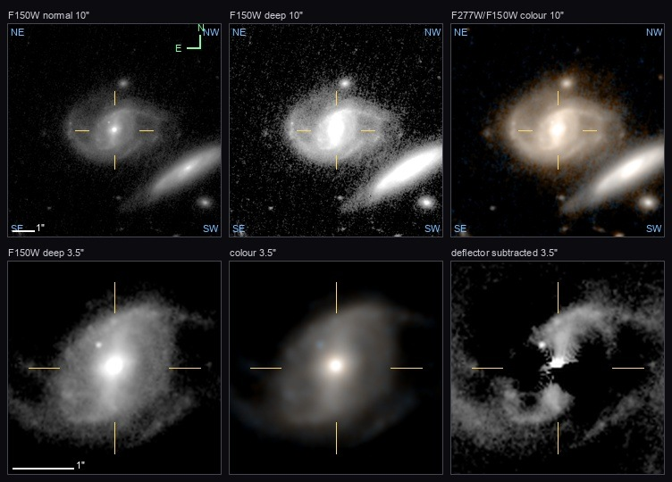{ width="100%" }](img/rank-033-orig.jpg){ target=_blank }
  <figcaption>What the judge saw (blind, footer removed)</figcaption>
</figure>

<figure markdown="span">
  [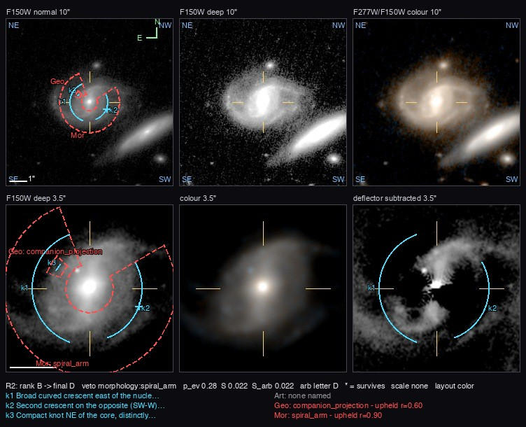{ width="100%" }](img/rank-033-annot.jpg){ target=_blank }
  <figcaption>Advocate evidence (cyan) and critic alternatives coloured by the arbitrator ruling</figcaption>
</figure>

???+ note "Why this grade — advocate, critics, arbitrator"
    **Letter D** (deployed, rule R2) · p_evidence 0.28 · S_arb 0.022 · S 0.022 · scale none

    Letter: D rule: morphology (spiral_arm) covers every item (a = 1) at r 0.90 >= 0.80 (upheld).

    **Advocate**

    - criteria: source_contrast 5, low_surface_brightness 7, curvature 5, counter_image 4, arc_morphology 4
    - items (3):
        - k1 — “Broad curved crescent east of the nucleus, concave toward the deflector; brightest edge of the diffuse envelope in (d) and the strongest offset residual in (f)” (panel f, r 1.2 arcsec, PA 20->160, visible in direct: yes; criteria: low_surface_brightness, curvature, arc_morphology)
        - k2 — “Second crescent on the opposite (SW-W) side at a similar radius, roughly antipodal to item 1, giving a broken-ring appearance in the subtracted zoom and traceable as the curved outer edge of the envelope in (b)/(d)” (panel f, r 1.1 arcsec, PA 200->300, visible in direct: yes; criteria: low_surface_brightness, curvature, counter_image)
        - k3 — “Compact knot NE of the core, distinctly sharper than the surrounding envelope, sitting on/just inside the east crescent; appears as a bright compact residual in (f)” (panel d, r 0.8 arcsec, PA 50->62, visible in direct: yes; criteria: source_contrast, counter_image)
    - scale galaxy; red neighbours within 10 arcsec 1; BCG-like halo no; deflector is centre yes; arc radius 1.2 arcsec; arc PA span 20->160; counter-image at r 1.1 arcsec PA 250; centre-of-curvature offset 0.4 arcsec
    - p_evidence: 0.28
    - notes: “Two broad opposed crescents at r~1.1-1.2" (east and SW-W) plus an 0.8" NE knot are real offset structure in the direct deep zoom (d) and the 10" deep panel (b), but both crescents appear to run continuously into the elongated bar-like core rather than staying at constant radius, so a two-armed spiral/tidal origin is the obvious competing reading for the critics to test.”

    **Critics**

    **artifact — no alternative named (nothing in its competence fits)**

    - leaves standing: k1, k2, k3
    - scale_class: galaxy
    - measured: `{"bright_neighbour_psf_wing_test": "edge-on galaxy ~4.2\" to the SW (lower right of panels a/b/c); its light gradient runs monotonically outward from PA ~230 and does not form a closed crescent at fixed r~1.1\" about the ticked galaxy", "detector_checks": "no 1/f striping, no mosaic seam, no dither edge, no saturation bleed within the 10\" field", "direct_traceability": "items 1 and 2 both appear as the curved bright outer edge of the envelope in un-subtracted panels (b) and (d) at r~1.0-1.3\", so they cannot be scored as subtraction residuals", "item3_check": "compact knot at r~0.6-0.8\", PA~55 in panel (d) is resolved and sits on the extended envelope, no persistence trail, snowball ring or CR streak morphology", "nearest_bright_point_source": "compact star ~2.3\" N of the ticked galaxy (top of panels a/b); it shows no resolved 6-spike pattern at this stretch and no straight ray crosses r=1.0-1.2\" at PA 20-160 or 200-300"}`
    - notes: “In panel (f) the east crescent (PA 20-160, r~1.2") and the SW-W crescent (PA 200-300, r~1.1") are both traceable as the curved bright rim of the envelope in the un-subtracted deep panels (b) and (d), so the subtracted-panel caveat does not apply, and neither follows a straight radial ray from the ~2.3" N star or from the SW edge-on galaxy 4.2" away. No spikes, snowballs, persistence, striping or seams intersect the ticked galaxy; whether the crescents are arms/ring/tidal structure is a morphology question outside my competence.”
    - ruling: no ruling for this critic

    **geometry — companion_projection:** “The compact NE knot is an unrelated/embedded point-like source projected on the host envelope (foreground star, star cluster or small companion): it is unresolved, has no tangential elongation, no counter-image at the mirrored radius, and a surface-brightness profile utterly unlike the broad diffuse crescents it is supposed to belong to.”

    - location: r 0.65-0.95 arcsec, PA 45->70
    - accounts for: k3; leaves standing: k1, k2; strength r 0.60; coverage a 0.333 (geometric)
    - scale_class: galaxy
    - measured: `{"colour_of_knot_vs_crescents": "knot appears white/bluish in (e) while the crescent/envelope is warm/orange - not a matched image pair", "counter_image_search": "no compact source within 0.6-1.0 arcsec at pa 215-260 in (d) or (e); SW side at that radius is smooth envelope only", "curvature_centre_offset_items_1_2": "outer crescent edges in (d) are traceable to within ~0.2-0.3 arcsec of the tick centre, but their radius grows with position angle (1.0 arcsec at pa~90 to >1.5 arcsec at pa~30), i.e. not a fixed-radius ring", "knot_axis_ratio": "~1.0 (round, unresolved; no tangential stretch along the local arc direction)", "knot_pa_deg": 56, "knot_radius_arcsec": 0.8, "profile_mismatch": "knot FWHM ~2-3 px equivalent and much higher peak SB than the crescents (items 1-2), which are >0.4 arcsec thick and envelope-smooth"}`
    - notes: “In (d) the bright compact spot sits ~0.8" up-left of the saturated core (PA~56, NE) and is point-like against the smooth envelope; the mirrored position at PA~236, 0.8" (down-right of the core) shows only unbroken envelope, so item 3 has no counter-image and no tangential shear. Items 1 and 2 are the outer boundaries of one continuous, nucleus-attached envelope whose radius increases with PA - whether that envelope is the host's own arms/shells is the morphology critic's call, so I leave them standing.”
    - ruling: upheld, covers k3 — “The NE spot at r~0.8", PA~56 in panel (d) is round and point-like with a much steeper profile than the surrounding envelope, and the mirrored position at PA~236 shows only unbroken smooth light, so it has neither tangential shear nor a counter-image.”

    **morphology — spiral_arm:** “The host is a barred two-armed spiral seen at moderate inclination: the bright inner bar runs NW-SE through the nucleus and each 'crescent' is one spiral arm springing from a bar end, with an HII-region knot on the NE arm; the outer disc closes into a pseudo-ring in the 10" colour panel.”

    - location: r 0.5-1.8 arcsec, PA 20->300
    - accounts for: k1, k2, k3; leaves standing: none; strength r 0.90; coverage a 1.00 (geometric)
    - scale_class: galaxy
    - measured: `{"bar_position_angle_deg": "~135/315 (NW-SE elongation of the bright core in (d) and (e))", "east_arm_radius_vs_angle": "~0.7\" at PA~30 growing to ~1.5\" at PA~150 - monotonic increase, not constant radius", "knot_offset": "compact knot at r~0.8\", PA~56 lies on the inner east arm, same brightness ladder as the arm in both (d) and (e)", "stellar_bridge": "both crescents connect continuously to the nucleus through the bar ends in (d); no gap between arm and core", "west_arm_radius_vs_angle": "~0.7\" at PA~210 growing to ~1.5\" at PA~300"}`
    - notes: “In the 10" colour panel (c) the ticked galaxy is unmistakably a grand-design barred spiral: the bar runs NW-SE through the core and two arms peel off its ends, sweeping east (PA 20-160) and west/SW (PA 200-300) with radius growing steadily with angle out to the outer pseudo-ring at ~2-3". In the 3.5" deep zoom (d) both 'crescents' are joined to the nucleus by continuous stellar light along the bar, and the compact NE knot at r~0.8", PA~56 sits on the inner east arm like a star-forming clump - not an offset arc at fixed radius.”
    - ruling: upheld, covers k1, k2, k3 — “Panels (a), (b), (d) and the colour panels show a NW-SE bar through the core with two arms peeling off its ends, each crescent joined to the nucleus by continuous stellar light and growing from ~0.7" at the bar end to ~1.5" further round in position angle - the opposed lobes in (f) are just those arms after a circular profile was removed.”

    **Arbitrator**

    - surviving items: none (0 of 3)
    - letter_llm: D; scale_class_final: none; needs_human: no
    - rationale: “The ticked galaxy in the 3.5" deep zoom (d) is a bright, NW-SE elongated bar-like core out of whose ends two broad, low-surface-brightness sweeps emerge: the eastern one runs from just off the core at PA~20-30 out to ~1.5" by PA~150, the western/SW one mirrors it, and both remain attached to the nucleus with no gap - the hallmark of a two-armed barred/interacting disc rather than two opposed Einstein arcs, which would sit at a fixed radius and be detached from the deflector light. The 10" panels (a)-(c) confirm this: the same two sweeps close into an outer pseudo-ring at ~2-3" with the same warm colour and the same surface-brightness ladder as the host, i.e. one stellar population, not a background source. The bright opposed lobes in the subtracted panel (f) are exactly these arms plus the expected four-lobed/dipole signature of a circular profile removed from an elongated, off-centre-cored galaxy, so they add nothing independent. The compact NE knot at r~0.8", PA~56 is unresolved and bluer/whiter than the orange envelope in (e), with completely smooth envelope at the mirrored SW position - a clump or projected point source, not one image of a pair. With every located item accounted for by the arm reading (and item 3 doubly so by the projection reading), nothing survives; no deeper data is needed to settle a candidate whose arms are this plainly resolved at 0.031"/px.”

    **Score**

    - S = p_ev x prod(1 - r_i a_i) = 0.28 x (1 - 0.60x0.333) x (1 - 0.90x1.00) = 0.022
        - terms: geometry companion_projection r 0.60 a 0.333; morphology spiral_arm r 0.90 a 1.00
    - S_arb = p_ev x prod_{upheld/partial}(1 - r_i a_i') = 0.28 x (1 - 0.60x0.333) x (1 - 0.90x1.00) = 0.022
        - terms: geometry companion_projection r 0.60 a 0.333 (upheld); morphology spiral_arm r 0.90 a 1.00 (upheld)
    - stored grade_pred (on S): D — S 0.022 < t_B 0.17 (calibrated at 5% FPR on clean negatives) and morphology (spiral_arm) covers every item at r 0.90 >= 0.80
    - stored letter_arb (on S_arb): D; letter_source: opus5_api_calibrated
    - deploy rule R2: letter_rank (advocate only, on p_evidence) = B — p_evidence 0.28 >= t_A 0.20 (calibrated at 1% FPR on clean negatives) but A is blocked: only 0 of 3 configuration criteria >= 6; p_evidence 0.28 >= t_B 0.17 (calibrated at 5% FPR on clean negatives)
    - deploy rule R2: letter_final = D — D rule: morphology (spiral_arm) covers every item (a = 1) at r 0.90 >= 0.80 (upheld)
    - veto: morphology:spiral_arm

---

## Rank 34: J17771210-2809562 {#rank-34}

| Original grade | Passes | Inspector conf. | Pipeline θ_E |
|:--:|:--:|:--:|:--:|
| **U** | — | 28 | — |

| New (final) | Rank letter | p_ev | S_arb | Demoted by | Arb. letter | Needs human |
|:--:|:--:|--:|--:|:--|:--:|:--:|
| **B** | B | 0.25 | 0.042 | — | C | no |

<small>pipeline discovery status `possible` · scale class `galaxy`</small>

<figure markdown="span">
  [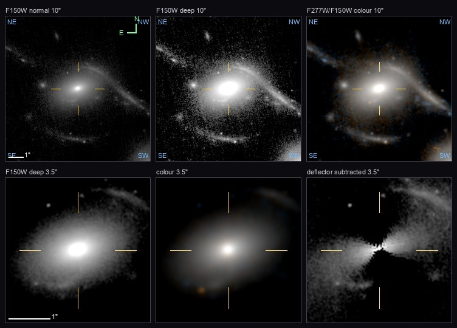{ width="100%" }](img/rank-034-orig.jpg){ target=_blank }
  <figcaption>What the judge saw (blind, footer removed)</figcaption>
</figure>

<figure markdown="span">
  [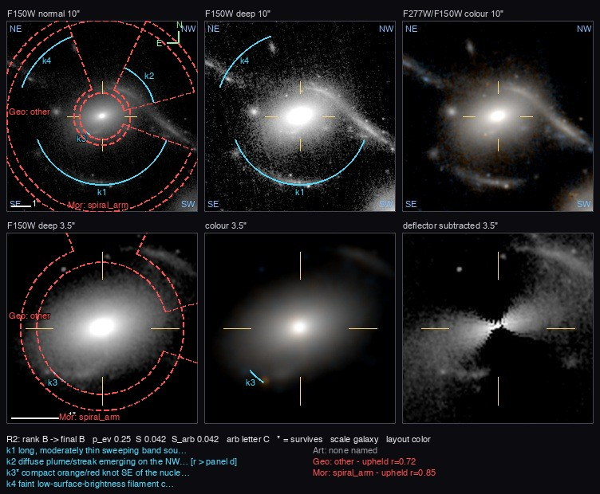{ width="100%" }](img/rank-034-annot.jpg){ target=_blank }
  <figcaption>Advocate evidence (cyan) and critic alternatives coloured by the arbitrator ruling</figcaption>
</figure>

???+ note "Why this grade — advocate, critics, arbitrator"
    **Letter B** (deployed, rule R2) · p_evidence 0.25 · S_arb 0.042 · S 0.042 · scale galaxy

    Letter: letter_rank stands (D rule not met); p_evidence 0.25 >= t_A 0.20 (calibrated at 1% FPR on clean negatives) but A is blocked: only 0 of 3 configuration criteria >= 6; p_evidence 0.25 >= t_B 0.17 (calibrated at 5% FPR on clean negatives).

    **Advocate**

    - criteria: source_contrast 4, low_surface_brightness 7, curvature 5, counter_image 3, arc_morphology 4
    - items (4):
        - k1 — “long, moderately thin sweeping band south of the ticked galaxy, concave toward it, traceable from ESE round through S to WSW at roughly constant radius r~3.3-4.0"; brightest in the deep 10" panel and present in normal and colour renderings” (panel b, r 3.6 arcsec, PA 110->250, visible in direct: yes; criteria: low_surface_brightness, curvature, arc_morphology)
        - k2 — “diffuse plume/streak emerging on the NW side, running outward from ~1.2" to beyond 5"; it is the brightest off-nuclear structure in the zoom (d)/(e) and in the residual (f) it appears as an offset, non-mirrored patch on the NW side only” (panel d, r 2.8 arcsec, PA 285->335, visible in direct: yes; criteria: source_contrast, low_surface_brightness) [r exceeds panel d: its field is 3.5 arcsec]
        - k3 — “compact orange/red knot SE of the nucleus, clearly redder than the whitish deflector core and unresolved-to-marginally-resolved in the colour zoom” (panel e, r 1.2 arcsec, PA 130->146, visible in direct: yes; criteria: source_contrast)
        - k4 — “faint low-surface-brightness filament crossing the NE quadrant in the deep 10" panel, roughly tangential at r~4-5", i.e. on the opposite side of the deflector from item 1 but at a somewhat larger radius” (panel b, r 4.5 arcsec, PA 20->70, visible in direct: yes; criteria: low_surface_brightness, curvature)
    - scale group; red neighbours within 10 arcsec 2; BCG-like halo yes; deflector is centre yes; arc radius 3.6 arcsec; arc PA span 110->250; centre-of-curvature offset 1.5 arcsec
    - p_evidence: 0.25
    - notes: “The southern band (item 1) is genuinely curved with its concavity toward the ticked galaxy and its centre of curvature within ~1.5" of it, but in the deep 10" panel it appears continuous with the NW plume (item 2) that runs straight into the bright nucleus, so the whole system reads as one S-shaped arm/tidal loop of an inclined disc; no thin counter-arc at matching radius sits opposite item 1, and the compact red knot at r~1.2", PA~138 has no mirrored partner near PA~318 (that side is occupied by the plume), while the inner ~1" is saturated in (a)-(e) and (f) shows only the expected bowtie.”

    **Critics**

    **artifact — no alternative named (nothing in its competence fits)**

    - leaves standing: k1, k2, k3, k4
    - measured: `{"diffraction_spikes_at_core": "none - no straight rays at fixed PA from the bright core in (a) or (b) out to 5\"", "psf_wing_neighbour": "brightest neighbour ~2.3\" E of tick centre has a round halo confined to r<0.6\"; it does not reach r=3.3-4.0\" or the NE filament", "residual_only_features": "none - the NW patch (PA ~285-335, r 1.2-3\") seen in (f) is traced continuously in un-subtracted (d) and (a)/(b); the central X/bowtie in (f) is the stated circular-model artefact", "striping_seams_snowballs": "background in (b) uniform; no 1/f striping, no mosaic seam or dither edge, no snowball, no persistence trail crossing any item"}`
    - notes: “No instrumental explanation fits: the core shows no diffraction spikes, the field in (b) is free of striping, seams and snowballs, and every located item is visible in the un-subtracted panels (a)/(b)/(d)/(e), so none qualifies as a subtraction residual; the only feature unique to (f) is the central bowtie, excluded by the VIEW as a modelling artefact.”
    - ruling: no ruling for this critic

    **geometry — other:** “Not a multiply-imaged configuration: items 1, 2 and 4 are segments of one continuous extended structure belonging to the ticked galaxy's own outer light, at steadily varying radius (2.8" NW, 3.6" S, 4.5" NE) and radially - not tangentially - oriented on the NW side, with no matching-radius, matching-profile counter-segment for any of them.”

    - location: r 1.2-5 arcsec, PA 285->250
    - accounts for: k1, k2, k4; leaves standing: k3; strength r 0.72; coverage a 0.75 (geometric)
    - scale_class: galaxy
    - measured: `{"NW_feature_orientation": "radial: in (d) the bright NW band runs outward from ~1.2\" to beyond the 1.75\" panel edge along PA~300, its long axis pointing at the nucleus, i.e. radial elongation, not tangential", "counter_image_test": "no counter-arc of comparable surface brightness at the radius of item 2 on the SE side; the NE filament (4.5\") is ~25% larger in radius and much fainter than the S band (3.6\"), so the pair is not a plausible image pair of one source", "curvature_centre_offset_arcsec": "~1.0-1.5 for the southern band in (b); its centre of curvature falls SE of the tick centre, not on the core", "deflector_isophotes": "core and envelope elongated at PA~120-300, b/a~0.6; the NW feature lies along that same major axis", "profile_consistency": "S band, NW band and NE filament all have the same smooth, low-contrast, host-like surface brightness and merge continuously into the galaxy's outer envelope in (d); no knotty, thin, high-contrast arc anywhere", "radius_of_items_1_2_4_arcsec": "3.3-4.0 (S), 1.2->5+ (NW), 4.0-5.0 (NE); spread >40% of the mean, not a fixed-radius image system"}`
    - notes: “In (d)/(e) the NW band is attached to the envelope and elongated radially outward from ~1.2" to past the panel edge along PA~300 - a radial, not tangential, geometry; in (b) the southern band (r~3.6", PA 110-250) and the NE filament (r~4.5", PA 20-70) differ in radius by ~1" and in brightness by a large factor, so they cannot be counter-images of one source, and their curvature centre sits ~1" off the tick centre. Whether these segments are the host's arms or shells is the morphology critic's call; geometrically they are one continuous host structure, not an image system. Item 3 (compact red knot, r~1.2", PA~138) is left standing.”
    - ruling: upheld, covers k1, k2, k4 — “In (d)/(e) the bright NW band is elongated radially along PA~300, i.e. along the same major axis as the core isophotes (b/a~0.6), and the S band (r~3.3-4.8") and NE filament (r~4-5") differ in radius and surface brightness by far more than an image pair of one source could, so no fixed-radius, matching-profile image system exists.”

    **morphology — spiral_arm:** “The host is an inclined disc galaxy with two broad, dusty spiral arms wrapping around a bright bulge: the NW arm is continuous with the disc in the 3.5" deep zoom and sweeps outward from ~2" (PA~340) through W to the SW at ~4-5", while the counter-arm runs from the NE filament round through S, its radius growing monotonically with angle. The 'bands' are arm segments, not fixed-radius arcs.”

    - location: r 1.5-5.5 arcsec, PA 20->335
    - accounts for: k1, k2, k4; leaves standing: k3; strength r 0.85; coverage a 0.75 (geometric)
    - scale_class: galaxy
    - measured: `{"NW_arm_radius_vs_angle": "r~2.0\" at PA~345 in panel (d) rising to r~3.5-4.5\" at PA~290-260 in panel (c) - monotonic growth, not constant", "arm_width": "~0.5-0.7\", comparable to the diffuse disc scale, and the arms carry blue knots (panel c, PA~60 and PA~215)", "pitch": "two-armed, 180-deg rotationally offset pair (NE filament vs S band) consistent with a single inclined disc", "southern_band_radius_vs_angle": "r~3.3\" at PA~110 (SE) to r~4.3-4.8\" at PA~230-250 (SW) in panel (c) - grows with angle", "stellar_bridge": "the NW arm in panel (d) is joined to the bulge by continuous unbroken disc light across r=0.8-2.5\", PA 300-340; no gap"}`
    - notes: “In panel (d) the bright NW feature (item 2) is plainly the inner end of a spiral arm attached to the bulge by continuous disc light at r~1-2.5", PA 300-340, and in panel (c) it continues outward past 4" toward the SW; the southern band (item 1) and the NE filament (item 4) are the two arms of the same inclined disc, each with radius increasing with position angle rather than staying tangential. Only the compact orange knot at r~1.2", PA~140 (panel e) is not explained by the arm system, though it lies on the inner disc where dust/HII knots are expected.”
    - ruling: upheld, covers k1, k2, k4 — “Panel (d) shows unbroken disc light bridging the bulge to the NW feature across r~0.8-2.5", PA 300-340, and in (b)/(c) that feature sweeps outward past 4" to the SW while the NE filament and southern band form the 180-deg-offset counter-arm, each with radius growing monotonically with angle - arms of an inclined disc, not fixed-radius arcs.”

    **Arbitrator**

    - surviving items: k3 (1 of 4)
    - letter_llm: C; scale_class_final: galaxy; needs_human: no
    - rationale: “The ticked galaxy is an inclined, elongated (b/a~0.6, major axis PA~120-300) disc whose outer light is the whole story: in the 3.5" deep zoom (d) the bright NW structure (item 2) is joined to the bulge by continuous, unbroken envelope light from r~0.8" out past the panel edge and points radially at the nucleus rather than lying tangential to it, and in the 10" panels (b)/(c) that same structure sweeps round to the SW while the southern band (item 1, r~3.3" at PA~110 growing to ~4.5" at PA~230) and the fainter NE filament (item 4, r~4-5") form the counter-arm of one continuous, host-coloured, host-profiled arm/tidal system - radius growing with angle, no thin high-contrast knotty arc, no counter-arc of matching radius and brightness anywhere. Both geometry and morphology are therefore upheld over items 1, 2 and 4; the artefact critic named no alternative and correctly notes there are no spikes, seams or residual-only features (the X/bowtie in (f) is the stated circular-model artefact and the NW patch in (f) is traceable in (d)). What survives is only item 3, the compact orange knot at r~1.2", PA~138 in (e) - a single unmirrored point source sitting on the inner disc where a dust-reddened HII knot or a projected compact object is entirely expected, and with no tangential extension and no partner near PA~318 it neither confirms nor refutes lensing on its own. That single leftover keeps the case out of the D bin by the stated rule, but the evidence is strongly against a lens and no deeper data are needed to see it.”

    **Score**

    - S = p_ev x prod(1 - r_i a_i) = 0.25 x (1 - 0.72x0.75) x (1 - 0.85x0.75) = 0.042
        - terms: geometry other r 0.72 a 0.75; morphology spiral_arm r 0.85 a 0.75
    - S_arb = p_ev x prod_{upheld/partial}(1 - r_i a_i') = 0.25 x (1 - 0.72x0.75) x (1 - 0.85x0.75) = 0.042
        - terms: geometry other r 0.72 a 0.75 (upheld); morphology spiral_arm r 0.85 a 0.75 (upheld)
    - stored grade_pred (on S): C — S 0.042 < t_B 0.17 (calibrated at 5% FPR on clean negatives); not D: 4 item(s) located; no named critic covers every item at r >= 0.80
    - stored letter_arb (on S_arb): C; letter_source: opus5_api_calibrated
    - deploy rule R2: letter_rank (advocate only, on p_evidence) = B — p_evidence 0.25 >= t_A 0.20 (calibrated at 1% FPR on clean negatives) but A is blocked: only 0 of 3 configuration criteria >= 6; p_evidence 0.25 >= t_B 0.17 (calibrated at 5% FPR on clean negatives)
    - deploy rule R2: letter_final = B — letter_rank stands (D rule not met); p_evidence 0.25 >= t_A 0.20 (calibrated at 1% FPR on clean negatives) but A is blocked: only 0 of 3 configuration criteria >= 6; p_evidence 0.25 >= t_B 0.17 (calibrated at 5% FPR on clean negatives)
    - veto: none (letter_final == letter_rank)

---

## Rank 35: J3807110-4434755 {#rank-35}

| Original grade | Passes | Inspector conf. | Pipeline θ_E |
|:--:|:--:|:--:|:--:|
| **U** | — | 28 | 0.38″ |

| New (final) | Rank letter | p_ev | S_arb | Demoted by | Arb. letter | Needs human |
|:--:|:--:|--:|--:|:--|:--:|:--:|
| **C** | C | 0.15 | 0.009 | — | D | no |

<small>pipeline discovery status `new` · scale class `galaxy`</small>

<figure markdown="span">
  [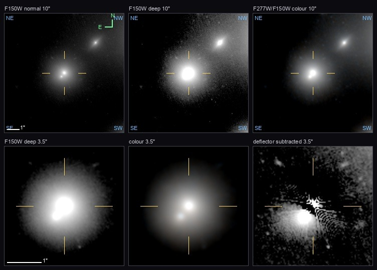{ width="100%" }](img/rank-035-orig.jpg){ target=_blank }
  <figcaption>What the judge saw (blind, footer removed)</figcaption>
</figure>

<figure markdown="span">
  [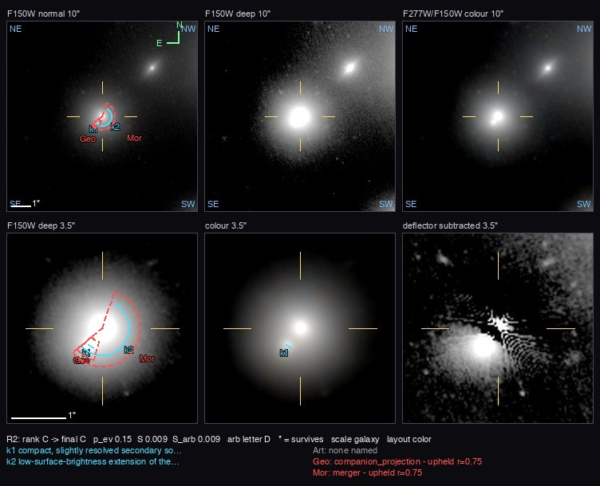{ width="100%" }](img/rank-035-annot.jpg){ target=_blank }
  <figcaption>Advocate evidence (cyan) and critic alternatives coloured by the arbitrator ruling</figcaption>
</figure>

???+ note "Why this grade — advocate, critics, arbitrator"
    **Letter C** (deployed, rule R2) · p_evidence 0.15 · S_arb 0.009 · S 0.009 · scale galaxy

    Letter: letter_rank stands (D rule not met); p_evidence 0.15 < t_B 0.17 (calibrated at 5% FPR on clean negatives); not D: 2 item(s) located; no named critic covers every item at r >= 0.80.

    **Advocate**

    - criteria: source_contrast 4, low_surface_brightness 2, curvature 1, counter_image 1, arc_morphology 1
    - items (2):
        - k1 — “compact, slightly resolved secondary source ~0.4" SE of the bright nucleus, distinct from the smooth halo in both the deep zoom and the colour zoom (hue close to the deflector, marginally warmer); it is the bright off-centre lump in the subtracted panel” (panel e, r 0.4 arcsec, PA 140->158, visible in direct: yes; criteria: source_contrast, counter_image)
        - k2 — “low-surface-brightness extension of the inner isophotes along the NW-SE axis connecting the nucleus to the SE knot (common envelope / possible bridge)” (panel d, r 0.5 arcsec, PA 130->330, visible in direct: yes; criteria: low_surface_brightness)
    - scale galaxy; red neighbours within 10 arcsec 1; BCG-like halo yes; deflector is centre yes
    - p_evidence: 0.15
    - notes: “The only located feature is the compact source 0.4" at PA~148 from the nucleus in (d)/(e) (bright off-centre residual in (f)); I searched PA~328 at 0.3-0.6" for its counter-image and the whole 10" field in (b) out to ~5" and found no opposing knot, no tangential elongation and no arc, while the two blobs share one smooth common envelope.”

    **Critics**

    **artifact — no alternative named (nothing in its competence fits)**

    - leaves standing: k1, k2
    - scale_class: galaxy
    - measured: `{"detector_pattern_check": "no 1/f striping, mosaic seam, dither edge or saturation bleed crossing the 3.5\" zoom", "item1_appearance": "slightly extended (several px across, soft-edged), present in both SW and LW channels of the colour render - inconsistent with a cosmic-ray hit, snowball or persistence blob, which would be single-band and sharp-edged", "item1_traceable_in_direct_panels": "yes - the SE lump at r~0.4\", PA~150 is present in (a) normal 10\", (b) deep 10\", (c) colour 10\", (d) deep zoom and (e) colour zoom at the same offset, so it is not a subtraction product", "panel_f_pattern": "the concentric ripples / bowtie fringing around the core in (f) are the stated circular-profile artefacts and are excluded from consideration", "spike_geometry_check": "no straight radial rays at fixed PA from the bright core or from the NW neighbour; the NW galaxy at r~3.5\" PA~325 in (a)/(b) shows no spikes and its wings do not reach the tick centre"}`
    - notes: “Both located items sit at r~0.4-0.5", PA~130-160 and are directly visible in the un-subtracted panels (d) and (e) as well as in the 10" panels, so neither can be attributed to the circular-profile subtraction; the only ring-like structure in (f) is the concentric fringing centred exactly on the core, which the VIEW declares an artefact of the model. No diffraction spike, snowball, striping, seam or PSF wing from the NW neighbour (r~3.5", PA~325) reaches the ticked galaxy, so I have no instrument-side alternative for items 1 and 2.”
    - ruling: no ruling for this critic

    **geometry — companion_projection:** “A compact second nucleus / small companion superposed on the halo 0.4" SE of the bright core: a near-round, radially oriented lump with no counter-image and no tangential structure, the NW-SE isophote extension being the blended light of the pair rather than a lensed configuration”

    - location: r 0.25-0.6 arcsec, PA 130->165
    - accounts for: k1, k2; leaves standing: none; strength r 0.75; coverage a 1.00 (geometric)
    - scale_class: galaxy
    - measured: `{"colour_of_knot_vs_nucleus": "same warm white as the deflector core, marginally warmer; no distinct blue/red source colour", "companion_in_10in_panel": "separate small disc galaxy ~3.2\" NW, PA ~305, no red envelope or second group member", "counter_image_search": "panel (d) and (e) at r=0.30-0.55\", PA 300-350 (the opposite side): isophotes smooth, no source above the halo gradient", "curvature_centre_offset_arcsec": "undefined - a single point source cannot define a centre of curvature", "knot_axis_ratio_and_orientation": "~1.1-1.2, long axis pointing radially back at the nucleus (PA ~150), i.e. radial not tangential", "knot_offset_arcsec": 0.4, "knot_pa_deg": 149, "tangential_arc_length_deg": "<15 deg of azimuth - no measurable curvature about the tick centre"}`
    - notes: “In panel (d) the SE feature is a round-to-radially-elongated lump merging continuously with the core along PA~150 at 0.4"; there is no arc, no azimuthal stretch, and the NW side at the same radius (PA 300-350) is featureless, so no counter-image. In panel (e) the lump shares the nucleus' hue and sits inside a single common envelope - a double-nucleus/superposed companion geometry, not a two-image lens.”
    - ruling: upheld, covers k1, k2 — “In panel (d) the SE lump at r~0.4", PA~150 is near-round with its long axis pointing radially back at the core rather than tangentially, and the mirror position at PA~300-350, r~0.3-0.55" in (d)/(e) shows only a smooth halo gradient with no counter-source, exactly the superposed-companion geometry claimed.”

    **morphology — merger:** “Double nucleus / minor-merger: the compact SE lump is a second stellar nucleus (or infalling companion core) sitting inside the host's own light, joined to the primary nucleus by a continuous stellar bridge, with the inner isophotes drawn out along the same NW-SE axis - i.e. a common envelope, not a lensed image”

    - location: r 0-0.7 arcsec, PA 130->340
    - accounts for: k1, k2; leaves standing: none; strength r 0.75; coverage a 1.00 (geometric)
    - scale_class: galaxy
    - measured: `{"counter_image_at_pa_320_340_r_0.4": "absent in both (d) and (e) at the level where the SE lump is obvious", "isophote_major_axis_pa": "~145/325 - inner contours in (d) bulge toward the lump, giving the core a pear shape", "lump_axis_ratio": "~1.1, round/unelongated - no tangential stretch about the nucleus", "nucleus_to_lump_separation_arcsec": "~0.4 (measured against the 1\" bar in panel d)", "surface_brightness_continuity": "light between nucleus and lump never drops to the surrounding halo level - continuous bridge"}`
    - notes: “In the 3.5" deep panel (d) the bright core is pear-shaped: the SE knot at r~0.4", PA~150 is embedded in unbroken light continuous with the nucleus, and the inner isophotes are elongated along that same NW-SE axis, which is the signature of a second nucleus in a common envelope. There is no counter-feature at PA~330, r~0.4" and the knot shows no tangential curvature at JWST resolution, so it does not behave like the counter-image of a 0.4" Einstein ring.”
    - ruling: upheld, covers k1, k2 — “The zoomed deep panel shows a pear-shaped core whose light never falls back to halo level between nucleus and knot - a continuous stellar bridge along PA~145/325 - so the NW-SE isophote extension is the common envelope of a double nucleus, not a lensed configuration.”

    **Arbitrator**

    - surviving items: none (0 of 2)
    - letter_llm: D; scale_class_final: galaxy; needs_human: no
    - rationale: “The only located evidence is a single compact lump 0.4" SE of the ticked nucleus (obvious in the 3.5" deep panel (d) and the colour zoom (e), and confirmed present in the 10" panels (a)/(b)/(c), so the artifact critic correctly found no instrument-side explanation and offered none). But two independent critics converge on the same non-lens reading and the pixels support it: the lump is round to radially elongated, its long axis points back at the core along PA~150 rather than across it, it shows no measurable azimuthal extent (<15 deg of arc), the surface brightness between it and the primary nucleus never drops to the surrounding halo level, and the opposing side at r~0.3-0.55", PA~300-350 in both (d) and (e) is featureless at a level far below where the SE lump is obvious - no counter-image. In colour (e) the lump carries the same warm hue as the deflector core inside one common envelope, consistent with a second stellar nucleus or a superposed companion in a minor merger. The bright off-centre blob and the concentric ripples/bowtie fringing in (f) are precisely what the stated circular-profile subtraction produces on an off-centre, blended, elliptical core and carry no weight either way. With both alternatives upheld over both items, nothing survives; the NW disc galaxy at ~3.2-3.5" is an unrelated projection with no red envelope or group signature. Galaxy-scale field, no lensing evidence.”

    **Score**

    - S = p_ev x prod(1 - r_i a_i) = 0.15 x (1 - 0.75x1.00) x (1 - 0.75x1.00) = 0.009
        - terms: geometry companion_projection r 0.75 a 1.00; morphology merger r 0.75 a 1.00
    - S_arb = p_ev x prod_{upheld/partial}(1 - r_i a_i') = 0.15 x (1 - 0.75x1.00) x (1 - 0.75x1.00) = 0.009
        - terms: geometry companion_projection r 0.75 a 1.00 (upheld); morphology merger r 0.75 a 1.00 (upheld)
    - stored grade_pred (on S): C — S 0.009 < t_B 0.17 (calibrated at 5% FPR on clean negatives); not D: 2 item(s) located; no named critic covers every item at r >= 0.80
    - stored letter_arb (on S_arb): C; letter_source: opus5_api_calibrated
    - deploy rule R2: letter_rank (advocate only, on p_evidence) = C — p_evidence 0.15 < t_B 0.17 (calibrated at 5% FPR on clean negatives); not D: 2 item(s) located; no named critic covers every item at r >= 0.80
    - deploy rule R2: letter_final = C — letter_rank stands (D rule not met); p_evidence 0.15 < t_B 0.17 (calibrated at 5% FPR on clean negatives); not D: 2 item(s) located; no named critic covers every item at r >= 0.80
    - veto: none (letter_final == letter_rank)

---

## Rank 36: J15055009+250185 {#rank-36}

| Original grade | Passes | Inspector conf. | Pipeline θ_E |
|:--:|:--:|:--:|:--:|
| **U** | — | 28 | — |

| New (final) | Rank letter | p_ev | S_arb | Demoted by | Arb. letter | Needs human |
|:--:|:--:|--:|--:|:--|:--:|:--:|
| **B** | B | 0.32 | 0.038 | — | D | no |

<small>pipeline discovery status `new` · scale class `galaxy`</small>

<figure markdown="span">
  [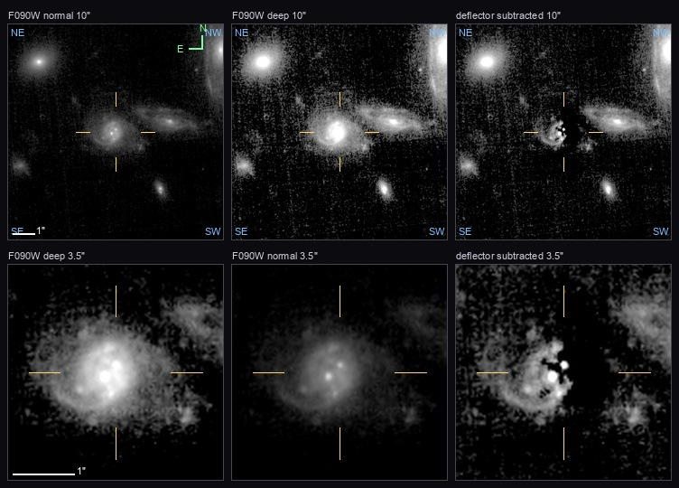{ width="100%" }](img/rank-036-orig.jpg){ target=_blank }
  <figcaption>What the judge saw (blind, footer removed)</figcaption>
</figure>

<figure markdown="span">
  [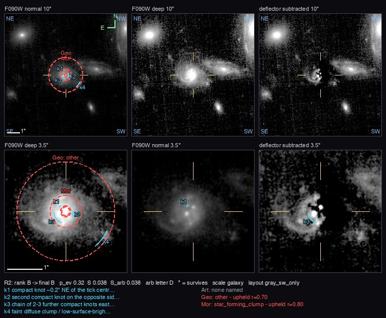{ width="100%" }](img/rank-036-annot.jpg){ target=_blank }
  <figcaption>Advocate evidence (cyan) and critic alternatives coloured by the arbitrator ruling</figcaption>
</figure>

???+ note "Why this grade — advocate, critics, arbitrator"
    **Letter B** (deployed, rule R2) · p_evidence 0.32 · S_arb 0.038 · S 0.038 · scale galaxy

    Letter: letter_rank stands (D rule not met); p_evidence 0.32 >= t_A 0.20 (calibrated at 1% FPR on clean negatives) but A is blocked: only 0 of 3 configuration criteria >= 6; p_evidence 0.32 >= t_B 0.17 (calibrated at 5% FPR on clean negatives).

    **Advocate**

    - criteria: source_contrast 4, low_surface_brightness 3, curvature 2, counter_image 4, arc_morphology 2
    - items (4):
        - k1 — “compact knot ~0.2" NE of the tick centre, clearly separated from the smooth envelope in the normal-stretch zoom and reappearing as a bright point residual after subtraction” (panel e, r 0.22 arcsec, PA 35->55, visible in direct: yes; criteria: source_contrast, counter_image)
        - k2 — “second compact knot on the opposite side of the nucleus at a similar radius (W/SW), giving a knot pair straddling the deflector centre” (panel d, r 0.2 arcsec, PA 240->265, visible in direct: yes; criteria: source_contrast, counter_image)
        - k3 — “chain of 2-3 further compact knots east/south-east of the centre at roughly constant radius ~0.35", brightest in the 3.5" residual but individually traceable as clumps in the deep zoom” (panel f, r 0.35 arcsec, PA 95->160, visible in direct: yes; criteria: source_contrast, low_surface_brightness)
        - k4 — “faint diffuse clump / low-surface-brightness blob SW of the deflector, detached from the bright core and outside the main envelope” (panel d, r 1.3 arcsec, PA 220->245, visible in direct: yes; criteria: source_contrast, low_surface_brightness)
    - scale galaxy; red neighbours within 10 arcsec 4; BCG-like halo yes; deflector is centre yes; counter-image at r 0.2 arcsec PA 250
    - p_evidence: 0.32
    - notes: “The zoom panels (d)/(e) resolve three to four compact knots inside 0.4" of the tick centre, two of them straddling the nucleus at comparable radii, and they reappear as offset point-like residuals in (f); no thin tangential arc is traceable at any radius out to ~5" in (a)/(b), and the bright 2.7" NW neighbour resolves into an inclined disc, so the knot cluster inside one common diffuse envelope may equally be a clumpy/merging host - a test the critics must run.”

    **Critics**

    **artifact — no alternative named (nothing in its competence fits)**

    - leaves standing: k1, k2, k3, k4
    - scale_class: galaxy
    - measured: `{"item4_check": "faint SW blob at r ~ 1.3\", PA ~ 230 is present in (b) 10\" deep and (d) 3.5\" deep with smooth extended profile - no seam, dither edge or low-coverage patch there", "knot_visibility_in_direct_panels": "items 1-3 are individually visible as compact bright peaks in both (e) normal 3.5\" and (d) deep 3.5\", not only in (f), so they cannot be subtraction residuals", "nearest_bright_point_source": "compact bright object in the NE corner of the 10\" row at r ~ 4.5-5\", PA ~ 45; no straight 6-spike rays cross the ticked galaxy and no PSF-wing gradient is seen inside r < 1.5\"", "snowball_check": "the inner knots are extended over several pixels with wings matching the galaxy PSF and lie inside the galaxy envelope in two independent stretches - not the sharp cored/ringed morphology of a snowball or cosmic-ray hit", "striping": "faint vertical 1/f banding in (b) and (c) runs along PA 0-180 at uniform low amplitude; it produces no compact 0.1-0.2\" peaks and no feature at fixed radius"}`
    - notes: “Items 1-3 are compact peaks that I can trace in the un-subtracted zooms (e) and (d) at r ~ 0.2-0.35", so the (f) circular-profile residual is not creating them; there are no diffraction spikes, snowball cores, seams or persistence trails crossing the ticked galaxy, and the only detector signature present is faint vertical 1/f banding in (b)/(c) at PA 0-180 which cannot make knots at fixed radius. Item 4 (r ~ 1.3", PA ~ 230) is also present in the direct deep panels and sits well away from any coverage edge, so nothing in my competence explains any of the four items.”
    - ruling: no ruling for this critic

    **geometry — other:** “Clumpy / multi-knot irregular host: the 'images' are round, un-elongated knots scattered at incommensurate radii (0.2", 0.35", 1.3") and non-opposing position angles inside one mottled envelope - no single Einstein radius, no tangential stretching, no profile-matched counter-image, so the configuration is that of internal clumps plus one detached projected blob rather than multiple images of one background source.”

    - location: r 0.15-1.4 arcsec, PA 0->360
    - accounts for: k1, k2, k3, k4; leaves standing: none; strength r 0.70; coverage a 1.00 (geometric)
    - scale_class: galaxy
    - measured: `{"counter_image_test": "nothing at r~0.35 in the PA 275-340 quadrant in (d) or (e) matching the item3 knots; nothing at r~1.3, PA~40 opposite item4", "curvature_centre": "item3's 2-3 knots at PA 95-160 do not trace a common circle centred on the tick centre; radii drift ~0.30->0.38 arcsec along the chain", "knot_radii_arcsec": "item1 ~0.22, item2 ~0.20, item3 chain ~0.30-0.38, item4 ~1.3 - the outer blob is ~4-6x the inner knot radius, incompatible with one theta_E", "pa_pairing": "item1 at PA~45 vs item2 at PA~250: separation 205 deg, 25 deg off the 180 deg required for an image pair across the centre", "surface_brightness_consistency": "item4 is diffuse and low-surface-brightness while items 1-3 are compact and peaked - not one source's images", "tangential_elongation": "each knot in panel (e) is round to within the PSF (axis ratio ~1.0-1.2, no measurable tangential axis); no arc segment exceeds ~20 deg of azimuth"}`
    - notes: “In panel (e) the central 0.5" contains 3-4 point-like knots of differing brightness embedded in a patchy envelope, all circular, none stretched perpendicular to the radius vector; panel (d) shows the whole 2" envelope is mottled with similar clumps, so the cited knots are the brighter members of a clump population, not a ring. The SW blob at r~1.3", PA~230 in (d) is diffuse and has no counterpart at PA~50 at any radius, i.e. an unrelated projected patch.”
    - ruling: upheld, covers k1, k2, k3, k4 — “In the 3.5" zooms (d)/(e) the knots at PA~45 r~0.22", PA~250 r~0.20" and the E/SE chain at r~0.30-0.38" are round to the PSF and sit at incommensurate radii with a 205 deg (not 180 deg) pairing, while the SW blob at r~1.3" is diffuse, of different surface brightness and has no counterpart at PA~50, i.e. clumps plus one projected patch rather than one source's images.”

    **morphology — star_forming_clump:** “The ticked object is a clumpy, face-on irregular/spiral disc: the 'knots' are star-forming clumps embedded in the host's own continuous stellar envelope, at scattered radii and position angles rather than on a common tangential arc, with the arm/patch structure of the disc visible in the 10" panel.”

    - location: r 0.12-0.45 arcsec, PA 0->360
    - accounts for: k1, k2, k3; leaves standing: k4; strength r 0.80; coverage a 0.75 (geometric)
    - scale_class: galaxy
    - measured: `{"envelope_continuity": "surface brightness between every knot and the nucleus stays above the local background in panel (d) - continuous stellar bridge, no gap", "host_morphology": "panel (a) shows patchy arm-like filaments extending ~1.5\" NE-SW from the same nucleus, plus a disc companion 2.5\" NW", "knot_axis_ratio": "each knot is round/compact (~2-3 px FWHM in the 2x-enlarged zoom), no tangential elongation measurable in panel (e)", "knot_radii_arcsec": "0.20-0.35, i.e. spread of ~75% in radius, not a fixed-radius set"}`
    - notes: “In panel (e) the bright knots at PA~45 r~0.2", PA~250 r~0.2" and the E/SE chain at r~0.35" all sit inside one unbroken bright envelope centred on the tick, each round rather than arc-like, and panel (a) shows the same object as a patchy clumpy disc with arm filaments - a clump-chain disc, not a set of counter-images. The faint detached SW blob at r~1.3", PA~230 (item 4) lies outside this envelope and I do not claim it.”
    - ruling: upheld, covers k1, k2, k3 — “Panel (d) shows unbroken emission bridging every knot to the nucleus inside one mottled envelope and panel (a) shows the same object as a patchy clumpy disc with arm-like filaments NE-SW, so the three inner knots are star-forming clumps, not counter-images.”

    **Arbitrator**

    - surviving items: none (0 of 4)
    - letter_llm: D; scale_class_final: galaxy; needs_human: no
    - rationale: “The catalogued galaxy at the yellow ticks resolves in the 3.5" deep and normal zooms into a lumpy, irregular envelope: three to four compact peaks inside r<0.4" (NE at PA~45, W/SW at PA~250, an E/SE chain at r~0.30-0.38"), every one of them round to within the PSF with no measurable tangential elongation, none of them lying on a common circle about the tick centre, and all of them connected to the nucleus by continuous emission that never drops to background between knot and core. The residual panel (f) reproduces exactly these peaks as offset points, which the artifact critic correctly shows are real (they are visible in un-subtracted (d) and (e)) but which the circular-profile subtraction has merely uncovered - the surrounding dark bowtie/ring structure there is a subtraction property and was never counted. The claimed knot pair straddles the nucleus at 205 deg rather than 180 deg and at unequal brightness, with no profile-matched counter-image anywhere; the faint SW blob at r~1.3", PA~230 in (b)/(d) is diffuse, of a different surface-brightness class from the inner peaks, has no counterpart at PA~50, and lies outside the host envelope, so it is a projected patch. No thin tangential feature at fixed radius exists at any radius out to ~5" in (a)/(b); the 2.5" NW neighbour is an inclined disc, not an arc. Both alternatives are upheld and together they account for every located item, leaving nothing standing - a clumpy irregular/merging host, not a lens.”

    **Score**

    - S = p_ev x prod(1 - r_i a_i) = 0.32 x (1 - 0.70x1.00) x (1 - 0.80x0.75) = 0.038
        - terms: geometry other r 0.70 a 1.00; morphology star_forming_clump r 0.80 a 0.75
    - S_arb = p_ev x prod_{upheld/partial}(1 - r_i a_i') = 0.32 x (1 - 0.70x1.00) x (1 - 0.80x0.75) = 0.038
        - terms: geometry other r 0.70 a 1.00 (upheld); morphology star_forming_clump r 0.80 a 0.75 (upheld)
    - stored grade_pred (on S): C — S 0.038 < t_B 0.17 (calibrated at 5% FPR on clean negatives); not D: 4 item(s) located; no named critic covers every item at r >= 0.80
    - stored letter_arb (on S_arb): C; letter_source: opus5_api_calibrated
    - deploy rule R2: letter_rank (advocate only, on p_evidence) = B — p_evidence 0.32 >= t_A 0.20 (calibrated at 1% FPR on clean negatives) but A is blocked: only 0 of 3 configuration criteria >= 6; p_evidence 0.32 >= t_B 0.17 (calibrated at 5% FPR on clean negatives)
    - deploy rule R2: letter_final = B — letter_rank stands (D rule not met); p_evidence 0.32 >= t_A 0.20 (calibrated at 1% FPR on clean negatives) but A is blocked: only 0 of 3 configuration criteria >= 6; p_evidence 0.32 >= t_B 0.17 (calibrated at 5% FPR on clean negatives)
    - veto: none (letter_final == letter_rank)

---

## Rank 37: J15009907+202286 {#rank-37}

| Original grade | Passes | Inspector conf. | Pipeline θ_E |
|:--:|:--:|:--:|:--:|
| **U** | — | 28 | 3.30″ |

| New (final) | Rank letter | p_ev | S_arb | Demoted by | Arb. letter | Needs human |
|:--:|:--:|--:|--:|:--|:--:|:--:|
| **C** | C | 0.15 | 0.020 | — | D | no |

<small>pipeline discovery status `new` · scale class `none`</small>

<figure markdown="span">
  [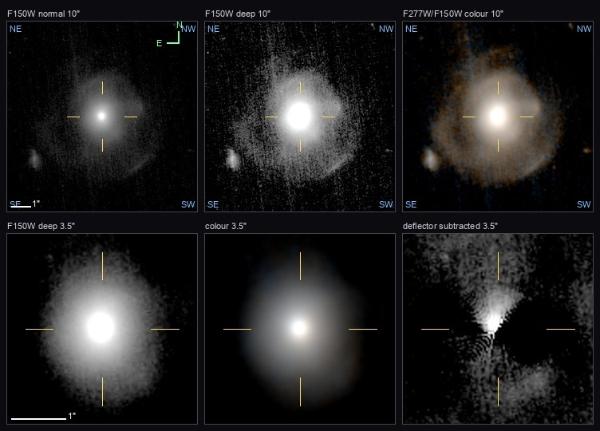{ width="100%" }](img/rank-037-orig.jpg){ target=_blank }
  <figcaption>What the judge saw (blind, footer removed)</figcaption>
</figure>

<figure markdown="span">
  [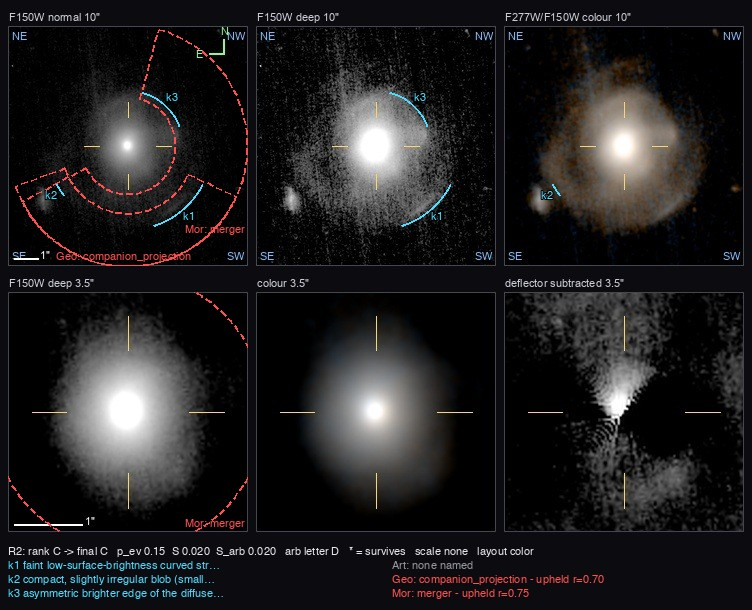{ width="100%" }](img/rank-037-annot.jpg){ target=_blank }
  <figcaption>Advocate evidence (cyan) and critic alternatives coloured by the arbitrator ruling</figcaption>
</figure>

???+ note "Why this grade — advocate, critics, arbitrator"
    **Letter C** (deployed, rule R2) · p_evidence 0.15 · S_arb 0.02 · S 0.02 · scale none

    Letter: letter_rank stands (D rule not met); p_evidence 0.15 < t_B 0.17 (calibrated at 5% FPR on clean negatives); not D: 3 item(s) located; no named critic covers every item at r >= 0.80.

    **Advocate**

    - criteria: source_contrast 3, low_surface_brightness 5, curvature 2, counter_image 1, arc_morphology 2
    - items (3):
        - k1 — “faint low-surface-brightness curved streak sweeping through the south/south-west quadrant, traceable in (a) and (b) and faintly in (c); its radius grows from ~2.9" at PA~200 to ~4.9" at PA~240, so it is not at fixed radius and appears to run outward from the direction of the SE companion” (panel b, r 3.5 arcsec, PA 198->243, visible in direct: yes; criteria: low_surface_brightness)
        - k2 — “compact, slightly irregular blob (small galaxy) SE of the deflector, whiter/bluer than the deflector's orange envelope in (c); no tangential elongation and no partner within 40% of its radius on the opposite side” (panel c, r 3.4 arcsec, PA 118->128, visible in direct: yes; criteria: source_contrast, low_surface_brightness)
        - k3 — “asymmetric brighter edge of the diffuse envelope on the NW/W side at ~2-2.5", seen as a curved boundary in the deep 10" panel and as a slightly bluer rim in colour; concave toward the core but of the same smooth profile as the envelope itself” (panel b, r 2.3 arcsec, PA 290->345, visible in direct: yes; criteria: low_surface_brightness, curvature)
    - scale group; red neighbours within 10 arcsec 1; BCG-like halo yes; deflector is centre no; arc radius 3.5 arcsec; arc PA span 198->243; centre-of-curvature offset 2.5 arcsec
    - p_evidence: 0.15
    - notes: “Inside 1.75" the zoom panels (d,e) show only a smooth saturated bulge with no knot, arc or ring, and (f) shows only the circular-model butterfly/spike artefact; the only located features are a diffuse outward-growing streak in the S-SW at 3-5" and a bluish compact companion at PA~123, r~3.4", neither of which sits at a constant radius about the ticked galaxy nor has an opposite counterpart.”

    **Critics**

    **artifact — no alternative named (nothing in its competence fits)**

    - leaves standing: k1, k2, k3
    - measured: `{"core_psf_check": "no six-spike pattern, no saturation bleed and no horizontal bar radiating from the ticked core in (a) or (b); the only straight marks near the core are the four yellow ticks", "detector_striping_orientation": "1/f column striping in panel (b) runs vertically (PA ~0/180) across the whole 10\" field; item 1 lies at PA 198-243 sweeping diagonally, so striping cannot produce it", "item1_geometry": "r grows 2.9\" -> 4.9\" over 45 deg of PA, i.e. non-radial, so it is not a diffraction spike, ghost ray or satellite/cosmic-ray track (those are straight)", "item2_visibility": "compact SE source at r~3.4\", PA~123 present in (a), (b) and (c) with an extended, resolved profile, not a point-like snowball or persistence blob", "item3_visibility": "NW/W envelope edge at r~2.0-2.5\", PA 290-345 is present in the un-subtracted deep panel (b) and the colour panel (c), so it cannot be a subtraction residual", "panel_f_pattern": "panel (f) shows only a central dipole plus a N-pointing plume and concentric ripples - the documented artefact set of the circular 1-D profile subtraction; not counted"}`
    - notes: “Nothing in my competence fits: the core shows no diffraction spikes or bleed, the 1/f striping in (b) is vertical while item 1 runs SSW-SW diagonally with growing radius, and items 2 and 3 are both plainly present in the un-subtracted panels (a)/(b)/(c) so the panel-(f) dipole+plume artefact cannot be invoked for them.”
    - ruling: no ruling for this critic

    **geometry — companion_projection:** “Two unrelated projected objects in the deflector's outskirts: a small knotty galaxy 3.4" SE (PA~123) with no tangential elongation and no counter-image, and a faint straight low-surface-brightness streak in the S/SW whose distance from the deflector grows monotonically with position angle (a line-of-sight edge-on/tidal filament, not an arc centred on the deflector).”

    - location: r 2.8-5 arcsec, PA 110->245
    - accounts for: k1, k2; leaves standing: k3; strength r 0.70; coverage a 0.667 (geometric)
    - scale_class: galaxy
    - measured: `{"counter_image_search": "no comparable feature at PA 298-308, r 2.7-4.1\" in panel (b); the NW side at that radius shows only smooth envelope", "deflector_ellipse_pa": "envelope major axis ~ N-S/NNW in (d),(e), unrelated to the item PAs", "item1_curvature_centre_offset_arcsec": ">3 (no centre of curvature on the ticked core; concavity does not point at the tick centre)", "item1_radius_run": "r grows 2.9\" at PA~200 to ~4.9\" at PA~243; a straight chord tangent at 2.9\" predicts 3.9-4.5\" at 43 deg away, so the locus is line-like, not at fixed radius", "item2_tangential_axis_ratio": "~1.1-1.2 with major axis not tangential (blob in panel b at PA~123, r~3.4\" is round/irregular, knotty)", "profile_match": "SE blob is compact/clumpy and whiter in (e)-scale colour; the SW streak is diffuse and low-surface-brightness - not one source's two images"}`
    - notes: “In panel (b) the SE object at r~3.4", PA~123 is a compact knotty blob with no tangential stretching and nothing at its mirror radius on the NW side; the SW streak (r 2.9-4.9", PA 198-243) drifts steadily outward with angle like a straight filament, so neither can be an image pair of one source about the ticked core. Item 3 (the NW envelope rim at ~2.3", PA 290-345) is a smooth isophotal asymmetry of the host itself and I leave it to the morphology critic.”
    - ruling: upheld, covers k1, k2 — “In (b) the SE object at r~3.4", PA~123 is a round, knotty compact galaxy with no tangential stretch and nothing at its mirror position (PA~303, same radius, only smooth envelope), while the S/SW streak drifts monotonically outward from ~2.9" to ~4.9" over 45 deg of PA, a line-like locus with no centre of curvature on the ticked core.”

    **morphology — merger:** “A single lopsided massive early-type host in a mild interaction: its own asymmetric outer isophotes (brighter NW/W rim at ~2.3", extra envelope light to the S/SW) plus a small compact companion 3.4" SE from which a low-surface-brightness plume runs outward - i.e. host structure and a neighbour, not an arc system.”

    - location: r 2-5 arcsec, PA 118->345
    - accounts for: k1, k2, k3; leaves standing: none; strength r 0.75; coverage a 1.00 (geometric)
    - scale_class: galaxy
    - measured: `{"host_isophote_lopsidedness": "in (d) and (e) the 3.5\" envelope centroid is offset from the nucleus toward the SSW by ~0.2-0.3\", consistent with a disturbed/lopsided halo", "item1_radius_vs_angle": "monotonic growth ~2.9\" at PA 200 to ~4.9\" at PA 240, dr/dPA ~ +0.045\"/deg - outward-running plume, not constant-radius tangential", "item2_counterimage_test": "compact SE blob at r~3.4\", PA~123 in (c); nothing at PA~303 within 40% of that radius, and the blob is round/irregular with no tangential stretch", "item3_profile_test": "in (d) the NW/W bright boundary at r~2.0-2.5\" is the outermost isophote of the same smooth envelope, continuous with the core light, no gap and no thin filament; width comparable to its radius"}`
    - notes: “In (d) the envelope is a single smooth, lopsided oval whose NW/W outer edge (item 3, r~2.3", PA 290-345) is just its outermost isophote - it joins the core continuously with no thin, detached, constant-radius arc; in (c) the SE object (bottom-left, r~3.4", PA~123) is a discrete compact galaxy with no tangential elongation and no counter-image at PA~303, and the SW streak (item 1) opens outward from ~2.9" to ~4.9" as PA runs 200->240, the radius-vs-angle behaviour of a tidal plume rather than of a lensed arc.”
    - ruling: upheld, covers k1, k2, k3 — “In (d)/(e) the NW/W "rim" at ~2.3" is simply the outermost isophote of one smooth lopsided envelope, continuous with the core light and as wide as its own radius, and the SW streak opens outward from the SE companion like a tidal plume rather than closing at fixed radius.”

    **Arbitrator**

    - surviving items: none (0 of 3)
    - letter_llm: D; scale_class_final: none; needs_human: no
    - rationale: “The ticked galaxy is a bright, smooth, saturated-cored early type: panels (d) and (e) inside 1.75" show only a single lopsided oval envelope with no knot, no thin detached filament and no ring, and panel (f) shows exactly the documented circular-profile artefact set (central dipole, N-pointing plume, concentric ripples), which is inadmissible as evidence either way. Of the three located items, the S/SW low-surface-brightness streak in (a)/(b) increases its distance from the tick centre from ~2.9" at PA~200 to ~4.9" at PA~240 (dr/dPA ~ +0.045"/deg) - the radius-versus-angle signature of a straight filament or tidal plume, not of a tangential arc; the SE object at r~3.4", PA~123 is a compact, irregular, knotty galaxy with axis ratio ~1.1-1.2 and no tangential orientation, and there is nothing at its mirror radius on the NW side; the NW/W "edge" at ~2.3" is the outermost isophote of the same envelope, joined continuously to the core with no gap. Both the geometry critic's companion_projection (items 1,2) and the morphology critic's merger/lopsided-host reading (items 1,2,3) are borne out by the pixels; the artefact critic correctly declined, since the 1/f striping in (b) runs vertically and all three items appear in un-subtracted panels. With every item accounted for by non-lens explanations and no counter-image or constant-radius tangential structure anywhere, this is a D; no deeper data is needed to settle it.”

    **Score**

    - S = p_ev x prod(1 - r_i a_i) = 0.15 x (1 - 0.70x0.667) x (1 - 0.75x1.00) = 0.02
        - terms: geometry companion_projection r 0.70 a 0.667; morphology merger r 0.75 a 1.00
    - S_arb = p_ev x prod_{upheld/partial}(1 - r_i a_i') = 0.15 x (1 - 0.70x0.667) x (1 - 0.75x1.00) = 0.02
        - terms: geometry companion_projection r 0.70 a 0.667 (upheld); morphology merger r 0.75 a 1.00 (upheld)
    - stored grade_pred (on S): C — S 0.02 < t_B 0.17 (calibrated at 5% FPR on clean negatives); not D: 3 item(s) located; no named critic covers every item at r >= 0.80
    - stored letter_arb (on S_arb): C; letter_source: opus5_api_calibrated
    - deploy rule R2: letter_rank (advocate only, on p_evidence) = C — p_evidence 0.15 < t_B 0.17 (calibrated at 5% FPR on clean negatives); not D: 3 item(s) located; no named critic covers every item at r >= 0.80
    - deploy rule R2: letter_final = C — letter_rank stands (D rule not met); p_evidence 0.15 < t_B 0.17 (calibrated at 5% FPR on clean negatives); not D: 3 item(s) located; no named critic covers every item at r >= 0.80
    - veto: none (letter_final == letter_rank)

---

## Rank 38: J15010748+230270 {#rank-38}

| Original grade | Passes | Inspector conf. | Pipeline θ_E |
|:--:|:--:|:--:|:--:|
| **U** | — | 27 | 1.15″ |

| New (final) | Rank letter | p_ev | S_arb | Demoted by | Arb. letter | Needs human |
|:--:|:--:|--:|--:|:--|:--:|:--:|
| **C** | C | 0.15 | 0.031 | — | D | no |

<small>pipeline discovery status `new` · scale class `group`</small>

<figure markdown="span">
  [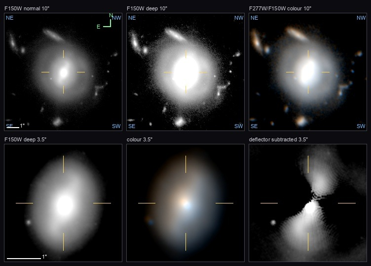{ width="100%" }](img/rank-038-orig.jpg){ target=_blank }
  <figcaption>What the judge saw (blind, footer removed)</figcaption>
</figure>

<figure markdown="span">
  [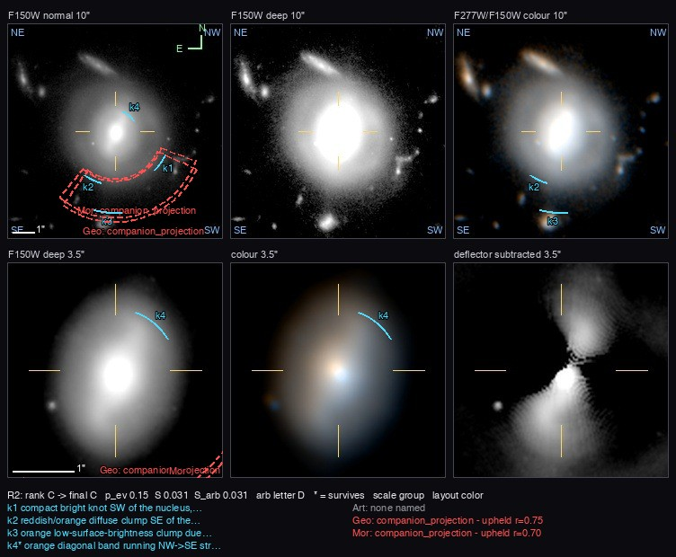{ width="100%" }](img/rank-038-annot.jpg){ target=_blank }
  <figcaption>Advocate evidence (cyan) and critic alternatives coloured by the arbitrator ruling</figcaption>
</figure>

???+ note "Why this grade — advocate, critics, arbitrator"
    **Letter C** (deployed, rule R2) · p_evidence 0.15 · S_arb 0.031 · S 0.031 · scale group

    Letter: letter_rank stands (D rule not met); p_evidence 0.15 < t_B 0.17 (calibrated at 5% FPR on clean negatives); not D: 4 item(s) located; no named critic covers every item at r >= 0.80.

    **Advocate**

    - criteria: source_contrast 5, low_surface_brightness 4, curvature 1, counter_image 2, arc_morphology 1
    - items (4):
        - k1 — “compact bright knot SW of the nucleus, white/slightly blue in (c), unresolved-to-marginally-extended, sitting on the outer envelope” (panel a, r 2.6 arcsec, PA 225->245, visible in direct: yes; criteria: source_contrast, low_surface_brightness)
        - k2 — “reddish/orange diffuse clump SE of the nucleus at a comparable radius to item 1, no tangential elongation, slightly resolved” (panel c, r 2.5 arcsec, PA 145->165, visible in direct: yes; criteria: source_contrast, low_surface_brightness)
        - k3 — “orange low-surface-brightness clump due S on the rim of the envelope, redder than the deflector core in the two-band colour” (panel c, r 3.8 arcsec, PA 165->185, visible in direct: yes; criteria: source_contrast, low_surface_brightness)
        - k4 — “orange diagonal band running NW->SE straight through the blue-white core in the zoom colour panel (bar/dust-lane-like, attached to and symmetric about the nucleus, no fixed radius)” (panel e, r 1 arcsec, PA 300->340, visible in direct: yes; criteria: source_contrast)
    - scale group; red neighbours within 10 arcsec 4; BCG-like halo yes; deflector is centre no
    - p_evidence: 0.15
    - notes: “The ticked galaxy is a large inclined/barred disc with a bright saturated core and a smooth ~6" envelope; the only located features are three compact/diffuse clumps at 2.5-3.8" (PA ~155, ~175, ~235) that are neither tangentially elongated nor arranged as an opposite pair (155 vs 235 differ by 80 deg), plus an orange band in (e) that crosses the nucleus rather than standing off it, and panel (f) shows only the circular-model butterfly/ring artefact and is therefore uninformative.”

    **Critics**

    **artifact — no alternative named (nothing in its competence fits)**

    - leaves standing: k1, k2, k3, k4
    - measured: `{"brightest_neighbour": "elongated galaxy at r~4.5\", PA~35-50 (NE, upper-left of the 10\" panels); its light falls >100 deg away from items 1-3 at PA 145-245, so PSF wings cannot produce them", "detector_pathologies": "no snowballs, cosmic-ray tracks, wisps, persistence ghosts, mosaic seam, dither edge or 1/f horizontal striping anywhere in the 10\" field", "panel_f_pattern": "dark NW-SE band plus bright N and S lobes about the tick centre = the four-lobed butterfly/dipole expected from a circular 1-D profile fitted to this clearly elliptical, N-S elongated galaxy; not counted either way", "six_spike_patterns_detected": "0 - no straight radial rays at fixed PA emanate from the ticked core or from any field source in (a) or (b); nothing in the stamp is saturated/stellar", "visible_in_direct": "items 1,2,3 are point/clump sources present in (a) and (b) as well as (c); item 4 is present in both un-subtracted colour panels (c) and (e) - none is confined to the subtracted panel (f)"}`
    - notes: “Every located feature reappears in un-subtracted renderings - the SW knot at r~2.6", PA~235 and the SE/S clumps at r~2.5-3.8", PA 145-185 are all seen in the deep 10" panel (b) as discrete sources, and the orange NW-SE band through the core is in both (c) and (e) - so no subtraction-residual explanation is admissible, and the bowtie in (f) is the expected circular-model artefact. There are no diffraction spikes, snowballs, striping, seams or PSF wings anywhere near PA 145-245 at r=2.5-4", so I have no instrumental alternative; the nature of the knots and of the bar/dust-lane band is host morphology, outside my competence.”
    - ruling: no ruling for this critic

    **geometry — companion_projection:** “Unrelated compact/faint group members and foreground-background clumps projected on the smooth outer envelope of the ticked galaxy: three sources at incompatible radii (2.5", 2.6", 3.8") and unpaired position angles (155, 175, 235 deg), none tangentially elongated, none with a counter-image at a matching radius; the 10" field is visibly crowded (chain of 3 galaxies NE, elongated galaxy N/NW, pair SW, blobs S) so chance superposition on the envelope is expected.”

    - location: r 2.2-4.2 arcsec, PA 145->245
    - accounts for: k1, k2, k3; leaves standing: k4; strength r 0.75; coverage a 0.75 (geometric)
    - scale_class: group
    - measured: `{"centre_of_curvature": "not definable - no curved feature; the ticked nucleus in (d) is the only curvature centre and nothing arcs about it", "counter_image_test": "envelope at PA~300 deg, r=1.15\" in (d) is featureless to the same depth as the SE knot", "pa_pairing": "155 vs 235 deg = 80 deg apart; 175 vs 235 = 60 deg; no pair near 180 deg, i.e. no counter-image geometry", "profile_consistency": "SE knot is point-like and blue-white in (e); items 2/3 are diffuse and orange in the scorer's colour panel - different surface-brightness profiles, not images of one source", "radius_spread_of_items_1_2_3_arcsec": "2.5, 2.6, 3.8 -> ~50% spread, not one fixed Einstein radius", "tangential_elongation": "none measurable in (b) at any of the three positions; the only compact source in the 3.5\" zoom is a round, ~0.15\" FWHM knot at r=1.15\", PA=120 deg (panels d and e), axis ratio ~1, no arc"}`
    - notes: “In (b) the ticked galaxy sits in a group (>=3 small members strung NE at r~4-6", an elongated galaxy N at ~3.5", a pair SW at r~3.4" PA~253 deg) inside a large diffuse envelope, so envelope-projected clumps are the default; in (d)/(e) the only genuine compact source inside 1.75" is a round blue knot at r=1.15", PA=120 deg with no tangential stretch and a blank envelope at the mirror position (PA~300 deg). Item 4 (the NW-SE band through the core) is a host-structure question I leave to the morphology critic, though it is radial, not at fixed radius.”
    - ruling: upheld, covers k1, k2, k3 — “The three located sources sit at r = 2.5", 2.6" and 3.8" with PAs 155/175/235 deg (no 180-deg pairing) and show no tangential stretch in the deep 10" panel (b), exactly the incoherent radii/angles expected of envelope-projected group members in this visibly crowded field.”

    **morphology — companion_projection:** “Three unrelated compact sources projected on/near the outer envelope of a large smooth lenticular host: discrete, round-to-slightly-resolved knots at three different radii and position angles, none tangentially elongated and none with a counter-image; the 10" field visibly contains several similar compact galaxies (NE corner pair, E edge, SE and SW corners), so chance projection at r~2.5-4" is demonstrably common here.”

    - location: r 2.3-4 arcsec, PA 140->250
    - accounts for: k1, k2, k3; leaves standing: k4; strength r 0.70; coverage a 0.75 (geometric)
    - scale_class: group
    - measured: `{"field_companions": "at least 4 other compact/elongated sources within the 10\" panel (NE corner streak, NE blue knot, E edge, SE corner)", "host_envelope": "smooth elliptical isophotes out to ~1.7\" in (d); no arc, no ring, no knot chain at fixed radius", "item_radii_spread": "2.5\", 2.6\", 3.8\" - not a common circle (dr/r ~ 0.4); items 2 and 3 lie nearly radially aligned S-SE rather than tangentially", "knot_in_zoom_d_e": "single compact round source at r=1.17\" (164 px at 140 px/\"), PA=120 deg, axis ratio ~1, no tangential elongation"}`
    - notes: “In (c) the due-S item (r~3.8", PA~175) is a discrete small round/orange galaxy near the bottom of the frame, morphologically identical to the compact sources littering the NE, E and SE edges of the same 10" panel, and the SW/SE items sit at different radii with no tangential stretch; panel (d) shows the host envelope out to 1.75" is featureless apart from one round knot at r=1.17", PA=120 deg. Item 4 is not covered by my alternative but is plainly host structure - a NW-SE colour band running straight through the nucleus in (e) with no fixed radius, i.e. an inner bar/dust lane of the host, not a lensed feature.”
    - ruling: upheld, covers k1, k2, k3 — “In (c) the due-S clump at r~3.8" is a discrete round/orange compact galaxy indistinguishable from the several similar knots along the NE, E and SE edges of the same 10" frame, and the SW/SE knots are round point-like sources, not arc segments.”

    **Arbitrator**

    - surviving items: k4 (1 of 4)
    - letter_llm: D; scale_class_final: group; needs_human: no
    - rationale: “The ticked object in the zoom row is a large, N-S elongated inclined/barred disc: panel (d) shows smooth elliptical isophotes out to ~1.7" broken only by one round ~0.15" knot at r~1.17", PA~120 deg with a blank mirror position at PA~300 deg, and panel (e) shows a warm NW-SE band running straight through the blue-white nucleus - a bar/dust lane at no fixed radius, i.e. item 4, the only item left standing and self-evidently host structure rather than a lensed feature. Both geometry and morphology critics are upheld on items 1-3: those clumps sit at 2.5", 2.6" and 3.8" (dr/r ~ 0.4, no common circle), at PAs 155/175/235 deg with no opposed pair, are round or diffuse with no tangential elongation in (a) or (b), and are morphologically twins of the compact galaxies scattered around the NE, E and SE edges of the 10" panels - classic companion projection on a group envelope. The artifact critic named no alternative and correctly notes that every item reappears in un-subtracted panels, so no residual explanation is admissible; the strong dark NW-SE band with bright N and S lobes in (f) is precisely the butterfly/dipole a circular 1-D profile leaves on this elliptical, off-centre-cored galaxy and is counted neither way. With no tangential feature at fixed radius, no counter-image and no arc-like surface-brightness structure anywhere at this resolution, the evidence points away from lensing.”

    **Score**

    - S = p_ev x prod(1 - r_i a_i) = 0.15 x (1 - 0.75x0.75) x (1 - 0.70x0.75) = 0.031
        - terms: geometry companion_projection r 0.75 a 0.75; morphology companion_projection r 0.70 a 0.75
    - S_arb = p_ev x prod_{upheld/partial}(1 - r_i a_i') = 0.15 x (1 - 0.75x0.75) x (1 - 0.70x0.75) = 0.031
        - terms: geometry companion_projection r 0.75 a 0.75 (upheld); morphology companion_projection r 0.70 a 0.75 (upheld)
    - stored grade_pred (on S): C — S 0.031 < t_B 0.17 (calibrated at 5% FPR on clean negatives); not D: 4 item(s) located; no named critic covers every item at r >= 0.80
    - stored letter_arb (on S_arb): C; letter_source: opus5_api_calibrated
    - deploy rule R2: letter_rank (advocate only, on p_evidence) = C — p_evidence 0.15 < t_B 0.17 (calibrated at 5% FPR on clean negatives); not D: 4 item(s) located; no named critic covers every item at r >= 0.80
    - deploy rule R2: letter_final = C — letter_rank stands (D rule not met); p_evidence 0.15 < t_B 0.17 (calibrated at 5% FPR on clean negatives); not D: 4 item(s) located; no named critic covers every item at r >= 0.80
    - veto: none (letter_final == letter_rank)

---

## Rank 39: J16305610+3001292 {#rank-39}

| Original grade | Passes | Inspector conf. | Pipeline θ_E |
|:--:|:--:|:--:|:--:|
| **U** | — | 28 | 1.30″ |

| New (final) | Rank letter | p_ev | S_arb | Demoted by | Arb. letter | Needs human |
|:--:|:--:|--:|--:|:--|:--:|:--:|
| **B** | B | 0.38 | 0.149 | — | C | yes ⚑ |

<small>pipeline discovery status `new` · scale class `galaxy`</small>

<figure markdown="span">
  [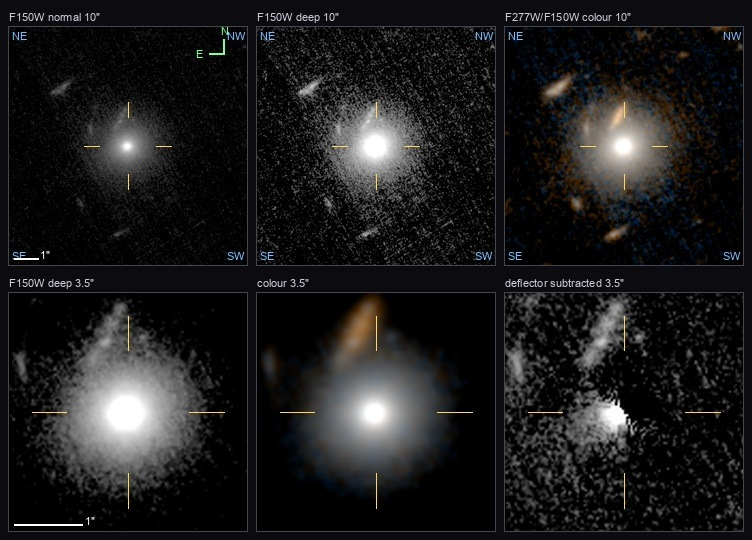{ width="100%" }](img/rank-039-orig.jpg){ target=_blank }
  <figcaption>What the judge saw (blind, footer removed)</figcaption>
</figure>

<figure markdown="span">
  [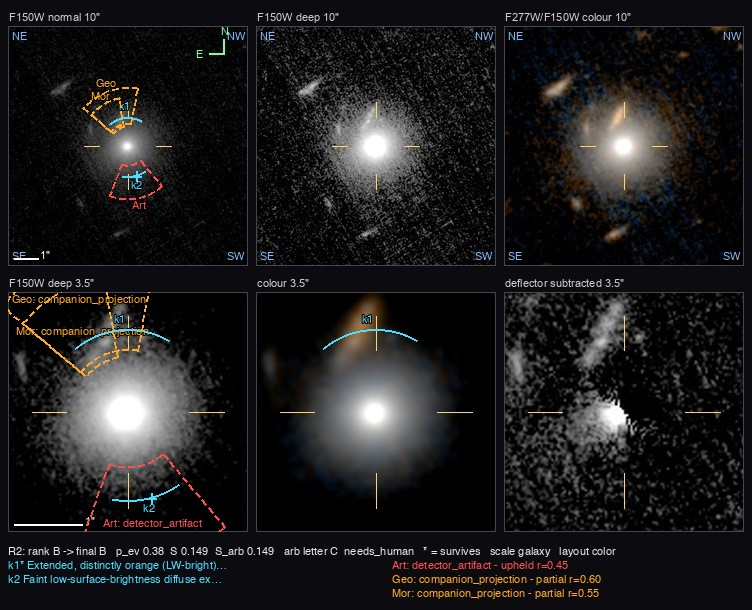{ width="100%" }](img/rank-039-annot.jpg){ target=_blank }
  <figcaption>Advocate evidence (cyan) and critic alternatives coloured by the arbitrator ruling</figcaption>
</figure>

???+ note "Why this grade — advocate, critics, arbitrator"
    **Letter B** (deployed, rule R2) · p_evidence 0.38 · S_arb 0.149 · S 0.149 · scale galaxy

    Letter: letter_rank stands (D rule not met); p_evidence 0.38 >= t_A 0.20 (calibrated at 1% FPR on clean negatives) but A is blocked: only 0 of 3 configuration criteria >= 6; p_evidence 0.38 >= t_B 0.17 (calibrated at 5% FPR on clean negatives).

    **Advocate**

    - criteria: source_contrast 6, low_surface_brightness 6, curvature 5, counter_image 2, arc_morphology 5
    - items (2):
        - k1 — “Extended, distinctly orange (LW-bright) elongated feature arching over the top of the deflector ~1.0-1.4" north, ~1.2" long and clearly thinner than its radius, tangentially oriented (roughly E-W) rather than radial; traceable as a fuzzy N extension in (a)/(b), as the orange band in (c)/(e), as a detached patch in the deep zoom (d), and reappearing in (f) as an OFFSET patch at roughly constant radius (not mirrored across the core)” (panel e, r 1.2 arcsec, PA 330->40, visible in direct: yes; criteria: source_contrast, low_surface_brightness, curvature, arc_morphology)
        - k2 — “Faint low-surface-brightness diffuse extension of the halo on the S/SSW side at a comparable radius, seen as a slight asymmetric bulge of the isophotes in the deep zoom (d) and a faint patch in (b) roughly opposite item 1; too weak to call a confirmed counter-image but located and testable” (panel d, r 1.3 arcsec, PA 170->215, visible in direct: yes; criteria: low_surface_brightness, counter_image)
    - scale galaxy; red neighbours within 10 arcsec 3; BCG-like halo yes; deflector is centre yes; arc radius 1.2 arcsec; arc PA span 330->40; counter-image at r 1.3 arcsec PA 195; centre-of-curvature offset 0.5 arcsec
    - p_evidence: 0.38
    - notes: “The only strong feature is the orange, tangentially elongated band ~1.2" due north of the ticked nucleus (obvious in the colour zoom (e), the 10" colour panel (c) and as an offset patch in the subtracted panel (f)); its concave side faces the deflector with a centre of curvature within ~0.5" of the nucleus, but the putative southern counter-image is only a marginal isophote bulge, and the bright irregular residual immediately E of the core in (f) sits where the circular-profile model leaves its dipole so I have not listed it; the direct panels are saturated inside ~0.5", so a small-radius knot pair cannot be excluded.”

    **Critics**

    **artifact — detector_artifact:** “Correlated-noise / 1-f style streaking in the deep stretch: panel (b) is criss-crossed by faint diagonal streaks 1-3" long at the same surface brightness as the claimed S/SSW 'patch', so item 2 is not separable from the background striping (the isophote bulge in (d) is host structure, outside my competence).”

    - location: r 0.8-2.2 arcsec, PA 160->220
    - accounts for: k2; leaves standing: k1; strength r 0.45; coverage a 0.50 (geometric)
    - scale_class: galaxy
    - measured: `{"item2_contrast": "faint patch at r~1.3\", PA 170-215 in (b) is of the same amplitude and texture as those streaks; no compact core, no tangential edge", "psf_check": "no bright neighbour within 3\" whose wings could reach r=1.2\"; nearest object is the faint elongated galaxy ~3\" NE, well outside the item-1 span", "spike_check": "no straight radial rays at any fixed angle within 2\" of the bright core in (a) or (b); the six-spike pattern is not detectable, so item 1 is not a diffraction spike", "streak_length_arcsec": "~1-3", "striping_orientation_panel_b": "coherent streaks running roughly NW-SE (PA ~135/315) across the whole 10\" deep frame, including 2-4\" S and SE of the galaxy"}`
    - notes: “In (b) the field is full of faint diagonal streaks (PA ~135/315, 1-3" long) at the same level as the claimed S/SSW extension, so item 2 has no instrumental significance. Item 1 stands as far as the instrument is concerned: the orange feature at r~1.2", PA 330-40 is curved/patchy rather than a straight radial ray, appears in the un-subtracted (a)/(d)/(e) as well as (f), and lies well away from the central dipole/butterfly of the circular-profile subtraction, so it is neither a spike, a PSF wing nor a subtraction residual.”
    - ruling: upheld, covers k2 — “Panel (b) is visibly criss-crossed by faint NW-SE diagonal streaking of the same amplitude and texture as the claimed S/SSW patch, and in (d) the SSW side is only a smooth isophotal bulge of the host with no edge, knot or colour counterpart in (e), so item 2 carries no lensing information.”

    **geometry — companion_projection:** “A small, LW-bright elongated neighbour/plume superposed on the NE halo: its own major axis (PA ~131/311) is ~20-25 deg off the tangential direction, its galactocentric radius grows monotonically along its length (1.05" at PA~37 to ~1.5" at PA~5) and in the 10" deep panel (b) the same structure continues radially outward as a spur to r~2.2-2.4" instead of closing at fixed radius; no counter-image of comparable profile exists.”

    - location: r 0.9-2.4 arcsec, PA 350->50
    - accounts for: k1; leaves standing: k2; strength r 0.60; coverage a 0.50 (geometric)
    - scale_class: galaxy
    - measured: `{"continuation_in_panel_b_to_radius_arcsec": 2.3, "counter_image_test": "item 2 at r=1.3\", PA 170-215 is a smooth isophotal bulge only: no tangential elongation, no LW-orange counterpart in (e), surface brightness several times lower than item 1", "curvature_centre_offset": "not constrainable; feature is nearly straight, no curvature about the tick centre", "feature_major_axis_pa_deg": 131, "item1_inner_radius_arcsec": 1.05, "item1_outer_radius_arcsec": 1.55, "misalignment_from_tangential_deg": 21, "radial_extent_vs_length": "dr ~0.5\" against arc length ~0.8\" (an arc requires dr << length)", "tangential_axis_pa_at_mean_position_deg": 110}`
    - notes: “In (e) the orange feature runs from (r=1.1", PA~37) to (r=1.4", PA~4) - its radius climbs by ~0.4" over its 0.8" length and its long axis is ~20 deg off tangential, and in (b) the same NE structure carries on outward as a radial spur to r~2.3", which is a superposed elongated neighbour/plume geometry rather than a fixed-radius arc; the S/SSW item 2 shows no elongation or colour match, so no counter-image pair is established.”
    - ruling: partial, covers k1 — “The NNE clump at r~1.2" is thick (width comparable to its radius), sits at the base of a spur that continues outward in (b), and has no matching counter-arc - a projected neighbour reading that covers the PA~350-50 portion of item 1, but not the fainter orange band that crosses the top of the core toward PA~330-350 in (c)/(e).”

    **morphology — companion_projection:** “A small elongated neighbour (background/foreground irregular or edge-on disc, or a detached debris knot) projected ~1.3" NNE of the host: in the 10" colour panel it is a wedge/streak whose long axis points at the nucleus (radial), widening outward, with a second aligned wisp further ENE - not a tangential feature at fixed radius”

    - location: r 0.8-2 arcsec, PA 10->50
    - accounts for: k1; leaves standing: k2; strength r 0.55; coverage a 0.50 (geometric)
    - scale_class: galaxy
    - measured: `{"feature_centroid_pa_deg": 27, "feature_centroid_r_arcsec": 1.3, "feature_long_axis_pa_deg": "35 / 215 (i.e. within ~10 deg of the radial direction 27/207 at that point)", "host_isophote_ellipticity_in_d": "smooth, no arm, bar, shell edge or bridge detected inside r < 1.5 arcsec", "radial_extent_arcsec": "~0.9 to ~1.8 (widens outward, apex toward the nucleus)", "second_aligned_wisp_in_panel_c": "r ~ 2.3-2.6 arcsec, pa ~ 65-85 deg"}`
    - notes: “In (c) and (e) the orange feature at r~1.3", PA~25-35 deg is a wedge whose long axis lies along PA~35/215 - essentially RADIAL to the nucleus - and it broadens with increasing radius rather than holding constant radius, and a second aligned wisp sits further out at r~2.4", PA~70-80 deg in (c), which reads as a projected neighbour/debris chain rather than a tangential arc. The host itself in (d) shows smooth, unbroken isophotes with no arm, ring or shell edge linking to that patch, so no host-structure explanation applies; the SSW halo bulge (item 2) is left standing as untestable low-SB patchiness.”
    - ruling: partial, covers k1 — “The projection reading holds for the compact patch near PA~20-40 in (c)/(e)/(f), but the stated 'radial wedge with apex at the nucleus, long axis PA 35/215' is not what the pixels show (the patch lies across the top of the core, and this measurement directly contradicts geometry's 21 deg-off-tangential axis), so its coverage of item 1 is only partial.”

    **Arbitrator**

    - surviving items: k1 (1 of 2)
    - letter_llm: C; scale_class_final: galaxy; needs_human: yes
    - rationale: “The only real evidence is the LW-bright (orange) material ~1.1-1.5" N/NNE of the ticked nucleus: it is obvious in the colour zoom (e) and the 10" colour panel (c), reappears as a bright offset irregular patch in the subtracted panel (f) well away from the central dipole/butterfly of the circular-profile model, and is faintly traceable in the deep panels (b)/(d). Against a lens: the patch is chunky rather than a thin fixed-radius arc (its width is comparable to its ~1.2" radius in (f)), its outer edge merges into a spur that continues radially outward to r~2.3" in the 10" deep frame, and there is no counter-image - the S/SSW 'item 2' is only a smooth isophote bulge in (d) plus streaking-level noise in (b), which the artifact critic's upheld striping call removes entirely. Against a clean rejection: the two critics who both invoked companion_projection disagree by ~50 deg on the feature's own position angle (21 deg off tangential vs within 10 deg of radial), and the orange material in (c)/(e) does extend across the top of the core to the NNW rather than sitting as a single wedge, so a short tangential segment at PA~330-10 is not accounted for. Item 1 therefore survives in reduced form as an unresolved arc-versus-superposed-neighbour ambiguity: possible, not confirmed, and a reviewer with the pixel data (or an extra band / redshift for the NNE clump) could settle whether the NNE patch and the NNW band are one fixed-radius structure or a projected companion plus halo colour gradient.”

    **Score**

    - S = p_ev x prod(1 - r_i a_i) = 0.38 x (1 - 0.45x0.50) x (1 - 0.60x0.50) x (1 - 0.55x0.50) = 0.149
        - terms: artifact detector_artifact r 0.45 a 0.50; geometry companion_projection r 0.60 a 0.50; morphology companion_projection r 0.55 a 0.50
    - S_arb = p_ev x prod_{upheld/partial}(1 - r_i a_i') = 0.38 x (1 - 0.45x0.50) x (1 - 0.60x0.50) x (1 - 0.55x0.50) = 0.149
        - terms: artifact detector_artifact r 0.45 a 0.50 (upheld); geometry companion_projection r 0.60 a' 0.50 (partial); morphology companion_projection r 0.55 a' 0.50 (partial)
    - stored grade_pred (on S): C — S 0.149 < t_B 0.17 (calibrated at 5% FPR on clean negatives); not D: 2 item(s) located; no named critic covers every item at r >= 0.80
    - stored letter_arb (on S_arb): C; letter_source: opus5_api_calibrated
    - deploy rule R2: letter_rank (advocate only, on p_evidence) = B — p_evidence 0.38 >= t_A 0.20 (calibrated at 1% FPR on clean negatives) but A is blocked: only 0 of 3 configuration criteria >= 6; p_evidence 0.38 >= t_B 0.17 (calibrated at 5% FPR on clean negatives)
    - deploy rule R2: letter_final = B — letter_rank stands (D rule not met); p_evidence 0.38 >= t_A 0.20 (calibrated at 1% FPR on clean negatives) but A is blocked: only 0 of 3 configuration criteria >= 6; p_evidence 0.38 >= t_B 0.17 (calibrated at 5% FPR on clean negatives)
    - veto: none (letter_final == letter_rank)

---

## Rank 40: J15029814+254087 {#rank-40}

| Original grade | Passes | Inspector conf. | Pipeline θ_E |
|:--:|:--:|:--:|:--:|
| **U** | — | 28 | 1.60″ |

| New (final) | Rank letter | p_ev | S_arb | Demoted by | Arb. letter | Needs human |
|:--:|:--:|--:|--:|:--|:--:|:--:|
| **B** | B | 0.20 | 0.021 | — | D | no |

<small>pipeline discovery status `new` · scale class `none`</small>

<figure markdown="span">
  [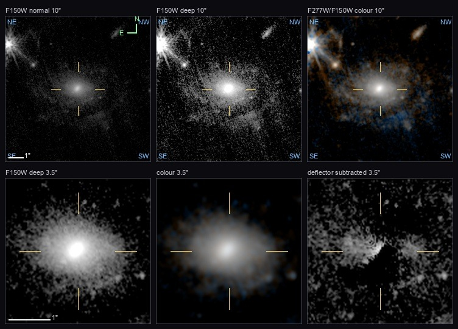{ width="100%" }](img/rank-040-orig.jpg){ target=_blank }
  <figcaption>What the judge saw (blind, footer removed)</figcaption>
</figure>

<figure markdown="span">
  [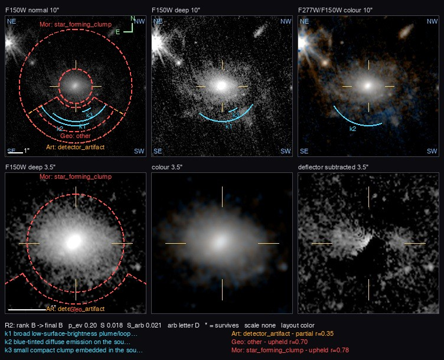{ width="100%" }](img/rank-040-annot.jpg){ target=_blank }
  <figcaption>Advocate evidence (cyan) and critic alternatives coloured by the arbitrator ruling</figcaption>
</figure>

???+ note "Why this grade — advocate, critics, arbitrator"
    **Letter B** (deployed, rule R2) · p_evidence 0.20 · S_arb 0.021 · S 0.018 · scale none

    Letter: letter_rank stands (D rule not met); p_evidence 0.20 >= t_A 0.20 (calibrated at 1% FPR on clean negatives) but A is blocked: only 0 of 3 configuration criteria >= 6; p_evidence 0.20 >= t_B 0.17 (calibrated at 5% FPR on clean negatives).

    **Advocate**

    - criteria: source_contrast 5, low_surface_brightness 6, curvature 3, counter_image 2, arc_morphology 3
    - items (3):
        - k1 — “broad low-surface-brightness plume/loop sweeping across the south and southwest of the deflector, traceable in the normal and deep 10" stretches, mildly concave toward the galaxy” (panel b, r 2.5 arcsec, PA 140->240, visible in direct: yes; criteria: low_surface_brightness, curvature)
        - k2 — “blue-tinted diffuse emission on the south/south-east flank in the two-band colour panel, distinctly bluer than the white/orange deflector envelope and offset from it” (panel c, r 2.8 arcsec, PA 120->200, visible in direct: yes; criteria: source_contrast, low_surface_brightness)
        - k3 — “small compact clump embedded in the southern diffuse emission, unresolved knot with no mirrored partner north of the nucleus” (panel b, r 1.9 arcsec, PA 195->215, visible in direct: yes; criteria: source_contrast, low_surface_brightness)
    - scale galaxy; red neighbours within 10 arcsec 2; BCG-like halo yes; deflector is centre no; arc radius 2.5 arcsec; arc PA span 140->240; centre-of-curvature offset 1.8 arcsec
    - p_evidence: 0.20
    - notes: “The only offset structure is a thick blue-tinted low-surface-brightness plume spanning PA~140-240 at r~2-3" in (a), (b) and (c); it is as wide as it is far from the nucleus, its inferred centre of curvature sits ~1.8" off the ticked galaxy, and no counterpart appears on the northern side, while panel (f) shows only the E-W bright / N-S dark butterfly a circular model leaves on an elliptical and is therefore uninformative inside ~1.5".”

    **Critics**

    **artifact — detector_artifact:** “Field-wide correlated-noise / 1-f striping texture: panel (b) is covered edge-to-edge by fine diagonal streaks at roughly PA 60/240 (visible in the empty NW and SE corners as well as beside the galaxy), and the same streaks carry into the short-wavelength channel of (c), where they render as diffuse blue haze over the whole southern half of the 10" field. The low-surface-brightness 'plume' and the 'blue diffuse flank' sit on top of this texture rather than being discrete, confined structures.”

    - location: r 1.5-4 arcsec, PA 120->240
    - accounts for: k1, k2; leaves standing: k3; strength r 0.35; coverage a 0.667 (geometric), arbitrated a' 0.333
    - scale_class: galaxy
    - measured: `{"bright_star_offset": "saturated star with 6-spike pattern at r ~ 5.2\", PA ~ 48 (NE corner of 10\" panels)", "panel_f_pattern": "bright lobes at PA ~ 90 and ~ 270, r ~ 0.6-1.2\", i.e. the E-W bowtie expected from a circular-profile subtraction of an E-W elongated galaxy - not counted as an item", "spike_position_angles_through_galaxy": "no spike ray from that star crosses PA 140-240 at r 2-3\"; its wings and rays stay on the NE side", "stripe_orientation": "diagonal streak pattern at PA ~ 60/240 covering all four corners of panel (b), amplitude comparable to the claimed plume"}`
    - notes: “The southern 'plume' (item 1, r~2.5", PA 140-240 in b) and the blue southern haze (item 2 in c) lie within the same diagonal streak texture that fills the empty NW/SE corners of panel (b), so their surface brightness is not clearly above the correlated-noise floor; no diffraction spike from the NE star (r~5.2", PA~48) reaches that quadrant, and the compact knot at r~1.9", PA~205 (item 3) is a real point-like source, not an instrumental defect.”
    - ruling: partial, covers k1 — “Panel (b) does carry a fine diagonal streak texture at PA~60/240 across the empty NE/NW/SE corners at an amplitude comparable to the claimed southern plume, so item 1 sits on that noise floor, but the broad blue haze in (c) hugs the galaxy's E-W envelope on all sides rather than following the stripe direction, so item 2 is not accounted for by striping.”

    **geometry — other:** “the deflector's own smooth, mottled elliptical stellar envelope: the 'southern plume' and the 'blue diffuse emission' are simply the SSE/SSW quadrants of the host's E-W elongated isophotes plus low-level speckle, matched in radius and surface brightness by identical emission on the opposite (north) side, so they are not an offset tangential feature”

    - location: r 1.5-3.2 arcsec, PA 120->240
    - accounts for: k1, k2; leaves standing: k3; strength r 0.70; coverage a 0.667 (geometric)
    - scale_class: galaxy
    - measured: `{"centre_of_curvature_offset": "the southern emission's outer boundary is concentric with the host isophotes (offset <0.3 arcsec), i.e. it is an isophote, not an arc standing off the envelope", "clump_item3": "unresolved knot at r~1.9 arcsec PA~205 in panel (b) only (outside the 1.75 arcsec half-field of panels d/e); no tangential elongation measurable, no mirrored partner at PA~25", "counter_image_test": "no distinct counter-arc is required or present because the feature is continuous through all position angles; colour speckle in panel (e) is blue at PA ~40, ~135, ~200 and ~320 alike", "envelope_axis_ratio_and_PA": "b/a ~0.6-0.65, major axis PA ~100-110 deg (E-W) in panels (b) and (d)", "surface_brightness_north_vs_south_at_r2.5": "comparable within the noise: the same mottled grey halo runs from PA 300-30 as from PA 140-240 in panel (b); no azimuthal gap separating the 'plume' from the envelope", "tangential_thickness_vs_radius": "radial width ~1.5 arcsec at r~2.5 arcsec (ratio ~0.6), far too thick for an Einstein arc; an arc would be thinner than its radius"}`
    - notes: “In panel (b) and panel (d) the grey mottled halo at r=2-3 arcsec is present at every position angle (compare PA 340 and PA 200 at the same radius) and its outer boundary follows the host's E-W elliptical isophotes, so the 'south/southwest plume' is the host envelope, not an offset arc; the blue speckle in panel (e) is likewise distributed all round (PA ~40, ~135, ~200, ~320), not confined to the south. The compact knot at r~1.9 arcsec, PA~205 lies outside the 3.5 arcsec zooms and I cannot test its elongation, so I leave item 3 standing.”
    - ruling: upheld, covers k1, k2 — “In (b) and (d) the same mottled grey halo at r~2-3" runs from PA~340 as strongly as from PA~200 and its outer boundary follows the host's b/a~0.6, PA~100 isophotes with <0.3" centre offset, and the radial width (~1.5" at r~2.5") is far too thick for an Einstein arc.”

    **morphology — star_forming_clump:** “The host is a face-on disc/lenticular whose disc is covered in blue star-forming knots and orange dust patches filling a complete annulus at ~1.2-4" at ALL position angles; the cited southern plume, blue flank and knot are simply the southern sector of that 360-degree host disc mottling, not an offset lensed feature.”

    - location: r 1.2-4 arcsec, PA 0->360
    - accounts for: k1, k2, k3; leaves standing: none; strength r 0.78; coverage a 1.00 (geometric)
    - scale_class: galaxy
    - measured: `{"annulus_radius_of_mottling_arcsec": "1.2-4.0", "pa_coverage_of_blue_knots": "continuous, knots at PA ~30-70 (NE), ~120-200 (S/SE), ~200-260 (SW) and ~300-340 (NW) in panels (c) and (e)", "surface_brightness_of_southern_plume_vs_northern_mottle": "indistinguishable by eye in panel (d)", "tangential_arc_at_fixed_radius": "none; no thin, curved, higher-SB feature stands above the general disc mottling"}`
    - notes: “In panel (c) and the 3.5" colour zoom (e) the same blue clumps + orange dust patches appear NE (PA~40, r~2.5"), NW (PA~320, r~2.5") and SW (PA~230) as in the south, so items 1-3 are the southern sector of an azimuthally complete host disc, and the deep panel (d) shows the same grainy halo all round the smooth elliptical core with no thin constant-radius arc; item 3's knot is one of several equal knots (e.g. a comparable knot at PA~60, r~1.8" in (d)) rather than an unmirrored counter-image.”
    - ruling: upheld, covers k1, k2, k3 — “The blue knots and orange dust patches in (c) and (e) form a complete annulus at r~1.2-4" (knots at PA~40, ~135, ~230, ~320 of equal surface brightness), so the southern plume, the blue flank and the r~1.9", PA~205 knot are the southern sector of azimuthally complete host mottling, with a comparable knot at PA~60, r~1.8" in (d).”

    **Arbitrator**

    - surviving items: none (0 of 3)
    - letter_llm: D; scale_class_final: none; needs_human: no
    - rationale: “The ticked galaxy is a smooth E-W elongated early-type (b/a~0.6, major axis PA~100) whose deep-stretch halo in (b) and (d) is grainy at every position angle; the cited 'southern plume' at r~2.5", PA 140-240 has no azimuthal gap separating it from that halo, its boundary is concentric with the host isophotes, and its radial thickness (~1.5" at r~2.5") is over half its radius - an Einstein arc must be thinner than its radius and stand off the envelope. The blue tint on the south flank in (c)/(e) is matched by blue speckle at PA~40, ~135 and ~320 at the same radius, so it is host mottling plus two-band colour noise, not a distinctly bluer offset source, and colour alone could not carry the case in any event. The compact knot at r~1.9", PA~205 is one of several equal-brightness knots (compare PA~60, r~1.8" in d), shows no tangential elongation and has no mirrored partner at PA~25. Panel (f) shows exactly the E-W bright / N-S dark bowtie that a circular radial-profile subtraction leaves on an elliptical galaxy - an artefact of the model, not sky - and contains no offset tangential feature at constant radius traceable back into (d) or (e). Field-wide diagonal striping in (b) further depresses confidence in the faintest of the claimed structure. With every located item accounted for by the host-envelope/host-mottling alternatives and nothing surviving, this is not a lens candidate.”

    **Score**

    - S = p_ev x prod(1 - r_i a_i) = 0.20 x (1 - 0.35x0.667) x (1 - 0.70x0.667) x (1 - 0.78x1.00) = 0.018
        - terms: artifact detector_artifact r 0.35 a 0.667; geometry other r 0.70 a 0.667; morphology star_forming_clump r 0.78 a 1.00
    - S_arb = p_ev x prod_{upheld/partial}(1 - r_i a_i') = 0.20 x (1 - 0.35x0.333) x (1 - 0.70x0.667) x (1 - 0.78x1.00) = 0.021
        - terms: artifact detector_artifact r 0.35 a' 0.333 (partial); geometry other r 0.70 a 0.667 (upheld); morphology star_forming_clump r 0.78 a 1.00 (upheld)
    - stored grade_pred (on S): C — S 0.018 < t_B 0.17 (calibrated at 5% FPR on clean negatives); not D: 3 item(s) located; no named critic covers every item at r >= 0.80
    - stored letter_arb (on S_arb): C; letter_source: opus5_api_calibrated
    - deploy rule R2: letter_rank (advocate only, on p_evidence) = B — p_evidence 0.20 >= t_A 0.20 (calibrated at 1% FPR on clean negatives) but A is blocked: only 0 of 3 configuration criteria >= 6; p_evidence 0.20 >= t_B 0.17 (calibrated at 5% FPR on clean negatives)
    - deploy rule R2: letter_final = B — letter_rank stands (D rule not met); p_evidence 0.20 >= t_A 0.20 (calibrated at 1% FPR on clean negatives) but A is blocked: only 0 of 3 configuration criteria >= 6; p_evidence 0.20 >= t_B 0.17 (calibrated at 5% FPR on clean negatives)
    - veto: none (letter_final == letter_rank)

---

## Rank 41: J34708849-217825 {#rank-41}

| Original grade | Passes | Inspector conf. | Pipeline θ_E |
|:--:|:--:|:--:|:--:|
| **U** | — | 27 | 0.95″ |

| New (final) | Rank letter | p_ev | S_arb | Demoted by | Arb. letter | Needs human |
|:--:|:--:|--:|--:|:--|:--:|:--:|
| **B** | B | 0.17 | 0.024 | — | D | no |

<small>pipeline discovery status `new` · scale class `galaxy`</small>

<figure markdown="span">
  [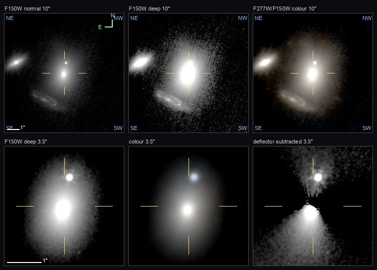{ width="100%" }](img/rank-041-orig.jpg){ target=_blank }
  <figcaption>What the judge saw (blind, footer removed)</figcaption>
</figure>

<figure markdown="span">
  [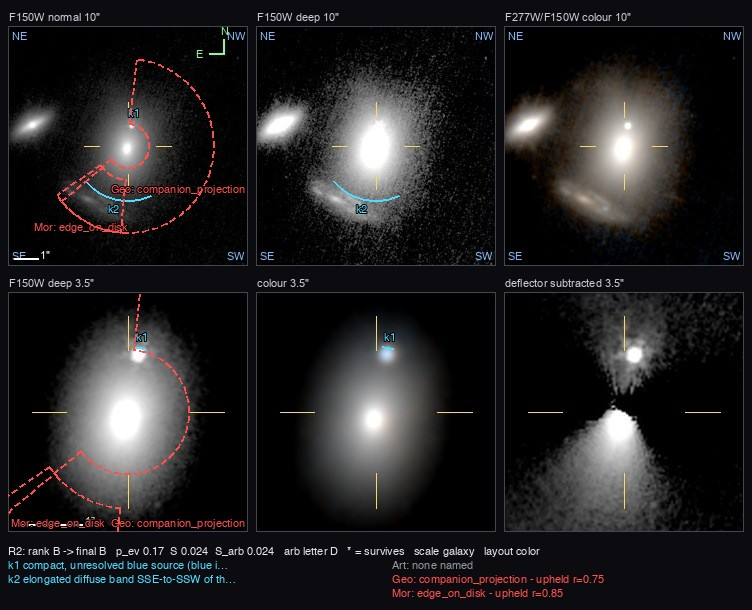{ width="100%" }](img/rank-041-annot.jpg){ target=_blank }
  <figcaption>Advocate evidence (cyan) and critic alternatives coloured by the arbitrator ruling</figcaption>
</figure>

???+ note "Why this grade — advocate, critics, arbitrator"
    **Letter B** (deployed, rule R2) · p_evidence 0.17 · S_arb 0.024 · S 0.024 · scale galaxy

    Letter: letter_rank stands (D rule not met); p_evidence 0.17 >= t_B 0.17 (calibrated at 5% FPR on clean negatives); p_evidence 0.17 < t_A 0.20 (calibrated at 1% FPR on clean negatives).

    **Advocate**

    - criteria: source_contrast 6, low_surface_brightness 5, curvature 2, counter_image 1, arc_morphology 3
    - items (2):
        - k1 — “compact, unresolved blue source (blue in (e), point-like in (d)) sitting on the deflector envelope ~1" NNW of the nucleus; strongly different in colour and profile from the red deflector, but no counter-image found at the mirrored position” (panel e, r 0.95 arcsec, PA 344->354, visible in direct: yes; criteria: source_contrast)
        - k2 — “elongated diffuse band SSE-to-SSW of the deflector, brightest ridge running roughly PA 73/253 (i.e. broadly tangential at its mid-point) with a knotty east end and a bluish west end; its radius, however, grows from ~1.6" at the WSW end to ~3.5" at the ENE end rather than staying constant” (panel b, r 2.3 arcsec, PA 130->205, visible in direct: yes; criteria: low_surface_brightness, arc_morphology)
    - scale galaxy; red neighbours within 10 arcsec 2; BCG-like halo yes; deflector is centre yes; arc radius 2.3 arcsec; arc PA span 130->205; centre-of-curvature offset 2 arcsec
    - p_evidence: 0.17
    - notes: “The only two located features are a blue point-like source 0.95" NNW of the nucleus with no mirrored counter-image (the opposite side is buried in the saturated core in (d) and in the N-S bowtie of (f), so that side is uninformative) and a diffuse SSE band whose distance from the ticked galaxy varies by more than a factor of two along its length, i.e. it reads more like an inclined/edge-on companion or tidal band than a fixed-radius arc.”

    **Critics**

    **artifact — no alternative named (nothing in its competence fits)**

    - leaves standing: k1, k2
    - scale_class: galaxy
    - measured: `{"diffraction_spikes_around_item1": "none - no 6-ray pattern at the fixed NIRCam angles in (a), (b), (d) or (f)", "field_artefact_check": "no 1/f striping, mosaic seam, dither edge or saturation bleed anywhere in (a),(b),(c)", "item1_band_presence": "present in the F150W deep zoom (d) and in the two-band colour (e), i.e. not a single-frame event", "item1_position": "r ~0.95\", PA ~349 deg from tick centre", "item1_profile": "compact, FWHM ~4-5 px, round, with a faint symmetric halo; no snowball ring, no charge trail, no persistence smear", "item2_geometry": "diffuse elongated band 1.6-3.5\" S/SSE, curved-edged and knotty - not straight, not at a fixed detector angle, so not a spike or stripe"}`
    - notes: “Both items are present in the un-subtracted panels ((d)/(e) for item 1, (a)/(b)/(c) for item 2), so subtraction_residual is inadmissible; the only structure unique to (f) is the vertical N-S bowtie about the core, which is the stated artefact of the circular profile model. The compact NNW source at r~0.95", PA~349 shows no 6-spike pattern, no snowball ring and no persistence trail, and the southern band is knotty and curved rather than a straight detector feature - I have no instrumental alternative for either item.”
    - ruling: no ruling for this critic

    **geometry — companion_projection:** “Two unrelated neighbours superposed on the deflector envelope: (i) a compact, round, PSF-like blue source 0.95" NNW with no tangential elongation and no counter-image, and (ii) a separate inclined disc galaxy ~2-3" S/SSE with its OWN bright nucleus and a straight ENE-WSW major axis whose distance from the deflector grows from ~1.6" to ~3.5" - neither is a fixed-radius image of a common source, and they are not a mutually compatible image pair (radii 0.95" vs 1.6-3.5", PAs 349 vs 130-205, point-like vs extended-with-nucleus).”

    - location: r 0.9-3.6 arcsec, PA 130->354
    - accounts for: k1, k2; leaves standing: none; strength r 0.75; coverage a 1.00 (geometric)
    - scale_class: galaxy
    - measured: `{"deflector_isophote_pa_deg": "~5-10 (N-S elongated envelope), unrelated to item2 ridge PA", "item1_axis_ratio": "~1.0 (round, unresolved; no tangential elongation)", "item1_counter_image_at_pa_169_r_0.95": "absent in (d) and (b) - envelope smooth there", "item1_pa_deg": 349, "item1_radius_arcsec": 0.95, "item2_centre_of_curvature_offset_arcsec": ">3 (ridge is straight/convex away from deflector, not concentric)", "item2_own_nucleus": "compact core visible in (b) at r~2.6\", PA~150 inside the band", "item2_radius_span_arcsec": "1.6 (WSW end) to 3.5 (ENE end), delta_r/r ~ 0.8", "item2_ridge_pa_deg": "73/253 (straight)", "profile_consistency_of_items_1_and_2": "inconsistent: unresolved point-like vs extended low-surface-brightness disc with nucleus"}`
    - notes: “In (d)/(e) the NNW source at r=0.95", PA~349 is a round unresolved blob sitting on a smooth envelope - no arc-like stretch and no trace of a mirrored image at PA~169, so it is a superposed compact object, not one of an image pair. In (b) the southern 'band' is plainly a second galaxy: a straight ENE-WSW ridge with its own compact nucleus (r~2.6", PA~150) whose separation from the ticked galaxy climbs from ~1.6" to ~3.5" along its length, i.e. not tangential at fixed radius and not centred on the deflector.”
    - ruling: upheld, covers k1, k2 — “In (d)/(e) the NNW object at r~0.95", PA~349 is a round, unresolved, un-sheared blob on an otherwise smooth envelope with no mirrored image at PA~169, and in (a)/(b)/(c) the southern feature is a separate galaxy with its own compact nucleus whose separation from the ticks climbs from ~1.6" to ~3.5" along a straight ENE-WSW ridge - neither is a fixed-radius image of a common source.”

    **morphology — edge_on_disk:** “The SSE 'band' is a separate inclined/edge-on disk galaxy projected ~2.7" from the deflector: it has its own bright compact nucleus at the mid-point of the ridge, is straight and two-sided/symmetric about that nucleus (major axis PA ~73/253), and is one of at least two similar inclined disks in the field (a second, brighter edge-on disk lies ~4" ENE at PA ~70 in panel (c)).”

    - location: r 1.4-3.6 arcsec, PA 125->175
    - accounts for: k2; leaves standing: k1; strength r 0.85; coverage a 0.50 (geometric)
    - scale_class: galaxy
    - measured: `{"companion_centroid": "r ~2.7\" at PA ~146 (panel c, ~70 px E and ~105 px S of the ticks at 46 px/arcsec)", "own_nucleus": "compact bright core at the ridge mid-point, light falling symmetrically to both ends", "radius_along_ridge": "varies ~1.6\" (WSW end) to ~3.5\" (ENE end) - not a fixed-radius arc", "ridge_position_angle": "~73/253, straight, no measurable curvature about the deflector", "similar_neighbour": "second inclined disk with bright core at r ~4.2\", PA ~70 in panel (c)"}`
    - notes: “In panel (c), lower-left of the ticks, the feature is plainly a resolved inclined disk galaxy with its own nucleus at r~2.7", PA~146: straight major axis PA 73/253, light symmetric about ITS core, no stellar bridge to and no concentricity with the deflector, and its distance from the deflector changes by 2" along its length. Item 1 (the compact blue blob at r~0.95", PA~349 in (d)/(e)) is left standing - it is round and unsheared, but I cannot decide between a compact companion/clump and a lensed image from these panels.”
    - ruling: upheld, covers k2 — “Panel (c) lower-left of the ticks resolves the 'band' into an inclined disc with a bright core at its ridge mid-point (r~2.7", PA~146), light falling symmetrically to both ends along a straight PA 73/253 major axis, matching a second similar inclined disc ~4" ENE.”

    **Arbitrator**

    - surviving items: none (0 of 2)
    - letter_llm: D; scale_class_final: galaxy; needs_human: no
    - rationale: “Only two features were ever located, and both are accounted for by upheld non-lens alternatives. The compact source ~0.95" NNW of the ticked nucleus is round and point-like in the 3.5" deep panel (d), blue and unresolved in (e), and shows as a sharp near-PSF knot in the subtracted panel (f) with no tangential stretch at all; the mirrored position at PA~169, r~0.95" is a smooth, featureless envelope in both (d) and (b), so there is no image pair - a superposed compact companion or foreground object is the natural reading. The southern 'band' is unambiguously a resolved inclined disc galaxy at JWST resolution: in (b) and (c) it carries its own compact nucleus at the mid-point of a straight ENE-WSW ridge (PA ~73/253), the light falls symmetrically to both ends about that nucleus, and its distance from the deflector varies from ~1.6" at the WSW end to ~3.5" at the ENE end, i.e. delta_r/r ~0.8 - the opposite of a fixed-radius tangential arc, and a near-twin of the brighter inclined disc ~4" ENE. The artifact critic found no instrumental origin for either feature, but that leaves them as real sky objects, not as lensing evidence; the only structure unique to (f) is the N-S bowtie about the core, the stated artefact of the circular profile subtraction. With no curvature concentric on the ticked galaxy, no counter-image and no surface-brightness-matched partner, nothing survives, and a reviewer would add nothing here.”

    **Score**

    - S = p_ev x prod(1 - r_i a_i) = 0.17 x (1 - 0.75x1.00) x (1 - 0.85x0.50) = 0.024
        - terms: geometry companion_projection r 0.75 a 1.00; morphology edge_on_disk r 0.85 a 0.50
    - S_arb = p_ev x prod_{upheld/partial}(1 - r_i a_i') = 0.17 x (1 - 0.75x1.00) x (1 - 0.85x0.50) = 0.024
        - terms: geometry companion_projection r 0.75 a 1.00 (upheld); morphology edge_on_disk r 0.85 a 0.50 (upheld)
    - stored grade_pred (on S): C — S 0.024 < t_B 0.17 (calibrated at 5% FPR on clean negatives); not D: 2 item(s) located; no named critic covers every item at r >= 0.80
    - stored letter_arb (on S_arb): C; letter_source: opus5_api_calibrated
    - deploy rule R2: letter_rank (advocate only, on p_evidence) = B — p_evidence 0.17 >= t_B 0.17 (calibrated at 5% FPR on clean negatives); p_evidence 0.17 < t_A 0.20 (calibrated at 1% FPR on clean negatives)
    - deploy rule R2: letter_final = B — letter_rank stands (D rule not met); p_evidence 0.17 >= t_B 0.17 (calibrated at 5% FPR on clean negatives); p_evidence 0.17 < t_A 0.20 (calibrated at 1% FPR on clean negatives)
    - veto: none (letter_final == letter_rank)

---

## Rank 42: J12411163+1923209 {#rank-42}

| Original grade | Passes | Inspector conf. | Pipeline θ_E |
|:--:|:--:|:--:|:--:|
| **U** | — | 27 | 1.90″ |

| New (final) | Rank letter | p_ev | S_arb | Demoted by | Arb. letter | Needs human |
|:--:|:--:|--:|--:|:--|:--:|:--:|
| **C** | C | 0.12 | 0.120 | — | — | no |

<small>pipeline discovery status `new` · scale class `none`</small>

<figure markdown="span">
  [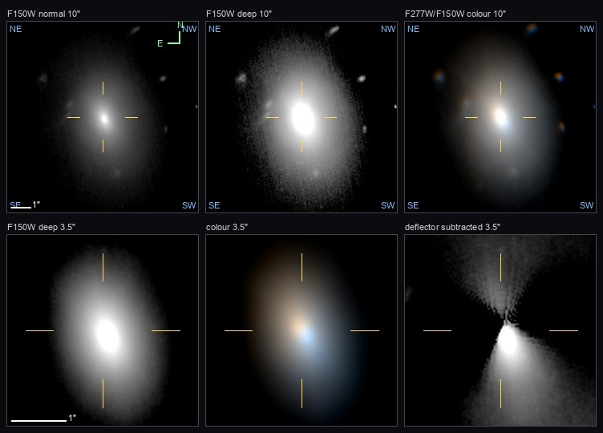{ width="100%" }](img/rank-042-orig.jpg){ target=_blank }
  <figcaption>What the judge saw (blind, footer removed)</figcaption>
</figure>

<figure markdown="span">
  [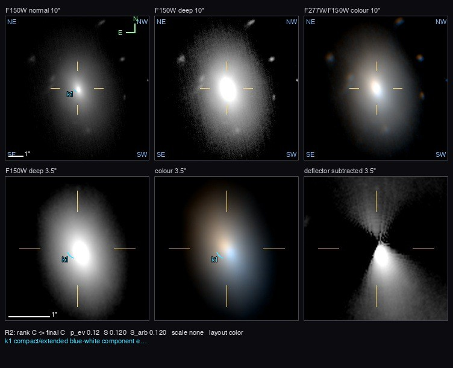{ width="100%" }](img/rank-042-annot.jpg){ target=_blank }
  <figcaption>Advocate evidence (cyan) and critic alternatives coloured by the arbitrator ruling</figcaption>
</figure>

???+ note "Why this grade — advocate, critics, arbitrator"
    **Letter C** (deployed, rule R2) · p_evidence 0.12 · S_arb 0.12 · S 0.12 · scale none

    Letter: letter_rank stands (D rule not met); p_evidence 0.12 < t_B 0.17 (calibrated at 5% FPR on clean negatives); not D: 1 item(s) located; no named critic covers every item at r >= 0.80.

    **Advocate**

    - criteria: source_contrast 5, low_surface_brightness 3, curvature 0, counter_image 0, arc_morphology 1
    - items (1):
        - k1 — “compact/extended blue-white component embedded in the orange envelope, seen as the bright inner blob in the deep zoom (d) and as the distinctly blue patch in (e), its centroid sitting ~0.2-0.3" SE of the red envelope's photometric centre; no tangential elongation, no second image” (panel e, r 0.25 arcsec, PA 110->160, visible in direct: yes; criteria: source_contrast, low_surface_brightness)
    - scale none; red neighbours within 10 arcsec 3; BCG-like halo yes; deflector is centre yes
    - p_evidence: 0.12
    - notes: “Scanning both rows out to ~5" I find only point-like/compact neighbours at r~3-4" (NE ~3.8" PA~58, NW ~3.2" PA~300, SW ~3.9" PA~237) with no tangential elongation and no matched pair straddling the nucleus; the only intra-galaxy feature is the blue inner component in (e) which coincides with the bright, differently-oriented inner disc/bar seen in (d) (outer envelope major axis ~N-S, inner bright structure ~SE-NW), and the (f) residual shows only the vertical bowtie plus a small off-centre dipole blob 0.2" S of the tick centre, i.e. exactly the artefacts the circular-profile subtraction is stated to produce.”

    **Critics**

    - not called (p_evidence 0.12 < tau0 0.15)

    **Arbitrator**

    - no arbitrator record (not called)

    **Score**

    - S = p_ev = 0.12 (no critic term entered the product)
    - S_arb = p_ev = 0.12 (no critic term entered the product)
    - stored grade_pred (on S): C — S 0.12 < t_B 0.17 (calibrated at 5% FPR on clean negatives); not D: 1 item(s) located; no named critic covers every item at r >= 0.80
    - stored letter_arb (on S_arb): C; letter_source: opus5_api_calibrated
    - deploy rule R2: letter_rank (advocate only, on p_evidence) = C — p_evidence 0.12 < t_B 0.17 (calibrated at 5% FPR on clean negatives); not D: 1 item(s) located; no named critic covers every item at r >= 0.80
    - deploy rule R2: letter_final = C — letter_rank stands (D rule not met); p_evidence 0.12 < t_B 0.17 (calibrated at 5% FPR on clean negatives); not D: 1 item(s) located; no named critic covers every item at r >= 0.80
    - veto: none (letter_final == letter_rank)

---

## Rank 43: J15049363+206401 {#rank-43}

| Original grade | Passes | Inspector conf. | Pipeline θ_E |
|:--:|:--:|:--:|:--:|
| **U** | — | 27 | — |

| New (final) | Rank letter | p_ev | S_arb | Demoted by | Arb. letter | Needs human |
|:--:|:--:|--:|--:|:--|:--:|:--:|
| **C** | C | 0.12 | 0.120 | — | — | no |

<small>pipeline discovery status `new` · scale class `group`</small>

<figure markdown="span">
  [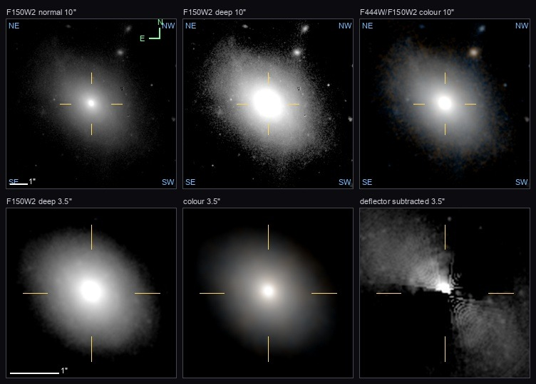{ width="100%" }](img/rank-043-orig.jpg){ target=_blank }
  <figcaption>What the judge saw (blind, footer removed)</figcaption>
</figure>

<figure markdown="span">
  [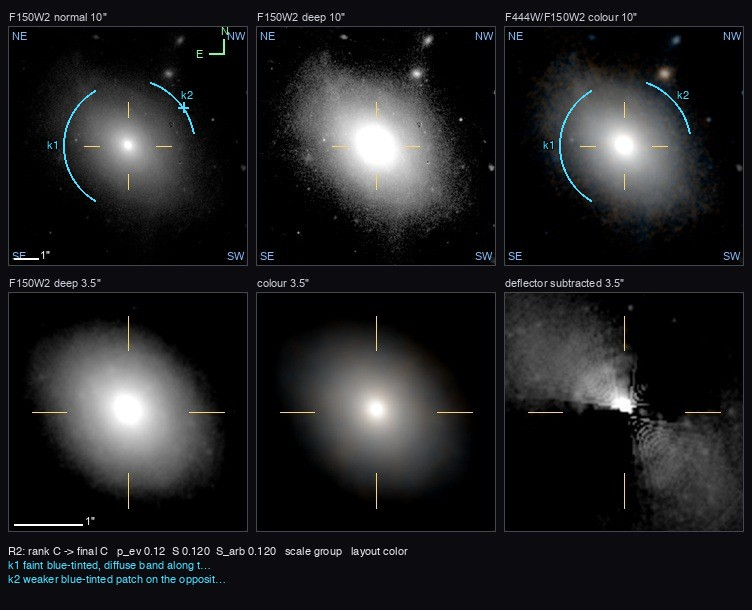{ width="100%" }](img/rank-043-annot.jpg){ target=_blank }
  <figcaption>Advocate evidence (cyan) and critic alternatives coloured by the arbitrator ruling</figcaption>
</figure>

???+ note "Why this grade — advocate, critics, arbitrator"
    **Letter C** (deployed, rule R2) · p_evidence 0.12 · S_arb 0.12 · S 0.12 · scale group

    Letter: letter_rank stands (D rule not met); p_evidence 0.12 < t_B 0.17 (calibrated at 5% FPR on clean negatives); not D: 2 item(s) located; no named critic covers every item at r >= 0.80.

    **Advocate**

    - criteria: source_contrast 4, low_surface_brightness 5, curvature 3, counter_image 3, arc_morphology 2
    - items (2):
        - k1 — “faint blue-tinted, diffuse band along the eastern edge of the halo in the two-band colour panel, distinct in hue from the white/orange deflector light interior to it; no matching filament in the deep grayscale panel” (panel c, r 2.7 arcsec, PA 30->150, visible in direct: yes; criteria: source_contrast, low_surface_brightness)
        - k2 — “weaker blue-tinted patch on the opposite (WNW) side of the halo at a comparable radius, the only candidate counterpart to item 1” (panel c, r 2.8 arcsec, PA 280->340, visible in direct: yes; criteria: source_contrast, counter_image)
    - scale group; red neighbours within 10 arcsec 1; BCG-like halo yes; deflector is centre yes; arc radius 2.7 arcsec; arc PA span 30->150; counter-image at r 2.8 arcsec PA 305; centre-of-curvature offset 1 arcsec
    - p_evidence: 0.12
    - notes: “The centre is a bright, smooth, boxy elliptical/S0 with a very extended envelope; the only non-smooth signal is a faint blue colour fringe along the E (and weakly WNW) halo edge in (c) at r~2.5-3" that has NO corresponding surface-brightness structure in the deep panels (b) or (d), and (f) shows only the bowtie/concentric-ringing artefacts the VIEW attributes to the circular subtraction, so it is uninformative inside ~1.5".”

    **Critics**

    - not called (p_evidence 0.12 < tau0 0.15)

    **Arbitrator**

    - no arbitrator record (not called)

    **Score**

    - S = p_ev = 0.12 (no critic term entered the product)
    - S_arb = p_ev = 0.12 (no critic term entered the product)
    - stored grade_pred (on S): C — S 0.12 < t_B 0.17 (calibrated at 5% FPR on clean negatives); not D: 2 item(s) located; no named critic covers every item at r >= 0.80
    - stored letter_arb (on S_arb): C; letter_source: opus5_api_calibrated
    - deploy rule R2: letter_rank (advocate only, on p_evidence) = C — p_evidence 0.12 < t_B 0.17 (calibrated at 5% FPR on clean negatives); not D: 2 item(s) located; no named critic covers every item at r >= 0.80
    - deploy rule R2: letter_final = C — letter_rank stands (D rule not met); p_evidence 0.12 < t_B 0.17 (calibrated at 5% FPR on clean negatives); not D: 2 item(s) located; no named critic covers every item at r >= 0.80
    - veto: none (letter_final == letter_rank)

---

## Rank 44: J26807645+6520932 {#rank-44}

| Original grade | Passes | Inspector conf. | Pipeline θ_E |
|:--:|:--:|:--:|:--:|
| **U** | — | 27 | 0.98″ |

| New (final) | Rank letter | p_ev | S_arb | Demoted by | Arb. letter | Needs human |
|:--:|:--:|--:|--:|:--|:--:|:--:|
| **B** | B | 0.17 | 0.038 | — | D | no |

<small>pipeline discovery status `new` · scale class `galaxy`</small>

<figure markdown="span">
  [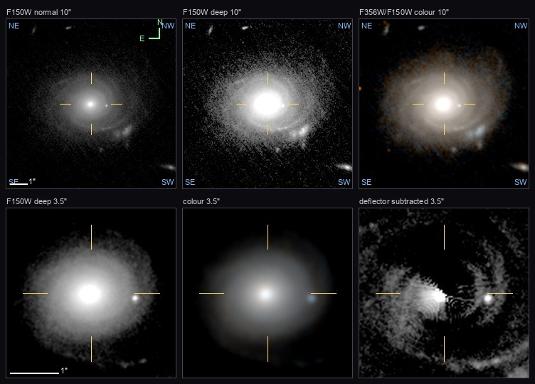{ width="100%" }](img/rank-044-orig.jpg){ target=_blank }
  <figcaption>What the judge saw (blind, footer removed)</figcaption>
</figure>

<figure markdown="span">
  [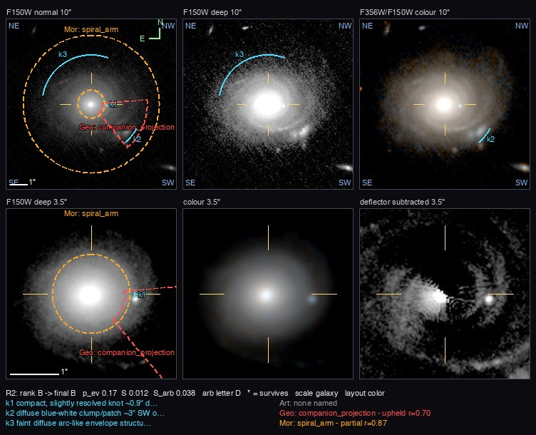{ width="100%" }](img/rank-044-annot.jpg){ target=_blank }
  <figcaption>Advocate evidence (cyan) and critic alternatives coloured by the arbitrator ruling</figcaption>
</figure>

???+ note "Why this grade — advocate, critics, arbitrator"
    **Letter B** (deployed, rule R2) · p_evidence 0.17 · S_arb 0.038 · S 0.012 · scale galaxy

    Letter: letter_rank stands (D rule not met); p_evidence 0.17 >= t_B 0.17 (calibrated at 5% FPR on clean negatives); p_evidence 0.17 < t_A 0.20 (calibrated at 1% FPR on clean negatives).

    **Advocate**

    - criteria: source_contrast 4, low_surface_brightness 3, curvature 2, counter_image 1, arc_morphology 2
    - items (3):
        - k1 — “compact, slightly resolved knot ~0.9" due west of the nucleus, whiter/bluer than the yellow-orange envelope in (e), bright and clearly one-sided in the subtracted panel (f) where it sits outside the butterfly lobes; no tangential elongation, treated as a candidate lensed knot” (panel d, r 0.9 arcsec, PA 264->273, visible in direct: yes; criteria: source_contrast)
        - k2 — “diffuse blue-white clump/patch ~3" SW of the deflector, extended (several px across) and distinctly bluer than the deflector in (c); no counterpart at matching radius on the NE side” (panel c, r 3 arcsec, PA 222->242, visible in direct: yes; criteria: source_contrast, low_surface_brightness)
        - k3 — “faint diffuse arc-like envelope structure at r~2.5-3.5" in the deep 10" stretch, curving around the N/NE and S sides; radius appears to grow with azimuth and it connects smoothly to the inner envelope (spiral-arm/ring-like), listed for the critics to test” (panel b, r 2.9 arcsec, PA 340->80, visible in direct: yes; criteria: low_surface_brightness, curvature)
    - scale galaxy; red neighbours within 10 arcsec 1; BCG-like halo yes; deflector is centre yes
    - p_evidence: 0.17
    - notes: “The only compact off-nuclear source is the knot 0.9" west (bright in d/e and as a one-sided point residual in f) but no matching image appears within 40% of that radius on the east side, and the deep 10" panel shows the host's envelope carrying spiral/ring-like arms whose radius grows with azimuth rather than a thin fixed-radius tangential arc.”

    **Critics**

    **artifact — no alternative named (nothing in its competence fits)**

    - leaves standing: k1, k2, k3
    - scale_class: galaxy
    - measured: `{"f_panel_artefacts": "concentric bright/dark rings and the four-lobed pattern about the core in (f) are the expected circular-profile subtraction artefacts and were not counted", "k2_test": "the SW clump at r~3.0\", PA~222-242 appears in (a), (b) and (c) alike with the same extended shape - a real sky object, not a snowball, cosmic ray or persistence blob (those would be single-band, sharp-edged)", "k3_test": "the r~2.5-3.5\" arc/ring structure over PA~340-80 is traceable in normal-stretch (a) and colour (c), not only in the deep panel, so it is not 1/f striping, low-coverage noise or a dither/mosaic edge; no rectangular seam or amplifier stripe crosses the stamp", "knot_k1_position": "r~0.9\", PA~268 deg, present as a compact source in un-subtracted (a) and (d) as well as in (f) - not a subtraction residual", "spike_test": "no straight radial rays at fixed PA from the core in (a) or (b); the six-spike pattern is absent, and k1 is a round few-px source, not a ray"}`
    - notes: “Nothing instrumental fits: the west knot (r~0.9", PA~268) is a compact source already visible in the un-subtracted (a) and (d), sits off any spike axis, and the field shows no diffraction spikes, snowballs, striping or mosaic seams; the SW clump and the 2.5-3.5" NE/S envelope structure both persist in the direct panels, so they are sky, not reduction. Whether they are lensing or host structure is outside my competence.”
    - ruling: no ruling for this critic

    **geometry — companion_projection:** “Two unrelated, uncorrelated objects projected on the host's envelope: a compact round point-like source 0.9" W of the nucleus (round, unresolved-to-barely-resolved, no tangential stretch, no counter-image on the E side) and a separate diffuse clump ~3" SW with no partner at matching radius on the NE side - i.e. two independent field/host-associated blobs, not a multiply-imaged system.”

    - location: r 0.7-3.3 arcsec, PA 220->275
    - accounts for: k1, k2; leaves standing: k3; strength r 0.70; coverage a 0.667 (geometric)
    - scale_class: galaxy
    - measured: `{"curvature_centre_offset_arcsec": "not measurable - neither item shows resolved curvature to fit a centre", "item1_axis_ratio_tangential_over_radial": "~1.0 (round blob ~0.15-0.2\" across in panel d and e; no arc curvature)", "item1_counter_image_search": "none at r=0.8-1.1\", PA 80-100 in (d) or (e); envelope there is smooth", "item1_pa_deg": 268, "item1_radius_arcsec": 0.9, "item2_counter_image_search": "no source at r=2.7-3.3\", PA 30-70 in (b)", "item2_radius_arcsec": 3.0, "pa_separation_item1_item2_deg": 35, "radius_ratio_item1_item2": 3.3}`
    - notes: “In (d)/(e) the western knot (right of centre, just below the E-W tick line, r~0.9") is a compact ROUND source with no tangential elongation and nothing at all at the mirror position 0.9" east, so it cannot be one image of a lensed pair; the SW clump at r~3" in (b) is a distinct object at a completely different radius and PA with no NE counterpart. The N/NE-S envelope structure (item 3) is a host-morphology question and I leave it standing.”
    - ruling: upheld, covers k1, k2 — “In (d)/(e) the source at r~0.9", PA~268 is a round few-pixel blob with axis ratio ~1 and the envelope at the mirror position PA~88 is perfectly smooth, and the SW clump at r~3" has no partner at r=2.7-3.3", PA 30-70 in (b), so both are uncorrelated projections rather than images of one source.”

    **morphology — spiral_arm:** “The ticked galaxy is a face-on, multi-armed (inner-ring/grand-design) disc: in panel (c) two continuous stellar arms wind out of the bright bulge, brightening from r~1.5" to r~3.5" as azimuth increases, dust-flecked on the E side and studded with blue star-forming knots on the SW arm; the 'arc' and the blue clumps are arm segments and HII complexes, and the compact 0.9" W knot is a clump/cluster on the inner arm.”

    - location: r 0.8-4 arcsec, PA 0->360
    - accounts for: k1, k2, k3; leaves standing: none; strength r 0.87; coverage a 1.00 (geometric), arbitrated a' 0.667
    - scale_class: galaxy
    - measured: `{"arm_radius_vs_azimuth_NE": "r~2.4\" at PA~30 growing to r~3.6\" at PA~85, continuous with the inner envelope", "arm_radius_vs_azimuth_SW": "r~2.0\" at PA~195 growing to r~3.4\" at PA~250 in panel (c) - monotonic increase, not constant radius", "bridge_test": "both arms traceable inward without a gap to the bulge in (c) and (d): continuous stellar bridge to the nucleus", "knot_item1": "FWHM ~4-5 px, round, no tangential elongation, axis ratio ~1, sits on the inner arm crossing PA~270 at r~0.9\"", "ring_centring": "inner light ring/arm system concentric on the host nucleus, same surface-brightness profile and hue (pale yellow-white) as the disc"}`
    - notes: “In panel (c) the light outside the bulge is not a fixed-radius ring: two arms spiral out (SW arm from r~2.0" at PA 195 to r~3.4" at PA 250, carrying the blue knots of item 2 near PA 230; NE/N arm from r~2.4" at PA 30 to r~3.6" at PA 85, which is item 3), each joined continuously to the bulge in (d). The item-1 knot at r=0.9", PA~268 is round and unelongated, lying on the inner arm - a disc clump, not a tangential arc, and it has no counter-image at PA~88.”
    - ruling: partial, covers k2, k3 — “Panels (b) and (c) show two continuous stellar arms winding out of the bulge with radius growing from ~2.0" at PA~195 to ~3.4" at PA~250 (carrying the blue SW knot of item 2) and from ~2.4" at PA~30 to ~3.6" at PA~85 (item 3), joined to the nucleus without a gap; the compact, un-elongated 0.9" W knot is better explained as an unrelated/embedded point source than as arm structure, so item 1 is left to geometry.”

    **Arbitrator**

    - surviving items: none (0 of 3)
    - letter_llm: D; scale_class_final: galaxy; needs_human: no
    - rationale: “The ticked galaxy is unambiguously a face-on, inner-ringed multi-armed disc at JWST resolution: in the 10" deep panel (b) and the colour panel (c) the light outside the bulge is not a thin fixed-radius ring but two arms whose radius grows monotonically with azimuth (SW arm ~2.0"->3.4" over PA 195-250, NE/N arm ~2.4"->3.6" over PA 30-85), each traceable inward without a break to the bulge, dust-flecked on the E side and studded with blue star-forming knots - so item 3 is an arm and item 2 is an HII complex on the SW arm, not a lensed image. The one compact off-nuclear source, item 1 at r~0.9", PA~268, is round (axis ratio ~1, FWHM ~4-5 px in d/e), shows no tangential stretch, and has absolutely nothing at the mirror position PA~88 at the same radius in either (d) or (e); the bright one-sided point in (f) is simply that same source surviving the circular-profile subtraction, while the butterfly lobes and concentric rings around the core in (f) are the expected artefacts of the azimuthally-averaged model and were correctly not counted. The artifact critic found no instrumental explanation and named none, which is consistent: these are real sky features, just not lensing ones. With every located item accounted for by an upheld or partially upheld alternative and no tangential feature at constant radius anywhere in the direct panels, this is a non-lens; no deeper data are needed to settle it.”

    **Score**

    - S = p_ev x prod(1 - r_i a_i) = 0.17 x (1 - 0.70x0.667) x (1 - 0.87x1.00) = 0.012
        - terms: geometry companion_projection r 0.70 a 0.667; morphology spiral_arm r 0.87 a 1.00
    - S_arb = p_ev x prod_{upheld/partial}(1 - r_i a_i') = 0.17 x (1 - 0.70x0.667) x (1 - 0.87x0.667) = 0.038
        - terms: geometry companion_projection r 0.70 a 0.667 (upheld); morphology spiral_arm r 0.87 a' 0.667 (partial)
    - stored grade_pred (on S): D — S 0.012 < t_B 0.17 (calibrated at 5% FPR on clean negatives) and morphology (spiral_arm) covers every item at r 0.87 >= 0.80
    - stored letter_arb (on S_arb): C; letter_source: opus5_api_calibrated
    - deploy rule R2: letter_rank (advocate only, on p_evidence) = B — p_evidence 0.17 >= t_B 0.17 (calibrated at 5% FPR on clean negatives); p_evidence 0.17 < t_A 0.20 (calibrated at 1% FPR on clean negatives)
    - deploy rule R2: letter_final = B — letter_rank stands (D rule not met); p_evidence 0.17 >= t_B 0.17 (calibrated at 5% FPR on clean negatives); p_evidence 0.17 < t_A 0.20 (calibrated at 1% FPR on clean negatives)
    - veto: none (letter_final == letter_rank)

---

## Rank 45: J8570140-2144889 {#rank-45}

| Original grade | Passes | Inspector conf. | Pipeline θ_E |
|:--:|:--:|:--:|:--:|
| **U** | — | 27 | 1.70″ |

| New (final) | Rank letter | p_ev | S_arb | Demoted by | Arb. letter | Needs human |
|:--:|:--:|--:|--:|:--|:--:|:--:|
| **C** | C | 0.14 | 0.140 | — | — | no |

<small>pipeline discovery status `new` · scale class `galaxy`</small>

<figure markdown="span">
  [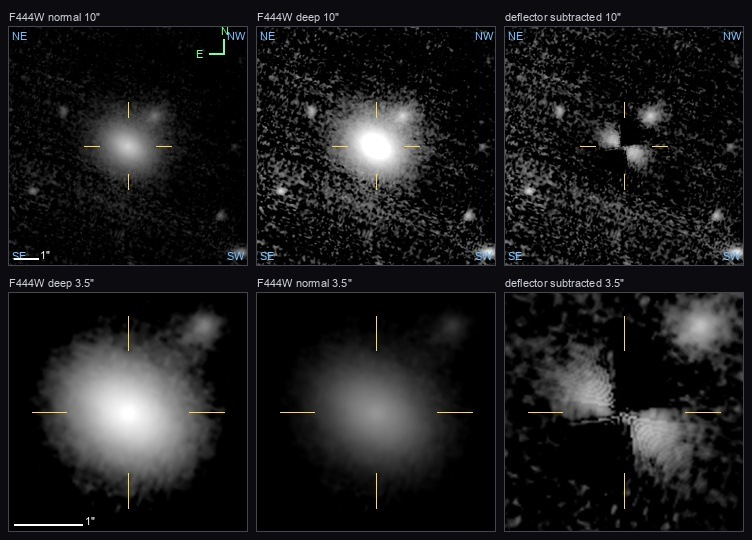{ width="100%" }](img/rank-045-orig.jpg){ target=_blank }
  <figcaption>What the judge saw (blind, footer removed)</figcaption>
</figure>

<figure markdown="span">
  [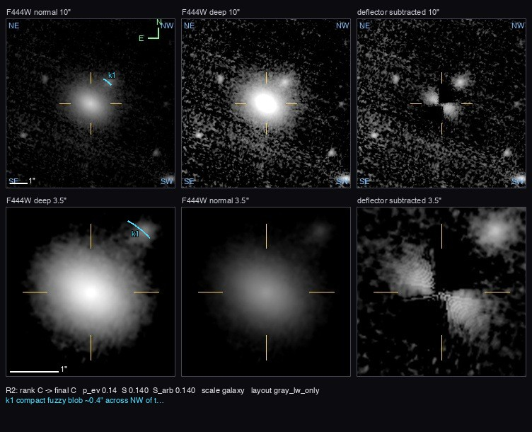{ width="100%" }](img/rank-045-annot.jpg){ target=_blank }
  <figcaption>Advocate evidence (cyan) and critic alternatives coloured by the arbitrator ruling</figcaption>
</figure>

???+ note "Why this grade — advocate, critics, arbitrator"
    **Letter C** (deployed, rule R2) · p_evidence 0.14 · S_arb 0.14 · S 0.14 · scale galaxy

    Letter: letter_rank stands (D rule not met); p_evidence 0.14 < t_B 0.17 (calibrated at 5% FPR on clean negatives); not D: 1 item(s) located; no named critic covers every item at r >= 0.80.

    **Advocate**

    - criteria: source_contrast 3, low_surface_brightness 4, curvature 1, counter_image 1, arc_morphology 1
    - items (1):
        - k1 — “compact fuzzy blob ~0.4" across NW of the ticked galaxy, clearly seen in the direct zoom panels (d)/(e) at the upper-right and as a positive residual in (f) outside the bowtie artefact; slightly resolved, not point-like, but round rather than tangentially stretched” (panel d, r 1.65 arcsec, PA 312->332, visible in direct: yes; criteria: source_contrast, low_surface_brightness)
    - scale galaxy; red neighbours within 10 arcsec 2; BCG-like halo no; deflector is centre no
    - p_evidence: 0.14
    - notes: “Only one located feature: a round ~0.4" blob at r~1.65", PA~322 (NW) traceable in (a), (b), (d), (e) and as an isolated positive lump in (f); I searched the opposite side (PA ~120-160, r 1.0-2.3") in (b), (d) and (f) and find no counter-knot above the four-lobed circular-subtraction artefact, and the deep panels show a smooth, essentially round envelope with no tangential feature at any radius out to ~5" apart from two unrelated galaxies at r~4.7" SW.”

    **Critics**

    - not called (p_evidence 0.14 < tau0 0.15)

    **Arbitrator**

    - no arbitrator record (not called)

    **Score**

    - S = p_ev = 0.14 (no critic term entered the product)
    - S_arb = p_ev = 0.14 (no critic term entered the product)
    - stored grade_pred (on S): C — S 0.14 < t_B 0.17 (calibrated at 5% FPR on clean negatives); not D: 1 item(s) located; no named critic covers every item at r >= 0.80
    - stored letter_arb (on S_arb): C; letter_source: opus5_api_calibrated
    - deploy rule R2: letter_rank (advocate only, on p_evidence) = C — p_evidence 0.14 < t_B 0.17 (calibrated at 5% FPR on clean negatives); not D: 1 item(s) located; no named critic covers every item at r >= 0.80
    - deploy rule R2: letter_final = C — letter_rank stands (D rule not met); p_evidence 0.14 < t_B 0.17 (calibrated at 5% FPR on clean negatives); not D: 1 item(s) located; no named critic covers every item at r >= 0.80
    - veto: none (letter_final == letter_rank)

---

## Rank 46: J9002960-2014057 {#rank-46}

| Original grade | Passes | Inspector conf. | Pipeline θ_E |
|:--:|:--:|:--:|:--:|
| **U** | — | 26 | 1.10″ |

| New (final) | Rank letter | p_ev | S_arb | Demoted by | Arb. letter | Needs human |
|:--:|:--:|--:|--:|:--|:--:|:--:|
| **B** | B | 0.18 | 0.025 | — | D | no |

<small>pipeline discovery status `new` · scale class `group`</small>

<figure markdown="span">
  [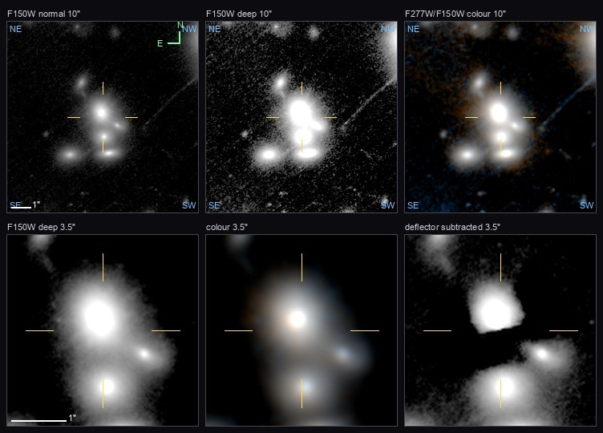{ width="100%" }](img/rank-046-orig.jpg){ target=_blank }
  <figcaption>What the judge saw (blind, footer removed)</figcaption>
</figure>

<figure markdown="span">
  [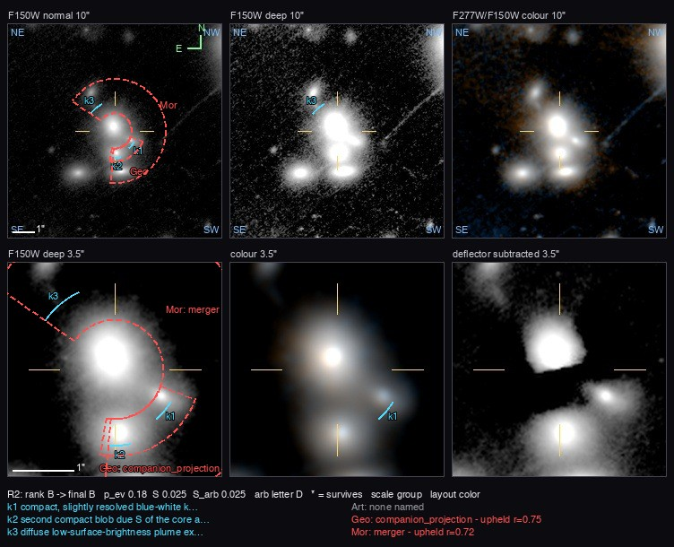{ width="100%" }](img/rank-046-annot.jpg){ target=_blank }
  <figcaption>Advocate evidence (cyan) and critic alternatives coloured by the arbitrator ruling</figcaption>
</figure>

???+ note "Why this grade — advocate, critics, arbitrator"
    **Letter B** (deployed, rule R2) · p_evidence 0.18 · S_arb 0.025 · S 0.025 · scale group

    Letter: letter_rank stands (D rule not met); p_evidence 0.18 >= t_B 0.17 (calibrated at 5% FPR on clean negatives); p_evidence 0.18 < t_A 0.20 (calibrated at 1% FPR on clean negatives).

    **Advocate**

    - criteria: source_contrast 5, low_surface_brightness 4, curvature 1, counter_image 3, arc_morphology 2
    - items (3):
        - k1 — “compact, slightly resolved blue-white knot/blob SW of the ticked galaxy core, with its own faint halo; clearly separated from the deflector light in (d), (e) and surviving as an offset positive residual in (f)” (panel e, r 1.05 arcsec, PA 220->240, visible in direct: yes; criteria: source_contrast, low_surface_brightness)
        - k2 — “second compact blob due S of the core at a comparable radius (radius ratio ~1.2, within 40%), similar whitish-blue hue and similar compact-plus-halo profile; also an offset positive residual in (f)” (panel d, r 1.25 arcsec, PA 175->192, visible in direct: yes; criteria: source_contrast, low_surface_brightness, counter_image)
        - k3 — “diffuse low-surface-brightness plume extending NE from the deflector envelope toward the northern group member, visible in the deep 10" panel and at the top-left corner of the zoom” (panel b, r 1.4 arcsec, PA 25->55, visible in direct: yes; criteria: low_surface_brightness)
    - scale galaxy; red neighbours within 10 arcsec 3; BCG-like halo yes; deflector is centre no
    - p_evidence: 0.18
    - notes: “Two compact companions sit at r~1.0-1.3" from the ticked core but both lie on the south side (PA ~229 and ~183, only ~46 deg apart) with no opposite counter-image and no tangential elongation anywhere in (d)/(e)/(f); the straight NE-SW streak across (a)-(c) is a spike/trail artefact, and the whole 10" field looks like a compact group of comparably bright galaxies embedded in diffuse envelope light.”

    **Critics**

    **artifact — no alternative named (nothing in its competence fits)**

    - leaves standing: k1, k2, k3
    - scale_class: galaxy
    - measured: `{"blob_profiles": "both knots are resolved (FWHM clearly larger than the point sources elsewhere in the field) and have no radial ray structure - inconsistent with spikes, snowballs or persistence", "item1_visible_in_unsubtracted": "yes - compact knot at r~1.0-1.1\", PA~225-240 seen in (d) deep zoom and (e) colour zoom, not only in (f)", "item2_visible_in_unsubtracted": "yes - blob at r~1.2-1.3\", PA~180-190 seen in (d) and (e), and in the 10\" panels (a)/(b) as a separate source", "item3_traceable": "yes - diffuse extension at upper-left (NE) corner of (d)/(e) and in (b) at r~1.2-2\", PA~25-55", "unrelated_linear_streak": "straight faint trail crossing the 10\" panels (a),(b),(c) at r~2.5-5\", PA~300-330 (NW side) - does not touch any item location"}`
    - notes: “Items 1 and 2 are present in the un-subtracted zoom panels (d) and (e) as resolved compact sources with their own halos, so they cannot be subtraction residuals, and they show no straight-ray, snowball or persistence signature; the only instrumental feature in the frame is a faint straight trail in the 10" panels at r~2.5-5", PA~300-330 (NW), well away from all three items. Item 3 is also traceable in the direct deep panels (b) and the top-left corner of (d), so nothing here is an artefact of the reduction - whether the blobs are lensed images or host structure is outside my competence.”
    - ruling: no ruling for this critic

    **geometry — companion_projection:** “Two unrelated small galaxies of a compact chain/group projected near the ticked galaxy: the SW object is a resolved, elongated lenticular-like disc (major axis nearly E-W, i.e. close to the radial direction), the S object a rounder compact knot; they sit 56 deg apart in position angle rather than opposed, have different surface-brightness profiles, and continue as a chain of further comparable objects at 2-2.5" S and SW in the 10" panel.”

    - location: r 0.8-1.4 arcsec, PA 170->250
    - accounts for: k1, k2; leaves standing: k3; strength r 0.75; coverage a 0.667 (geometric)
    - scale_class: group
    - measured: `{"blob1_r_pa_panel_d": "r=0.85-1.05\", PA=242 deg", "blob2_r_pa_panel_d": "r=1.00-1.25\", PA=186 deg", "centre_of_curvature": "undefined - two blobs 56 deg apart cannot be fitted about the tick centre", "colour_panel_e": "both whitish-blue, weakly diagnostic; not used as the argument", "counter_image_search": "no source at r=0.8-1.4\" over PA 350-90 in (b),(d),(e); only the empty NE quadrant plus the distant NE member at r~2.0\"", "image_separation_in_PA": "56 deg (neither the ~180 deg of a double nor a merging-pair fold with a connecting arc)", "profile_match": "SW object resolved and disc-like with visible halo, S object compact point-plus-halo -> inconsistent as two images of one source", "radius_ratio": "1.15 (compatible)", "tangential_elongation_blob1": "major axis PA ~95/275 deg, tangential direction would be ~332 deg -> mismatch ~57 deg; elongation is closer to radial", "tangential_elongation_blob2": "round, axis ratio ~1.0, no tangential stretch"}`
    - notes: “In (d) the SW object at r~0.9", PA~242 is clearly a small elongated disc with its major axis running roughly E-W (near-radial), while the S object at r~1.1", PA~186 is round and compact; they are only 56 deg apart with no counterpart anywhere in the N/NE half at the same radius, and panel (b) shows the same chain continuing to further comparable galaxies at r~2.0-2.5" (PA ~180 and ~230) - a compact group projection, not a tangential image configuration.”
    - ruling: upheld, covers k1, k2 — “In panel (d) the SW knot (r~0.9-1.05", PA~242) is a small resolved disc with its major axis running near-radially E-W and the S knot (r~1.1-1.25", PA~186) is round and compact, only ~56 deg apart on the same side with a completely empty N/NE annulus at the same radius - two projected members of the chain that continues to comparable galaxies at 2-2.5" in (b)/(c), not an image pair.”

    **morphology — merger:** “The ticked galaxy is the brightest member of a compact interacting group: at least four companions lie within 3" (NE at ~2.0"/PA 34, S at ~2.3"/PA 188, SE at ~2.9"/PA 141, plus a linear streak to the NW), all embedded in a common diffuse envelope. Items 1 and 2 are two further compact group members / merging nuclei, each resolved into a core plus its own concentric halo, and item 3 is the tidal plume/bridge running toward the NE member.”

    - location: r 0.8-2.4 arcsec, PA 175->55
    - accounts for: k1, k2, k3; leaves standing: none; strength r 0.72; coverage a 1.00 (geometric)
    - scale_class: group
    - measured: `{"blob1_r_pa": "1.02\" at PA 242 (panel d, ~108 px W and 57 px S of tick centre)", "blob2_r_pa": "1.19\" at PA 186 (panel d, ~16 px W and 142 px S)", "blob_shapes": "both round/compact (axis ratio ~0.8) with concentric halos; long axes not tangential to the deflector", "delta_pa_between_blobs": "56 deg - both on the south side, not an opposed image pair", "neighbours_within_3arcsec": "NE 2.0\"/PA 34, S 2.3\"/PA 188, SE 2.9\"/PA 141 in panel (c)", "plume": "diffuse low-SB extension from the envelope at r 1.2-2.0\", PA 25-55, pointing at the NE member"}`
    - notes: “In (d) the SW knot and the S knot each show a compact core plus its own smooth concentric halo and no tangential stretching, and they sit only 56 deg apart in PA on the same side of the core - the same appearance as the larger companions at 2.0-2.9" in (c), so they read as group members seen in projection rather than a lensed pair. The NE feature at the top-left of (d) is continuous low-surface-brightness light joining the deflector envelope to the NE galaxy in (c) - an interaction plume, not a fixed-radius arc.”
    - ruling: upheld, covers k1, k2, k3 — “Both knots in (d) show a compact core plus its own smooth concentric halo with no tangential stretch - identical in appearance to the 2.0"/PA34 NE, 2.3"/PA188 S and 2.9"/PA141 SE companions visible in (c) - and the item-3 plume at the top-left of (d) is continuous low-surface-brightness light joining the deflector envelope to the NE member in (b)/(c), i.e. an interaction bridge rather than a fixed-radius arc.”

    **Arbitrator**

    - surviving items: none (0 of 3)
    - letter_llm: D; scale_class_final: group; needs_human: no
    - rationale: “The artifact critic confirmed all three items are real sky features present in the un-subtracted panels (b), (d) and (e), so nothing here is a reduction or subtraction artefact - but reality is not lensing. The two compact knots that carry the entire case sit at r~1.0" (PA~242) and r~1.2" (PA~186) in the deep zoom (d), separated by only ~56 deg of position angle on the same southern side of the ticked core; the northern and north-eastern annulus at the same radius in (b), (d) and (e) is empty, so there is no counter-image, and neither blob is tangentially elongated - the SW object's major axis runs roughly E-W, close to the radial direction, and the S object is round with axis ratio ~1.0. Their surface-brightness profiles also differ (resolved disc-like vs compact core-plus-halo), which is inconsistent with two images of one source. Panels (a)-(c) show the whole 10" field to be a compact chain of comparably bright, similarly coloured galaxies - NE at ~2.0", S at ~2.3", SE at ~2.9" - all embedded in a common diffuse envelope, and the item-3 NE plume is continuous envelope/tidal light pointing at the NE member, not a feature at fixed radius. The residual panel (f) shows only offset positive lumps at the positions of those same companions plus the expected bowtie/ring pattern of a circular profile fit to an elliptical, blended core, which carries no weight either way. With both upheld alternatives together accounting for every located item and no tangential structure anywhere at JWST resolution, this reads as a compact group projection, letter D.”

    **Score**

    - S = p_ev x prod(1 - r_i a_i) = 0.18 x (1 - 0.75x0.667) x (1 - 0.72x1.00) = 0.025
        - terms: geometry companion_projection r 0.75 a 0.667; morphology merger r 0.72 a 1.00
    - S_arb = p_ev x prod_{upheld/partial}(1 - r_i a_i') = 0.18 x (1 - 0.75x0.667) x (1 - 0.72x1.00) = 0.025
        - terms: geometry companion_projection r 0.75 a 0.667 (upheld); morphology merger r 0.72 a 1.00 (upheld)
    - stored grade_pred (on S): C — S 0.025 < t_B 0.17 (calibrated at 5% FPR on clean negatives); not D: 3 item(s) located; no named critic covers every item at r >= 0.80
    - stored letter_arb (on S_arb): C; letter_source: opus5_api_calibrated
    - deploy rule R2: letter_rank (advocate only, on p_evidence) = B — p_evidence 0.18 >= t_B 0.17 (calibrated at 5% FPR on clean negatives); p_evidence 0.18 < t_A 0.20 (calibrated at 1% FPR on clean negatives)
    - deploy rule R2: letter_final = B — letter_rank stands (D rule not met); p_evidence 0.18 >= t_B 0.17 (calibrated at 5% FPR on clean negatives); p_evidence 0.18 < t_A 0.20 (calibrated at 1% FPR on clean negatives)
    - veto: none (letter_final == letter_rank)

---

## Rank 47: J15069997+222588 {#rank-47}

| Original grade | Passes | Inspector conf. | Pipeline θ_E |
|:--:|:--:|:--:|:--:|
| **U** | — | 26 | — |

| New (final) | Rank letter | p_ev | S_arb | Demoted by | Arb. letter | Needs human |
|:--:|:--:|--:|--:|:--|:--:|:--:|
| **C** | C | 0.12 | 0.120 | — | — | no |

<small>pipeline discovery status `new` · scale class `galaxy`</small>

<figure markdown="span">
  [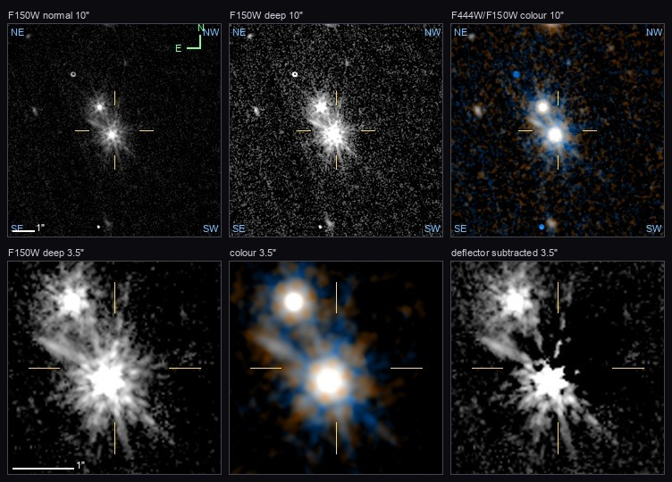{ width="100%" }](img/rank-047-orig.jpg){ target=_blank }
  <figcaption>What the judge saw (blind, footer removed)</figcaption>
</figure>

<figure markdown="span">
  [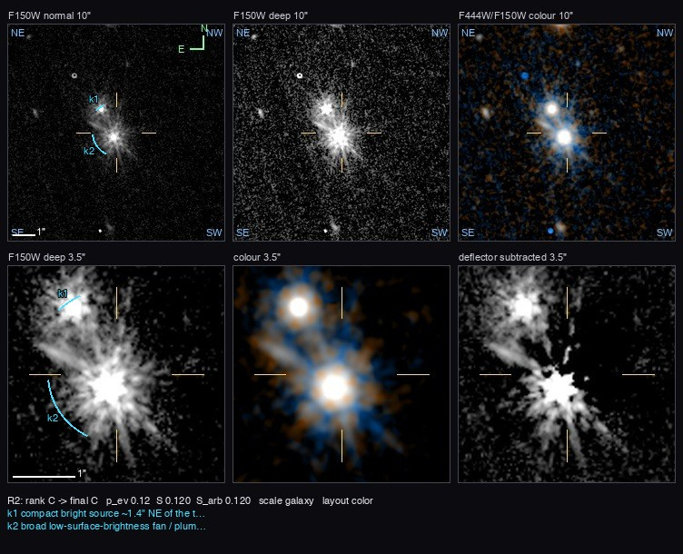{ width="100%" }](img/rank-047-annot.jpg){ target=_blank }
  <figcaption>Advocate evidence (cyan) and critic alternatives coloured by the arbitrator ruling</figcaption>
</figure>

???+ note "Why this grade — advocate, critics, arbitrator"
    **Letter C** (deployed, rule R2) · p_evidence 0.12 · S_arb 0.12 · S 0.12 · scale galaxy

    Letter: letter_rank stands (D rule not met); p_evidence 0.12 < t_B 0.17 (calibrated at 5% FPR on clean negatives); not D: 2 item(s) located; no named critic covers every item at r >= 0.80.

    **Advocate**

    - criteria: source_contrast 2, low_surface_brightness 3, curvature 1, counter_image 1, arc_morphology 1
    - items (2):
        - k1 — “compact bright source ~1.4" NE of the ticked object, white/blue in (c) and (e) like the deflector itself and carrying its own 6-spike pattern in (a)/(b); listed as a possible compact lensed image / knot, no counterpart found at the mirror position (PA~213, r~1.4") in (d) or (f)” (panel d, r 1.4 arcsec, PA 25->42, visible in direct: yes; criteria: source_contrast)
        - k2 — “broad low-surface-brightness fan / plume extending E-SE from the core, r~0.6-1.6", traceable in the deep zoom (d) and surviving in the residual (f); it is radial (widening with radius, attached to the core) rather than tangential at fixed radius” (panel d, r 1.1 arcsec, PA 95->155, visible in direct: yes; criteria: low_surface_brightness)
    - scale galaxy; red neighbours within 10 arcsec 1; BCG-like halo no; deflector is centre no
    - p_evidence: 0.12
    - notes: “Both the ticked source and its 1.4" NE companion show straight six-spike diffraction patterns in (a), (b), (d) and (f) with a blue F150W-dominated halo in (c)/(e), and the only extended light is a radial E-SE fan attached to the core - nowhere in the 10" or 3.5" panels is there a tangentially elongated feature at constant radius or a knot mirrored across the nucleus.”

    **Critics**

    - not called (p_evidence 0.12 < tau0 0.15)

    **Arbitrator**

    - no arbitrator record (not called)

    **Score**

    - S = p_ev = 0.12 (no critic term entered the product)
    - S_arb = p_ev = 0.12 (no critic term entered the product)
    - stored grade_pred (on S): C — S 0.12 < t_B 0.17 (calibrated at 5% FPR on clean negatives); not D: 2 item(s) located; no named critic covers every item at r >= 0.80
    - stored letter_arb (on S_arb): C; letter_source: opus5_api_calibrated
    - deploy rule R2: letter_rank (advocate only, on p_evidence) = C — p_evidence 0.12 < t_B 0.17 (calibrated at 5% FPR on clean negatives); not D: 2 item(s) located; no named critic covers every item at r >= 0.80
    - deploy rule R2: letter_final = C — letter_rank stands (D rule not met); p_evidence 0.12 < t_B 0.17 (calibrated at 5% FPR on clean negatives); not D: 2 item(s) located; no named critic covers every item at r >= 0.80
    - veto: none (letter_final == letter_rank)

---

## Rank 48: J4312165-2100739 {#rank-48}

| Original grade | Passes | Inspector conf. | Pipeline θ_E |
|:--:|:--:|:--:|:--:|
| **U** | — | 27 | 2.05″ |

| New (final) | Rank letter | p_ev | S_arb | Demoted by | Arb. letter | Needs human |
|:--:|:--:|--:|--:|:--|:--:|:--:|
| **D** | B | 0.20 | 0.005 | merger (Geo, Mor) | D | no |

<small>pipeline discovery status `field_match` · scale class `galaxy`</small>

<figure markdown="span">
  [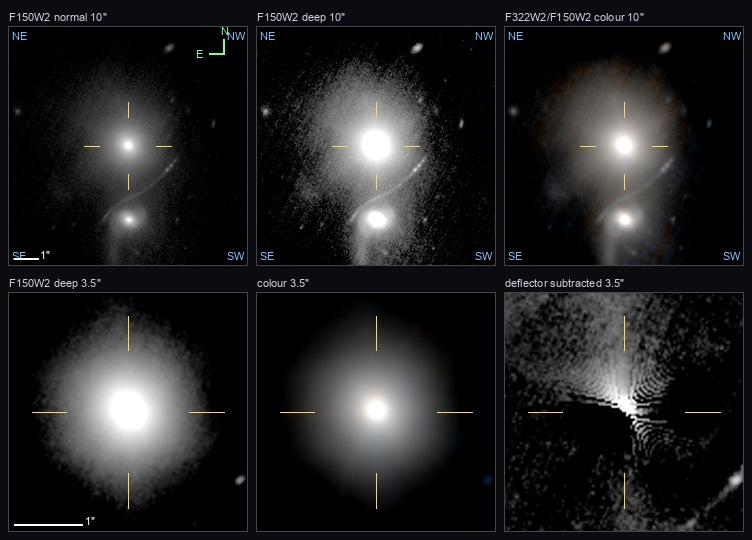{ width="100%" }](img/rank-048-orig.jpg){ target=_blank }
  <figcaption>What the judge saw (blind, footer removed)</figcaption>
</figure>

<figure markdown="span">
  [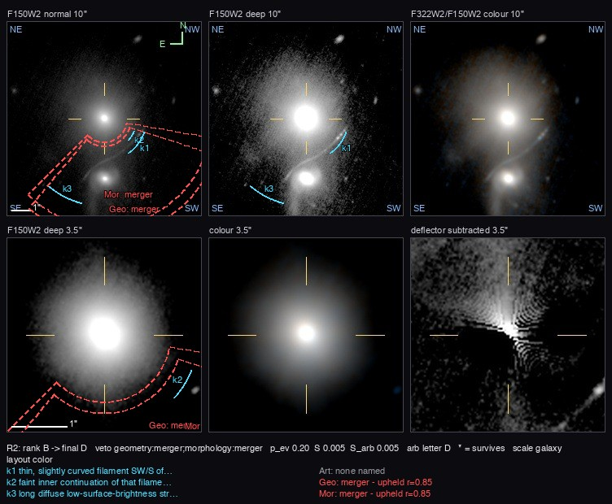{ width="100%" }](img/rank-048-annot.jpg){ target=_blank }
  <figcaption>Advocate evidence (cyan) and critic alternatives coloured by the arbitrator ruling</figcaption>
</figure>

???+ note "Why this grade — advocate, critics, arbitrator"
    **Letter D** (deployed, rule R2) · p_evidence 0.20 · S_arb 0.005 · S 0.005 · scale galaxy

    Letter: D rule: geometry (merger) covers every item (a = 1) at r 0.85 >= 0.80 (upheld); morphology (merger) covers every item (a = 1) at r 0.85 >= 0.80 (upheld).

    **Advocate**

    - criteria: source_contrast 6, low_surface_brightness 7, curvature 3, counter_image 1, arc_morphology 3
    - items (3):
        - k1 — “thin, slightly curved filament SW/S of the deflector, whiter-bluer than the orange galaxy light in (c); brightest between r~1.5" and r~3", its radius grows steadily with position angle rather than staying fixed” (panel b, r 2.2 arcsec, PA 215->252, visible in direct: yes; criteria: source_contrast, low_surface_brightness, curvature)
        - k2 — “faint inner continuation of that filament entering the 3.5" zoom at its lower-right (SW) corner as a low-surface-brightness smudge on the galaxy envelope; bluish in (e)” (panel d, r 1.7 arcsec, PA 228->248, visible in direct: yes; criteria: source_contrast, low_surface_brightness)
        - k3 — “long diffuse low-surface-brightness streamer running from the southern companion out toward the SE field edge, same brightness class as item 1 and appearing continuous with it across the companion” (panel b, r 4.5 arcsec, PA 140->165, visible in direct: yes; criteria: low_surface_brightness)
    - scale galaxy; red neighbours within 10 arcsec 2; BCG-like halo yes; deflector is centre no; arc radius 2.2 arcsec; arc PA span 215->252; centre-of-curvature offset 3 arcsec
    - p_evidence: 0.20
    - notes: “The only located feature is a thin bluish filament SW of the ticked galaxy whose radius climbs from ~1.5" to ~3.5" along its length and which appears to run into the bright companion 3.2" south and continue as a streamer to the SE, so its centre of curvature falls ~3" off the deflector and no opposite-side counter-image or knot is visible on the NE side in (a)-(e); the zoom panels (d)/(e) are smooth and (f) shows only the circular-model butterfly plus concentric rings, which is uninformative inside ~1.5".”

    **Critics**

    **artifact — no alternative named (nothing in its competence fits)**

    - leaves standing: k1, k2, k3
    - scale_class: galaxy
    - measured: `{"background": "no 1/f stripes, no snowball, no mosaic seam or coverage edge crosses PA 140-252 within r<5\" in (b)", "direct_visibility": "items 1-3 are all present in un-subtracted panels (a)/(b)/(c), so the subtraction-residual channel is inadmissible for them", "item1_curvature": "filament traced in (b) from PA~250 at r~1.5\" to PA~215 at r~3\": radius changes monotonically with angle, i.e. it is not a straight radial ray - inconsistent with any JWST 6-spike pattern", "panel_f_pattern": "the concentric ripples plus four-lobed bowtie centred exactly on the ticks in (f) are the declared artefacts of the circular 1-D profile model and were not counted as items", "spike_test": "no matching counter-ray at PA~35-70 (the opposite side of the bright core) and no second pair of straight rays at the fixed NIRCam spike angles in (a) or (b)"}`
    - notes: “The SW filament (items 1-2) curves in radius with angle and has no opposing partner, so it is not a diffraction spike, and the bright core shows no saturation bleed or PSF-wing halo structure at r~1.5-3"; the SE streamer (item 3) is diffuse, follows the companion, and lies at 45 deg to any detector row/column, ruling out striping or a dither edge. All three features are visible in the un-subtracted (a)/(b)/(c) panels, so the ripple/bowtie pattern in (f) cannot explain them - no instrumental or reduction alternative applies.”
    - ruling: no ruling for this critic

    **geometry — merger:** “An S-shaped tidal bridge/tail linking the ticked galaxy to the bright companion ~3.3" due south: the filament leaves the deflector envelope at PA~245, passes through a knot at r~2.1", PA~231, sweeps with an inflection down to the companion nucleus at r~3.3", PA~182, and continues past it as a diffuse streamer to the SE - one continuous interaction feature, not images of a background source.”

    - location: r 1.4-6 arcsec, PA 140->252
    - accounts for: k1, k2, k3; leaves standing: none; strength r 0.85; coverage a 1.00 (geometric)
    - scale_class: galaxy
    - measured: `{"centre_of_curvature_offset": ">2\" from the ticked nucleus for the outer half; the outer arc's centre lies near the southern companion, not on the deflector", "colour_check": "panel (e) 3.5\" zoom shows no distinct blue arc inside 1.75\"; the item-2 smudge is at the frame corner and is only a faint envelope brightening", "counter_image_search": "opposite side of the deflector (r 1.5-3\", PA 30-70) in panel (b) is a smooth, featureless envelope - no counter-arc or knot at any compatible radius", "curvature": "S-shaped with a visible inflection near r~2.6\", PA~200; the inner half is concave toward the deflector, the outer half concave away - a single lens centre cannot produce both signs", "endpoint_anchoring": "both ends of the feature terminate on stellar nuclei (deflector envelope at SW, companion at S), and the same surface-brightness class continues beyond the companion to r~6\" at PA~150-165", "filament_radius_vs_pa": "r = 1.5\" at PA~245, 2.1\" at PA~231, 2.6\" at PA~205, 3.3\" at PA~182 (companion) - radius grows monotonically as PA decreases; no constant-radius segment anywhere along it"}`
    - notes: “In panel (b) the bright core and the companion 3.3" due south are joined by a single continuous S-shaped filament through the knot at r~2.1", PA~231, whose radius grows steadily with position angle and whose curvature reverses sign near PA~200 - geometry of a tidal bridge, not of a tangential arc. The mirror position at r~2.1", PA~51 is empty in the same deep stretch, so there is no counter-image.”
    - ruling: upheld, covers k1, k2, k3 — “In panel (b) the filament is pixel-continuous from the host's SW envelope through the knot at r~2.1", PA~231 down to the compact companion nucleus ~3.2" due south and out again as the SE plume, its radius growing monotonically with position angle and reversing curvature near PA~200 - a tidal bridge, not a tangential arc, and the mirror position at PA~50 is a smooth empty envelope.”

    **morphology — merger:** “A tidal bridge/tail system between the ticked galaxy and the bright compact companion ~3" due south: one continuous S-shaped, knotty filament that leaves the host envelope in the SW, sweeps south with steadily increasing radius and terminates on the companion's nucleus, then continues as a diffuse plume out to the SE - an interacting pair, not an arc at fixed radius”

    - location: r 1.2-5.5 arcsec, PA 135->260
    - accounts for: k1, k2, k3; leaves standing: none; strength r 0.85; coverage a 1.00 (geometric)
    - scale_class: galaxy
    - measured: `{"counter_image_search": "no comparable feature at r~1.5-3\" in the NE/N quadrant (PA 0-90) in panel (c) or in the 3.5\" deep zoom (d)", "filament_inner_end": "r~1.8-1.9\", PA~234 (panel c, bright bluish knot SW of the ticks)", "filament_outer_end": "r~3.1\", PA~181 - lands exactly on the bright compact companion nucleus", "plume": "diffuse continuation r~4.0-5.5\", PA~140-165 beyond the companion (item 3)", "radius_vs_angle": "monotonic growth ~1.9\"->3.1\" as PA runs 234->181; no constant-radius segment"}`
    - notes: “In panel (c) the bright filament can be traced pixel-continuously from the host's SW envelope (r~1.8", PA~234) down and around into the companion's nucleus at r~3.1", PA~181, and out again as the SE plume at r~4.5" - an S-shaped bridge-plus-tail whose radius grows with angle, while panels (d)/(e) show only its faint inner smudge at the SW corner and no mirrored arc anywhere in the N/NE quadrant at the same radius.”
    - ruling: upheld, covers k1, k2, k3 — “The same knotty S-shaped filament in panels (b)/(c) terminates exactly on the companion's nucleus and continues as a diffuse SE plume to r~5", with no constant-radius segment and no counter-arc in the N/NE quadrant of (c) or the 3.5" zoom (d).”

    **Arbitrator**

    - surviving items: none (0 of 3)
    - letter_llm: D; scale_class_final: galaxy; needs_human: no
    - rationale: “The only located evidence was a thin bluish filament SW/S of the ticked galaxy (items 1-2) and a diffuse SE streamer (item 3), and both the geometry and morphology critics independently traced them, in the un-subtracted deep and colour panels, as one continuous feature: it leaves the host envelope near PA~245 at r~1.5", passes a knot at r~2.1"/PA~231, sweeps with an inflection onto the nucleus of the bright compact companion 3.2" due south, and continues past it as a low-surface-brightness plume out to r~5-6" at PA~140-165. Its radius grows monotonically with angle, its curvature changes sign, and both ends anchor on stellar nuclei - none of which a single deflector can produce - while the mirror position at r~2", PA~50 is a featureless envelope in the same deep stretch, so there is no counter-image. The artifact critic named no instrumental alternative and correctly noted that panel (f) shows only the declared circular-model bowtie plus concentric ripples, which are uninformative; that leaves no evidence for a lens and a fully self-consistent interacting-pair (bridge + tail) interpretation covering every item, hence D with no surviving items and no need for a further reviewer.”

    **Score**

    - S = p_ev x prod(1 - r_i a_i) = 0.20 x (1 - 0.85x1.00) x (1 - 0.85x1.00) = 0.005
        - terms: geometry merger r 0.85 a 1.00; morphology merger r 0.85 a 1.00
    - S_arb = p_ev x prod_{upheld/partial}(1 - r_i a_i') = 0.20 x (1 - 0.85x1.00) x (1 - 0.85x1.00) = 0.005
        - terms: geometry merger r 0.85 a 1.00 (upheld); morphology merger r 0.85 a 1.00 (upheld)
    - stored grade_pred (on S): D — S 0.005 < t_B 0.17 (calibrated at 5% FPR on clean negatives) and geometry (merger) covers every item at r 0.85 >= 0.80; morphology (merger) covers every item at r 0.85 >= 0.80
    - stored letter_arb (on S_arb): D; letter_source: opus5_api_calibrated
    - deploy rule R2: letter_rank (advocate only, on p_evidence) = B — p_evidence 0.20 >= t_A 0.20 (calibrated at 1% FPR on clean negatives) but A is blocked: only 0 of 3 configuration criteria >= 6; p_evidence 0.20 >= t_B 0.17 (calibrated at 5% FPR on clean negatives)
    - deploy rule R2: letter_final = D — D rule: geometry (merger) covers every item (a = 1) at r 0.85 >= 0.80 (upheld); morphology (merger) covers every item (a = 1) at r 0.85 >= 0.80 (upheld)
    - veto: geometry:merger;morphology:merger

---

## Rank 49: J5282421-774282 {#rank-49}

| Original grade | Passes | Inspector conf. | Pipeline θ_E |
|:--:|:--:|:--:|:--:|
| **U** | — | 26 | — |

| New (final) | Rank letter | p_ev | S_arb | Demoted by | Arb. letter | Needs human |
|:--:|:--:|--:|--:|:--|:--:|:--:|
| **D** | C | 0.15 | 0.009 | merger (Mor) | D | no |

<small>pipeline discovery status `new` · scale class `galaxy`</small>

<figure markdown="span">
  [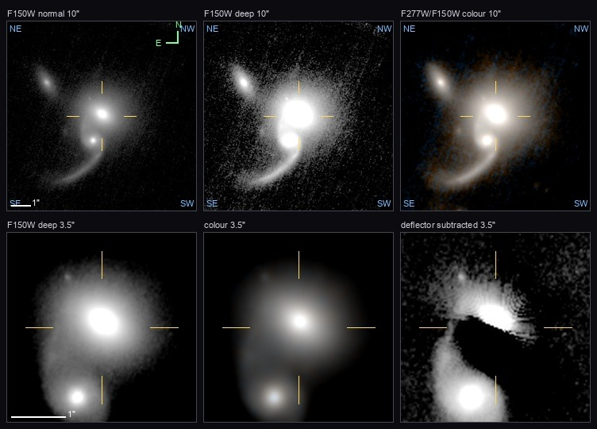{ width="100%" }](img/rank-049-orig.jpg){ target=_blank }
  <figcaption>What the judge saw (blind, footer removed)</figcaption>
</figure>

<figure markdown="span">
  [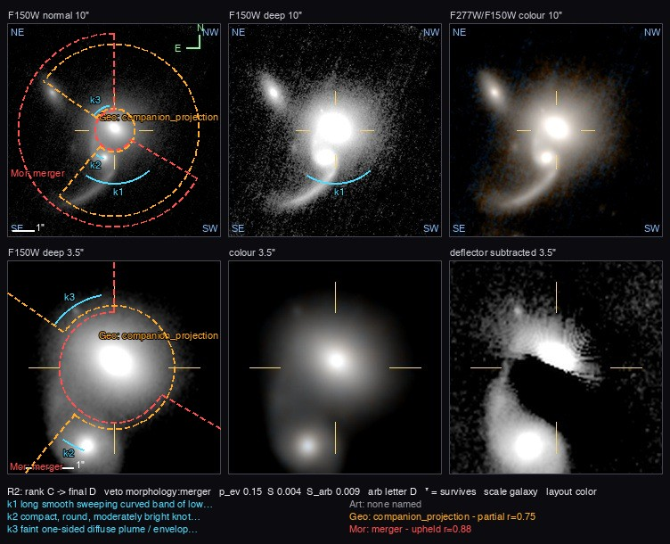{ width="100%" }](img/rank-049-annot.jpg){ target=_blank }
  <figcaption>Advocate evidence (cyan) and critic alternatives coloured by the arbitrator ruling</figcaption>
</figure>

???+ note "Why this grade — advocate, critics, arbitrator"
    **Letter D** (deployed, rule R2) · p_evidence 0.15 · S_arb 0.009 · S 0.004 · scale galaxy

    Letter: D rule: morphology (merger) covers every item (a = 1) at r 0.88 >= 0.80 (upheld).

    **Advocate**

    - criteria: source_contrast 4, low_surface_brightness 8, curvature 3, counter_image 2, arc_morphology 3
    - items (3):
        - k1 — “long smooth sweeping curved band of low-surface-brightness light running from SW round through S to SE of the deflector; brightest inner end near the deflector, fanning/broadening at its SE end; its radius grows from ~1.5" (PA~220) to ~3.7" (PA~148), and a circle fitted to three points along it centres ~2.6" NE of the tick centre” (panel b, r 2.5 arcsec, PA 148->221, visible in direct: yes; criteria: low_surface_brightness, curvature, arc_morphology)
        - k2 — “compact, round, moderately bright knot ~1.4-1.5" SSE of the deflector core, resolved and slightly extended in the zoom (d); colour in (e) is similar to / marginally bluer-whiter than the orange deflector core; the curved band of item 1 appears to run into it” (panel d, r 1.45 arcsec, PA 145->160, visible in direct: yes; criteria: source_contrast, low_surface_brightness)
        - k3 — “faint one-sided diffuse plume / envelope asymmetry on the N-NE side of the deflector at ~1-1.5", traceable as an excess of halo light in the deep zoom (d) and as an offset fan in the residual (f); searched here for a counter-image to knot k=2 - it is diffuse, not compact, and lies at PA ~30 rather than opposite k=2 (~330)” (panel d, r 1.2 arcsec, PA 10->55, visible in direct: yes; criteria: low_surface_brightness)
    - scale galaxy; red neighbours within 10 arcsec 1; BCG-like halo yes; deflector is centre no; arc radius 2.5 arcsec; arc PA span 148->221; centre-of-curvature offset 2.6 arcsec
    - p_evidence: 0.15
    - notes: “The one striking feature is the big curved band south of the tick galaxy, but along it the radius climbs from ~1.5" (PA 220) to ~3.7" (PA 148) instead of staying fixed, it appears continuous with the compact SSE knot at 1.45" and with the deflector's own light on its NW end, and its fitted centre of curvature lands ~2.6" NE of the deflector (near the elongated neighbour at r~3.4", PA~62), so the geometric tests are failed even though the feature itself is real, extended and easily traced in the direct panels (a, b, d).”

    **Critics**

    **artifact — no alternative named (nothing in its competence fits)**

    - leaves standing: k1, k2, k3
    - scale_class: galaxy
    - measured: `{"background_striping": "faint diagonal 1/f-like streaks in the (b) background run NE-SW across the whole frame at a surface brightness far below the item-1 band and do not follow its curvature", "item1_curvature_vs_spike": "band bends continuously from PA~221 (r~1.5\") through S to PA~148 (r~3.7\") - curved, so not one of the six straight NIRCam spike rays; no counterpart ray at 180 deg from it", "item1_in_direct_panels": "clearly present in (a) normal and (b) deep 10\" panels at the same PA/r, therefore not a subtraction artefact", "item2_in_direct_panels": "compact source at r~1.45\", PA~150 present in (a), (b), (d), (e); round, no bleed trail, no snowball ring, no persistence ghost", "item3_in_direct_panels": "NE halo excess at r~1.0-1.4\", PA~10-55 is visible in the un-subtracted deep zoom (d), so the NE fan in (f) is not admissible as a pure subtraction residual; the rest of (f) (bright core dipole plus symmetric lobes) is the expected circular-model artefact and was not counted", "nearest_bright_neighbour": "compact galaxy ~3.4\" at PA~50; no diffraction spikes and no saturation, PSF wings at r~1.2\" from the deflector would be far fainter than the observed NE halo excess"}`
    - notes: “All three items are present in the un-subtracted panels (a)/(b)/(d) at the quoted radii and position angles, so none of them can be charged to the circular-profile subtraction; the strong dipole and fan in (f) are exactly the artefact pattern the VIEW warns about and I have not used them. Nothing in the field is saturated or spiked, there are no snowballs, seams, persistence or coverage edges near PA 145-225 at r=1.5-3.7", and the item-1 band is curved, ruling out any straight instrumental signature - within my competence I have no instrument or reduction alternative to offer.”
    - ruling: no ruling for this critic

    **geometry — companion_projection:** “The ticked galaxy is not an isolated deflector but the brightest member of a close, interacting/overlapping triplet: a bright compact second nucleus 1.45" SSE (item 2), a third galaxy ~3.5-4" NE whose halo spills inward over the deflector (item 3), and the long low-surface-brightness band (item 1), whose light is attached to that companion system rather than lying at fixed radius about the tick centre - its fitted centre of curvature is ~2.6" NE of the deflector and its radius grows monotonically 1.5" -> 3.7" along its length, so it is an unrelated/companion-attached streamer, not a tangential arc.”

    - location: r 1-4 arcsec, PA 140->55
    - accounts for: k1, k2, k3; leaves standing: none; strength r 0.75; coverage a 1.00 (geometric), arbitrated a' 0.667
    - scale_class: galaxy
    - measured: `{"centre_of_curvature_offset_from_tick_arcsec": 2.6, "companion_separations_arcsec": "k2 at 1.45\" PA ~152; NE neighbour at ~3.5-4\" PA ~40-50, its envelope reaching inward to r~1.2\"", "counter_image_search": "no compact source at r=1.3-1.6\", PA 315-345 in (d) or (e); item 3 is diffuse and at PA ~30, i.e. 60-70 deg from the required anti-position", "radius_variation_along_band_arcsec": "1.5 (PA 220) to 3.7 (PA 148) - factor 2.5, not constant", "tangential_elongation_of_k2": "none; round, axis ratio ~1.0-1.1 in panel (d), profile is a peaked nucleus like the deflector core, not an arc"}`
    - notes: “In panel (b) the sweeping band in the S/SE quadrant is concave about a point roughly 2.6" NE of the yellow tick and broadens into a fan at its SE end, while its inner (SW) end runs into the bright SSE object - a streamer belonging to the companion pair, not a ring segment concentric with the deflector. In (d)/(e) the SSE object at 1.45" is a round, centrally peaked nucleus with no tangential stretch and no counter-image on the opposite (NNW) side, and the N-NE excess at ~1.2" is simply the inward halo of the NE neighbour seen in (b).”
    - ruling: partial, covers k2, k3 — “The round, centrally peaked source 1.45" SSE in (d)/(e) and the diffuse N-NE halo excess at ~1.2" are plainly a second nucleus and the inward envelope of the elongated NE galaxy at ~3.5", but the long S/SE band in (b) is physically continuous with that secondary nucleus, so it is an attached streamer rather than a chance projection.”

    **morphology — merger:** “An interacting/merging system: the ticked galaxy shares a common diffuse envelope with a compact secondary nucleus 1.45" SSE and with the elongated galaxy ~3.5-4" NE; the 'arc' is a tidal tail launched from the secondary, sweeping SW->S->SE with monotonically growing radius and fanning at its far end, while the N-NE plume is the tidal bridge toward the NE neighbour.”

    - location: r 0.9-4.5 arcsec, PA 0->240
    - accounts for: k1, k2, k3; leaves standing: none; strength r 0.88; coverage a 1.00 (geometric)
    - scale_class: galaxy
    - measured: `{"band_width_trend": "narrow (~0.3\") at the inner SW end, fanning to >0.8\" at the SE end - a tail flares, an arc does not", "counter_image": "no compact source at the mirror PA (~330) at r~1.45\" in (d) or (e)", "radius_vs_angle_of_band": "r grows monotonically 1.5\" at PA~220 -> 2.6\" at PA~180 -> 3.7\" at PA~148, i.e. an open, unwinding trajectory, not constant radius", "structural_continuity": "in (c) and (d) the band runs continuously into the compact knot at r=1.45\", PA~150; the knot in turn is embedded in the same envelope as the ticked core", "third_body": "elongated galaxy centred ~3.5-4\" at PA~50-60 in (c) with a low-surface-brightness plume running SW into the ticked galaxy's halo, matching item 3's N-NE excess at r~1.2\", PA 10-55"}`
    - notes: “In panel (c) the whole 10" field is one interacting system: a common diffuse envelope wraps the ticked core, the compact secondary 1.45" SSE and the elongated NE galaxy, whose plume runs SW into the halo (item 3's N-NE fan at PA 10-55). The southern 'arc' is attached to the secondary nucleus and its radius climbs from 1.5" at PA~220 to 3.7" at PA~148 while broadening - the radius-vs-angle and width trends of a tidal tail, not of a tangential arc at fixed radius, and no counter-image appears opposite the knot in (d)/(e).”
    - ruling: upheld, covers k1, k2, k3 — “In (b) and (c) the band leaves the compact SSE nucleus at r~1.5" (PA~220), opens monotonically to r~3.7" at PA~148 and flares from ~0.3" to >0.8" wide, while a common diffuse envelope wraps the ticked core, the secondary and the NE galaxy whose plume runs SW into the halo - the radius-vs-angle, width and bridge signatures of a tidal tail.”

    **Arbitrator**

    - surviving items: none (0 of 3)
    - letter_llm: D; scale_class_final: galaxy; needs_human: no
    - rationale: “The only striking feature, the sweeping band south of the yellow ticks, fails every tangential test at JWST resolution: in panel (b) its radius climbs continuously from ~1.5" at PA~220 through ~2.6" at PA~180 to ~3.7" at PA~148, it broadens into a fan at its SE end instead of staying thinner than its radius, and its fitted centre of curvature falls ~2.6" NE of the tick centre, near the elongated neighbour - an unwinding, flaring trajectory, not a segment at fixed radius about the deflector's mass. In the 3.5" zoom (d)/(e) the object 1.45" SSE is round and centrally peaked with a nuclear profile, showing no tangential stretch and no compact counter-image anywhere near the mirror position (PA~330, r~1.4"); the N-NE excess is diffuse, at PA~30 rather than opposite, and matches the inward-running plume of the ~3.5" NE galaxy visible in (b) and (c). Panel (f) shows exactly the dipole-plus-lobe pattern the circular-profile subtraction produces on this off-centre, companion-blended core and was correctly not counted. The artefact critic offered no instrumental alternative and none is needed: nothing is saturated or spiked. The merger interpretation - ticked galaxy plus secondary nucleus plus NE companion sharing one envelope, with the southern band as a tidal tail launched from the secondary - accounts for all three located items, leaving nothing standing.”

    **Score**

    - S = p_ev x prod(1 - r_i a_i) = 0.15 x (1 - 0.75x1.00) x (1 - 0.88x1.00) = 0.004
        - terms: geometry companion_projection r 0.75 a 1.00; morphology merger r 0.88 a 1.00
    - S_arb = p_ev x prod_{upheld/partial}(1 - r_i a_i') = 0.15 x (1 - 0.75x0.667) x (1 - 0.88x1.00) = 0.009
        - terms: geometry companion_projection r 0.75 a' 0.667 (partial); morphology merger r 0.88 a 1.00 (upheld)
    - stored grade_pred (on S): D — S 0.004 < t_B 0.17 (calibrated at 5% FPR on clean negatives) and morphology (merger) covers every item at r 0.88 >= 0.80
    - stored letter_arb (on S_arb): D; letter_source: opus5_api_calibrated
    - deploy rule R2: letter_rank (advocate only, on p_evidence) = C — p_evidence 0.15 < t_B 0.17 (calibrated at 5% FPR on clean negatives); not D: 3 item(s) located; no named critic covers every item at r >= 0.80
    - deploy rule R2: letter_final = D — D rule: morphology (merger) covers every item (a = 1) at r 0.88 >= 0.80 (upheld)
    - veto: morphology:merger

---

## Rank 50: J20945435-1082161 {#rank-50}

| Original grade | Passes | Inspector conf. | Pipeline θ_E |
|:--:|:--:|:--:|:--:|
| **U** | — | 25 | 0.52″ |

| New (final) | Rank letter | p_ev | S_arb | Demoted by | Arb. letter | Needs human |
|:--:|:--:|--:|--:|:--|:--:|:--:|
| **D** | C | 0.15 | 0.014 | merger (Mor) | D | no |

<small>pipeline discovery status `new` · scale class `galaxy`</small>

<figure markdown="span">
  [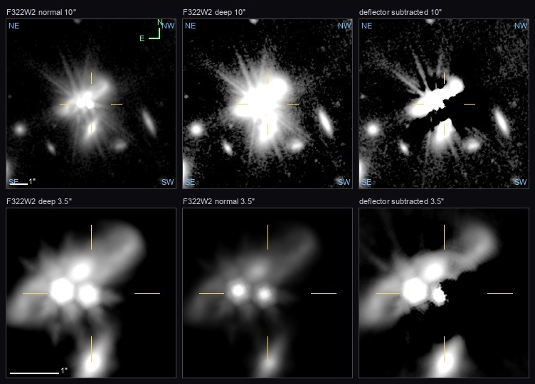{ width="100%" }](img/rank-050-orig.jpg){ target=_blank }
  <figcaption>What the judge saw (blind, footer removed)</figcaption>
</figure>

<figure markdown="span">
  [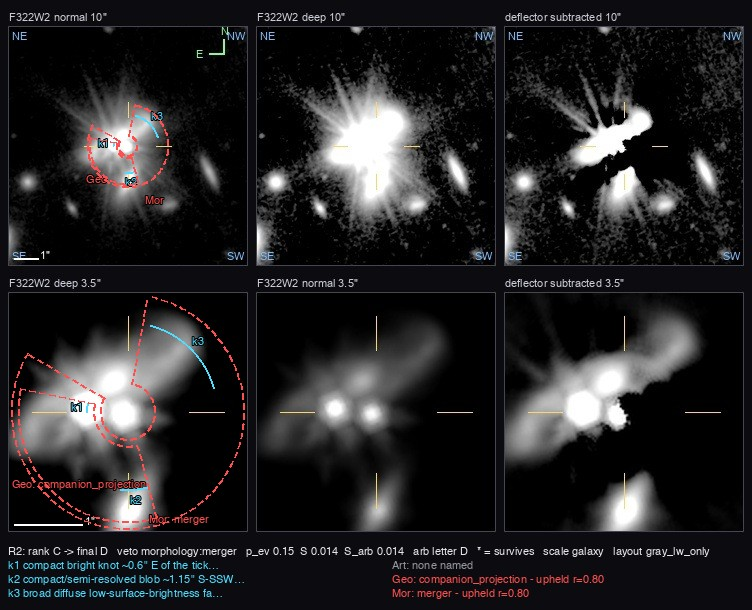{ width="100%" }](img/rank-050-annot.jpg){ target=_blank }
  <figcaption>Advocate evidence (cyan) and critic alternatives coloured by the arbitrator ruling</figcaption>
</figure>

???+ note "Why this grade — advocate, critics, arbitrator"
    **Letter D** (deployed, rule R2) · p_evidence 0.15 · S_arb 0.014 · S 0.014 · scale galaxy

    Letter: D rule: morphology (merger) covers every item (a = 1) at r 0.80 >= 0.80 (upheld).

    **Advocate**

    - criteria: source_contrast 3, low_surface_brightness 5, curvature 2, counter_image 2, arc_morphology 1
    - items (3):
        - k1 — “compact bright knot ~0.6" E of the ticked galaxy, comparable peak brightness to the deflector core (second nucleus or knot); listed for the critics to test as a possible lensed image” (panel d, r 0.6 arcsec, PA 78->92, visible in direct: yes; criteria: low_surface_brightness, counter_image)
        - k2 — “compact/semi-resolved blob ~1.15" S-SSW of the tick centre, clearly separated from the core in both deep and normal zooms and standing out as a one-sided residual in (f); no matching knot at ~1.1" to the N” (panel d, r 1.15 arcsec, PA 175->195, visible in direct: yes; criteria: source_contrast, low_surface_brightness)
        - k3 — “broad diffuse low-surface-brightness fan/plume extending NW of the pair, ~0.9-1.6" out, with a soft outer edge; it is a fan opening away from the centre rather than a thin fixed-radius band” (panel d, r 1.3 arcsec, PA 285->345, visible in direct: yes; criteria: low_surface_brightness)
    - scale galaxy; red neighbours within 10 arcsec 4; BCG-like halo no; deflector is centre no; centre-of-curvature offset 2 arcsec
    - p_evidence: 0.15
    - notes: “Zoom panels (d)/(e) show two comparably bright nuclei separated by ~0.6" embedded in a common diffuse envelope, a bright blob 1.15" S and a broad NW plume, while the 10" panels are dominated by a 6-spike diffraction pattern from the core; nothing in the field is thin, tangential or at constant radius, and the diffuse light is centred between the two nuclei rather than on the ticked galaxy.”

    **Critics**

    **artifact — no alternative named (nothing in its competence fits)**

    - leaves standing: k1, k2, k3
    - scale_class: galaxy
    - measured: `{"diffraction_pattern": "bright compact core in (a)/(b) shows straight radial rays traceable to r~2.5-3\"; rays are ~2-4 px wide and never bend or close at fixed radius", "item1_morphology": "round, separately-peaked source at r=0.6\", PA~85 in (e) - width comparable to core FWHM in both axes, not a linear ray", "item2_morphology": "round compact blob at r~1.2\", PA~188 in (d)/(e) and as an isolated positive blob in (c) at 10\"; no linear connection to a spike axis", "item3_angular_width": "~60 deg wide diffuse plume with soft outer edge - an order of magnitude wider than any spike and one-sided, so not an azimuthally symmetric PSF wing", "items_traceable_in_unsubtracted_panels": "1, 2 and 3 are all clearly present in (d) deep zoom and (e) normal zoom, so none qualifies as subtraction_residual"}`
    - notes: “The bright core does produce a visible NIRCam spike pattern in (a)/(b)/(c) (straight rays out to ~3"), but none of the three items lies on a ray: the 0.6" E knot (PA~85) and the ~1.2" S-SSW blob (PA~188) are round, separately-peaked sources in the un-subtracted normal zoom (e), and the NW plume (PA 285-345) is a ~60 deg wide soft-edged fan, far broader and more one-sided than a spike or a PSF halo. All three appear in the direct panels (d)/(e), so nothing here is a subtraction residual, detector artefact, persistence or striping; whether the knots and fan are lensed images or host/tidal structure is outside my competence.”
    - ruling: no ruling for this critic

    **geometry — companion_projection:** “A close double system: a second compact nucleus of comparable peak brightness 0.6" E of the ticked core (item 1) plus a separate compact object ~1.2-1.5" S (item 2), sitting at mutually unrelated radii and position angles with no counter-images and no tangential elongation - i.e. neighbouring/interacting galaxies projected on the deflector, not multiple images of one source.”

    - location: r 0.5-1.6 arcsec, PA 78->195
    - accounts for: k1, k2; leaves standing: k3; strength r 0.80; coverage a 0.667 (geometric)
    - scale_class: galaxy
    - measured: `{"centre_of_curvature": "undefined - no arc; the three items share no common curvature centre within 0.5\" of the tick", "counter_image_at_r0.6_pa268": "absent in (d) and (e)", "counter_image_at_r1.2_pa0": "absent", "item1_axis_ratio": "~1.0 (round, PSF-like, same compact profile and same spike pattern as the ticked core in panel b) - tangential elongation ~0", "item1_pa_deg": 88, "item2_radius_arcsec": "1.2-1.5 (measured 190-200 px at 0.0076\"/px in panel d)", "nucleus_separation_arcsec": 0.6, "radius_mismatch_item1_vs_item2_arcsec": 0.6}`
    - notes: “In (d) and (e) the object 0.6" E of the tick (PA~88) is a round, saturated core with the same compact profile and the same spike pattern as the ticked nucleus - a second nucleus, not a tangentially stretched image, and nothing sits opposite it at PA~268; the S object at ~1.2-1.5" (PA~180) has no N counterpart and lies at an incompatible radius, so the two cannot be images of one source. The NW fan (item 3) is a diffuse plume, not a fixed-radius band, but its origin is the morphology critic's call.”
    - ruling: upheld, covers k1, k2 — “In panel (e) the source 0.6" E of the tick is a round, equally saturated second core with the same compact PSF profile as the ticked nucleus and nothing at PA~268, and the ~1.2-1.5" S blob at PA~180 has its own halo and no northern counterpart, so the two lie at unrelated radii with no tangential stretch.”

    **morphology — merger:** “An interacting/merging system: two comparable-brightness nuclei ~0.6" apart sharing one continuous, lopsided stellar envelope, a third smaller companion/knot ~1.2-1.5" to the south with its own halo, and a broad NW tidal plume whose radius grows with angle and which fans outward instead of staying at fixed radius.”

    - location: r 0.4-1.7 arcsec, PA 60->350
    - accounts for: k1, k2, k3; leaves standing: none; strength r 0.80; coverage a 1.00 (geometric)
    - scale_class: galaxy
    - measured: `{"nucleus_peak_ratio": "~1:1 (both cores saturate identically in panel (e))", "nucleus_separation_arcsec": 0.57, "nw_plume_radius_vs_angle": "grows from ~0.8\" at PA~300 to ~1.4\" at PA~335 (fan, not fixed radius)", "south_blob_radius_arcsec": "1.2-1.5 at PA~180-185, own extended halo, no northern counterpart", "tangential_axis_ratio_of_any_feature": "none; no elongation perpendicular to the radius vector anywhere"}`
    - notes: “In panel (e) the two point-like cores at (155,270) and (232,272) px are of equal peak brightness and sit inside one common diffuse envelope that also carries the SE fuzz and the NW plume, i.e. a bridge-joined double nucleus, not a deflector plus counter-image; the NW feature (peak near (330,140) px in (d)) is a broad fan with a soft outer edge whose radius increases with position angle, and the southern blob near (245,470) px is a separate compact object with its own halo and no tangential stretch or northern counter-arc.”
    - ruling: upheld, covers k1, k2, k3 — “The two ~1:1 cores at (155,270)/(232,272) px in (e) sit inside one continuous lopsided envelope that also carries the southern companion and the NW fan, whose radius grows from ~0.8" at PA~300 to ~1.4" at PA~335 with a soft outer edge - a tidal plume, not a fixed-radius band.”

    **Arbitrator**

    - surviving items: none (0 of 3)
    - letter_llm: D; scale_class_final: galaxy; needs_human: no
    - rationale: “Every located item is accounted for by an upheld alternative on direct-panel evidence, so nothing survives. In the 3.5" zooms (d)/(e) the ticked galaxy is one of TWO comparably bright, equally saturated point-like nuclei separated by ~0.6" and embedded in a single common, lopsided diffuse envelope - the classic double-nucleus signature of an interaction, not a deflector plus a tangentially stretched counter-image; item 1 is round with axis ratio ~1 and has no partner at PA~268. Item 2, the compact blob ~1.2-1.5" S at PA~180 with its own halo, sits at an incompatible radius and has no northern counter-arc, so it cannot be a second image of the same source; geometry's companion_projection covers items 1-2 and morphology's merger subsumes them plus item 3. Item 3, the broad NW feature, is a ~60°-wide fan whose radius grows with position angle (~0.8" at PA~300 to ~1.4" at PA~335) and whose outer edge is soft - a tidal plume opening outward, the opposite of a thin band at constant radius. The bright straight rays out to ~3" in (a)/(b)/(c) are the NIRCam 6-spike pattern from the saturated cores and touch none of the items; the strong structure in (c)/(f) is exactly the dipole/bowtie expected from a circular profile subtracted on an off-centre, companion-blended pair and carries no weight either way. No tangential curvature, no fixed-radius arc, no counter-image anywhere: this is an interacting/merging pair with a southern companion and a tidal plume.”

    **Score**

    - S = p_ev x prod(1 - r_i a_i) = 0.15 x (1 - 0.80x0.667) x (1 - 0.80x1.00) = 0.014
        - terms: geometry companion_projection r 0.80 a 0.667; morphology merger r 0.80 a 1.00
    - S_arb = p_ev x prod_{upheld/partial}(1 - r_i a_i') = 0.15 x (1 - 0.80x0.667) x (1 - 0.80x1.00) = 0.014
        - terms: geometry companion_projection r 0.80 a 0.667 (upheld); morphology merger r 0.80 a 1.00 (upheld)
    - stored grade_pred (on S): D — S 0.014 < t_B 0.17 (calibrated at 5% FPR on clean negatives) and morphology (merger) covers every item at r 0.80 >= 0.80
    - stored letter_arb (on S_arb): D; letter_source: opus5_api_calibrated
    - deploy rule R2: letter_rank (advocate only, on p_evidence) = C — p_evidence 0.15 < t_B 0.17 (calibrated at 5% FPR on clean negatives); not D: 3 item(s) located; no named critic covers every item at r >= 0.80
    - deploy rule R2: letter_final = D — D rule: morphology (merger) covers every item (a = 1) at r 0.80 >= 0.80 (upheld)
    - veto: morphology:merger

---

[:material-arrow-left: Ranks 1–25](ranks-001-025.md){ .md-button }
[:material-view-list: Overview](index.md){ .md-button }
[Ranks 51–75 :material-arrow-right:](ranks-051-075.md){ .md-button }
