# JWST Top-100 regrade: ranks 51–75

Candidates 51–75 by original pipeline rank, each with the composite the judge saw, the
annotated composite and the full grading record. Legend, thresholds and the summary tables are on
the [overview](index.md). Click an image to open it full size.

Pages: [Ranks 1–25](ranks-001-025.md) · [Ranks 26–50](ranks-026-050.md) · **Ranks 51–75** · [Ranks 76–100](ranks-076-100.md).

---

## Rank 51: J4310830-518328 {#rank-51}

| Original grade | Passes | Inspector conf. | Pipeline θ_E |
|:--:|:--:|:--:|:--:|
| **U** | — | 26 | — |

| New (final) | Rank letter | p_ev | S_arb | Demoted by | Arb. letter | Needs human |
|:--:|:--:|--:|--:|:--|:--:|:--:|
| **C** | C | 0.14 | 0.140 | — | — | no |

<small>pipeline discovery status `new` · scale class `galaxy`</small>

<figure markdown="span">
  [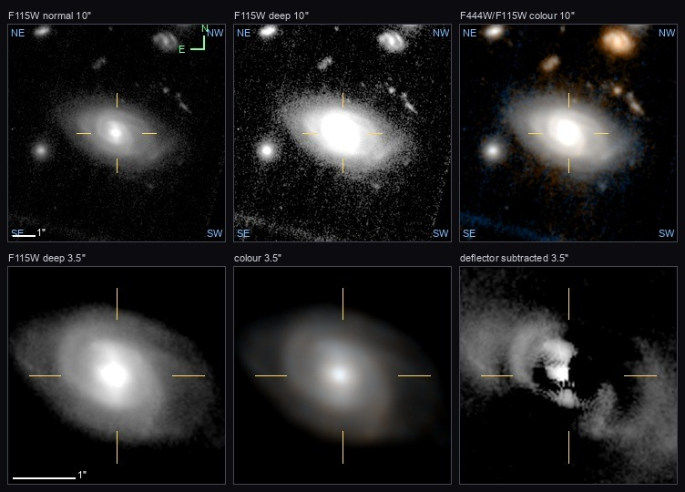{ width="100%" }](img/rank-051-orig.jpg){ target=_blank }
  <figcaption>What the judge saw (blind, footer removed)</figcaption>
</figure>

<figure markdown="span">
  [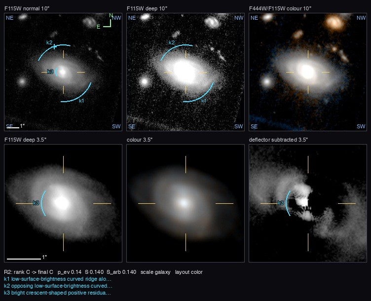{ width="100%" }](img/rank-051-annot.jpg){ target=_blank }
  <figcaption>Advocate evidence (cyan) and critic alternatives coloured by the arbitrator ruling</figcaption>
</figure>

???+ note "Why this grade — advocate, critics, arbitrator"
    **Letter C** (deployed, rule R2) · p_evidence 0.14 · S_arb 0.14 · S 0.14 · scale galaxy

    Letter: letter_rank stands (D rule not met); p_evidence 0.14 < t_B 0.17 (calibrated at 5% FPR on clean negatives); not D: 3 item(s) located; no named critic covers every item at r >= 0.80.

    **Advocate**

    - criteria: source_contrast 2, low_surface_brightness 5, curvature 3, counter_image 2, arc_morphology 2
    - items (3):
        - k1 — “low-surface-brightness curved ridge along the southern/south-western edge of the extended envelope, concave toward the bright core; traceable in the deep 10" stretch and at the bottom of the 3.5" zoom” (panel b, r 2.5 arcsec, PA 175->250, visible in direct: yes; criteria: low_surface_brightness, curvature)
        - k2 — “opposing low-surface-brightness curved ridge on the northern/north-eastern side of the envelope at a comparable radius, giving a crude two-sided (pseudo counter-arc) symmetry about the ticked galaxy” (panel b, r 2.3 arcsec, PA 345->65, visible in direct: yes; criteria: low_surface_brightness, curvature, counter_image)
        - k3 — “bright crescent-shaped positive residual just east of the nucleus in the deflector-subtracted zoom, at roughly constant radius over ~60 deg of azimuth; no clear matching feature isolated in the direct panels because the core is saturated inside this radius” (panel f, r 0.65 arcsec, PA 55->125, visible in direct: no; criteria: low_surface_brightness, arc_morphology)
    - scale galaxy; red neighbours within 10 arcsec 3; BCG-like halo no; deflector is centre yes; arc radius 2.5 arcsec; arc PA span 175->250; counter-image at r 2.3 arcsec PA 20; centre-of-curvature offset 0.6 arcsec
    - p_evidence: 0.14
    - notes: “The ticked object is a bright-bulged, inclined disc whose outer envelope carries two opposed low-surface-brightness ridges (items 1-2) that curve about the nucleus but appear continuously attached to it and grow in radius with azimuth, and the only inner tangential-looking feature (item 3, the crescent east of the core in (f)) sits exactly where the circular-profile model leaves its bowtie lobes and is not separable in the saturated direct zoom.”

    **Critics**

    - not called (p_evidence 0.14 < tau0 0.15)

    **Arbitrator**

    - no arbitrator record (not called)

    **Score**

    - S = p_ev = 0.14 (no critic term entered the product)
    - S_arb = p_ev = 0.14 (no critic term entered the product)
    - stored grade_pred (on S): C — S 0.14 < t_B 0.17 (calibrated at 5% FPR on clean negatives); not D: 3 item(s) located; no named critic covers every item at r >= 0.80
    - stored letter_arb (on S_arb): C; letter_source: opus5_api_calibrated
    - deploy rule R2: letter_rank (advocate only, on p_evidence) = C — p_evidence 0.14 < t_B 0.17 (calibrated at 5% FPR on clean negatives); not D: 3 item(s) located; no named critic covers every item at r >= 0.80
    - deploy rule R2: letter_final = C — letter_rank stands (D rule not met); p_evidence 0.14 < t_B 0.17 (calibrated at 5% FPR on clean negatives); not D: 3 item(s) located; no named critic covers every item at r >= 0.80
    - veto: none (letter_final == letter_rank)

---

## Rank 52: J14920654+6969086 {#rank-52}

| Original grade | Passes | Inspector conf. | Pipeline θ_E |
|:--:|:--:|:--:|:--:|
| **U** | — | 26 | — |

| New (final) | Rank letter | p_ev | S_arb | Demoted by | Arb. letter | Needs human |
|:--:|:--:|--:|--:|:--|:--:|:--:|
| **C** | C | 0.10 | 0.100 | — | — | no |

<small>pipeline discovery status `new` · scale class `none`</small>

<figure markdown="span">
  [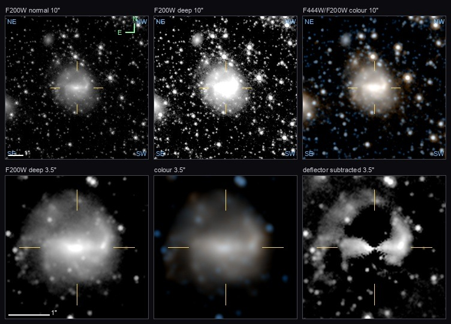{ width="100%" }](img/rank-052-orig.jpg){ target=_blank }
  <figcaption>What the judge saw (blind, footer removed)</figcaption>
</figure>

<figure markdown="span">
  [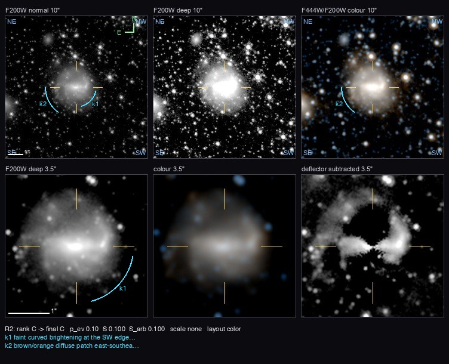{ width="100%" }](img/rank-052-annot.jpg){ target=_blank }
  <figcaption>Advocate evidence (cyan) and critic alternatives coloured by the arbitrator ruling</figcaption>
</figure>

???+ note "Why this grade — advocate, critics, arbitrator"
    **Letter C** (deployed, rule R2) · p_evidence 0.10 · S_arb 0.10 · S 0.10 · scale none

    Letter: letter_rank stands (D rule not met); p_evidence 0.10 < t_B 0.17 (calibrated at 5% FPR on clean negatives); not D: 2 item(s) located; no named critic covers every item at r >= 0.80.

    **Advocate**

    - criteria: source_contrast 2, low_surface_brightness 4, curvature 2, counter_image 1, arc_morphology 2
    - items (2):
        - k1 — “faint curved brightening at the SW edge of the diffuse envelope, same grey/white hue and same steep-outward profile as the host halo, no thinning relative to its radius” (panel d, r 1.4 arcsec, PA 195->260, visible in direct: yes; criteria: low_surface_brightness)
        - k2 — “brown/orange diffuse patch east-southeast of the nucleus, redder than the whitish body in the colour panels, low surface brightness, no tangential elongation and no opposite-side match” (panel c, r 2.2 arcsec, PA 90->145, visible in direct: yes; criteria: source_contrast, low_surface_brightness)
    - scale none; red neighbours within 10 arcsec 1; BCG-like halo yes; deflector is centre no
    - p_evidence: 0.10
    - notes: “Panels (a)/(b) resolve the whole field AND the galaxy body itself into hundreds of point sources with a bright E-W bar/knot chain across the centre in (d), i.e. a nearby resolved-star system; the crescent on the west and the dark central hole in (f) match exactly the bowtie/concentric-ring signature the VIEW attributes to circular subtraction of a barred, inclined galaxy and are not counted, and no thin tangential feature at fixed radius is traceable in any direct panel from 0.3" out to ~5".”

    **Critics**

    - not called (p_evidence 0.10 < tau0 0.15)

    **Arbitrator**

    - no arbitrator record (not called)

    **Score**

    - S = p_ev = 0.10 (no critic term entered the product)
    - S_arb = p_ev = 0.10 (no critic term entered the product)
    - stored grade_pred (on S): C — S 0.10 < t_B 0.17 (calibrated at 5% FPR on clean negatives); not D: 2 item(s) located; no named critic covers every item at r >= 0.80
    - stored letter_arb (on S_arb): C; letter_source: opus5_api_calibrated
    - deploy rule R2: letter_rank (advocate only, on p_evidence) = C — p_evidence 0.10 < t_B 0.17 (calibrated at 5% FPR on clean negatives); not D: 2 item(s) located; no named critic covers every item at r >= 0.80
    - deploy rule R2: letter_final = C — letter_rank stands (D rule not met); p_evidence 0.10 < t_B 0.17 (calibrated at 5% FPR on clean negatives); not D: 2 item(s) located; no named critic covers every item at r >= 0.80
    - veto: none (letter_final == letter_rank)

---

## Rank 53: J15067319+221999 {#rank-53}

| Original grade | Passes | Inspector conf. | Pipeline θ_E |
|:--:|:--:|:--:|:--:|
| **U** | — | 26 | — |

| New (final) | Rank letter | p_ev | S_arb | Demoted by | Arb. letter | Needs human |
|:--:|:--:|--:|--:|:--|:--:|:--:|
| **C** | C | 0.12 | 0.120 | — | — | no |

<small>pipeline discovery status `new` · scale class `group`</small>

<figure markdown="span">
  [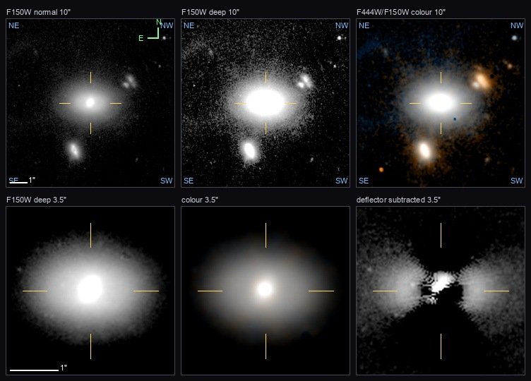{ width="100%" }](img/rank-053-orig.jpg){ target=_blank }
  <figcaption>What the judge saw (blind, footer removed)</figcaption>
</figure>

<figure markdown="span">
  [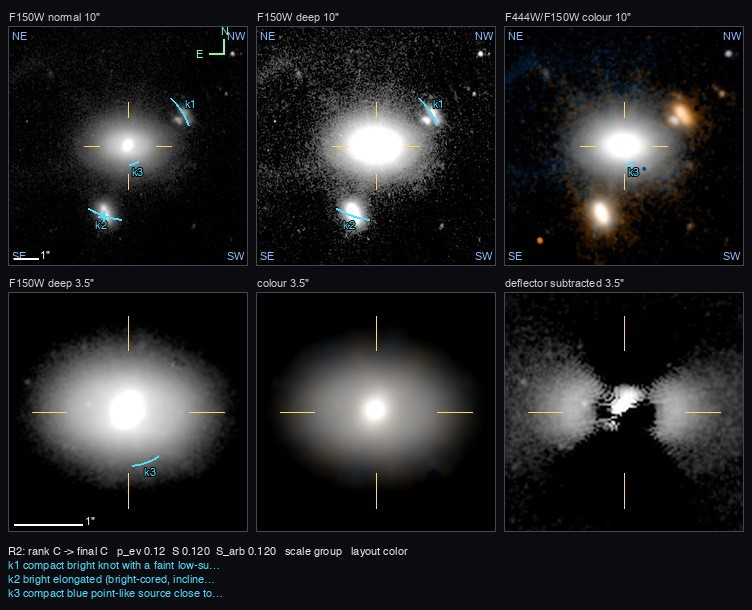{ width="100%" }](img/rank-053-annot.jpg){ target=_blank }
  <figcaption>Advocate evidence (cyan) and critic alternatives coloured by the arbitrator ruling</figcaption>
</figure>

???+ note "Why this grade — advocate, critics, arbitrator"
    **Letter C** (deployed, rule R2) · p_evidence 0.12 · S_arb 0.12 · S 0.12 · scale group

    Letter: letter_rank stands (D rule not met); p_evidence 0.12 < t_B 0.17 (calibrated at 5% FPR on clean negatives); not D: 3 item(s) located; no named critic covers every item at r >= 0.80.

    **Advocate**

    - criteria: source_contrast 4, low_surface_brightness 3, curvature 1, counter_image 2, arc_morphology 1
    - items (3):
        - k1 — “compact bright knot with a faint low-surface-brightness extension curving toward the deflector, NW of the ticked galaxy” (panel b, r 2.7 arcsec, PA 288->318, visible in direct: yes; criteria: source_contrast, low_surface_brightness)
        - k2 — “bright elongated (bright-cored, inclined-disc-looking) object SSE of the deflector, lying roughly opposite item 1 at a radius matching it to ~15%” (panel b, r 3.1 arcsec, PA 148->175, visible in direct: yes; criteria: source_contrast, counter_image)
        - k3 — “compact blue point-like source close to the deflector core, distinct in hue from the red/white deflector light, seen in the two-band colour renderings” (panel c, r 0.8 arcsec, PA 185->215, visible in direct: yes; criteria: source_contrast)
    - scale group; red neighbours within 10 arcsec 4; BCG-like halo yes; deflector is centre yes; counter-image at r 3.1 arcsec PA 161
    - p_evidence: 0.12
    - notes: “Zoom panels (d,e) show only a smooth E-W elongated elliptical envelope with no tangential feature at any radius and its core saturated inside ~0.5", while panel (f) shows nothing but the four-lobed bowtie expected from the circular-profile subtraction; the only located candidates are the 2.7" NW knot-plus-tail, the 3.1" SSE bright-cored elongated object roughly opposite it, and a compact blue point ~0.8" S of the nucleus in the colour panels.”

    **Critics**

    - not called (p_evidence 0.12 < tau0 0.15)

    **Arbitrator**

    - no arbitrator record (not called)

    **Score**

    - S = p_ev = 0.12 (no critic term entered the product)
    - S_arb = p_ev = 0.12 (no critic term entered the product)
    - stored grade_pred (on S): C — S 0.12 < t_B 0.17 (calibrated at 5% FPR on clean negatives); not D: 3 item(s) located; no named critic covers every item at r >= 0.80
    - stored letter_arb (on S_arb): C; letter_source: opus5_api_calibrated
    - deploy rule R2: letter_rank (advocate only, on p_evidence) = C — p_evidence 0.12 < t_B 0.17 (calibrated at 5% FPR on clean negatives); not D: 3 item(s) located; no named critic covers every item at r >= 0.80
    - deploy rule R2: letter_final = C — letter_rank stands (D rule not met); p_evidence 0.12 < t_B 0.17 (calibrated at 5% FPR on clean negatives); not D: 3 item(s) located; no named critic covers every item at r >= 0.80
    - veto: none (letter_final == letter_rank)

---

## Rank 54: J4784995-5841089 {#rank-54}

| Original grade | Passes | Inspector conf. | Pipeline θ_E |
|:--:|:--:|:--:|:--:|
| **U** | — | 26 | 1.60″ |

| New (final) | Rank letter | p_ev | S_arb | Demoted by | Arb. letter | Needs human |
|:--:|:--:|--:|--:|:--|:--:|:--:|
| **C** | C | 0.12 | 0.120 | — | — | no |

<small>pipeline discovery status `new` · scale class `galaxy`</small>

<figure markdown="span">
  [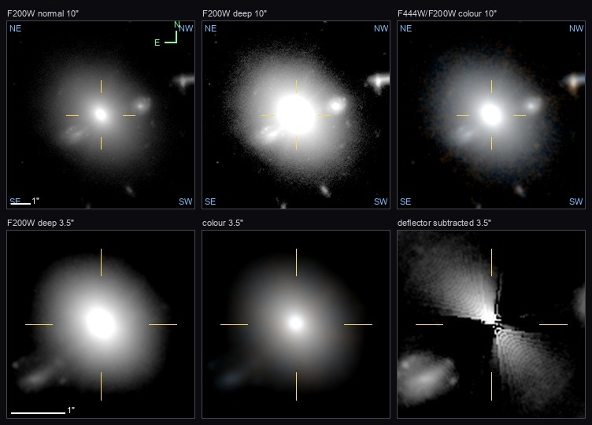{ width="100%" }](img/rank-054-orig.jpg){ target=_blank }
  <figcaption>What the judge saw (blind, footer removed)</figcaption>
</figure>

<figure markdown="span">
  [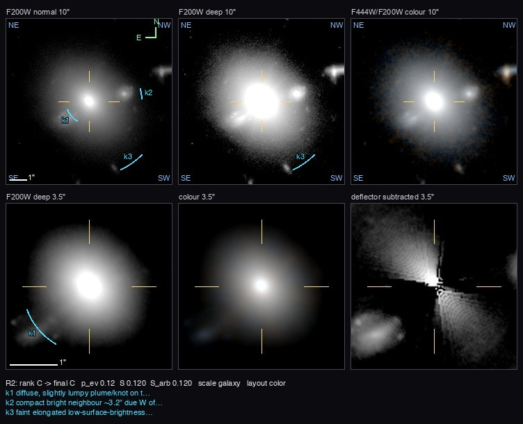{ width="100%" }](img/rank-054-annot.jpg){ target=_blank }
  <figcaption>Advocate evidence (cyan) and critic alternatives coloured by the arbitrator ruling</figcaption>
</figure>

???+ note "Why this grade — advocate, critics, arbitrator"
    **Letter C** (deployed, rule R2) · p_evidence 0.12 · S_arb 0.12 · S 0.12 · scale galaxy

    Letter: letter_rank stands (D rule not met); p_evidence 0.12 < t_B 0.17 (calibrated at 5% FPR on clean negatives); not D: 3 item(s) located; no named critic covers every item at r >= 0.80.

    **Advocate**

    - criteria: source_contrast 2, low_surface_brightness 5, curvature 1, counter_image 1, arc_morphology 2
    - items (3):
        - k1 — “diffuse, slightly lumpy plume/knot on the SE side of the envelope, ~1.3-1.5" from the tick centre; traceable as a brightness excess in the deep zoom (d) and as the one-sided bright residual in the lower-left of (f); no thin tangential shape, appears continuous with the outer envelope” (panel d, r 1.4 arcsec, PA 110->150, visible in direct: yes; criteria: low_surface_brightness)
        - k2 — “compact bright neighbour ~3.2" due W of the deflector, marginally resolved and slightly elongated E-W, same whitish hue as the deflector in (c); no mirrored counterpart at similar radius on the E side” (panel a, r 3.2 arcsec, PA 272->284, visible in direct: yes; criteria: source_contrast)
        - k3 — “faint elongated low-surface-brightness streak in the SW corner of the 10" panels, ~4.5" from the deflector, straight and radially oriented rather than tangential” (panel b, r 4.5 arcsec, PA 205->225, visible in direct: yes; criteria: low_surface_brightness)
    - scale galaxy; red neighbours within 10 arcsec 2; BCG-like halo yes; deflector is centre no
    - p_evidence: 0.12
    - notes: “The zoom panels show a saturated round core inside ~0.6" with a boxy envelope; the only offset structures are a diffuse SE plume at ~1.4" (bright one-sided residual at lower-left of (f), no NW counterpart at matching radius) and a compact W neighbour at ~3.2" - nowhere in (a)-(e) is there a thin feature at constant radius or a pair of knots straddling the nucleus.”

    **Critics**

    - not called (p_evidence 0.12 < tau0 0.15)

    **Arbitrator**

    - no arbitrator record (not called)

    **Score**

    - S = p_ev = 0.12 (no critic term entered the product)
    - S_arb = p_ev = 0.12 (no critic term entered the product)
    - stored grade_pred (on S): C — S 0.12 < t_B 0.17 (calibrated at 5% FPR on clean negatives); not D: 3 item(s) located; no named critic covers every item at r >= 0.80
    - stored letter_arb (on S_arb): C; letter_source: opus5_api_calibrated
    - deploy rule R2: letter_rank (advocate only, on p_evidence) = C — p_evidence 0.12 < t_B 0.17 (calibrated at 5% FPR on clean negatives); not D: 3 item(s) located; no named critic covers every item at r >= 0.80
    - deploy rule R2: letter_final = C — letter_rank stands (D rule not met); p_evidence 0.12 < t_B 0.17 (calibrated at 5% FPR on clean negatives); not D: 3 item(s) located; no named critic covers every item at r >= 0.80
    - veto: none (letter_final == letter_rank)

---

## Rank 55: J4205283+264369 {#rank-55}

| Original grade | Passes | Inspector conf. | Pipeline θ_E |
|:--:|:--:|:--:|:--:|
| **U** | — | 26 | 1.35″ |

| New (final) | Rank letter | p_ev | S_arb | Demoted by | Arb. letter | Needs human |
|:--:|:--:|--:|--:|:--|:--:|:--:|
| **C** | C | 0.12 | 0.120 | — | — | no |

<small>pipeline discovery status `new` · scale class `galaxy`</small>

<figure markdown="span">
  [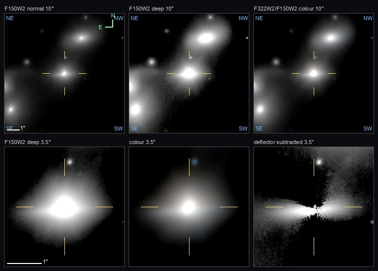{ width="100%" }](img/rank-055-orig.jpg){ target=_blank }
  <figcaption>What the judge saw (blind, footer removed)</figcaption>
</figure>

<figure markdown="span">
  [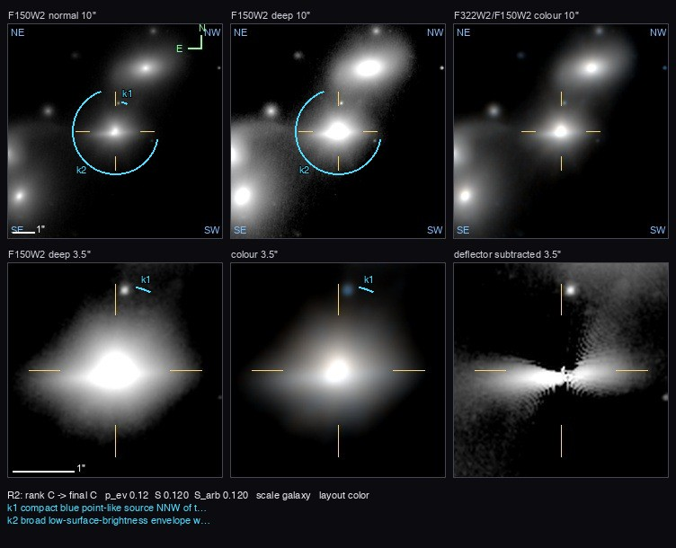{ width="100%" }](img/rank-055-annot.jpg){ target=_blank }
  <figcaption>Advocate evidence (cyan) and critic alternatives coloured by the arbitrator ruling</figcaption>
</figure>

???+ note "Why this grade — advocate, critics, arbitrator"
    **Letter C** (deployed, rule R2) · p_evidence 0.12 · S_arb 0.12 · S 0.12 · scale galaxy

    Letter: letter_rank stands (D rule not met); p_evidence 0.12 < t_B 0.17 (calibrated at 5% FPR on clean negatives); not D: 2 item(s) located; no named critic covers every item at r >= 0.80.

    **Advocate**

    - criteria: source_contrast 5, low_surface_brightness 2, curvature 1, counter_image 1, arc_morphology 1
    - items (2):
        - k1 — “compact blue point-like source NNW of the deflector, sharply peaked (unresolved or barely resolved), distinct in hue from the orange deflector core; present in the direct deep and colour zooms and surviving as a positive knot in the subtracted panel” (panel e, r 1.4 arcsec, PA 336->346, visible in direct: yes; criteria: source_contrast)
        - k2 — “broad low-surface-brightness envelope with an X / bowtie shape around the deflector extending NE-SW and E-W, traceable in the deep 10" and deep zoom panels; extended and diffuse but NOT confined to a fixed radius and not tangential (reads as interaction/tidal or boxy-bulge light bridging toward the bright NNW neighbour)” (panel b, r 2 arcsec, PA 20->260, visible in direct: yes; criteria: low_surface_brightness)
    - scale galaxy; red neighbours within 10 arcsec 4; BCG-like halo yes; deflector is centre yes
    - p_evidence: 0.12
    - notes: “The only offset compact feature is a blue point at r~1.4", PA~341 (visible in d, e and as a knot in f) with no counterpart within 40% of that radius near PA~161; the rest of the light is the E-W bowtie of the circular-model subtraction plus a broad diffuse NE-SW envelope in (b) that grows in radius with angle toward the bright NNW neighbour rather than staying tangential.”

    **Critics**

    - not called (p_evidence 0.12 < tau0 0.15)

    **Arbitrator**

    - no arbitrator record (not called)

    **Score**

    - S = p_ev = 0.12 (no critic term entered the product)
    - S_arb = p_ev = 0.12 (no critic term entered the product)
    - stored grade_pred (on S): C — S 0.12 < t_B 0.17 (calibrated at 5% FPR on clean negatives); not D: 2 item(s) located; no named critic covers every item at r >= 0.80
    - stored letter_arb (on S_arb): C; letter_source: opus5_api_calibrated
    - deploy rule R2: letter_rank (advocate only, on p_evidence) = C — p_evidence 0.12 < t_B 0.17 (calibrated at 5% FPR on clean negatives); not D: 2 item(s) located; no named critic covers every item at r >= 0.80
    - deploy rule R2: letter_final = C — letter_rank stands (D rule not met); p_evidence 0.12 < t_B 0.17 (calibrated at 5% FPR on clean negatives); not D: 2 item(s) located; no named critic covers every item at r >= 0.80
    - veto: none (letter_final == letter_rank)

---

## Rank 56: J14977486+224978 {#rank-56}

| Original grade | Passes | Inspector conf. | Pipeline θ_E |
|:--:|:--:|:--:|:--:|
| **U** | — | 26 | 1.46″ |

| New (final) | Rank letter | p_ev | S_arb | Demoted by | Arb. letter | Needs human |
|:--:|:--:|--:|--:|:--|:--:|:--:|
| **B** | B | 0.25 | 0.069 | — | D | no |

<small>pipeline discovery status `new` · scale class `galaxy`</small>

<figure markdown="span">
  [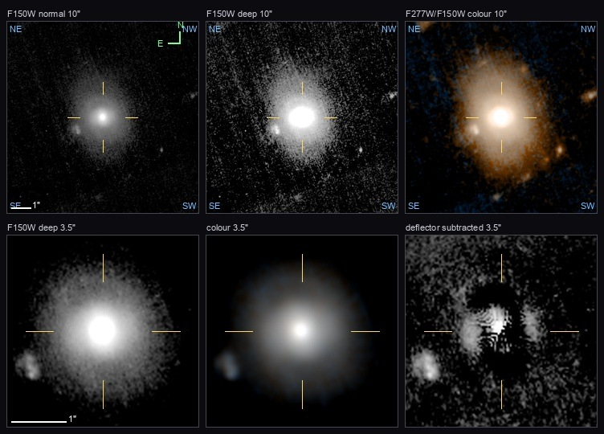{ width="100%" }](img/rank-056-orig.jpg){ target=_blank }
  <figcaption>What the judge saw (blind, footer removed)</figcaption>
</figure>

<figure markdown="span">
  [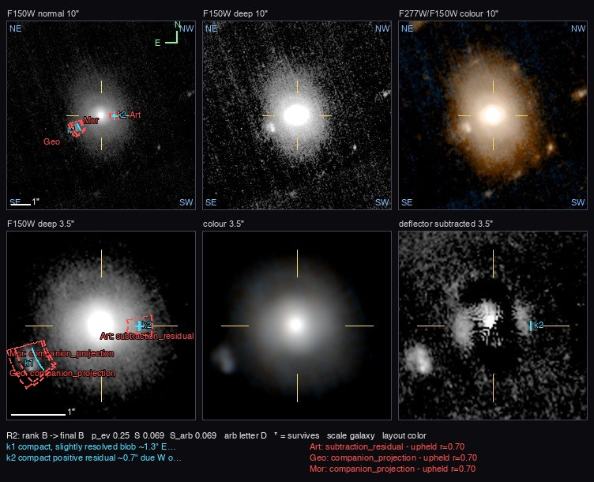{ width="100%" }](img/rank-056-annot.jpg){ target=_blank }
  <figcaption>Advocate evidence (cyan) and critic alternatives coloured by the arbitrator ruling</figcaption>
</figure>

???+ note "Why this grade — advocate, critics, arbitrator"
    **Letter B** (deployed, rule R2) · p_evidence 0.25 · S_arb 0.069 · S 0.069 · scale galaxy

    Letter: letter_rank stands (D rule not met); p_evidence 0.25 >= t_A 0.20 (calibrated at 1% FPR on clean negatives) but A is blocked: only 0 of 3 configuration criteria >= 6; p_evidence 0.25 >= t_B 0.17 (calibrated at 5% FPR on clean negatives).

    **Advocate**

    - criteria: source_contrast 5, low_surface_brightness 3, curvature 1, counter_image 3, arc_morphology 1
    - items (2):
        - k1 — “compact, slightly resolved blob ~1.3" ESE of the ticked nucleus; bluish/white against the orange deflector envelope in (c)/(e), traceable as a distinct source in (a), (d) and as a one-sided positive residual in (f)” (panel d, r 1.35 arcsec, PA 108->128, visible in direct: yes; criteria: source_contrast, low_surface_brightness, counter_image)
        - k2 — “compact positive residual ~0.7" due W of the nucleus in the subtracted zoom, roughly opposite the ESE blob; not mirrored on the other side, so not obviously one of the four butterfly lobes, but it has no direct-panel counterpart under the bright halo” (panel f, r 0.7 arcsec, PA 262->278, visible in direct: no; criteria: counter_image)
    - scale galaxy; red neighbours within 10 arcsec 3; BCG-like halo yes; deflector is centre yes; counter-image at r 0.7 arcsec PA 270
    - p_evidence: 0.25
    - notes: “The only offset features are a compact ESE blob at ~1.3" (bright and star/companion-like in (a), bluish in (e)) and a one-sided ~0.7" W residual in (f); nowhere in (a)-(e) is there a tangentially elongated, fixed-radius arc, and the two knots differ in radius by ~50%, so the pair straddling the nucleus is only a marginal multi-image configuration - the inner ~0.5" is saturated in the direct zoom, so a small-radius image could hide there.”

    **Critics**

    **artifact — subtraction_residual:** “Item 2 is a lump of the circular-profile subtraction: the deflector's inner isophotes are elliptical/asymmetric (visible as an elongated, lumpy core in (b) and a lopsided envelope in (c)), so the azimuthally-averaged 1-D model leaves alternating positive/negative ripples and one-sided lumps at 0.5-1" where the halo gradient is steepest. The west lump has no counterpart in any un-subtracted panel (a,b,c,d,e).”

    - location: r 0.5-0.95 arcsec, PA 258->282
    - accounts for: k2; leaves standing: k1; strength r 0.70; coverage a 0.50 (geometric)
    - scale_class: galaxy
    - measured: `{"concentric_ripple_pattern_in_f": "yes, alternating bright/dark rings across the inner ~0.6\" of (f), the signature of the 1-D circular model on a non-circular core", "instrument_artefacts_checked": "no 6-spike pattern, no snowball, no striping or mosaic seam through either item position", "residual_radius_px_from_stamp_centre": "~62-65 px right (west) of the (f) centre, 0.0146\"/px -> 0.9\"", "tangential_extension_of_item2": "none measurable - the lump is round, axis ratio ~1, not elongated perpendicular to the radius", "traceable_in_d_or_e": "no - at that position (d) and (e) show only smooth halo, no local surface-brightness excess or edge"}`
    - notes: “In (f) the compact positive lump ~62 px right of centre (west, r~0.8") sits inside the concentric ripple field left by the azimuthally-averaged model, and nothing at that position appears in (d), (e), (a) or (b) - it is a subtraction lump, not sky. The ESE source of item 1 at r~1.3", PA~120 is a genuine, clearly detected source in (a), (c), (d) and (e) and is not any instrument or reduction artefact (no spike, no persistence, no PSF-wing geometry), so I leave it standing.”
    - ruling: upheld, covers k2 — “The compact positive lump ~0.7-0.9" west of the core in (f) sits inside the alternating bright/dark ripple field the circular 1-D model leaves on this lumpy, slightly elongated core, and no local surface-brightness excess appears at that position in (a), (b), (d) or (e).”

    **geometry — companion_projection:** “The ESE blob is a small, clumpy irregular galaxy (2-3 resolved knots) projected on the outskirts of the elliptical, not a lensed image: it shows no curvature about the deflector and has no counter-image at a compatible radius anywhere in the direct deep panels.”

    - location: r 1.15-1.65 arcsec, PA 105->132
    - accounts for: k1; leaves standing: k2; strength r 0.70; coverage a 0.50 (geometric)
    - scale_class: galaxy
    - measured: `{"blob_axis_ratio": "~1.5:1 (weak elongation, internally broken into 2-3 knots)", "blob_major_axis_pa_deg": 45, "blob_pa_deg": 118, "blob_radius_arcsec": 1.45, "centre_of_curvature_offset_arcsec": "undefined - no measurable curvature", "counter_image_search_1.2_1.7arcsec_pa_270_330": "nothing above the smooth halo in (d) or (e)", "curvature_about_deflector": "none detectable; chord shows no bending toward the nucleus over its ~0.45\" length", "halo_azimuthal_symmetry_at_r=1.4arcsec": "smooth, no second surface-brightness enhancement", "misalignment_from_tangential_deg": 17, "tangential_pa_at_that_position_deg": 28}`
    - notes: “In (d) the feature sits at r~1.4", PA~118 deg and resolves into a bright knot plus a fainter SW extension - lumpy dwarf-like structure, not a thin smooth arc, and it is straight rather than concave toward the tick centre; the halo at the mirror position (r 1.2-1.7", PA 270-330 deg) in both (d) and (e) is featureless. Item 2 lies only in the subtracted panel, which I was not given, so I leave it standing.”
    - ruling: upheld, covers k1 — “The lower-left source at r~1.4", PA~118 in (d) shows a straight, knotty chord whose major axis lies within ~20 deg of the radius vector rather than the tangential direction, and the mirror annulus (r 1.2-1.7", PA 270-330) is featureless smooth halo.”

    **morphology — companion_projection:** “A small, clumpy irregular satellite/background dwarf projected ~1.5" ESE of the host: it resolves in the deep zoom (d) into 2-3 knots inside a compact envelope whose long axis lies roughly along the radius vector, not tangentially, and it has no counter-image on the opposite side of the nucleus”

    - location: r 1.1-1.8 arcsec, PA 105->130
    - accounts for: k1; leaves standing: k2; strength r 0.70; coverage a 0.50 (geometric)
    - scale_class: galaxy
    - measured: `{"blob_extent_arcsec": "~0.40 x 0.25", "blob_major_axis_orientation": "~ radial (within ~20 deg of the host-blob line), not tangential", "blob_pa_deg": 117, "blob_radius_arcsec": 1.49, "counter_image_search": "no comparable knot at r=1.3-1.7\", PA 285-315 deg in panel (d) or (e)", "host_structure": "smooth, featureless elliptical envelope in (d)/(e): no spiral arms, no bar, no shells, no ring, single nucleus"}`
    - notes: “In (d) the lower-left source at r~1.5", PA~117 deg breaks into two or three knots with a compact halo elongated roughly along the line to the nucleus, i.e. radially, with no curvature about the ticked centre and no counter-knot at PA~297 deg; the host itself is a smooth, unstructured ellipsoid with no arms, shells or tidal debris to which the blob could be attached. Item 2 sits only in the subtracted panel, which is not in my views, so I leave it standing.”
    - ruling: upheld, covers k1 — “The same ESE object resolves into 2-3 knots in a ~0.4x0.25" envelope elongated radially, with the host a smooth featureless ellipsoid and no counter-knot at PA~297.”

    **Arbitrator**

    - surviving items: none (0 of 2)
    - letter_llm: D; scale_class_final: galaxy; needs_human: no
    - rationale: “Only two offset features were ever located and both are now explained. The ESE source (lower-left of the tick centre in (a), (b), (d), bluish-white against the orange envelope in (c)/(e)) is a compact, internally knotty object at r~1.4", PA~118 whose long axis runs roughly along the line to the nucleus rather than perpendicular to it; at 0.031"/px a lensed image of that brightness would show tangential curvature and a matching-profile counter-arc, and the annulus at r 1.2-1.7", PA 270-330 in (d)/(e) is featureless smooth halo, so it is a projected clumpy companion, not a lensed image. The western lump in (f) lies inside the concentric positive/negative ripple field that the circular profile leaves on this visibly non-circular, lumpy core (compare the bowtie plus rings straddling the centre in (f)), is round rather than tangentially extended, and has no counterpart in any un-subtracted panel; it is a subtraction residual, admissible as such precisely because it is invisible in (a)-(e). Nothing in (a)-(e) shows a fixed-radius tangential arc, a broken ring, or a pair of matched-profile images, and the host is a smooth ellipsoid with a normal envelope. With both located items accounted for by upheld alternatives, no evidence for lensing survives.”

    **Score**

    - S = p_ev x prod(1 - r_i a_i) = 0.25 x (1 - 0.70x0.50) x (1 - 0.70x0.50) x (1 - 0.70x0.50) = 0.069
        - terms: artifact subtraction_residual r 0.70 a 0.50; geometry companion_projection r 0.70 a 0.50; morphology companion_projection r 0.70 a 0.50
    - S_arb = p_ev x prod_{upheld/partial}(1 - r_i a_i') = 0.25 x (1 - 0.70x0.50) x (1 - 0.70x0.50) x (1 - 0.70x0.50) = 0.069
        - terms: artifact subtraction_residual r 0.70 a 0.50 (upheld); geometry companion_projection r 0.70 a 0.50 (upheld); morphology companion_projection r 0.70 a 0.50 (upheld)
    - stored grade_pred (on S): C — S 0.069 < t_B 0.17 (calibrated at 5% FPR on clean negatives); not D: 2 item(s) located; no named critic covers every item at r >= 0.80
    - stored letter_arb (on S_arb): C; letter_source: opus5_api_calibrated
    - deploy rule R2: letter_rank (advocate only, on p_evidence) = B — p_evidence 0.25 >= t_A 0.20 (calibrated at 1% FPR on clean negatives) but A is blocked: only 0 of 3 configuration criteria >= 6; p_evidence 0.25 >= t_B 0.17 (calibrated at 5% FPR on clean negatives)
    - deploy rule R2: letter_final = B — letter_rank stands (D rule not met); p_evidence 0.25 >= t_A 0.20 (calibrated at 1% FPR on clean negatives) but A is blocked: only 0 of 3 configuration criteria >= 6; p_evidence 0.25 >= t_B 0.17 (calibrated at 5% FPR on clean negatives)
    - veto: none (letter_final == letter_rank)

---

## Rank 57: J21006317+1456150 {#rank-57}

| Original grade | Passes | Inspector conf. | Pipeline θ_E |
|:--:|:--:|:--:|:--:|
| **U** | — | 25 | 2.17″ |

| New (final) | Rank letter | p_ev | S_arb | Demoted by | Arb. letter | Needs human |
|:--:|:--:|--:|--:|:--|:--:|:--:|
| **B** | B | 0.18 | 0.070 | — | D | no |

<small>pipeline discovery status `new` · scale class `none`</small>

<figure markdown="span">
  [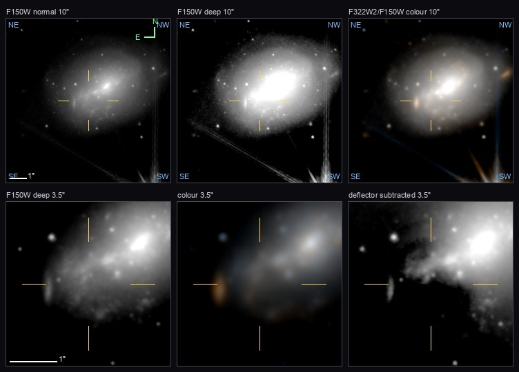{ width="100%" }](img/rank-057-orig.jpg){ target=_blank }
  <figcaption>What the judge saw (blind, footer removed)</figcaption>
</figure>

<figure markdown="span">
  [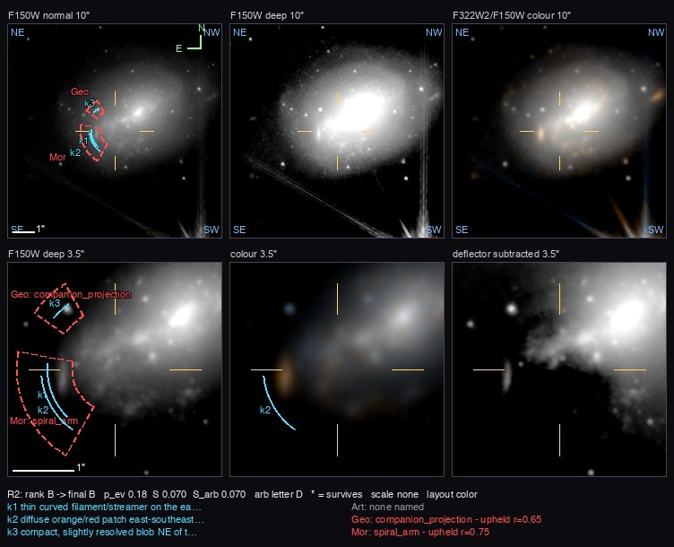{ width="100%" }](img/rank-057-annot.jpg){ target=_blank }
  <figcaption>Advocate evidence (cyan) and critic alternatives coloured by the arbitrator ruling</figcaption>
</figure>

???+ note "Why this grade — advocate, critics, arbitrator"
    **Letter B** (deployed, rule R2) · p_evidence 0.18 · S_arb 0.07 · S 0.07 · scale none

    Letter: letter_rank stands (D rule not met); p_evidence 0.18 >= t_B 0.17 (calibrated at 5% FPR on clean negatives); p_evidence 0.18 < t_A 0.20 (calibrated at 1% FPR on clean negatives).

    **Advocate**

    - criteria: source_contrast 5, low_surface_brightness 5, curvature 4, counter_image 2, arc_morphology 3
    - items (3):
        - k1 — “thin curved filament/streamer on the east-southeast rim of the envelope, traceable as a hook in the deep zoom and as a faint edge in the deep 10" panel; concave side faces WNW toward the bright off-centre core rather than toward the tick centre” (panel d, r 1.1 arcsec, PA 85->135, visible in direct: yes; criteria: low_surface_brightness, curvature, arc_morphology)
        - k2 — “diffuse orange/red patch east-southeast of the tick centre, clearly redder than the whitish deflector/core light in both colour renderings (c) and (e); coincident with the curved filament of item 1” (panel e, r 1.2 arcsec, PA 95->145, visible in direct: yes; criteria: source_contrast, low_surface_brightness)
        - k3 — “compact, slightly resolved blob NE of the tick centre, separated from the envelope light; not mirrored by any similar blob on the opposite side, so no pair is formed” (panel d, r 1.3 arcsec, PA 35->50, visible in direct: yes; criteria: low_surface_brightness)
    - scale galaxy; red neighbours within 10 arcsec 2; BCG-like halo yes; deflector is centre no; arc radius 1.1 arcsec; arc PA span 85->135; centre-of-curvature offset 1.3 arcsec
    - p_evidence: 0.18
    - notes: “The ticked position sits ~1.3" SE of the dominant bright core inside a lopsided, plume-rich envelope (bright bar/plume and southern clump chain in b and d), so the only located features - an ESE curved filament at r~1.1" and the orange patch on it - have their centre of curvature on the offset core, not on the tick, and no opposite-side counter-image is visible; panel (f) shows only the dipole/butterfly expected from a circular fit to this off-centre, non-elliptical light and is therefore uninformative.”

    **Critics**

    **artifact — no alternative named (nothing in its competence fits)**

    - leaves standing: k1, k2, k3
    - scale_class: galaxy
    - measured: `{"diffraction_spikes_in_field": "straight rays crossing the SE/SW corners of panels (a),(b),(c) at PA ~135-225 and r > 3.5\" from the ticks, from a bright source off the S/SW edge; they are perfectly straight and never approach r = 1.1-1.3\"", "item1_traceability": "hook at r~1.1\", PA 85-135 is present in direct deep zoom (d) and as a faint edge in direct 10\" deep (b); curvature ~ constant radius, so not a spike, not 1/f striping (which would be row/column aligned)", "item2_traceability": "orange patch at r~1.2\", PA 95-145 present in both direct colour panels (c) and (e), so not a subtraction product", "item3_traceability": "compact blob r~1.3\", PA 35-50 present in direct (d); PSF-like but no snowball ring, no persistence trail, no bleed; several similar compact sources scattered across the 3.5\" field", "subtracted_panel_check": "panel (f) shows the expected circular-profile artefacts (central bowtie/dipole about the off-centre bright core); every scored item also appears in un-subtracted panels"}`
    - notes: “The only instrumental structures I can point at are the straight diffraction rays in the SE/SW corners of (a)/(b)/(c), well outside r=1.3" and un-curved; there is no snowball, striping, seam, bleed or persistence at the item positions. Items 1-3 are all visible in the un-subtracted panels (d)/(e)/(b) at the same radii and position angles as in (f), so none of them qualifies as a subtraction residual, and I offer no instrument-side alternative.”
    - ruling: no ruling for this critic

    **geometry — companion_projection:** “The NE blob is an unrelated compact source (field star or small companion) projected just outside the envelope edge: round, unresolved-to-marginally-resolved, no tangential elongation, no counter-image, and one of several similar compact points scattered through the same field (another at ~2.4" NE in (d), many across (b)); it is bluish/white in (e) while the item-1/2 feature is orange, so the two cannot be images of one source.”

    - location: r 1-1.6 arcsec, PA 30->55
    - accounts for: k3; leaves standing: k1, k2; strength r 0.65; coverage a 0.333 (geometric)
    - scale_class: galaxy
    - measured: `{"counter_image_search": "no arc or knot at compatible radius on the opposite side of either candidate centre: r 0.8-1.4\", PA 250-330 in (d) shows only smooth envelope and unrelated clumps", "item1_geometry": "arc-like rim at r~0.9-1.1\", PA 90-120, length ~0.6\" (subtends ~35-40 deg), width ~0.2\" -> width/radius ~0.2; concave side faces WNW, i.e. curvature centre ambiguous between tick centre and the off-centre core (~1.4\" apart)", "item3_profile": "compact, near-round, ~0.15-0.2\" across, zero tangential elongation at r~1.3\", PA~42", "source_consistency": "item1/2 = diffuse orange filament, item3 = compact blue-white point; profiles and hues incompatible as two images of one source, and their PA separation (~55 deg) is not a fold/counter configuration", "tick_centre_to_bright_core": "~1.4\" at PA~309 (core is NW in (d); tick centre sits on diffuse envelope, not on a light peak)"}`
    - notes: “In (d) the NE object at ~1.3", PA~42 is a round point-like blob detached from the envelope, with a near-twin ~1" further NE and no mirror image at PA~220 - a projected field source, not a lensed image. Items 1-2 remain: the eastern rim at r~0.9-1.1", PA 90-120 is tangentially oriented, but its centre of curvature is ambiguous between the tick centre and the bright core 1.4" NW, and I find no counter-arc in (d) at r 0.8-1.4", PA 250-330.”
    - ruling: upheld, covers k3 — “In the deep zoom (d) the NE object at r~1.3", PA~42 is a round, point-like blob with zero tangential elongation, with a near-twin ~1" further NE and several similar compact points across (b)/(d), and no mirror knot at PA~220 - a projected field source, not a lensed image.”

    **morphology — spiral_arm:** “The host is a large, clumpy, asymmetric late-type/disturbed disc whose bright core sits NW of the tick centre; the 'filament' is the eastern outer arm/disc rim of that host, continuous with the envelope light, and the orange patch is a dust-reddened star-forming knot sitting on it (sibling knots of the same hue appear elsewhere in the 10" panel).”

    - location: r 0.7-1.6 arcsec, PA 80->150
    - accounts for: k1, k2; leaves standing: k3; strength r 0.75; coverage a 0.667 (geometric)
    - scale_class: galaxy
    - measured: `{"counter_arc": "no matching feature at PA 270-320 at the same radius in (d)", "curvature_centre": "concave side faces WNW toward the bright off-centre core at r~1.2\", PA~300 from the tick centre, not toward the tick centre", "radius_vs_angle": "feature radius grows from ~0.9\" at PA~90 to ~1.5\" at PA~140, i.e. an opening rim, not constant-radius", "similar_knots_in_10in_panel": "at least 3 other orange/brown dusty knots in (c) at r~1.5-4\" (PA~110, ~170, ~330), same hue as item 2", "stellar_bridge": "hook at PA 95-130 is continuously joined to the envelope surface brightness in (d); no gap or offset ridge"}`
    - notes: “In (d) the eastern hook (left of the E tick, r~1.1", PA~95-130) is not detached: its surface brightness runs continuously into the envelope and its radius increases with angle, the signature of an outer arm/disc rim curving about the bright NW core rather than a tangential arc about the tick centre; in (c) and (e) the orange knot on it matches several other dusty knots scattered through the same galaxy. The compact NE blob at r~1.3", PA~40 in (d) is separate and unaccounted for by this arm.”
    - ruling: upheld, covers k1, k2 — “The eastern hook in (d) runs continuously into the envelope surface brightness with radius growing from ~0.9" at PA~90 to ~1.5" at PA~140 and curves about the bright NW core, and the orange patch on it in (c)/(e) matches several other dusty knots at r~1.5-4" in the same disturbed host.”

    **Arbitrator**

    - surviving items: none (0 of 3)
    - letter_llm: D; scale_class_final: none; needs_human: no
    - rationale: “The ticked position lies ~1.3-1.4" SE of the dominant bright core of a large, lopsided, plume-rich late-type/disturbed system, and every located item is explained by that host. Item 1's "filament" (deep zoom, left of the E tick, PA 95-130) is not an offset, fixed-radius ridge: its surface brightness joins the envelope with no gap, and its radius opens from ~0.9" to ~1.5" as position angle grows, the signature of an outer arm/disc rim curving about the off-centre NW core, not a tangential arc about the tick centre. Item 2 is a dust-reddened knot sitting on that same rim in (c)/(e), one of at least three orange/brown knots scattered through the same galaxy at r~1.5-4", so colour adds nothing here (and colour alone could not decide it in any case). Item 3 is a round, ~0.15-0.2" compact point at PA~42 with no tangential elongation, a near-twin 1" further NE, and no counterpart at PA~220 - a projection. The artifact critic named no instrumental alternative and correctly confined the straight diffraction rays to the SE/SW corners at r>3.5", so nothing here is a detector or subtraction product; panel (f)'s central bowtie/dipole is exactly what a circular profile fit to this off-centre, non-elliptical light must leave and carries no weight either way. With no counter-image anywhere in r 0.8-1.4", PA 250-330 and both alternatives upheld over all three items, nothing survives.”

    **Score**

    - S = p_ev x prod(1 - r_i a_i) = 0.18 x (1 - 0.65x0.333) x (1 - 0.75x0.667) = 0.07
        - terms: geometry companion_projection r 0.65 a 0.333; morphology spiral_arm r 0.75 a 0.667
    - S_arb = p_ev x prod_{upheld/partial}(1 - r_i a_i') = 0.18 x (1 - 0.65x0.333) x (1 - 0.75x0.667) = 0.07
        - terms: geometry companion_projection r 0.65 a 0.333 (upheld); morphology spiral_arm r 0.75 a 0.667 (upheld)
    - stored grade_pred (on S): C — S 0.07 < t_B 0.17 (calibrated at 5% FPR on clean negatives); not D: 3 item(s) located; no named critic covers every item at r >= 0.80
    - stored letter_arb (on S_arb): C; letter_source: opus5_api_calibrated
    - deploy rule R2: letter_rank (advocate only, on p_evidence) = B — p_evidence 0.18 >= t_B 0.17 (calibrated at 5% FPR on clean negatives); p_evidence 0.18 < t_A 0.20 (calibrated at 1% FPR on clean negatives)
    - deploy rule R2: letter_final = B — letter_rank stands (D rule not met); p_evidence 0.18 >= t_B 0.17 (calibrated at 5% FPR on clean negatives); p_evidence 0.18 < t_A 0.20 (calibrated at 1% FPR on clean negatives)
    - veto: none (letter_final == letter_rank)

---

## Rank 58: J2235243-7358297 {#rank-58}

| Original grade | Passes | Inspector conf. | Pipeline θ_E |
|:--:|:--:|:--:|:--:|
| **U** | — | 26 | — |

| New (final) | Rank letter | p_ev | S_arb | Demoted by | Arb. letter | Needs human |
|:--:|:--:|--:|--:|:--|:--:|:--:|
| **C** | C | 0.12 | 0.120 | — | — | no |

<small>pipeline discovery status `new` · scale class `galaxy`</small>

<figure markdown="span">
  [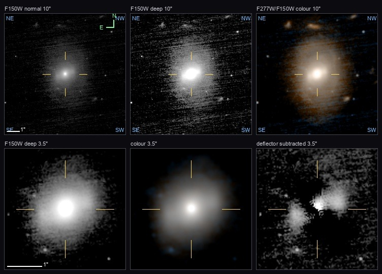{ width="100%" }](img/rank-058-orig.jpg){ target=_blank }
  <figcaption>What the judge saw (blind, footer removed)</figcaption>
</figure>

<figure markdown="span">
  [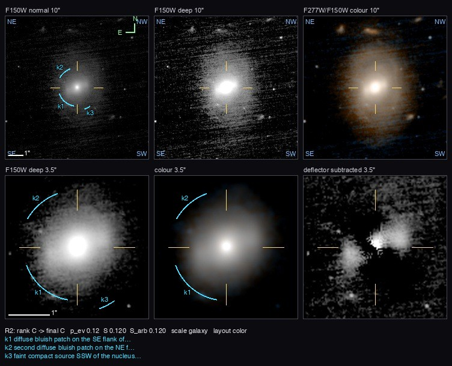{ width="100%" }](img/rank-058-annot.jpg){ target=_blank }
  <figcaption>Advocate evidence (cyan) and critic alternatives coloured by the arbitrator ruling</figcaption>
</figure>

???+ note "Why this grade — advocate, critics, arbitrator"
    **Letter C** (deployed, rule R2) · p_evidence 0.12 · S_arb 0.12 · S 0.12 · scale galaxy

    Letter: letter_rank stands (D rule not met); p_evidence 0.12 < t_B 0.17 (calibrated at 5% FPR on clean negatives); not D: 3 item(s) located; no named critic covers every item at r >= 0.80.

    **Advocate**

    - criteria: source_contrast 3, low_surface_brightness 3, curvature 1, counter_image 1, arc_morphology 1
    - items (3):
        - k1 — “diffuse bluish patch on the SE flank of the envelope, bluer than the orange deflector but with no tangential elongation and no fixed-radius structure” (panel e, r 1.3 arcsec, PA 110->170, visible in direct: yes; criteria: source_contrast, low_surface_brightness)
        - k2 — “second diffuse bluish patch on the NE flank at a similar radius (not opposite the SE patch; ~105 deg away, so not a counter-image pair)” (panel e, r 1.4 arcsec, PA 20->60, visible in direct: yes; criteria: source_contrast, low_surface_brightness)
        - k3 — “faint compact source SSW of the nucleus, point-like, no elongation, no opposite counterpart at a matching radius” (panel d, r 1.6 arcsec, PA 200->215, visible in direct: yes; criteria: source_contrast)
    - scale galaxy; red neighbours within 10 arcsec 1; BCG-like halo yes; deflector is centre yes
    - p_evidence: 0.12
    - notes: “In the direct panels the object is a smooth, saturated-cored red early-type with a large low-surface-brightness envelope; the only located features are two soft blue haze patches on the SE (PA~140) and NE (PA~35) flanks in (c)/(e) at r~1.3-1.4" that show no thin tangential ridge or common centre of curvature, plus a point-like source at r~1.6" SSW in (d); the direct panels are saturated inside ~0.5", so any sub-arcsecond image would be unrecoverable there.”

    **Critics**

    - not called (p_evidence 0.12 < tau0 0.15)

    **Arbitrator**

    - no arbitrator record (not called)

    **Score**

    - S = p_ev = 0.12 (no critic term entered the product)
    - S_arb = p_ev = 0.12 (no critic term entered the product)
    - stored grade_pred (on S): C — S 0.12 < t_B 0.17 (calibrated at 5% FPR on clean negatives); not D: 3 item(s) located; no named critic covers every item at r >= 0.80
    - stored letter_arb (on S_arb): C; letter_source: opus5_api_calibrated
    - deploy rule R2: letter_rank (advocate only, on p_evidence) = C — p_evidence 0.12 < t_B 0.17 (calibrated at 5% FPR on clean negatives); not D: 3 item(s) located; no named critic covers every item at r >= 0.80
    - deploy rule R2: letter_final = C — letter_rank stands (D rule not met); p_evidence 0.12 < t_B 0.17 (calibrated at 5% FPR on clean negatives); not D: 3 item(s) located; no named critic covers every item at r >= 0.80
    - veto: none (letter_final == letter_rank)

---

## Rank 59: J3419795-502846 {#rank-59}

| Original grade | Passes | Inspector conf. | Pipeline θ_E |
|:--:|:--:|:--:|:--:|
| **U** | — | 25 | 1.17″ |

| New (final) | Rank letter | p_ev | S_arb | Demoted by | Arb. letter | Needs human |
|:--:|:--:|--:|--:|:--|:--:|:--:|
| **B** | B | 0.28 | 0.068 | — | D | no |

<small>pipeline discovery status `new` · scale class `none`</small>

<figure markdown="span">
  [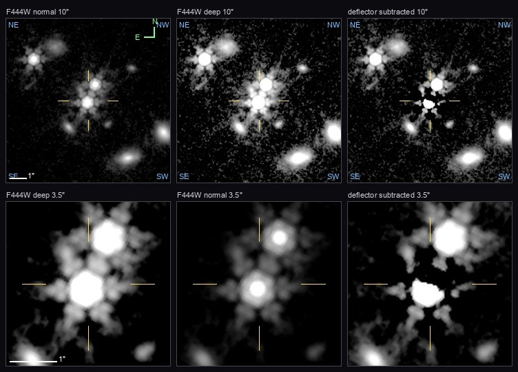{ width="100%" }](img/rank-059-orig.jpg){ target=_blank }
  <figcaption>What the judge saw (blind, footer removed)</figcaption>
</figure>

<figure markdown="span">
  [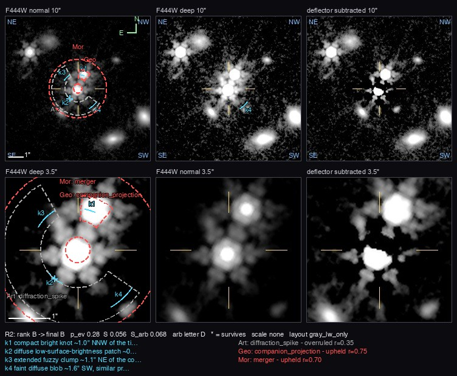{ width="100%" }](img/rank-059-annot.jpg){ target=_blank }
  <figcaption>Advocate evidence (cyan) and critic alternatives coloured by the arbitrator ruling</figcaption>
</figure>

???+ note "Why this grade — advocate, critics, arbitrator"
    **Letter B** (deployed, rule R2) · p_evidence 0.28 · S_arb 0.068 · S 0.056 · scale none

    Letter: letter_rank stands (D rule not met); p_evidence 0.28 >= t_A 0.20 (calibrated at 1% FPR on clean negatives) but A is blocked: only 0 of 3 configuration criteria >= 6; p_evidence 0.28 >= t_B 0.17 (calibrated at 5% FPR on clean negatives).

    **Advocate**

    - criteria: source_contrast 4, low_surface_brightness 5, curvature 2, counter_image 4, arc_morphology 2
    - items (4):
        - k1 — “compact bright knot ~1.0" NNW of the ticked galaxy; clearly resolved from the core in (d)/(e), survives the circular subtraction in (f) as an offset source, not a lobe of the butterfly pattern” (panel d, r 1 arcsec, PA 335->350, visible in direct: yes; criteria: source_contrast, counter_image)
        - k2 — “diffuse low-surface-brightness patch ~0.9" SSE of the core, roughly opposite item 1 (opposite PA would be 163 deg, this lies at ~141 deg) and at a radius within 15% of it - candidate counter-image” (panel d, r 0.9 arcsec, PA 125->155, visible in direct: yes; criteria: low_surface_brightness, counter_image)
        - k3 — “extended fuzzy clump ~1.1" NE of the core, of lower surface brightness and flatter profile than the deflector envelope; part of the clump chain surrounding the nucleus” (panel d, r 1.1 arcsec, PA 30->60, visible in direct: yes; criteria: low_surface_brightness)
        - k4 — “faint diffuse blob ~1.6" SW, similar profile to item 3, completing an irregular ring of clumps around the ticked galaxy in the deep 10" panel” (panel b, r 1.6 arcsec, PA 210->235, visible in direct: yes; criteria: low_surface_brightness)
    - scale galaxy; red neighbours within 10 arcsec 4; BCG-like halo yes; deflector is centre yes; counter-image at r 0.9 arcsec PA 141
    - p_evidence: 0.28
    - notes: “No thin tangential arc anywhere out to 5" - the only geometry is a bright compact knot 1.0" at PA~343 deg plus a fainter diffuse patch 0.9" at PA~141 deg that straddle the saturated nucleus at nearly equal radii (a two-image-like pair), embedded in a clumpy, blended envelope in (b)/(d) that a critic should test against a merger / compact-group projection; the E-W elongated core residual in (f) is the expected dipole/ellipticity artefact of the circular subtraction and is not counted.”

    **Critics**

    **artifact — diffraction_spike:** “PSF structure of the bright blended core (deflector + the compact NNW knot): the deep 10" panel (b) and the 3.5" residual (f) show straight radial rays leaving the central complex at roughly PA 0/45/90/135/180/225/270/315, extending to ~2-3"; items 3 and 4 lie on the NE (PA~45) and SW (PA~225) rays rather than on a tangential locus”

    - location: r 0.9-1.8 arcsec, PA 30->235
    - accounts for: k3, k4; leaves standing: k1, k2; strength r 0.35; coverage a 0.50 (geometric), excluded from S_arb (overruled)
    - scale_class: galaxy
    - measured: `{"item3_pa_offset_from_NE_ray_deg": "~0-15", "item4_pa_offset_from_SW_ray_deg": "~0-13", "items_absent_from_direct_panels": "none - all four items appear in (b)/(d)/(e), so no subtraction-residual explanation applies", "radius_mismatch_items_3_4_arcsec": "1.1 vs 1.6 - not a constant-radius pair", "ray_axis_pa_deg": "45 and 225 (NE-SW pair), plus weaker N-S and E-W rays visible in (b)", "ray_extent_arcsec": "~2.5-3 in (b), ~1.5 in (f)"}`
    - notes: “In (b) and (f) the central blend throws straight rays outward at fixed angles (clearest NE-SW, PA~45/225); item 3 at 1.1" PA~45 and item 4 at 1.6" PA~225 sit on that axis at different radii, which is spike/PSF-wing behaviour rather than a constant-radius tangential pair. The rays are straight and the two clumps look extended and fuzzy rather than linear, so I rate this only moderately; items 1 (compact source, 1.0" PA~343, present in a, b, d, e and surviving the circular subtraction) and 2 (0.9" PA~141, present in d) are not explained by any instrumental pattern I can point to.”
    - ruling: overruled — “The starburst rays around the central blend in (b)/(c)/(f) are thin, straight and pinned to fixed angles, whereas items 3 and 4 are resolved fuzzy patches of finite width (~0.4-0.6") sitting at 1.1" NE and 1.6" SW in the un-subtracted deep zoom (d) and in (b), so PSF spikes do not produce them.”

    **geometry — companion_projection:** “The bright source ~1.0" NNW is a second galaxy nucleus (or close pair member), not a lensed image: in the normal-stretch zoom (e) it is a round, centrally peaked core of nearly the deflector's own brightness with no tangential elongation, and the putative counter-image on the opposite side is a faint diffuse patch of entirely different surface-brightness profile.”

    - location: r 0.7-1.3 arcsec, PA 320->355
    - accounts for: k1; leaves standing: k2, k3, k4; strength r 0.75; coverage a 0.25 (geometric)
    - scale_class: galaxy
    - measured: `{"centre_of_curvature_offset": "no arc with definable curvature centre; clumps 3 and 4 lie at unequal radii (1.1\" vs 1.6\") and show no tangential stretch", "item1_axis_ratio": "~1.0 (round, no tangential elongation; long axis, if any, is radial in (e))", "item1_offset_arcsec": 1.0, "item1_profile": "compact, centrally peaked, saturates at same stretch as the deflector core in (e)", "item2_profile": "diffuse, flat-topped, ~0.5-0.7\" across, several magnitudes lower peak SB - not a profile match to item1", "item3_item4_radius_ratio": 0.69, "pa_separation_item1_item2_deg": 194, "radius_ratio_item2_over_item1": 0.9}`
    - notes: “In (e) the NNW source at r~1.0", PA~335 is a saturated round nucleus with a PSF-like core, the second brightest thing in the 3.5" zoom - geometrically a companion/pair member, not a tangential image; its supposed counter-image at PA~141 in (d) is a low-surface-brightness fuzz with a completely different profile, so items 1 and 2 cannot be two images of one source. Items 2-4 remain as clumpy envelope emission at unequal radii (1.1" NE vs 1.6" SW) with no tangential elongation, which I leave to the morphology critic.”
    - ruling: upheld, covers k1 — “In the normal-stretch zoom (e) the NNW source at r~1.0" is a round, centrally peaked, saturating core with no tangential elongation - a second nucleus/companion profile, not a tangentially stretched image.”

    **morphology — merger:** “A close interacting pair / double-nucleus system: a second compact nucleus of comparable brightness to the ticked galaxy ~1.0" NNW, both embedded in one irregular clumpy common envelope whose knots (SSE, NE, SW) are tidal/star-forming debris at scattered radii rather than tangential images at a fixed Einstein radius.”

    - location: r 0.3-2 arcsec, PA 0->360
    - accounts for: k1, k2, k3, k4; leaves standing: none; strength r 0.70; coverage a 1.00 (geometric)
    - scale_class: galaxy
    - measured: `{"clump_radii_arcsec": "0.9, 1.1, 1.6 (spread ~55% of mean, not a fixed radius)", "clump_tangential_axis_ratio": "~1.0-1.2 (round/irregular, no tangential elongation in (d) or (e))", "envelope_continuity": "continuous grey bridge joining the two nuclei and all clumps in the deep zoom", "nucleus_flux_ratio_estimate": "~1 (both cores saturate in (d) and remain the two brightest peaks in (e))", "nucleus_separation_arcsec": 1.0}`
    - notes: “In (d)/(e) the source at r~1.0", PA~345 is a second nucleus as bright and as compact as the ticked core, not a faint arc, and the two are joined by a continuous diffuse bridge; the remaining knots (r~0.9" PA~141, r~1.1" PA~45, r~1.6" PA~220) sit at radii differing by up to 55% and show no tangential elongation, i.e. a clumpy tidal envelope around an interacting pair rather than a ring of images at one radius.”
    - ruling: upheld, covers k1, k2, k3, k4 — “Panels (d)/(e) show two comparably bright compact cores separated by ~1.0" embedded in one continuous clumpy grey envelope, with the remaining knots at r = 0.9", 1.1" and 1.6" (spread ~55%) and all round rather than tangentially stretched - an interacting pair with tidal/star-forming debris.”

    **Arbitrator**

    - surviving items: none (0 of 4)
    - letter_llm: D; scale_class_final: none; needs_human: no
    - rationale: “Every located item falls inside the upheld merger/close-pair reading: in the 3.5" deep and normal zooms (d)/(e) the ticked galaxy's core and the source ~1.0" NNW are both saturated, round, PSF-cored peaks of comparable brightness joined by a continuous diffuse bridge, which is a double nucleus, not a deflector plus a tangential image (geometry critic upheld for item 1 on the same pixels: no tangential axis ratio, long axis if any is radial). The proposed counter-image at r~0.9", PA~141 is a flat-topped low-surface-brightness fuzz several magnitudes below item 1's peak, so the two cannot be images of one source, and the remaining knots at 1.1" NE and 1.6" SW differ in radius by ~45% and show no tangential stretch - a clumpy tidal envelope, not a ring at fixed radius. The artifact critic's spike explanation is overruled because the rays in (b)/(f) are thin and straight while items 3 and 4 are resolved extended blobs, but that does not rescue them as lensing evidence since the merger reading already covers them. There is no thin, curved, constant-radius feature anywhere out to 5" in (a), (b) or (d), and the E-W core structure in (c)/(f) is the expected dipole/butterfly of the circular subtraction and was correctly not counted; nothing survives, hence D.”

    **Score**

    - S = p_ev x prod(1 - r_i a_i) = 0.28 x (1 - 0.35x0.50) x (1 - 0.75x0.25) x (1 - 0.70x1.00) = 0.056
        - terms: artifact diffraction_spike r 0.35 a 0.50; geometry companion_projection r 0.75 a 0.25; morphology merger r 0.70 a 1.00
    - S_arb = p_ev x prod_{upheld/partial}(1 - r_i a_i') = 0.28 x (1 - 0.75x0.25) x (1 - 0.70x1.00) = 0.068
        - terms: geometry companion_projection r 0.75 a 0.25 (upheld); morphology merger r 0.70 a 1.00 (upheld)
    - stored grade_pred (on S): C — S 0.056 < t_B 0.17 (calibrated at 5% FPR on clean negatives); not D: 4 item(s) located; no named critic covers every item at r >= 0.80
    - stored letter_arb (on S_arb): C; letter_source: opus5_api_calibrated
    - deploy rule R2: letter_rank (advocate only, on p_evidence) = B — p_evidence 0.28 >= t_A 0.20 (calibrated at 1% FPR on clean negatives) but A is blocked: only 0 of 3 configuration criteria >= 6; p_evidence 0.28 >= t_B 0.17 (calibrated at 5% FPR on clean negatives)
    - deploy rule R2: letter_final = B — letter_rank stands (D rule not met); p_evidence 0.28 >= t_A 0.20 (calibrated at 1% FPR on clean negatives) but A is blocked: only 0 of 3 configuration criteria >= 6; p_evidence 0.28 >= t_B 0.17 (calibrated at 5% FPR on clean negatives)
    - veto: none (letter_final == letter_rank)

---

## Rank 60: J20960149-304690 {#rank-60}

| Original grade | Passes | Inspector conf. | Pipeline θ_E |
|:--:|:--:|:--:|:--:|
| **U** | — | 25 | 1.50″ |

| New (final) | Rank letter | p_ev | S_arb | Demoted by | Arb. letter | Needs human |
|:--:|:--:|--:|--:|:--|:--:|:--:|
| **B** | B | 0.18 | 0.011 | — | D | no |

<small>pipeline discovery status `new` · scale class `group`</small>

<figure markdown="span">
  [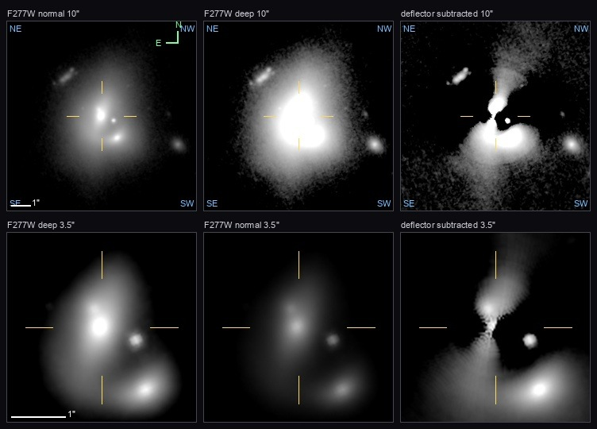{ width="100%" }](img/rank-060-orig.jpg){ target=_blank }
  <figcaption>What the judge saw (blind, footer removed)</figcaption>
</figure>

<figure markdown="span">
  [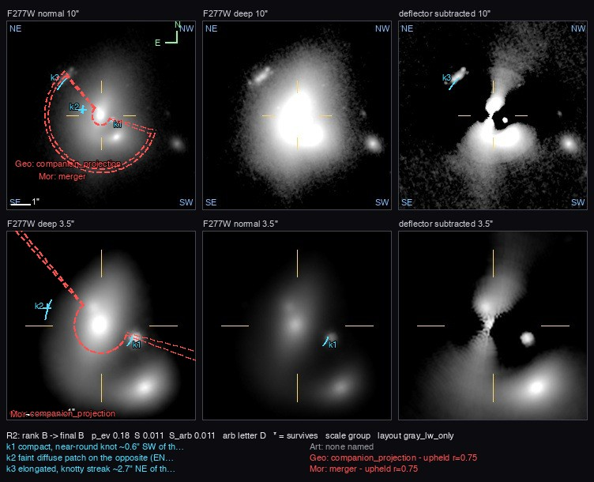{ width="100%" }](img/rank-060-annot.jpg){ target=_blank }
  <figcaption>Advocate evidence (cyan) and critic alternatives coloured by the arbitrator ruling</figcaption>
</figure>

???+ note "Why this grade — advocate, critics, arbitrator"
    **Letter B** (deployed, rule R2) · p_evidence 0.18 · S_arb 0.011 · S 0.011 · scale group

    Letter: letter_rank stands (D rule not met); p_evidence 0.18 >= t_B 0.17 (calibrated at 5% FPR on clean negatives); p_evidence 0.18 < t_A 0.20 (calibrated at 1% FPR on clean negatives).

    **Advocate**

    - criteria: source_contrast 4, low_surface_brightness 4, curvature 1, counter_image 3, arc_morphology 3
    - items (3):
        - k1 — “compact, near-round knot ~0.6" SW of the ticked nucleus, much sharper (smaller effective radius) than the smooth deflector light; clearly separated from the core in (e) and surviving as a discrete off-centre residual in (f), i.e. not a mirrored subtraction lobe” (panel e, r 0.62 arcsec, PA 232->250, visible in direct: yes; criteria: source_contrast, counter_image)
        - k2 — “faint diffuse patch on the opposite (ENE) side of the nucleus at roughly the same small radius - candidate counter-image to item 1 (opposite PA of item 1 is ~62 deg); low surface brightness, only traceable on the deep zoom stretch” (panel d, r 1.05 arcsec, PA 62->84, visible in direct: yes; criteria: low_surface_brightness, counter_image)
        - k3 — “elongated, knotty streak ~2.7" NE of the ticked galaxy; its long axis (~PA 320/140) is close to perpendicular to the radius vector (PA ~50), i.e. roughly tangential, and it is thin relative to its distance from the deflector; brightest in the 10" panels and still an offset, non-mirrored feature in the 10" residual” (panel c, r 2.7 arcsec, PA 42->60, visible in direct: yes; criteria: source_contrast, low_surface_brightness, arc_morphology)
    - scale galaxy; red neighbours within 10 arcsec 4; BCG-like halo yes; deflector is centre yes; arc radius 2.7 arcsec; arc PA span 42->60; counter-image at r 1.05 arcsec PA 72
    - p_evidence: 0.18
    - notes: “Field is a blended multi-nucleus system (bright ticked core, a big diffuse companion ~1.5" SW, a compact source ~4" W and the NE streak), so the strongest located items are a compact 0.6" SW knot with a faint roughly opposite ENE patch at 1.05" and a near-tangential 2.7" NE streak; none of the three shows measurable curvature about the ticked galaxy, and the inner 0.5" is saturated/blended in the direct zooms so a small ring could not be traced there.”

    **Critics**

    **artifact — no alternative named (nothing in its competence fits)**

    - leaves standing: k1, k2, k3
    - scale_class: galaxy
    - measured: `{"item1_visible_in_direct_panels": "yes - compact round knot at r~0.6\", PA~240 present in both (d) deep zoom and (e) zoom, not only in (f)", "item3_visible_in_direct_panels": "yes - elongated knotty streak at r~2.7\", PA~50 bright in (a) and (b) as well as in the residual panel", "snowball_persistence_check": "no ring-with-core snowballs, no cosmic-ray tracks, no repeated persistence blobs at PA 42-60 or 232-250", "spike_count_at_any_source": "0 - no straight radial rays at fixed angles from the ticked core, from the compact SW knot or from the bright SW-corner source", "striping_or_seam": "none - no row/column 1/f banding, no mosaic seam or dither edge crossing any item position"}`
    - notes: “All three located features survive in un-subtracted renderings (item 1 as a discrete round knot lower-right of the ticks in (d) and (e); item 2 as the faint patch on the east side of (d); item 3 as the bright elongated NE blob in (a)/(b)), so none can be a subtraction residual; the only pure subtraction signatures are the symmetric N/S lobes and concentric ripples about the tick centre, which the VIEW excludes as an alternative. No diffraction spikes, snowballs, striping, seams or PSF-wing gradients coincide with any item position.”
    - ruling: no ruling for this critic

    **geometry — companion_projection:** “The ticked galaxy sits in a blend of several distinct, unrelated-looking galaxies/nuclei: a compact round knot 0.65" SW (item 1), a bright diffuse companion 1.5" SSW (unlisted by the scorer), a faint smudge 1.05" ENE (item 2) and a separate knotty neighbour 2.7" NE (item 3). None of these are tangentially elongated about the tick centre, their radii are mutually incompatible, and the surface-brightness ordering is wrong for multiple images of one source.”

    - location: r 0.5-2.8 arcsec, PA 42->250
    - accounts for: k1, k2, k3; leaves standing: none; strength r 0.75; coverage a 1.00 (geometric)
    - scale_class: group
    - measured: `{"centre_of_curvature_offset_arcsec": "not measurable - no item shows curvature concave toward the ticked nucleus", "counter_image_search_item3": "annulus r=2.4-3.0\" at PA 210-250 in panel (b) shows only smooth envelope - no counter-arc", "item1_axis_ratio": "~1.0 (round, FWHM ~0.15\"; no tangential stretch at a radius where theta_E would be ~0.8\")", "item1_pa_deg": 247, "item1_radius_arcsec": 0.66, "item2_pa_deg": 73, "item2_radius_arcsec": 1.05, "item3_pa_deg": 50, "item3_radius_arcsec": 2.7, "item3_shape": "straight knotty streak ~1.2\" long, no measurable curvature about the tick centre", "radius_ratio_item2_over_item1": 1.6, "surface_brightness_contrast": "item 1 peaks strongly in the NORMAL-stretch zoom (e); item 2 is invisible in (e) and only a low-SB smudge in (d) - peak SB differs by a large factor, whereas lensed images of one source conserve surface brightness, and the brighter image should lie at the LARGER radius, not the smaller", "unmodelled_third_component": "bright diffuse companion at r=1.5\", PA 217 in (d)/(e), between and unrelated to items 1 and 2"}`
    - notes: “In (e) the 0.65" SW source (x~325,y~305 relative to tick centre x~240,y~272) is a round, high-surface-brightness point-like nucleus with no tangential elongation, while its supposed counter-image at 1.05" ENE (x~105,y~220 in (d)) is only visible on the deep stretch - the flux/SB ordering and the 1.6:1 radius mismatch are both wrong for a two-image system, and a third bright blob sits at 1.5", PA 217 with no counterpart. The NE streak at 2.7" in (b) is straight and knotty with no counter-arc at PA ~230, and panel (b)'s common diffuse envelope containing four separate galaxies reads as a blended group/merging field rather than one deflector with images.”
    - ruling: upheld, covers k1, k2, k3 — “In (e) the 0.6-0.7" SW source is a round, high-surface-brightness point-like nucleus with no tangential stretch, the ENE patch in (d) sits 1.6x farther out and is far fainter (wrong radius and wrong surface-brightness ordering for two images of one source), and the 2.7" NE streak in (a)/(b) is straight and knotty with only smooth envelope at the mirrored PA ~230.”

    **morphology — merger:** “A compact group / ongoing merger: panel (a) shows one smooth common envelope containing at least four separate nuclei (ticked nucleus; a compact round knot ~0.7" WSW; a bright elliptical ~1.5" SSW; the knotty streak ~2.8" NE), so the located knots are individual group members / merger components, not multiple images of one source.”

    - location: r 0.5-3 arcsec, PA 40->255
    - accounts for: k1, k2, k3; leaves standing: none; strength r 0.75; coverage a 1.00 (geometric)
    - scale_class: group
    - measured: `{"curvature_test": "no feature bends about the tick centre; radius of item 1 (0.70\") and item 2 (1.1\") differ by ~55%", "item_2_position": "r~1.1\", PA~68 in (d), faint round blob at x~105,y~218 - roundish, not arc-shaped", "item_3": "r~2.9\", PA~44 in (a); long axis PA~140/320, length ~1.0\", width ~0.35\", internal knots -> its own edge-on/irregular light, not a smooth constant-radius arc", "knot_1_axis_ratio": "~1.0 (round, no tangential elongation; PSF-like core with faint halo)", "knot_1_position": "r~0.70\", PA~249 in (e), x~325,y~305 vs tick centre 240,272", "nuclei_in_10in_envelope": ">=4 plus two more galaxies ~4-5\" W"}`
    - notes: “In panel (a) the ticked nucleus, the compact round knot ~0.7" WSW (x~325,y~305 in (e)), the bright elliptical ~1.5" SSW and the knotty NE streak all sit inside one continuous diffuse envelope - the signature of a compact group/merger, and each 'image' is round or has its own internal structure rather than being a thin tangential arc. Item 2 is a low-surface-brightness round patch at PA~68, r~1.1", 55% farther out than item 1, so it is not a mirrored counter-image at matching radius.”
    - ruling: upheld, covers k1, k2, k3 — “Panel (b) shows one continuous diffuse envelope enclosing the ticked nucleus, the compact round knot ~0.7" WSW, a bright elliptical companion ~1.5" SSW and the NE knotty streak, plus further galaxies 4-5" W - a compact group/merging system whose members are the located knots.”

    **Arbitrator**

    - surviving items: none (0 of 3)
    - letter_llm: D; scale_class_final: group; needs_human: no
    - rationale: “The two direct 10" panels show a single smooth low-surface-brightness envelope containing at least four separate nuclei - the ticked core, a compact round knot just SW of the tick centre (obvious as a distinct PSF-like nucleus in (d) and (e)), a bright diffuse elliptical ~1.5" SSW, and the elongated knotty streak ~2.7" NE that is bright already in (a) - i.e. a blended group/merger, not a deflector with images. The artifact critic's checks confirm every item survives in un-subtracted panels (so nothing here is a subtraction artefact, and the symmetric N/S lobes and concentric ripples about the tick centre in (c)/(f) are excluded by the VIEW), but survival in direct data only establishes the features are real sky, not that they are lensed. Against a lens hypothesis: item 1 is round with axis ratio ~1 at a radius where a tangential image would be visibly stretched at 0.031"/px; item 2 lies at 1.6x item 1's radius and is invisible on the normal-stretch zoom while item 1 peaks strongly there, violating surface-brightness conservation and the brighter-image-at-larger-radius expectation; item 3 has its own internal knots and a straight long axis with no counter-arc in the r=2.4-3.0", PA 210-250 annulus of (b). No feature bends concave toward the tick centre anywhere in the frame. Both critics' alternatives (companion_projection and merger) are the same physical picture and both are supported pixel-by-pixel, so all three items fall and nothing survives; letter D, scale class group by the multi-nucleus envelope rather than by any measured Einstein radius.”

    **Score**

    - S = p_ev x prod(1 - r_i a_i) = 0.18 x (1 - 0.75x1.00) x (1 - 0.75x1.00) = 0.011
        - terms: geometry companion_projection r 0.75 a 1.00; morphology merger r 0.75 a 1.00
    - S_arb = p_ev x prod_{upheld/partial}(1 - r_i a_i') = 0.18 x (1 - 0.75x1.00) x (1 - 0.75x1.00) = 0.011
        - terms: geometry companion_projection r 0.75 a 1.00 (upheld); morphology merger r 0.75 a 1.00 (upheld)
    - stored grade_pred (on S): C — S 0.011 < t_B 0.17 (calibrated at 5% FPR on clean negatives); not D: 3 item(s) located; no named critic covers every item at r >= 0.80
    - stored letter_arb (on S_arb): C; letter_source: opus5_api_calibrated
    - deploy rule R2: letter_rank (advocate only, on p_evidence) = B — p_evidence 0.18 >= t_B 0.17 (calibrated at 5% FPR on clean negatives); p_evidence 0.18 < t_A 0.20 (calibrated at 1% FPR on clean negatives)
    - deploy rule R2: letter_final = B — letter_rank stands (D rule not met); p_evidence 0.18 >= t_B 0.17 (calibrated at 5% FPR on clean negatives); p_evidence 0.18 < t_A 0.20 (calibrated at 1% FPR on clean negatives)
    - veto: none (letter_final == letter_rank)

---

## Rank 61: J8149689-2410706 {#rank-61}

| Original grade | Passes | Inspector conf. | Pipeline θ_E |
|:--:|:--:|:--:|:--:|
| **U** | — | 25 | — |

| New (final) | Rank letter | p_ev | S_arb | Demoted by | Arb. letter | Needs human |
|:--:|:--:|--:|--:|:--|:--:|:--:|
| **C** | C | 0.12 | 0.120 | — | — | no |

<small>pipeline discovery status `new` · scale class `group`</small>

<figure markdown="span">
  [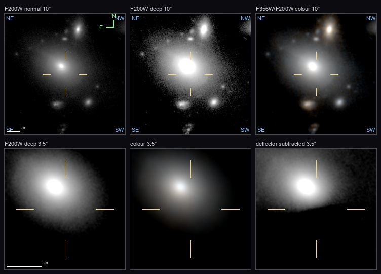{ width="100%" }](img/rank-061-orig.jpg){ target=_blank }
  <figcaption>What the judge saw (blind, footer removed)</figcaption>
</figure>

<figure markdown="span">
  [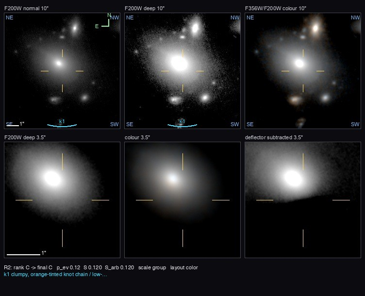{ width="100%" }](img/rank-061-annot.jpg){ target=_blank }
  <figcaption>Advocate evidence (cyan) and critic alternatives coloured by the arbitrator ruling</figcaption>
</figure>

???+ note "Why this grade — advocate, critics, arbitrator"
    **Letter C** (deployed, rule R2) · p_evidence 0.12 · S_arb 0.12 · S 0.12 · scale group

    Letter: letter_rank stands (D rule not met); p_evidence 0.12 < t_B 0.17 (calibrated at 5% FPR on clean negatives); not D: 1 item(s) located; no named critic covers every item at r >= 0.80.

    **Advocate**

    - criteria: source_contrast 4, low_surface_brightness 5, curvature 1, counter_image 1, arc_morphology 2
    - items (1):
        - k1 — “clumpy, orange-tinted knot chain / low-surface-brightness patch about 4.8" south of the ticked galaxy, resolved into 3-4 knots in the deep panel and showing an orange hue distinct from the smooth whitish deflector in the colour panel; roughly elongated across ~30 deg of position angle but not measurably concave toward the deflector and with no counterpart at a similar radius on the opposite side” (panel b, r 4.8 arcsec, PA 165->195, visible in direct: yes; criteria: source_contrast, low_surface_brightness)
    - scale group; red neighbours within 10 arcsec 4; BCG-like halo yes; deflector is centre no; arc radius 4.8 arcsec; arc PA span 165->195
    - p_evidence: 0.12
    - notes: “The zoom row shows only a smooth, boxy elliptical whose bright core sits ~0.7" north of the tick centre (hence the strong dipole plus dark negative band in (f), which is the artefact the VIEW names and is uninformative inside ~1.5"); the only offset, non-stellar feature anywhere in the 10" field is the clumpy orange knot chain ~4.8" south (bottom of (b)/(c)), which has no opposite-side counter-image at 3-7" and no measurable tangential curvature about the ticked galaxy, the other companions at PA~340-350 (r~2.7-4") and PA~150,~200 (r~3.5-4.2") having ordinary galaxy cores.”

    **Critics**

    - not called (p_evidence 0.12 < tau0 0.15)

    **Arbitrator**

    - no arbitrator record (not called)

    **Score**

    - S = p_ev = 0.12 (no critic term entered the product)
    - S_arb = p_ev = 0.12 (no critic term entered the product)
    - stored grade_pred (on S): C — S 0.12 < t_B 0.17 (calibrated at 5% FPR on clean negatives); not D: 1 item(s) located; no named critic covers every item at r >= 0.80
    - stored letter_arb (on S_arb): C; letter_source: opus5_api_calibrated
    - deploy rule R2: letter_rank (advocate only, on p_evidence) = C — p_evidence 0.12 < t_B 0.17 (calibrated at 5% FPR on clean negatives); not D: 1 item(s) located; no named critic covers every item at r >= 0.80
    - deploy rule R2: letter_final = C — letter_rank stands (D rule not met); p_evidence 0.12 < t_B 0.17 (calibrated at 5% FPR on clean negatives); not D: 1 item(s) located; no named critic covers every item at r >= 0.80
    - veto: none (letter_final == letter_rank)

---

## Rank 62: J15261689-1266966 {#rank-62}

| Original grade | Passes | Inspector conf. | Pipeline θ_E |
|:--:|:--:|:--:|:--:|
| **U** | — | 25 | 1.25″ |

| New (final) | Rank letter | p_ev | S_arb | Demoted by | Arb. letter | Needs human |
|:--:|:--:|--:|--:|:--|:--:|:--:|
| **C** | C | 0.12 | 0.120 | — | — | no |

<small>pipeline discovery status `new` · scale class `galaxy`</small>

<figure markdown="span">
  [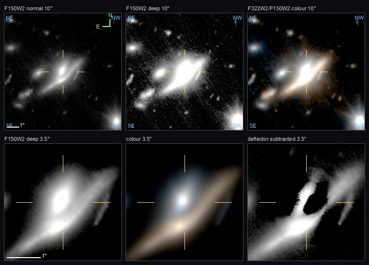{ width="100%" }](img/rank-062-orig.jpg){ target=_blank }
  <figcaption>What the judge saw (blind, footer removed)</figcaption>
</figure>

<figure markdown="span">
  [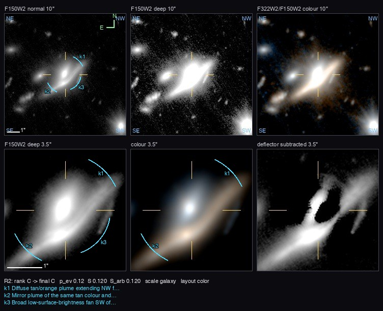{ width="100%" }](img/rank-062-annot.jpg){ target=_blank }
  <figcaption>Advocate evidence (cyan) and critic alternatives coloured by the arbitrator ruling</figcaption>
</figure>

???+ note "Why this grade — advocate, critics, arbitrator"
    **Letter C** (deployed, rule R2) · p_evidence 0.12 · S_arb 0.12 · S 0.12 · scale galaxy

    Letter: letter_rank stands (D rule not met); p_evidence 0.12 < t_B 0.17 (calibrated at 5% FPR on clean negatives); not D: 3 item(s) located; no named critic covers every item at r >= 0.80.

    **Advocate**

    - criteria: source_contrast 5, low_surface_brightness 6, curvature 2, counter_image 2, arc_morphology 1
    - items (3):
        - k1 — “Diffuse tan/orange plume extending NW from the ticked nucleus, brightest 0.8-2.5" out, colour-distinct from the blue-white core in (c)/(e) but continuously joined to it” (panel e, r 1.6 arcsec, PA 295->335, visible in direct: yes; criteria: source_contrast, low_surface_brightness)
        - k2 — “Mirror plume of the same tan colour and surface brightness extending SE, at a similar radius on the opposite side of the nucleus (formally counter-image-like, but joined to k1 through the core)” (panel e, r 1.6 arcsec, PA 115->155, visible in direct: yes; criteria: source_contrast, low_surface_brightness, counter_image)
        - k3 — “Broad low-surface-brightness fan SW of the nucleus in the deep zoom, orange in (e), with a slightly convex outer edge” (panel d, r 1.3 arcsec, PA 200->260, visible in direct: yes; criteria: low_surface_brightness)
    - scale galaxy; red neighbours within 10 arcsec 2; BCG-like halo no; deflector is centre yes; centre-of-curvature offset 4 arcsec
    - p_evidence: 0.12
    - notes: “In (d)/(e) the tan diagonal band runs continuously THROUGH the blue-white nucleus from PA~135 to PA~315 with no gap, its width growing with radius and no fixed-radius tangential segment, and the bright residual in (f) traces exactly that same band rather than an offset arc - the located items look like a warped/inclined disc or tidal bridge, and the critics should test whether any part of k1/k2/k3 is detached from the nuclear light.”

    **Critics**

    - not called (p_evidence 0.12 < tau0 0.15)

    **Arbitrator**

    - no arbitrator record (not called)

    **Score**

    - S = p_ev = 0.12 (no critic term entered the product)
    - S_arb = p_ev = 0.12 (no critic term entered the product)
    - stored grade_pred (on S): C — S 0.12 < t_B 0.17 (calibrated at 5% FPR on clean negatives); not D: 3 item(s) located; no named critic covers every item at r >= 0.80
    - stored letter_arb (on S_arb): C; letter_source: opus5_api_calibrated
    - deploy rule R2: letter_rank (advocate only, on p_evidence) = C — p_evidence 0.12 < t_B 0.17 (calibrated at 5% FPR on clean negatives); not D: 3 item(s) located; no named critic covers every item at r >= 0.80
    - deploy rule R2: letter_final = C — letter_rank stands (D rule not met); p_evidence 0.12 < t_B 0.17 (calibrated at 5% FPR on clean negatives); not D: 3 item(s) located; no named critic covers every item at r >= 0.80
    - veto: none (letter_final == letter_rank)

---

## Rank 63: J15067092+210603 {#rank-63}

| Original grade | Passes | Inspector conf. | Pipeline θ_E |
|:--:|:--:|:--:|:--:|
| **U** | — | 25 | 1.65″ |

| New (final) | Rank letter | p_ev | S_arb | Demoted by | Arb. letter | Needs human |
|:--:|:--:|--:|--:|:--|:--:|:--:|
| **C** | C | 0.14 | 0.140 | — | — | no |

<small>pipeline discovery status `new` · scale class `galaxy`</small>

<figure markdown="span">
  [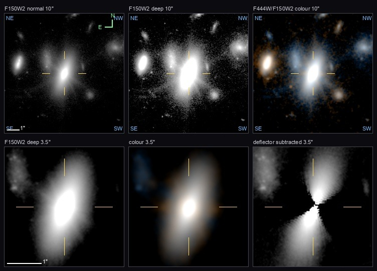{ width="100%" }](img/rank-063-orig.jpg){ target=_blank }
  <figcaption>What the judge saw (blind, footer removed)</figcaption>
</figure>

<figure markdown="span">
  [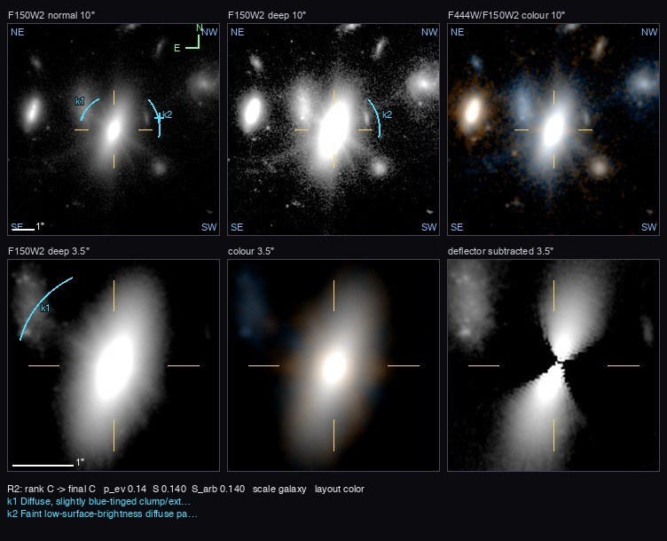{ width="100%" }](img/rank-063-annot.jpg){ target=_blank }
  <figcaption>Advocate evidence (cyan) and critic alternatives coloured by the arbitrator ruling</figcaption>
</figure>

???+ note "Why this grade — advocate, critics, arbitrator"
    **Letter C** (deployed, rule R2) · p_evidence 0.14 · S_arb 0.14 · S 0.14 · scale galaxy

    Letter: letter_rank stands (D rule not met); p_evidence 0.14 < t_B 0.17 (calibrated at 5% FPR on clean negatives); not D: 2 item(s) located; no named critic covers every item at r >= 0.80.

    **Advocate**

    - criteria: source_contrast 4, low_surface_brightness 4, curvature 1, counter_image 2, arc_morphology 1
    - items (2):
        - k1 — “Diffuse, slightly blue-tinged clump/extension off the NE flank of the deflector, separate from the smooth stellar envelope; traceable as a faint blob in the deep zoom (d), bluish in (e), and as a non-mirrored patch outside the bowtie lobes in (f)” (panel d, r 1.6 arcsec, PA 25->75, visible in direct: yes; criteria: source_contrast, low_surface_brightness)
        - k2 — “Faint low-surface-brightness diffuse patch on the W/NW side at comparable radius (possible opposite-side counterpart of item 1), seen as a small fuzzy blob just outside the halo in (a) and (b) with weak blue tint in (c)” (panel b, r 2.2 arcsec, PA 260->310, visible in direct: yes; criteria: low_surface_brightness, counter_image)
    - scale galaxy; red neighbours within 10 arcsec 4; BCG-like halo no; deflector is centre yes; counter-image at r 2.2 arcsec PA 285
    - p_evidence: 0.14
    - notes: “The centre is a strongly elongated (NNE-SSW) bright galaxy whose only structure in (f) is the N-S butterfly/bowtie expected from a circular model on an elliptical, and the direct panels (a,b,d) show no tangential feature at fixed radius - the only offset, non-artefact items are a diffuse NE clump at ~1.6" and a fainter W/NW patch at ~2.2", neither tangentially elongated nor curved about the deflector, with several orange field galaxies at 3-5" making chance projection a live possibility.”

    **Critics**

    - not called (p_evidence 0.14 < tau0 0.15)

    **Arbitrator**

    - no arbitrator record (not called)

    **Score**

    - S = p_ev = 0.14 (no critic term entered the product)
    - S_arb = p_ev = 0.14 (no critic term entered the product)
    - stored grade_pred (on S): C — S 0.14 < t_B 0.17 (calibrated at 5% FPR on clean negatives); not D: 2 item(s) located; no named critic covers every item at r >= 0.80
    - stored letter_arb (on S_arb): C; letter_source: opus5_api_calibrated
    - deploy rule R2: letter_rank (advocate only, on p_evidence) = C — p_evidence 0.14 < t_B 0.17 (calibrated at 5% FPR on clean negatives); not D: 2 item(s) located; no named critic covers every item at r >= 0.80
    - deploy rule R2: letter_final = C — letter_rank stands (D rule not met); p_evidence 0.14 < t_B 0.17 (calibrated at 5% FPR on clean negatives); not D: 2 item(s) located; no named critic covers every item at r >= 0.80
    - veto: none (letter_final == letter_rank)

---

## Rank 64: J20865088+7724666 {#rank-64}

| Original grade | Passes | Inspector conf. | Pipeline θ_E |
|:--:|:--:|:--:|:--:|
| **U** | — | 25 | 1.25″ |

| New (final) | Rank letter | p_ev | S_arb | Demoted by | Arb. letter | Needs human |
|:--:|:--:|--:|--:|:--|:--:|:--:|
| **B** | B | 0.30 | 0.036 | — | D | no |

<small>pipeline discovery status `new` · scale class `galaxy`</small>

<figure markdown="span">
  [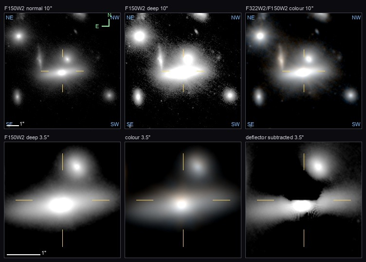{ width="100%" }](img/rank-064-orig.jpg){ target=_blank }
  <figcaption>What the judge saw (blind, footer removed)</figcaption>
</figure>

<figure markdown="span">
  [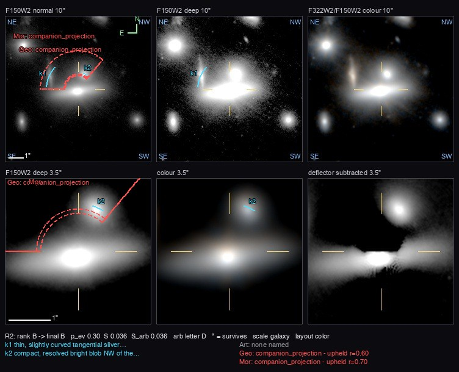{ width="100%" }](img/rank-064-annot.jpg){ target=_blank }
  <figcaption>Advocate evidence (cyan) and critic alternatives coloured by the arbitrator ruling</figcaption>
</figure>

???+ note "Why this grade — advocate, critics, arbitrator"
    **Letter B** (deployed, rule R2) · p_evidence 0.30 · S_arb 0.036 · S 0.036 · scale galaxy

    Letter: letter_rank stands (D rule not met); p_evidence 0.30 >= t_A 0.20 (calibrated at 1% FPR on clean negatives) but A is blocked: only 0 of 3 configuration criteria >= 6; p_evidence 0.30 >= t_B 0.17 (calibrated at 5% FPR on clean negatives).

    **Advocate**

    - criteria: source_contrast 5, low_surface_brightness 6, curvature 5, counter_image 2, arc_morphology 5
    - items (2):
        - k1 — “thin, slightly curved tangential sliver NE of the deflector, ~1.6" long and ~0.3" thick, running at roughly constant radius across ~40 deg of azimuth, whiter/bluer than the orange deflector core in (c); north end carries a small brightening knot” (panel b, r 2.2 arcsec, PA 46->87, visible in direct: yes; criteria: source_contrast, low_surface_brightness, curvature, arc_morphology)
        - k2 — “compact, resolved bright blob NW of the nucleus, clearly detached from the deflector core, white/blue in (e) against the orange deflector; scored as a knot (no elongation expected)” (panel e, r 1.15 arcsec, PA 328->342, visible in direct: yes; criteria: source_contrast, low_surface_brightness)
    - scale galaxy; red neighbours within 10 arcsec 2; BCG-like halo yes; deflector is centre yes; arc radius 2.2 arcsec; arc PA span 46->87; centre-of-curvature offset 0.6 arcsec
    - p_evidence: 0.30
    - notes: “The only fixed-radius tangential candidate is the thin NE sliver at r~2.2" (panels a/b, PA 46-87 deg, ends at r=2.2-2.3" with the midpoint at similar radius, so the implied centre of curvature falls within ~0.6" of the ticked galaxy); the NW blob at 1.15" is compact and has no mirror knot at PA~154 deg in (d), and the E-W bright band plus bowtie in (f) is the circular-model artefact on this highly elongated, apparently interacting/edge-on host, so both located items must be tested against edge-on-companion and tidal explanations.”

    **Critics**

    **artifact — no alternative named (nothing in its competence fits)**

    - leaves standing: k1, k2
    - scale_class: galaxy
    - measured: `{"background": "no mosaic seam, dither edge, 1/f stripe or saturation bleed crosses either item's position", "item1_visibility": "present in un-subtracted (a) and (b) at r~1.9-2.2\", PA ~50-80 deg (NE, upper-left of the ticks); therefore not a subtraction residual", "item2_visibility": "present as a resolved blob with its own extended halo in direct zoom (d) and (e) at r~1.1\", PA ~335 deg; FWHM clearly larger than a point source, so not a snowball/cosmic ray/persistence hit", "nearest_bright_star": "compact source in the NE corner of the 10\" panels at r~4.8\", PA~45 deg; it shows a round core with a smooth halo and no resolved 6-spike pattern in (a) or (b), and no straight ray can be traced from it through the item-1 position", "panel_f_pattern": "bright core plus symmetric E-W lobes and concentric rinding about the stamp centre - the declared circular-profile artefact on this highly elongated (edge-on) galaxy; not counted either way"}`
    - notes: “Both located features live in the un-subtracted frames - the NE sliver in the 10" deep panel (b) at r~2", PA~50-80, and the NW blob in the 3.5" deep/colour panels (d,e) at r~1.1", PA~335 - so neither can be a subtraction residual, and neither aligns with a straight spike, stripe, seam or the PSF halo of the NE-corner star. The only artefact I can point at is the E-W lobed/ringed pattern about the core in (f), which the VIEW already declares to be the circular-model bowtie on an edge-on host and which I therefore do not offer as an alternative.”
    - ruling: no ruling for this critic

    **geometry — companion_projection:** “Two unrelated neighbours projected on the deflector's envelope: a thin straight needle (small edge-on disc) ~2.2" NE, and a compact nucleated companion galaxy with its own smooth halo ~1.15" N-NW; their radii, position angles and profiles are mutually inconsistent as images of one lensed source.”

    - location: r 1-2.6 arcsec, PA 320->90
    - accounts for: k1, k2; leaves standing: none; strength r 0.60; coverage a 1.00 (geometric)
    - scale_class: group
    - measured: `{"axis_minus_tangent_deg": 22, "centre_of_curvature_offset_arcsec": "undefined - no measurable curvature", "counter_image_at_pa240_r2.2": "none seen on the smooth SW envelope in (b)/(d)", "item1_axis_pa_deg": 172, "item1_curvature_sagitta_arcsec": "<0.1 (not detected; feature reads as straight in (b))", "item1_length_arcsec": 1.3, "item1_pa_deg": 60, "item1_r_arcsec": 2.25, "item1_width_arcsec": 0.3, "item2_axis_ratio": "~1.0 (round, nucleated, own extended halo in (d))", "item2_pa_deg": 335, "item2_r_arcsec": 1.15, "local_tangent_pa_deg": 150, "pa_separation_deg": 85, "radius_ratio_item1_over_item2": 1.96}`
    - notes: “In (b) the NE feature at r~2.25", PA~60 is a straight, uniformly thin needle running ~PA 172-352 (~22 deg off the local tangent) with a nucleated brightening at its N end - an edge-on disclet, and I detect no sagitta over its 1.3" length nor any counter-arc at PA~240, r~2.2" on the smooth SW envelope; in (d)/(e) the NW blob at r=1.15", PA~335 is round with its own symmetric halo and a point-like core, at half the radius and 85 deg away from item 1, so the two cannot be images of one source.”
    - ruling: upheld, covers k1, k2 — “In (b)/(c) the NE feature at r~2.2" is a uniformly thin, straight needle running ~PA 161/341 with a compact bulge at its N tip and no measurable sagitta, i.e. an edge-on disclet ~22 deg off the local tangent, while the NW source at r~1.15" is round with its own symmetric halo and a point-like core - the two cannot be images of one source.”

    **morphology — companion_projection:** “Two discrete neighbouring galaxies, not lensed images: a compact round companion 1.15" NW sitting on a bump of the shared diffuse envelope, and a bulge+needle edge-on disk galaxy ~2.2" NE whose straight major axis (PA~161/341) is a projected companion, not an arc curving about the ticked galaxy”

    - location: r 0.9-2.6 arcsec, PA 320->90
    - accounts for: k1, k2; leaves standing: none; strength r 0.70; coverage a 1.00 (geometric)
    - scale_class: galaxy
    - measured: `{"counter_image": "none at the mirrored PA (~236 for item 1, ~155 for item 2) in panels (c)/(d)", "item1_bulge": "compact brightening at the NE/N tip, i.e. a bulge on a needle, with the light tapering monotonically to the SW tip", "item1_length_arcsec": "~1.7", "item1_long_axis_pa_deg": "~161/341 (straight; no measurable curvature over its length, <0.1\" sagitta)", "item1_radial_pa_deg": "~56 (offset ~1.9\" E, ~1.3\" N in panel c)", "item2_axis_ratio": "~1.0, FWHM ~0.35\" - round, no tangential elongation", "item2_r_arcsec": "1.15"}`
    - notes: “In panel (c) the NE feature (r~2.2", PA~56) is a straight, tapered needle with a compact bulge at its N tip - an edge-on disk galaxy whose major axis runs ~161 deg, not a segment of constant-radius arc, and it has no counter-arc at PA~236; in panel (d) the NW source (r~1.15", PA~335) is a round, resolved compact galaxy sitting on a northward bump of the shared low-surface-brightness envelope, with no elongation and no mirror image at PA~155.”
    - ruling: upheld, covers k1, k2 — “Panel (d)/(e) resolve the NW object as a round, nucleated compact galaxy on a bump of the shared envelope with no tangential elongation and no mirror knot at PA~155, and the NE streak tapers monotonically from a bulge at its N tip - a projected edge-on disk, not an arc at fixed radius about the ticks.”

    **Arbitrator**

    - surviving items: none (0 of 2)
    - letter_llm: D; scale_class_final: galaxy; needs_human: no
    - rationale: “The ticked deflector is the highly flattened, E-W elongated system at the centre of the 3.5" row; everything offered as lensing evidence resolves at 0.031"/px into ordinary neighbours. Item 1, the NE 'sliver' in (a)/(b) at r~2.2", is a straight, uniformly thin needle whose long axis runs ~PA 161/341 - some 20 deg away from the local tangent to a circle about the ticks - with a compact bulge brightening at its N tip and light tapering to the SW tip: a bulge-plus-needle edge-on disk galaxy, not a tangential arc, and no sagitta is traceable over its ~1.3-1.7" length nor any counter-arc on the smooth SW envelope at PA~240. Item 2, the NW blob at r~1.15", is resolved in (d) and (e) as a round (axis ratio ~1) nucleated source with its own smooth extended halo sitting on a northward bump of the shared low-surface-brightness envelope, with no tangential elongation and no mirror image at PA~155; its radius is half that of item 1 and it lies 85 deg away in azimuth, so the pair is geometrically inconsistent with one lensed source. The artifact reviewer correctly finds both features in un-subtracted frames and offers no artefact alternative, and the bright E-W lobes plus concentric ringing about the core in (f) are the declared circular-model bowtie on an elongated host and count for nothing. With both located items absorbed by an upheld companion_projection alternative and no fixed-radius tangential structure or counter-image anywhere in (b)/(d)/(e), nothing survives.”

    **Score**

    - S = p_ev x prod(1 - r_i a_i) = 0.30 x (1 - 0.60x1.00) x (1 - 0.70x1.00) = 0.036
        - terms: geometry companion_projection r 0.60 a 1.00; morphology companion_projection r 0.70 a 1.00
    - S_arb = p_ev x prod_{upheld/partial}(1 - r_i a_i') = 0.30 x (1 - 0.60x1.00) x (1 - 0.70x1.00) = 0.036
        - terms: geometry companion_projection r 0.60 a 1.00 (upheld); morphology companion_projection r 0.70 a 1.00 (upheld)
    - stored grade_pred (on S): C — S 0.036 < t_B 0.17 (calibrated at 5% FPR on clean negatives); not D: 2 item(s) located; no named critic covers every item at r >= 0.80
    - stored letter_arb (on S_arb): C; letter_source: opus5_api_calibrated
    - deploy rule R2: letter_rank (advocate only, on p_evidence) = B — p_evidence 0.30 >= t_A 0.20 (calibrated at 1% FPR on clean negatives) but A is blocked: only 0 of 3 configuration criteria >= 6; p_evidence 0.30 >= t_B 0.17 (calibrated at 5% FPR on clean negatives)
    - deploy rule R2: letter_final = B — letter_rank stands (D rule not met); p_evidence 0.30 >= t_A 0.20 (calibrated at 1% FPR on clean negatives) but A is blocked: only 0 of 3 configuration criteria >= 6; p_evidence 0.30 >= t_B 0.17 (calibrated at 5% FPR on clean negatives)
    - veto: none (letter_final == letter_rank)

---

## Rank 65: J4429240-2347200 {#rank-65}

| Original grade | Passes | Inspector conf. | Pipeline θ_E |
|:--:|:--:|:--:|:--:|
| **U** | — | 25 | 1.55″ |

| New (final) | Rank letter | p_ev | S_arb | Demoted by | Arb. letter | Needs human |
|:--:|:--:|--:|--:|:--|:--:|:--:|
| **D** | C | 0.16 | 0.019 | merger (Mor) | D | no |

<small>pipeline discovery status `new` · scale class `none`</small>

<figure markdown="span">
  [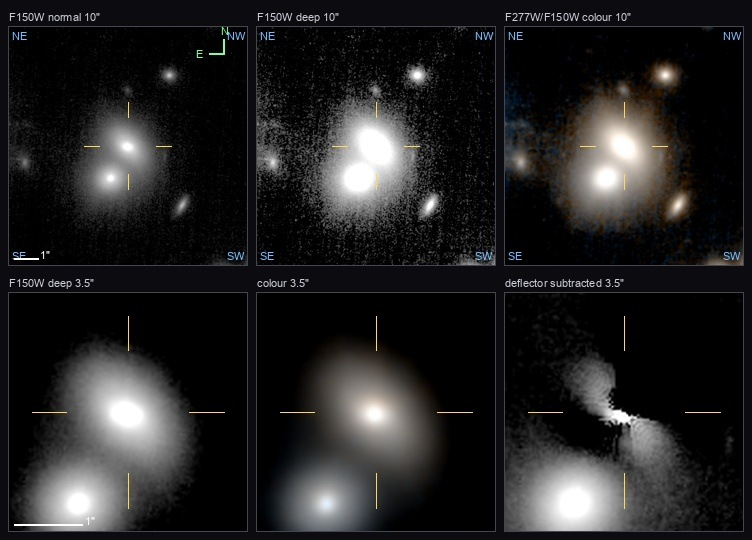{ width="100%" }](img/rank-065-orig.jpg){ target=_blank }
  <figcaption>What the judge saw (blind, footer removed)</figcaption>
</figure>

<figure markdown="span">
  [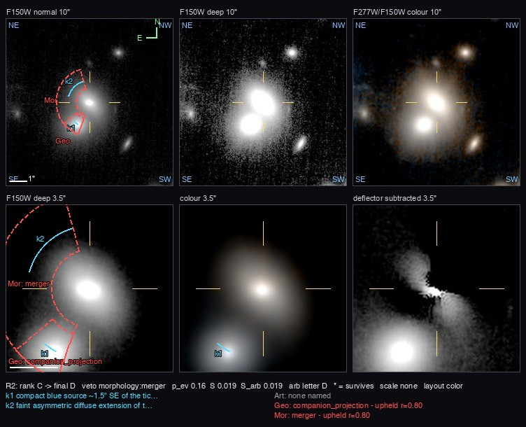{ width="100%" }](img/rank-065-annot.jpg){ target=_blank }
  <figcaption>Advocate evidence (cyan) and critic alternatives coloured by the arbitrator ruling</figcaption>
</figure>

???+ note "Why this grade — advocate, critics, arbitrator"
    **Letter D** (deployed, rule R2) · p_evidence 0.16 · S_arb 0.019 · S 0.019 · scale none

    Letter: D rule: morphology (merger) covers every item (a = 1) at r 0.80 >= 0.80 (upheld).

    **Advocate**

    - criteria: source_contrast 6, low_surface_brightness 3, curvature 1, counter_image 1, arc_morphology 1
    - items (2):
        - k1 — “compact blue source ~1.5" SE of the ticked galaxy: distinctly blue/white in the colour panels (e) and (c) against the orange deflector, with a small resolved core plus faint envelope in the deep zoom (d); scored as a knot (contrast + resolved, not point-like), no tangential elongation” (panel e, r 1.5 arcsec, PA 140->152, visible in direct: yes; criteria: source_contrast, low_surface_brightness)
        - k2 — “faint asymmetric diffuse extension of the envelope toward N/NE at r~1.2-1.5", giving the deep-stretch isophotes in (d) and (b) a lopsided, twisted shape on the side opposite the blue source; low surface brightness, no fixed-radius tangential ridge and no compact knot within it” (panel d, r 1.3 arcsec, PA 15->75, visible in direct: yes; criteria: low_surface_brightness)
    - scale galaxy; red neighbours within 10 arcsec 3; BCG-like halo yes; deflector is centre yes
    - p_evidence: 0.16
    - notes: “The only strongly contrasting feature is the blue compact object 1.5" SE (PA~146) in (d)/(e); nothing tangentially elongated or at constant radius appears anywhere out to 5" in (a)/(b)/(c), and the opposite side at r~1.5" (PA~326) shows only a lopsided diffuse envelope, not a matching knot, so the pair reads as a close red+blue system rather than an image configuration - panel (f) carries only the circular-model bowtie/dipole and is uninformative at these radii.”

    **Critics**

    **artifact — no alternative named (nothing in its competence fits)**

    - leaves standing: k1, k2
    - scale_class: galaxy
    - measured: `{"background": "no 1/f striping, mosaic seam, dither edge or low-coverage wedge crosses the 3.5\" zoom; noise is uniform", "diffraction_check": "no straight 6-spike rays anywhere in (a)/(b); the brightest point source lies ~3.5\" NNW (PA~340) and its wings do not reach r=1.5\" at PA 140-152 or PA 15-75", "item1_direct_panels": "present as a resolved core plus envelope in (a), (b), (d) and (e) at r~1.5\", PA~146 - not confined to the subtracted panel (f), so subtraction_residual is inadmissible", "item1_profile": "FWHM clearly broader than the point sources in the 10\" field (e.g. the star ~3.5\" NNW in panel a) and with a low-surface-brightness halo: not a snowball, cosmic-ray hit or persistence blob, all of which are unresolved or sharp-edged", "panel_f_pattern": "the central black/white dipole plus concentric ring in (f) is exactly the artefact the circular 1D subtraction produces on this off-centre, elongated, companion-blended core - not counted as an item or as an alternative"}`
    - notes: “Both located features are present in the un-subtracted panels (the blue knot at r~1.5", PA~146 in a/b/d/e; the lopsided NE isophote at r~1.2-1.5", PA 15-75 in b and d), so neither can be a subtraction residual, and neither is straight, rectangular or point-like as detector artefacts and diffraction spikes must be. No instrumental or reduction alternative in my competence fits; whether the SE source is a physical companion and the NE excess is tidal/host structure is a morphology call, not mine.”
    - ruling: no ruling for this critic

    **geometry — companion_projection:** “The SE 'blue source' is a second galaxy of the close pair: a centrally-peaked compact nucleus with its own extended, roughly circular envelope that overlaps the ticked galaxy's halo - not a tangentially stretched image with a counter-image.”

    - location: r 1-2 arcsec, PA 130->160
    - accounts for: k1; leaves standing: k2; strength r 0.80; coverage a 0.50 (geometric)
    - scale_class: galaxy
    - measured: `{"centre_of_curvature_offset": "no curved ridge exists to fit; item 1 shows no arc curvature about the tick centre", "colour_consistency": "item 1 is blue/white while item 2 is envelope-coloured - not a matched image pair", "counter_image_search_r1.3_1.7_pa_310_350": "none: the NW/N side at the same radius shows only smooth diffuse envelope, no compact knot or ridge", "item1_axis_ratio_and_orientation": "~1.0-1.1, round; no measurable tangential (PA~55) elongation in (d)", "item1_position_angle_deg": 145, "item1_surface_brightness_profile": "sharply peaked core plus smooth extended envelope resolved out to ~1\" in (b) and (d) - galaxy-like, not a thin arc (arc width would be << r=1.5\")", "separation_of_item1_from_tick_centre_arcsec": 1.5}`
    - notes: “In (b) and (d) the SE object at r~1.5", PA~145 is a bright compact nucleus embedded in its own ~1"-radius halo whose isophotes are centred on itself, not concentric with the ticked galaxy; there is no tangential stretching and nothing at the mirror position (r~1.5", PA~325). Item 2, the low-surface-brightness N/NE isophotal lopsidedness at r~1.3", carries no tangential ridge and its origin (host envelope / interaction) is the morphology critic's call, so I leave it standing.”
    - ruling: upheld, covers k1 — “In panels (b) and (d) the SE object at r~1.5", PA~146 is round (axis ratio ~1) with a sharply peaked nucleus inside its own ~0.7" envelope whose isophotes close on itself, with no tangential ridge and nothing at the mirror position PA~325.”

    **morphology — merger:** “An interacting close pair: the 'blue source' 1.5" SE is a second galaxy with its own resolved core AND its own extended envelope that merges continuously with the ticked galaxy's halo in (d) and (e); the N/NE lopsidedness of the host isophotes is the interaction/isophote twist of that pair inside the common diffuse envelope seen in (c).”

    - location: r 0.8-2 arcsec, PA 15->160
    - accounts for: k1, k2; leaves standing: none; strength r 0.80; coverage a 1.00 (geometric)
    - scale_class: group
    - measured: `{"common_envelope_radius_arcsec": 4.0, "companion_pa_deg": 146, "companion_separation_arcsec": 1.5, "companion_shape": "round, axis ratio ~0.9, no tangential elongation; resolved core + own envelope ~0.6-0.8\" across in (d)", "host_major_axis_pa_deg": 55, "isophote_bridge": "surface brightness never falls to sky between the two cores in (d) - continuous stellar bridge along PA ~146", "item2_span_pa_deg": "15-75, i.e. coincident with the host major axis, smooth, no fixed-radius ridge"}`
    - notes: “In (d) the SE object at r=1.5", PA~146 has a bright compact core embedded in its own halo whose isophotes join the ticked galaxy's without a minimum - an interacting/overlapping pair, not an isolated lensed knot, and it shows zero tangential stretch. The NE 'extension' at r~1.3", PA 15-75 lies exactly along the host's own major axis (PA~55) and is a smooth, monotonically declining isophote asymmetry, with no counter-feature at PA~235 and no ridge at fixed radius; panel (c) shows several galaxies sharing one ~4" diffuse envelope, consistent with a group/interacting system.”
    - ruling: upheld, covers k1, k2 — “The deep zoom (d) shows the surface brightness never dropping to sky between the two cores along PA~146 (continuous stellar bridge), and the N/NE lopsidedness at r~1.3" runs along the host's own major axis (PA~55) as a smooth monotonic isophote twist, not a fixed-radius arc.”

    **Arbitrator**

    - surviving items: none (0 of 2)
    - letter_llm: D; scale_class_final: none; needs_human: no
    - rationale: “Both located items are accounted for by the upheld interacting-pair reading. The SE feature (visible in a, b, d, e at r~1.5", PA~146) resolves at NIRCam sampling into a compact nucleus with its own roughly circular halo, blue-cored in (e)/(c), showing no tangential elongation about the tick centre and no counter-knot on the NW side at r~1.3-1.7", PA~310-350; an arc at that radius would be a thin (width << 1.5") curved ridge, and none is present. The second item, the lopsided N/NE isophote in (b)/(d), is a smooth low-surface-brightness envelope asymmetry aligned with the host major axis (PA~55) with no ridge at constant radius and no counter-feature at PA~235 - classic interaction/isophote-twist structure inside the ~4" common diffuse envelope visible in (c). Panel (f) contributes nothing: the central black/white dipole and concentric ring there are exactly the artefacts the circular 1D profile subtraction produces on this off-centre, companion-blended, elongated core, and the artifact critic correctly found no straight spikes, striping or seam anywhere in the field. With no tangential curvature, no counter-image and no fixed-radius surface-brightness structure anywhere out to 5", nothing lens-like survives; deeper data would not change a configuration this cleanly resolved.”

    **Score**

    - S = p_ev x prod(1 - r_i a_i) = 0.16 x (1 - 0.80x0.50) x (1 - 0.80x1.00) = 0.019
        - terms: geometry companion_projection r 0.80 a 0.50; morphology merger r 0.80 a 1.00
    - S_arb = p_ev x prod_{upheld/partial}(1 - r_i a_i') = 0.16 x (1 - 0.80x0.50) x (1 - 0.80x1.00) = 0.019
        - terms: geometry companion_projection r 0.80 a 0.50 (upheld); morphology merger r 0.80 a 1.00 (upheld)
    - stored grade_pred (on S): D — S 0.019 < t_B 0.17 (calibrated at 5% FPR on clean negatives) and morphology (merger) covers every item at r 0.80 >= 0.80
    - stored letter_arb (on S_arb): D; letter_source: opus5_api_calibrated
    - deploy rule R2: letter_rank (advocate only, on p_evidence) = C — p_evidence 0.16 < t_B 0.17 (calibrated at 5% FPR on clean negatives); not D: 2 item(s) located; no named critic covers every item at r >= 0.80
    - deploy rule R2: letter_final = D — D rule: morphology (merger) covers every item (a = 1) at r 0.80 >= 0.80 (upheld)
    - veto: morphology:merger

---

## Rank 66: J18850875+1133833 {#rank-66}

| Original grade | Passes | Inspector conf. | Pipeline θ_E |
|:--:|:--:|:--:|:--:|
| **U** | — | 25 | 1.28″ |

| New (final) | Rank letter | p_ev | S_arb | Demoted by | Arb. letter | Needs human |
|:--:|:--:|--:|--:|:--|:--:|:--:|
| **C** | C | 0.15 | 0.018 | — | D | no |

<small>pipeline discovery status `new` · scale class `galaxy`</small>

<figure markdown="span">
  [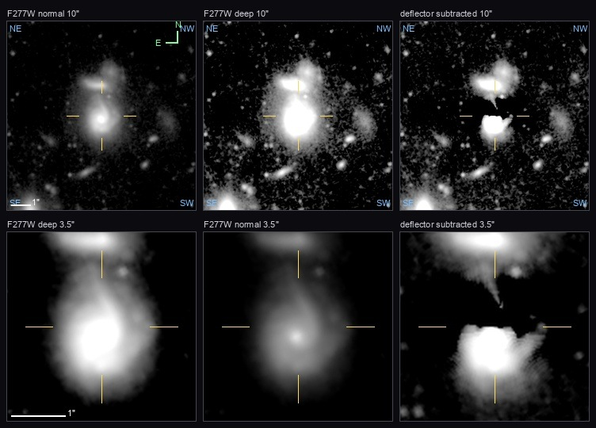{ width="100%" }](img/rank-066-orig.jpg){ target=_blank }
  <figcaption>What the judge saw (blind, footer removed)</figcaption>
</figure>

<figure markdown="span">
  [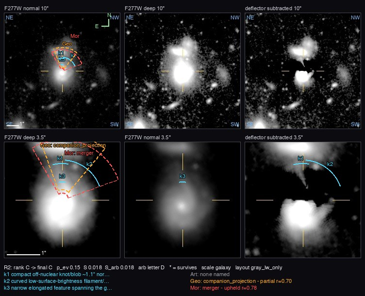{ width="100%" }](img/rank-066-annot.jpg){ target=_blank }
  <figcaption>Advocate evidence (cyan) and critic alternatives coloured by the arbitrator ruling</figcaption>
</figure>

???+ note "Why this grade — advocate, critics, arbitrator"
    **Letter C** (deployed, rule R2) · p_evidence 0.15 · S_arb 0.018 · S 0.018 · scale galaxy

    Letter: letter_rank stands (D rule not met); p_evidence 0.15 < t_B 0.17 (calibrated at 5% FPR on clean negatives); not D: 3 item(s) located; no named critic covers every item at r >= 0.80.

    **Advocate**

    - criteria: source_contrast 4, low_surface_brightness 5, curvature 2, counter_image 1, arc_morphology 2
    - items (3):
        - k1 — “compact off-nuclear knot/blob ~1.1" north of the ticked galaxy, distinctly more peaked than the smooth envelope it sits in; bright and isolated in (f), clearly present in (a), (b), (d), (e)” (panel f, r 1.1 arcsec, PA 350->15, visible in direct: yes; criteria: source_contrast, low_surface_brightness)
        - k2 — “curved low-surface-brightness filament/plume running from the north knot down toward the WSW, roughly 0.9-1.4" from the tick centre; traceable as a faint wisp in the deep 3.5" (d) and normal 3.5" (e) panels” (panel f, r 1.2 arcsec, PA 290->355, visible in direct: yes; criteria: low_surface_brightness, curvature)
        - k3 — “narrow elongated feature spanning the gap between the bright core and the north knot (a bridge-like link) seen in the normal-stretch 10" (a) and 3.5" (e) panels” (panel e, r 0.55 arcsec, PA 350->10, visible in direct: yes; criteria: low_surface_brightness)
    - scale galaxy; red neighbours within 10 arcsec 4; BCG-like halo yes; deflector is centre yes; centre-of-curvature offset 1.6 arcsec
    - p_evidence: 0.15
    - notes: “The only off-nuclear structure is the compact blob ~1.1" due north plus a curved plume trailing WSW from it (brightest in (f), visible in (a)/(b)/(d)/(e)); the plume's concavity points to a centre ~1.6" off the tick centre, the blob appears joined to the core by a continuous bridge in (e), and the south side at r~1.1" shows only smooth envelope with no counter-image, so the geometry tests mostly fail even though the features themselves are real.”

    **Critics**

    **artifact — no alternative named (nothing in its competence fits)**

    - leaves standing: k1, k2, k3
    - scale_class: galaxy
    - measured: `{"detector_pattern_test": "no snowball ring, cosmic-ray track, 1/f striping, mosaic seam or coverage edge crosses the 3.5\" stamp; background in (b) is uniform", "knot_position_in_direct_panels": "compact peak ~1.1\" at PA ~355-10 appears at the same pixel position in (a), (b), (d) and (e), not only in (c)/(f), so it cannot be a subtraction residual", "psf_wing_test": "nearest bright object ~3\" SE is faint and unsaturated; no bleed or wing structure within the field", "spike_test": "no straight rays at fixed PA emanate from the ticked core or any bright neighbour; the 6-spike JWST pattern is absent in the 10\" field"}`
    - notes: “All located features (north knot r~1.1", PA 350-15; curved plume r~0.9-1.4", PA 290-355; inner bridge r~0.55") are traceable in the un-subtracted panels (a), (b), (d), (e) at the same positions, so the circular-profile residual in (c)/(f) is not their origin. No diffraction spike, snowball, stripe, seam or PSF wing anywhere in the field; nothing in my competence explains these items.”
    - ruling: overruled — “The artifact critic named no alternative and explicitly leaves items 1-3 standing, confirming the knot at r~1.1" N is at the same pixels in (a), (b), (d) and (e) and is not a subtraction pattern.”

    **geometry — companion_projection:** “A compact companion/second nucleus sitting ~1.2-1.3" NNW of the ticked galaxy, physically superposed on (and linked by) the host's northern extension - the bright elongated source at ~1.8-2.0" due N in (b)/(d) is a third, separate object. The knot plus its radial link is an unrelated/interacting neighbour, not a lensed image pair: the configuration is radial along one axis, not tangential at fixed radius, and has no counter-image.”

    - location: r 0.3-2 arcsec, PA 320->20
    - accounts for: k1, k3; leaves standing: k2; strength r 0.70; coverage a 0.667 (geometric)
    - scale_class: galaxy
    - measured: `{"centre_of_curvature_item2": "faint WNW wisp at r ~1.1-1.3\" has no measurable curvature centred on the tick; its concave side is ill-defined at this S/N", "counter_image_search": "annulus r = 1.0-1.6\", PA 140-220 in (d) and (e): smooth envelope only, no knot or arc above the local envelope; flux ratio limit >5:1 against any southern counterpart", "item3_orientation": "the bridge in (e) runs from the core outward at PA ~355-5 over r = 0.2-1.0\" - RADIAL, i.e. along the line joining core and knot, the opposite of an arc", "knot_offset_from_tick_in_(d)": "dx ~0.4\" W, dy ~1.22\" N -> r = 1.29\", PA = 341 deg", "knot_shape": "round/point-like, axis ratio ~1.1, no measurable tangential elongation (major axis, if any, points radially at PA ~340)", "third_source": "extended bar-like source at r ~1.85\", PA ~0-15 in (b)/(d), ~1.1\" long, its own smooth profile - a distinct galaxy, not at the knot's radius"}`
    - notes: “In (d)/(e) the northern knot (r=1.29", PA=341) is compact and round with a straight RADIAL ridge running back to the core (item 3, PA ~355-5), while the annulus at the same radius on the south side (PA 140-220) is featureless - a lens would put a tangentially stretched counter-arc there, not a radial bridge. The brighter elongated object 1.85" due north is a separate galaxy at an incompatible radius, so the northern features are a projected/interacting neighbourhood rather than one source imaged twice.”
    - ruling: partial, covers k1, k3 — “The northern knot is round (axis ratio ~1.1) with a straight RADIAL ridge back to the core in (e) along PA~355-5 and a featureless annulus at PA 140-220, r~1.0-1.6" in (d)/(e), which is projection/interaction geometry, not a tangential image pair, but it does not address the WSW plume.”

    **morphology — merger:** “An interacting/merging pair: the ticked galaxy plus a second, elongated luminous body ~1.5-1.7" due north, both sitting in one common diffuse envelope, with a stellar bridge running continuously from the ticked nucleus to the northern body and a tidal plume wrapping around its west side; the compact knot at ~1.1" is a clump/secondary condensation on that bridge, not an isolated counter-image.”

    - location: r 0.2-1.8 arcsec, PA 290->30
    - accounts for: k1, k2, k3; leaves standing: none; strength r 0.78; coverage a 1.00 (geometric)
    - scale_class: galaxy
    - measured: `{"bridge_continuity": "unbroken surface-brightness ridge in (e) from the nucleus (r~0.15\") out to r~1.0\" along PA~355-10, i.e. flux never drops to sky between core and knot - item 3 IS the stellar bridge", "common_envelope": "single low-surface-brightness envelope in (d) enclosing both nuclei, elongated N-S over ~3\", with no closed ring and no counter-arc on the south side (PA 150-210) at r~1.1\"", "knot_offset": "compact knot at dx~0.44\" W, dy~1.02\" N of tick centre => r~1.11\", PA~337 (panels d,e)", "north_companion_offset": "bright elongated body centred ~1.6\" N (PA~357) in (a) and (d); it is resolved and extended NE-SW, not a point source", "radius_vs_angle": "the (2) plume climbs from r~0.9\" at PA~355 to r~1.4\" at PA~295 - monotonic radius growth, not constant-radius tangential"}`
    - notes: “In (e) the ridge from the core to the 1.1" knot is continuous stellar light joined to the nucleus - the scorer's own item 3 is a bridge, which an Einstein arc cannot have; in (d) the envelope is one common N-S halo containing the ticked core and the extended northern body at ~1.6", while the (2) wisp increases in radius as it swings from N to WSW rather than holding constant radius, and the whole southern half (PA 150-210, r~1.1") is featureless with no counter-image.”
    - ruling: upheld, covers k1, k2, k3 — “Panel (d) shows one common N-S diffuse envelope enclosing the ticked nucleus and the extended northern body at ~1.6", panel (e) shows an unbroken stellar ridge from r~0.15" out to r~1.0" (item 3 is a bridge, which an Einstein arc cannot have), and the item-2 wisp climbs from r~0.9" at PA~355 to r~1.4" at PA~295 rather than holding constant radius.”

    **Arbitrator**

    - surviving items: none (0 of 3)
    - letter_llm: D; scale_class_final: galaxy; needs_human: no
    - rationale: “The artifact critic offered no alternative and the located features are genuinely on the sky - the compact knot ~1.1" NNW, the westward wisp and the core-to-knot ridge all appear at identical pixel positions in the un-subtracted panels (a), (b), (d), (e), so the circular-profile bowtie in (c)/(f) is not their origin and plays no part in this ruling. But the morphology critic's merger reading accounts for every item using the direct panels: in (d) a single low-surface-brightness envelope, elongated N-S over ~3", encloses both the ticked nucleus and the extended, resolved body ~1.6" due north, and in (e) the surface brightness never falls to sky between the nucleus and the 1.1" knot - that continuous stellar bridge along PA~355-10 is item 3, and a lensed image cannot be attached to its deflector by luminous stellar light. Item 2's plume grows monotonically in radius from ~0.9" at PA~355 to ~1.4" at PA~295, the signature of a tidal wrap, not a constant-radius tangential arc, and the knot itself is round with no measurable tangential elongation. The geometry critic independently confirms the decisive negative test: the annulus at r~1.0-1.6", PA 140-220 in (d) and (e) is smooth envelope only, with no counter-arc above the local envelope at a flux ratio limit >5:1. With no tangential curvature, no counter-image and a stellar bridge linking every northern feature to the ticked core, nothing survives; this is an interacting/merging pair, not a lens.”

    **Score**

    - S = p_ev x prod(1 - r_i a_i) = 0.15 x (1 - 0.70x0.667) x (1 - 0.78x1.00) = 0.018
        - terms: geometry companion_projection r 0.70 a 0.667; morphology merger r 0.78 a 1.00
    - S_arb = p_ev x prod_{upheld/partial}(1 - r_i a_i') = 0.15 x (1 - 0.70x0.667) x (1 - 0.78x1.00) = 0.018
        - terms: geometry companion_projection r 0.70 a' 0.667 (partial); morphology merger r 0.78 a 1.00 (upheld)
    - stored grade_pred (on S): C — S 0.018 < t_B 0.17 (calibrated at 5% FPR on clean negatives); not D: 3 item(s) located; no named critic covers every item at r >= 0.80
    - stored letter_arb (on S_arb): C; letter_source: opus5_api_calibrated
    - deploy rule R2: letter_rank (advocate only, on p_evidence) = C — p_evidence 0.15 < t_B 0.17 (calibrated at 5% FPR on clean negatives); not D: 3 item(s) located; no named critic covers every item at r >= 0.80
    - deploy rule R2: letter_final = C — letter_rank stands (D rule not met); p_evidence 0.15 < t_B 0.17 (calibrated at 5% FPR on clean negatives); not D: 3 item(s) located; no named critic covers every item at r >= 0.80
    - veto: none (letter_final == letter_rank)

---

## Rank 67: J20948181-1096952 {#rank-67}

| Original grade | Passes | Inspector conf. | Pipeline θ_E |
|:--:|:--:|:--:|:--:|
| **U** | — | 25 | — |

| New (final) | Rank letter | p_ev | S_arb | Demoted by | Arb. letter | Needs human |
|:--:|:--:|--:|--:|:--|:--:|:--:|
| **D** | D | 0.04 | 0.040 | — | — | no |

<small>pipeline discovery status `new` · scale class `none`</small>

<figure markdown="span">
  [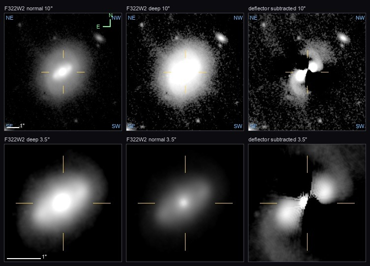{ width="100%" }](img/rank-067-orig.jpg){ target=_blank }
  <figcaption>What the judge saw (blind, footer removed)</figcaption>
</figure>

<figure markdown="span">
  [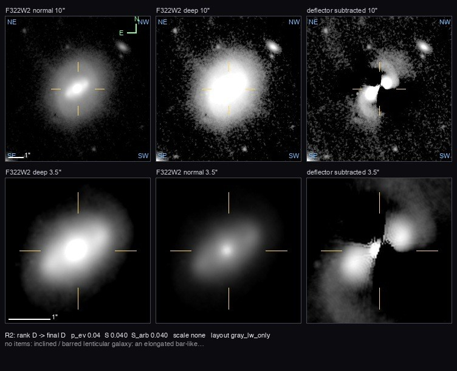{ width="100%" }](img/rank-067-annot.jpg){ target=_blank }
  <figcaption>Advocate evidence (cyan) and critic alternatives coloured by the arbitrator ruling</figcaption>
</figure>

???+ note "Why this grade — advocate, critics, arbitrator"
    **Letter D** (deployed, rule R2) · p_evidence 0.04 · S_arb 0.04 · S 0.04 · scale none

    Letter: letter_rank stands (D rule not met); p_evidence 0.04 < t_B 0.17 (calibrated at 5% FPR on clean negatives) and nothing located: nothing_because “inclined / barred lenticular galaxy: an elongated bar-like bright core (major axis PA~135-315) inside a smooth boxy envelope, with no offset tangential feature anywhere from 0.3" to 5"”.

    **Advocate**

    - criteria: source_contrast 1, low_surface_brightness 2, curvature 0, counter_image 0, arc_morphology 0
    - items: none located
    - nothing_because: “inclined / barred lenticular galaxy: an elongated bar-like bright core (major axis PA~135-315) inside a smooth boxy envelope, with no offset tangential feature anywhere from 0.3" to 5"”
    - scale none; red neighbours within 10 arcsec 2; BCG-like halo yes; deflector is centre no
    - p_evidence: 0.04
    - notes: “Panels (d) and (e) show only a single smooth elongated core plus a featureless envelope out to ~2", and the deep 10" panel (b) shows no knot, arc or ring at any radius out to ~5" - the two bright blobs straddling the centre in (c)/(f) are the classic dipole/bowtie left by the circular azimuthally-averaged subtraction on this strongly elongated core (mirrored across the nucleus at equal radius), and are therefore not counted; the nearest neighbours (compact source ~4" NW, faint sources ~4.5" SE and SW) have no tangential elongation and no opposite-side counterparts.”

    **Critics**

    - not called (p_evidence 0.04 < tau0 0.15)

    **Arbitrator**

    - no arbitrator record (not called)

    **Score**

    - S = p_ev = 0.04 (no critic term entered the product)
    - S_arb = p_ev = 0.04 (no critic term entered the product)
    - stored grade_pred (on S): D — S 0.04 < t_B 0.17 (calibrated at 5% FPR on clean negatives) and nothing located: nothing_because “inclined / barred lenticular galaxy: an elongated bar-like bright core (major axis PA~135-315) inside a smooth boxy envelope, with no offset tangential feature anywhere from 0.3" to 5"”
    - stored letter_arb (on S_arb): D; letter_source: opus5_api_calibrated
    - deploy rule R2: letter_rank (advocate only, on p_evidence) = D — p_evidence 0.04 < t_B 0.17 (calibrated at 5% FPR on clean negatives) and nothing located: nothing_because “inclined / barred lenticular galaxy: an elongated bar-like bright core (major axis PA~135-315) inside a smooth boxy envelope, with no offset tangential feature anywhere from 0.3" to 5"”
    - deploy rule R2: letter_final = D — letter_rank stands (D rule not met); p_evidence 0.04 < t_B 0.17 (calibrated at 5% FPR on clean negatives) and nothing located: nothing_because “inclined / barred lenticular galaxy: an elongated bar-like bright core (major axis PA~135-315) inside a smooth boxy envelope, with no offset tangential feature anywhere from 0.3" to 5"”
    - veto: none (letter_final == letter_rank)

---

## Rank 68: J17772978-2808033 {#rank-68}

| Original grade | Passes | Inspector conf. | Pipeline θ_E |
|:--:|:--:|:--:|:--:|
| **U** | — | 26 | 2.46″ |

| New (final) | Rank letter | p_ev | S_arb | Demoted by | Arb. letter | Needs human |
|:--:|:--:|--:|--:|:--|:--:|:--:|
| **B** | B | 0.30 | 0.180 | — | C | yes ⚑ |

<small>pipeline discovery status `new` · scale class `group`</small>

<figure markdown="span">
  [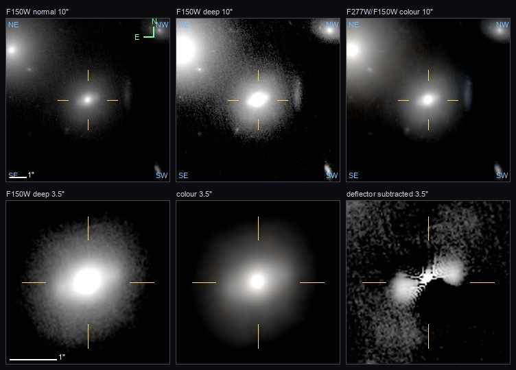{ width="100%" }](img/rank-068-orig.jpg){ target=_blank }
  <figcaption>What the judge saw (blind, footer removed)</figcaption>
</figure>

<figure markdown="span">
  [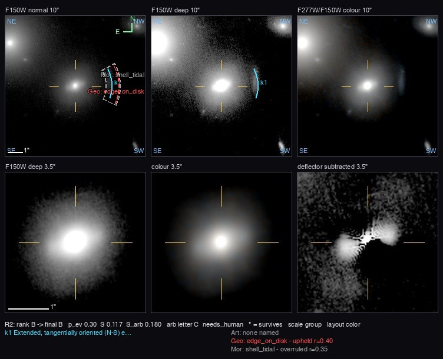{ width="100%" }](img/rank-068-annot.jpg){ target=_blank }
  <figcaption>Advocate evidence (cyan) and critic alternatives coloured by the arbitrator ruling</figcaption>
</figure>

???+ note "Why this grade — advocate, critics, arbitrator"
    **Letter B** (deployed, rule R2) · p_evidence 0.30 · S_arb 0.18 · S 0.117 · scale group

    Letter: letter_rank stands (D rule not met); p_evidence 0.30 >= t_A 0.20 (calibrated at 1% FPR on clean negatives) but A is blocked: only 0 of 3 configuration criteria >= 6; p_evidence 0.30 >= t_B 0.17 (calibrated at 5% FPR on clean negatives).

    **Advocate**

    - criteria: source_contrast 6, low_surface_brightness 5, curvature 3, counter_image 1, arc_morphology 4
    - items (1):
        - k1 — “Extended, tangentially oriented (N-S) elongated feature due west of the ticked galaxy, spanning ~2.2" in length at a nearly constant radius of 2.5-2.9"; brighter/bluer-white than the red deflector in the two-band colour panel, resolved and diffuse (not a point source), with a slightly bowed appearance whose concave side faces the deflector” (panel b, r 2.6 arcsec, PA 250->298, visible in direct: yes; criteria: source_contrast, low_surface_brightness, curvature, arc_morphology)
    - scale group; red neighbours within 10 arcsec 3; BCG-like halo yes; deflector is centre yes; arc radius 2.6 arcsec; arc PA span 250->298; centre-of-curvature offset 1.5 arcsec
    - p_evidence: 0.30
    - notes: “The only located feature is the N-S elongated, bluish-white object ~2.6" due west in panels (a)/(b)/(c) - it sits at roughly constant radius and its ends bend weakly toward the deflector, but it is thick for its radius and may simply be an edge-on disc or projected companion; the zoom row (inner 1.75") shows only a smooth round envelope, panel (f) shows only the circular-model bowtie/dipole (uninformative), and no counter-image is traceable east of the core at 1.6-3.6" where the NE galaxy's halo dominates.”

    **Critics**

    **artifact — no alternative named (nothing in its competence fits)**

    - leaves standing: k1
    - measured: `{"artefact_morphology_test": "not a snowball (no compact core+halo ring), no 1/f striping alignment with detector rows/columns, no seam or coverage edge crossing that position", "feature_radius_arcsec": 2.6, "in_subtracted_panel_f": "no - lies outside the 3.5\" zoom (half-width 1.75\"), so no subtraction residual can explain it", "pa_span_deg": "250 -> 298", "panels_feature_appears_in": "a (faint), b (clear), c (clear, bluish-white)", "psf_wing_test": "nearest bright object is the NNW galaxy ~4-5\" away; the feature is not on a line between it and the deflector and has its own compact knot plus diffuse envelope", "spike_test": "no straight ray runs from the ticked core through the feature and no counterparts at the 60/120 deg mirror angles expected for the NIRCam 6-spike pattern; feature is tangential (N-S) at fixed radius, orthogonal to the radius vector"}`
    - notes: “The west feature at r~2.6", PA 250-298 is present in every un-subtracted panel (a, b and the colour panel c) with resolved internal structure and a colour distinct from the deflector, so it is sky, not reduction; it also sits outside the 3.5" zoom, so panel (f)'s butterfly/bowtie lobes are irrelevant to it. It is tangential rather than radial and has no 60-deg mirrored counterparts, ruling out a diffraction spike, and it is not aligned with the NNW bright galaxy's PSF wings - no instrumental alternative fits.”
    - ruling: no ruling for this critic

    **geometry — edge_on_disk:** “A projected edge-on/needle-shaped companion galaxy ~2.6" west of the ticked galaxy whose long axis happens to lie roughly N-S (i.e. tangentially), rather than a lensed arc: the sliver is of near-constant width and shows no clear curvature about the tick centre, and there is no counter-image at a compatible radius on the opposite side.”

    - location: r 2.2-3.1 arcsec, PA 245->300
    - accounts for: k1; leaves standing: none; strength r 0.40; coverage a 1.00 (geometric)
    - scale_class: group
    - measured: `{"centre_of_curvature_offset_arcsec": "unconstrained (curvature below measurement)", "chord_length_arcsec": "~2.0-2.3, running N-S from y\u2248220 to y\u2248300 in panel (b)", "counter_image": "none seen at r\u22482.4-2.9\", PA 60-120 in panel (b); that quadrant is contaminated by the halo of the bright NE galaxy", "expected_sagitta_if_arc_arcsec": "~0.25 for a 2.2\" chord centred on the deflector; measured deviation from a straight line \u22720.15, i.e. curvature not established", "feature_radius_arcsec": "2.4-2.9 (\u2248120-140 px right of the tick centre in panel b at ~48 px/arcsec)", "profile_colour_comparison": "impossible - feature lies outside the 1.75\" radius covered by panels (d) and (e), which show only a smooth relaxed elliptical with no inner arc or ring", "width_arcsec": "~0.25-0.35, roughly constant along the sliver"}`
    - notes: “In panel (b) the only candidate structure is a thin sliver ~125 px due west of the tick centre spanning y≈220-300; it reads as a needle of constant width whose bow is not resolvable against the noise, and no matching feature appears at r≈2.6" east (PA 60-120). The 3.5" zooms (d)/(e) cover only r<1.75" and show a featureless elliptical, so the putative arc's surface-brightness profile and colour cannot be compared with any counter-image.”
    - ruling: upheld, covers k1 — “In panel (b) the western feature is a ~2" N-S sliver of near-constant ~0.3" width whose deviation from a straight line is below the noise (expected sagitta ~0.25" for a 2.2" chord at r=2.6" is not seen), with no counter-arc at PA 60-120 and a compact knot plus small envelope typical of a projected edge-on/needle galaxy.”

    **morphology — shell_tidal:** “A tidal shell / brightened outer-envelope edge of the ticked galaxy's extended halo in a crowded group: the ticked galaxy in (c) sits inside a broad diffuse envelope that is visibly asymmetric toward W/NW, and the cited feature coincides with the brighter western rim of that envelope, in a field containing three bright neighbours (NE, NW, SW corners of the 10" panel) capable of raising such a shell/plume.”

    - location: r 2.2-3.2 arcsec, PA 245->300
    - accounts for: k1; leaves standing: none; strength r 0.35; coverage a 1.00 (geometric), excluded from S_arb (overruled)
    - scale_class: group
    - measured: `{"bright_neighbours_within_10arcsec": 3, "envelope_asymmetry_in_(c)": "diffuse halo extends further and is brighter on the W/NW side than on the E side", "feature_radius_arcsec": 2.6, "feature_visible_in_zoom_panels": "no - lies outside the 3.5\" crops (d) and (e)", "host_light_in_(d)": "smooth, round-to-slightly-elliptical spheroid, no disc, no bar, no arms, no clumps out to ~1.7\"", "zoom_panel_max_radius_arcsec": 1.75}`
    - notes: “The item at r~2.6", PA 250-298 lies outside the 3.5" crops, so only panel (c) constrains it there the western feature merges with the brighter, asymmetric W/NW rim of the galaxy's broad diffuse envelope rather than standing off it as an isolated thin arc. The host itself in (d)/(e) is a featureless smooth spheroid with no disc, bar or arm, so spiral_arm and host-centred ring explanations are ruled out; a shell/tidal rim in this three-neighbour group is about as likely as a lensed arc on the evidence shown.”
    - ruling: overruled — “A tidal shell would share the deflector's red stellar population and low surface brightness, but in panel (c) the western sliver is distinctly bluish-white, sharp-edged and stands off the halo with its own compact knot rather than merging into the W/NW envelope rim.”

    **Arbitrator**

    - surviving items: none (0 of 1)
    - letter_llm: C; scale_class_final: group; needs_human: yes
    - rationale: “The only located evidence is the single N-S sliver ~2.6" due west of the yellow ticks, visible faintly in (a), clearly in (b) and bluish-white in (c); it lies outside the 3.5" crops, so panels (d)/(e) show only a smooth, featureless spheroid and panel (f)'s bowtie/dipole is pure circular-model artefact and carries no weight either way. The artifact critic's instrument tests (no radial spike geometry, no 60/120-deg mirrors, not on the PSF-wing line to the NNW galaxy, present in every un-subtracted panel) correctly exclude a reduction origin, so the feature is sky. The morphology critic's shell/tidal rim is overruled: the sliver's blue colour, sharp edges and internal knot are inconsistent with a same-population shell of the red host's envelope. The geometry critic's edge-on/needle reading is upheld: at 0.031"/px an arc at this radius must show measurable tangential bow and thin-for-its-radius structure, and this feature is essentially straight, of constant width, thick for r=2.6", with no counter-image on the eastern side (that quadrant is admittedly contaminated by the bright NE galaxy's halo). With the sole item accounted for by a plausible but not decisive alternative (refutation strength ~0.4) and no ring, no inner arc and no counter-image anywhere, the case is unresolved rather than clean either way, hence C; a reviewer measuring the sagitta and the eastern quadrant at full resolution would settle it.”

    **Score**

    - S = p_ev x prod(1 - r_i a_i) = 0.30 x (1 - 0.40x1.00) x (1 - 0.35x1.00) = 0.117
        - terms: geometry edge_on_disk r 0.40 a 1.00; morphology shell_tidal r 0.35 a 1.00
    - S_arb = p_ev x prod_{upheld/partial}(1 - r_i a_i') = 0.30 x (1 - 0.40x1.00) = 0.18
        - terms: geometry edge_on_disk r 0.40 a 1.00 (upheld)
    - stored grade_pred (on S): C — S 0.117 < t_B 0.17 (calibrated at 5% FPR on clean negatives); not D: 1 item(s) located; no named critic covers every item at r >= 0.80
    - stored letter_arb (on S_arb): B; letter_source: opus5_api_calibrated
    - deploy rule R2: letter_rank (advocate only, on p_evidence) = B — p_evidence 0.30 >= t_A 0.20 (calibrated at 1% FPR on clean negatives) but A is blocked: only 0 of 3 configuration criteria >= 6; p_evidence 0.30 >= t_B 0.17 (calibrated at 5% FPR on clean negatives)
    - deploy rule R2: letter_final = B — letter_rank stands (D rule not met); p_evidence 0.30 >= t_A 0.20 (calibrated at 1% FPR on clean negatives) but A is blocked: only 0 of 3 configuration criteria >= 6; p_evidence 0.30 >= t_B 0.17 (calibrated at 5% FPR on clean negatives)
    - veto: none (letter_final == letter_rank)

---

## Rank 69: J18931633+6219972 {#rank-69}

| Original grade | Passes | Inspector conf. | Pipeline θ_E |
|:--:|:--:|:--:|:--:|
| **U** | — | 25 | 0.89″ |

| New (final) | Rank letter | p_ev | S_arb | Demoted by | Arb. letter | Needs human |
|:--:|:--:|--:|--:|:--|:--:|:--:|
| **B** | B | 0.18 | 0.057 | — | D | no |

<small>pipeline discovery status `new` · scale class `galaxy`</small>

<figure markdown="span">
  [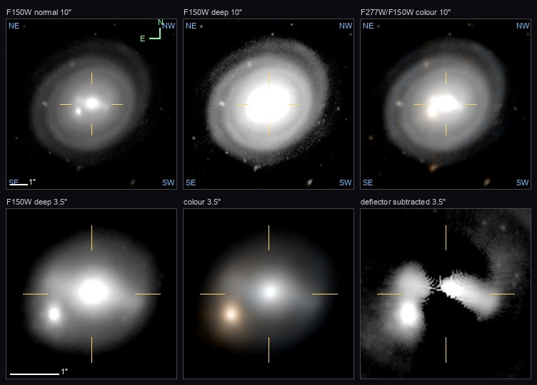{ width="100%" }](img/rank-069-orig.jpg){ target=_blank }
  <figcaption>What the judge saw (blind, footer removed)</figcaption>
</figure>

<figure markdown="span">
  [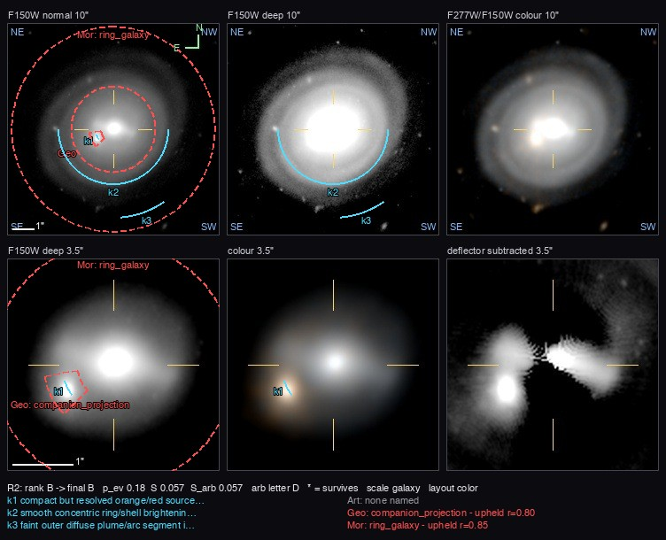{ width="100%" }](img/rank-069-annot.jpg){ target=_blank }
  <figcaption>Advocate evidence (cyan) and critic alternatives coloured by the arbitrator ruling</figcaption>
</figure>

???+ note "Why this grade — advocate, critics, arbitrator"
    **Letter B** (deployed, rule R2) · p_evidence 0.18 · S_arb 0.057 · S 0.057 · scale galaxy

    Letter: letter_rank stands (D rule not met); p_evidence 0.18 >= t_B 0.17 (calibrated at 5% FPR on clean negatives); p_evidence 0.18 < t_A 0.20 (calibrated at 1% FPR on clean negatives).

    **Advocate**

    - criteria: source_contrast 7, low_surface_brightness 5, curvature 4, counter_image 2, arc_morphology 3
    - items (3):
        - k1 — “compact but resolved orange/red source with its own fuzzy envelope, ~0.9" SE of the ticked nucleus; strongly discrepant in colour from the bluish-white deflector in (e) and (c), and the dominant one-sided residual blob in (f) (not mirrored across the core)” (panel e, r 0.86 arcsec, PA 108->126, visible in direct: yes; criteria: source_contrast, low_surface_brightness)
        - k2 — “smooth concentric ring/shell brightening in the envelope, traceable over roughly half a turn from E through S to W at near-constant radius; centre of curvature sits on the ticked nucleus but the feature has the same hue and surface-brightness profile as the host halo” (panel b, r 2.6 arcsec, PA 90->270, visible in direct: yes; criteria: low_surface_brightness, curvature)
        - k3 — “faint outer diffuse plume/arc segment in the deep 10" panel toward the SSW, at larger radius than the inner rings and not confined to a fixed radius” (panel b, r 4.2 arcsec, PA 185->215, visible in direct: yes; criteria: low_surface_brightness)
    - scale galaxy; red neighbours within 10 arcsec 2; BCG-like halo yes; deflector is centre yes; arc radius 2.6 arcsec; arc PA span 90->270; centre-of-curvature offset 0.3 arcsec
    - p_evidence: 0.18
    - notes: “The only high-contrast feature is the orange 0.9" SE knot in (d)/(e) — resolved, with its own envelope and no similar-colour counterpart at PA~297° within 40% of its radius — while the concentric, host-coloured rings and outer plume in (b) look like resonance-ring/shell structure of the host rather than a thin offset arc.”

    **Critics**

    **artifact — no alternative named (nothing in its competence fits)**

    - leaves standing: k1, k2, k3
    - scale_class: galaxy
    - measured: `{"f_panel_artefacts_noted": "the high-frequency ripple/moire and the E-W bowtie lobes in (f) are the expected circular-profile subtraction artefacts and were not counted", "item1_direct_check": "the orange compact source at r~0.85-0.9\", PA~115-120 is present as a distinct bright blob in un-subtracted panels (d) and (e) and as a knot in (a); its bright lobe in (f) coincides with it, so it is on the sky, not a subtraction residual", "item2_direct_check": "the concentric brightenings at r~2.3-2.8\" are seen in all three un-subtracted 10\" panels (a), (b) and (c) at the same radii and are far too broad/bright to be NIRCam PSF Airy rings or 1/f striping", "item3_direct_check": "the SSW diffuse plume at r~4-4.5\", PA~185-215 is smooth and curved, not a straight ray at a NIRCam spike angle and not aligned with any bright star in the 10\" field"}`
    - notes: “No instrumental or reduction alternative fits: none of the three items is a diffraction spike, snowball, stripe, seam or PSF wing, and all three are traceable in the un-subtracted panels (a)/(b)/(d)/(e), so subtraction_residual is inadmissible for every one of them. What is in (f) besides the SE blob (the E-W bowtie and the concentric ripple texture) is exactly the artefact pattern the circular-profile model produces and I have not scored it either way.”
    - ruling: no ruling for this critic

    **geometry — companion_projection:** “The SE blob is a small, centrally-peaked companion/projected galaxy with its own compact nucleus and fuzzy envelope superposed on the host halo - a single round source with no tangential stretch and no counter-image, not a lensed image”

    - location: r 0.6-1.15 arcsec, PA 100->135
    - accounts for: k1; leaves standing: k2, k3; strength r 0.80; coverage a 0.333 (geometric)
    - scale_class: galaxy
    - measured: `{"centre_of_curvature": "undefined for item 1 (no measurable curvature); item 2's curvature centre lies on the ticked nucleus to <0.2\"", "counter_image_search": "at r=0.8-1.0\", pa 285-315 (mirror point, NW of nucleus) panel (d) shows only smooth, monotonic halo light - no knot, no arc, no brightening", "pa_deg_of_item1": 117, "r_arcsec_of_item1": 0.86, "surface_brightness_profile": "item 1 is centrally peaked with an extended low-surface-brightness skirt (galaxy-like), unlike a thin constant-radius arc", "tangential_to_radial_axis_ratio": "~1.0-1.1 in (d): the blob is round, its isophotes are not stretched perpendicular to the radius vector"}`
    - notes: “In (d) and (e) the source at r=0.86", PA~117 is a round, centrally-peaked knot with its own diffuse envelope extending SE beyond the host isophotes, showing no tangential elongation about the ticked nucleus and no counterpart at the mirror position (r~0.9", PA~297), where the halo is perfectly smooth - the configuration of an unrelated superposed galaxy, not of one image of a lensed source. Items 2 and 3 (the concentric ring at r~2.6" and the SSW plume at r~4.2" in panel b) concern the host's own arm/shell structure and are the morphology critic's call.”
    - ruling: upheld, covers k1 — “In panel (d) the SE knot at r~0.86", PA~117 is a round, centrally-peaked source with its own diffuse skirt spilling SE beyond the host isophotes, showing no tangential stretch, and the mirror point at PA~297 in (d) is featureless smooth halo — a superposed companion, and its bright lobe in (f) is simply that same object surviving the circular-profile subtraction.”

    **morphology — ring_galaxy:** “The ticked object is a large, moderately inclined ringed disc galaxy: panel (c) shows a smooth, CLOSED elliptical rim/outer ring at ~2.5-4.5" that surrounds the nucleus through all position angles (not just the E-S-W half cited), of the same whitish-grey hue and the same shallow disc profile as the envelope it sits in, concentric on the ticked nucleus. Item 2 is that resonance ring; item 3 is simply the SSW segment of the same outer disc/ring rim where it fades into the envelope.”

    - location: r 2-4.8 arcsec, PA 0->360
    - accounts for: k2, k3; leaves standing: k1; strength r 0.85; coverage a 0.667 (geometric)
    - scale_class: galaxy
    - measured: `{"angular_closure": "~360 deg traceable in (c), not a broken 180-deg arc", "companion_offset_item1": "0.85\" at PA ~115 in (d)/(e), round FWHM-limited core with its own fuzzy halo, no counter-feature at PA ~295 in the deep (d) panel", "ring_ellipticity_and_PA": "b/a ~0.75, major axis ~NNE-SSW, matching the inner envelope isophotes in (c)", "ring_hue_vs_envelope": "identical grey-white in the two-band composite; no independent redder component", "ring_radius_range_arcsec": "2.5-4.5 (semi-major ~4.3 SSW/NNE, semi-minor ~3.0 E-W)"}`
    - notes: “In (c) the faint rim is continuous around the whole galaxy (visible NE at ~3", NW at ~3.5", SSW at ~4.2"), concentric with the ticked nucleus and with the same isophote ellipticity and position angle as the inner disc - a host ring/outer disc rim, not a broken tangential arc at fixed radius. Item 1 (the orange blob 0.85" at PA~115 in (d)/(e)) is a distinct compact source with its own envelope and no mirrored counter-feature at PA~295; I leave it standing as it belongs to a different structural component than the ring.”
    - ruling: upheld, covers k2, k3 — “Panels (a), (b) and (c) show not one broken arc but a set of smooth, CLOSED concentric rims (NE ~3", NW ~3.5", SSW ~4.2") of the same grey-white hue and shallow disc profile as the envelope, concentric on the ticked nucleus with the same isophote ellipticity and PA — a resonance/outer-disc ring system, of which the SSW plume of item 3 is just the fading major-axis segment.”

    **Arbitrator**

    - surviving items: none (0 of 3)
    - letter_llm: D; scale_class_final: galaxy; needs_human: no
    - rationale: “Nothing lens-like survives. The ticked galaxy is a bright, moderately inclined ringed system: the deep 10" panel (b) and the colour panel (c) show several smooth, essentially closed concentric rims between ~2.3" and ~4.5" that share the host's hue, ellipticity and position angle and are centred on the ticked nucleus — the signature of resonance rings/shells, not of a thin, broken, offset tangential arc (an Einstein ring would be thinner than its radius, asymmetric in surface brightness, and would not repeat at three different radii with the host's own isophote shape). The scorer's item 3 (SSW at r~4.2") is just the major-axis segment of the outermost of those rims where it fades into the envelope, so morphology's ring_galaxy alternative covers items 2 and 3. The only high-contrast discrepant feature, the orange blob 0.85" SE at PA~115 in (d)/(e), is round and centrally peaked with its own fuzzy envelope, has an axis ratio of ~1 rather than tangential elongation about the nucleus, and has no counterpart at the mirror position PA~297 where (d) shows perfectly smooth halo light; its lobe in (f) is the same real object, not a subtraction artefact, but it is a projected/interacting companion, so geometry's companion_projection covers item 1. The artifact critic named no alternative and correctly noted that the E-W bowtie and high-frequency ripple in (f) are the expected circular-profile artefacts, which were not counted either way. With every located item accounted for by an upheld non-lens explanation, the grade is D; the configuration is unambiguous enough at NIRCam resolution that no further review is needed.”

    **Score**

    - S = p_ev x prod(1 - r_i a_i) = 0.18 x (1 - 0.80x0.333) x (1 - 0.85x0.667) = 0.057
        - terms: geometry companion_projection r 0.80 a 0.333; morphology ring_galaxy r 0.85 a 0.667
    - S_arb = p_ev x prod_{upheld/partial}(1 - r_i a_i') = 0.18 x (1 - 0.80x0.333) x (1 - 0.85x0.667) = 0.057
        - terms: geometry companion_projection r 0.80 a 0.333 (upheld); morphology ring_galaxy r 0.85 a 0.667 (upheld)
    - stored grade_pred (on S): C — S 0.057 < t_B 0.17 (calibrated at 5% FPR on clean negatives); not D: 3 item(s) located; no named critic covers every item at r >= 0.80
    - stored letter_arb (on S_arb): C; letter_source: opus5_api_calibrated
    - deploy rule R2: letter_rank (advocate only, on p_evidence) = B — p_evidence 0.18 >= t_B 0.17 (calibrated at 5% FPR on clean negatives); p_evidence 0.18 < t_A 0.20 (calibrated at 1% FPR on clean negatives)
    - deploy rule R2: letter_final = B — letter_rank stands (D rule not met); p_evidence 0.18 >= t_B 0.17 (calibrated at 5% FPR on clean negatives); p_evidence 0.18 < t_A 0.20 (calibrated at 1% FPR on clean negatives)
    - veto: none (letter_final == letter_rank)

---

## Rank 70: J17174762+4246955 {#rank-70}

| Original grade | Passes | Inspector conf. | Pipeline θ_E |
|:--:|:--:|:--:|:--:|
| **U** | — | 25 | 0.66″ |

| New (final) | Rank letter | p_ev | S_arb | Demoted by | Arb. letter | Needs human |
|:--:|:--:|--:|--:|:--|:--:|:--:|
| **C** | C | 0.12 | 0.120 | — | — | no |

<small>pipeline discovery status `new` · scale class `galaxy`</small>

<figure markdown="span">
  [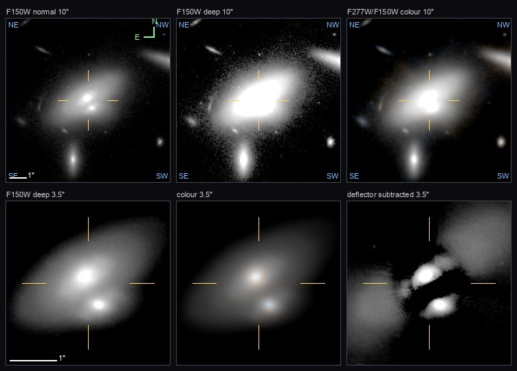{ width="100%" }](img/rank-070-orig.jpg){ target=_blank }
  <figcaption>What the judge saw (blind, footer removed)</figcaption>
</figure>

<figure markdown="span">
  [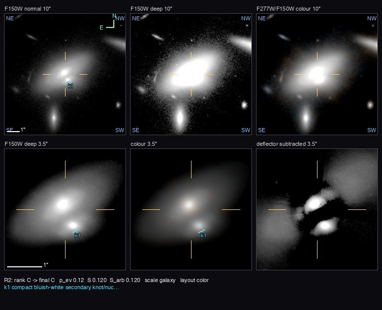{ width="100%" }](img/rank-070-annot.jpg){ target=_blank }
  <figcaption>Advocate evidence (cyan) and critic alternatives coloured by the arbitrator ruling</figcaption>
</figure>

???+ note "Why this grade — advocate, critics, arbitrator"
    **Letter C** (deployed, rule R2) · p_evidence 0.12 · S_arb 0.12 · S 0.12 · scale galaxy

    Letter: letter_rank stands (D rule not met); p_evidence 0.12 < t_B 0.17 (calibrated at 5% FPR on clean negatives); not D: 1 item(s) located; no named critic covers every item at r >= 0.80.

    **Advocate**

    - criteria: source_contrast 6, low_surface_brightness 3, curvature 1, counter_image 1, arc_morphology 1
    - items (1):
        - k1 — “compact bluish-white secondary knot/nucleus embedded in the deflector's envelope, ~0.7" SSW of the ticked core; clearly bluer than the orange core in (e) and separately visible as an isolated bright residual south of the core in (f)” (panel e, r 0.7 arcsec, PA 198->214, visible in direct: yes; criteria: source_contrast, low_surface_brightness)
    - scale galaxy; red neighbours within 10 arcsec 2; BCG-like halo yes; deflector is centre yes
    - p_evidence: 0.12
    - notes: “Only one located feature: a compact blue blob 0.7" SSW of the orange core (panels d/e/f); a deliberate search at the mirror position (PA~25°, r 0.5-1.0") in (d), (e) and (f) shows no matching knot, and the 10" panels (a,b) show no tangential arc at any radius out to ~5" – the two nuclei instead share one smooth common envelope, so the knot's non-lens (double-nucleus/merger) reading is wide open.”

    **Critics**

    - not called (p_evidence 0.12 < tau0 0.15)

    **Arbitrator**

    - no arbitrator record (not called)

    **Score**

    - S = p_ev = 0.12 (no critic term entered the product)
    - S_arb = p_ev = 0.12 (no critic term entered the product)
    - stored grade_pred (on S): C — S 0.12 < t_B 0.17 (calibrated at 5% FPR on clean negatives); not D: 1 item(s) located; no named critic covers every item at r >= 0.80
    - stored letter_arb (on S_arb): C; letter_source: opus5_api_calibrated
    - deploy rule R2: letter_rank (advocate only, on p_evidence) = C — p_evidence 0.12 < t_B 0.17 (calibrated at 5% FPR on clean negatives); not D: 1 item(s) located; no named critic covers every item at r >= 0.80
    - deploy rule R2: letter_final = C — letter_rank stands (D rule not met); p_evidence 0.12 < t_B 0.17 (calibrated at 5% FPR on clean negatives); not D: 1 item(s) located; no named critic covers every item at r >= 0.80
    - veto: none (letter_final == letter_rank)

---

## Rank 71: J12391133+1822895 {#rank-71}

| Original grade | Passes | Inspector conf. | Pipeline θ_E |
|:--:|:--:|:--:|:--:|
| **U** | — | 25 | 1.66″ |

| New (final) | Rank letter | p_ev | S_arb | Demoted by | Arb. letter | Needs human |
|:--:|:--:|--:|--:|:--|:--:|:--:|
| **C** | C | 0.12 | 0.120 | — | — | no |

<small>pipeline discovery status `new` · scale class `galaxy`</small>

<figure markdown="span">
  [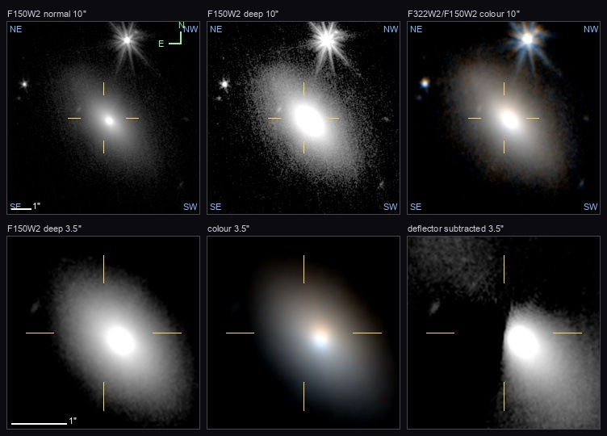{ width="100%" }](img/rank-071-orig.jpg){ target=_blank }
  <figcaption>What the judge saw (blind, footer removed)</figcaption>
</figure>

<figure markdown="span">
  [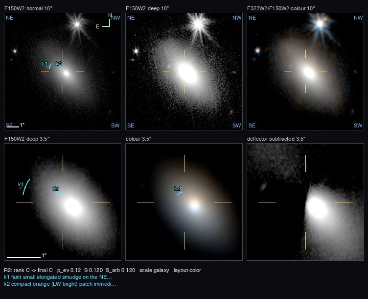{ width="100%" }](img/rank-071-annot.jpg){ target=_blank }
  <figcaption>Advocate evidence (cyan) and critic alternatives coloured by the arbitrator ruling</figcaption>
</figure>

???+ note "Why this grade — advocate, critics, arbitrator"
    **Letter C** (deployed, rule R2) · p_evidence 0.12 · S_arb 0.12 · S 0.12 · scale galaxy

    Letter: letter_rank stands (D rule not met); p_evidence 0.12 < t_B 0.17 (calibrated at 5% FPR on clean negatives); not D: 2 item(s) located; no named critic covers every item at r >= 0.80.

    **Advocate**

    - criteria: source_contrast 4, low_surface_brightness 4, curvature 1, counter_image 1, arc_morphology 1
    - items (2):
        - k1 — “faint small elongated smudge on the NE flank, clearly separated from the halo in the deep zoom and still present as a one-sided patch in the residual; no tangential elongation about the deflector and no mirrored feature at PA~245 deg at the same radius” (panel d, r 1.2 arcsec, PA 55->80, visible in direct: yes; criteria: source_contrast, low_surface_brightness)
        - k2 — “compact orange (LW-bright) patch immediately N-NE of the saturated white nucleus in the colour zoom, offset ~0.3"; colour-distinct from the tan envelope but sits on the bulge/possible dust lane and has no comparable knot on the S-SW side” (panel e, r 0.3 arcsec, PA 10->45, visible in direct: yes; criteria: source_contrast)
    - scale galaxy; red neighbours within 10 arcsec 1; BCG-like halo yes; deflector is centre no
    - p_evidence: 0.12
    - notes: “Deep panels (b)/(d) show only a smooth, strongly elongated NW-SE envelope with a bright off-centre nucleus (the bright residual and diffuse SW lobe in (f) are the expected dipole/butterfly of a circular model on an inclined, off-centre galaxy and are not counted); the only offset features are the faint 1.2" ENE smudge and the 0.3" orange nuclear patch, neither of which is tangentially elongated or has a counterpart within 40% of its radius on the opposite side, and no arc is traceable anywhere out to ~5" in the 10" row.”

    **Critics**

    - not called (p_evidence 0.12 < tau0 0.15)

    **Arbitrator**

    - no arbitrator record (not called)

    **Score**

    - S = p_ev = 0.12 (no critic term entered the product)
    - S_arb = p_ev = 0.12 (no critic term entered the product)
    - stored grade_pred (on S): C — S 0.12 < t_B 0.17 (calibrated at 5% FPR on clean negatives); not D: 2 item(s) located; no named critic covers every item at r >= 0.80
    - stored letter_arb (on S_arb): C; letter_source: opus5_api_calibrated
    - deploy rule R2: letter_rank (advocate only, on p_evidence) = C — p_evidence 0.12 < t_B 0.17 (calibrated at 5% FPR on clean negatives); not D: 2 item(s) located; no named critic covers every item at r >= 0.80
    - deploy rule R2: letter_final = C — letter_rank stands (D rule not met); p_evidence 0.12 < t_B 0.17 (calibrated at 5% FPR on clean negatives); not D: 2 item(s) located; no named critic covers every item at r >= 0.80
    - veto: none (letter_final == letter_rank)

---

## Rank 72: J21007480+1455269 {#rank-72}

| Original grade | Passes | Inspector conf. | Pipeline θ_E |
|:--:|:--:|:--:|:--:|
| **U** | — | 25 | 1.31″ |

| New (final) | Rank letter | p_ev | S_arb | Demoted by | Arb. letter | Needs human |
|:--:|:--:|--:|--:|:--|:--:|:--:|
| **D** | B | 0.22 | 0.023 | merger (Mor) | D | no |

<small>pipeline discovery status `new` · scale class `none`</small>

<figure markdown="span">
  [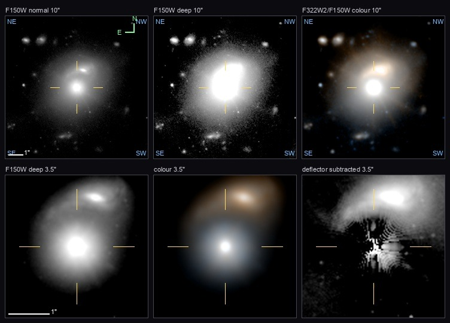{ width="100%" }](img/rank-072-orig.jpg){ target=_blank }
  <figcaption>What the judge saw (blind, footer removed)</figcaption>
</figure>

<figure markdown="span">
  [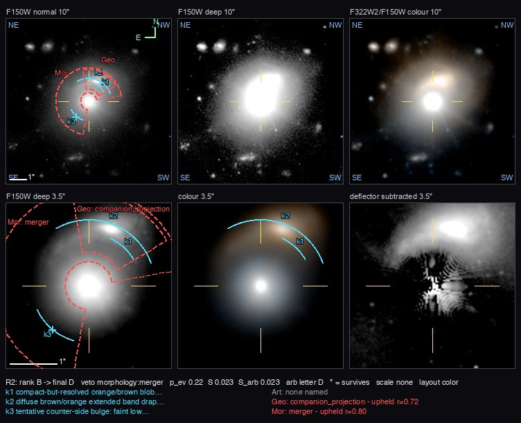{ width="100%" }](img/rank-072-annot.jpg){ target=_blank }
  <figcaption>Advocate evidence (cyan) and critic alternatives coloured by the arbitrator ruling</figcaption>
</figure>

???+ note "Why this grade — advocate, critics, arbitrator"
    **Letter D** (deployed, rule R2) · p_evidence 0.22 · S_arb 0.023 · S 0.023 · scale none

    Letter: D rule: morphology (merger) covers every item (a = 1) at r 0.80 >= 0.80 (upheld).

    **Advocate**

    - criteria: source_contrast 7, low_surface_brightness 6, curvature 3, counter_image 2, arc_morphology 3
    - items (3):
        - k1 — “compact-but-resolved orange/brown blob NW of the ticked core, clearly redder than the bluish-white deflector in (e) and (c), surviving as a strong one-sided offset residual in (f)” (panel e, r 1.1 arcsec, PA 300->335, visible in direct: yes; criteria: source_contrast, low_surface_brightness)
        - k2 — “diffuse brown/orange extended band draped across the north side of the deflector, broader than the knot, concave toward the core in the colour zoom; also traceable as the upper lobe of the envelope in the deep zoom (d)” (panel e, r 1.4 arcsec, PA 290->30, visible in direct: yes; criteria: source_contrast, low_surface_brightness, curvature)
        - k3 — “tentative counter-side bulge: faint low-surface-brightness extension of the envelope SE of the core at a radius comparable to item 1, no colour contrast measurable there” (panel d, r 1.2 arcsec, PA 115->165, visible in direct: yes; criteria: low_surface_brightness, counter_image)
    - scale galaxy; red neighbours within 10 arcsec 3; BCG-like halo yes; deflector is centre yes; arc radius 1.3 arcsec; arc PA span 290->30; counter-image at r 1.2 arcsec PA 140; centre-of-curvature offset 0.6 arcsec
    - p_evidence: 0.22
    - notes: “The only strong feature is the orange NW blob at ~1.1" (bright in a, b, c, d, e and left as a one-sided residual in f), but it sits inside a common diffuse envelope that bridges it to the white core in (d), the north-side brown band's curvature centre is only loosely constrained (~0.6" off the tick), and the SE side shows at best a smooth envelope bulge rather than a matching red counter-image.”

    **Critics**

    **artifact — no alternative named (nothing in its competence fits)**

    - leaves standing: k1, k2, k3
    - scale_class: galaxy
    - measured: `{"detector_pathologies": "no snowball rings, no cosmic-ray tracks, no 1/f horizontal striping, no mosaic seam or coverage edge within the 10\" field", "diffraction_spikes_detected": "none - no straight rays at fixed angles from the ticked core or from the NW blob in (a) or (b)", "items_present_in_unsubtracted_panels": "1,2,3 all traceable in (a)/(b)/(d)/(e); item 1 is a distinct compact source in the normal-stretch 10\" panel (a) at r~1.1\", PA~315", "point_source_test_on_NW_blob": "resolved and elongated (~0.5\" x 0.3\") in (d), not a PSF core, so its light is not an instrumental wing", "subtraction_ringing_extent": "concentric positive/negative ripples in (f) confined to r < ~0.7\" of the stamp centre, i.e. the documented circular-profile artefact, and they do not coincide with items 1-3"}`
    - notes: “The NW knot (item 1) and the northern diffuse band (item 2) are both present in the un-subtracted panels (a), (b), (c), (d) and (e), so neither can be a subtraction residual; the only residual-only structure in (f) is the concentric ripple pattern within ~0.7" of the core, which is the stated circular-profile artefact and is not one of the items. No spikes, snowball, persistence, striping or seam is visible, and the NW source is resolved rather than a point source, so PSF wings do not explain item 2 either - nothing in my competence refutes items 1-3.”
    - ruling: no ruling for this critic

    **geometry — companion_projection:** “A small distinct galaxy ~1.1-1.2" NNW of the ticked core: in the deep zoom (d) it shows its own compact, peaked nucleus embedded in a smooth ~2:1 elliptical/disky envelope, and the 'diffuse brown band' to its north/east is simply that companion's outer light blended with the host's envelope - not a thin arc at fixed radius and with no matching counter-image.”

    - location: r 0.7-1.9 arcsec, PA 300->10
    - accounts for: k1, k2; leaves standing: k3; strength r 0.72; coverage a 0.667 (geometric)
    - scale_class: galaxy
    - measured: `{"counter_image_test": "item 3 (r~1.2\", PA 115-165) is a structureless envelope bulge with no compact peak; surface-brightness profile incompatible with item 1 as two images of one source", "curvature": "no measurable tangential curvature about the tick centre; isophotes of the NW object close on themselves (own centre of curvature at its own nucleus, ~1.15\" from deflector)", "item1_internal_structure": "clearly peaked nucleus + smooth envelope, axis ratio ~0.5, major axis PA~65, length ~0.9\" x width ~0.45\" (width/radius ~0.4, not thin)", "item1_offset_from_deflector_arcsec": "1.15 at PA~340 (measured tick-centre to the compact peak in panel d)", "item2_geometry": "broad north-side band, width ~0.8-1.0\" at r~1.4\" (width comparable to radius), continuous with the companion's outer isophotes in (d), not a constant-radius thin band", "widest_view_scale": "single dominant galaxy plus one close companion in a ~7\" diffuse envelope; no second red member of comparable brightness -> galaxy scale"}`
    - notes: “In panel (d) the NW feature at r~1.15", PA~340 has a bright point-like nucleus at the centre of a smooth 2:1 ellipse - an arc does not carry a nucleus, and its isophotes curve about its own centre, not about the tick centre; item 2 is just the outer light of that same object smeared across the north side (width ~0.9" at r~1.4"). The only candidate counter-side feature, item 3, is featureless envelope light with no compact peak, so items 1 and 3 are not consistent as two images of one source.”
    - ruling: upheld, covers k1, k2 — “In panel (d) the NW feature at r~1.1" carries its own compact bright nucleus inside a smooth ~2:1 ellipse whose isophotes close about that nucleus (major axis ~ENE-WSW, not tangential), and the 'brown band' north of the core is simply that object's outer light fading monotonically outward, ~0.9" wide at r~1.4" — a width comparable to its radius, not a thin fixed-radius arc.”

    **morphology — merger:** “The ticked galaxy has a close nucleated companion ~1.1" NW: in the deep zoom (d) that 'blob' is a resolved little galaxy with its own compact bright nucleus and an elongated disk/envelope (major axis running roughly ENE-WSW, ~1.0" x 0.4"), not a tangential arc. The brown/orange band north of the core is that companion's own outer envelope blending into the common envelope of the interacting pair, and the SE 'counter-bulge' is simply the opposite end of the host's NW-SE elongated (interaction-distorted) envelope.”

    - location: r 0.5-2 arcsec, PA 280->170
    - accounts for: k1, k2, k3; leaves standing: none; strength r 0.80; coverage a 1.00 (geometric)
    - scale_class: galaxy
    - measured: `{"companion_apparent_axes_arcsec": "~1.0 x 0.4, PA of major axis ~60-70 (not tangential to the deflector; tangential would be ~55/235 only by coincidence, and the core is a point source, not an extended constant-radius ridge)", "companion_nucleus_offset_arcsec": 1.1, "companion_nucleus_pa_deg": 325, "item2_band_radius_range_arcsec": "0.8-2.0 - surface brightness falls monotonically outward from the companion nucleus, i.e. an envelope, not a fixed-radius arc", "item3_extension": "low-SB isophotal bulge at r 1.0-1.8\", PA 115-165, contiguous with the host's own outer isophotes; no independent knot or thin ridge"}`
    - notes: “In (d) the NW feature at r~1.1", PA~325 has a stellar nucleus and a resolved elongated disk of its own - a companion galaxy caught in/near merger, whose halo is the 'brown band' of item 2 at PA 290->30; in (e) the same object's colour gradient is centred on that nucleus, not on the deflector. The SE feature (item 3) is continuous with the host's outer isophotes and grows in radius outward rather than sitting at fixed radius, so it is envelope distortion of the pair, not a counter-image.”
    - ruling: upheld, covers k1, k2, k3 — “The same nucleated NW object plus the shared NW-SE elongated envelope in (d)/(e) explains items 1 and 2, and item 3 is that envelope's opposite lobe — a structureless isophotal bulge contiguous with the host's outer light at PA 115-165 with no compact peak and no radius-fixed ridge, i.e. interaction-distorted envelope, not a counter-image.”

    **Arbitrator**

    - surviving items: none (0 of 3)
    - letter_llm: D; scale_class_final: none; needs_human: no
    - rationale: “The artifact critic offered no alternative and confirmed all three items are real sky features present in the un-subtracted panels (a), (b), (d), (e) — so nothing here is a subtraction ripple; the ripples in (f) are confined to r<0.7" of the stamp centre and are the documented circular-profile artefact, which I disregard entirely. What remains is a morphology question, and at 0.031"/px the morphology is decisive: in the deep zoom (d) the NW 'blob' at r~1.1", PA~325-340 is a resolved little galaxy with a stellar nucleus at the centre of a ~1.0"x0.4" elongated envelope whose major axis runs ENE-WSW and whose isophotes curve about that nucleus, not about the yellow tick centre — an Einstein image does not carry its own point-like nucleus, and a genuine arc at this resolution would show tangential curvature and a width well under its radius. The orange band draped across the north in (e) is that companion's outer light blending into the common envelope, its surface brightness falling monotonically outward from the companion's nucleus rather than peaking at a fixed radius, and the SE 'counter-bulge' (item 3) is featureless low-SB light continuous with the host's own outer isophotes on the opposite side of the same NW-SE elongated common envelope — the classic signature of a close, interacting pair, not a matched pair of images. With both the companion-projection and merger alternatives upheld and covering all three items, and no thin tangential ridge, no counter-arc of matching surface-brightness profile, and no colour or geometric evidence that survives, nothing is left standing.”

    **Score**

    - S = p_ev x prod(1 - r_i a_i) = 0.22 x (1 - 0.72x0.667) x (1 - 0.80x1.00) = 0.023
        - terms: geometry companion_projection r 0.72 a 0.667; morphology merger r 0.80 a 1.00
    - S_arb = p_ev x prod_{upheld/partial}(1 - r_i a_i') = 0.22 x (1 - 0.72x0.667) x (1 - 0.80x1.00) = 0.023
        - terms: geometry companion_projection r 0.72 a 0.667 (upheld); morphology merger r 0.80 a 1.00 (upheld)
    - stored grade_pred (on S): D — S 0.023 < t_B 0.17 (calibrated at 5% FPR on clean negatives) and morphology (merger) covers every item at r 0.80 >= 0.80
    - stored letter_arb (on S_arb): D; letter_source: opus5_api_calibrated
    - deploy rule R2: letter_rank (advocate only, on p_evidence) = B — p_evidence 0.22 >= t_A 0.20 (calibrated at 1% FPR on clean negatives) but A is blocked: only 0 of 3 configuration criteria >= 6; p_evidence 0.22 >= t_B 0.17 (calibrated at 5% FPR on clean negatives)
    - deploy rule R2: letter_final = D — D rule: morphology (merger) covers every item (a = 1) at r 0.80 >= 0.80 (upheld)
    - veto: morphology:merger

---

## Rank 73: J8575205-2143155 {#rank-73}

| Original grade | Passes | Inspector conf. | Pipeline θ_E |
|:--:|:--:|:--:|:--:|
| **U** | — | 25 | 1.10″ |

| New (final) | Rank letter | p_ev | S_arb | Demoted by | Arb. letter | Needs human |
|:--:|:--:|--:|--:|:--|:--:|:--:|
| **C** | C | 0.12 | 0.120 | — | — | no |

<small>pipeline discovery status `new` · scale class `galaxy`</small>

<figure markdown="span">
  [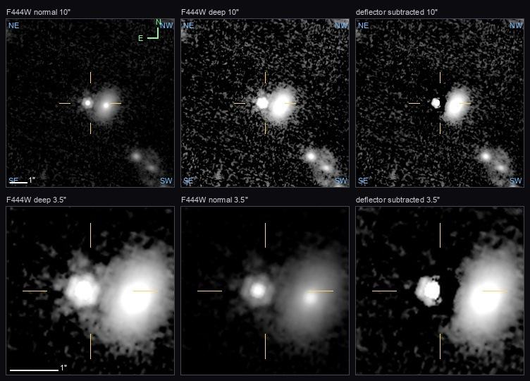{ width="100%" }](img/rank-073-orig.jpg){ target=_blank }
  <figcaption>What the judge saw (blind, footer removed)</figcaption>
</figure>

<figure markdown="span">
  [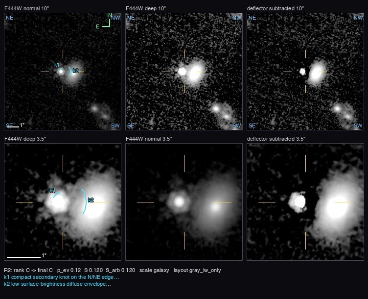{ width="100%" }](img/rank-073-annot.jpg){ target=_blank }
  <figcaption>Advocate evidence (cyan) and critic alternatives coloured by the arbitrator ruling</figcaption>
</figure>

???+ note "Why this grade — advocate, critics, arbitrator"
    **Letter C** (deployed, rule R2) · p_evidence 0.12 · S_arb 0.12 · S 0.12 · scale galaxy

    Letter: letter_rank stands (D rule not met); p_evidence 0.12 < t_B 0.17 (calibrated at 5% FPR on clean negatives); not D: 2 item(s) located; no named critic covers every item at r >= 0.80.

    **Advocate**

    - criteria: source_contrast 4, low_surface_brightness 3, curvature 1, counter_image 1, arc_morphology 1
    - items (2):
        - k1 — “compact secondary knot on the N/NE edge of the ticked object (~0.3" from its peak), resolved as a distinct clump on the bright core in the deep zoom and giving the object a lumpy, non-elliptical profile unlike the smooth neighbour” (panel d, r 0.3 arcsec, PA 15->65, visible in direct: yes; criteria: source_contrast, low_surface_brightness)
        - k2 — “low-surface-brightness diffuse envelope spanning the ticked object and the bright smooth galaxy 1.13" away at PA~265, with a faint plume extending north of the pair; extended, not confined to a fixed radius” (panel d, r 0.7 arcsec, PA 240->305, visible in direct: yes; criteria: low_surface_brightness)
    - scale galaxy; red neighbours within 10 arcsec 2; BCG-like halo no; deflector is centre no
    - p_evidence: 0.12
    - notes: “The ticked source is a compact, clumpy blob sitting 1.13" east (PA~265 back to it) of a smooth bright galaxy; the deep panels (b),(d) show only a knot on its NE edge and a shared diffuse envelope/plume, with no tangential feature at roughly constant radius anywhere from 0.3" out to ~5" (the SW galaxy at r~4.1", PA~225, is a plain neighbour), and the clumpy dipole-plus-ring pattern at the core of (f) is exactly the artefact the circular subtraction produces on a companion-blended, off-centre deflector, so it is not counted.”

    **Critics**

    - not called (p_evidence 0.12 < tau0 0.15)

    **Arbitrator**

    - no arbitrator record (not called)

    **Score**

    - S = p_ev = 0.12 (no critic term entered the product)
    - S_arb = p_ev = 0.12 (no critic term entered the product)
    - stored grade_pred (on S): C — S 0.12 < t_B 0.17 (calibrated at 5% FPR on clean negatives); not D: 2 item(s) located; no named critic covers every item at r >= 0.80
    - stored letter_arb (on S_arb): C; letter_source: opus5_api_calibrated
    - deploy rule R2: letter_rank (advocate only, on p_evidence) = C — p_evidence 0.12 < t_B 0.17 (calibrated at 5% FPR on clean negatives); not D: 2 item(s) located; no named critic covers every item at r >= 0.80
    - deploy rule R2: letter_final = C — letter_rank stands (D rule not met); p_evidence 0.12 < t_B 0.17 (calibrated at 5% FPR on clean negatives); not D: 2 item(s) located; no named critic covers every item at r >= 0.80
    - veto: none (letter_final == letter_rank)

---

## Rank 74: J16193787+1252943 {#rank-74}

| Original grade | Passes | Inspector conf. | Pipeline θ_E |
|:--:|:--:|:--:|:--:|
| **U** | — | 25 | 1.55″ |

| New (final) | Rank letter | p_ev | S_arb | Demoted by | Arb. letter | Needs human |
|:--:|:--:|--:|--:|:--|:--:|:--:|
| **C** | C | 0.15 | 0.028 | — | D | no |

<small>pipeline discovery status `new` · scale class `galaxy`</small>

<figure markdown="span">
  [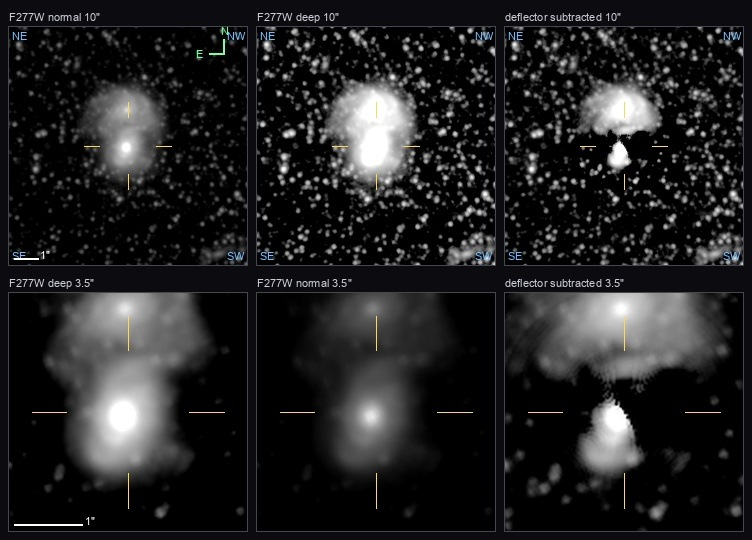{ width="100%" }](img/rank-074-orig.jpg){ target=_blank }
  <figcaption>What the judge saw (blind, footer removed)</figcaption>
</figure>

<figure markdown="span">
  [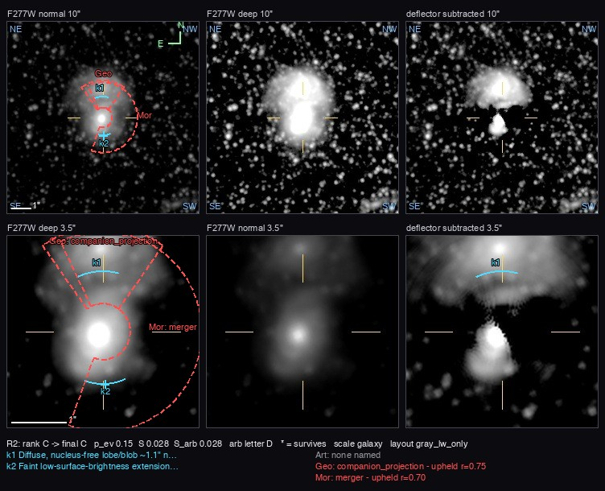{ width="100%" }](img/rank-074-annot.jpg){ target=_blank }
  <figcaption>Advocate evidence (cyan) and critic alternatives coloured by the arbitrator ruling</figcaption>
</figure>

???+ note "Why this grade — advocate, critics, arbitrator"
    **Letter C** (deployed, rule R2) · p_evidence 0.15 · S_arb 0.028 · S 0.028 · scale galaxy

    Letter: letter_rank stands (D rule not met); p_evidence 0.15 < t_B 0.17 (calibrated at 5% FPR on clean negatives); not D: 2 item(s) located; no named critic covers every item at r >= 0.80.

    **Advocate**

    - criteria: source_contrast 4, low_surface_brightness 6, curvature 2, counter_image 2, arc_morphology 2
    - items (2):
        - k1 — “Diffuse, nucleus-free lobe/blob ~1.1" north of the ticked core: an extended patch of light with a much shallower profile than the compact core, traceable in (a), (b) and the zoom (d)/(e), and standing out as the brightest offset positive residual in (f) after the circular profile is removed” (panel f, r 1.1 arcsec, PA 345->25, visible in direct: yes; criteria: source_contrast, low_surface_brightness)
        - k2 — “Faint low-surface-brightness extension / small clump on the opposite (south-southeast) side of the core at comparable radius in the deep zoom, tested as a possible counter-image to item 1 - it is fainter and merges continuously with the common envelope rather than standing alone” (panel d, r 0.95 arcsec, PA 160->205, visible in direct: yes; criteria: low_surface_brightness, counter_image)
    - scale galaxy; red neighbours within 10 arcsec 1; BCG-like halo yes; deflector is centre no; counter-image at r 0.95 arcsec PA 182
    - p_evidence: 0.15
    - notes: “The only offset structure is a fat, diffuse north lobe ~1.1" from the ticked core sharing a common envelope with it (peanut shape in (a)/(b), bright one-sided positive in (f)); it shows no tangential elongation at fixed radius and no convincing mirrored counter-image, so the located set is consistent with a close pair/merger and only weakly with a knot-plus-counterimage configuration - the critics should test the southern extension in (d) and whether the north lobe has its own nucleus.”

    **Critics**

    **artifact — no alternative named (nothing in its competence fits)**

    - leaves standing: k1, k2
    - scale_class: galaxy
    - measured: `{"artefact_scan": "no snowball cores, no persistence blobs, no 1/f horizontal striping, no mosaic seam or coverage edge anywhere in the 10\" panels; background grain is uniform", "f_panel_artefacts_seen": "concentric ripple rings and the dark negative band immediately N/S of the core in (c)/(f) are the circular-profile subtraction signature - not counted as items and not usable against the two located features", "north_lobe_direct_visibility": "present in (a), (b), (d) and (e) at r~1.0-1.2\", PA ~350-20 deg, with a resolved ~0.6\" extended profile - not a straight ray, so not a spike and not a subtraction product", "spike_test": "no 6-fold straight radial rays from the ticked core or any neighbour in (a)/(b); no linear feature at fixed PA crossing the 10\" field"}`
    - notes: “Both located features are traceable in the un-subtracted panels ((a)/(b) at 10" and (d)/(e) at 3.5"), so neither can be a subtraction residual; the ripples and the black band flanking the core in (f) are the known circular-model artefacts and I do not cite them. I find no diffraction spike, snowball, persistence, striping, seam or bright-neighbour PSF wing at r~0.9-1.2" in any direction, so no instrumental alternative in my competence covers items 1 or 2.”
    - ruling: no ruling for this critic

    **geometry — companion_projection:** “A second light concentration ~1.1" north of the ticked core sharing a common envelope with it - a companion/second nucleus in a close pair, radially aligned with the deflector, not a tangential arc; the SSE 'counter-image' is just the opposite side of that common envelope.”

    - location: r 0.5-1.9 arcsec, PA 325->35
    - accounts for: k1, k2; leaves standing: none; strength r 0.75; coverage a 0.50 (geometric)
    - scale_class: galaxy
    - measured: `{"axis_ratio_tangential_over_radial": 0.7, "counter_image_at_compatible_radius": "no: item 2 at r~0.95, PA 160-205 is a smooth envelope gradient, peak surface brightness far below the north lobe and with no compact knot", "curvature_about_deflector": "none measurable - lobe edge is convex outward on its own centre, no constant-radius ridge", "north_lobe_pa_deg": "~355-5 (radial, N of core)", "profile_match_between_items": "poor - north lobe saturates in (b) like the core (compact, peaked), SSE feature is flat/diffuse", "r_north_lobe_arcsec": 1.1, "radial_extent_north_lobe_arcsec": "~1.3 (N-S)", "tangential_extent_north_lobe_arcsec": "~0.9 (E-W)"}`
    - notes: “In panel (b) the northern blob saturates to the same white level as the ticked core, i.e. it has its own compact peak, and in (d) a distinct point-like knot sits at its top (~1.3" N, PA~0) inside a diffuse halo - a second nucleus/companion, elongated radially (N-S) rather than tangentially about the deflector. The SSE feature (item 2) in (d)/(e) is a smooth continuation of the shared envelope at PA~180 with no compact structure and no surface-brightness match to item 1, so the pair fails the one-source counter-image test.”
    - ruling: upheld, covers k1, k2 — “The northern light at r~1.1", PA~355 is a roundish blob whose long axis runs N-S (radially toward the ticked core) and which saturates to the same white level as the core in panel (b), i.e. it has its own peak, while the SSE feature in (d) is a smooth envelope gradient with no compact knot and no matching surface brightness.”

    **morphology — merger:** “An interacting/merging pair (or strongly disturbed double-component host): a diffuse northern lobe carrying its own compact nucleus, joined to the ticked core by an unbroken stellar bridge inside a single common envelope, with the usual asymmetric plume on the opposite side - not an arc plus counter-image.”

    - location: r 0.5-1.8 arcsec, PA 160->25
    - accounts for: k1, k2; leaves standing: none; strength r 0.70; coverage a 1.00 (geometric)
    - scale_class: galaxy
    - measured: `{"bridge_test": "surface brightness between core and lobe never drops to sky in (d) or (e); light is continuous from r=0 out to r~1.7\" along PA 355-5", "compact_knot_in_lobe_r_arcsec": "~1.7 at PA ~358 in (d): the lobe has its own point-like nucleus", "envelope_axis": "whole system elongated N-S over ~3.5\" in panel (a), same axis as items 1 and 2", "north_lobe_centroid_r_arcsec": "~1.1 (PA ~355), lobe FWHM ~0.9\" - resolved, roughly round, not thin", "radial_vs_tangential_elongation": "lobe major axis is radial (N-S), tangential/radial axis ratio <1 - no tangential stretching", "south_feature_r_arcsec": "~0.95 at PA 160-205, merges continuously with the same envelope, no distinct edge or curvature"}`
    - notes: “In (d)/(e) the northern light at PA ~355 is not an offset arc: it is a blob whose long axis points radially and which is connected to the ticked core by unbroken emission, and it carries its own compact nucleus at r~1.7" (bright point just north of the N tick). The southern item at r~0.95, PA 160-205, is simply the opposite side of the same common envelope in (a), so both items are explained by one disturbed/merging two-component system rather than by an arc and counter-image at fixed radius.”
    - ruling: upheld, covers k1, k2 — “In (d) and (e) the surface brightness between the ticked core and the northern lobe never falls to sky - an unbroken stellar bridge along PA~0 - and the whole system is elongated N-S over ~3.5" in (a), so both the north lobe and the southern extension belong to one disturbed two-component envelope, not to an arc plus counter-image.”

    **Arbitrator**

    - surviving items: none (0 of 2)
    - letter_llm: D; scale_class_final: galaxy; needs_human: no
    - rationale: “The only offset structure in this field is the fat northern lobe ~1.1" from the ticked core, and every panel argues against a lens: in (a) and (e) the pair reads as a peanut with continuous light from the core out past the north tick, in (b) the lobe saturates to the same level as the core (its own compact nucleus, with a point-like knot at r~1.7", PA~358 in the deep zoom), and its major axis is radial (N-S, tangential/radial axis ratio <1) rather than tangential at fixed radius - no constant-radius ridge, no curvature about the deflector, no thinning. The 'counter-image' at r~0.95", PA 160-205 in (d) is a smooth continuation of the same common envelope with no edge, no knot and a surface brightness far below the north lobe, so it fails the one-source mirror test. The artefact critic correctly finds no spike, snowball, striping or PSF wing, but that leaves the two features standing only as real sky, not as lensed sky; the concentric ripples and the dark N/S band in (c)/(f) are the known circular-model signature and were rightly not cited by anyone. Geometry's companion_projection and morphology's merger are the same physical picture and each accounts for both located items, leaving nothing standing.”

    **Score**

    - S = p_ev x prod(1 - r_i a_i) = 0.15 x (1 - 0.75x0.50) x (1 - 0.70x1.00) = 0.028
        - terms: geometry companion_projection r 0.75 a 0.50; morphology merger r 0.70 a 1.00
    - S_arb = p_ev x prod_{upheld/partial}(1 - r_i a_i') = 0.15 x (1 - 0.75x0.50) x (1 - 0.70x1.00) = 0.028
        - terms: geometry companion_projection r 0.75 a 0.50 (upheld); morphology merger r 0.70 a 1.00 (upheld)
    - stored grade_pred (on S): C — S 0.028 < t_B 0.17 (calibrated at 5% FPR on clean negatives); not D: 2 item(s) located; no named critic covers every item at r >= 0.80
    - stored letter_arb (on S_arb): C; letter_source: opus5_api_calibrated
    - deploy rule R2: letter_rank (advocate only, on p_evidence) = C — p_evidence 0.15 < t_B 0.17 (calibrated at 5% FPR on clean negatives); not D: 2 item(s) located; no named critic covers every item at r >= 0.80
    - deploy rule R2: letter_final = C — letter_rank stands (D rule not met); p_evidence 0.15 < t_B 0.17 (calibrated at 5% FPR on clean negatives); not D: 2 item(s) located; no named critic covers every item at r >= 0.80
    - veto: none (letter_final == letter_rank)

---

## Rank 75: J35084320-3043955 {#rank-75}

| Original grade | Passes | Inspector conf. | Pipeline θ_E |
|:--:|:--:|:--:|:--:|
| **U** | — | 25 | 0.73″ |

| New (final) | Rank letter | p_ev | S_arb | Demoted by | Arb. letter | Needs human |
|:--:|:--:|--:|--:|:--|:--:|:--:|
| **B** | B | 0.20 | 0.017 | — | D | no |

<small>pipeline discovery status `new` · scale class `galaxy`</small>

<figure markdown="span">
  [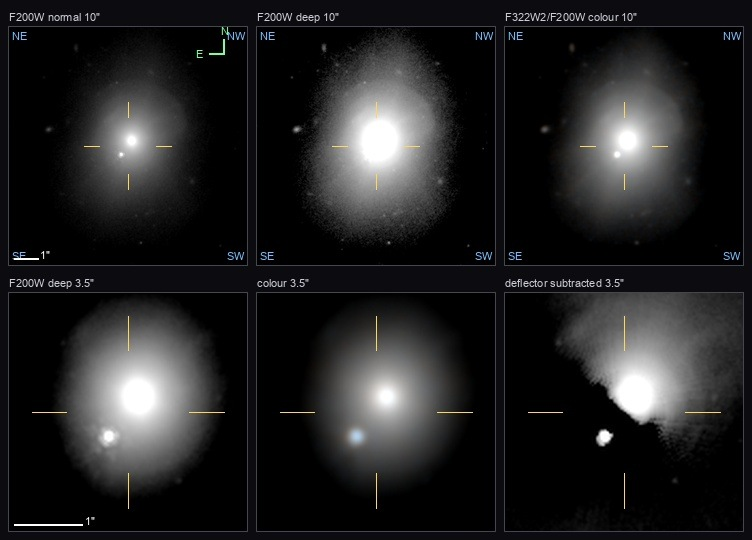{ width="100%" }](img/rank-075-orig.jpg){ target=_blank }
  <figcaption>What the judge saw (blind, footer removed)</figcaption>
</figure>

<figure markdown="span">
  [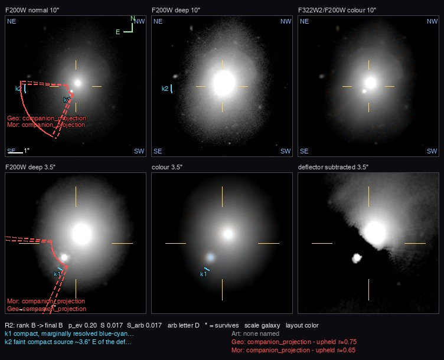{ width="100%" }](img/rank-075-annot.jpg){ target=_blank }
  <figcaption>Advocate evidence (cyan) and critic alternatives coloured by the arbitrator ruling</figcaption>
</figure>

???+ note "Why this grade — advocate, critics, arbitrator"
    **Letter B** (deployed, rule R2) · p_evidence 0.20 · S_arb 0.017 · S 0.017 · scale galaxy

    Letter: letter_rank stands (D rule not met); p_evidence 0.20 >= t_A 0.20 (calibrated at 1% FPR on clean negatives) but A is blocked: only 0 of 3 configuration criteria >= 6; p_evidence 0.20 >= t_B 0.17 (calibrated at 5% FPR on clean negatives).

    **Advocate**

    - criteria: source_contrast 6, low_surface_brightness 3, curvature 0, counter_image 1, arc_morphology 1
    - items (2):
        - k1 — “compact, marginally resolved blue-cyan knot embedded in the deflector's envelope, ~0.75" SSE of the nucleus; clearly bluer than the white/yellow core in the colour panels (c,e) and a distinct compact residual in (f) that is NOT mirrored across the nucleus” (panel e, r 0.75 arcsec, PA 145->155, visible in direct: yes; criteria: source_contrast, low_surface_brightness)
        - k2 — “faint compact source ~3.6" E of the deflector in the 10" panels (a,b); no tangential elongation, no matching partner, listed only for completeness as a possible wide-separation image” (panel b, r 3.6 arcsec, PA 88->98, visible in direct: yes; criteria: source_contrast)
    - scale galaxy; red neighbours within 10 arcsec 1; BCG-like halo yes; deflector is centre yes
    - p_evidence: 0.20
    - notes: “The only real feature is the compact blue knot 0.75" at PA~150 from the bright red core (panels c/e/f); I searched PA~330 at r 0.5-1.0" for its counter-image and the region is buried in the saturated core/halo of the direct panels, so the counter-image test is unresolved rather than failed, and no tangential arc appears anywhere out to ~5" in the deep 10" panel.”

    **Critics**

    **artifact — no alternative named (nothing in its competence fits)**

    - leaves standing: k1, k2
    - scale_class: galaxy
    - measured: `{"diffraction_spikes_detected": "none; no straight rays at fixed angles from the core or from the knot in (a) or (b)", "knot_pa_deg": 150, "knot_separation_arcsec": 0.75, "knot_visible_in_panels": "a, b, c, d, e (direct) and f (subtracted) - not a subtraction-only feature", "residual_pattern_in_f": "bright core lobe plus wedge-shaped positive/negative structure to N/NE = expected circular-profile artefact on an elliptical host; ignored", "snowball_signature": "absent - knot has no bright-core-plus-ring halo, FWHM comparable to other field sources", "striping_or_seams": "no 1/f row/column striping, no mosaic seam or coverage edge inside the 10\" field"}`
    - notes: “The 0.75" SSE knot (PA~150) is a real, marginally resolved source in every un-subtracted panel - it is the small bright blob just SE of the saturated core in (a), (b) and (d) - so it cannot be a subtraction residual, and it shows no snowball halo, no persistence trail and no spike geometry; the faint 3.6" E source in (b) is likewise a point-like sky object, not a cosmic ray or striping feature. The wedge/bowtie structure north of the core in (f) is the known circular-profile artefact and I do not count it.”
    - ruling: overruled — “The artifact critic named no alternative and explicitly leaves items 1 and 2 standing, confirming the SSE knot is a real source in panels (a), (b), (d) rather than a snowball, spike or striping feature.”

    **geometry — companion_projection:** “Two unrelated compact sources projected on/near the smooth elliptical envelope: a small round compact object 0.75" SSE of the nucleus (bluish in the two-band colour zoom) and a separate faint compact source 3.6" E in the 10" field; neither is tangentially elongated, they sit at incompatible radii and neither has a counter-image, so they are chance projections rather than multiple images of one source.”

    - location: r 0.6-3.9 arcsec, PA 85->160
    - accounts for: k1, k2; leaves standing: none; strength r 0.75; coverage a 1.00 (geometric)
    - scale_class: galaxy
    - measured: `{"counter_image_search": "no compact or extended feature at r=0.6-0.9\", PA 310-350 in panel (d) deep stretch; envelope there is smooth", "deflector_isophote_centre_offset_arcsec": "<0.05 (envelope in b and d concentric on the ticked nucleus; no separate mass centre)", "item2_elongation": "unresolved point-like in (b), no arc curvature about the ticked galaxy", "knot_axis_ratio": "~1.0 (round in panel d; FWHM ~0.15\", no measurable tangential extension over the ~24 px a 0.75\" arc would span)", "knot_offset_arcsec": 0.75, "knot_pa_deg": 148, "radius_ratio_item2_over_item1": 4.8}`
    - notes: “In panel (d) the SSE source at 0.75", PA~148 is a round, marginally resolved blob with its own faint halo - no tangential stretching along the local isophote and no counter-arc at the mirror position (PA~328, r~0.75") where the envelope is perfectly smooth. Item 2 at 3.6" E in (b) is an unresolved point at a radius 4.8x larger, so the two cannot be images of one source in any single-deflector configuration; both read as chance projections on a smooth, concentric elliptical envelope.”
    - ruling: upheld, covers k1, k2 — “In panel (d) the 0.75" SSE blob is round (axis ratio ~1.0 over ~24 px) with its own small halo and the envelope at the mirror position PA~330 is perfectly smooth, while the 3.6" E point sits at 4.8x the radius - incompatible with one lensed source.”

    **morphology — companion_projection:** “Two unrelated compact neighbours projected on/near the early-type host's smooth envelope: a small round blue-cyan compact source (dwarf/clump-like knot) 0.75" SSE of the nucleus, and a faint compact galaxy ~3.6-3.8" E in the 10" field; neither is tangentially elongated and neither has a counterpart at the same radius on the opposite side.”

    - location: r 0.6-3.9 arcsec, PA 88->155
    - accounts for: k1, k2; leaves standing: none; strength r 0.65; coverage a 1.00 (geometric)
    - scale_class: galaxy
    - measured: `{"counter_image_test": "no compact or extended feature at r=0.7-0.9\", PA 320-340 in (d) or (e) - envelope there is smooth", "host_structure": "smooth N-S elongated (b/a~0.75) early-type envelope in (c)/(d); no spiral arm, bar, shell edge or tidal tail joining the knot to the nucleus, and no closed ring centred on the nucleus", "knot_apparent_size_arcsec": "~0.15-0.20 FWHM, round (axis ratio ~1.0 in panel d), no tangential elongation", "knot_pa_deg": 150, "knot_separation_arcsec": 0.75, "second_source": "faint compact blob ~3.7\" E (left) of ticks near the NE/E edge of panel (c), no elongation"}`
    - notes: “In panel (d) the SSE source at 0.75" (PA~150) is a round, marginally resolved point-like knot with a small fuzzy halo - it shows no tangential curvature and no arc-like stretching at 0.031"/px, and the envelope at the mirror position (PA~330, same radius) is featureless. The host is a smooth, structureless spheroid/lenticular in (c) and (d) with no arm, shell edge or ring to which the knot could belong, so the natural reading is a projected compact neighbour, as is the faint blob ~3.7" E near the left edge of (c).”
    - ruling: upheld, covers k1, k2 — “The host is a smooth, structureless N-S elongated spheroid in (c)/(d) with no arc, ring, arm or shell, and both flagged sources are unelongated compact projections on that envelope.”

    **Arbitrator**

    - surviving items: none (0 of 2)
    - letter_llm: D; scale_class_final: galaxy; needs_human: no
    - rationale: “The only located items are (1) the compact blue-cyan blob 0.75" SSE of the ticked nucleus, obvious in the normal, deep, colour and zoom panels as a small round knot with a faint halo, and (2) a faint point-like blob ~3.6" E near the left edge of the 10" panels. Both geometry and morphology critics independently show that item 1 is round at 0.031"/px - it would span ~24 px of tangential arc if it were an image at that radius, yet shows no elongation along the local isophote - and that the envelope at the mirror position (PA~330, r~0.75") in the deep zoom (d) is featureless, so no counter-image exists where the deflector's smooth, concentric isophotes demand one. Item 2 lies at 4.8x the radius of item 1 with no curvature about the ticked galaxy, so the pair cannot be multiple images in any single-deflector configuration. The artifact critic offers no competing alternative and merely confirms both sources are real sky objects, and the bright core lobe plus wedge structure north of the core in (f) is the expected circular-profile bowtie artefact, correctly ignored by all reviewers. With the companion_projection alternative accounting for every located item and nothing tangential surviving out to ~5", this is a smooth early-type with a projected compact neighbour, not a lens; the evidence is clean enough that no further review is warranted.”

    **Score**

    - S = p_ev x prod(1 - r_i a_i) = 0.20 x (1 - 0.75x1.00) x (1 - 0.65x1.00) = 0.017
        - terms: geometry companion_projection r 0.75 a 1.00; morphology companion_projection r 0.65 a 1.00
    - S_arb = p_ev x prod_{upheld/partial}(1 - r_i a_i') = 0.20 x (1 - 0.75x1.00) x (1 - 0.65x1.00) = 0.017
        - terms: geometry companion_projection r 0.75 a 1.00 (upheld); morphology companion_projection r 0.65 a 1.00 (upheld)
    - stored grade_pred (on S): C — S 0.017 < t_B 0.17 (calibrated at 5% FPR on clean negatives); not D: 2 item(s) located; no named critic covers every item at r >= 0.80
    - stored letter_arb (on S_arb): C; letter_source: opus5_api_calibrated
    - deploy rule R2: letter_rank (advocate only, on p_evidence) = B — p_evidence 0.20 >= t_A 0.20 (calibrated at 1% FPR on clean negatives) but A is blocked: only 0 of 3 configuration criteria >= 6; p_evidence 0.20 >= t_B 0.17 (calibrated at 5% FPR on clean negatives)
    - deploy rule R2: letter_final = B — letter_rank stands (D rule not met); p_evidence 0.20 >= t_A 0.20 (calibrated at 1% FPR on clean negatives) but A is blocked: only 0 of 3 configuration criteria >= 6; p_evidence 0.20 >= t_B 0.17 (calibrated at 5% FPR on clean negatives)
    - veto: none (letter_final == letter_rank)

---

[:material-arrow-left: Ranks 26–50](ranks-026-050.md){ .md-button }
[:material-view-list: Overview](index.md){ .md-button }
[Ranks 76–100 :material-arrow-right:](ranks-076-100.md){ .md-button }
