# JWST Top-100 regrade: ranks 76–100

Candidates 76–100 by original pipeline rank, each with the composite the judge saw, the
annotated composite and the full grading record. Legend, thresholds and the summary tables are on
the [overview](index.md). Click an image to open it full size.

Pages: [Ranks 1–25](ranks-001-025.md) · [Ranks 26–50](ranks-026-050.md) · [Ranks 51–75](ranks-051-075.md) · **Ranks 76–100**.

---

## Rank 76: J8732838-6207334 {#rank-76}

| Original grade | Passes | Inspector conf. | Pipeline θ_E |
|:--:|:--:|:--:|:--:|
| **U** | — | 25 | 2.50″ |

| New (final) | Rank letter | p_ev | S_arb | Demoted by | Arb. letter | Needs human |
|:--:|:--:|--:|--:|:--|:--:|:--:|
| **D** | B | 0.17 | 0.008 | edge_on_disk (Mor) | D | no |

<small>pipeline discovery status `new` · scale class `galaxy`</small>

<figure markdown="span">
  [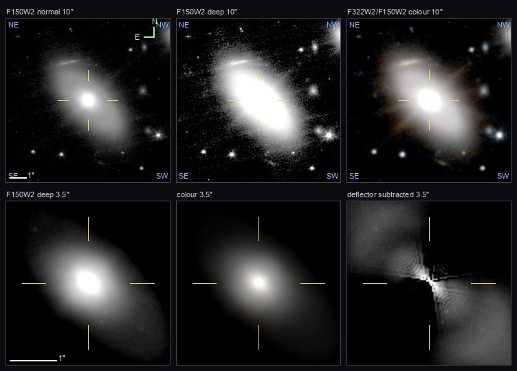{ width="100%" }](img/rank-076-orig.jpg){ target=_blank }
  <figcaption>What the judge saw (blind, footer removed)</figcaption>
</figure>

<figure markdown="span">
  [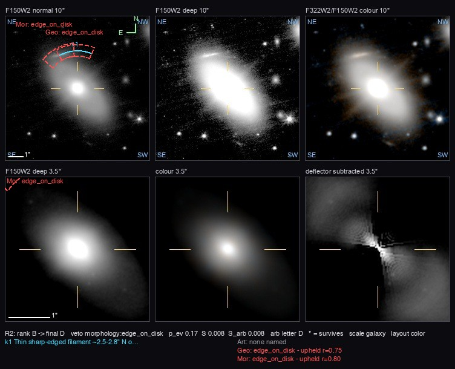{ width="100%" }](img/rank-076-annot.jpg){ target=_blank }
  <figcaption>Advocate evidence (cyan) and critic alternatives coloured by the arbitrator ruling</figcaption>
</figure>

???+ note "Why this grade — advocate, critics, arbitrator"
    **Letter D** (deployed, rule R2) · p_evidence 0.17 · S_arb 0.008 · S 0.008 · scale galaxy

    Letter: D rule: morphology (edge_on_disk) covers every item (a = 1) at r 0.80 >= 0.80 (upheld).

    **Advocate**

    - criteria: source_contrast 5, low_surface_brightness 6, curvature 2, counter_image 1, arc_morphology 3
    - items (1):
        - k1 — “Thin sharp-edged filament ~2.5-2.8" N of the ticked core, ~2.3" long, elongated roughly E-W (i.e. perpendicular to the radius vector, tangential in orientation); clearly seen as a bright needle in (a) and (b) and as a slightly warmer/whiter streak against the orange halo in (c); its SE end clips the NE corner of the 3.5" zoom in (d). It is straight over its whole length - no measurable concavity toward the deflector - so it reads as a needle rather than a curved arc.” (panel a, r 2.6 arcsec, PA 337->29, visible in direct: yes; criteria: source_contrast, low_surface_brightness, arc_morphology)
    - scale group; red neighbours within 10 arcsec 1; BCG-like halo yes; deflector is centre yes; arc radius 2.6 arcsec; arc PA span 337->29
    - p_evidence: 0.17
    - notes: “The only located feature is the thin needle ~2.6" due north of the tick centre (panels a/b/c): it is tangentially oriented at roughly fixed radius but is geometrically straight with no centre of curvature measurable, and I find no counter-feature within 40% of that radius on the southern side, where the deep panels show only smooth NE-SW halo; the inner ~1" is saturated in (b)/(d) and panel (f) shows only the bowtie/ring artefacts expected from a circular profile subtracted from this clearly elliptical galaxy, so it is uninformative about any inner knots.”

    **Critics**

    **artifact — no alternative named (nothing in its competence fits)**

    - leaves standing: k1
    - scale_class: galaxy
    - measured: `{"angle_between_elongation_and_radius_vector_deg": "~85-90 (i.e. not radial)", "item1_elongation_pa_deg": "approx 95-110 (near E-W)", "item1_radius_arcsec": 2.6, "match_to_NIRCam_spike_angles": "no - streak is detached and non-radial from both the ticked core and every field star", "nearest_bright_point_source_along_streak_axis": "none within the 10\" field; streak does not extend to or from any star", "panel_f_content": "only the four-lobed bowtie plus concentric rings expected from the circular 1-D subtraction; no offset tangential feature", "panels_showing_feature": "a, b, c and clipping the NE edge of d (all un-subtracted)"}`
    - notes: “The needle ~2.6" N of the ticked core (PA span ~337->29 in panel a/b) is present in BOTH bands of the colour panel (c) and in the direct deep stretch (b), so it cannot be a cosmic-ray track, snowball, persistence or a single-band detector defect, and it is not a subtraction residual (it never relies on panel f). Its axis is perpendicular to the radius vector and does not extend to or from any bright point source, so it matches no NIRCam diffraction spike or PSF wing; panel (f) shows only the bowtie/ring pattern intrinsic to the circular profile subtraction, which I do not count either way.”
    - ruling: no ruling for this critic

    **geometry — edge_on_disk:** “A straight, thin, sharp-edged needle - an edge-on disc/needle galaxy projected on the host's NE halo - rather than a tangential arc: over its full ~2.3" length it shows no concavity toward the ticked core, and no counter-image exists on the opposite side at the same radius.”

    - location: r 2.2-3 arcsec, PA 337->29
    - accounts for: k1; leaves standing: none; strength r 0.75; coverage a 1.00 (geometric)
    - scale_class: galaxy
    - measured: `{"centre_of_curvature": "not determinable - feature is straight; no curvature centred on the ticked core", "counter_image_search": "none at r = 2.4-2.9\", PA 160-220 deg in panel (b); halo there is smooth", "expected_arc_sagitta_if_tangential_at_r2.6": "0.24\" (~11 px in panel (b)) for a 2.3\" chord; measured deviation from a straight line <= 2-3 px", "profile_match": "needle is uniform-brightness with sharp edges, unlike any other feature in the halo", "streak_centroid_offset_from_tick_arcsec": "~1.2\" E, ~2.4\" N -> r = 2.6\", PA = 26 deg", "streak_length_arcsec": "~2.2-2.4\" (measured in panel (b), ~105 px at 0.021\"/px)", "streak_thickness_arcsec": "~0.15-0.2\" (aspect ratio >10:1)"}`
    - notes: “In panel (b) the bright filament sits ~1.2" E, ~2.4" N of the tick centre and runs as a ruler-straight, ~10:1 needle; a genuine tangential arc of that chord length at r=2.6" would bow by ~11 px toward the core, and no such bowing is present. The southern half of the halo at the same radius (PA 160-220 deg) is featureless, so there is no counter-image to pair it with.”
    - ruling: upheld, covers k1 — “In panels (a) and (b) the NE filament at r≈2.6" runs as a ruler-straight ~10:1 needle whose deviation from a chord is a couple of pixels, far short of the ~11 px sagitta a tangential arc of that length would show at that radius, and the mirror position at PA 160-220° is a smooth featureless halo.”

    **morphology — edge_on_disk:** “A projected edge-on disc/needle galaxy lying on the host's NE halo: a thin, straight, sharp-edged spindle with a slight central brightening along its own major axis, unrelated to the ticked galaxy's isophotes (a chance superposition, not a tangential arc)”

    - location: r 2.2-3.1 arcsec, PA 5->50
    - accounts for: k1; leaves standing: none; strength r 0.80; coverage a 1.00 (geometric)
    - scale_class: galaxy
    - measured: `{"curvature": "no measurable concavity toward the tick centre; a true arc of this length at r=2.7\" would subtend ~30-50 deg and show obvious tangential bending", "host_isophote_orientation": "host major axis runs NE-SW (PA ~ 40 deg) in (d)/(e); the needle is not aligned with, nor continuous with, any host isophote or spiral/shell structure", "streak_centre_offset": "~1.3\" East, ~2.4\" North of tick centre in (c) -> r ~ 2.7\", PA ~ 28 deg", "streak_length": "~1.3-1.5\" along its own major axis (~60 px in the 10\" panel)", "streak_width": "~0.25\", axis ratio >= 5:1"}`
    - notes: “In panel (c) the feature is the bright spindle at ~(x-60 px E, y-110 px N) of the tick centre, in the NE quadrant: it is dead straight with a faint central condensation and tapering ends, i.e. an edge-on disc seen in projection on the host envelope, and panels (d)/(e) show the host's smooth elliptical isophotes with no bridge, arm or shell running out to it. At JWST sampling an arc 1.3-2.3" long at r=2.6" would curve visibly about the deflector; this one does not.”
    - ruling: upheld, covers k1 — “The same spindle in (c) has a faint central condensation and tapering ends with sharp edges, no bridge, arm or shell connecting it to the host's NE-SW isophotes in (d)/(e) - the signature of a projected edge-on disc, not a lensed image.”

    **Arbitrator**

    - surviving items: none (0 of 1)
    - letter_llm: D; scale_class_final: galaxy; needs_human: no
    - rationale: “The only item scored was the thin bright streak ~2.6" north-northeast of the yellow tick centre, visible in the 10" normal, deep and colour panels and clipping the NE corner of the 3.5" deep zoom. The artifact critic offered no alternative and correctly ruled out spikes, cosmic rays and single-band defects (the streak appears in both bands and never depends on panel f), but the geometry and morphology critics converge on the decisive point at JWST sampling: over its ~1.5-2.3" length the feature is dead straight, with sharp parallel edges, a >5:1 axis ratio and a slight central brightening along its OWN major axis - a tangential arc at r=2.6" spanning that chord would bow toward the ticked core by ~0.24" (~10 px) and show visible curvature, and it does not. There is also no counter-image: the halo at r=2.4-2.9", PA 160-220° in the deep stretch is smooth. Panel (f) contributes nothing either way, showing exactly the four-lobed bowtie and concentric rings a circular 1-D profile leaves on this obviously elliptical, inclined galaxy, so no inner knot can be claimed. With the sole item accounted for by an upheld edge_on_disk projection and nothing left standing, this is a non-lens; no deeper data are needed to settle it.”

    **Score**

    - S = p_ev x prod(1 - r_i a_i) = 0.17 x (1 - 0.75x1.00) x (1 - 0.80x1.00) = 0.008
        - terms: geometry edge_on_disk r 0.75 a 1.00; morphology edge_on_disk r 0.80 a 1.00
    - S_arb = p_ev x prod_{upheld/partial}(1 - r_i a_i') = 0.17 x (1 - 0.75x1.00) x (1 - 0.80x1.00) = 0.008
        - terms: geometry edge_on_disk r 0.75 a 1.00 (upheld); morphology edge_on_disk r 0.80 a 1.00 (upheld)
    - stored grade_pred (on S): D — S 0.008 < t_B 0.17 (calibrated at 5% FPR on clean negatives) and morphology (edge_on_disk) covers every item at r 0.80 >= 0.80
    - stored letter_arb (on S_arb): D; letter_source: opus5_api_calibrated
    - deploy rule R2: letter_rank (advocate only, on p_evidence) = B — p_evidence 0.17 >= t_B 0.17 (calibrated at 5% FPR on clean negatives); p_evidence 0.17 < t_A 0.20 (calibrated at 1% FPR on clean negatives)
    - deploy rule R2: letter_final = D — D rule: morphology (edge_on_disk) covers every item (a = 1) at r 0.80 >= 0.80 (upheld)
    - veto: morphology:edge_on_disk

---

## Rank 77: J9192602-4479623 {#rank-77}

| Original grade | Passes | Inspector conf. | Pipeline θ_E |
|:--:|:--:|:--:|:--:|
| **U** | — | 26 | 1.45″ |

| New (final) | Rank letter | p_ev | S_arb | Demoted by | Arb. letter | Needs human |
|:--:|:--:|--:|--:|:--|:--:|:--:|
| **B** | B | 0.18 | 0.022 | — | D | no |

<small>pipeline discovery status `new` · scale class `galaxy`</small>

<figure markdown="span">
  [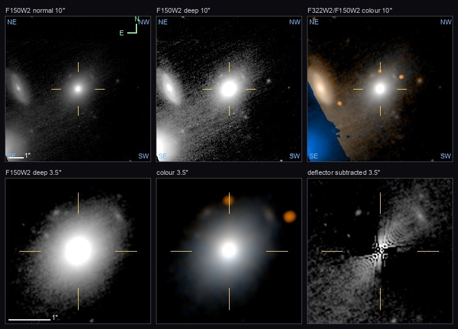{ width="100%" }](img/rank-077-orig.jpg){ target=_blank }
  <figcaption>What the judge saw (blind, footer removed)</figcaption>
</figure>

<figure markdown="span">
  [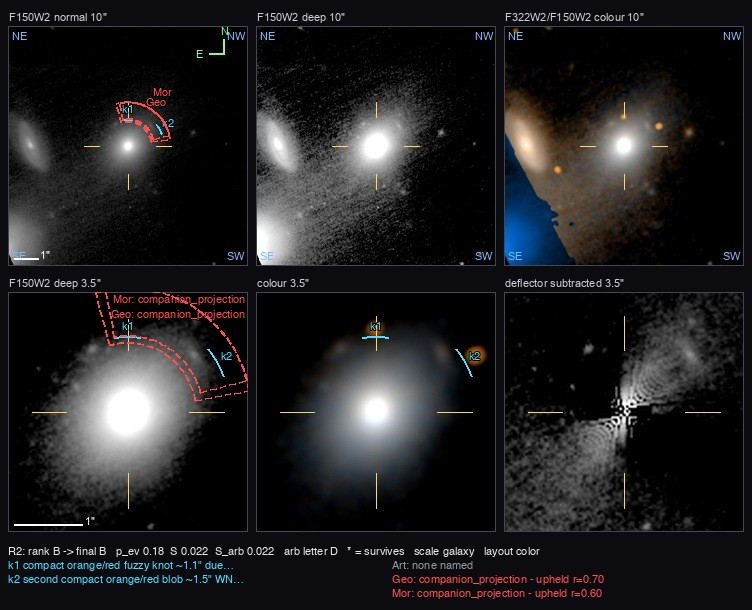{ width="100%" }](img/rank-077-annot.jpg){ target=_blank }
  <figcaption>Advocate evidence (cyan) and critic alternatives coloured by the arbitrator ruling</figcaption>
</figure>

???+ note "Why this grade — advocate, critics, arbitrator"
    **Letter B** (deployed, rule R2) · p_evidence 0.18 · S_arb 0.022 · S 0.022 · scale galaxy

    Letter: letter_rank stands (D rule not met); p_evidence 0.18 >= t_B 0.17 (calibrated at 5% FPR on clean negatives); p_evidence 0.18 < t_A 0.20 (calibrated at 1% FPR on clean negatives).

    **Advocate**

    - criteria: source_contrast 6, low_surface_brightness 3, curvature 1, counter_image 2, arc_morphology 1
    - items (2):
        - k1 — “compact orange/red fuzzy knot ~1.1" due north of the ticked galaxy, clearly redder than the white-blue deflector light it sits on; slightly resolved (not a stellar point), sits just inside the top yellow tick” (panel e, r 1.1 arcsec, PA 350->10, visible in direct: yes; criteria: source_contrast, low_surface_brightness)
        - k2 — “second compact orange/red blob ~1.5" WNW of the deflector, same hue as item 1, also visible as an orange dot NW of the core in the 10" colour panel” (panel e, r 1.5 arcsec, PA 290->308, visible in direct: yes; criteria: source_contrast, low_surface_brightness)
    - scale galaxy; red neighbours within 10 arcsec 3; BCG-like halo no; deflector is centre no
    - p_evidence: 0.18
    - notes: “Two compact orange knots at r~1.1" (PA~0) and r~1.5" (PA~299) stand out against the bluish-white deflector in panels (c)/(e), but they are only ~60 deg apart rather than straddling the nucleus, no counterpart appears at similar radius on the opposite (S/ESE) side in (d) or (e), no tangential elongation or fixed-radius arc is traceable anywhere in the 10" deep panel, and panel (f) shows only the circular-model butterfly/bowtie expected for this clearly elliptical/inclined galaxy.”

    **Critics**

    **artifact — no alternative named (nothing in its competence fits)**

    - leaves standing: k1, k2
    - scale_class: galaxy
    - measured: `{"diffraction_test": "no straight radial ray at fixed PA through either knot; the 6-spike pattern of the bright core is not developed in (a)/(b), and both knots are round/fuzzy, not linear", "field_context": "at least two further similar orange compact sources at larger radii in panel (c) (one ~3\" NW, one ~3\" SE), i.e. a field population, not an isolated detector event", "knot_1_position": "r~1.1\", PA 350-10 (due N of ticks), present in direct panels d (faint knot on top tick) and e (orange), so not a subtraction artefact", "knot_2_position": "r~1.5\", PA ~290-308 (WNW), present in direct panels c and e as a discrete orange blob, not only in (f)", "panel_f_content": "residual in (f) is the four-lobed butterfly + concentric ringing of the circular-profile subtraction on an elliptical host - explicitly not counted", "snowball_persistence_test": "neither knot shows the sharp saturated core + circular halo of a snowball nor a sharp-edged square/streak of a CR shower; both are soft, PSF-broadened"}`
    - notes: “Both located knots are present in un-subtracted panels (c/d/e) - the N knot sits on the top yellow tick in (d) and the WNW knot is a discrete orange dot in the 10" colour panel - so no subtraction-residual explanation is admissible, and neither lies on a straight spike, shows a snowball halo, striping or a saturation trail. Panel (f) shows only the expected butterfly/ringing artefact of the circular profile removal, which I do not count either way; I have no instrumental alternative for items 1 and 2.”
    - ruling: no ruling for this critic

    **geometry — companion_projection:** “Two unrelated compact orange sources projected on the outskirts of the ticked galaxy: they lie at incompatible radii (1.3" vs 1.7") and position angles separated by only ~67 deg, both round and untangential, with no counter-image on the opposite side - a chance pair of neighbours/background galaxies, not two images of one lensed source.”

    - location: r 1.1-1.8 arcsec, PA 285->10
    - accounts for: k1, k2; leaves standing: none; strength r 0.70; coverage a 1.00 (geometric)
    - scale_class: group
    - measured: `{"centre_of_curvature_offset_arcsec": "undetermined - only two points, and a circle through them at r~1.3-1.7\" is not centred on the tick within 0.4\"", "counter_image_search": "no source at r=1.1-1.8\" in pa 100-200 deg (opposite side) in panels d or e; SE/S annulus is clean", "item1_pa_deg": 4, "item1_r_arcsec": 1.26, "item2_pa_deg": 297, "item2_r_arcsec": 1.66, "pa_separation_deg": 67, "radius_ratio": 1.32, "tangential_axis_ratio_item1": "~1.0 (round, no tangential elongation in d or e)", "tangential_axis_ratio_item2": "~1.05 (round disc-like blob, elongation not tangential)"}`
    - notes: “In panel (e) the northern knot sits at r=1.26", PA=4 deg and the WNW blob at r=1.66", PA=297 deg: both are round and compact with no tangential shear, they are 67 deg apart at radii differing by 30%, and the mirror positions (PA 120-200 deg at the same radii) are empty in both (d) and (e). Panel (b) shows a comparable companion ~4" E and a second diffuse galaxy to the SE inside a common faint envelope, so the field is crowded and chance projections at 1-2" are expected.”
    - ruling: upheld, covers k1, k2 — “In panel (e) the northern knot sits at r~1.2-1.3", PA~0 and the second orange blob at r~1.6-1.7", PA~297 on the west side: 30% different radii, only ~67 deg apart, both round with no tangential shear, and the mirror annulus (PA 120-200 deg) is empty in (d) and (e).”

    **morphology — companion_projection:** “Two unrelated compact red field sources projected near the deflector: both are round, unelongated LW-bright knots at different radii and unrelated position angles, indistinguishable from the several other orange compact knots scattered through the 10" field (e.g. one ~2.5-3" to the SE and one just off the NE neighbour), i.e. a field population of red compact objects rather than a multiply-imaged source.”

    - location: r 1-1.8 arcsec, PA 280->15
    - accounts for: k1, k2; leaves standing: none; strength r 0.60; coverage a 1.00 (geometric)
    - scale_class: galaxy
    - measured: `{"host_structure_panel_d": "smooth bright core plus faint clumpy outer disc out to ~1.2\"; no arm or shell bridging to either knot", "knot1_position_panel_e": "r ~1.2-1.3\", PA ~357 (just E of the N tick)", "knot2_position_panel_e": "r ~1.6-1.7\", PA ~299 (WNW, at/outside the edge of the host's visible disc light)", "knot_shape": "both round/PSF-like, no measurable tangential elongation at 0.031\"/px; axis ratio ~1", "pa_separation_deg": "~62, neither opposed (180) nor a fold pair on a common tangential track", "radius_ratio": "~0.75 - the two knots are NOT at a common radius", "similar_knots_in_10in_field": "at least 2 further orange compact knots (SE ~2.5-3\", and one adjacent to the NE spiral) at unrelated radii/PAs"}`
    - notes: “In panel (e) the northern knot sits at r~1.2", PA~357 and the second at r~1.6", PA~299 - different radii, 62 deg apart, both perfectly round with no tangential stretch, so they do not lie on a common Einstein circle nor form a counter-image pair; panel (c) shows the same orange compact knots repeated elsewhere in the 10" field (SE at ~2.5-3" and beside the NE spiral), and panel (d) shows no stellar bridge, arm or shell from the host's clumpy outer disc (r<1.2") reaching either knot.”
    - ruling: upheld, covers k1, k2 — “Both knots are PSF-round LW-bright dots with no tangential stretch at 0.031"/px and are duplicated elsewhere in the 10" colour panel (an orange knot ~3" SE and another beside the NE neighbour), i.e. a field population of red compact sources rather than images of one source.”

    **Arbitrator**

    - surviving items: none (0 of 2)
    - letter_llm: D; scale_class_final: galaxy; needs_human: no
    - rationale: “The only located evidence is the pair of compact orange knots seen in panels (c) and (e): one just inside the northern yellow tick at r~1.2", PA~0, and a larger orange blob on the western side at r~1.6-1.7", PA~297 (right-hand upper part of the zoom, since E is left). The artifact critic correctly confirmed both are real sky (they appear in the un-subtracted panels c, d, e, lie on no straight diffraction ray, and show no snowball core or striping), so nothing here is instrumental - but real is not lensed. Both critics who named an alternative converge on companion_projection and the pixels back them: the knots are round to PSF-like with axis ratio ~1 and no tangential elongation, they sit at radii differing by ~30% so they cannot lie on a common Einstein circle, they are separated by only ~62-67 deg in PA rather than straddling the nucleus, and the opposite annulus (PA 120-200 deg at r=1.1-1.8") is clean in both (d) and (e). Panels (b)/(c) show at least two further identical orange compact knots at ~2.5-3" SE and next to the NE spiral neighbour, establishing a field population of such objects; panel (d) shows only a smooth core plus a faint clumpy outer disc to r~1.2" with no arc, ring or bridge, and the only structure in (f) is the four-lobed butterfly plus concentric ringing that the circular-profile subtraction necessarily leaves on this clearly elliptical/inclined host - explicitly not evidence either way. With both located items accounted for by chance projection, nothing survives, and the grade is D; no deeper data is needed to settle this.”

    **Score**

    - S = p_ev x prod(1 - r_i a_i) = 0.18 x (1 - 0.70x1.00) x (1 - 0.60x1.00) = 0.022
        - terms: geometry companion_projection r 0.70 a 1.00; morphology companion_projection r 0.60 a 1.00
    - S_arb = p_ev x prod_{upheld/partial}(1 - r_i a_i') = 0.18 x (1 - 0.70x1.00) x (1 - 0.60x1.00) = 0.022
        - terms: geometry companion_projection r 0.70 a 1.00 (upheld); morphology companion_projection r 0.60 a 1.00 (upheld)
    - stored grade_pred (on S): C — S 0.022 < t_B 0.17 (calibrated at 5% FPR on clean negatives); not D: 2 item(s) located; no named critic covers every item at r >= 0.80
    - stored letter_arb (on S_arb): C; letter_source: opus5_api_calibrated
    - deploy rule R2: letter_rank (advocate only, on p_evidence) = B — p_evidence 0.18 >= t_B 0.17 (calibrated at 5% FPR on clean negatives); p_evidence 0.18 < t_A 0.20 (calibrated at 1% FPR on clean negatives)
    - deploy rule R2: letter_final = B — letter_rank stands (D rule not met); p_evidence 0.18 >= t_B 0.17 (calibrated at 5% FPR on clean negatives); p_evidence 0.18 < t_A 0.20 (calibrated at 1% FPR on clean negatives)
    - veto: none (letter_final == letter_rank)

---

## Rank 78: J18895415+499333 {#rank-78}

| Original grade | Passes | Inspector conf. | Pipeline θ_E |
|:--:|:--:|:--:|:--:|
| **U** | — | 25 | — |

| New (final) | Rank letter | p_ev | S_arb | Demoted by | Arb. letter | Needs human |
|:--:|:--:|--:|--:|:--|:--:|:--:|
| **C** | C | 0.10 | 0.100 | — | — | no |

<small>pipeline discovery status `new` · scale class `none`</small>

<figure markdown="span">
  [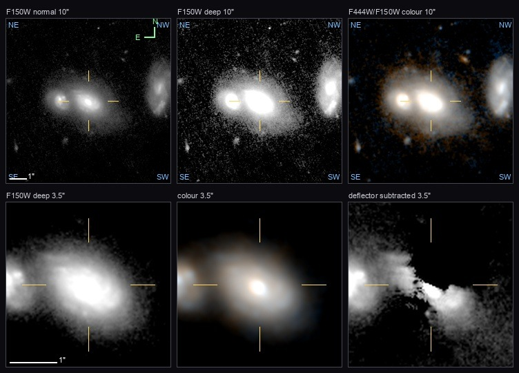{ width="100%" }](img/rank-078-orig.jpg){ target=_blank }
  <figcaption>What the judge saw (blind, footer removed)</figcaption>
</figure>

<figure markdown="span">
  [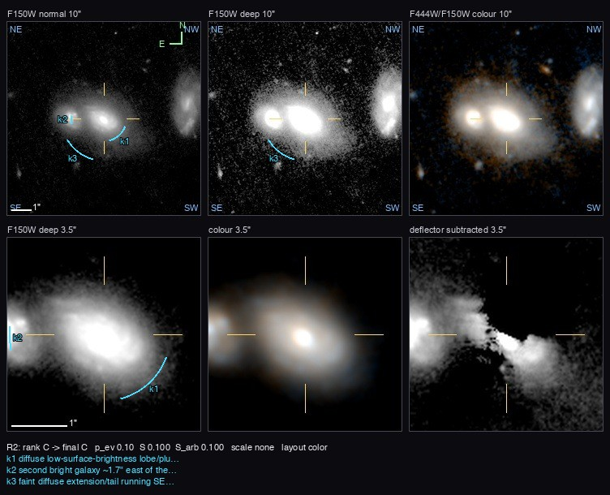{ width="100%" }](img/rank-078-annot.jpg){ target=_blank }
  <figcaption>Advocate evidence (cyan) and critic alternatives coloured by the arbitrator ruling</figcaption>
</figure>

???+ note "Why this grade — advocate, critics, arbitrator"
    **Letter C** (deployed, rule R2) · p_evidence 0.10 · S_arb 0.10 · S 0.10 · scale none

    Letter: letter_rank stands (D rule not met); p_evidence 0.10 < t_B 0.17 (calibrated at 5% FPR on clean negatives); not D: 3 item(s) located; no named critic covers every item at r >= 0.80.

    **Advocate**

    - criteria: source_contrast 2, low_surface_brightness 4, curvature 1, counter_image 1, arc_morphology 1
    - items (3):
        - k1 — “diffuse low-surface-brightness lobe/plume SW of the ticked nucleus, slightly bluer than the orange core in (e); extends outward rather than staying at fixed radius, no tangential thinning” (panel d, r 1.2 arcsec, PA 195->250, visible in direct: yes; criteria: low_surface_brightness)
        - k2 — “second bright galaxy ~1.7" east of the ticked galaxy with its own resolved compact nucleus and similar white/orange two-band hue; embedded in a common envelope with the deflector, tested as a possible image pair partner” (panel a, r 1.7 arcsec, PA 85->100, visible in direct: yes; criteria: low_surface_brightness)
        - k3 — “faint diffuse extension/tail running SE from the deflector envelope, traceable in the deep 10" panel out to ~2.5"; radius grows with angle, not confined to a fixed radius” (panel b, r 2.2 arcsec, PA 120->165, visible in direct: yes; criteria: low_surface_brightness)
    - scale none; red neighbours within 10 arcsec 3; BCG-like halo yes; deflector is centre no
    - p_evidence: 0.10
    - notes: “Every located feature is a diffuse, radius-growing plume of the same hue and profile as the pair's common envelope (panels b, d), and no thin tangential feature at constant radius appears anywhere between 0.3" and 5"; the strong bright/dark diagonal split in (f) is the expected dipole+bowtie of a circular model fitted to an off-centre, companion-blended galaxy and is not counted.”

    **Critics**

    - not called (p_evidence 0.10 < tau0 0.15)

    **Arbitrator**

    - no arbitrator record (not called)

    **Score**

    - S = p_ev = 0.10 (no critic term entered the product)
    - S_arb = p_ev = 0.10 (no critic term entered the product)
    - stored grade_pred (on S): C — S 0.10 < t_B 0.17 (calibrated at 5% FPR on clean negatives); not D: 3 item(s) located; no named critic covers every item at r >= 0.80
    - stored letter_arb (on S_arb): C; letter_source: opus5_api_calibrated
    - deploy rule R2: letter_rank (advocate only, on p_evidence) = C — p_evidence 0.10 < t_B 0.17 (calibrated at 5% FPR on clean negatives); not D: 3 item(s) located; no named critic covers every item at r >= 0.80
    - deploy rule R2: letter_final = C — letter_rank stands (D rule not met); p_evidence 0.10 < t_B 0.17 (calibrated at 5% FPR on clean negatives); not D: 3 item(s) located; no named critic covers every item at r >= 0.80
    - veto: none (letter_final == letter_rank)

---

## Rank 79: J16456132+2953030 {#rank-79}

| Original grade | Passes | Inspector conf. | Pipeline θ_E |
|:--:|:--:|:--:|:--:|
| **U** | — | 25 | 2.96″ |

| New (final) | Rank letter | p_ev | S_arb | Demoted by | Arb. letter | Needs human |
|:--:|:--:|--:|--:|:--|:--:|:--:|
| **C** | C | 0.12 | 0.120 | — | — | no |

<small>pipeline discovery status `new` · scale class `group`</small>

<figure markdown="span">
  [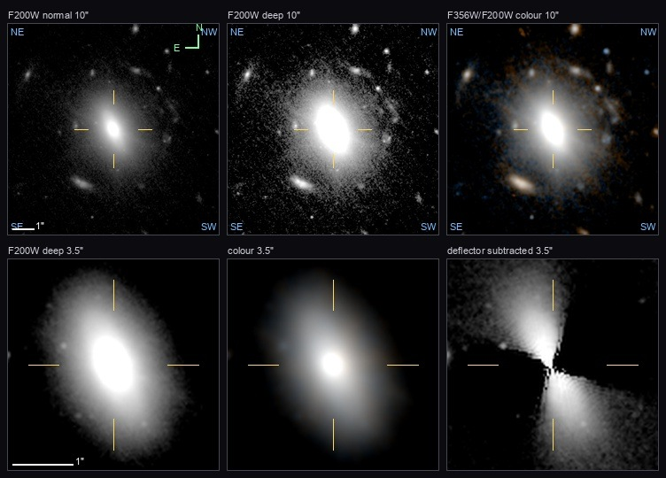{ width="100%" }](img/rank-079-orig.jpg){ target=_blank }
  <figcaption>What the judge saw (blind, footer removed)</figcaption>
</figure>

<figure markdown="span">
  [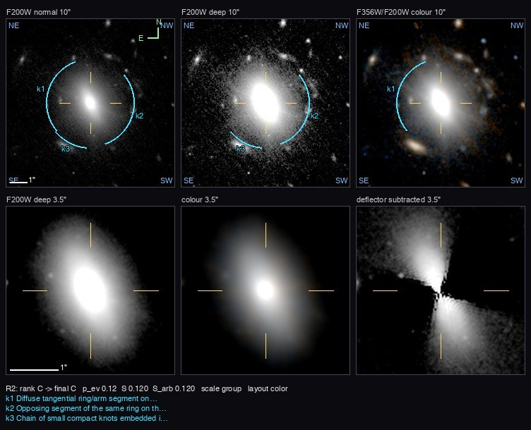{ width="100%" }](img/rank-079-annot.jpg){ target=_blank }
  <figcaption>Advocate evidence (cyan) and critic alternatives coloured by the arbitrator ruling</figcaption>
</figure>

???+ note "Why this grade — advocate, critics, arbitrator"
    **Letter C** (deployed, rule R2) · p_evidence 0.12 · S_arb 0.12 · S 0.12 · scale group

    Letter: letter_rank stands (D rule not met); p_evidence 0.12 < t_B 0.17 (calibrated at 5% FPR on clean negatives); not D: 3 item(s) located; no named critic covers every item at r >= 0.80.

    **Advocate**

    - criteria: source_contrast 3, low_surface_brightness 6, curvature 5, counter_image 2, arc_morphology 2
    - items (3):
        - k1 — “Diffuse tangential ring/arm segment on the NE-E side, r~2.5-2.8", bluish in (c) against the orange bulge, but continuous in surface brightness with the disc that surrounds the bright bar-like core” (panel c, r 2.6 arcsec, PA 20->130, visible in direct: yes; criteria: source_contrast, low_surface_brightness, curvature)
        - k2 — “Opposing segment of the same ring on the SW-W side, r~2.5-2.8", similar width and brightness, closing the structure into a complete smooth ring centred on the ticked nucleus” (panel b, r 2.6 arcsec, PA 200->310, visible in direct: yes; criteria: low_surface_brightness, curvature)
        - k3 — “Chain of small compact knots embedded in the ring on the SE flank (r~2.2-3.0"), resolved as individual clumps rather than a smooth thin arc” (panel b, r 2.7 arcsec, PA 130->175, visible in direct: yes; criteria: low_surface_brightness)
    - scale group; red neighbours within 10 arcsec 3; BCG-like halo no; deflector is centre yes; arc radius 2.6 arcsec; arc PA span 20->130; centre-of-curvature offset 0.2 arcsec
    - p_evidence: 0.12
    - notes: “The only tangential structure is a closed, smooth ~2.6" ring of the same broad disc profile as the host, continuous with the elongated bar-like core seen in (d) and with star-forming knots along it (SE), while panel (f) shows only the four-lobed bowtie artefact of the circular-profile subtraction and no offset knot or counter-image appears at 0.3-2".”

    **Critics**

    - not called (p_evidence 0.12 < tau0 0.15)

    **Arbitrator**

    - no arbitrator record (not called)

    **Score**

    - S = p_ev = 0.12 (no critic term entered the product)
    - S_arb = p_ev = 0.12 (no critic term entered the product)
    - stored grade_pred (on S): C — S 0.12 < t_B 0.17 (calibrated at 5% FPR on clean negatives); not D: 3 item(s) located; no named critic covers every item at r >= 0.80
    - stored letter_arb (on S_arb): C; letter_source: opus5_api_calibrated
    - deploy rule R2: letter_rank (advocate only, on p_evidence) = C — p_evidence 0.12 < t_B 0.17 (calibrated at 5% FPR on clean negatives); not D: 3 item(s) located; no named critic covers every item at r >= 0.80
    - deploy rule R2: letter_final = C — letter_rank stands (D rule not met); p_evidence 0.12 < t_B 0.17 (calibrated at 5% FPR on clean negatives); not D: 3 item(s) located; no named critic covers every item at r >= 0.80
    - veto: none (letter_final == letter_rank)

---

## Rank 80: J15424410+3903685 {#rank-80}

| Original grade | Passes | Inspector conf. | Pipeline θ_E |
|:--:|:--:|:--:|:--:|
| **U** | — | 25 | 1.39″ |

| New (final) | Rank letter | p_ev | S_arb | Demoted by | Arb. letter | Needs human |
|:--:|:--:|--:|--:|:--|:--:|:--:|
| **C** | C | 0.12 | 0.120 | — | — | no |

<small>pipeline discovery status `new` · scale class `galaxy`</small>

<figure markdown="span">
  [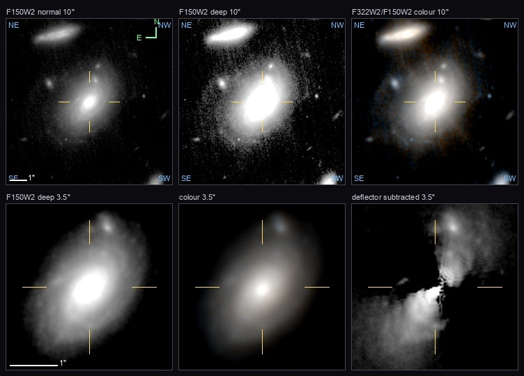{ width="100%" }](img/rank-080-orig.jpg){ target=_blank }
  <figcaption>What the judge saw (blind, footer removed)</figcaption>
</figure>

<figure markdown="span">
  [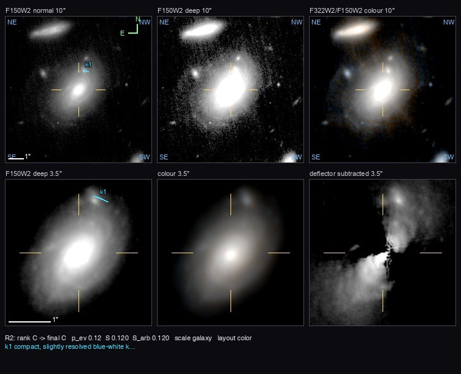{ width="100%" }](img/rank-080-annot.jpg){ target=_blank }
  <figcaption>Advocate evidence (cyan) and critic alternatives coloured by the arbitrator ruling</figcaption>
</figure>

???+ note "Why this grade — advocate, critics, arbitrator"
    **Letter C** (deployed, rule R2) · p_evidence 0.12 · S_arb 0.12 · S 0.12 · scale galaxy

    Letter: letter_rank stands (D rule not met); p_evidence 0.12 < t_B 0.17 (calibrated at 5% FPR on clean negatives); not D: 1 item(s) located; no named critic covers every item at r >= 0.80.

    **Advocate**

    - criteria: source_contrast 5, low_surface_brightness 2, curvature 1, counter_image 1, arc_morphology 1
    - items (1):
        - k1 — “compact, slightly resolved blue-white knot ~1.4" NNW of the ticked nucleus; visible in the 10" normal/deep panels, clear in the 3.5" deep and colour zooms, and appearing as a one-sided positive blob in the subtracted residual (i.e. not mirrored across the core)” (panel d, r 1.4 arcsec, PA 330->345, visible in direct: yes; criteria: source_contrast, counter_image)
    - scale galaxy; red neighbours within 10 arcsec 2; BCG-like halo no; deflector is centre no
    - p_evidence: 0.12
    - notes: “Only one offset feature exists anywhere in the field: the compact bluish knot at r~1.4", PA~338 (panels d/e, positive one-sided residual in f); an explicit search at PA~140-175 and r~1.0-2.0" in (d), (b) and (f) finds no counter-knot, no tangential elongation is resolved at this radius, and the ticked object itself resolves into an inclined bulge+bar/disc whose ellipticity produces the bowtie/dipole in (f), so the knot is unsupported by any second image.”

    **Critics**

    - not called (p_evidence 0.12 < tau0 0.15)

    **Arbitrator**

    - no arbitrator record (not called)

    **Score**

    - S = p_ev = 0.12 (no critic term entered the product)
    - S_arb = p_ev = 0.12 (no critic term entered the product)
    - stored grade_pred (on S): C — S 0.12 < t_B 0.17 (calibrated at 5% FPR on clean negatives); not D: 1 item(s) located; no named critic covers every item at r >= 0.80
    - stored letter_arb (on S_arb): C; letter_source: opus5_api_calibrated
    - deploy rule R2: letter_rank (advocate only, on p_evidence) = C — p_evidence 0.12 < t_B 0.17 (calibrated at 5% FPR on clean negatives); not D: 1 item(s) located; no named critic covers every item at r >= 0.80
    - deploy rule R2: letter_final = C — letter_rank stands (D rule not met); p_evidence 0.12 < t_B 0.17 (calibrated at 5% FPR on clean negatives); not D: 1 item(s) located; no named critic covers every item at r >= 0.80
    - veto: none (letter_final == letter_rank)

---

## Rank 81: J31352710-005281 {#rank-81}

| Original grade | Passes | Inspector conf. | Pipeline θ_E |
|:--:|:--:|:--:|:--:|
| **U** | — | 25 | — |

| New (final) | Rank letter | p_ev | S_arb | Demoted by | Arb. letter | Needs human |
|:--:|:--:|--:|--:|:--|:--:|:--:|
| **C** | C | 0.10 | 0.100 | — | — | no |

<small>pipeline discovery status `new` · scale class `galaxy`</small>

<figure markdown="span">
  [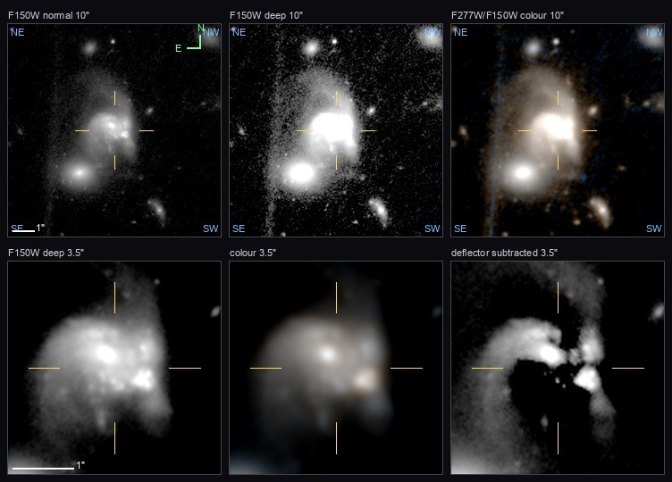{ width="100%" }](img/rank-081-orig.jpg){ target=_blank }
  <figcaption>What the judge saw (blind, footer removed)</figcaption>
</figure>

<figure markdown="span">
  [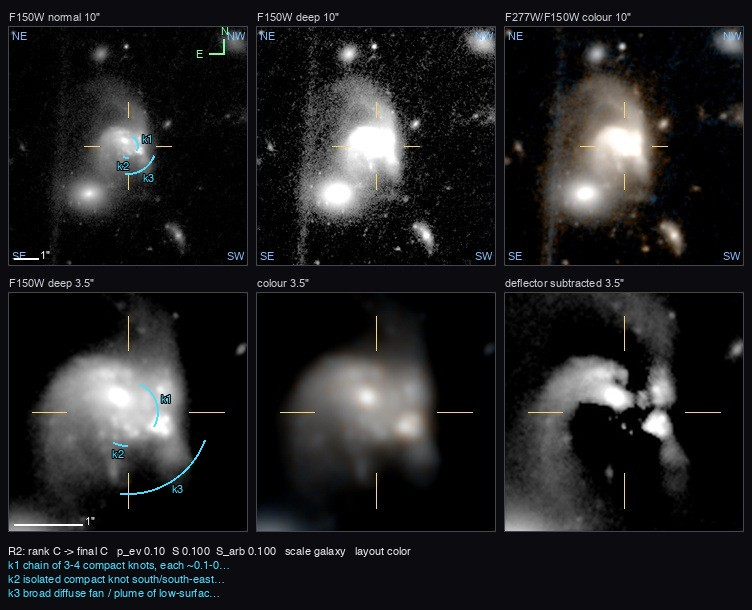{ width="100%" }](img/rank-081-annot.jpg){ target=_blank }
  <figcaption>Advocate evidence (cyan) and critic alternatives coloured by the arbitrator ruling</figcaption>
</figure>

???+ note "Why this grade — advocate, critics, arbitrator"
    **Letter C** (deployed, rule R2) · p_evidence 0.10 · S_arb 0.10 · S 0.10 · scale galaxy

    Letter: letter_rank stands (D rule not met); p_evidence 0.10 < t_B 0.17 (calibrated at 5% FPR on clean negatives); not D: 3 item(s) located; no named critic covers every item at r >= 0.80.

    **Advocate**

    - criteria: source_contrast 3, low_surface_brightness 4, curvature 1, counter_image 2, arc_morphology 1
    - items (3):
        - k1 — “chain of 3-4 compact knots, each ~0.1-0.15" across, strung around the core at nearly constant radius r~0.3-0.6" on the W/NW side; traceable in the deep zoom (d) and as discrete bright residual blobs in (f)” (panel d, r 0.45 arcsec, PA 240->335, visible in direct: yes; criteria: low_surface_brightness, counter_image)
        - k2 — “isolated compact knot south/south-east of the nucleus at similar radius to the W/NW knot chain - the only candidate for a knot straddling the core, though its PA (~165) is not opposite the chain's mean PA (~290)” (panel d, r 0.5 arcsec, PA 155->180, visible in direct: yes; criteria: low_surface_brightness)
        - k3 — “broad diffuse fan / plume of low-surface-brightness light spreading S-SW of the core, edge not at constant radius (radius grows with angle), also seen as the common envelope linking the ticked galaxy to the bright SE neighbour in (b)” (panel d, r 1.2 arcsec, PA 175->250, visible in direct: yes; criteria: low_surface_brightness)
    - scale galaxy; red neighbours within 10 arcsec 3; BCG-like halo yes; deflector is centre no
    - p_evidence: 0.10
    - notes: “The ticked object resolves at NIRCam scale into a clumpy irregular/merging system - several star-forming-clump-like knots concentrated one-sidedly W/NW of the core (d, f), a S-SW plume whose radius grows with angle, and a common diffuse envelope in (b) joining it to the bright neighbour 2.4" to the SE (PA~134); no knot pair straddles the nucleus at matched radius and no feature keeps a constant radius or curves concavely toward the tick centre.”

    **Critics**

    - not called (p_evidence 0.10 < tau0 0.15)

    **Arbitrator**

    - no arbitrator record (not called)

    **Score**

    - S = p_ev = 0.10 (no critic term entered the product)
    - S_arb = p_ev = 0.10 (no critic term entered the product)
    - stored grade_pred (on S): C — S 0.10 < t_B 0.17 (calibrated at 5% FPR on clean negatives); not D: 3 item(s) located; no named critic covers every item at r >= 0.80
    - stored letter_arb (on S_arb): C; letter_source: opus5_api_calibrated
    - deploy rule R2: letter_rank (advocate only, on p_evidence) = C — p_evidence 0.10 < t_B 0.17 (calibrated at 5% FPR on clean negatives); not D: 3 item(s) located; no named critic covers every item at r >= 0.80
    - deploy rule R2: letter_final = C — letter_rank stands (D rule not met); p_evidence 0.10 < t_B 0.17 (calibrated at 5% FPR on clean negatives); not D: 3 item(s) located; no named critic covers every item at r >= 0.80
    - veto: none (letter_final == letter_rank)

---

## Rank 82: J21483295+5282544 {#rank-82}

| Original grade | Passes | Inspector conf. | Pipeline θ_E |
|:--:|:--:|:--:|:--:|
| **U** | — | 25 | 2.30″ |

| New (final) | Rank letter | p_ev | S_arb | Demoted by | Arb. letter | Needs human |
|:--:|:--:|--:|--:|:--|:--:|:--:|
| **B** | B | 0.18 | 0.036 | — | C | no |

<small>pipeline discovery status `new` · scale class `galaxy`</small>

<figure markdown="span">
  [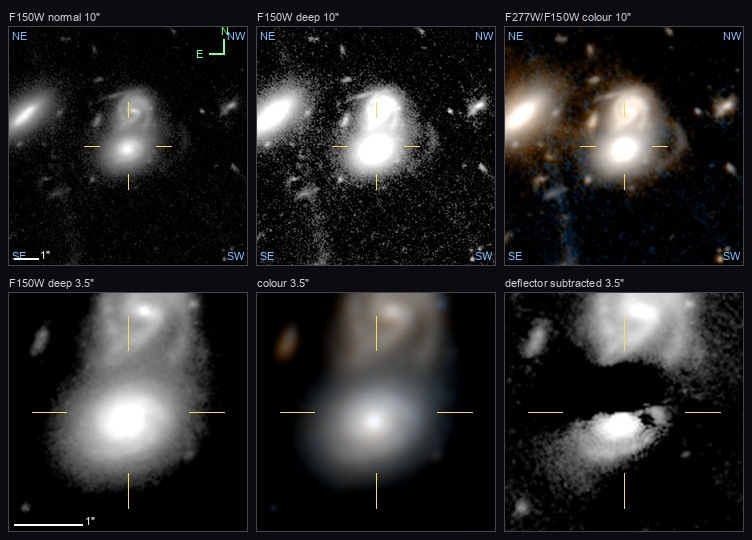{ width="100%" }](img/rank-082-orig.jpg){ target=_blank }
  <figcaption>What the judge saw (blind, footer removed)</figcaption>
</figure>

<figure markdown="span">
  [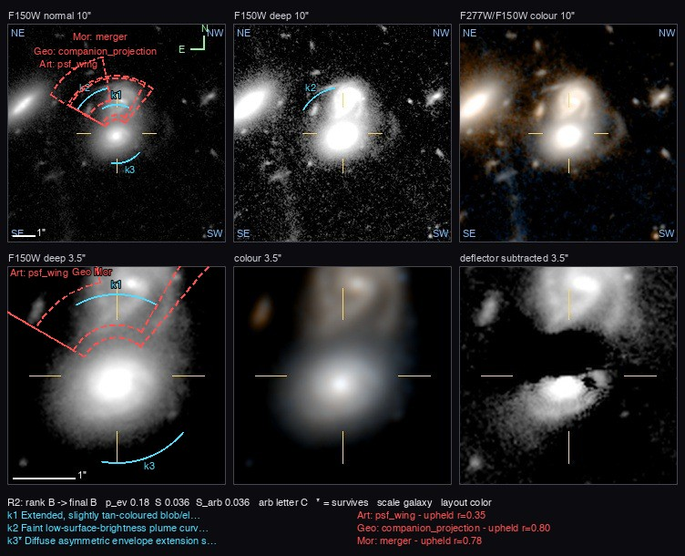{ width="100%" }](img/rank-082-annot.jpg){ target=_blank }
  <figcaption>Advocate evidence (cyan) and critic alternatives coloured by the arbitrator ruling</figcaption>
</figure>

???+ note "Why this grade — advocate, critics, arbitrator"
    **Letter B** (deployed, rule R2) · p_evidence 0.18 · S_arb 0.036 · S 0.036 · scale galaxy

    Letter: letter_rank stands (D rule not met); p_evidence 0.18 >= t_B 0.17 (calibrated at 5% FPR on clean negatives); p_evidence 0.18 < t_A 0.20 (calibrated at 1% FPR on clean negatives).

    **Advocate**

    - criteria: source_contrast 4, low_surface_brightness 6, curvature 3, counter_image 1, arc_morphology 3
    - items (3):
        - k1 — “Extended, slightly tan-coloured blob/elongated patch immediately north of the ticked galaxy, ~1.2-1.5" out, elongated roughly E-W (i.e. broadly tangential); brightest in (d)/(e), also clear in (a),(b),(c) and as the large positive patch north of the core in (f)” (panel d, r 1.3 arcsec, PA 330->30, visible in direct: yes; criteria: source_contrast, low_surface_brightness)
        - k2 — “Faint low-surface-brightness plume curving from the northern blob outwards toward the NE (traceable to ~2-2.5" in the deep 10" panel), same hue as the deflector envelope” (panel b, r 2.1 arcsec, PA 10->60, visible in direct: yes; criteria: low_surface_brightness)
        - k3 — “Diffuse asymmetric envelope extension south/south-west of the core (~1.2-1.8"), the only material roughly opposite item 1; no compact knot or tangential thread within it” (panel d, r 1.4 arcsec, PA 170->230, visible in direct: yes; criteria: low_surface_brightness)
    - scale galaxy; red neighbours within 10 arcsec 3; BCG-like halo yes; deflector is centre yes; arc radius 1.3 arcsec; arc PA span 330->30; centre-of-curvature offset 1.5 arcsec
    - p_evidence: 0.18
    - notes: “The only offset structure is the northern blob at ~1.3", but in (b) and (d) it is as thick as its radius and joined to the deflector core by a continuous stellar bridge inside a common diffuse envelope, and the material opposite it (PA~200) is smooth halo rather than a counter-image, so the located set is consistent with a close pair/merger as much as with a lens.”

    **Critics**

    **artifact — psf_wing:** “Overlapping outer light/PSF halo of the bright galaxy ~3.7" NE of the ticked deflector (centre near PA 57 deg in panels a/b/c) filling the gap between the two galaxies and mimicking a faint NE plume at ~2"”

    - location: r 1.5-3.5 arcsec, PA 10->60
    - accounts for: k2; leaves standing: k1, k3; strength r 0.35; coverage a 0.333 (geometric)
    - scale_class: galaxy
    - measured: `{"bright_neighbour_offset_arcsec": 3.7, "bright_neighbour_pa_deg": 57, "diffraction_spikes_detected": "none - no 6-ray straight pattern from any source in the 10\" field", "items_traceable_in_direct_panels": "1 in a,b,c,d,e; 2 in b; 3 in a,b,d,e", "striping_or_snowballs": "none; background in (b) is uniform grainy noise, no 1/f rows, no seams, no persistence blobs"}`
    - notes: “Item 1 (blob ~1.3" N, PA 330-30) and item 3 (SSW envelope extension, PA 170-230) are both plainly present in the un-subtracted panels (a), (b), (d), (e), so the (f) positive patch north of the core is sky, not a circular-profile artefact, and no instrumental explanation (spike, snowball, stripe, seam, persistence) fits them. Only the faint NE plume at ~2.1" (item 2) sits along the line to the bright galaxy 3.7" away at PA~57, where that neighbour's extended halo/PSF wings measurably contribute in the deep 10" panel.”
    - ruling: upheld, covers k2 — “In panel (b) the faint NE plume at r~2" lies exactly along the line to the bright galaxy ~3.7" away at PA~57, whose extended halo/wings visibly fill the gap between the two systems, so item 2 is contaminated overlapping light rather than a fixed-radius arc.”

    **geometry — companion_projection:** “The northern feature is a separate galaxy (its own compact nucleus plus its own envelope) sitting ~1.3-1.6" N of the ticked galaxy, with a low-surface-brightness bridge/tail running out to the NE - a close pair/interacting neighbour, not a tangential image of a background source”

    - location: r 0.8-2.5 arcsec, PA 330->60
    - accounts for: k1, k2; leaves standing: k3; strength r 0.80; coverage a 0.667 (geometric)
    - scale_class: galaxy
    - measured: `{"counter_image_test": "at r=1.2-1.6\", pa 150-230 (item 3) only a smooth envelope whose surface brightness falls monotonically outward; no knot, no tangential thread, no profile match to item 1", "curvature": "no constant-radius tangential curvature; the NE plume grows from r~1.5\" at pa~10 deg to r~2.5\" at pa~50-60 deg in (b), a tail/bridge geometry, not concentric with the deflector", "northern_feature_core": "compact bright nucleus at r=1.45\", pa~5 deg in (d) and (e); brightness peaks inward of the patch, i.e. a nucleated object rather than a constant-surface-brightness thread", "pair_separation_and_bridge": "the two cores form the classic '8' in (b), joined by continuous light along pa~0-10 deg", "thickness_vs_radius": "patch ~0.8-1.0\" across in both radial and tangential directions at r=1.3\" - not thin compared with its radius, unlike an arc"}`
    - notes: “In (d)/(e) the northern item-1 patch contains its own compact nucleus at r~1.45", pa~5 deg and is as thick radially as tangentially, while the material opposite it (pa 170-230°, item 3) is featureless envelope with no matching knot; in (b) the two cores are bridged and the item-2 plume climbs from 1.5" to 2.5" as PA runs 10->60 deg, i.e. a tail, not a fixed-radius arc.”
    - ruling: upheld, covers k1, k2 — “In (d)/(e) the northern patch contains its own compact nucleus at r~1.4", PA~0-5 and is as thick radially as tangentially, joined to the ticked core by a continuous bridge forming the '8' seen in (b), while the plume's radius climbs from ~1.4" at PA 10 to ~2.4" at PA 50 - tail geometry, not constant radius.”

    **morphology — merger:** “An interacting pair/compact group: a companion galaxy with its own compact nucleus sits ~1.4" N of the ticked galaxy inside a shared, distorted stellar envelope, with a tidal bridge/plume running outward to the NE neighbour galaxy at r~1.7", PA~48 deg”

    - location: r 0.6-2.6 arcsec, PA 320->60
    - accounts for: k1, k2; leaves standing: k3; strength r 0.78; coverage a 0.667 (geometric)
    - scale_class: group
    - measured: `{"companion_nucleus_offset": "1.4\" at PA 354 deg (bright compact core in (d) and (e), unresolved-to-slightly-extended, not a thin thread)", "ne_neighbour": "separate galaxy at r~1.7\", PA~48 in (d)/(c), joined to the system by the same low-surface-brightness envelope", "north_patch_extent": "r 0.7-1.8\", PA 330-20; thickness comparable to its radius, no constant-radius tangential ridge", "plume_radius_vs_angle": "grows monotonically 1.4\" at PA~10 to ~2.3-2.5\" at PA~50, i.e. outward-spiralling toward the NE galaxy, not fixed radius", "south_counter_feature": "no compact knot or thin tangential thread anywhere in PA 150-240 at r 1.0-1.8\""}`
    - notes: “In (d) the northern feature is not a thin arc but a compact nucleus at r=1.4", PA 354 sitting in a diffuse patch as thick as its radius, and in (c) it reads as a separate galaxy with a dust lane, all wrapped in one common envelope shared with the bright NE galaxy; item 2's surface brightness ridge climbs from 1.4" to ~2.4" as PA goes 10->50, the radius-vs-angle behaviour of a tidal bridge, not of an arc at fixed radius. Item 3 is left standing only as a smooth, knot-free envelope asymmetry, which is what a tidal distortion opposite the companion looks like but which I cannot separate from a faint counter-image on these panels.”
    - ruling: upheld, covers k1, k2 — “The colour zoom (e) resolves the northern object as a separate nucleated galaxy inside a shared distorted envelope that also links to the bright NE neighbour, and no thin tangential ridge exists anywhere in PA 150-240 at r 1.0-1.8" to serve as its counter-image.”

    **Arbitrator**

    - surviving items: k3 (1 of 3)
    - letter_llm: C; scale_class_final: galaxy; needs_human: no
    - rationale: “Everything offset from the ticked galaxy resolves at NIRCam sampling into a close pair, not into lensed images: panel (d) shows the northern feature as a nucleated companion (compact core at r~1.4", PA~0) embedded in a patch whose radial thickness (~0.8-1.0") is comparable to its own radius, connected to the deflector core by continuous light that makes the classic figure-eight in (b); panel (e) shows it as a distinct galaxy with its own colour/dust structure rather than a thin thread of a background source. The NE 'plume' (item 2) climbs monotonically in radius from ~1.4" at PA 10 to ~2.4" at PA 50 toward the bright galaxy 3.7" away at PA~57, which is bridge/PSF-wing geometry, not a fixed-radius arc; the large positive lobe north of the core in (f) simply reflects this real, un-subtracted companion light and cannot be counted either way. The one surviving item, the SSW envelope extension at r~1.4", PA 170-230 in (a),(b),(d),(e), is smooth, knot-free and monotonically declining outward, with no tangential thread or surface-brightness match to the northern patch, so it neither confirms nor refutes lensing but is exactly what a tidal distortion opposite a companion looks like. With no counter-image, no constant-radius curvature and no thin arc anywhere, this is best read as an interacting pair in a modest group environment; C rather than D only because that southern asymmetry was located and remains unexplained by any named alternative.”

    **Score**

    - S = p_ev x prod(1 - r_i a_i) = 0.18 x (1 - 0.35x0.333) x (1 - 0.80x0.667) x (1 - 0.78x0.667) = 0.036
        - terms: artifact psf_wing r 0.35 a 0.333; geometry companion_projection r 0.80 a 0.667; morphology merger r 0.78 a 0.667
    - S_arb = p_ev x prod_{upheld/partial}(1 - r_i a_i') = 0.18 x (1 - 0.35x0.333) x (1 - 0.80x0.667) x (1 - 0.78x0.667) = 0.036
        - terms: artifact psf_wing r 0.35 a 0.333 (upheld); geometry companion_projection r 0.80 a 0.667 (upheld); morphology merger r 0.78 a 0.667 (upheld)
    - stored grade_pred (on S): C — S 0.036 < t_B 0.17 (calibrated at 5% FPR on clean negatives); not D: 3 item(s) located; no named critic covers every item at r >= 0.80
    - stored letter_arb (on S_arb): C; letter_source: opus5_api_calibrated
    - deploy rule R2: letter_rank (advocate only, on p_evidence) = B — p_evidence 0.18 >= t_B 0.17 (calibrated at 5% FPR on clean negatives); p_evidence 0.18 < t_A 0.20 (calibrated at 1% FPR on clean negatives)
    - deploy rule R2: letter_final = B — letter_rank stands (D rule not met); p_evidence 0.18 >= t_B 0.17 (calibrated at 5% FPR on clean negatives); p_evidence 0.18 < t_A 0.20 (calibrated at 1% FPR on clean negatives)
    - veto: none (letter_final == letter_rank)

---

## Rank 83: J3470183+013617 {#rank-83}

| Original grade | Passes | Inspector conf. | Pipeline θ_E |
|:--:|:--:|:--:|:--:|
| **U** | — | 25 | — |

| New (final) | Rank letter | p_ev | S_arb | Demoted by | Arb. letter | Needs human |
|:--:|:--:|--:|--:|:--|:--:|:--:|
| **C** | C | 0.15 | 0.028 | — | D | no |

<small>pipeline discovery status `new` · scale class `galaxy`</small>

<figure markdown="span">
  [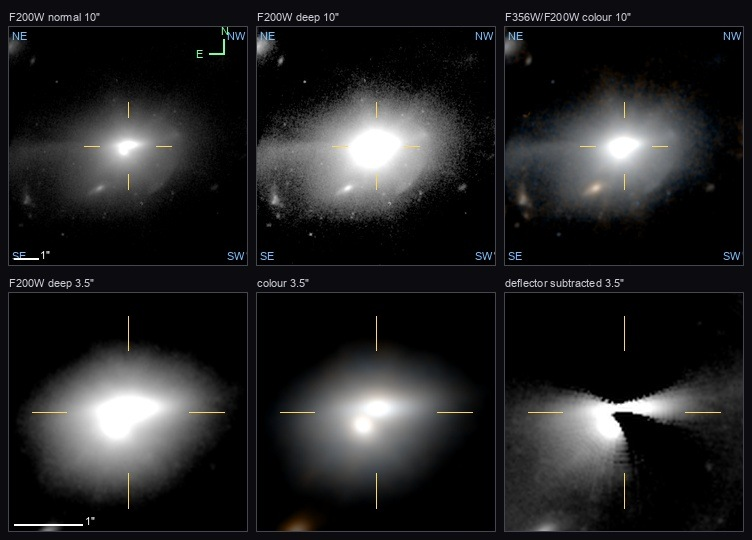{ width="100%" }](img/rank-083-orig.jpg){ target=_blank }
  <figcaption>What the judge saw (blind, footer removed)</figcaption>
</figure>

<figure markdown="span">
  [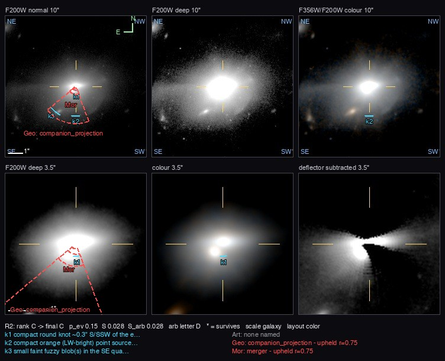{ width="100%" }](img/rank-083-annot.jpg){ target=_blank }
  <figcaption>Advocate evidence (cyan) and critic alternatives coloured by the arbitrator ruling</figcaption>
</figure>

???+ note "Why this grade — advocate, critics, arbitrator"
    **Letter C** (deployed, rule R2) · p_evidence 0.15 · S_arb 0.028 · S 0.028 · scale galaxy

    Letter: letter_rank stands (D rule not met); p_evidence 0.15 < t_B 0.17 (calibrated at 5% FPR on clean negatives); not D: 3 item(s) located; no named critic covers every item at r >= 0.80.

    **Advocate**

    - criteria: source_contrast 4, low_surface_brightness 2, curvature 1, counter_image 1, arc_morphology 1
    - items (3):
        - k1 — “compact round knot ~0.3" S/SSW of the elongated saturated core, separated from it by a darker gap; traceable in the deep zoom (d) and as a distinct white/yellow blob in the colour zoom (e); no counterpart of similar radius on the opposite (N) side was found” (panel e, r 0.32 arcsec, PA 170->200, visible in direct: yes; criteria: source_contrast, low_surface_brightness)
        - k2 — “compact orange (LW-bright) point source ~2.1" almost due S of the deflector, clearly redder than the white deflector light in (c) and detectable in (a)/(b); point-like, no tangential elongation, no opposite image near PA~0 at the same radius” (panel c, r 2.1 arcsec, PA 172->188, visible in direct: yes; criteria: source_contrast)
        - k3 — “small faint fuzzy blob(s) in the SE quadrant ~2.2-2.5" from the deflector, slightly elongated but radially, not tangentially, oriented; visible in the 10" normal and deep panels and reaching the SE corner of the colour zoom (e)” (panel a, r 2.3 arcsec, PA 130->152, visible in direct: yes; criteria: low_surface_brightness)
    - scale galaxy; red neighbours within 10 arcsec 3; BCG-like halo yes; deflector is centre no
    - p_evidence: 0.15
    - notes: “The zoom panels (d)/(e) resolve a bright asymmetric, dust-notched core plus one compact knot ~0.3" S with no matching image to the N, and the only other located sources are a red point 2.1" due S in (c) and faint SE blobs at ~2.3"; the deep 10" halo in (b) is smooth and boxy with no tangential, fixed-radius feature anywhere out to ~5", and panel (f) is dominated by the dipole/butterfly artefacts of the circular subtraction on this off-centre, elongated galaxy, so it is uninformative rather than negative.”

    **Critics**

    **artifact — no alternative named (nothing in its competence fits)**

    - leaves standing: k1, k2, k3
    - scale_class: galaxy
    - measured: `{"diffraction_geometry": "no straight 6-ray pattern at fixed position angles emanating from the ticked core in (a)/(b); the dark wedge opening ESE in (f) is the four-lobed/bowtie signature of the circular-profile subtraction on an obviously elongated core and is disregarded per the view description", "item1_direct_visibility": "bright knot at r~0.3\", PA~185 present in the un-subtracted deep zoom (d) and as a white blob in the colour zoom (e); the corresponding white patch in (f) is therefore not a subtraction-only feature", "item2_bandedness": "point source at r~2.1\", PA~180 is detectable in the F200W normal (a) and deep (b) 10\" panels as well as being orange in (c), i.e. present in BOTH SW and LW - excludes single-frame cosmic ray, snowball or LW-only persistence", "item3_direct_visibility": "fuzzy blobs at r~2.2-2.5\", PA~130-152 appear in (a), (b) and the SE corner of (e); extended, not point-like or rectangular", "striping_seams": "no 1/f row striping, no mosaic seam or dither edge crossing the 10\" field at any of the cited radii"}`
    - notes: “All three located items are present in un-subtracted panels (item 1 in (d)/(e), item 2 in (a)/(b)/(c), item 3 in (a)/(b)/(e)), so none can be attributed to the circular-profile subtraction; the only feature in (f) that is subtraction-borne is the ESE-opening dark bowtie, which the scorer did not cite. I find no diffraction spike, snowball, persistence trail, striping, seam or PSF wing of a bright neighbour at r=0.3-2.5" in any direction, so I offer no instrumental alternative - what the items are is a morphology/geometry question.”
    - ruling: no ruling for this critic

    **geometry — companion_projection:** “Three mutually unrelated compact objects projected on the halo of one big galaxy: a second compact nucleus/knot embedded in the core light at r~0.3" SSW, an isolated point source ~2.1" due S, and a small fuzzy (radially elongated) galaxy pair ~2.3" SE - none of them tangentially sheared, none with a counter-image, and not consistent as images of a single source.”

    - location: r 0.25-2.6 arcsec, PA 130->200
    - accounts for: k1, k2, k3; leaves standing: none; strength r 0.75; coverage a 1.00 (geometric)
    - scale_class: galaxy
    - measured: `{"curvature_centre_offset": "no common centre of curvature can be fitted - items 1,2,3 lie at r=0.3, 2.1, 2.3\" with different profiles (compact nucleus, point source, low-SB fuzz)", "item1_colour": "white/yellow, same hue as the saturated core in (e), not offset from deflector light", "item1_counter_image_search": "nothing at r=0.30+/-0.1\", PA=0-30 (mirror of PA~185) in (d) or (e) - halo there is smooth", "item1_shape": "round knot, ~0.2-0.25\" across in (d)/(e), axis ratio ~1, no tangential elongation; sits inside the core isophotes, i.e. a second nucleus rather than an offset arc", "item2_shape": "point-like in (b), no measurable tangential extension; mirror position r~2.1\", PA~0 empty in (b)", "item3_orientation": "elongation position angle roughly along the radius vector (PA~140 blob elongated toward/away from centre), i.e. radial, not tangential", "profile_consistency": "fails: item 1 is core-bright and unresolved-round, item 2 is a PSF-like point, item 3 is diffuse low-SB - not one source imaged three times"}`
    - notes: “In (d) and (e) the SSW knot at r~0.3" (PA~185-195) is a round, core-coloured blob welded to the saturated bar of the nucleus with no arc-like shear and nothing at the mirrored PA~5 position; in (b) the source 2.1" due S and the fuzzy blob(s) 2.3" SE are point-like/radially elongated field objects on the smooth outer halo, at incompatible radii and profiles for a single lensed source.”
    - ruling: upheld, covers k1, k2, k3 — “In (d)/(e) the r~0.3" SSW knot is round and core-coloured with an empty mirror position at PA~5, the r~2.1" due-S source in (a)/(b)/(c) is PSF-like with nothing at PA~0, and the r~2.3" SE fuzz is elongated along the radius vector - three unrelated objects on one halo, with no common centre of curvature or matching surface-brightness profile.”

    **morphology — merger:** “Double nucleus / late-stage minor merger: the ticked object has two bright, mutually connected cores inside one common envelope - the E-W elongated primary core and a second compact nucleus ~0.3" to its S/SSE, joined by continuous high-surface-brightness isophotes with no dark gap in the deep zoom, and the whole system sits inside a single boxy/disky envelope whose isophotes are distorted toward the same side.”

    - location: r 0.12-0.55 arcsec, PA 130->200
    - accounts for: k1; leaves standing: k2, k3; strength r 0.75; coverage a 0.333 (geometric)
    - scale_class: galaxy
    - measured: `{"bridge": "isophotes in (d) join knot to primary core - no intervening minimum along the connecting line", "counter_image_at_pa_320_340_r_0.32": "none detected in (d) or (e)", "host_envelope_semimajor_arcsec": 2.2, "knot_pa_deg_measured": 141, "knot_size_arcsec": "~0.2 FWHM, round, comparable to primary core width", "nucleus_separation_arcsec": 0.32}`
    - notes: “In (d) the saturated core and the SSE knot at r~0.32" (PA~141-190) share one continuous bright isophote - a stellar bridge, not an offset ring segment - and in (e) both blobs carry the same white/yellow hue and comparable surface brightness, which is what a second nucleus in a merging pair looks like, not a lensed image (no counter-image near PA~330 at the same radius). Items 2 (compact orange point at r~2.1", PA~180) and 3 (radially elongated fuzz at r~2.3", PA~130-150) lie in the outer envelope with no tangential elongation; I make no structural claim on them here.”
    - ruling: upheld, covers k1 — “The saturated core in (d) is E-W elongated and dust-notched, and the compact knot 0.3" S shares the same white/yellow hue and comparable surface brightness inside the same envelope isophotes - a second nucleus in a disturbed/merging system, not an offset tangential image, with no counter-arc at the mirrored PA.”

    **Arbitrator**

    - surviving items: none (0 of 3)
    - letter_llm: D; scale_class_final: galaxy; needs_human: no
    - rationale: “Every item the scorer located is accounted for by an upheld alternative on grounds visible in the un-subtracted panels, not on forbidden grounds. The knot at r~0.32" SSW of the ticked core (item 1) is round in (d) and appears in (e) with the same white/yellow hue and surface brightness as the saturated bar-like nucleus it abuts; there is no tangential shear, no thinning into an arc, and the mirrored position at PA~5, r~0.3" is smooth halo - a second nucleus or superposed compact object, whichever of the two critics' labels one prefers, and not a lensed image. The compact orange point 2.1" due S in (c) (item 2) is present in both (a) and (b), so it is a real source but point-like with no counterpart at PA~0, and the SE fuzz at r~2.2-2.5" (item 3) is elongated along the radius vector, the wrong orientation for shear; the three lie at incompatible radii with incompatible profiles and cannot be images of one source. The deep 10" halo in (b) is smooth and boxy out to ~5" with no fixed-radius tangential feature anywhere, and panel (f) shows only the ESE-opening dark bowtie plus a bright residual core - the classic four-lobed/dipole signature of a circular profile removed from an elongated, off-centre galaxy - which is evidence neither way. Nothing survives, so D; no reviewer or deeper data is needed to settle this.”

    **Score**

    - S = p_ev x prod(1 - r_i a_i) = 0.15 x (1 - 0.75x1.00) x (1 - 0.75x0.333) = 0.028
        - terms: geometry companion_projection r 0.75 a 1.00; morphology merger r 0.75 a 0.333
    - S_arb = p_ev x prod_{upheld/partial}(1 - r_i a_i') = 0.15 x (1 - 0.75x1.00) x (1 - 0.75x0.333) = 0.028
        - terms: geometry companion_projection r 0.75 a 1.00 (upheld); morphology merger r 0.75 a 0.333 (upheld)
    - stored grade_pred (on S): C — S 0.028 < t_B 0.17 (calibrated at 5% FPR on clean negatives); not D: 3 item(s) located; no named critic covers every item at r >= 0.80
    - stored letter_arb (on S_arb): C; letter_source: opus5_api_calibrated
    - deploy rule R2: letter_rank (advocate only, on p_evidence) = C — p_evidence 0.15 < t_B 0.17 (calibrated at 5% FPR on clean negatives); not D: 3 item(s) located; no named critic covers every item at r >= 0.80
    - deploy rule R2: letter_final = C — letter_rank stands (D rule not met); p_evidence 0.15 < t_B 0.17 (calibrated at 5% FPR on clean negatives); not D: 3 item(s) located; no named critic covers every item at r >= 0.80
    - veto: none (letter_final == letter_rank)

---

## Rank 84: J15057245+223798 {#rank-84}

| Original grade | Passes | Inspector conf. | Pipeline θ_E |
|:--:|:--:|:--:|:--:|
| **U** | — | 25 | — |

| New (final) | Rank letter | p_ev | S_arb | Demoted by | Arb. letter | Needs human |
|:--:|:--:|--:|--:|:--|:--:|:--:|
| **D** | D | 0.04 | 0.040 | — | — | no |

<small>pipeline discovery status `new` · scale class `none`</small>

<figure markdown="span">
  [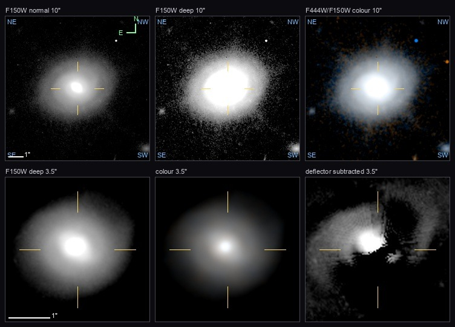{ width="100%" }](img/rank-084-orig.jpg){ target=_blank }
  <figcaption>What the judge saw (blind, footer removed)</figcaption>
</figure>

<figure markdown="span">
  [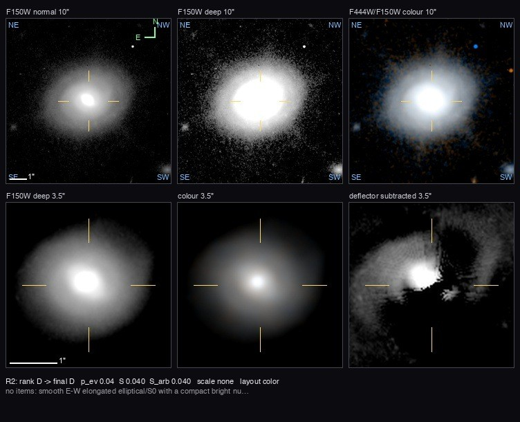{ width="100%" }](img/rank-084-annot.jpg){ target=_blank }
  <figcaption>Advocate evidence (cyan) and critic alternatives coloured by the arbitrator ruling</figcaption>
</figure>

???+ note "Why this grade — advocate, critics, arbitrator"
    **Letter D** (deployed, rule R2) · p_evidence 0.04 · S_arb 0.04 · S 0.04 · scale none

    Letter: letter_rank stands (D rule not met); p_evidence 0.04 < t_B 0.17 (calibrated at 5% FPR on clean negatives) and nothing located: nothing_because “smooth E-W elongated elliptical/S0 with a compact bright nucleus and a large diffuse envelope; no arc, knot or ring located at any radius out to ~5"”.

    **Advocate**

    - criteria: source_contrast 2, low_surface_brightness 2, curvature 0, counter_image 0, arc_morphology 0
    - items: none located
    - nothing_because: “smooth E-W elongated elliptical/S0 with a compact bright nucleus and a large diffuse envelope; no arc, knot or ring located at any radius out to ~5"”
    - scale none; red neighbours within 10 arcsec 1; BCG-like halo yes; deflector is centre no
    - p_evidence: 0.04
    - notes: “Panels (b) and (d) show only a featureless, concentrically brightening envelope out to ~4" with a peaked nucleus slightly (~0.15") off the envelope centroid, and (c)/(e) show a uniform white core with a blue-grey halo and no offset colour-distinct feature; the bright blob plus dark crescent inside r<0.4" in (f) is exactly the off-centre/blended-core dipole plus concentric-ring pattern the VIEW attributes to the circular 1-D subtraction and is traceable in no direct panel, so it is not counted, and the direct panels are saturated only inside ~0.3" where a very small-separation image could hide.”

    **Critics**

    - not called (p_evidence 0.04 < tau0 0.15)

    **Arbitrator**

    - no arbitrator record (not called)

    **Score**

    - S = p_ev = 0.04 (no critic term entered the product)
    - S_arb = p_ev = 0.04 (no critic term entered the product)
    - stored grade_pred (on S): D — S 0.04 < t_B 0.17 (calibrated at 5% FPR on clean negatives) and nothing located: nothing_because “smooth E-W elongated elliptical/S0 with a compact bright nucleus and a large diffuse envelope; no arc, knot or ring located at any radius out to ~5"”
    - stored letter_arb (on S_arb): D; letter_source: opus5_api_calibrated
    - deploy rule R2: letter_rank (advocate only, on p_evidence) = D — p_evidence 0.04 < t_B 0.17 (calibrated at 5% FPR on clean negatives) and nothing located: nothing_because “smooth E-W elongated elliptical/S0 with a compact bright nucleus and a large diffuse envelope; no arc, knot or ring located at any radius out to ~5"”
    - deploy rule R2: letter_final = D — letter_rank stands (D rule not met); p_evidence 0.04 < t_B 0.17 (calibrated at 5% FPR on clean negatives) and nothing located: nothing_because “smooth E-W elongated elliptical/S0 with a compact bright nucleus and a large diffuse envelope; no arc, knot or ring located at any radius out to ~5"”
    - veto: none (letter_final == letter_rank)

---

## Rank 85: J20861957+7726170 {#rank-85}

| Original grade | Passes | Inspector conf. | Pipeline θ_E |
|:--:|:--:|:--:|:--:|
| **U** | — | 25 | 2.00″ |

| New (final) | Rank letter | p_ev | S_arb | Demoted by | Arb. letter | Needs human |
|:--:|:--:|--:|--:|:--|:--:|:--:|
| **D** | C | 0.15 | 0.006 | edge_on_disk (Geo, Mor) | D | no |

<small>pipeline discovery status `new` · scale class `none`</small>

<figure markdown="span">
  [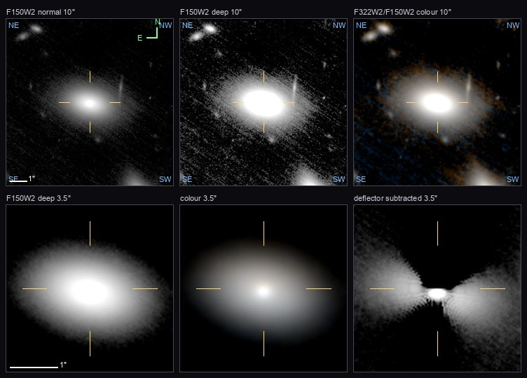{ width="100%" }](img/rank-085-orig.jpg){ target=_blank }
  <figcaption>What the judge saw (blind, footer removed)</figcaption>
</figure>

<figure markdown="span">
  [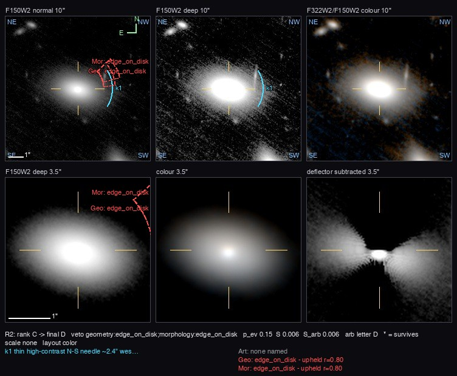{ width="100%" }](img/rank-085-annot.jpg){ target=_blank }
  <figcaption>Advocate evidence (cyan) and critic alternatives coloured by the arbitrator ruling</figcaption>
</figure>

???+ note "Why this grade — advocate, critics, arbitrator"
    **Letter D** (deployed, rule R2) · p_evidence 0.15 · S_arb 0.006 · S 0.006 · scale none

    Letter: D rule: geometry (edge_on_disk) covers every item (a = 1) at r 0.80 >= 0.80 (upheld); morphology (edge_on_disk) covers every item (a = 1) at r 0.80 >= 0.80 (upheld).

    **Advocate**

    - criteria: source_contrast 4, low_surface_brightness 4, curvature 1, counter_image 0, arc_morphology 3
    - items (1):
        - k1 — “thin high-contrast N-S needle ~2.4" west of the nucleus, ~2.5-2.9" long, brighter and much narrower than the deflector halo it sits on; traceable in (a), (b) and (c) (slightly whiter/bluer than the orange halo). Orientation is tangential to the deflector, but its ends lie at r~2.8" while its midpoint lies at r~2.35", i.e. it is a straight chord, not a constant-radius arc; possible edge-on disc / needle galaxy in projection” (panel b, r 2.4 arcsec, PA 238->302, visible in direct: yes; criteria: source_contrast, low_surface_brightness, arc_morphology)
    - scale galaxy; red neighbours within 10 arcsec 2; BCG-like halo no; deflector is centre no; arc radius 2.4 arcsec; arc PA span 238->302
    - p_evidence: 0.15
    - notes: “The only offset feature anywhere in the 10" row is the straight N-S needle at r~2.4" west (PA 238->302); it is tangentially oriented but shows no concavity toward the nucleus (ends at r~2.8", midpoint r~2.35"), has no counter-feature at PA~90 within 40% of that radius, and the 3.5" zoom (d)/(e) shows a perfectly smooth elliptical/S0 with no knot or ring inside 1.75", while (f) shows only the four-lobed butterfly expected from the circular subtraction of an elliptical and is therefore uninformative.”

    **Critics**

    **artifact — no alternative named (nothing in its competence fits)**

    - leaves standing: k1
    - scale_class: galaxy
    - measured: `{"background_1/f_stripe_direction_deg": "~45-65 (the diagonal streaks filling panels a and b); the needle is misaligned with them by ~45 deg", "needle_length_arcsec": "~2.5-2.9", "needle_position_angle_of_long_axis_deg": "~0/180 (N-S), i.e. perpendicular to the radius vector at PA 270", "needle_radius_arcsec": "~2.3-2.9, detached from the core (no ray reaching the nucleus)", "panels_showing_feature": "a (normal), b (deep), c (colour) - present in every direct 10\" panel; falls outside the 3.5\" zoom (d,e,f)"}`
    - notes: “The N-S streak ~2.4" west of the ticked nucleus (right of centre in panels a, b, c) is not radial from the deflector core, so it is not one of the 6 JWST spikes, and its N-S axis is ~45 deg off the diagonal 1/f striping that fills the deep panel, so it is not amplifier striping or a bad column; it repeats in the normal, deep and two-band colour renderings with its own surface-brightness structure and a distinct hue, which a cosmic-ray or persistence residual would not do. I find no instrumental or reduction explanation for item 1; whether it is an edge-on/needle galaxy in projection is a morphology question outside my competence.”
    - ruling: no ruling for this critic

    **geometry — edge_on_disk:** “A projected edge-on disc/needle galaxy west-northwest of the ticked elliptical: a straight, centrally-brightened spindle with tapered ends, whose long axis is not aligned with the local tangential direction about the deflector and which has no counter-image”

    - location: r 1.8-2.6 arcsec, PA 275->312
    - accounts for: k1; leaves standing: none; strength r 0.80; coverage a 1.00 (geometric)
    - scale_class: galaxy
    - measured: `{"axis_minus_tangential_deg": 34, "counter_image_search": "no compact or tangential feature at r=1.8-2.8\", PA 80-140 in panel (b); halo is smooth there", "curvature_centre_offset_arcsec": ">4 (chord is straight to within the ~2 px width; no centre of curvature on the ticked nucleus)", "length_over_radius": "~1.4\" long at r~2.2\", i.e. subtends ~35 deg only, but as a chord not an arc", "local_tangential_PA_at_pa294": "~24/204", "long_axis_PA": "~351/171 (essentially N-S, tilted ~9 deg W of N at the north end)", "needle_endpoints_panel_b": "top ~(335,200) px -> r~2.5\", PA~309; bottom ~(325,265) px -> r~1.8\", PA~277", "profile": "centrally brightened spindle tapering to both ends, brighter and narrower than the surrounding halo - unlike a constant-width arc"}`
    - notes: “In panel (b) the feature west of the ticks runs almost due N-S from (335,200) to (325,265) px, i.e. it is a straight chord whose ends sit at r~2.5" while its midpoint sits at r~1.8-2.0", and its long axis is ~34 deg off the tangential direction at PA~294; it is centrally brightened and tapered like an edge-on spindle, and the halo at the mirror position (r~2.2", PA~110) is featureless, so there is no counter-image.”
    - ruling: upheld, covers k1 — “The sliver west of the ticks in (b) runs essentially due N-S from ~(335,200) to ~(325,265) px, a straight chord whose long axis is ~30 deg off the local tangential direction at PA~290-300, centrally brightened and tapering at both ends like a spindle, with a featureless halo at the mirror position r~2.2", PA~110.”

    **morphology — edge_on_disk:** “A separate thin edge-on disc / needle galaxy projected onto the outer halo of the ticked elliptical: a straight, high-surface-brightness N-S sliver with a slightly brightened middle, not curved about the deflector and with no counter-image on the opposite side.”

    - location: r 1.8-3 arcsec, PA 285->312
    - accounts for: k1; leaves standing: none; strength r 0.80; coverage a 1.00 (geometric)
    - scale_class: galaxy
    - measured: `{"curvature": "none measurable; ends and midpoint lie on a straight chord", "host_zoom_structure": "panels (d) and (e) show a purely smooth elliptical isophote family, no arms, shells, ring or second nucleus within 1.75\"", "local_tangential_direction_deg": "26/206", "misalignment_from_tangential_deg": 26, "pa_deg": 296, "r_arcsec": 2.1, "streak_centre_offset_px": "dx=+87 px W, dy=+42 px N from nucleus in panel (c)", "streak_length_arcsec": 1.3, "streak_position_angle_of_elongation_deg": "~0-5 (N-S)", "streak_width_arcsec": "~0.35 (axis ratio >3:1)"}`
    - notes: “In panel (c) the feature is a straight vertical sliver spanning roughly y=200-260 at x=325-335, i.e. r~2.1" at PA~296, with its long axis at PA~0 while the tangent to the deflector there lies at PA~26 - a chord, not an arc, and it curves nowhere about the nucleus. The 3.5" zooms (d) and (e) show the host as a featureless smooth ellipse, so the sliver is an independent edge-on disc in projection rather than any host structure or a lensed image (no counter-arc appears at PA~116 at the same radius).”
    - ruling: upheld, covers k1 — “In (c) the same vertical sliver (x~325-335, y~200-260, r~2.1", PA~296) is ~0.35" wide with axis ratio >3:1, shows no concavity toward the nucleus, and the 3.5" zooms (d)/(e) show a perfectly smooth elliptical with no ring, knot or counter-arc, consistent with an independent edge-on disc projected on the halo.”

    **Arbitrator**

    - surviving items: none (0 of 1)
    - letter_llm: D; scale_class_final: none; needs_human: no
    - rationale: “The only located item is the thin high-contrast streak ~2.1-2.5" west-northwest of the ticked nucleus, visible in panels (a), (b) and (c) as a nearly vertical sliver at x~325-335 px spanning y~200-265 px. Both critics measured the same pixels and agree it is a straight chord: its endpoints lie at larger radius than its midpoint, its elongation axis is N-S while the tangent to the deflector at that azimuth is ~26 deg, i.e. a 26-34 deg misalignment, and it is centrally brightened and tapered rather than constant-width, exactly the signature of an edge-on disc/needle galaxy in projection at NIRCam resolution. The artifact critic found no instrumental explanation (the streak is neither radial from the core nor aligned with the ~45-65 deg 1/f striping) but named no alternative, so no ruling attaches to it; that only removes a detector origin, not the edge-on-disc origin. There is no counter-image anywhere at r=1.8-2.8", PA 80-140 in the deep panel, the 3.5" zooms (d)/(e) show a purely smooth elliptical isophote family with no arc, knot or ring inside 1.75", and panel (f) shows only the four-lobed butterfly plus concentric rings that the circular profile subtraction of an elliptical galaxy must produce - an artefact of the model, counted neither for nor against. With both alternatives upheld and no items surviving, nothing lensing-like remains; deeper data would not change a chord that is already fully resolved.”

    **Score**

    - S = p_ev x prod(1 - r_i a_i) = 0.15 x (1 - 0.80x1.00) x (1 - 0.80x1.00) = 0.006
        - terms: geometry edge_on_disk r 0.80 a 1.00; morphology edge_on_disk r 0.80 a 1.00
    - S_arb = p_ev x prod_{upheld/partial}(1 - r_i a_i') = 0.15 x (1 - 0.80x1.00) x (1 - 0.80x1.00) = 0.006
        - terms: geometry edge_on_disk r 0.80 a 1.00 (upheld); morphology edge_on_disk r 0.80 a 1.00 (upheld)
    - stored grade_pred (on S): D — S 0.006 < t_B 0.17 (calibrated at 5% FPR on clean negatives) and geometry (edge_on_disk) covers every item at r 0.80 >= 0.80; morphology (edge_on_disk) covers every item at r 0.80 >= 0.80
    - stored letter_arb (on S_arb): D; letter_source: opus5_api_calibrated
    - deploy rule R2: letter_rank (advocate only, on p_evidence) = C — p_evidence 0.15 < t_B 0.17 (calibrated at 5% FPR on clean negatives); not D: 1 item(s) located; no named critic covers every item at r >= 0.80
    - deploy rule R2: letter_final = D — D rule: geometry (edge_on_disk) covers every item (a = 1) at r 0.80 >= 0.80 (upheld); morphology (edge_on_disk) covers every item (a = 1) at r 0.80 >= 0.80 (upheld)
    - veto: geometry:edge_on_disk;morphology:edge_on_disk

---

## Rank 86: J21518078+5278672 {#rank-86}

| Original grade | Passes | Inspector conf. | Pipeline θ_E |
|:--:|:--:|:--:|:--:|
| **U** | — | 25 | — |

| New (final) | Rank letter | p_ev | S_arb | Demoted by | Arb. letter | Needs human |
|:--:|:--:|--:|--:|:--|:--:|:--:|
| **C** | C | 0.10 | 0.100 | — | — | no |

<small>pipeline discovery status `new` · scale class `galaxy`</small>

<figure markdown="span">
  [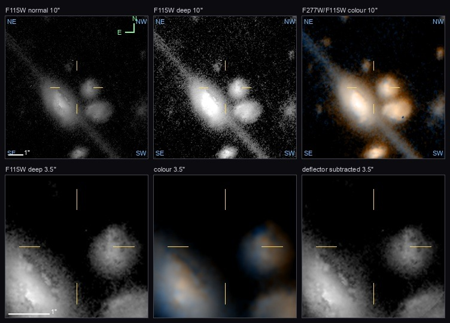{ width="100%" }](img/rank-086-orig.jpg){ target=_blank }
  <figcaption>What the judge saw (blind, footer removed)</figcaption>
</figure>

<figure markdown="span">
  [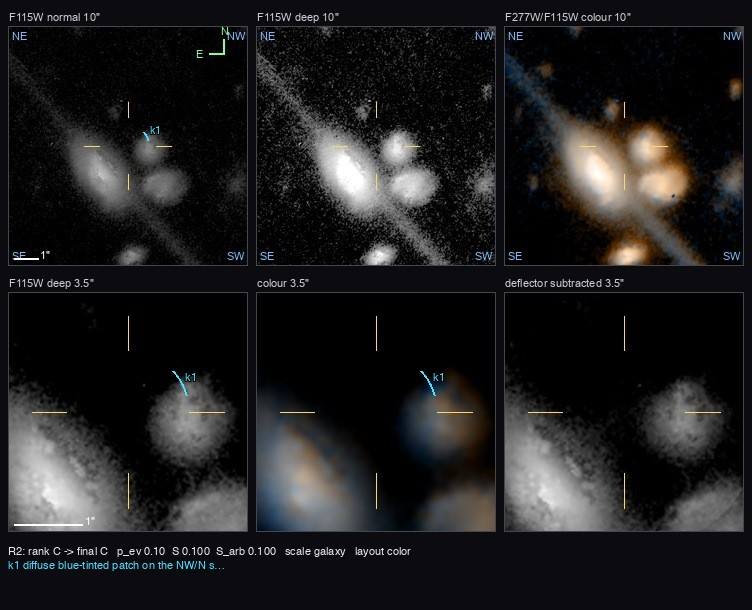{ width="100%" }](img/rank-086-annot.jpg){ target=_blank }
  <figcaption>Advocate evidence (cyan) and critic alternatives coloured by the arbitrator ruling</figcaption>
</figure>

???+ note "Why this grade — advocate, critics, arbitrator"
    **Letter C** (deployed, rule R2) · p_evidence 0.10 · S_arb 0.10 · S 0.10 · scale galaxy

    Letter: letter_rank stands (D rule not met); p_evidence 0.10 < t_B 0.17 (calibrated at 5% FPR on clean negatives); not D: 1 item(s) located; no named critic covers every item at r >= 0.80.

    **Advocate**

    - criteria: source_contrast 4, low_surface_brightness 3, curvature 1, counter_image 1, arc_morphology 1
    - items (1):
        - k1 — “diffuse blue-tinted patch on the NW/N side of the compact companion, offset ~0.9" from the tick centre; colour clearly bluer than the orange group members in (c)/(e), extended rather than point-like, but no tangential elongation and no measurable centre of curvature” (panel e, r 0.9 arcsec, PA 285->312, visible in direct: yes; criteria: source_contrast, low_surface_brightness)
    - scale galaxy; red neighbours within 10 arcsec 4; BCG-like halo yes; deflector is centre no
    - p_evidence: 0.10
    - notes: “The field is a compact group of 4-5 orange blobs plus a long straight blue band running NE-corner to SW-corner across all of (a)/(b)/(c) (edge-on disc or spike), and the only non-red feature near the ticks - the blue patch at r~0.9", PA~300 in (e) - lies exactly on that straight band's track, with no fixed-radius tangential arc and no opposite counter-image anywhere out to 5"; panel (f) shows only the un-subtracted companions and no offset tangential residual.”

    **Critics**

    - not called (p_evidence 0.10 < tau0 0.15)

    **Arbitrator**

    - no arbitrator record (not called)

    **Score**

    - S = p_ev = 0.10 (no critic term entered the product)
    - S_arb = p_ev = 0.10 (no critic term entered the product)
    - stored grade_pred (on S): C — S 0.10 < t_B 0.17 (calibrated at 5% FPR on clean negatives); not D: 1 item(s) located; no named critic covers every item at r >= 0.80
    - stored letter_arb (on S_arb): C; letter_source: opus5_api_calibrated
    - deploy rule R2: letter_rank (advocate only, on p_evidence) = C — p_evidence 0.10 < t_B 0.17 (calibrated at 5% FPR on clean negatives); not D: 1 item(s) located; no named critic covers every item at r >= 0.80
    - deploy rule R2: letter_final = C — letter_rank stands (D rule not met); p_evidence 0.10 < t_B 0.17 (calibrated at 5% FPR on clean negatives); not D: 1 item(s) located; no named critic covers every item at r >= 0.80
    - veto: none (letter_final == letter_rank)

---

## Rank 87: J26816024+6505016 {#rank-87}

| Original grade | Passes | Inspector conf. | Pipeline θ_E |
|:--:|:--:|:--:|:--:|
| **U** | — | 25 | 0.82″ |

| New (final) | Rank letter | p_ev | S_arb | Demoted by | Arb. letter | Needs human |
|:--:|:--:|--:|--:|:--|:--:|:--:|
| **D** | C | 0.15 | 0.012 | spiral_arm (Mor) | D | no |

<small>pipeline discovery status `new` · scale class `none`</small>

<figure markdown="span">
  [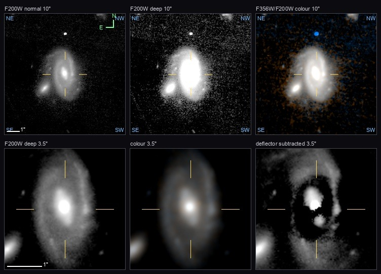{ width="100%" }](img/rank-087-orig.jpg){ target=_blank }
  <figcaption>What the judge saw (blind, footer removed)</figcaption>
</figure>

<figure markdown="span">
  [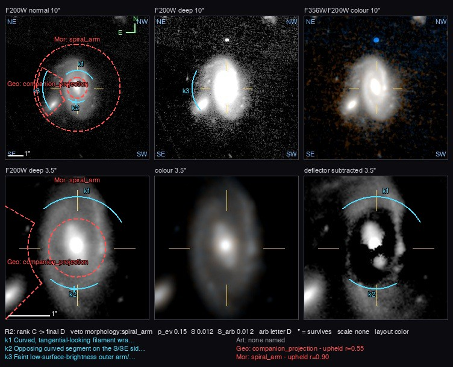{ width="100%" }](img/rank-087-annot.jpg){ target=_blank }
  <figcaption>Advocate evidence (cyan) and critic alternatives coloured by the arbitrator ruling</figcaption>
</figure>

???+ note "Why this grade — advocate, critics, arbitrator"
    **Letter D** (deployed, rule R2) · p_evidence 0.15 · S_arb 0.012 · S 0.012 · scale none

    Letter: D rule: morphology (spiral_arm) covers every item (a = 1) at r 0.90 >= 0.80 (upheld).

    **Advocate**

    - criteria: source_contrast 2, low_surface_brightness 6, curvature 5, counter_image 3, arc_morphology 3
    - items (3):
        - k1 — “Curved, tangential-looking filament wrapping the N/NW side of the ticked galaxy at roughly constant radius; brightest in the subtracted residual (f) as an offset arc-shaped ridge, and traceable in the deep zoom (d) and in (a) as the upper edge of the oval ring/arm structure around the bright bar” (panel f, r 1.25 arcsec, PA 300->40, visible in direct: yes; criteria: curvature, arc_morphology)
        - k2 — “Opposing curved segment on the S/SE side at a similar radius (the lower half of the same oval ring/arm system), appearing in (f) as a bright residual blob plus ridge and in (d) as the lower rim of the ring; roughly point-symmetric to item 1” (panel f, r 1 arcsec, PA 140->210, visible in direct: yes; criteria: curvature, counter_image)
        - k3 — “Faint low-surface-brightness outer arm/plume curving from E round to NE at larger radius, seen in the 10" deep panel (b) beyond the bright body” (panel b, r 2.4 arcsec, PA 60->130, visible in direct: yes; criteria: low_surface_brightness)
    - scale galaxy; red neighbours within 10 arcsec 2; BCG-like halo no; deflector is centre yes; arc radius 1.25 arcsec; arc PA span 300->40; counter-image at r 1 arcsec PA 175; centre-of-curvature offset 0.15 arcsec
    - p_evidence: 0.15
    - notes: “The curved features form a closed, symmetric oval ring around the bright inner bar, share the deflector's white/orange two-band colour and surface-brightness profile, and connect continuously to the bar ends in (d), so they read far more like an inner ring / spiral arms of an inclined barred disc than as offset lensed images; the (f) bowtie and concentric dark ring are subtraction artefacts and were not counted.”

    **Critics**

    **artifact — no alternative named (nothing in its competence fits)**

    - leaves standing: k1, k2, k3
    - scale_class: galaxy
    - measured: `{"background_uniformity": "no 1/f striping or coverage edge across the 10\" field", "f_panel_artefact_inventory": "dark annulus r~0.5-0.9\" plus bright inner lobes and the near-symmetric bowtie about the core in (f) are the expected circular-profile over/under-subtraction of an elongated, barred galaxy - not counted either way", "item1_traceable_in_direct": "yes - the N/NW ridge at r~1.2\", PA 300->40 is present as the upper rim of the oval ring in (d) and (e) and in (a), so it is not a subtraction residual", "item2_traceable_in_direct": "yes - S/SE rim at r~1.0\", PA 140->210 seen in (d) deep zoom and faintly in (a); the bright compact residual blob in (f) at r~0.4\", PA~200 sits on the bar/nucleus region where the 1-D circular model under-subtracts, but the extended rim itself is direct-visible", "nearest_bright_point_source": "unsaturated star at r~4.2\", PA~352 in (a)/(b) with no visible 6-spike pattern; no spike, wing, snowball, stripe, seam or persistence feature crosses r=1-2.5\" at any of the cited PAs"}`
    - notes: “In panel (f) the only patterns attributable to the reduction are the dark annulus and near-symmetric bright inner lobes about the tick centre, which are the standard circular-profile artefacts on an inclined barred galaxy; the N/NW ridge (r~1.2", PA 300->40) and S/SE rim (r~1.0", PA 140->210) are both directly traceable in the un-subtracted deep zoom (d) and in (a), and the r~2.4" E-to-NE plume in (b) lies far from the single field star at PA~352, r~4.2", which shows no diffraction spikes. No instrumental or reduction alternative fits any of the three items.”
    - ruling: no ruling for this critic

    **geometry — companion_projection:** “The E/NE 'outer arm/plume' region contains two unrelated neighbours rather than a lensed image: a distinct galaxy with its own compact core at r~1.9", PA~123 (bright blob at lower-left of panel d, also in b and e) and a small compact knot at r~1.3-1.5", PA~70 (upper-left of panel d); both are elongated along their own axes, not tangentially about the ticked galaxy, and neither has a counterpart at a compatible radius on the opposite side.”

    - location: r 1.2-2.8 arcsec, PA 60->135
    - accounts for: k3; leaves standing: k1, k2; strength r 0.55; coverage a 0.333 (geometric)
    - scale_class: galaxy
    - measured: `{"centre_of_curvature_offset_items_1_2_arcsec": "<=0.1 (both segments concentric with the nucleus)", "companion_position": "r ~1.9\", PA ~123 deg, compact core, own elongation PA ~45", "counter_image_for_item_3": "none detected at r 2.2-2.6\", PA 240-310 in panel (b)", "items_1_2_continuity": "one closed loop - the N segment (PA 300->40) and S segment (PA 140->210) join continuously through PA~90 and PA~270 in panel (d); no gaps, no thin isolated arc", "loop_axis_ratio_and_PA": "b/a ~ 0.6, major axis PA ~ 5 deg", "outer_isophote_axis_ratio_and_PA": "b/a ~ 0.6, major axis PA ~ 5 deg (same as the loop)", "surface_brightness_match": "N and S segments of equal width (~0.3\") and equal brightness, same as the surrounding body in (d) and same grey-white hue in (e)"}`
    - notes: “In panel (b) and (d) the E/NE side at r~1.9-2.5" is occupied by a separate galaxy with its own nucleus (PA~123) and a small knot at PA~70, with nothing matching at PA~240-310, so item 3 is a projection, not a counter-arc. Items 1 and 2 are two halves of a single closed, concentric ellipse (b/a and PA identical to the outer isophotes) rather than two separate tangential images; whether that ellipse is the host's own inner ring/arms is the morphology critic's call, so I leave them standing.”
    - ruling: upheld, covers k3 — “Panels (b) and (d) show a discrete neighbour with its own compact core at lower-left (r~1.9", PA~123) plus a small knot to the E, elongated along their own axes with nothing at the mirror PA 240-310, so the E/NE 'plume' of item 3 is projection, not a counter-arc.”

    **morphology — spiral_arm:** “The ticked object is a barred/oval spiral disc seen at moderate inclination: a bright elongated bar/nucleus at the tick centre feeds a closed inner pseudo-ring of arms (the N/NW and S/SE 'arcs'), which unwind into the low-surface-brightness outer arms visible in the 10" colour panel; a nearby SE companion sits ~2.5-3" away.”

    - location: r 0.7-3 arcsec, PA 0->360
    - accounts for: k1, k2, k3; leaves standing: none; strength r 0.90; coverage a 1.00 (geometric)
    - scale_class: galaxy
    - measured: `{"arc_width_vs_radius": "ridge width ~0.5-0.6\", comparable to its radius - far too thick for an Einstein arc", "bridge_test": "both inner ridges connect continuously to the ends of the bright N-S bar/bulge in (d); no gap between arc and nucleus", "inner_arm_radius_vs_angle": "in (d)/(e) the NW ridge sits ~1.2-1.4\" from the core at PA~320-350 but the same ridge is only ~0.8-0.9\" at PA~200-230, i.e. radius grows monotonically along the ridge - not constant-radius", "outer_arm": "in (c) a faint arm sweeps from PA~60 at r~2.4\" round to the NW at r~3\", clearly attached to the inner ring", "profile_test": "arcs have the same smooth, low-contrast surface brightness and same grey/warm hue as the disc in (e), no thin high-contrast tangential ribbon"}`
    - notes: “In (d) and (e) the 'oval ring' is the inner arm pair of a barred spiral: it joins the bar ends continuously at PA~350 and PA~170 with no break, and its distance from the nucleus increases from ~0.8" in the S to ~1.4" in the NW. Panel (c) shows the same pattern unwinding into full outer arms out to ~3", with a companion galaxy to the SE - a textbook spiral, not a lensed ring.”
    - ruling: upheld, covers k1, k2, k3 — “In (d) and (e) the bright N-S bar/bulge runs continuously into the N/NW and S/SE ridges with no break, the ridge radius grows from ~0.8" in the S to ~1.4" in the NW, its width (~0.5") is comparable to its radius, and (c) shows the same pattern unwinding into faint outer arms out to ~3" - a barred/oval spiral with an inner pseudo-ring.”

    **Arbitrator**

    - surviving items: none (0 of 3)
    - letter_llm: D; scale_class_final: none; needs_human: no
    - rationale: “The ticked object is unambiguously resolved by NIRCam as an inclined barred/oval spiral: the zoom panels (d) and (e) show a bright elongated bar through the tick centre whose ends join, without any gap or surface-brightness discontinuity, into a closed oval of arms - the N/NW ridge at PA~300-40 and the S/SE ridge at PA~140-210 that the scorer listed as items 1 and 2 are simply the two halves of that one loop, sharing the disc's grey/warm two-band hue, its axis ratio (b/a~0.6) and position angle (~5 deg), with a ridge width comparable to its radius and a radius that grows monotonically along the ridge rather than staying constant. The bright inner blobs, dark annulus and bowtie in (f) are the expected circular-profile artefacts on such an elongated barred galaxy and carry no weight either way. Item 3, the faint E/NE feature at r~2.4", is accounted for twice over - as the outer arm unwinding from the inner ring in (c) and as the discrete companion with its own nucleus visible at lower-left of (b)/(d) - and it has no counterpart at PA 240-310. The artifact critic found no instrumental explanation, which is consistent: this is real astrophysical spiral structure, not a residual or spike. With every located item accounted for by an upheld alternative, nothing tangential and offset survives, and no deeper data are needed to settle it.”

    **Score**

    - S = p_ev x prod(1 - r_i a_i) = 0.15 x (1 - 0.55x0.333) x (1 - 0.90x1.00) = 0.012
        - terms: geometry companion_projection r 0.55 a 0.333; morphology spiral_arm r 0.90 a 1.00
    - S_arb = p_ev x prod_{upheld/partial}(1 - r_i a_i') = 0.15 x (1 - 0.55x0.333) x (1 - 0.90x1.00) = 0.012
        - terms: geometry companion_projection r 0.55 a 0.333 (upheld); morphology spiral_arm r 0.90 a 1.00 (upheld)
    - stored grade_pred (on S): D — S 0.012 < t_B 0.17 (calibrated at 5% FPR on clean negatives) and morphology (spiral_arm) covers every item at r 0.90 >= 0.80
    - stored letter_arb (on S_arb): D; letter_source: opus5_api_calibrated
    - deploy rule R2: letter_rank (advocate only, on p_evidence) = C — p_evidence 0.15 < t_B 0.17 (calibrated at 5% FPR on clean negatives); not D: 3 item(s) located; no named critic covers every item at r >= 0.80
    - deploy rule R2: letter_final = D — D rule: morphology (spiral_arm) covers every item (a = 1) at r 0.90 >= 0.80 (upheld)
    - veto: morphology:spiral_arm

---

## Rank 88: J32840780+1769774 {#rank-88}

| Original grade | Passes | Inspector conf. | Pipeline θ_E |
|:--:|:--:|:--:|:--:|
| **U** | — | 25 | 1.45″ |

| New (final) | Rank letter | p_ev | S_arb | Demoted by | Arb. letter | Needs human |
|:--:|:--:|--:|--:|:--|:--:|:--:|
| **B** | B | 0.20 | 0.068 | — | C | no |

<small>pipeline discovery status `new` · scale class `galaxy`</small>

<figure markdown="span">
  [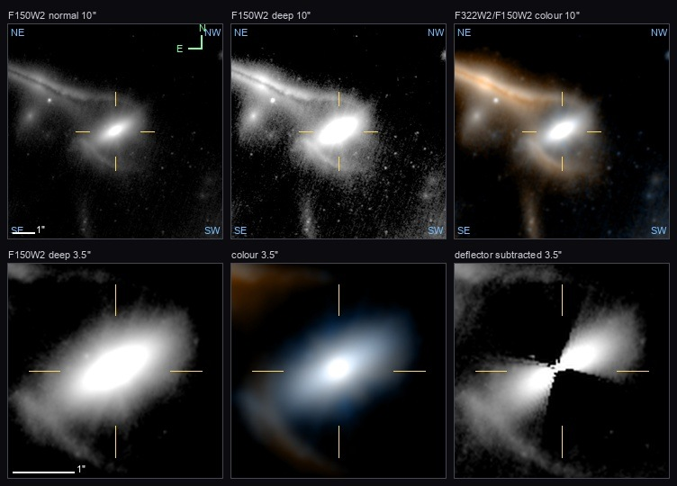{ width="100%" }](img/rank-088-orig.jpg){ target=_blank }
  <figcaption>What the judge saw (blind, footer removed)</figcaption>
</figure>

<figure markdown="span">
  [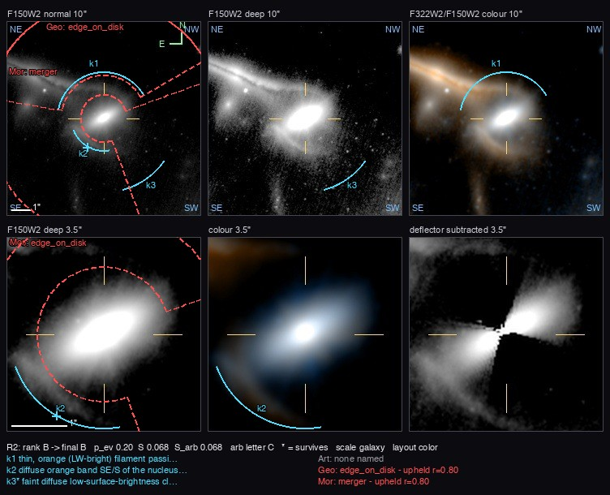{ width="100%" }](img/rank-088-annot.jpg){ target=_blank }
  <figcaption>Advocate evidence (cyan) and critic alternatives coloured by the arbitrator ruling</figcaption>
</figure>

???+ note "Why this grade — advocate, critics, arbitrator"
    **Letter B** (deployed, rule R2) · p_evidence 0.20 · S_arb 0.068 · S 0.068 · scale galaxy

    Letter: letter_rank stands (D rule not met); p_evidence 0.20 >= t_A 0.20 (calibrated at 1% FPR on clean negatives) but A is blocked: only 0 of 3 configuration criteria >= 6; p_evidence 0.20 >= t_B 0.17 (calibrated at 5% FPR on clean negatives).

    **Advocate**

    - criteria: source_contrast 6, low_surface_brightness 7, curvature 3, counter_image 4, arc_morphology 3
    - items (3):
        - k1 — “thin, orange (LW-bright) filament passing north of the ticked galaxy; clearest in the deep and colour 10" panels, traceable from the E edge over the top of the galaxy to the NW corner, closest approach ~2.2"” (panel c, r 2.4 arcsec, PA 300->80, visible in direct: yes; criteria: source_contrast, low_surface_brightness)
        - k2 — “diffuse orange band SE/S of the nucleus in the colour zoom, curved with its concave side toward the galaxy, same hue as item 1 and roughly opposite it at a comparable radius” (panel e, r 1.7 arcsec, PA 110->190, visible in direct: yes; criteria: source_contrast, low_surface_brightness, counter_image)
        - k3 — “faint diffuse low-surface-brightness clump SW of the galaxy in the deep 10" panel, no tangential elongation resolved” (panel b, r 3.8 arcsec, PA 195->235, visible in direct: yes; criteria: low_surface_brightness)
    - scale galaxy; red neighbours within 10 arcsec 1; BCG-like halo yes; deflector is centre no; arc radius 2.2 arcsec; arc PA span 300->80; counter-image at r 1.7 arcsec PA 150; centre-of-curvature offset 4 arcsec
    - p_evidence: 0.20
    - notes: “The northern orange filament is continuous across the full 10" field (panels a/b/c), i.e. >8" long and only weakly bent, so it fails the fixed-radius test for an arc of r~2.4", and the southern orange band in (e) at r~1.7" has a centre of curvature displaced ~4" from the ticks; the two orange features do straddle the whitish nucleus at comparable radii and share a hue clearly distinct from it, which is the only test the set passes, and the direct zoom panels are heavily saturated inside ~1" so a compact inner image could not be seen.”

    **Critics**

    **artifact — no alternative named (nothing in its competence fits)**

    - leaves standing: k1, k2, k3
    - scale_class: galaxy
    - measured: `{"item1_azimuthal_extent": "~140 deg of arc (PA 300 -> 80) at r = 2.2-3.5\", i.e. curved, not a straight ray from any point source; width ~0.3\" with an embedded knot near PA 55, r~3\"", "item1_direct_traceability": "present in (a) normal, (b) deep and (c) colour 10\" panels at identical PA - cannot be a subtraction residual (absent-from-direct test fails)", "item2_direct_traceability": "the SE/S orange band at r~1.7\" is also present as diffuse light in the un-subtracted deep zoom (d), bottom-left of the ticks", "panel_f_content": "only the four-lobed butterfly plus inner dipole aligned with the galaxy major axis (PA ~60/240) - the declared artefact of the circular 1-D profile subtraction; no offset feature at constant radius was used as an item", "striping_or_seams": "no 1/f row/column striping, no mosaic seam, no snowball or persistence ring inside the 10\" field", "visible_diffraction_spikes": "0 - no straight 6-ray pattern anywhere in (a) or (b); the bright core is unsaturated in (a) and produces no radial rays"}`
    - notes: “Nothing in my competence explains any item: the north filament (item 1) curves through ~140 deg of azimuth in (a), (b) and (c) alike and contains a compact knot near PA 55, r~3", so it is neither a straight diffraction spike nor a cosmic-ray/satellite streak, and being present in every un-subtracted panel it cannot be a subtraction residual; panel (f) shows only the declared circular-profile butterfly/dipole, which I do not count either way.”
    - ruling: no ruling for this critic

    **geometry — edge_on_disk:** “The 'arc' north of the ticked galaxy is a long, straight, thin needle - an edge-on disc/streak (with a bright knot on it at ~3.5" NE) that crosses the whole 10" field from the east edge to the NW corner, merely passing 2.2" north of the deflector at closest approach; it is not a tangential feature at fixed radius.”

    - location: r 2.2-6 arcsec, PA 300->80
    - accounts for: k1; leaves standing: k2, k3; strength r 0.80; coverage a 0.333 (geometric)
    - scale_class: galaxy
    - measured: `{"closest_approach_of_filament_arcsec": 2.2, "counter_image_test_item2": "item 2 is a broad diffuse band (width ~0.6\", r=1.7\", PA 110-190) whose surface-brightness profile does not match the thin high-contrast ridge of item 1 and sits at a different radius; no matched-profile counter-image at compatible radius", "curvature_about_deflector": "none detectable; ridge line straight to within ~0.2\" over 9\", centre of curvature not on the ticked galaxy (offset unbounded)", "item3_elongation": "unresolved round clump at r=3.8\", no tangential axis ratio measured", "radius_change_along_feature_arcsec": "2.2 -> 5+ at both ends, i.e. NOT constant radius", "tangential_elongation_item1": "elongation is along a fixed straight PA (~75/255), not perpendicular to the radius vector over the 140 deg span claimed", "traced_length_arcsec": "~9 (from r~5 at PA~80 to r~5 at PA~310) in panel (b)"}`
    - notes: “In panel (b) the northern feature is a knife-straight ridge running from the east edge (r~5", PA~80) over the top of the ticked galaxy to the NW corner (r~5", PA~310), with a compact knot on it in the NE - its radius from the deflector varies from 2.2" to >5", so it is a projected edge-on disc/streak, not an arc; the NE-corner orange in panel (e) is just this streak clipping the 3.5" zoom. Item 2 (diffuse band at r~1.7", PA 110-190 in (e)) and item 3 (SW clump at 3.8") are not explained by it and lack any matched-profile counterpart.”
    - ruling: upheld, covers k1 — “In (a) and (b) the northern orange filament is a knife-straight ridge entering at the E edge (r~5", PA~80), skimming 2.2" north of the ticks and exiting at the NW corner (r~5", PA~310), with a compact knot on it in the NE - its radius from the deflector more than doubles along its length, so it is a projected edge-on streak, not a fixed-radius tangential arc.”

    **morphology — merger:** “Extended tidal/interaction debris of a large disturbed system overlapping the ticked galaxy: one narrow orange streak that enters at the E edge of the 10" panel, skims ~2.2" north of the nucleus and continues to the NW corner, plus a broad diffuse orange fan filling the E/SE quadrant whose inner edge is the 'arc' in the colour zoom and which runs south as a plume off the bottom of the 10" field.”

    - location: r 1.2-6 arcsec, PA 290->200
    - accounts for: k1, k2; leaves standing: k3; strength r 0.80; coverage a 0.667 (geometric)
    - scale_class: galaxy
    - measured: `{"host_profile": "ticked galaxy in (d) is a smooth elongated bulge, PA ~135/315, with no spiral arms, no knots and no closed ring centred on its nucleus", "item1_curvature": "no tangential curvature about the tick centre; the streak is essentially rectilinear over ~10\" in panel (c)", "item1_radius_vs_angle": "closest approach ~2.2\" near PA 350, but r grows to >5\" at PA ~90 (E edge) and to >5\" at PA ~305 (NW corner) - a straight streak, not constant radius", "item2_extent": "the SE/S orange band in panel (e) at ~1.7\" is continuous in panel (c) with diffuse orange emission covering the whole SE quadrant out to >5\" and a plume reaching the S field edge - it is the bright inner edge of a fan, not a thin arc (width ~ its radius)"}`
    - notes: “In panel (c) the northern orange filament runs from the E edge across the top to the NW corner with monotonically increasing radius either side of PA~350 - a straight streak passing in projection, not a tangential arc; the 'counter-arc' at PA 110-190 in (e) is simply the illuminated inner edge of the broad orange fan that fills the SE quadrant of (c) and trails south off the field, i.e. tidal/interaction debris, not a fixed-radius pair. The faint SW clump (item 3) at ~3.8" is outside this structure and is left standing.”
    - ruling: upheld, covers k1, k2 — “Panel (c) shows the same rectilinear streak continuous with a broad diffuse orange fan filling the E/SE quadrant out to >5" and trailing south off the field; the 'counter-arc' at PA 110-190, r~1.7" in (e) is just the bright inner edge of that fan (width comparable to its radius), i.e. interaction debris rather than a matched-profile counter-image.”

    **Arbitrator**

    - surviving items: k3 (1 of 3)
    - letter_llm: C; scale_class_final: galaxy; needs_human: no
    - rationale: “The two orange features that carried this candidate are both explained by projected/tidal structure rather than lensing: in panels (a), (b) and (c) the northern filament runs essentially straight for ~9" from the east edge over the top of the ticked galaxy to the NW corner, its distance from the ticks growing from 2.2" to >5" at both ends and its position angle fixed near 75/255 deg - no tangential curvature about the deflector, and a compact knot sits on it in the NE, so both the edge_on_disk and merger readings are supported by the pixels; the SE/S orange band in (e) is not a thin counter-arc but the illuminated inner edge of the broad orange fan that fills the SE quadrant of (c) and plumes off the south edge, its width comparable to its radius and its centre of curvature displaced ~4" from the ticks. Panel (f) contains only the declared four-lobed butterfly and inner dipole of the circular 1-D profile subtraction on an obviously elliptical bulge (PA ~135/315), which counts neither way. All that survives is item 3, a round, unresolved low-surface-brightness clump 3.8" SW in the deep panel with no tangential elongation and no counterpart - consistent with a chance projection and no support for a lens on its own; hue similarity between the two orange features is colour alone and cannot decide the case. The letter stays at C only because that unexplained clump was located, but the case is effectively a non-lens and deeper data would not change the straight-line geometry.”

    **Score**

    - S = p_ev x prod(1 - r_i a_i) = 0.20 x (1 - 0.80x0.333) x (1 - 0.80x0.667) = 0.068
        - terms: geometry edge_on_disk r 0.80 a 0.333; morphology merger r 0.80 a 0.667
    - S_arb = p_ev x prod_{upheld/partial}(1 - r_i a_i') = 0.20 x (1 - 0.80x0.333) x (1 - 0.80x0.667) = 0.068
        - terms: geometry edge_on_disk r 0.80 a 0.333 (upheld); morphology merger r 0.80 a 0.667 (upheld)
    - stored grade_pred (on S): C — S 0.068 < t_B 0.17 (calibrated at 5% FPR on clean negatives); not D: 3 item(s) located; no named critic covers every item at r >= 0.80
    - stored letter_arb (on S_arb): C; letter_source: opus5_api_calibrated
    - deploy rule R2: letter_rank (advocate only, on p_evidence) = B — p_evidence 0.20 >= t_A 0.20 (calibrated at 1% FPR on clean negatives) but A is blocked: only 0 of 3 configuration criteria >= 6; p_evidence 0.20 >= t_B 0.17 (calibrated at 5% FPR on clean negatives)
    - deploy rule R2: letter_final = B — letter_rank stands (D rule not met); p_evidence 0.20 >= t_A 0.20 (calibrated at 1% FPR on clean negatives) but A is blocked: only 0 of 3 configuration criteria >= 6; p_evidence 0.20 >= t_B 0.17 (calibrated at 5% FPR on clean negatives)
    - veto: none (letter_final == letter_rank)

---

## Rank 89: J9003772-2015513 {#rank-89}

| Original grade | Passes | Inspector conf. | Pipeline θ_E |
|:--:|:--:|:--:|:--:|
| **U** | — | 25 | 1.15″ |

| New (final) | Rank letter | p_ev | S_arb | Demoted by | Arb. letter | Needs human |
|:--:|:--:|--:|--:|:--|:--:|:--:|
| **C** | C | 0.15 | 0.021 | — | D | no |

<small>pipeline discovery status `new` · scale class `galaxy`</small>

<figure markdown="span">
  [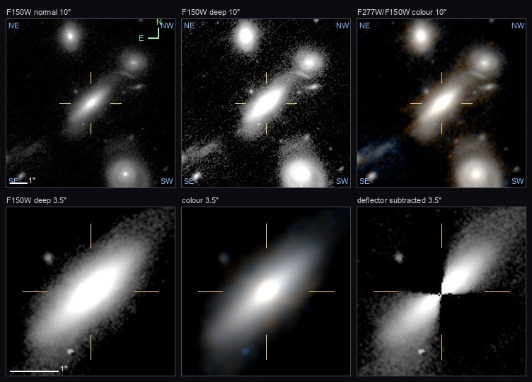{ width="100%" }](img/rank-089-orig.jpg){ target=_blank }
  <figcaption>What the judge saw (blind, footer removed)</figcaption>
</figure>

<figure markdown="span">
  [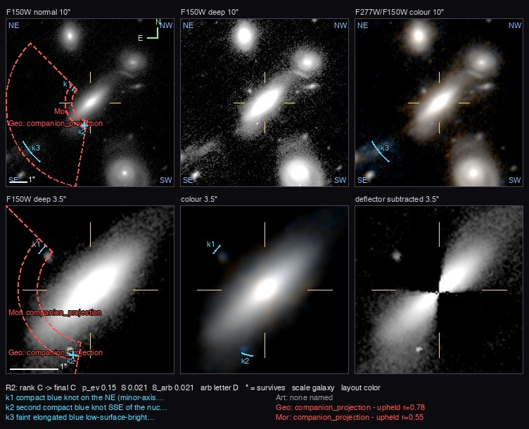{ width="100%" }](img/rank-089-annot.jpg){ target=_blank }
  <figcaption>Advocate evidence (cyan) and critic alternatives coloured by the arbitrator ruling</figcaption>
</figure>

???+ note "Why this grade — advocate, critics, arbitrator"
    **Letter C** (deployed, rule R2) · p_evidence 0.15 · S_arb 0.021 · S 0.021 · scale galaxy

    Letter: letter_rank stands (D rule not met); p_evidence 0.15 < t_B 0.17 (calibrated at 5% FPR on clean negatives); not D: 3 item(s) located; no named critic covers every item at r >= 0.80.

    **Advocate**

    - criteria: source_contrast 5, low_surface_brightness 3, curvature 1, counter_image 3, arc_morphology 1
    - items (3):
        - k1 — “compact blue knot on the NE (minor-axis) side of the deflector, point-like, clearly bluer than the orange/tan galaxy light in the colour zoom, sitting just outside the bright isophotes; also survives as a discrete positive residual in (f) that is NOT mirrored across the nucleus” (panel e, r 1.3 arcsec, PA 45->55, visible in direct: yes; criteria: source_contrast, counter_image)
        - k2 — “second compact blue knot SSE of the nucleus at a similar radius (radius ratio 1.11 to item 1), same bluish hue and same near-point profile, distinct from the galaxy's smooth envelope in (d) and (e)” (panel e, r 1.4 arcsec, PA 160->170, visible in direct: yes; criteria: source_contrast, counter_image)
        - k3 — “faint elongated blue low-surface-brightness streak in the SE quadrant of the 10" field, distinctly bluer than the deflector and than the bright neighbours; straight, running roughly radially (toward NW) rather than tangentially, extending out of the frame” (panel c, r 4.6 arcsec, PA 120->140, visible in direct: yes; criteria: source_contrast, low_surface_brightness)
    - scale galaxy; red neighbours within 10 arcsec 2; BCG-like halo no; deflector is centre no; counter-image at r 1.4 arcsec PA 165
    - p_evidence: 0.15
    - notes: “The ticked object is a highly inclined disc/S0 with major axis PA~315-135 (the strong bowtie in (f) is exactly the circular-model artefact on such an elongated galaxy and is not counted); the only located features are two compact blue knots at r=1.3" PA~50 and r=1.4" PA~165 in (d)/(e) - similar radii but separated by only ~115 degrees, not straddling the nucleus - plus a straight, radially oriented blue streak 4.6" to the SE; nowhere in (a)-(f) is there a tangentially elongated feature at constant radius.”

    **Critics**

    **artifact — no alternative named (nothing in its competence fits)**

    - leaves standing: k1, k2, k3
    - scale_class: galaxy
    - measured: `{"bright_star_position": "bright halo-ed point source at r~5.2\", PA~226 (SW quadrant of the 10\" panels)", "item1_traceability": "compact source at r~1.3\", PA~50 also present as a discrete dot in the un-subtracted deep zoom (d) and colour zoom (e), so it is not a subtraction residual", "item2_traceability": "compact source at r~1.4\", PA~165 likewise present in (d) and (e)", "panel_f_residual_pattern": "four-lobed bowtie aligned with the galaxy major axis (positive lobes toward PA~135 and PA~315, negative wedge toward PA~45/225) - exactly the artefact the circular 1-D subtraction is stated to produce; not citable and not an item", "spike_test_item3": "vector from that star to the item-3 streak is PA~85 (nearly due E), while the streak itself is oriented ~130/310 - a ~45 deg mismatch, so the streak is not radial from the star and cannot be one of its six spikes; no straight-edge, row/column striping, seam or snowball morphology anywhere in the 10\" field"}`
    - notes: “The only instrumental pattern I can point at is the bowtie/negative wedge in (f) along the major axis, which the view description already assigns to the circular profile subtraction; both knots (r~1.3", PA~50 and r~1.4", PA~165) are visible as discrete dots in the un-subtracted panels (d)/(e), so subtraction_residual is inadmissible for them. The SE streak at r~4.6", PA 120-140 is not radial from the bright SW star at PA~226 (star-to-streak direction PA~85 vs streak axis ~130/310), and shows no seam, stripe or snowball signature, so I have no artefact explanation for any of the three items.”
    - ruling: no ruling for this critic

    **geometry — companion_projection:** “Two unrelated compact blue sources projected on the outskirts of an inclined disc galaxy (they are not an anti-aligned image pair and show no tangential elongation), plus a separate faint edge-on field galaxy 4.6" to the SE whose long axis points radially back at the ticked galaxy.”

    - location: r 1.1-5 arcsec, PA 45->170
    - accounts for: k1, k2, k3; leaves standing: none; strength r 0.78; coverage a 1.00 (geometric)
    - scale_class: galaxy
    - measured: `{"centre_of_curvature": "undefined - two isolated points define no arc; radii agree to 5% but that is coincidence given the PA mismatch", "deflector": "highly inclined disc, major axis PA ~135/315 deg, apparent b/a ~0.35", "item_3": "r = 4.8\", PA = 125 deg in panel (b); streak long axis ~130-310 deg, i.e. radial, misaligned from the tangential direction by ~80 deg, and it runs out of the frame", "knot_1_position": "r = 1.26\", PA = 56 deg (measured in panel d, blob at upper-left of the ticks)", "knot_2_position": "r = 1.32\", PA = 159 deg (panel d, compact blob below/left of the S tick)", "pa_separation": "103 deg between knot 1 and knot 2, i.e. 77 deg away from the 180 deg anti-alignment a two-image double requires; no third or fourth image anywhere in the 3.5\" zoom", "tangential_elongation": "both knots unresolved/round, axis ratio ~1.0, no measurable tangential stretch at 0.031\"/px (an arc at r~1.3\" would be several tenths of an arcsec long)"}`
    - notes: “In panel (d) the NE blob (offset ~1.04" E, 0.71" N) and the SSE blob (~0.48" E, 1.23" S) sit 103 deg apart, not opposite each other, and both are point-like with no tangential stretch, so they cannot be two images of one source about the ticked nucleus; in panel (b) the SE feature at r~4.8", PA~125 deg is a straight edge-on streak pointing radially at the galaxy and leaving the frame, not a tangential arc.”
    - ruling: upheld, covers k1, k2, k3 — “In the 3.5" deep panel (d) the NE blob (~1.2-1.3", PA~50-56) and the SSE blob (~1.3-1.4", PA~159-165) are separated by only ~103-106 deg rather than straddling the nucleus, both are round and unresolved with no tangential stretch at 0.031"/px, and the SE feature in (b)/(c) at r~4.6-4.8", PA~125 is a straight streak whose long axis (~130/310) points radially back at the ticked galaxy and runs out of the frame - all three are chance projections.”

    **morphology — companion_projection:** “Two unrelated faint compact blue sources projected on the halo of a highly inclined S0/disk host: the NE knot lies off the disk plane on the minor-axis side and the SSE knot just past the SE disk edge; neither is joined to the nucleus, neither lies on a ring, arm or shell, and neither shows tangential elongation - the field (panel c) is full of similar faint blue clumps.”

    - location: r 1.1-1.5 arcsec, PA 45->170
    - accounts for: k1, k2; leaves standing: k3; strength r 0.55; coverage a 0.667 (geometric)
    - scale_class: galaxy
    - measured: `{"host_axis_ratio_b_over_a": "~0.4 -> max PA offset of any in-plane disk point from major axis ~22 deg", "host_major_axis_PA_deg": "~318/138 (NW-SE) in panels (d),(e)", "knot1_measured": "r ~1.20\", PA ~54 deg (minor-axis side, ~84 deg from major axis)", "knot2_measured": "r ~1.31\", PA ~160 deg (~25 deg off the SE major axis, i.e. just outside the projected disk plane)", "knot_PA_separation_deg": 106, "knot_shapes": "both near-point/blobby, no measurable tangential arc extension at 0.031\"/px"}`
    - notes: “In (d) the NE blob sits at ~(110,180) px, ~1.2" from the tick centre on the minor-axis side, in dark sky beyond the disk isophotes, and the SSE blob at ~(180,440) px hugs the SE edge of the inclined envelope; neither has a stellar bridge to the nucleus, neither lies on a closed host-profiled ring or an arm whose radius grows with angle, and neither is tangentially stretched - so as host structure they fail every test, leaving chance projection of two faint blue field objects (many similar knots are visible across panel c) as the natural reading, though the image cannot exclude a compact lensed pair. Item 3, the straight blue streak at r~4.6", PA 120-140 in (c), is a separate object (it looks like an edge-on blue disc running out of the frame) and is left standing here.”
    - ruling: upheld, covers k1, k2 — “Both knots sit off the host structure - the NE one in dark sky on the minor-axis side of the b/a~0.4 inclined envelope, the SSE one just past the SE disc edge - with no stellar bridge, no closed host-profiled ring, no radius-growing arm and no tangential elongation, matching the many similar faint blue clumps scattered across panel (c).”

    **Arbitrator**

    - surviving items: none (0 of 3)
    - letter_llm: D; scale_class_final: galaxy; needs_human: no
    - rationale: “The ticked object is a highly inclined disc/S0 with major axis PA~318/138, and the dominant feature in panel (f) - the bright four-lobed bowtie with a negative wedge along PA~45/225 - is exactly the artefact the azimuthally-averaged circular subtraction is stated to produce on such an elongated galaxy, so it carries no weight either way. The only real located features are two compact, round blue knots in the un-subtracted zooms (d)/(e) at r~1.3", PA~50 and r~1.4", PA~165, and a straight blue streak at r~4.6", PA~125 in (b)/(c). At this resolution a double image pair at r~1.3" would have to be near-anti-aligned and each image measurably stretched tangentially; instead the two knots are only ~105 deg apart in position angle and both are point-like with axis ratio ~1.0, and no third or fourth image, no counter-arc and no tangential feature at constant radius appears anywhere in (a)-(f). The SE streak's long axis points radially at the deflector and exits the frame, which is an edge-on field galaxy, not an arc; the artefact critic further showed it cannot be a diffraction spike of the bright SW star (star-to-streak direction PA~85 versus streak axis ~130/310). With both geometry and morphology critics upheld and nothing left standing, the evidence is that of an inclined disc with two projected blue field clumps on its outskirts; no reviewer or deeper data is needed to resolve an ambiguity that the pixels already settle.”

    **Score**

    - S = p_ev x prod(1 - r_i a_i) = 0.15 x (1 - 0.78x1.00) x (1 - 0.55x0.667) = 0.021
        - terms: geometry companion_projection r 0.78 a 1.00; morphology companion_projection r 0.55 a 0.667
    - S_arb = p_ev x prod_{upheld/partial}(1 - r_i a_i') = 0.15 x (1 - 0.78x1.00) x (1 - 0.55x0.667) = 0.021
        - terms: geometry companion_projection r 0.78 a 1.00 (upheld); morphology companion_projection r 0.55 a 0.667 (upheld)
    - stored grade_pred (on S): C — S 0.021 < t_B 0.17 (calibrated at 5% FPR on clean negatives); not D: 3 item(s) located; no named critic covers every item at r >= 0.80
    - stored letter_arb (on S_arb): C; letter_source: opus5_api_calibrated
    - deploy rule R2: letter_rank (advocate only, on p_evidence) = C — p_evidence 0.15 < t_B 0.17 (calibrated at 5% FPR on clean negatives); not D: 3 item(s) located; no named critic covers every item at r >= 0.80
    - deploy rule R2: letter_final = C — letter_rank stands (D rule not met); p_evidence 0.15 < t_B 0.17 (calibrated at 5% FPR on clean negatives); not D: 3 item(s) located; no named critic covers every item at r >= 0.80
    - veto: none (letter_final == letter_rank)

---

## Rank 90: J1637643+1340558 {#rank-90}

| Original grade | Passes | Inspector conf. | Pipeline θ_E |
|:--:|:--:|:--:|:--:|
| **U** | — | 25 | 2.70″ |

| New (final) | Rank letter | p_ev | S_arb | Demoted by | Arb. letter | Needs human |
|:--:|:--:|--:|--:|:--|:--:|:--:|
| **D** | C | 0.15 | 0.019 | spiral_arm (Mor) | D | no |

<small>pipeline discovery status `new` · scale class `none`</small>

<figure markdown="span">
  [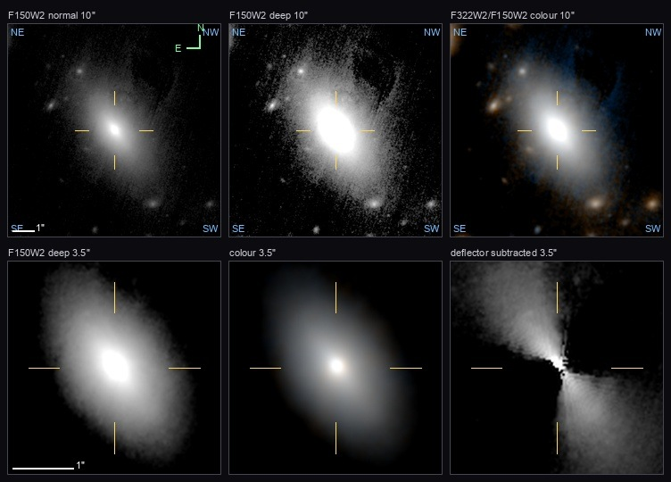{ width="100%" }](img/rank-090-orig.jpg){ target=_blank }
  <figcaption>What the judge saw (blind, footer removed)</figcaption>
</figure>

<figure markdown="span">
  [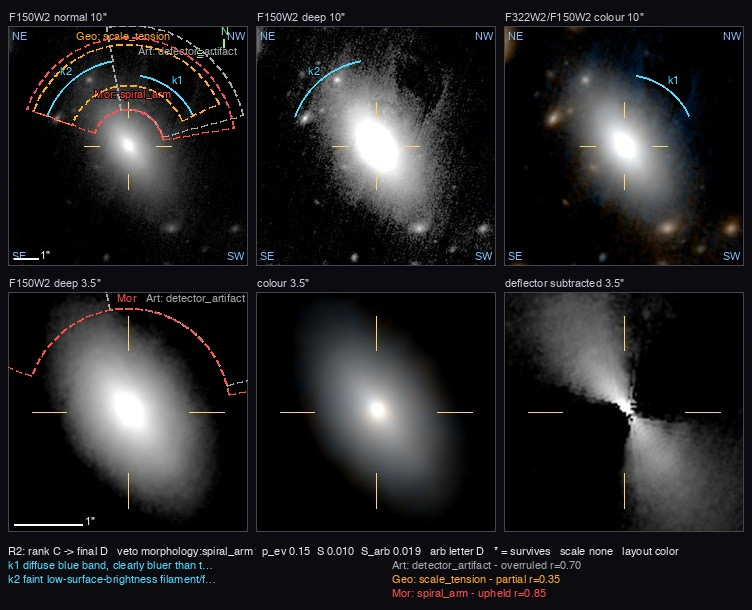{ width="100%" }](img/rank-090-annot.jpg){ target=_blank }
  <figcaption>Advocate evidence (cyan) and critic alternatives coloured by the arbitrator ruling</figcaption>
</figure>

???+ note "Why this grade — advocate, critics, arbitrator"
    **Letter D** (deployed, rule R2) · p_evidence 0.15 · S_arb 0.019 · S 0.01 · scale none

    Letter: D rule: morphology (spiral_arm) covers every item (a = 1) at r 0.85 >= 0.80 (upheld).

    **Advocate**

    - criteria: source_contrast 5, low_surface_brightness 5, curvature 3, counter_image 1, arc_morphology 3
    - items (2):
        - k1 — “diffuse blue band, clearly bluer than the orange deflector envelope, running along the NW/W side of the galaxy at roughly constant radius; coincides with the dark wedge seen in the un-subtracted normal and deep panels” (panel c, r 3 arcsec, PA 295->350, visible in direct: yes; criteria: source_contrast, low_surface_brightness)
        - k2 — “faint low-surface-brightness filament/fan in the deep 10" stretch on the N-NE side, mildly curved about the galaxy but broadening with radius” (panel b, r 3.6 arcsec, PA 10->70, visible in direct: yes; criteria: low_surface_brightness, curvature)
    - scale group; red neighbours within 10 arcsec 4; BCG-like halo yes; deflector is centre yes; arc radius 3 arcsec; arc PA span 295->350; centre-of-curvature offset 2 arcsec
    - p_evidence: 0.15
    - notes: “The ticked object is a large, highly inclined dusty disc/S0 (strong ellipticity, PA~135, smooth bulge in the 3.5" deep and colour zooms); the only non-deflector structure is the blue NW band at r~2-4" in panel (c) that lies on the same side as the dark dust wedge in panels (a)/(b), with no similar-colour counter-feature at comparable radius to the SE and no thin fixed-radius tangential arc anywhere in the 10" field.”

    **Critics**

    **artifact — detector_artifact:** “A coverage/dither (mosaic) edge in the 10" field: a straight-sided dark wedge with sharp linear boundaries runs from ~1.5" out to the top frame edge on the N/NW side of panels (a) and (b), and the 'blue band' in (c) is the two-band colour discontinuity created where the short- and long-wavelength exposures do not overlap identically across that same straight edge - a band that is radial and open-ended, not tangential at fixed radius.”

    - location: r 1.5-5 arcsec, PA 285->10
    - accounts for: k1; leaves standing: k2; strength r 0.70; coverage a 0.50 (geometric), excluded from S_arb (overruled)
    - measured: `{"colour_step": "colour change occurs across a straight linear boundary rather than along a curved locus centred on the ticked galaxy", "panel_f_pattern": "pure four-lobed bowtie/dipole about the core - the declared circular-profile subtraction artefact, not counted", "radial_extent_of_blue_band_in_c": "~1.5\" to the 10\" panel border (open-ended), i.e. not confined to a fixed radius", "wedge_boundary_geometry": "two straight edges converging toward the field top edge in (a) and (b), PA ~340 and ~015, no curvature over ~4\" of length"}`
    - notes: “In (a) and (b) the NW/N feature is a sharp-edged, straight-sided wedge running from ~1.5" out to the panel edge (PA ~285-010), the signature of a dither/coverage edge in one band; the corresponding 'blue band' in (c) at r~3" simply marks where the SW and LW coverage differ, and it broadens outward instead of tracking a constant radius. Item 2 (faint N-NE fan in (b), PA 10-70) is not on that boundary and is not an instrumental feature I can name, so I leave it standing.”
    - ruling: overruled — “The blue swath in (c) follows a curved locus wrapping from the W through the NW to the N around the ticked galaxy and fades smoothly rather than stepping across a straight, frame-crossing boundary, and the dark NW wedge in (a)/(b) is bounded by the galaxy's own outer isophotes (inter-arm/dust), with no matching coverage step in the SE/SW half of the same panels.”

    **geometry — scale_tension:** “The items imply theta_E ~3.0-3.6", i.e. a group-scale deflector, but the widest view I was given (panel b, 10") shows a single dominant galaxy whose own light fills the field and no second red member of comparable colour/brightness within 10" - only a handful of small faint compact sources (r~3.3" PA~36, r~3.4" PA~69, r~4.0" PA~207) with point-like, non-tangential profiles. With no second massive member the mass needed at 3-3.6" is not visible, and neither item has a counter-image at its mirror azimuth.”

    - location: r 2.5-4.2 arcsec, PA 295->70
    - accounts for: k1, k2; leaves standing: none; strength r 0.35; coverage a 1.00 (geometric), arbitrated a' 0.50
    - scale_class: galaxy
    - measured: `{"centre_of_curvature_offset_arcsec": 1.0, "implied_theta_E_arcsec": "3.0-3.6", "item1_counter_image_search": "PA 115-170, r 2.8-3.2\" in panel (b)/(d): only smooth host isophotes, no offset feature", "item2_counter_image_search": "PA 190-250, r 3.4-3.8\": nothing diffuse; nearest object is a compact, round source at r~4.0\", PA~207 whose point-like profile does not match a low-surface-brightness fan", "second_red_member_within_10arcsec": 0, "tangential_elongation_item1": "band lies along the host major axis (PA~315/135 in panel d), width comparable to its radius - not thin and tangential", "tangential_elongation_item2": "fan widens from ~0.4\" at r~2.8\" to ~1\" at r~4\"; azimuthal extent 60 deg but radius grows with angle"}`
    - notes: “In panel (b) the field contains one huge galaxy (isophotes traceable to r>5") and no comparable red companion, so a 3-3.6" Einstein radius has no visible group mass behind it; the two items sit inside a single continuous 135 deg swath from NW through N to NE (PA 295->70) with no counterpart in the SE/SW hemisphere at r=2.8-3.8". The NE compact knots at r~3.3" (PA 36, 69) are round and unelongated, i.e. projections rather than tangential images.”
    - ruling: partial, covers k1 — “The absence of any second red member within 10" and of a counter-feature at PA 115-170, r~3" is real in panel (b) and does undercut the r~3" NW band, but the argument is a scale/counter-image deficit rather than a positive explanation of the diffuse N-NE fan (item 2).”

    **morphology — spiral_arm:** “The ticked object is an inclined bulge-dominated spiral: panel (c) shows a two-armed blue arm system wound around the orange bulge, one arm sweeping from the NE (PA~40) over the N and down the W/NW side (PA~300-350), the mirrored arm running SE->S->SW. Both cited features are segments of that arm system, continuously joined to the disc seen in (d)/(e).”

    - location: r 1.5-4.5 arcsec, PA 280->70
    - accounts for: k1, k2; leaves standing: none; strength r 0.85; coverage a 1.00 (geometric)
    - scale_class: galaxy
    - measured: `{"arm_radius_vs_angle": "blue ridge at r~2.6-2.9\" near PA 300, ~3.1-3.3\" near PA 350, ~3.5-3.8\" near PA 40 - radius grows monotonically with increasing angle, not constant", "arm_symmetry": "a mirrored blue arm at r~2.5-4\" over PA 100-220 (SE->S->SW) in panel (c), completing a two-armed pattern rather than an arc/counter-arc pair at fixed radius", "host_major_axis_PA": "~135/315 deg, ellipticity ~0.4 in panel (d)", "stellar_bridge": "in panel (d) the smooth inclined disc extends continuously from the nucleus out to ~1.7\" along PA 135/315 and merges without a gap into the arm ridge in (c); no gap between nucleus and feature"}`
    - notes: “In panel (c) the blue NW/W band (item 1, r~3", PA 295-350) and the N-NE fan (item 2, r~3.6", PA 10-70) are the same continuous blue ridge, whose radius increases steadily with position angle and which is bridged to the bulge by the smooth inclined disc visible in (d); a symmetric counterpart arm runs SE-S-SW at similar radius, i.e. a normal two-armed spiral, not a tangential arc at fixed radius.”
    - ruling: upheld, covers k1, k2 — “In panel (c) the blue ridge climbs monotonically in radius from ~2.6" at PA~300 to ~3.6" at PA~40 and joins continuously onto the inclined disc whose smooth major axis (PA~135/315, e~0.4) is obvious in (d)/(e), with a mirrored blue arm running SE-S-SW - a two-armed spiral, not a fixed-radius arc pair.”

    **Arbitrator**

    - surviving items: none (0 of 2)
    - letter_llm: D; scale_class_final: none; needs_human: no
    - rationale: “The ticked object is a large, well-resolved inclined disc galaxy: panel (d) shows a smooth elliptical bulge with e~0.4 along PA~135/315 whose light is traceable past 1.7", and panel (b) shows faint outer arms and a dark inter-arm/dust wedge to the N-NW. Both scored items lie in one continuous 135-degree swath from PA 295 through 70, and in the colour panel (c) they are the same blue ridge whose radius grows steadily with position angle (~2.6-2.9" at PA~300, ~3.5-3.8" at PA~40) and which is bridged to the nucleus by the disc rather than standing off it - the defining signature of a spiral arm at JWST resolution, with a mirrored blue arm on the SE-S-SW side completing the two-armed pattern. There is no thin, fixed-radius tangential feature anywhere in the 10" field, no counter-image at the mirror azimuths (PA 115-170 and 190-250 show only smooth host isophotes and one round compact projection at r~4.0", PA~207), and panel (f) shows only the four-lobed bowtie/dipole that the declared circular-profile subtraction necessarily produces on this elliptical, off-centre-cored host - an artefact that carries no weight either way. The artifact critic's mosaic-edge reading is not supported by the pixels (the colour change follows a curved locus, not a straight frame-crossing boundary), and the geometry critic's scale tension only reinforces the morphological verdict. With every item accounted for by ordinary spiral structure, this is not a lens.”

    **Score**

    - S = p_ev x prod(1 - r_i a_i) = 0.15 x (1 - 0.70x0.50) x (1 - 0.35x1.00) x (1 - 0.85x1.00) = 0.01
        - terms: artifact detector_artifact r 0.70 a 0.50; geometry scale_tension r 0.35 a 1.00; morphology spiral_arm r 0.85 a 1.00
    - S_arb = p_ev x prod_{upheld/partial}(1 - r_i a_i') = 0.15 x (1 - 0.35x0.50) x (1 - 0.85x1.00) = 0.019
        - terms: geometry scale_tension r 0.35 a' 0.50 (partial); morphology spiral_arm r 0.85 a 1.00 (upheld)
    - stored grade_pred (on S): D — S 0.01 < t_B 0.17 (calibrated at 5% FPR on clean negatives) and morphology (spiral_arm) covers every item at r 0.85 >= 0.80
    - stored letter_arb (on S_arb): D; letter_source: opus5_api_calibrated
    - deploy rule R2: letter_rank (advocate only, on p_evidence) = C — p_evidence 0.15 < t_B 0.17 (calibrated at 5% FPR on clean negatives); not D: 2 item(s) located; no named critic covers every item at r >= 0.80
    - deploy rule R2: letter_final = D — D rule: morphology (spiral_arm) covers every item (a = 1) at r 0.85 >= 0.80 (upheld)
    - veto: morphology:spiral_arm

---

## Rank 91: J14995729+243834 {#rank-91}

| Original grade | Passes | Inspector conf. | Pipeline θ_E |
|:--:|:--:|:--:|:--:|
| **U** | — | 25 | 2.00″ |

| New (final) | Rank letter | p_ev | S_arb | Demoted by | Arb. letter | Needs human |
|:--:|:--:|--:|--:|:--|:--:|:--:|
| **C** | C | 0.12 | 0.120 | — | — | no |

<small>pipeline discovery status `new` · scale class `galaxy`</small>

<figure markdown="span">
  [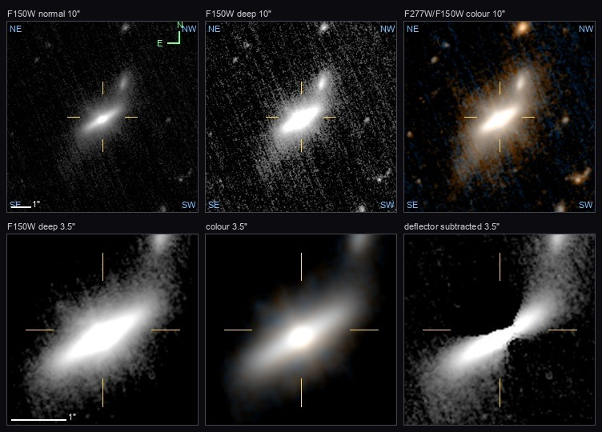{ width="100%" }](img/rank-091-orig.jpg){ target=_blank }
  <figcaption>What the judge saw (blind, footer removed)</figcaption>
</figure>

<figure markdown="span">
  [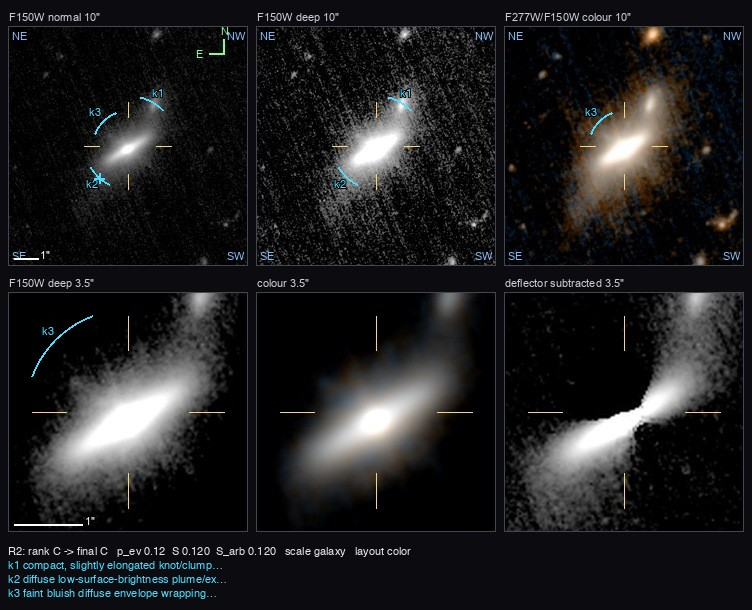{ width="100%" }](img/rank-091-annot.jpg){ target=_blank }
  <figcaption>Advocate evidence (cyan) and critic alternatives coloured by the arbitrator ruling</figcaption>
</figure>

???+ note "Why this grade — advocate, critics, arbitrator"
    **Letter C** (deployed, rule R2) · p_evidence 0.12 · S_arb 0.12 · S 0.12 · scale galaxy

    Letter: letter_rank stands (D rule not met); p_evidence 0.12 < t_B 0.17 (calibrated at 5% FPR on clean negatives); not D: 3 item(s) located; no named critic covers every item at r >= 0.80.

    **Advocate**

    - criteria: source_contrast 3, low_surface_brightness 5, curvature 2, counter_image 3, arc_morphology 2
    - items (3):
        - k1 — “compact, slightly elongated knot/clump NNW of the ticked galaxy, brighter and whiter/bluer than the orange core in (c)/(e); it sits at the end of a continuous luminous bridge that runs out along the galaxy's major axis” (panel b, r 2.1 arcsec, PA 315->345, visible in direct: yes; criteria: source_contrast, low_surface_brightness)
        - k2 — “diffuse low-surface-brightness plume/extension on the opposite (SE) side at comparable radius, roughly mirroring item 1 across the nucleus and lying along the same major-axis direction” (panel b, r 1.8 arcsec, PA 120->155, visible in direct: yes; criteria: low_surface_brightness, counter_image)
        - k3 — “faint bluish diffuse envelope wrapping the NE and SW flanks of the elongated body in (c); mildly convex/curved but its apparent centre of curvature is the galaxy's own disc plane, not offset” (panel c, r 1.5 arcsec, PA 20->70, visible in direct: yes; criteria: low_surface_brightness)
    - scale galaxy; red neighbours within 10 arcsec 3; BCG-like halo no; deflector is centre no; counter-image at r 1.8 arcsec PA 138
    - p_evidence: 0.12
    - notes: “The NNW knot (item 1) is joined to the bright inclined core by an unbroken stellar bridge that is obvious in (a), (b) and as the strong linear ridge in the subtracted panel (f), and the SE plume lies along the SAME major-axis direction rather than tangentially, so the two straddling features are radial along the disc axis, not a tangential arc pair; no feature anywhere out to ~5" in the 10" row keeps a constant radius or curves concave toward the ticks.”

    **Critics**

    - not called (p_evidence 0.12 < tau0 0.15)

    **Arbitrator**

    - no arbitrator record (not called)

    **Score**

    - S = p_ev = 0.12 (no critic term entered the product)
    - S_arb = p_ev = 0.12 (no critic term entered the product)
    - stored grade_pred (on S): C — S 0.12 < t_B 0.17 (calibrated at 5% FPR on clean negatives); not D: 3 item(s) located; no named critic covers every item at r >= 0.80
    - stored letter_arb (on S_arb): C; letter_source: opus5_api_calibrated
    - deploy rule R2: letter_rank (advocate only, on p_evidence) = C — p_evidence 0.12 < t_B 0.17 (calibrated at 5% FPR on clean negatives); not D: 3 item(s) located; no named critic covers every item at r >= 0.80
    - deploy rule R2: letter_final = C — letter_rank stands (D rule not met); p_evidence 0.12 < t_B 0.17 (calibrated at 5% FPR on clean negatives); not D: 3 item(s) located; no named critic covers every item at r >= 0.80
    - veto: none (letter_final == letter_rank)

---

## Rank 92: J2104758+067717 {#rank-92}

| Original grade | Passes | Inspector conf. | Pipeline θ_E |
|:--:|:--:|:--:|:--:|
| **U** | — | 25 | 0.90″ |

| New (final) | Rank letter | p_ev | S_arb | Demoted by | Arb. letter | Needs human |
|:--:|:--:|--:|--:|:--|:--:|:--:|
| **B** | B | 0.30 | 0.063 | — | D | no |

<small>pipeline discovery status `new` · scale class `none`</small>

<figure markdown="span">
  [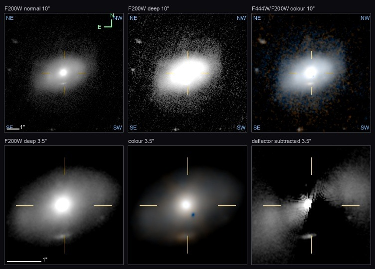{ width="100%" }](img/rank-092-orig.jpg){ target=_blank }
  <figcaption>What the judge saw (blind, footer removed)</figcaption>
</figure>

<figure markdown="span">
  [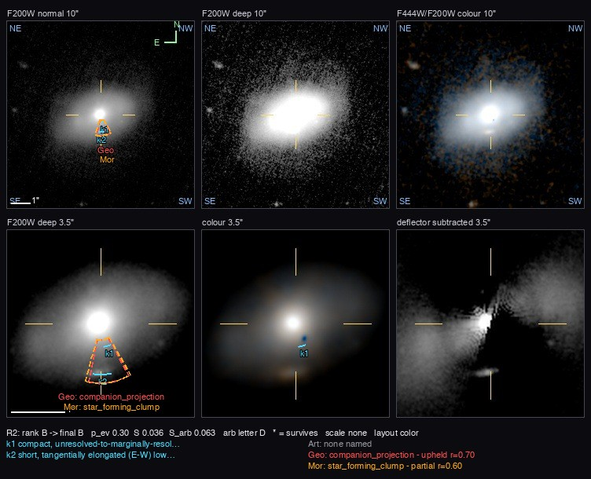{ width="100%" }](img/rank-092-annot.jpg){ target=_blank }
  <figcaption>Advocate evidence (cyan) and critic alternatives coloured by the arbitrator ruling</figcaption>
</figure>

???+ note "Why this grade — advocate, critics, arbitrator"
    **Letter B** (deployed, rule R2) · p_evidence 0.30 · S_arb 0.063 · S 0.036 · scale none

    Letter: letter_rank stands (D rule not met); p_evidence 0.30 >= t_A 0.20 (calibrated at 1% FPR on clean negatives) but A is blocked: only 0 of 3 configuration criteria >= 6; p_evidence 0.30 >= t_B 0.17 (calibrated at 5% FPR on clean negatives).

    **Advocate**

    - criteria: source_contrast 6, low_surface_brightness 4, curvature 2, counter_image 2, arc_morphology 3
    - items (2):
        - k1 — “compact, unresolved-to-marginally-resolved knot ~0.4-0.5" S-SSW of the nucleus, conspicuously BLUE in both colour panels (c) and (e) against the white/orange deflector light, and visible as a distinct bright point in the direct normal- and deep-stretch panels (a), (d)” (panel e, r 0.45 arcsec, PA 188->205, visible in direct: yes; criteria: source_contrast)
        - k2 — “short, tangentially elongated (E-W) low-surface-brightness knot/arclet ~0.95" due S of the nucleus, faintly orange in (e), traceable in the deep zoom (d) and appearing in (f) as a ONE-SIDED offset residual that is not mirrored across the core” (panel d, r 0.95 arcsec, PA 172->192, visible in direct: yes; criteria: source_contrast, low_surface_brightness, arc_morphology)
    - scale galaxy; red neighbours within 10 arcsec 1; BCG-like halo no; deflector is centre yes; arc radius 0.95 arcsec; arc PA span 172->192; centre-of-curvature offset 0.5 arcsec
    - p_evidence: 0.30
    - notes: “Two offset features sit on the SAME (southern) side of the ticked galaxy - a blue point at ~0.45" and a faint E-W elongated orange knot at ~0.95" (bright one-sided residual in f) - so both pass the offset/contrast tests but no opposite counter-image is traceable at 0.9-1.0" on the northern side, where the direct panels are dominated by the bright elongated halo; the whole southern chain lies along the galaxy's minor axis, which the critics should test against a dust-lane / star-forming-clump / companion-projection reading.”

    **Critics**

    **artifact — no alternative named (nothing in its competence fits)**

    - leaves standing: k1, k2
    - scale_class: galaxy
    - measured: `{"bowtie_lobe_position_angles_in_f": "~40-60, ~130-150, ~220-240, ~310-330 deg (four-lobed butterfly of the circular-profile subtraction on this E-W elongated galaxy)", "detector_check": "no mosaic seam, dither edge, striping or snowball ring within the 10\" field; background in (b) is smooth and uniform around the ticked galaxy", "diffraction_check": "no straight rays of constant PA emanating from the core in (a)/(b); no 6-spike pattern, no saturation bleed, no bright neighbour whose PSF wings could reach 0.5-1\" S", "item_position_angles": "172-205 deg, i.e. between the bowtie lobes, not on one", "visibility_check": "item 1 seen as a discrete bright point in (a) and (d) and as a blue dot in (c) and (e); item 2 seen as a faint low-SB blob in (d) at ~0.95\" S and as an orange tint in (e) - both present in un-subtracted panels, so neither qualifies as subtraction_residual"}`
    - notes: “Both located features are present in the direct, un-subtracted frames - the blue point at r~0.45", PA~195 is a discrete source in (a) and (d), and the faint blob at r~0.95", PA~180 is visible in the deep zoom (d) - so neither can be a subtraction residual, and neither lies on a diffraction spike, seam, stripe or the PSF wing of any bright neighbour. The only instrumental pattern I can point to in (f) is the four-lobed butterfly at PA~50/140/230/320 produced by the circular profile fit to this E-W elongated galaxy, which is not what either item sits on; I have no instrumental alternative for items 1 or 2.”
    - ruling: no ruling for this critic

    **geometry — companion_projection:** “Two unrelated projected sources superposed on the south half of the smooth elliptical: a compact blue point-like knot at r~0.45" and a separate diffuse low-surface-brightness orange patch at r~0.95", lying at essentially the SAME position angle but at different radii, with different surface-brightness profiles and no counter-image on the opposite side of the nucleus - i.e. a chance/embedded projection, not a multiple-image configuration.”

    - location: r 0.3-1.1 arcsec, PA 168->208
    - accounts for: k1, k2; leaves standing: none; strength r 0.70; coverage a 1.00 (geometric)
    - scale_class: galaxy
    - measured: `{"colour_consistency_supporting_only": "item 1 blue, item 2 orange in (e) - supporting, not decisive", "counter_image_search": "panel (d), r = 0.85-1.05\", PA 350-20 (due N, opposite item 2): light is smooth to the isophote level, no knot or arclet; same for PA 0-25 at r = 0.4-0.5\" opposite item 1", "curvature": "item 2 subtends only ~20 deg of azimuth; no measurable curvature about the tick centre, centre of curvature unconstrained (>0.4\" uncertainty)", "pa_separation_item1_item2_deg": "~13 (188-205 vs 172-192: overlapping, same side of the nucleus)", "profile_consistency": "item 1 is a sharp, near-point source (FWHM a few px in (d)); item 2 is a diffuse, ~0.3\" long low-contrast patch - inconsistent as images of one source", "radius_ratio_item2_over_item1": "0.95/0.45 = 2.1 (not a compatible image pair at one Einstein radius)"}`
    - notes: “In panel (d) both features sit due south of the tick centre at PA~180-200 but at r=0.45" and r=0.95", one a hard point source and one a soft diffuse smudge, while the mirror positions to the north (PA 350-20, same radii) are featureless smooth halo. Panel (b) shows an isolated single galaxy with a smooth envelope and no second red member within 10", so no group-scale deflector can supply the missing counter-images.”
    - ruling: upheld, covers k1, k2 — “In the deep zoom (d) and colour zoom (e) both features sit due south at PA~172-205 but at r=0.45" (hard blue point) and r=0.95" (soft orange patch), a radius ratio of 2.1 with mismatched profiles and hues, while the mirror positions at PA~350-20 at the same radii show only smooth, featureless halo - a chance/embedded projection, not a multiple-image system.”

    **morphology — star_forming_clump:** “Two clumps in the host's own inclined disc: the deep zoom (d) shows a smooth, high-inclination disc (axis ratio ~0.55, major axis nearly E-W, PA~80/260) filling the 3.5" field; both cited features lie inside that disc's isophotes on its south (minor-axis) side - the blue point at 0.45" is a compact clump/HII knot projected on the bulge, and the 0.95" patch is a diffuse E-W brightening lying exactly where the near/far edge of an inclined disc ring or arm crosses the minor axis, i.e. elongated parallel to the disc major axis, not tangential to an independent mass.”

    - location: r 0.3-1.1 arcsec, PA 165->210
    - accounts for: k1, k2; leaves standing: none; strength r 0.60; coverage a 1.00 (geometric), arbitrated a' 0.50
    - scale_class: galaxy
    - measured: `{"counter_feature_at_PA_0-20_within_0.9-1.0arcsec": "none seen in (d) or (e)", "disc_isophote_extent_along_minor_axis_arcsec": "~1.0-1.1, so k2 sits on the outer disc, not outside the host light", "host_axis_ratio_d_panel": "~0.55", "host_major_axis_PA_deg": "~80/260 (E-W)", "item_PAs_deg": "188-205 (k1), 172-192 (k2) - both on the minor axis, same side", "item_radii_arcsec": "0.45 and 0.95 - not a common radius, so not two images of one arc", "k2_elongation_PA_deg": "~85-95, i.e. parallel to the host disc major axis"}`
    - notes: “In (d) the 0.95" southern patch is a soft brightening embedded within the host's own disc isophotes and stretched along the disc major axis (PA~90), with no mirrored feature at PA~0 at the same radius; in (e) the 0.45" knot is a single blue point of very different hue from the orange 0.95" patch, so the two are not a pair of images of one source but two clumps on the same south side of an inclined disc.”
    - ruling: partial, covers k1 — “The compact blue point 0.45" S is plausibly an HII/star-forming knot projected on the bulge light in (d)/(e), but the 0.95" southern feature reads as a discrete compact blob sitting at the very edge of the host isophotes (clearly detached in (f)) rather than as a disc-arm brightening, so the clump reading covers only item 1.”

    **Arbitrator**

    - surviving items: none (0 of 2)
    - letter_llm: D; scale_class_final: none; needs_human: no
    - rationale: “The ticked galaxy is a single smooth E-W elongated system whose light dominates the 3.5" zoom; the two located features both lie on its southern minor-axis side, at PA~188-205 (r~0.45", a hard, near-point blue dot visible in (a), (d) and (e)) and PA~172-192 (r~0.95", a soft E-W elongated orange patch in (d)/(e) that becomes the bright one-sided blob in (f)). Nothing here is tangential at a fixed radius: the two features differ in radius by a factor 2.1, in surface-brightness profile (point vs diffuse), and in hue, and the deep zoom shows only smooth, featureless halo at the mirror positions PA~350-20 at both radii, so no counter-image or counter-arc exists; item 2 subtends only ~20 deg of azimuth with no measurable curvature about the tick centre. The artifact critic correctly finds no instrumental origin - both are present in the un-subtracted panels, neither lies on the four-lobed bowtie (PA~50/140/230/320) that the circular-profile subtraction imprints on this elongated galaxy, and (b) shows no seam, stripe, snowball or bright neighbour PSF - so the (f) blob is real sky but not lensed. The geometry critic's chance/embedded-projection reading accounts for both items and is upheld; the morphology clump reading independently covers the inner blue knot. With every located item accounted for and no arc, ring or counter-image anywhere in the frame, this is a D; no deeper data is needed to settle it.”

    **Score**

    - S = p_ev x prod(1 - r_i a_i) = 0.30 x (1 - 0.70x1.00) x (1 - 0.60x1.00) = 0.036
        - terms: geometry companion_projection r 0.70 a 1.00; morphology star_forming_clump r 0.60 a 1.00
    - S_arb = p_ev x prod_{upheld/partial}(1 - r_i a_i') = 0.30 x (1 - 0.70x1.00) x (1 - 0.60x0.50) = 0.063
        - terms: geometry companion_projection r 0.70 a 1.00 (upheld); morphology star_forming_clump r 0.60 a' 0.50 (partial)
    - stored grade_pred (on S): C — S 0.036 < t_B 0.17 (calibrated at 5% FPR on clean negatives); not D: 2 item(s) located; no named critic covers every item at r >= 0.80
    - stored letter_arb (on S_arb): C; letter_source: opus5_api_calibrated
    - deploy rule R2: letter_rank (advocate only, on p_evidence) = B — p_evidence 0.30 >= t_A 0.20 (calibrated at 1% FPR on clean negatives) but A is blocked: only 0 of 3 configuration criteria >= 6; p_evidence 0.30 >= t_B 0.17 (calibrated at 5% FPR on clean negatives)
    - deploy rule R2: letter_final = B — letter_rank stands (D rule not met); p_evidence 0.30 >= t_A 0.20 (calibrated at 1% FPR on clean negatives) but A is blocked: only 0 of 3 configuration criteria >= 6; p_evidence 0.30 >= t_B 0.17 (calibrated at 5% FPR on clean negatives)
    - veto: none (letter_final == letter_rank)

---

## Rank 93: J11084396-7342226 {#rank-93}

| Original grade | Passes | Inspector conf. | Pipeline θ_E |
|:--:|:--:|:--:|:--:|
| **U** | — | 25 | — |

| New (final) | Rank letter | p_ev | S_arb | Demoted by | Arb. letter | Needs human |
|:--:|:--:|--:|--:|:--|:--:|:--:|
| **C** | C | 0.10 | 0.100 | — | — | no |

<small>pipeline discovery status `new` · scale class `none`</small>

<figure markdown="span">
  [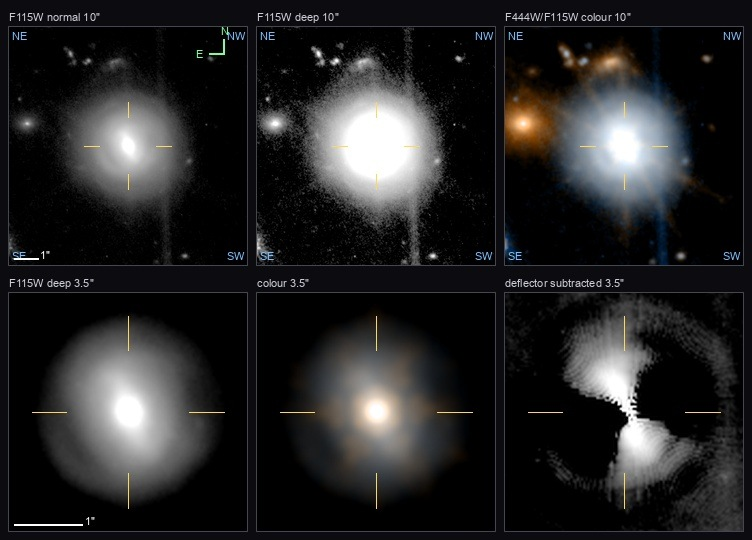{ width="100%" }](img/rank-093-orig.jpg){ target=_blank }
  <figcaption>What the judge saw (blind, footer removed)</figcaption>
</figure>

<figure markdown="span">
  [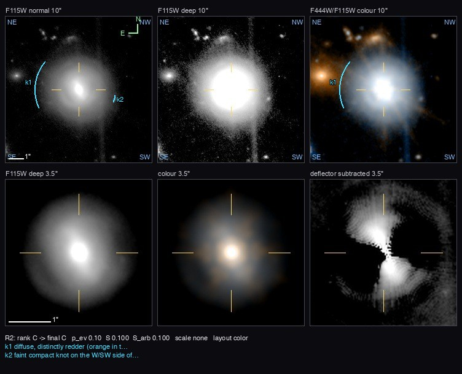{ width="100%" }](img/rank-093-annot.jpg){ target=_blank }
  <figcaption>Advocate evidence (cyan) and critic alternatives coloured by the arbitrator ruling</figcaption>
</figure>

???+ note "Why this grade — advocate, critics, arbitrator"
    **Letter C** (deployed, rule R2) · p_evidence 0.10 · S_arb 0.10 · S 0.10 · scale none

    Letter: letter_rank stands (D rule not met); p_evidence 0.10 < t_B 0.17 (calibrated at 5% FPR on clean negatives); not D: 2 item(s) located; no named critic covers every item at r >= 0.80.

    **Advocate**

    - criteria: source_contrast 4, low_surface_brightness 5, curvature 1, counter_image 1, arc_morphology 1
    - items (2):
        - k1 — “diffuse, distinctly redder (orange in the two-band colour) low-surface-brightness patch offset east/north-east of the deflector, seen in (a) as faint extra light on the E flank of the envelope and clearly in (b) and (c); it is broad and lumpy rather than thin, and it runs continuously toward the chain of compact NE sources” (panel c, r 3 arcsec, PA 50->115, visible in direct: yes; criteria: source_contrast, low_surface_brightness)
        - k2 — “faint compact knot on the W/SW side of the envelope, resolved and slightly extended, no obvious tangential elongation; listed so its possible pairing with item 1 can be tested (their profiles differ strongly: compact vs diffuse)” (panel a, r 2.5 arcsec, PA 250->262, visible in direct: yes; criteria: low_surface_brightness)
    - scale none; red neighbours within 10 arcsec 3; BCG-like halo yes; deflector is centre no
    - p_evidence: 0.10
    - notes: “The zoom panels (d)/(e) show only a bright elongated bar-like core inside a smooth round envelope with no offset tangential structure at any radius 0.3-1.75", (f) shows exactly the bowtie/dipole the circular-profile subtraction predicts for such an elongated core (uninformative), and the only offset features in the 10" row are a diffuse red E-NE patch contiguous with the NE galaxy chain plus an unrelated compact W knot - neither is at fixed radius nor concave toward the ticked galaxy; the near-vertical bright streak crossing the NW half is a spike/artefact, not a feature.”

    **Critics**

    - not called (p_evidence 0.10 < tau0 0.15)

    **Arbitrator**

    - no arbitrator record (not called)

    **Score**

    - S = p_ev = 0.10 (no critic term entered the product)
    - S_arb = p_ev = 0.10 (no critic term entered the product)
    - stored grade_pred (on S): C — S 0.10 < t_B 0.17 (calibrated at 5% FPR on clean negatives); not D: 2 item(s) located; no named critic covers every item at r >= 0.80
    - stored letter_arb (on S_arb): C; letter_source: opus5_api_calibrated
    - deploy rule R2: letter_rank (advocate only, on p_evidence) = C — p_evidence 0.10 < t_B 0.17 (calibrated at 5% FPR on clean negatives); not D: 2 item(s) located; no named critic covers every item at r >= 0.80
    - deploy rule R2: letter_final = C — letter_rank stands (D rule not met); p_evidence 0.10 < t_B 0.17 (calibrated at 5% FPR on clean negatives); not D: 2 item(s) located; no named critic covers every item at r >= 0.80
    - veto: none (letter_final == letter_rank)

---

## Rank 94: J4637336-3182658 {#rank-94}

| Original grade | Passes | Inspector conf. | Pipeline θ_E |
|:--:|:--:|:--:|:--:|
| **U** | — | 25 | — |

| New (final) | Rank letter | p_ev | S_arb | Demoted by | Arb. letter | Needs human |
|:--:|:--:|--:|--:|:--|:--:|:--:|
| **C** | C | 0.14 | 0.140 | — | — | no |

<small>pipeline discovery status `new` · scale class `group`</small>

<figure markdown="span">
  [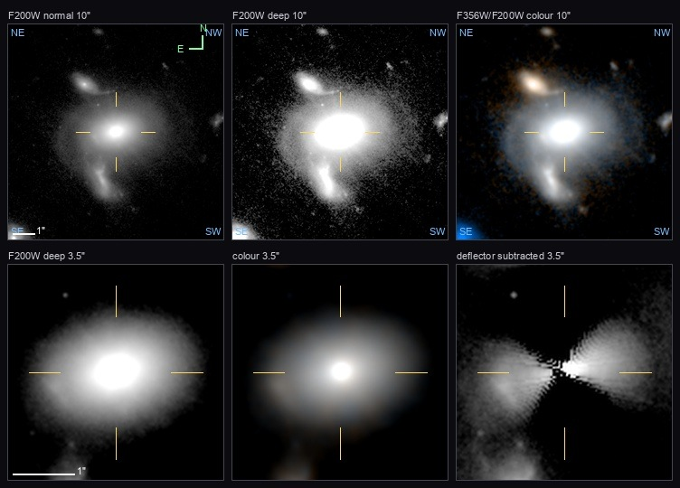{ width="100%" }](img/rank-094-orig.jpg){ target=_blank }
  <figcaption>What the judge saw (blind, footer removed)</figcaption>
</figure>

<figure markdown="span">
  [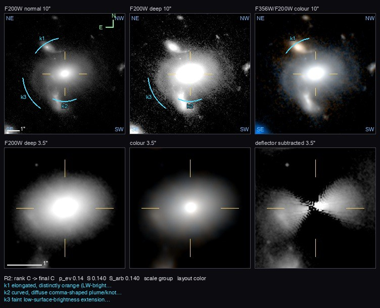{ width="100%" }](img/rank-094-annot.jpg){ target=_blank }
  <figcaption>Advocate evidence (cyan) and critic alternatives coloured by the arbitrator ruling</figcaption>
</figure>

???+ note "Why this grade — advocate, critics, arbitrator"
    **Letter C** (deployed, rule R2) · p_evidence 0.14 · S_arb 0.14 · S 0.14 · scale group

    Letter: letter_rank stands (D rule not met); p_evidence 0.14 < t_B 0.17 (calibrated at 5% FPR on clean negatives); not D: 3 item(s) located; no named critic covers every item at r >= 0.80.

    **Advocate**

    - criteria: source_contrast 5, low_surface_brightness 6, curvature 2, counter_image 2, arc_morphology 2
    - items (3):
        - k1 — “elongated, distinctly orange (LW-bright) streak north-north-east of the deflector, ~2.5-3.5" out, its long axis pointing roughly back at the deflector (radial rather than tangential); brightest object in the colour panel besides the deflector” (panel c, r 3 arcsec, PA 10->55, visible in direct: yes; criteria: source_contrast, low_surface_brightness)
        - k2 — “curved, diffuse comma-shaped plume/knot immediately south of the deflector, extended over ~1.5-3", slightly bluer/whiter than the galaxy core and showing mild concavity; its elongation is largely radial and it appears connected to the galaxy envelope” (panel b, r 2.3 arcsec, PA 155->205, visible in direct: yes; criteria: low_surface_brightness, curvature)
        - k3 — “faint low-surface-brightness extension / fan on the east-south-east side of the halo in the deep stretch, broad and radius-growing rather than confined to a fixed radius” (panel b, r 3.5 arcsec, PA 95->145, visible in direct: yes; criteria: low_surface_brightness)
    - scale group; red neighbours within 10 arcsec 2; BCG-like halo yes; deflector is centre no; centre-of-curvature offset 2.5 arcsec
    - p_evidence: 0.14
    - notes: “The 3.5" zoom panels (d) and (e) show a completely smooth, featureless elliptical with no knot, arc or ring inside ~1.75", and (f) shows only the four-lobed bowtie plus concentric rings the circular model is expected to leave; all located structure lies at 2-3.5" in the 10" row and is radially elongated and plume-like (NNE streak, southern comma, ESE fan), consistent with an interacting/tidal envelope rather than tangential images at a common radius.”

    **Critics**

    - not called (p_evidence 0.14 < tau0 0.15)

    **Arbitrator**

    - no arbitrator record (not called)

    **Score**

    - S = p_ev = 0.14 (no critic term entered the product)
    - S_arb = p_ev = 0.14 (no critic term entered the product)
    - stored grade_pred (on S): C — S 0.14 < t_B 0.17 (calibrated at 5% FPR on clean negatives); not D: 3 item(s) located; no named critic covers every item at r >= 0.80
    - stored letter_arb (on S_arb): C; letter_source: opus5_api_calibrated
    - deploy rule R2: letter_rank (advocate only, on p_evidence) = C — p_evidence 0.14 < t_B 0.17 (calibrated at 5% FPR on clean negatives); not D: 3 item(s) located; no named critic covers every item at r >= 0.80
    - deploy rule R2: letter_final = C — letter_rank stands (D rule not met); p_evidence 0.14 < t_B 0.17 (calibrated at 5% FPR on clean negatives); not D: 3 item(s) located; no named critic covers every item at r >= 0.80
    - veto: none (letter_final == letter_rank)

---

## Rank 95: J34135498+2813722 {#rank-95}

| Original grade | Passes | Inspector conf. | Pipeline θ_E |
|:--:|:--:|:--:|:--:|
| **U** | — | 25 | — |

| New (final) | Rank letter | p_ev | S_arb | Demoted by | Arb. letter | Needs human |
|:--:|:--:|--:|--:|:--|:--:|:--:|
| **C** | C | 0.14 | 0.140 | — | — | no |

<small>pipeline discovery status `new` · scale class `galaxy`</small>

<figure markdown="span">
  [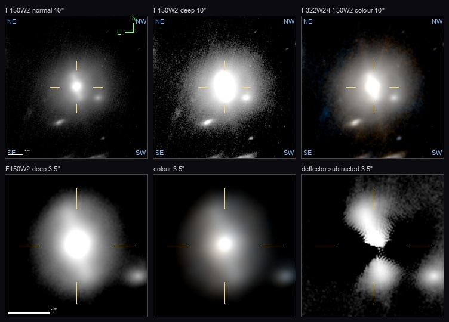{ width="100%" }](img/rank-095-orig.jpg){ target=_blank }
  <figcaption>What the judge saw (blind, footer removed)</figcaption>
</figure>

<figure markdown="span">
  [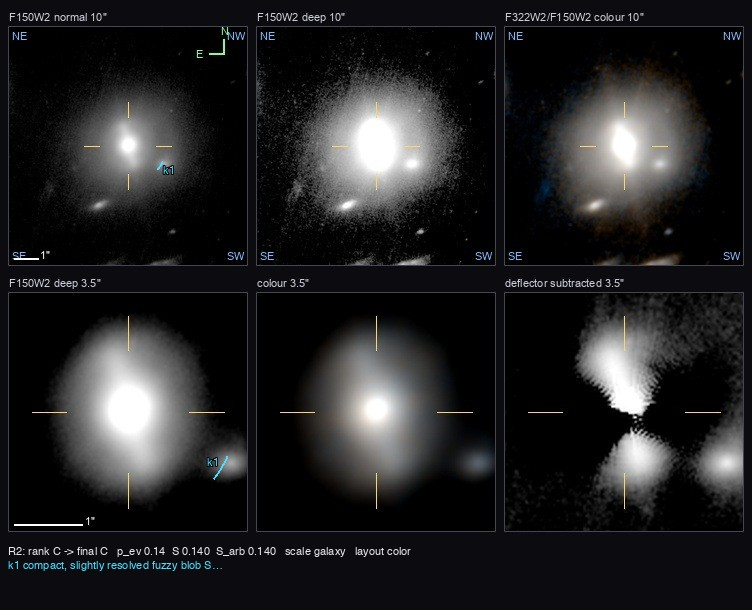{ width="100%" }](img/rank-095-annot.jpg){ target=_blank }
  <figcaption>Advocate evidence (cyan) and critic alternatives coloured by the arbitrator ruling</figcaption>
</figure>

???+ note "Why this grade — advocate, critics, arbitrator"
    **Letter C** (deployed, rule R2) · p_evidence 0.14 · S_arb 0.14 · S 0.14 · scale galaxy

    Letter: letter_rank stands (D rule not met); p_evidence 0.14 < t_B 0.17 (calibrated at 5% FPR on clean negatives); not D: 1 item(s) located; no named critic covers every item at r >= 0.80.

    **Advocate**

    - criteria: source_contrast 4, low_surface_brightness 3, curvature 0, counter_image 1, arc_morphology 1
    - items (1):
        - k1 — “compact, slightly resolved fuzzy blob SW of the deflector core, whiter/bluer than the golden deflector light in (e); no tangential elongation, no bridge visible” (panel d, r 1.6 arcsec, PA 232->246, visible in direct: yes; criteria: source_contrast, low_surface_brightness)
    - scale galaxy; red neighbours within 10 arcsec 1; BCG-like halo yes; deflector is centre no
    - p_evidence: 0.14
    - notes: “Only one located feature: the compact SW blob at r~1.6", PA~239° in (a)/(d)/(e); I searched the opposite side (PA~55-60°, r 1.0-2.2") in (a), (b) and (d) and the halo there is smooth with no matching knot, and the 10" panels show no tangential feature at any radius out to ~5" (the bright lobes in (f) form the symmetric butterfly/bowtie the VIEW attributes to the circular-profile subtraction of this clearly elliptical galaxy, so they are not counted).”

    **Critics**

    - not called (p_evidence 0.14 < tau0 0.15)

    **Arbitrator**

    - no arbitrator record (not called)

    **Score**

    - S = p_ev = 0.14 (no critic term entered the product)
    - S_arb = p_ev = 0.14 (no critic term entered the product)
    - stored grade_pred (on S): C — S 0.14 < t_B 0.17 (calibrated at 5% FPR on clean negatives); not D: 1 item(s) located; no named critic covers every item at r >= 0.80
    - stored letter_arb (on S_arb): C; letter_source: opus5_api_calibrated
    - deploy rule R2: letter_rank (advocate only, on p_evidence) = C — p_evidence 0.14 < t_B 0.17 (calibrated at 5% FPR on clean negatives); not D: 1 item(s) located; no named critic covers every item at r >= 0.80
    - deploy rule R2: letter_final = C — letter_rank stands (D rule not met); p_evidence 0.14 < t_B 0.17 (calibrated at 5% FPR on clean negatives); not D: 1 item(s) located; no named critic covers every item at r >= 0.80
    - veto: none (letter_final == letter_rank)

---

## Rank 96: J33389992-3276033 {#rank-96}

| Original grade | Passes | Inspector conf. | Pipeline θ_E |
|:--:|:--:|:--:|:--:|
| **U** | — | 25 | 1.95″ |

| New (final) | Rank letter | p_ev | S_arb | Demoted by | Arb. letter | Needs human |
|:--:|:--:|--:|--:|:--|:--:|:--:|
| **C** | C | 0.15 | 0.008 | — | D | no |

<small>pipeline discovery status `new` · scale class `galaxy`</small>

<figure markdown="span">
  [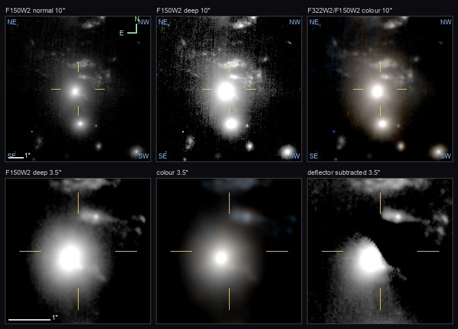{ width="100%" }](img/rank-096-orig.jpg){ target=_blank }
  <figcaption>What the judge saw (blind, footer removed)</figcaption>
</figure>

<figure markdown="span">
  [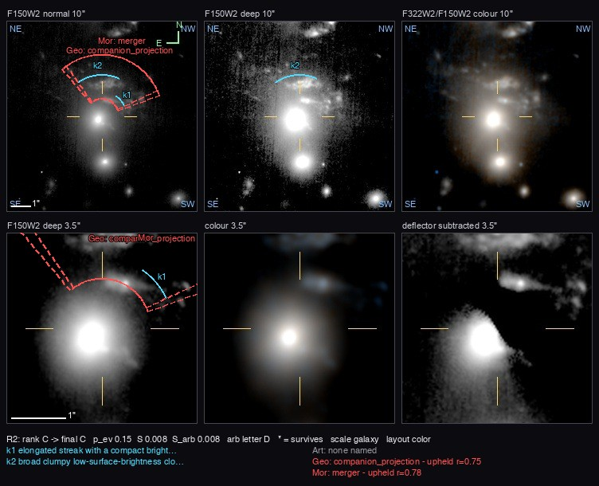{ width="100%" }](img/rank-096-annot.jpg){ target=_blank }
  <figcaption>Advocate evidence (cyan) and critic alternatives coloured by the arbitrator ruling</figcaption>
</figure>

???+ note "Why this grade — advocate, critics, arbitrator"
    **Letter C** (deployed, rule R2) · p_evidence 0.15 · S_arb 0.008 · S 0.008 · scale galaxy

    Letter: letter_rank stands (D rule not met); p_evidence 0.15 < t_B 0.17 (calibrated at 5% FPR on clean negatives); not D: 2 item(s) located; no named critic covers every item at r >= 0.80.

    **Advocate**

    - criteria: source_contrast 4, low_surface_brightness 5, curvature 2, counter_image 1, arc_morphology 3
    - items (2):
        - k1 — “elongated streak with a compact bright knot at its inner end, NW of the ticked galaxy; runs from r~1.0" out to r~1.7", long axis only ~30 deg from the radial direction (i.e. mostly radial, needle-like), clearly present in the deep zoom (d) and the 10" deep panel (b) as well as in the residual (f)” (panel d, r 1.3 arcsec, PA 295->325, visible in direct: yes; criteria: source_contrast, low_surface_brightness)
        - k2 — “broad clumpy low-surface-brightness cloud filling the north edge of the zoom and continuing in the 10" deep panel as a chain of knots ~1.7-3" N/NNE of the deflector; bluish/white in the colour panels versus the orange deflector, but its knots lie at growing radius and it is not concave toward the tick centre” (panel b, r 2.2 arcsec, PA 335->35, visible in direct: yes; criteria: source_contrast, low_surface_brightness)
    - scale galaxy; red neighbours within 10 arcsec 3; BCG-like halo no; deflector is centre no
    - p_evidence: 0.15
    - notes: “The only offset features are a mostly radial NW streak+knot at r~1.0-1.7" (long axis within ~30 deg of the radius vector, no measurable concavity toward the tick centre, nothing at the mirror PA ~130 at r 0.8-1.8" in (d), (e) or (f)) and a clumpy blue cloud to the north whose knots grow in radius with angle; the bright compact object 2.3" south (PA~188) is not opposite either feature and shows no tangential elongation, so no fixed-radius or counter-image test is passed.”

    **Critics**

    **artifact — no alternative named (nothing in its competence fits)**

    - leaves standing: k1, k2
    - scale_class: galaxy
    - measured: `{"artefact_geometry": "no mosaic seam, dither edge, amplifier stripe or saturation bleed crosses the 10\" field; background gradient is smooth", "item1_visibility": "streak PA~295-325, r 1.0-1.7\" is present in un-subtracted (d) and (b) and shows as a faint bluish smudge in colour zoom (e), so it is sky, not a panel-(f) subtraction artefact", "item2_visibility": "north clumpy cloud at r~1.7-3\", PA 335-35 appears in both (b) and the two-band colour panels (c)/(e), i.e. in both filters - excludes cosmic ray, snowball, persistence or single-band striping", "spike_origin_test": "streak's inner end (bright knot) sits at r~1.0\", not pinned to the core, so it cannot be a radial ray of a PSF", "spike_test": "no mirrored counterpart at the opposite PA 115-145 deg, and the brighter compact source ~2\" S of the tick in panel (a) shows no 6-spike pattern at all - nothing in this field is bright enough to raise NIRCam spikes"}`
    - notes: “Both located features are traceable in the un-subtracted deep panels (b) and (d) and in both filters of the colour panels, so neither is a subtraction residual, cosmic ray, snowball or 1/f stripe; the NW needle is not a diffraction spike because it lacks a counter-spike at PA~115-145, starts 1.0" off the core, and the brighter southern neighbour in (a) raises no spikes either. I find no instrumental or reduction explanation - the interpretation of the needle and the northern clumpy cloud is a morphology question, not an artifact one.”
    - ruling: no ruling for this critic

    **geometry — companion_projection:** “A separate clumpy, knotty neighbour/companion system lying N to NW of the ticked galaxy: its inner condensation plus radial streak (item 1) and its outer knot chain (item 2) form one continuous, one-sided structure whose knots lie at steadily increasing radius and whose long axes are nearly radial, i.e. a superposed/interacting neighbour rather than tangential images of a background source.”

    - location: r 0.9-3.2 arcsec, PA 295->35
    - accounts for: k1, k2; leaves standing: none; strength r 0.75; coverage a 1.00 (geometric)
    - scale_class: galaxy
    - measured: `{"colour": "item 1 knot and item 2 knots are both bluish-white in (e), consistent with one star-forming neighbour system, but colour not used as the argument", "counter_image_search": "no counterpart of item 1 at r=1.1-1.6\", PA 115-145 in (d)/(e); no counterpart of item 2 at r=1.8-3.0\", PA 155-215 in (b) - the only object there is a compact round bright galaxy ~2.5\" S with a de Vaucouleurs-like core, profile incompatible with an arc image", "implied_centre_of_curvature_offset_arcsec": ">=3 north of the tick centre for any circle fitted through the N knot chain (a lens requires <~0.3\")", "item1_long_axis_vs_radial_deg": "~30 (tangential arc would be ~90); the NW streak at r=1.0-1.7\", PA 295-325, is a straight needle with its brightest knot at the INNER end, no curvature concave to the tick centre", "item2_radius_growth_along_chain": "knots run from r~1.7\" at PA~350 to r~3.0\" at PA~15-35 in panel (b): dr/dphi clearly positive, not constant radius", "surface_brightness_consistency": "item 1 is a compact-nucleus + tail (peaked profile); item 2 is diffuse patchy knots - not consistent as multiple images of one source"}`
    - notes: “In (d) the NW feature at r~1.3" is a straight needle pointing back at the core (long axis ~30 deg from radial) with its bright knot on the inner end, and in (b) it merges with the knot chain that climbs from r~1.7" (PA~350) to r~3" (PA~15-35) - a one-sided, outward-spreading clumpy neighbour, not a fixed-radius arc; the SE and S quadrants at the same radii are blank of any counter-image.”
    - ruling: upheld, covers k1, k2 — “In panel (d) the NW feature at r~1.0-1.7" is a straight needle whose brightest knot sits at the INNER end and whose long axis is only ~30 deg from the radius vector, and in (b)/(c) it merges with a knot chain that climbs from r~1.7" at PA~350 to r~3" at PA~15-35, so radius grows with angle - a one-sided superposed clumpy neighbour, not a fixed-radius tangential image.”

    **morphology — merger:** “The ticked galaxy sits inside a single large diffuse envelope (panel c) that also contains a chain of clumps running NW->N->NE and a compact knot with a radial plume; this is an interacting/disturbed system with tidal debris and a disrupting companion, not a tangential lensed configuration.”

    - location: r 0.9-3.2 arcsec, PA 290->40
    - accounts for: k1, k2; leaves standing: none; strength r 0.78; coverage a 1.00 (geometric)
    - scale_class: galaxy
    - measured: `{"counter_image_test": "opposite sector PA 110-215 at r=1.0-3.0\" in (d) and (c) is smooth and empty apart from a round compact neighbour ~2.4\" S with no tangential elongation", "curvature_test": "no segment of either feature is concave toward the tick centre; the NW streak is convex/radial", "envelope": "common low-surface-brightness envelope in (c) encloses the deflector and all northern clumps, brightest along a N-S disturbed axis", "item1_long_axis_vs_radial_deg": "~25-35 deg, i.e. needle points outward from the tick centre rather than lying tangentially; knot at r~1.0\" with smear extending to r~1.7\" in (d)", "item2_radius_vs_angle": "knots rise monotonically from r~1.7\" at PA~350 to r~3\" at PA~20-35 in (c) - radius grows with angle, no fixed-radius locus"}`
    - notes: “In (d) the NW feature at r~1.0-1.7", PA~295-325 is a bright knot trailing an outward-pointing smear (its long axis ~30 deg from radial), exactly the geometry of a small companion plus tidal plume, and it continues into the clump chain that fills the top of (d) and spreads to r~3" at PA~350-35 in (c) with radius growing with angle. Both features share the same diffuse envelope as the host and neither is concave toward the tick centre nor has any counterpart in the southern sector, so tidal debris in an ongoing merger explains them better than a lensed arc.”
    - ruling: upheld, covers k1, k2 — “The same NW knot-plus-outward-smear and the northern clump chain sit inside one low-surface-brightness envelope visible in (b) and (c) that also encloses the ticked galaxy and the compact neighbour ~2.4" S, with no counterpart anywhere in PA 110-215 at r=1.0-3.0" - the classic geometry of tidal debris plus a disrupting companion.”

    **Arbitrator**

    - surviving items: none (0 of 2)
    - letter_llm: D; scale_class_final: galaxy; needs_human: no
    - rationale: “The artifact critic found no instrumental explanation and named no alternative, correctly noting that both features appear in the un-subtracted deep panels (b) and (d) and in both filters of the colour panels, so the panel-(f) butterfly/dipole caveat is irrelevant here and neither feature is a subtraction residual, cosmic ray or spike (nothing in the field raises a 6-spike pattern, and the NW needle has no counter-ray at PA~115-145). But being real sky is not being a lens: the two surviving candidates fail the geometric tests on pixels that both remaining critics measured the same way. Item 1 in (d) and (f) is a compact bright knot at r~1.0" NW of the tick centre trailing an outward smear to r~1.7", long axis only ~25-35 deg from radial, with no concavity toward the deflector and no mirror feature at PA~130 at the same radius in (d), (e) or (f); item 2 in (b) and (c) is a clumpy bluish chain whose knots climb monotonically from r~1.7" at PA~350 to r~3" at PA~15-35, so any circle through them centres >3" north of the tick, versus the <~0.3" a lens requires. The only object in the opposite sector is the round compact galaxy ~2.4" S with a peaked, de Vaucouleurs-like profile and zero tangential elongation - not a counter-image. Both upheld alternatives (a projected/interacting clumpy neighbour system, equivalently tidal debris in a disturbed envelope) cover items 1 and 2 completely; nothing survives, so D. No deeper data is needed to settle this - the absence of tangential curvature and of any southern counter-image is already resolved at 0.031"/px.”

    **Score**

    - S = p_ev x prod(1 - r_i a_i) = 0.15 x (1 - 0.75x1.00) x (1 - 0.78x1.00) = 0.008
        - terms: geometry companion_projection r 0.75 a 1.00; morphology merger r 0.78 a 1.00
    - S_arb = p_ev x prod_{upheld/partial}(1 - r_i a_i') = 0.15 x (1 - 0.75x1.00) x (1 - 0.78x1.00) = 0.008
        - terms: geometry companion_projection r 0.75 a 1.00 (upheld); morphology merger r 0.78 a 1.00 (upheld)
    - stored grade_pred (on S): C — S 0.008 < t_B 0.17 (calibrated at 5% FPR on clean negatives); not D: 2 item(s) located; no named critic covers every item at r >= 0.80
    - stored letter_arb (on S_arb): C; letter_source: opus5_api_calibrated
    - deploy rule R2: letter_rank (advocate only, on p_evidence) = C — p_evidence 0.15 < t_B 0.17 (calibrated at 5% FPR on clean negatives); not D: 2 item(s) located; no named critic covers every item at r >= 0.80
    - deploy rule R2: letter_final = C — letter_rank stands (D rule not met); p_evidence 0.15 < t_B 0.17 (calibrated at 5% FPR on clean negatives); not D: 2 item(s) located; no named critic covers every item at r >= 0.80
    - veto: none (letter_final == letter_rank)

---

## Rank 97: J18939200+6216064 {#rank-97}

| Original grade | Passes | Inspector conf. | Pipeline θ_E |
|:--:|:--:|:--:|:--:|
| **U** | — | 25 | 1.30″ |

| New (final) | Rank letter | p_ev | S_arb | Demoted by | Arb. letter | Needs human |
|:--:|:--:|--:|--:|:--|:--:|:--:|
| **B** | B | 0.20 | 0.033 | — | D | no |

<small>pipeline discovery status `new` · scale class `galaxy`</small>

<figure markdown="span">
  [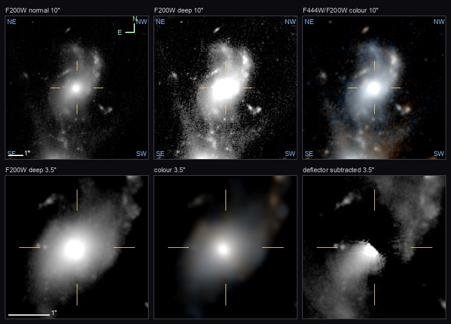{ width="100%" }](img/rank-097-orig.jpg){ target=_blank }
  <figcaption>What the judge saw (blind, footer removed)</figcaption>
</figure>

<figure markdown="span">
  [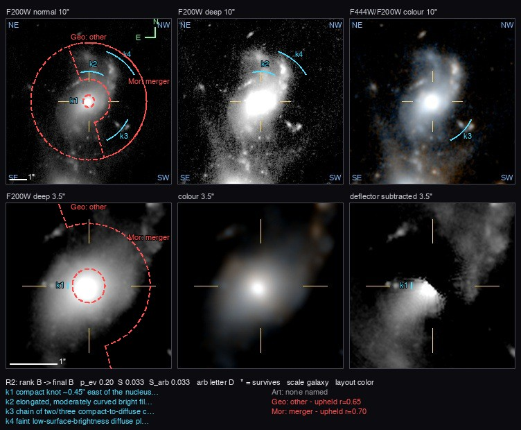{ width="100%" }](img/rank-097-annot.jpg){ target=_blank }
  <figcaption>Advocate evidence (cyan) and critic alternatives coloured by the arbitrator ruling</figcaption>
</figure>

???+ note "Why this grade — advocate, critics, arbitrator"
    **Letter B** (deployed, rule R2) · p_evidence 0.20 · S_arb 0.033 · S 0.033 · scale galaxy

    Letter: letter_rank stands (D rule not met); p_evidence 0.20 >= t_A 0.20 (calibrated at 1% FPR on clean negatives) but A is blocked: only 0 of 3 configuration criteria >= 6; p_evidence 0.20 >= t_B 0.17 (calibrated at 5% FPR on clean negatives).

    **Advocate**

    - criteria: source_contrast 5, low_surface_brightness 6, curvature 3, counter_image 2, arc_morphology 3
    - items (4):
        - k1 — “compact knot ~0.45" east of the nucleus, sitting on the edge of the saturated core: a small discrete bump in the deep zoom (d) and a one-sided, non-mirrored compact bright spot on the east rim of the residual in (f)” (panel f, r 0.45 arcsec, PA 80->100, visible in direct: yes; criteria: source_contrast, low_surface_brightness)
        - k2 — “elongated, moderately curved bright filament N to NW of the deflector, brightest at r~1.8", concave toward the south-east; its inner end appears continuous with the galaxy envelope in (d)” (panel b, r 1.8 arcsec, PA 330->15, visible in direct: yes; criteria: low_surface_brightness, curvature, arc_morphology)
        - k3 — “chain of two/three compact-to-diffuse clumps SW at r~2.4-3", distinctly orange/tan in the two-band colour panel against the blue-white envelope of the deflector, i.e. a different colour and profile from the deflector light” (panel c, r 2.6 arcsec, PA 205->245, visible in direct: yes; criteria: source_contrast, low_surface_brightness)
        - k4 — “faint low-surface-brightness diffuse plume extending NW beyond the bright filament out to r~3.5", broad and fan-shaped rather than thin” (panel b, r 3.2 arcsec, PA 300->340, visible in direct: yes; criteria: low_surface_brightness)
    - scale galaxy; red neighbours within 10 arcsec 2; BCG-like halo yes; deflector is centre no; arc radius 1.8 arcsec; arc PA span 330->15; centre-of-curvature offset 1.6 arcsec
    - p_evidence: 0.20
    - notes: “The N/NW filament in (b) and (d) broadens outward and joins the galaxy envelope through a continuous stellar bridge, and its estimated centre of curvature lands ~1.6" off the ticked nucleus, so its arc test fails; the only clean geometric item is the 0.45" east knot on the core rim in (d)/(f), for which no matching counter-image is visible on the west side inside the saturated core, and the orange SW clump chain lies at a different radius and is not opposite anything.”

    **Critics**

    **artifact — no alternative named (nothing in its competence fits)**

    - leaves standing: k1, k2, k3, k4
    - scale_class: galaxy
    - measured: `{"diffraction_spikes_detected": "none - no straight radial rays at fixed PA from the ticked core or from any field source in (a)/(b); the bright core shows a smooth round halo only", "items_absent_from_direct_panels": "0 of 4 - item 1 knot at r~0.45\", PA~90 is a discrete bump in (d); item 2 filament PA 330-15 at r~1.8\" is bright in (a) and (b); item 3 SW clumps r~2.4-3\" appear in (a),(b),(c),(e); item 4 NW plume is in (b) alone-stretch, still an un-subtracted panel", "residual_pattern_in_f": "large one-sided bright lobe N/NW plus concentric ring edge - consistent with the stated circular-profile artefact set, so not usable either way, but the E knot in (f) is co-located with the direct bump in (d)", "snowball_or_cosmic_ray": "none - no sharp-edged circular or streaked high-count blob within r<4\" in (a)/(b)/(d)", "striping_or_seams": "no 1/f row/column striping, no mosaic seam or coverage edge crossing the 10\" field in (a) or (b)"}`
    - notes: “No instrumental signature accounts for any item: no 6-spike pattern, no snowball, no striping, no detector seam anywhere in (a)/(b), and no bright neighbour close enough to lay PSF wings over r=1.8-3.2". Every located feature (knot at r~0.45" PA~90, filament PA 330-15, SW clumps PA 205-245, NW plume PA 300-340) is present in un-subtracted panels (a),(b),(d) or (c),(e), so subtraction_residual is inadmissible; their nature is a morphology question, not an artefact one.”
    - ruling: no ruling for this critic

    **geometry — other:** “No coherent lens configuration: the located items are knots/filaments scattered through one clumpy, disturbed host at four mutually unrelated radii (~0.45", 1.8", 2.6", 3.2") and four non-paired position angles, none tangential about the tick centre and none with a counter-image at a compatible radius”

    - location: r 0.35-3.5 arcsec, PA 0->360
    - accounts for: k1, k2, k3, k4; leaves standing: none; strength r 0.65; coverage a 1.00 (geometric)
    - scale_class: galaxy
    - measured: `{"counter_image_search": "annulus r=1.5-2.1\", PA 150-190 in (b) is smooth envelope only; annulus r=2.4-3.0\", PA 25-65 shows no matching clump chain", "curvature_centre_offset_arcsec": ">=1 (curvature of item 2 is weak and its implied centre does not fall on the tick centre)", "item2_geometry": "inner end runs radially into the envelope in (d)/(b); filament axis inclined ~30-40 deg to the local tangent, not tangential at fixed radius", "pa_pairing_deviation_deg": "item2 (PA~350) vs item3 (PA~225) separated by 125 deg, not 180; item1 (PA~90) has no mirror at PA~270 in (d)", "radius_spread_of_items_arcsec": "0.45 -> 3.2 (factor ~7); no two items share a radius within 30%"}`
    - notes: “In (d) the eastern bump at r~0.45", PA~90 has no counterpart on the western rim at the same radius, and in (b) the bright N-NW filament at r~1.8" runs outward from the envelope with no southern counter-arc at r~1.8"; the SW clump chain at r~2.4-3", PA~225 is 125 deg (not 180 deg) from it and 45% further out, so the items cannot be images of one source about the ticked nucleus.”
    - ruling: upheld, covers k1, k2, k3, k4 — “In panel (d) the eastern nub at r~0.45" has no mirror on the smooth western rim, the N/NW filament at r~1.8" (b, d) runs radially out of the envelope with nothing at PA~170 at the same radius, and the SW clump chain at r~2.4-3" sits 125 deg (not 180 deg) away and ~45% further out, so no two items can be images of one source about the ticked nucleus.”

    **morphology — merger:** “The ticked galaxy sits inside a large, asymmetric clumpy common envelope (obvious in the 10" colour panel): several bright knots at NW (r~1.5-2"), a tan clump pair to the SW (r~2.5-3") and a broad low-surface-brightness fan to the NW, all embedded in continuous light joined to the host - a disturbed/interacting clumpy system with tidal plume, not arcs at a fixed radius.”

    - location: r 1.3-3.5 arcsec, PA 195->20
    - accounts for: k2, k3, k4; leaves standing: k1; strength r 0.70; coverage a 0.75 (geometric)
    - scale_class: galaxy
    - measured: `{"clump_count_within_10arcsec": ">=4 discrete knots at PA 300-345 and 200-245, none paired at equal radius on opposite sides", "counter_arc_at_matching_radius": "absent - nothing at PA 150-170 to mirror item 2, nothing at PA 25-65 to mirror item 3", "envelope_shape": "irregular, elongated ~NE-SW over the full 3.5\" zoom, boundary lumpy not elliptical", "item2_inner_end": "continuous with host envelope in (d) at r~1.0-1.4\", PA~340-355; brightness declines outward monotonically", "radius_spread_of_cited_features_arcsec": "1.8 (item2) to 3.2 (item4) to 2.6 (item3) - factor ~1.8 spread, no common radius"}`
    - notes: “In panel (c) the ticked core is embedded in a broad clumpy halo with white/tan knots at upper right (NW, r~1.5-2") and lower right (SW, r~2.5-3") plus a diffuse fan further NW; panel (d) shows the NW filament's inner end merging smoothly into the host envelope at r~1.2", PA~345, and the light between the knots is continuous rather than a thin constant-radius arc. Item 1 (the 0.45" bump east of the core, visible as a small nub touching the E tick in (d)) is too close in and too compact for me to attribute to the tidal structure, so I leave it standing.”
    - ruling: upheld, covers k2, k3, k4 — “Panels (b) and (d) show the NW filament's inner end merging continuously into the host envelope at r~1.2", PA~345, with a broad fan-shaped low-surface-brightness plume beyond it and tan knots to the SW in (c)/(e), i.e. a lumpy asymmetric common envelope of a disturbed/interacting system, not a thin constant-radius arc.”

    **Arbitrator**

    - surviving items: none (0 of 4)
    - letter_llm: D; scale_class_final: galaxy; needs_human: no
    - rationale: “The 10" panels (a)/(b) show the ticked galaxy embedded in an irregular, lumpy envelope with a bright arm/plume sweeping N to NW, a fan of low-surface-brightness light beyond it to r~3.5", and a chain of tan clumps to the SW at r~2.4-3" - the classic signature of a disturbed or interacting clumpy system rather than a lens: no feature holds a fixed radius, the N/NW filament in (d) is joined to the host by a continuous stellar bridge at r~1.2" and its weak curvature implies a centre ~1.6" off the tick centre, and the annuli that would hold counter-images (r=1.5-2.1" at PA 150-190; r=2.4-3.0" at PA 25-65) are bare envelope. The one item not covered by the merger reading, the compact bump ~0.45" east of the core seen in (d) and as a one-sided bright spot on the east rim in (f), is unpaired: the western rim at the same radius is featureless, and a single asymmetric knot sitting on the edge of the saturated core with no counter-image and no tangential extent is far more naturally a clump or blended companion of this disturbed system, so the geometry refutation covers it too. The artefact reviewer found no spikes, striping, snowballs or PSF wings and every item is present in un-subtracted panels, so the circular-profile residual in (f) neither adds nor removes evidence. Nothing survives; classify as not a lens.”

    **Score**

    - S = p_ev x prod(1 - r_i a_i) = 0.20 x (1 - 0.65x1.00) x (1 - 0.70x0.75) = 0.033
        - terms: geometry other r 0.65 a 1.00; morphology merger r 0.70 a 0.75
    - S_arb = p_ev x prod_{upheld/partial}(1 - r_i a_i') = 0.20 x (1 - 0.65x1.00) x (1 - 0.70x0.75) = 0.033
        - terms: geometry other r 0.65 a 1.00 (upheld); morphology merger r 0.70 a 0.75 (upheld)
    - stored grade_pred (on S): C — S 0.033 < t_B 0.17 (calibrated at 5% FPR on clean negatives); not D: 4 item(s) located; no named critic covers every item at r >= 0.80
    - stored letter_arb (on S_arb): C; letter_source: opus5_api_calibrated
    - deploy rule R2: letter_rank (advocate only, on p_evidence) = B — p_evidence 0.20 >= t_A 0.20 (calibrated at 1% FPR on clean negatives) but A is blocked: only 0 of 3 configuration criteria >= 6; p_evidence 0.20 >= t_B 0.17 (calibrated at 5% FPR on clean negatives)
    - deploy rule R2: letter_final = B — letter_rank stands (D rule not met); p_evidence 0.20 >= t_A 0.20 (calibrated at 1% FPR on clean negatives) but A is blocked: only 0 of 3 configuration criteria >= 6; p_evidence 0.20 >= t_B 0.17 (calibrated at 5% FPR on clean negatives)
    - veto: none (letter_final == letter_rank)

---

## Rank 98: J1747804-3079539 {#rank-98}

| Original grade | Passes | Inspector conf. | Pipeline θ_E |
|:--:|:--:|:--:|:--:|
| **U** | — | 25 | 0.82″ |

| New (final) | Rank letter | p_ev | S_arb | Demoted by | Arb. letter | Needs human |
|:--:|:--:|--:|--:|:--|:--:|:--:|
| **B** | B | 0.30 | 0.041 | — | D | no |

<small>pipeline discovery status `new` · scale class `galaxy`</small>

<figure markdown="span">
  [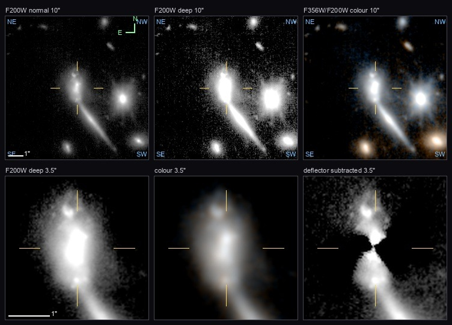{ width="100%" }](img/rank-098-orig.jpg){ target=_blank }
  <figcaption>What the judge saw (blind, footer removed)</figcaption>
</figure>

<figure markdown="span">
  [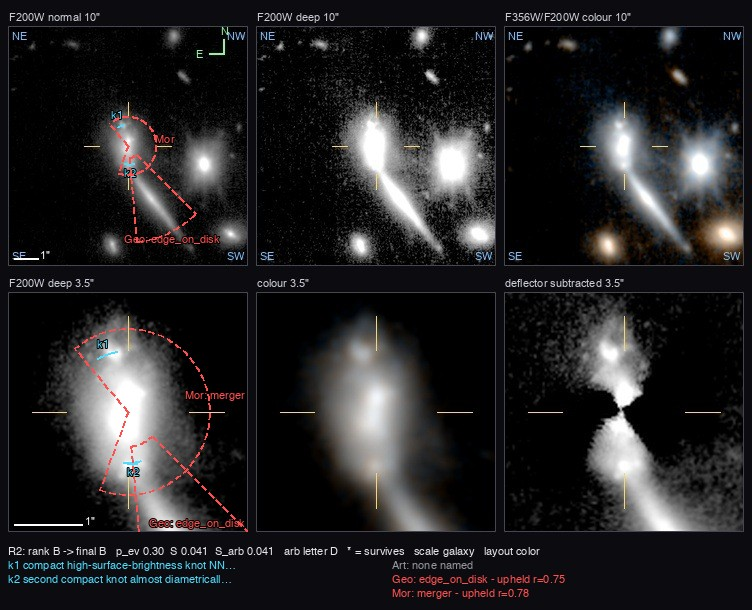{ width="100%" }](img/rank-098-annot.jpg){ target=_blank }
  <figcaption>Advocate evidence (cyan) and critic alternatives coloured by the arbitrator ruling</figcaption>
</figure>

???+ note "Why this grade — advocate, critics, arbitrator"
    **Letter B** (deployed, rule R2) · p_evidence 0.30 · S_arb 0.041 · S 0.041 · scale galaxy

    Letter: letter_rank stands (D rule not met); p_evidence 0.30 >= t_A 0.20 (calibrated at 1% FPR on clean negatives) but A is blocked: only 0 of 3 configuration criteria >= 6; p_evidence 0.30 >= t_B 0.17 (calibrated at 5% FPR on clean negatives).

    **Advocate**

    - criteria: source_contrast 4, low_surface_brightness 3, curvature 1, counter_image 4, arc_morphology 1
    - items (2):
        - k1 — “compact high-surface-brightness knot NNE of the ticked nucleus, distinct from the smooth envelope, clear in (a)/(b)/(d) and the brightest positive residual in (f)” (panel d, r 0.9 arcsec, PA 10->30, visible in direct: yes; criteria: source_contrast, counter_image)
        - k2 — “second compact knot almost diametrically opposite the first (PA offset ~166 deg) at a comparable radius (radius ratio 0.8), also a strong one-sided positive residual in (f); it sits at the head of the elongated SW streak” (panel d, r 0.75 arcsec, PA 175->195, visible in direct: yes; criteria: counter_image)
    - scale galaxy; red neighbours within 10 arcsec 3; BCG-like halo no; deflector is centre yes; arc radius 0.9 arcsec; counter-image at r 0.75 arcsec PA 185
    - p_evidence: 0.30
    - notes: “Two compact knots straddle the ticked nucleus at r~0.9" (PA~19) and r~0.75" (PA~185) and dominate the (f) residual, but the southern knot is continuous with a long, perfectly STRAIGHT needle running from r~1.5" out to ~5" at PA~225 in (a)/(b) - an edge-on disc or tidal tail - so no tangential curvature is measurable anywhere and the pair may be a double nucleus/merger rather than a two-image lens.”

    **Critics**

    **artifact — no alternative named (nothing in its competence fits)**

    - leaves standing: k1, k2
    - scale_class: galaxy
    - measured: `{"item1_direct_visibility": "present as a distinct compact peak in (a), (b) and (d) at r~0.9\", PA~20; not a subtraction-only feature", "item2_direct_visibility": "present in (a), (b), (d) at r~0.75\", PA~185, coincident with the bright head of the SW linear streak", "nearest_bright_neighbour": "compact bright source ~2.5-3\" west (PA~270-285) in panels (a)-(c); no 6-spike pattern radiates from it across the ticked galaxy, and its PSF wings would be an east-west gradient, not two compact knots at PA 20 and 185", "residual_pattern_in_f": "the central dark bowtie/dipole in (f) is the expected circular-profile artefact and was not counted; the two positive knots in (f) sit exactly on the direct-image peaks", "spike_axis_test": "the two knots lie at PA 20 and 185 (offset ~165 deg), i.e. not a straight ray through the core at the NIRCam spike angles, and each is spatially resolved rather than a sharp-edged cosmic-ray/snowball"}`
    - notes: “Both knots are unambiguously present in the un-subtracted panels (a), (b) and (d), so the (f) residual cannot be blamed; they are not on a diffraction spike, not aligned with the bright western neighbour's PSF wings, and show no snowball/cosmic-ray sharp edges or striping. Within instrument/reduction competence I find no artefact explanation for items 1 and 2; whether they are lensed images or host structure (the SW streak head) is a morphology question.”
    - ruling: overruled — “No alternative was named - the critic explicitly confirms both knots are real peaks in the un-subtracted (a), (b), (d) panels and offers no instrumental explanation, so nothing is refuted on artefact grounds.”

    **geometry — edge_on_disk:** “The southern 'counter-image' is the bulge/NE tip of a straight, thin edge-on disc (needle) that runs continuously from ~0.7" S of the ticked nucleus out to the SW corner of the 10" field at PA~205-215; it is a linear, non-tangential structure, not an image formed about the deflector.”

    - location: r 0.5-4 arcsec, PA 185->225
    - accounts for: k2; leaves standing: k1; strength r 0.75; coverage a 0.50 (geometric)
    - scale_class: galaxy
    - measured: `{"centre_of_curvature_offset_arcsec": "undefined - no arc to fit", "counter_image_for_item1": "none at compatible radius once item 2 is assigned to the needle", "item1_elongation": "compact, axis ratio ~1.2, no tangential stretch at r=0.9\"", "item2_elongation": "radial/linear along the streak, not tangential", "pa_offset_between_knots_deg": 166, "radius_ratio": 0.83, "streak_PA_deg": "~207, straight; no measurable curvature about the ticked nucleus", "streak_length_arcsec": "~3.5 (from r~0.7\" S of nucleus to SW field edge in panel b)"}`
    - notes: “In panel (b) a thin straight needle emerges just S of the yellow ticks and runs unbroken to the SW corner (PA~207, length >3"); the knot at r=0.75", PA~180-190 in (d) sits exactly at its bright NE end and shares its colour in (e), so it is that disc's bulge rather than a counter-image. Item 1 (r=0.9", PA~20) is a compact, untangentially-elongated knot left with no partner and is not explained by this configuration argument.”
    - ruling: upheld, covers k2 — “Panels (a)/(b)/(c) show an unbroken, perfectly straight needle running from just S of the yellow ticks to the SW corner at PA~207 with radius growing monotonically, and the r~0.75" PA~185 knot sits exactly at its bright NE head, sharing its hue in (e) - a bulge/edge-on disc, not a counter-image.”

    **morphology — merger:** “A single disturbed, clumpy host: the two 'knots' are star-forming clumps/secondary nuclei sitting at the two ends of the galaxy's own elongated (NNE-SSW) bright body, embedded in one continuous stellar envelope, with a long straight low-surface-brightness streak (tidal tail / edge-on companion) running SSW out of the southern knot in the 10" colour panel”

    - location: r 0-1.2 arcsec, PA 160->40
    - accounts for: k1, k2; leaves standing: none; strength r 0.78; coverage a 1.00 (geometric)
    - scale_class: galaxy
    - measured: `{"envelope_continuity": "unbroken deep-stretch light bridges core to both knots in (d); no gap of sky between knots and nucleus", "host_major_axis_PA_deg": "~20/200 (bright body in (d) elongated NNE-SSW, same axis on which both knots lie)", "knot1_position": "r~0.9\", PA~20, compact and round, ~0.15-0.2\" across, no tangential elongation (axis ratio ~1)", "knot2_position": "r~0.75\", PA~185, compact, sits at the head of a straight streak", "streak": "linear feature from knot2 out to >3\" at PA~205-215 in panel (c), straight, radius growing monotonically - radial, not tangential"}`
    - notes: “In (d) both cited knots are round, unstretched blobs lying ON the host's own NNE-SSW major axis and joined to the nucleus by continuous envelope light - a lensed pair would be tangentially stretched perpendicular to that radius vector, and neither knot is. The southern knot in (c)/(d) feeds a straight ~3" streak toward PA~210 whose radius grows steadily with distance, the signature of a tidal tail/edge-on companion in a disturbed system, not of an arc at fixed radius.”
    - ruling: upheld, covers k1, k2 — “In the 3.5" deep panel (d) both knots are round, unstretched blobs lying ON the host's own NNE-SSW major axis and joined to the nucleus by continuous envelope light with no sky gap, while a lensed pair would be stretched tangentially, i.e. perpendicular to that same radius vector.”

    **Arbitrator**

    - surviving items: none (0 of 2)
    - letter_llm: D; scale_class_final: galaxy; needs_human: no
    - rationale: “The catalogued galaxy at the yellow ticks is a disturbed, clumpy system whose bright body in (d)/(e) is elongated NNE-SSW; the two features the scorer cited sit at the two ends of that same major axis (r~0.9", PA~20 and r~0.75", PA~185), are compact and round with axis ratio near unity, and are bridged to the nucleus by continuous deep-stretch envelope light rather than separated from it by sky. Neither shows a trace of tangential stretch at fixed radius, and there is no arc anywhere to fit a centre of curvature to. The southern knot is unambiguously the bright NE head of the long straight needle that runs unbroken from ~0.7" south of the ticks to the SW corner of the 10" field at PA~207 - a classic edge-on disc / tidal streak whose radius grows steadily with distance, exactly the opposite of an arc at constant radius. The two strong positive lobes in (f) coincide pixel-for-pixel with these direct-image peaks and are flanked by the dark central bowtie that the circular-profile subtraction is expected to produce on an elongated deflector, so the residual adds nothing. With the merger/clumpy-host reading accounting for both items and the edge-on-disc reading independently accounting for the southern one, no item survives; this is a non-lens and no deeper data are needed to say so.”

    **Score**

    - S = p_ev x prod(1 - r_i a_i) = 0.30 x (1 - 0.75x0.50) x (1 - 0.78x1.00) = 0.041
        - terms: geometry edge_on_disk r 0.75 a 0.50; morphology merger r 0.78 a 1.00
    - S_arb = p_ev x prod_{upheld/partial}(1 - r_i a_i') = 0.30 x (1 - 0.75x0.50) x (1 - 0.78x1.00) = 0.041
        - terms: geometry edge_on_disk r 0.75 a 0.50 (upheld); morphology merger r 0.78 a 1.00 (upheld)
    - stored grade_pred (on S): C — S 0.041 < t_B 0.17 (calibrated at 5% FPR on clean negatives); not D: 2 item(s) located; no named critic covers every item at r >= 0.80
    - stored letter_arb (on S_arb): C; letter_source: opus5_api_calibrated
    - deploy rule R2: letter_rank (advocate only, on p_evidence) = B — p_evidence 0.30 >= t_A 0.20 (calibrated at 1% FPR on clean negatives) but A is blocked: only 0 of 3 configuration criteria >= 6; p_evidence 0.30 >= t_B 0.17 (calibrated at 5% FPR on clean negatives)
    - deploy rule R2: letter_final = B — letter_rank stands (D rule not met); p_evidence 0.30 >= t_A 0.20 (calibrated at 1% FPR on clean negatives) but A is blocked: only 0 of 3 configuration criteria >= 6; p_evidence 0.30 >= t_B 0.17 (calibrated at 5% FPR on clean negatives)
    - veto: none (letter_final == letter_rank)

---

## Rank 99: J35128272-4120137 {#rank-99}

| Original grade | Passes | Inspector conf. | Pipeline θ_E |
|:--:|:--:|:--:|:--:|
| **U** | — | 26 | 0.69″ |

| New (final) | Rank letter | p_ev | S_arb | Demoted by | Arb. letter | Needs human |
|:--:|:--:|--:|--:|:--|:--:|:--:|
| **C** | C | 0.10 | 0.100 | — | — | no |

<small>pipeline discovery status `new` · scale class `none`</small>

<figure markdown="span">
  [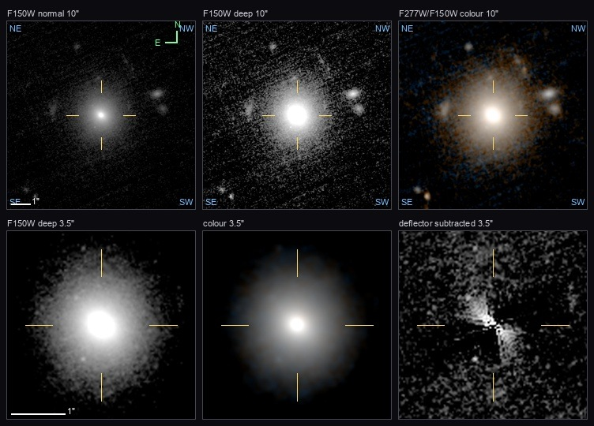{ width="100%" }](img/rank-099-orig.jpg){ target=_blank }
  <figcaption>What the judge saw (blind, footer removed)</figcaption>
</figure>

<figure markdown="span">
  [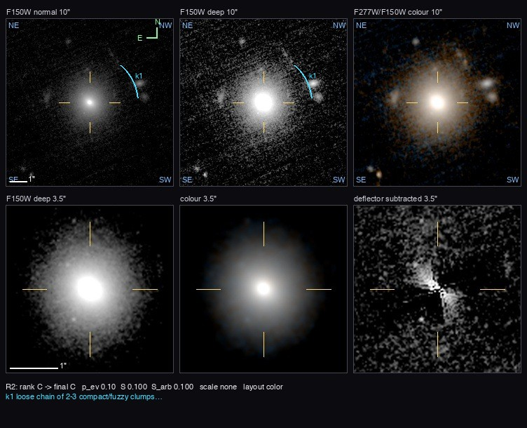{ width="100%" }](img/rank-099-annot.jpg){ target=_blank }
  <figcaption>Advocate evidence (cyan) and critic alternatives coloured by the arbitrator ruling</figcaption>
</figure>

???+ note "Why this grade — advocate, critics, arbitrator"
    **Letter C** (deployed, rule R2) · p_evidence 0.10 · S_arb 0.10 · S 0.10 · scale none

    Letter: letter_rank stands (D rule not met); p_evidence 0.10 < t_B 0.17 (calibrated at 5% FPR on clean negatives); not D: 1 item(s) located; no named critic covers every item at r >= 0.80.

    **Advocate**

    - criteria: source_contrast 3, low_surface_brightness 3, curvature 1, counter_image 1, arc_morphology 1
    - items (1):
        - k1 — “loose chain of 2-3 compact/fuzzy clumps NW-W of the deflector, slightly bluer than the orange halo in (c); no tangential elongation and no matching-radius counterpart on the SE side” (panel b, r 2.9 arcsec, PA 275->320, visible in direct: yes; criteria: source_contrast, low_surface_brightness)
    - scale none; red neighbours within 10 arcsec 1; BCG-like halo yes; deflector is centre no
    - p_evidence: 0.10
    - notes: “The 10" deep panel (b) shows a smooth, round, very extended envelope with only scattered compact field clumps to the NW at 2.5-4" (no tangential elongation, no SE counterpart within 40% of that radius), and the 3.5" zooms (d)/(e) are featureless out to the tick radius with the core saturated inside ~0.5"; the strong S-shaped/bowtie structure in (f) is the circular-model butterfly-plus-dipole artefact and is untraceable in (d) or (e), so it is neither counted nor used against the candidate.”

    **Critics**

    - not called (p_evidence 0.10 < tau0 0.15)

    **Arbitrator**

    - no arbitrator record (not called)

    **Score**

    - S = p_ev = 0.10 (no critic term entered the product)
    - S_arb = p_ev = 0.10 (no critic term entered the product)
    - stored grade_pred (on S): C — S 0.10 < t_B 0.17 (calibrated at 5% FPR on clean negatives); not D: 1 item(s) located; no named critic covers every item at r >= 0.80
    - stored letter_arb (on S_arb): C; letter_source: opus5_api_calibrated
    - deploy rule R2: letter_rank (advocate only, on p_evidence) = C — p_evidence 0.10 < t_B 0.17 (calibrated at 5% FPR on clean negatives); not D: 1 item(s) located; no named critic covers every item at r >= 0.80
    - deploy rule R2: letter_final = C — letter_rank stands (D rule not met); p_evidence 0.10 < t_B 0.17 (calibrated at 5% FPR on clean negatives); not D: 1 item(s) located; no named critic covers every item at r >= 0.80
    - veto: none (letter_final == letter_rank)

---

## Rank 100: J6928514+070232 {#rank-100}

| Original grade | Passes | Inspector conf. | Pipeline θ_E |
|:--:|:--:|:--:|:--:|
| **U** | — | 25 | 2.24″ |

| New (final) | Rank letter | p_ev | S_arb | Demoted by | Arb. letter | Needs human |
|:--:|:--:|--:|--:|:--|:--:|:--:|
| **B** | B | 0.30 | 0.054 | — | D | no |

<small>pipeline discovery status `new` · scale class `galaxy`</small>

<figure markdown="span">
  [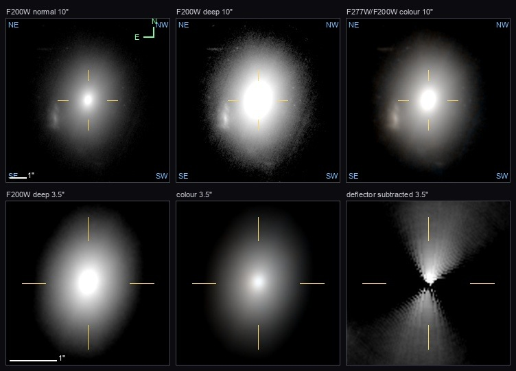{ width="100%" }](img/rank-100-orig.jpg){ target=_blank }
  <figcaption>What the judge saw (blind, footer removed)</figcaption>
</figure>

<figure markdown="span">
  [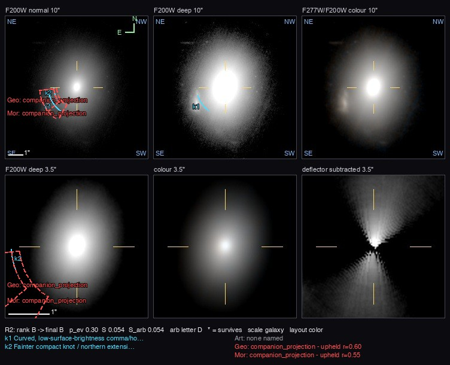{ width="100%" }](img/rank-100-annot.jpg){ target=_blank }
  <figcaption>Advocate evidence (cyan) and critic alternatives coloured by the arbitrator ruling</figcaption>
</figure>

???+ note "Why this grade — advocate, critics, arbitrator"
    **Letter B** (deployed, rule R2) · p_evidence 0.30 · S_arb 0.054 · S 0.054 · scale galaxy

    Letter: letter_rank stands (D rule not met); p_evidence 0.30 >= t_A 0.20 (calibrated at 1% FPR on clean negatives) but A is blocked: only 0 of 3 configuration criteria >= 6; p_evidence 0.30 >= t_B 0.17 (calibrated at 5% FPR on clean negatives).

    **Advocate**

    - criteria: source_contrast 5, low_surface_brightness 6, curvature 3, counter_image 2, arc_morphology 4
    - items (2):
        - k1 — “Curved, low-surface-brightness comma/hook-shaped feature east-southeast of the deflector core, brightest at r~2.0"; clearly extended (not point-like), with its concave side facing roughly west toward the deflector; orange/red in the two-band colour panel against the white deflector light” (panel b, r 2 arcsec, PA 105->145, visible in direct: yes; criteria: source_contrast, low_surface_brightness, curvature, arc_morphology)
        - k2 — “Fainter compact knot / northern extension of the same eastern complex, a diffuse blob at slightly smaller radius, same orange hue, forming a knot-chain with item 1” (panel a, r 1.6 arcsec, PA 92->112, visible in direct: yes; criteria: source_contrast, low_surface_brightness)
    - scale galaxy; red neighbours within 10 arcsec 1; BCG-like halo yes; deflector is centre yes; arc radius 2 arcsec; arc PA span 105->145; centre-of-curvature offset 1.5 arcsec
    - p_evidence: 0.30
    - notes: “The only located evidence is the eastern low-surface-brightness complex at r~1.6-2.0" (PA ~95-145) seen in (a), (b) and as an orange smudge in (c); the western hemisphere at the same radius shows no matching counter-image in any direct panel, the deep panels are dominated by the deflector's large smooth envelope inside ~2", and panel (f) shows only the four-lobed bowtie artefact expected from a circular model on this elongated galaxy, so it is uninformative here; a faint straight streak ~4.9" to the NE (PA ~47) is a needle, not tangential, and is not counted.”

    **Critics**

    **artifact — no alternative named (nothing in its competence fits)**

    - leaves standing: k1, k2
    - scale_class: galaxy
    - measured: `{"band_presence": "present in both the 10\" normal (a) and deep (b) grayscale panels AND coloured orange in the two-band panel (c), so it registers in both the SW and LW filters - excludes single-exposure cosmic-ray/snowball/persistence events", "curvature": "feature at r~1.6-2.0\" is curved/comma-shaped, i.e. not a straight radial ray, not a 1/f stripe, not a mosaic/dither edge", "item_pa_span_deg": "92-145, single-sided; no counter-feature at PA 272-325, so not a member of a 6-spike JWST diffraction pattern", "nearest_bright_source": "no saturated star or bleed trail anywhere in the 10\" field; the faint diagonal smudge in (b)/(c) at r~4\", PA~55-75 is well away from the items", "panel_f_content": "only the four-lobed bowtie plus concentric rings expected from a 1-D circular profile subtracted from an elliptical host; no offset tangential residual, but this is an artefact of the model and is evidence neither way"}`
    - notes: “Items 1 and 2 sit east-southeast of the core at r=1.6-2.0" in the un-subtracted panels (a), (b) and (c); they are curved, extended and one-sided, with no mirrored counterpart at PA~285-325, so they cannot be a diffraction spike, stripe, seam or bleed, and their appearance in both filters rules out a transient detector event. Panel (f) shows only the expected circular-model bowtie, which I do not count either way; nothing in my instrument/reduction competence explains the located features.”
    - ruling: no ruling for this critic

    **geometry — companion_projection:** “A small clumpy/irregular neighbour galaxy (a two-knot blob plus diffuse envelope) projected onto the ESE halo of the big smooth elliptical; its knots are its own substructure, not multiple images of one lensed source”

    - location: r 1.6-2.6 arcsec, PA 95->130
    - accounts for: k1, k2; leaves standing: none; strength r 0.60; coverage a 1.00 (geometric)
    - scale_class: galaxy
    - measured: `{"centre_of_curvature_offset_arcsec": "not measurable - no coherent curvature over so short a chord; concavity direction uncertain to >30 deg", "counter_image_search": "no source detected at r=2.0-2.6\", PA 270-320 (west side) in panel (b) deep stretch, where the halo surface brightness is comparable to that at the eastern feature", "deflector_centre_px_panel_b": "(245,275), tick centre", "elongation_axis_pa_deg": "~45 (knot chain runs NE-SW); local tangential direction at PA 110 is ~20 deg, so the chain is ~25-30 deg off tangential", "feature_centroid_px_panel_b": "(~138,313) -> dx=-107 px E, dy=+38 px S at ~0.022\"/px", "feature_extent_arcsec": "~0.7 long x ~0.35 wide, i.e. length/radius ~0.3 (opening angle ~17 deg)", "feature_pa_deg": 110, "feature_radius_arcsec": 2.3, "profile_match": "eastern complex is knotty/peaked; nothing of comparable profile exists anywhere else at fixed radius"}`
    - notes: “In panel (b) the only non-host feature near the ticks is the two-knot blob at ~(138,313) px, r~2.3", PA~110; its axis runs NE-SW, ~25-30 deg away from the tangential direction, and the mirrored position at PA~290, same radius, is blank at the same deep stretch. Panels (d) and (e) (3.5" zoom, i.e. r<1.75") show only smooth elliptical light, so no inner arc or radial counter-image supports a lensing configuration.”
    - ruling: upheld, covers k1, k2 — “In panel (b) the only non-host light near the ticks is the two-knot blob ~2.0-2.3" ESE (PA~110-120) whose knot chain runs NE-SW, well off the local tangential direction, and the mirrored annulus at PA~290 at the same deep stretch is blank halo, so the pair reads as one small clumpy neighbour rather than two images of a source.”

    **morphology — companion_projection:** “A small, separately-centred neighbour galaxy (compact tan/orange knot with a short fainter extension) projected onto the outer halo of the smooth elliptical, part of a small group: a second, morphologically similar tan patch sits at r~4.5", PA~45 (NE) in the same 10" panel, and neither has a counter-image.”

    - location: r 1.4-2.6 arcsec, PA 95->150
    - accounts for: k1, k2; leaves standing: none; strength r 0.55; coverage a 1.00 (geometric)
    - scale_class: galaxy
    - measured: `{"counter_image_search": "annulus r = 1.8-2.6\" at PA 280-320 (opposite side) is smooth halo light in panel (c); no counter-arc", "feature_centroid_10in_panel": "~93 px E, ~48 px S of the tick centre -> r ~ 2.3\", PA ~ 117 deg", "feature_extent": "~25 x 45 px (~0.55\" x 1.0\"), long axis roughly NNE-SSW, i.e. only ~30 deg from the radial direction, not a thin fixed-radius tangential arc", "host_structure": "panels (d) and (e) show a featureless elliptical isophote set out to ~1.7\": no arms, no bar, no shells, no host-centred ring", "second_similar_object": "tan patch at ~143 px E, ~147 px N -> r ~ 4.5\", PA ~ 44 deg, incompatible radius for the same lens configuration"}`
    - notes: “The only structure in the 3.5" direct zooms (d)/(e) is a smooth, untextured elliptical, so items 1-2 are not host spiral/shell/ring features; the cited light lies just outside the zoom crop and is seen only in panel (c) at r~2.3", PA~117 as a compact tan blob with a stubby extension, elongated nearly radially and unaccompanied by any counter-feature at PA~300. A twin tan patch at r~4.5", PA~44 in the same panel indicates a sprinkling of projected neighbours rather than a lensed configuration.”
    - ruling: upheld, covers k1, k2 — “The cited light is a compact tan blob with a stubby, nearly radial extension in (c) just outside the 3.5" crop, matched in appearance by a second tan patch at r~4.5", PA~44 in the same field, while the zooms (d)/(e) show a featureless elliptical with no host ring, arms or shells - a sprinkling of projected neighbours, not a lens configuration.”

    **Arbitrator**

    - surviving items: none (0 of 2)
    - letter_llm: D; scale_class_final: galaxy; needs_human: no
    - rationale: “The only located evidence is the eastern low-surface-brightness complex at r~1.6-2.3", PA~95-145, visible in the direct panels (a), (b) and as an orange/tan smudge in (c); the artifact critic offered no instrumental alternative and I make no ruling there, but both geometry and morphology independently and consistently resolve that complex as a small clumpy projected neighbour, and the pixels support them: the blob is compact (~0.5-0.7" across) with a knot chain elongated far from the local tangential direction at that position angle, it is not a thin feature at roughly constant radius, and at 0.031"/px an r~2" arc would span ~65 px from the core and would plainly show tangential curvature and surface-brightness structure, which this does not. The mirrored annulus at PA~280-320, r~1.8-2.6" in the deep panel (b) is smooth halo with no counter-arc or counter-image, and the 3.5" zooms (d)/(e) show only untextured elliptical isophotes with no inner arc or radial counter-image. Panel (f) contributes nothing either way: it shows exactly the four-lobed bowtie plus concentric rings expected when a 1-D circular profile is removed from this clearly elongated host, an artefact of the subtraction and not sky. With both items accounted for by the upheld companion-projection alternative and nothing surviving, this is a non-lens; a further tan patch at r~4.5", PA~44 at an incompatible radius reinforces that the field simply contains projected neighbours.”

    **Score**

    - S = p_ev x prod(1 - r_i a_i) = 0.30 x (1 - 0.60x1.00) x (1 - 0.55x1.00) = 0.054
        - terms: geometry companion_projection r 0.60 a 1.00; morphology companion_projection r 0.55 a 1.00
    - S_arb = p_ev x prod_{upheld/partial}(1 - r_i a_i') = 0.30 x (1 - 0.60x1.00) x (1 - 0.55x1.00) = 0.054
        - terms: geometry companion_projection r 0.60 a 1.00 (upheld); morphology companion_projection r 0.55 a 1.00 (upheld)
    - stored grade_pred (on S): C — S 0.054 < t_B 0.17 (calibrated at 5% FPR on clean negatives); not D: 2 item(s) located; no named critic covers every item at r >= 0.80
    - stored letter_arb (on S_arb): C; letter_source: opus5_api_calibrated
    - deploy rule R2: letter_rank (advocate only, on p_evidence) = B — p_evidence 0.30 >= t_A 0.20 (calibrated at 1% FPR on clean negatives) but A is blocked: only 0 of 3 configuration criteria >= 6; p_evidence 0.30 >= t_B 0.17 (calibrated at 5% FPR on clean negatives)
    - deploy rule R2: letter_final = B — letter_rank stands (D rule not met); p_evidence 0.30 >= t_A 0.20 (calibrated at 1% FPR on clean negatives) but A is blocked: only 0 of 3 configuration criteria >= 6; p_evidence 0.30 >= t_B 0.17 (calibrated at 5% FPR on clean negatives)
    - veto: none (letter_final == letter_rank)

---

[:material-arrow-left: Ranks 51–75](ranks-051-075.md){ .md-button }
[:material-view-list: Overview](index.md){ .md-button }
